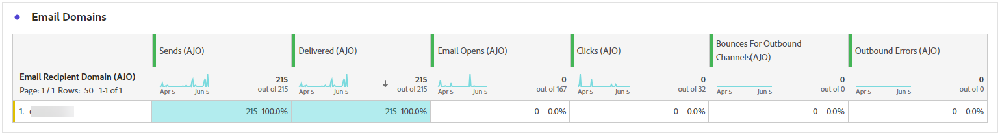
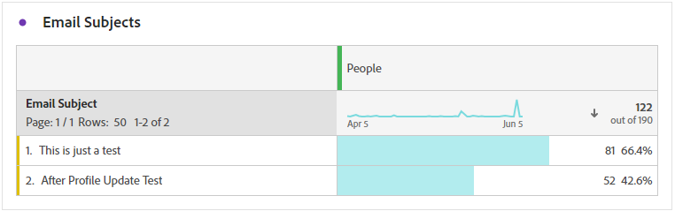

# 歷程報告 {#journey-global-report}

**歷程報告**&#x200B;可作為全方位儀表板，提供與您的歷程相關聯的基本量度分析。 這包含已輸入設定檔計數和失敗個別歷程例項等詳細資訊，提供歷程成效和參與層級的全面深入分析。

使用&#x200B;**[!UICONTROL 檢視報告]**&#x200B;按鈕，可以直接從您的歷程存取&#x200B;**歷程報告**。

根據您歷程中的訊息活動，**[!UICONTROL 歷程報告]**&#x200B;頁面將會顯示以下索引標籤：

* [歷程](#journey-global)
* [電子郵件](#email-global)
* [推播](#push-global)
* [簡訊](#sms-global)
* [應用程式內](#in-app-global)
* [Web](#web-cja)
* [直接郵件](#direct-mail-cja)

若要瞭解有關Customer Journey AnalyticsWorkspace以及如何篩選和分析資料的詳細資訊，請參閱[此頁面](https://experienceleague.adobe.com/en/docs/analytics-platform/using/cja-workspace/home)。

## 歷程概觀 {#journey-global}

**[!UICONTROL 歷程]**&#x200B;報告可讓您清楚檢視歷程最重要的追蹤資料。

### 歷程KPI {#journey-perfomance}

**[!UICONTROL 歷程]**&#x200B;關鍵績效指標(KPI)可作為全方位儀表板，提供與您的歷程相關之基本量度的分析。 這包含已輸入設定檔計數和失敗個別歷程例項等詳細資訊，提供歷程成效和參與層級的全面深入分析。

+++ 進一步瞭解歷程KPI量度

* **[!UICONTROL 歷程參與]**：與歷程所傳送之訊息互動的個人總數

* **[!UICONTROL 歷程進入者]**：到達歷程進入事件的個人總數。

* **[!UICONTROL 歷程結束]**：結束歷程的個人總數。

* **[!UICONTROL 歷程失敗]**：未成功執行的個別歷程總數。

+++

### 歷程統計資料 {#journey-stats}

**[!UICONTROL 歷程統計資料]**&#x200B;表格提供有關您歷程的重要資料的詳細摘要。 其中包括關鍵量度，例如失敗次數和成功登入次數，針對您的電子郵件和歷程的效能和觸及範圍提供有價值的深入分析。

+++ 進一步瞭解歷程統計量度

* **[!UICONTROL 歷程參與]**：與歷程所傳送之訊息互動的個人總數。

* **[!UICONTROL 歷程進入者]**：到達歷程進入事件的個人總數。

* **[!UICONTROL 歷程結束]**：結束歷程的個人總數。

* **[!UICONTROL 歷程失敗]**：未成功執行的個別歷程總數。

* **[!UICONTROL 進入的不重複歷程]**：到達歷程進入事件的個人總數，不會考量一個設定檔的多個互動。

* **[!UICONTROL 唯一歷程結束]**：結束歷程的個人總數，不會考量一個設定檔的多個互動。

* **[!UICONTROL 不重複歷程失敗]**：未成功執行的個別歷程總數，未考慮一個設定檔的多個互動。

+++

## 歷程畫布 {#journey-canvas}

**[!UICONTROL 歷程畫布]** Widget可讓您在目標設定檔瀏覽您的歷程時，以視覺化方式追蹤其軌跡。 [在Customer Journey Analytics檔案中進一步瞭解](https://experienceleague.adobe.com/en/docs/analytics-platform/using/cja-workspace/visualizations/journey-canvas/journey-canvas)

使用下列選項增強畫布自訂功能：

* 從&#x200B;**[!UICONTROL 節點型別]**&#x200B;下拉式功能表中新增或移除所需的活動型別，例如訊息或條件。
* 調整&#x200B;**[!UICONTROL 百分比值]**&#x200B;以決定不同歷程路徑之間的流量分佈。
* 自訂您的&#x200B;**[!UICONTROL 箭頭設定]**&#x200B;以包含標籤、條件，或選擇乾淨顯示。
* 啟用&#x200B;**[!UICONTROL 顯示流失]**&#x200B;選項，將直接在畫布上結束您歷程的設定檔視覺化。

## 動作績效 {#action-performance}

### 一段時間的效能 {#action-overtime}

**[!UICONTROL 特定期間的效能]**&#x200B;圖表可讓您識別和分析符合條件的設定檔數目，以將其視為您動作的目標設定檔。 此視覺效果可提供策略有效性的寶貴見解，並幫助您制定資料導向型決策以最佳化您的績效。

### 動作概觀 {#action-overview}

**[!UICONTROL 動作總覽]**&#x200B;表格可作為完整的儀表板，提供與歷程中動作相關的關鍵量度分析。 這包括重要細節，例如互動次數和點進率

+++ 進一步瞭解動作概觀量度

* **[!UICONTROL 人員]**：符合動作目標設定檔資格的使用者設定檔數目。

* **[!UICONTROL 點按谷底率]**：與動作互動的使用者百分比。

* **[!UICONTROL 點按]**：內容在您的動作中被點按的次數。

* **[!UICONTROL 已傳遞]**：與已傳送動作總數相關的成功傳送動作數。

+++

## 事件效能 {#events-performance}

### 一段時間的效能 {#event-overtime}

**[!UICONTROL 一段時間內的效能]**&#x200B;圖表可讓您識別和分析符合事件目標設定檔資格的設定檔數目。 這個強大的工具可協助您追蹤一段時間內的趨勢和模式，提供有價值的深入分析以最佳化您的事件策略。

### 事件總覽 {#event-overview}

**[!UICONTROL 事件總覽]**&#x200B;表格會顯示一段時間內符合您事件條件的設定檔數目。 此工具可協助您識別合格率中的模式，以精簡事件策略。

+++ 進一步瞭解歷程統計量度

* **[!UICONTROL 人員]**：符合活動目標設定檔資格的使用者設定檔數目。

+++

## 電子郵件詳細資訊 {#email-global}

從您的歷程報告，**[!UICONTROL 電子郵件]**&#x200B;索引標籤會詳細說明與歷程中傳送之電子郵件相關的主要資訊。

### 已傳遞vs點選趨勢 {#delivered-click}

**[!UICONTROL 已傳遞與點選趨勢]**&#x200B;圖表提供您設定檔與電子郵件互動的詳細分析，提供各種網域如何與您的內容互動的寶貴見解。

+++ 深入瞭解傳遞與點選趨勢量度

* **[!UICONTROL 已傳遞]**：與已傳送電子郵件總數相關的成功傳送電子郵件數目。

* **[!UICONTROL 點按]**：內容在電子郵件中的點按次數。

+++

### 傳遞狀態 {#delivery-status}

**[!UICONTROL 傳遞狀態]**&#x200B;圖表可讓您一目瞭然地檢視電子郵件執行狀況。 追蹤關鍵量度，例如傳送和跳出，讓您快速瞭解電子郵件歷程的效率。

+++ 進一步瞭解傳遞狀態量度

* **[!UICONTROL 已傳遞]**：與已傳送電子郵件總數相關的成功傳送電子郵件數目。

* **[!UICONTROL 傳出頻道的跳出數]**：傳送程式與自動傳回處理期間累計的錯誤總數，與已傳送訊息總數相關。

* **[!UICONTROL 傳出錯誤]**：傳送程式期間發生的錯誤總數，使它無法傳送至設定檔。

* **[!UICONTROL 已排除]**： Adobe Journey Optimizer已排除的設定檔數目。

+++

### 正在傳送統計數據 {#email-sending-statistics}

**[!UICONTROL 傳送統計資料]**&#x200B;表格可讓您清楚瞭解歷程中電子郵件執行的情形。 它會追蹤關鍵量度，例如傳送率和互動，為您提供有價值的深入分析，以最佳化您的電子郵件策略，以獲得更好的觸及率和參與度。

+++ 進一步瞭解如何傳送統計資料

* **[!UICONTROL 人員]**：符合訊息目標設定檔資格的使用者設定檔數目。

* **[!UICONTROL 已鎖定目標]**：傳送程式期間處理的電子郵件總數。

* **[!UICONTROL 傳送]**：您電子郵件的傳送總數。

* **[!UICONTROL 已傳遞]**：成功傳送的電子郵件數目，與已傳送的訊息總數相關。

* **[!UICONTROL 跳出數]**：在傳送程式期間累積的錯誤總數，以及相對於已傳送訊息總數的自動傳回處理次數。

* **[!UICONTROL 傳出錯誤]**：在傳送過程中發生的錯誤總數，導致無法將其傳送至設定檔。

* **[!UICONTROL 傳出排除]**： Adobe Journey Optimizer已排除的設定檔數目。

+++

### 電子郵件 - 追蹤統計資料 {#email-tracking}

**[!UICONTROL 電子郵件 — 追蹤統計資料]**&#x200B;表格提供與歷程中包含之電子郵件相關的設定檔活動詳細帳戶。 其中包括開啟次數、點按次數和其他相關的參與指標，以提供設定檔與電子郵件內容互動方式的完整檢視。

+++ 進一步瞭解追蹤統計量度

* **[!UICONTROL 點進率(CTR)]**：與電子郵件互動的使用者百分比。

* **[!UICONTROL 點進開啟率(CTOR)]**：電子郵件開啟的次數。

* **[!UICONTROL 點按]**：內容在電子郵件中的點按次數。

* **[!UICONTROL 不重複點按]**：點按電子郵件中內容的設定檔數目。

* **[!UICONTROL 電子郵件開啟次數]**：您的電子郵件在歷程中開啟的次數。

* **[!UICONTROL 不重複電子郵件開啟次數]**：開啟電子郵件的百分比。

* **[!UICONTROL 垃圾訊息申訴]**：訊息被宣告為垃圾郵件或垃圾訊息的次數。

* **[!UICONTROL 取消訂閱]**：取消訂閱連結的點按次數。

+++

### 電子郵件網域 {#email-domains}

**[!UICONTROL 電子郵件網域]**&#x200B;表格提供依網域分類的電子郵件深入劃分，讓您深入瞭解電子郵件歷程的績效量度。 這項全方位的分析可讓您瞭解不同網域在回應電子郵件內容時的行為。

+++ 進一步瞭解電子郵件網域量度

* **[!UICONTROL 傳送]**：您電子郵件的傳送總數。

* **[!UICONTROL 已傳遞]**：與已傳送電子郵件總數相關的成功傳送電子郵件數目。

* **[!UICONTROL 電子郵件開啟次數]**：您的電子郵件在歷程中開啟的次數。

* **[!UICONTROL 點按]**：內容在電子郵件中的點按次數。

* **[!UICONTROL 傳出頻道的跳出數]**：傳送程式與自動傳回處理期間累計的錯誤總數，與已傳送電子郵件總數相關。

* **[!UICONTROL 傳出錯誤]**：在傳送過程中發生的錯誤總數，導致無法將其傳送至設定檔。
+++

### 追蹤的連結標籤 {#track-link-label}

**[!UICONTROL 追蹤的連結標籤]**&#x200B;表格提供您電子郵件中連結標籤的完整概觀，其中會強調產生最高訪客流量的連結。 此功能可讓您識別最熱門的連結並加以優先處理。

+++ 進一步瞭解追蹤的連結標籤量度

* **[!UICONTROL 不重複點按]**：點按電子郵件中內容的設定檔數目。

* **[!UICONTROL 點按]**：內容在電子郵件中的點按次數。

+++

### 追蹤的連結 URL {#track-link-url}

**[!UICONTROL 追蹤的連結URL]**&#x200B;表格提供您電子郵件中吸引最高訪客流量之URL的完整概觀。 這可讓您識別最熱門的連結並排定其優先順序，進而更瞭解電子郵件中特定內容的設定檔參與情形。

+++ 深入瞭解追蹤的連結URL量度

* **[!UICONTROL 不重複點按]**：點按電子郵件中內容的設定檔數目。

* **[!UICONTROL 點按]**：內容在電子郵件中的點按次數。

* **[!UICONTROL 顯示]**：訊息開啟的次數。

* **[!UICONTROL 不重複顯示]**：訊息開啟的次數，一個設定檔的多個互動未列入考量。

+++

### 電子郵件主旨 {#email-subject}

**[!UICONTROL 電子郵件主題]**&#x200B;表格提供吸引最多訪客流量的電子郵件主題的完整概觀。 此資源提供受眾參與動態的寶貴見解。

+++ 進一步瞭解電子郵件主題量度

* **[!UICONTROL 人員]**：符合電子郵件目標設定檔資格的使用者設定檔數目。

+++

### 退回原因 {#email-bounce-reasons}

**[!UICONTROL 退回原因]**&#x200B;表格會編譯與退回訊息相關的可用資料，提供電子郵件退回背後特定原因的詳細深入分析。

如需退信的詳細資訊，請參閱[隱藏清單](../reports/suppression-list.md)頁面。

### 排除原因 {#email-excluded}

**[!UICONTROL 排除的原因]**&#x200B;表格提供不同因素的完整檢視，這些因素導致從目標對象中排除使用者設定檔，導致未收到訊息。

如需排除原因的完整清單，請參閱[此頁面](exclusion-list.md)。

### 錯誤原因 {#email-errors}

**[!UICONTROL 錯誤原因]**&#x200B;表格提供傳送程式期間發生的特定錯誤的可見度，提供有關錯誤性質和發生情況的寶貴資訊。

## 推播通知標籤 {#push-global}

從您的歷程報告中，**[!UICONTROL 推播通知]**&#x200B;索引標籤會詳細列出與歷程中傳送之推播通知相關的主要資訊。

## 推播通知 {#push-notification}

### 正在傳送統計數據 {#sending-statistics-push}

**[!UICONTROL 傳送統計資料]**&#x200B;表格可協助您瞭解推播通知的執行方式。 其中包括傳送率和受眾人數等關鍵量度，為您提供歷程有效性和觸及範圍的寶貴見解。

+++ 進一步瞭解如何傳送統計資料

* **[!UICONTROL 人員]**：符合簡訊訊息目標設定檔資格的使用者設定檔數目。

* **[!UICONTROL 已鎖定目標]**：分析期間處理的推播通知總數。

* **[!UICONTROL 傳送]**：推播通知的傳送總數。

* **[!UICONTROL 已傳遞]**：成功傳送的推播通知數目（與已傳送的推播通知總數相關）。

* **[!UICONTROL 傳出頻道的跳出數]**：傳送程式與自動傳回處理期間累計的錯誤總數，與推播通知總數相關。

* **[!UICONTROL 傳出錯誤]**：發生且無法傳送至設定檔的錯誤總數。

* **[!UICONTROL 傳出排除]**： Adobe Journey Optimizer已排除的設定檔數目。

+++

### 追蹤統計資料 {#tracking-statistics-push}

**[!UICONTROL 追蹤統計資料]**&#x200B;表格提供與您的推播通知連結的設定檔活動詳細快照，提供參與和推播通知有效性的基本深入分析。

+++ 進一步瞭解追蹤統計量度

* **[!UICONTROL 點進率(CTR)]**：與推播通知互動的使用者百分比。

* **[!UICONTROL 點進開啟率(CTOR)]**：推播通知開啟的次數。

* **[!UICONTROL 點按]**：內容在推播通知中被點按的次數。

* **[!UICONTROL 不重複點按]**：點按推播通知中內容的設定檔數目。

<!--
* **[!UICONTROL Push custom actions]**: 
-->
+++

### 追蹤的連結標籤 {#track-link-label-push}

**[!UICONTROL 追蹤的連結標籤]**&#x200B;表格提供推播通知內連結標籤的完整概觀，其中會強調產生最高訪客流量的連結。 此功能可讓您識別最熱門的連結並加以優先處理。

+++ 進一步瞭解追蹤的連結標籤量度

* **[!UICONTROL 不重複點按]**：點按推播通知中內容的設定檔數目。

* **[!UICONTROL 點按]**：推播通知內容被點按的次數。

+++

### 追蹤的連結 URL {#track-link-url-push}

**[!UICONTROL 追蹤的連結URL]**&#x200B;表格提供您推播通知中吸引最高訪客流量的URL的完整概觀。 這可讓您識別最熱門的連結並排定其優先順序，進而更瞭解推播通知中特定內容的設定檔參與情形。

+++ 深入瞭解追蹤的連結URL量度

* **[!UICONTROL 不重複點按]**：點按推播通知中內容的設定檔數目。

* **[!UICONTROL 點按]**：推播通知內容被點按的次數。

+++

### 退回原因 {#bounce-reasons-push}

「**[!UICONTROL 彈回原因]**」表格提供與彈回推播通知相關之資料的完整概觀，針對推播通知彈回例項背後的特定原因提供寶貴的見解。

### 錯誤原因 {#error-reasons-push}

**[!UICONTROL 錯誤原因]**&#x200B;表格可讓您識別推播通知傳送過程中發生的特定錯誤，協助徹底分析所遇到的任何問題。

### 排除原因 {#exclude-reasons-push}

**[!UICONTROL 排除原因]**&#x200B;表格以視覺化方式呈現導致從目標對象中排除使用者設定檔的各種因素，以防止他們收到您的推播通知。

如需排除原因的完整清單，請參閱[此頁面](exclusion-list.md)。

## 簡訊 {#sms}

### 已傳遞vs點選趨勢 {#delivered-click-sms}

**[!UICONTROL 已傳遞與點選趨勢]**&#x200B;圖表提供您設定檔與簡訊訊息互動的詳細分析，提供不同網域與內容互動方式的寶貴見解。

+++ 深入瞭解傳遞與點選趨勢量度

* **[!UICONTROL 已傳遞]**：成功傳送的SMS訊息數目（與SMS訊息總數相關）。

* **[!UICONTROL 點按]**：內容在簡訊訊息中的點按次數。

+++

### 傳遞狀態 {#delivery-status-sms}

**[!UICONTROL 傳遞狀態]**&#x200B;表格提供與您的SMS訊息相關的設定檔活動詳細帳戶。 這包括已傳送的量度、點按次數和其他相關的參與指標，以提供設定檔與簡訊內容互動方式的完整檢視。

+++ 進一步瞭解傳遞狀態量度

* **[!UICONTROL 已傳遞]**：成功傳送的SMS訊息數目（與SMS訊息總數相關）。

* **[!UICONTROL 傳出頻道的跳出數]**：傳送程式與自動傳回處理期間累計的錯誤總數，與傳送的SMS訊息總數相關。

* **[!UICONTROL 傳出錯誤]**：發生且無法傳送至設定檔的錯誤總數。

* **[!UICONTROL 傳出排除]**： Adobe Journey Optimizer已排除的設定檔數目。

+++

### 追蹤的連結標籤 {#track-link-label-sms}

**[!UICONTROL 追蹤的連結標籤]**&#x200B;表格提供您SMS訊息中連結標籤的完整概觀，強調產生最高訪客流量的連結。 此功能可讓您識別最熱門的連結並加以優先處理。

+++ 進一步瞭解追蹤的連結標籤量度

* **[!UICONTROL 不重複點按]**：點按SMS訊息中內容的設定檔數目。

* **[!UICONTROL 點按]**：內容在簡訊訊息中的點按次數。

+++

### 追蹤的連結 URL {#track-link-url-sms}

**[!UICONTROL 追蹤的連結URL]**&#x200B;表格提供您SMS訊息中吸引最高訪客流量的URL的完整概觀。 這可讓您識別最熱門的連結並排定其優先順序，讓您更瞭解簡訊訊息中特定內容的設定檔參與情形。

+++ 深入瞭解追蹤的連結URL量度

* **[!UICONTROL 不重複點按]**：點按SMS訊息中內容的設定檔數目。

* **[!UICONTROL 點按]**：內容在簡訊訊息中的點按次數。

* **[!UICONTROL 顯示]**：訊息開啟的次數。

* **[!UICONTROL 不重複顯示]**：訊息開啟的次數，一個設定檔的多個互動未列入考量。

+++

### 簡訊傳入訊息 {#sms-inbound}

**[!UICONTROL SMS傳入訊息]**&#x200B;表格提供哪些SMS訊息吸引最多訪客流量的完整概觀。 此資源提供受眾參與動態的寶貴見解。

+++ 進一步瞭解簡訊傳入訊息量度

* **[!UICONTROL 人員]**：符合簡訊訊息目標設定檔資格的使用者設定檔數目。

+++

### 簡訊型別 {#sms-message-type}

**[!UICONTROL SMS訊息型別]**&#x200B;表格提供哪種SMS訊息型別吸引最多訪客流量的完整概觀。 此資源提供受眾參與動態的寶貴見解。

+++ 進一步瞭解簡訊型別量度

* **[!UICONTROL 人員]**：符合簡訊訊息目標設定檔資格的使用者設定檔數目。

+++

### 簡訊提供者 {#sms-providers}

**[!UICONTROL SMS提供者]**&#x200B;表格提供訪客流量最高的SMS提供者的完整概觀。 此資源提供受眾參與動態的寶貴見解。

+++ 進一步瞭解簡訊提供者量度

* **[!UICONTROL 人員]**：符合簡訊訊息目標設定檔資格的使用者設定檔數目。

+++

### 退回原因 {#bounce-reasons-sms}

「**[!UICONTROL 退信原因]**」表格提供與退信SMS訊息相關之資料的完整概觀，針對SMS訊息退信例項背後的特定原因提供寶貴的見解。

### 錯誤原因 {#error-reasons-sms}

**[!UICONTROL 錯誤原因]**&#x200B;表格可讓您識別SMS訊息傳送過程中發生的特定錯誤，協助徹底分析遇到的任何問題。

### 排除原因 {#excluded-reasons-sms}

**[!UICONTROL 排除原因]**&#x200B;表格以視覺化方式呈現導致目標對象中排除使用者設定檔的各種因素，以防止他們接收您的SMS訊息。

如需排除原因的完整清單，請參閱[此頁面](exclusion-list.md)。

## 應用程式內

### 曝光與點按趨勢 {#impression-click-trend}

**[!UICONTROL 曝光與點按趨勢]**&#x200B;圖表提供設定檔與應用程式內訊息互動的詳細分析，提供設定檔與內容互動方式的寶貴見解。

+++ 進一步瞭解「曝光與點選」趨勢量度

* **[!UICONTROL 點按]**：內容在您應用程式內訊息中的點按次數。

* **[!UICONTROL 顯示]**：訊息開啟的次數。

+++

### 點按次數 {#clicks-inapp}

**[!UICONTROL 點按次數]**&#x200B;圖形會顯示應用程式內點按量度，說明內容點按總次數和點按內容的不重複設定檔數量。

+++ 進一步瞭解點按量度

* **[!UICONTROL 不重複點按]**：在您的應用程式內訊息中點按內容的設定檔數目

* **[!UICONTROL 點按]**：內容在您應用程式內訊息中的點按次數。

+++

### 顯示 {#display-inapp}

**[!UICONTROL 顯示]**&#x200B;圖表可協助您瞭解訊息的整體觸及範圍和與其互動的不重複設定檔數目。

+++ 深入瞭解顯示量度

* **[!UICONTROL 顯示]**：訊息開啟的次數。

* **[!UICONTROL 不重複顯示]**：訊息開啟的次數，一個設定檔的多個互動未列入考量。

+++

### 追蹤資料 {#tracking-data-inapp}

**[!UICONTROL 追蹤資料]**&#x200B;表格提供與您的應用程式內訊息繫結的設定檔活動詳細快照，提供參與和應用程式內訊息有效性的基本深入分析。

+++ 進一步瞭解追蹤資料量度

* **[!UICONTROL 人員]**：符合應用程式內訊息目標設定檔資格的使用者設定檔數目。

* **[!UICONTROL 點進率(CTR)]**：與應用程式內訊息互動的使用者百分比。

* **[!UICONTROL 點進開啟率(CTOR)]**：應用程式內訊息開啟的次數。

* **[!UICONTROL 點按]**：內容在您應用程式內訊息中的點按次數。

* **[!UICONTROL 不重複點按]**：在您的應用程式內訊息中點按內容的設定檔數目。

* **[!UICONTROL 顯示]**：訊息開啟的次數。

* **[!UICONTROL 不重複顯示]**：訊息開啟的次數，一個設定檔的多個互動未列入考量。

* **[!UICONTROL 傳送]**：您的應用程式內訊息的傳送總數。

<!--
* **[!UICONTROL Inbound triggered]**: 

* **[!UICONTROL Inbound dismisses]**: 
-->
+++

### 追蹤的連結標籤 {#track-link-label-inapp}

**[!UICONTROL 追蹤的連結標籤]**&#x200B;表格提供您應用程式內訊息中連結標籤的完整概觀，其中會強調產生最高訪客流量的連結。 此功能可讓您識別最熱門的連結並加以優先處理。

+++ 進一步瞭解追蹤的連結標籤量度

* **[!UICONTROL 不重複點按]**：在您的應用程式內訊息中點按內容的設定檔數目。

* **[!UICONTROL 點按]**：內容在您應用程式內訊息中的點按次數。

* **[!UICONTROL 顯示]**：訊息開啟的次數。

* **[!UICONTROL 不重複顯示]**：訊息開啟的次數，一個設定檔的多個互動未列入考量。

+++

### 追蹤的連結 URL {#track-link-url-inapp}

**[!UICONTROL 追蹤的連結URL]**&#x200B;表格提供應用程式內訊息中吸引最高訪客流量的URL的完整概觀。 這可讓您識別最熱門的連結並排定其優先順序，進而更瞭解應用程式內訊息中特定內容的設定檔參與情形。

+++ 深入瞭解追蹤的連結URL量度

* **[!UICONTROL 不重複點按]**：在您的應用程式內訊息中點按內容的設定檔數目

* **[!UICONTROL 點按]**：內容在您應用程式內訊息中的點按次數。

+++

## Web {#web-cja}

### 曝光與點按趨勢 {#impressions-web}

**[!UICONTROL 曝光與點按趨勢]**&#x200B;圖表提供設定檔與網頁互動的詳細分析，提供設定檔與內容互動方式的寶貴見解。

+++ 進一步瞭解「曝光與點選」趨勢量度

* **[!UICONTROL 點按]**：內容在網頁中的點按次數。

* **[!UICONTROL 顯示]**：訊息開啟的次數。

+++

### 點按次數 {#clicks-web}

**[!UICONTROL 點按次數]**&#x200B;圖形會顯示網頁點按量度，說明內容點按總次數和點按內容的不重複設定檔數量。

+++ 進一步瞭解點按量度

* **[!UICONTROL 不重複點按]**：點按您網頁中內容的設定檔數目。

* **[!UICONTROL 點按]**：內容在網頁中的點按次數。

+++

### 展示次數 {#displays-web}

**[!UICONTROL 顯示]**&#x200B;圖表可協助您瞭解訊息的整體觸及範圍和與其互動的不重複設定檔數目。

+++ 深入瞭解顯示量度

* **[!UICONTROL 顯示]**：訊息開啟的次數。

* **[!UICONTROL 不重複顯示]**：訊息開啟的次數，一個設定檔的多個互動未列入考量。

+++

### 追蹤資料 {#track-data-web}

**[!UICONTROL 追蹤資料]**&#x200B;表格提供與您的網頁繫結的設定檔活動詳細快照，提供參與度和網頁效益的基本深入分析。

+++ 進一步瞭解追蹤資料量度

* **[!UICONTROL 人員]**：符合網頁目標設定檔資格的使用者設定檔數目。

* **[!UICONTROL 點進率(CTR)]**：與網頁互動的使用者百分比。

* **[!UICONTROL 點按]**：內容在網頁中的點按次數。

* **[!UICONTROL 不重複點按]**：點按您網頁中內容的設定檔數目。

* **[!UICONTROL 顯示]**：網頁開啟的次數。

* **[!UICONTROL 不重複顯示]**：網頁開啟的次數，未考慮一個設定檔的多個互動。

+++

### 追蹤的連結標籤 {#track-link-web}

**[!UICONTROL 追蹤的連結標籤]**&#x200B;表格提供您網頁內連結標籤的完整概觀，並醒目提示產生最高訪客流量的連結。 此功能可讓您識別最熱門的連結並加以優先處理。

+++ 進一步瞭解追蹤的連結標籤量度

* **[!UICONTROL 不重複點按]**：點按您網頁中內容的設定檔數目。

* **[!UICONTROL 點按]**：內容在網頁中的點按次數。

* **[!UICONTROL 顯示]**：訊息開啟的次數。

* **[!UICONTROL 不重複顯示]**：訊息開啟的次數，一個設定檔的多個互動未列入考量。

+++

### 追蹤的連結 URL {#track-url-web}

**[!UICONTROL 追蹤的連結URL]**&#x200B;表格提供您網頁內吸引最高訪客流量之URL的完整概觀。 這可讓您識別最熱門的連結並排定其優先順序，進而更瞭解個人檔案參與網頁中特定內容的情形。

+++ 深入瞭解追蹤的連結URL量度

* **[!UICONTROL 不重複點按]**：點按您網頁中內容的設定檔數目。

* **[!UICONTROL 點按]**：內容在網頁中的點按次數。

* **[!UICONTROL 顯示]**：訊息開啟的次數。

* **[!UICONTROL 不重複顯示]**：訊息開啟的次數，一個設定檔的多個互動未列入考量。

+++

## 直接郵件 {#direct-mail-cja}

### 正在傳送統計數據 {#sending-statistics-directmail}

**[!UICONTROL 傳送統計資料]**&#x200B;表格可讓您深入瞭解直接郵件歷程的效能。 檢視關鍵量度，例如鎖定目標的收件者人數和成功傳送的件數，協助您評估郵件的觸及範圍和成效。

+++ 進一步瞭解如何傳送統計資料

* **[!UICONTROL 人員]**：符合訊息目標設定檔資格的使用者設定檔數目。

* **[!UICONTROL 目標]**：傳送過程中已處理的直接郵件訊息總數。

* **[!UICONTROL 傳送]**：直接郵件訊息的傳送總數。

* **[!UICONTROL 已傳遞]**：成功傳送的直接郵件訊息數目，與已傳送的訊息總數相關。

* **[!UICONTROL 傳出錯誤]**：在傳送過程中發生的錯誤總數，導致無法將其傳送至設定檔。

* **[!UICONTROL 傳出排除]**： Adobe Journey Optimizer已排除的設定檔數目。

+++

### 傳遞狀態 {#delivery-status-directmail}

**[!UICONTROL 傳遞狀態]**&#x200B;圖表提供歷程中已傳送直接郵件訊息相關資料的完整檢視，提供關鍵量度的深入分析，例如傳遞和錯誤。 這可讓您詳細分析直接郵件訊息傳送流程，提供關於歷程效率和效能的寶貴資訊。

+++ 進一步瞭解傳遞狀態量度

* **[!UICONTROL 已傳遞]**：成功傳送的直接郵件訊息數目，與已傳送的直接郵件訊息總數相關。

* **[!UICONTROL 傳出錯誤]**：傳送程式期間發生的錯誤總數，導致直接郵件訊息無法傳送至設定檔。

* **[!UICONTROL 傳出排除]**： Adobe Journey Optimizer已排除的設定檔數目。

+++

### 錯誤原因 {#error-reasons-directmail}

**[!UICONTROL 錯誤原因]**&#x200B;表格可讓您識別直接郵件訊息傳送過程中發生的特定錯誤，以便深入分析所發生的任何問題。

### 排除原因 {#exclude-reasons-directmail}

**[!UICONTROL 排除原因]**&#x200B;表格以視覺化方式呈現導致目標對象中排除使用者設定檔的各種因素，以防止他們接收您的直接郵件訊息。

如需排除原因的完整清單，請參閱[此頁面](exclusion-list.md)。
