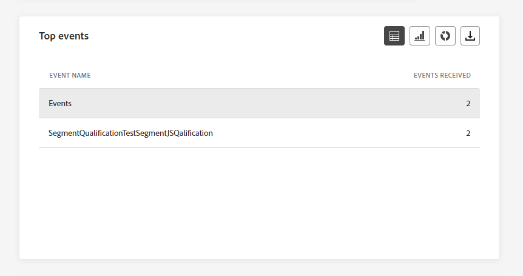
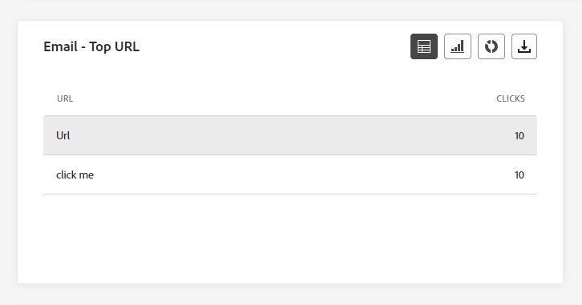

# 歷程全域報告 {#journey-global-report}

>[!CONTEXTUALHELP]
>id="ajo_journey_global_report"
>title="歷程全域報告"
>abstract="歷程全域報告可讓您測量您的歷程在選取時段內的影響。您的報告會分為不同的介面工具，詳細說明您的歷程的成功和錯誤。每個報告儀表板都可以透過調整大小或移除介面工具來修改。"

>[!AVAILABILITY]
>
>目前的報告體驗將於10月發行後淘汰。 在此日期之後，新的報告體驗將成為標準。 建議您熟悉新功能，以確保順利轉換。 [開始使用Journey Optimizer的新報告介面。](report-gs-cja.md)

全域報告可從「所有時間」標籤存取，它會顯示至少兩小時前發生的事件，以及所選時段內的封面事件。 相較之下，即時報表著重於過去24小時內發生的事件，最短間隔為事件發生後的2分鐘。

可以使用&#x200B;**[!UICONTROL 檢視報告]**&#x200B;按鈕，直接從您的歷程存取歷程全域報告。

歷程&#x200B;**[!UICONTROL 全域報告]**&#x200B;頁面將會顯示以下索引標籤：

* [歷程](#journey-global)
* [電子郵件](#email-global)
* [推播](#push-global)
* [簡訊](#sms-global)
* [應用程式內](#in-app-global)

歷程&#x200B;**[!UICONTROL 全域報告]**&#x200B;分成不同的Widget，詳細說明歷程的成功和錯誤。 如有需要，可以調整每個Widget的大小並將其刪除。 如需詳細資訊，請參閱此[區段](global-report.md#modify-dashboard)。

如需Adobe Journey Optimizer中每個可用量度的詳細清單，請參閱[此頁面](global-report.md#list-of-components-global)。

## 歷程索引標籤 {#journey-global}

從您的歷程&#x200B;**[!UICONTROL 全域報告]**，**[!UICONTROL 歷程]**&#x200B;索引標籤可讓您清楚檢視關於歷程最重要的追蹤資料。

### 歷程績效 {#journey-perfomance}

>[!CONTEXTUALHELP]
>id="ajo_journey_performance"
>title="歷程績效"
>abstract="「歷程績效」Widget 使您能夠以視覺化方式追蹤目標設定檔在您的歷程中的進展路徑。"

**[!UICONTROL 歷程績效]** Widget可讓您在目標設定檔瀏覽您的歷程時，以視覺化方式追蹤其軌跡。

請注意，節點的設定檔計數只會在設定檔完成節點之後更新，而不會在進入節點時更新。 例如，**等待**&#x200B;節點上的設定檔只有在到達指定的日期且設定檔已退出節點時才會計算。

### 歷程統計資料 {#journey-statistics}

>[!CONTEXTUALHELP]
>id="ajo_journey_statistics"
>title="歷程統計資料"
>abstract="「歷程統計資料關鍵績效指標 (KPI)」是一種綜合儀表板，提供與您歷程相關重要指標的深入分析。"

**[!UICONTROL 歷程統計資料]**&#x200B;關鍵績效指標(KPI)可作為全方位儀表板，提供與您的歷程相關聯的基本量度分析。 這包含已輸入設定檔計數和失敗個別歷程例項等詳細資訊，提供歷程成效和參與層級的全面深入分析。

+++ 進一步瞭解歷程統計量度

* **[!UICONTROL 已進入的設定檔]**：到達歷程進入事件的個人總數。

* **[!UICONTROL 已退出設定檔]**：已退出歷程的個人總數。

* **[!UICONTROL 失敗的個別歷程]**：未成功執行的個別歷程總數。

+++

### 動作績效 {#action-performance}

>[!CONTEXTUALHELP]
>id="ajo_journey_action_performance"
>title="動作績效"
>abstract="「動作績效」Widget 顯示了啟動動作時發生的最成功動作。"

**[!UICONTROL 動作效能]** Widget代表觸發&#x200B;**[!UICONTROL 動作]**&#x200B;時最成功的動作。

### 熱門動作 {#top-actions}

>[!CONTEXTUALHELP]
>id="ajo_journey_top_actions"
>title="熱門動作"
>abstract="「熱門動作」表格整合了有關您的動作的重要資訊，提供對每個動作的頻率和有效性的簡明觀察。"

**[!UICONTROL 最常發生的動作]**&#x200B;表格會編譯您&#x200B;**[!UICONTROL 動作]**&#x200B;的基本資料。 它提供每個動作頻率和效能的簡單深入分析。

+++ 深入了解熱門動作量度

* 已成功執行&#x200B;**[!UICONTROL 個動作]**：歷程已順利執行的&#x200B;**[!UICONTROL 個動作]**&#x200B;總數。

* **[!UICONTROL 動作]**&#x200B;發生錯誤： **[!UICONTROL 動作]**&#x200B;發生的錯誤總數。

+++

### 動作錯誤原因 {#action-error}

>[!CONTEXTUALHELP]
>id="ajo_journey_actions_error_reasons"
>title="動作錯誤原因"
>abstract="「動作錯誤原因」表格和圖表提供執行動作期間遇到錯誤的完整摘要，進而提供可能發生問題的全面概觀。"

**[!UICONTROL 動作錯誤原因]**&#x200B;表格和圖表提供執行&#x200B;**[!UICONTROL 動作]**&#x200B;期間所發生錯誤的完整概觀。

### 依據來源劃分的事件 {#events-origin}

>[!CONTEXTUALHELP]
>id="ajo_journey_events_origin"
>title="依據來源劃分的事件"
>abstract="「依據來源劃分的事件」表格和圖表提供成功接收事件的檢視。這些視覺表示可讓您準確識別有效接收的事件，進而為您歷程中每個事件的績效和影響提供珍貴的深入解析。"

依據來源的&#x200B;**[!UICONTROL 事件]**&#x200B;表格和圖表提供成功接收您的&#x200B;**[!UICONTROL 事件]**&#x200B;的詳細觀點。 透過這些視覺化表示，您可以準確辨別出您的&#x200B;**[!UICONTROL 事件]**&#x200B;中哪些有效地收到，針對歷程中個別事件的效能和影響提供寶貴的見解。

### 依事件劃分收到的事件 {#events-received}

>[!CONTEXTUALHELP]
>id="ajo_journey_events_received"
>title="依事件劃分收到的事件"
>abstract="「依事件劃分收到的事件」圖表可讓您識別和分析歷程中有效執行的特定事件，進而提供有關個別事件績效和成功率的珍貴深入解析。"

事件&#x200B;]**所接收的**[!UICONTROL &#x200B;事件圖表可讓您識別和分析歷程中哪個特定&#x200B;**[!UICONTROL 事件]**&#x200B;已有效執行，提供個別事件效能和成功率的寶貴見解。

### 熱門事件 {#top-events}

>[!CONTEXTUALHELP]
>id="ajo_journey_top_events"
>title="熱門事件"
>abstract="「熱門事件」表格整合了有關事件的基本資料，進而提供對每個個別事件頻率和績效的簡明觀察。"

**[!UICONTROL 熱門事件]**&#x200B;表格會編譯您&#x200B;**[!UICONTROL 事件]**&#x200B;的基本資料。 它提供每個&#x200B;**[!UICONTROL 事件]**&#x200B;的頻率與效能的簡單深入分析。

### 同意原則 {#consent-policies}

>[!CONTEXTUALHELP]
>id="ajo_journey_consent_policies"
>title="同意原則"
>abstract="「同意原則」表格和圖表顯示從自訂動作的每項原則中排除的設定檔數量。此呈現內容可讓您清楚了解每項同意政策對設定檔排除造成的影響。"

**[!UICONTROL 同意原則]**&#x200B;表格和圖表會顯示自訂動作中從每個原則排除的設定檔數目。 這可提供每個同意原則對設定檔排除之影響的明確見解。

如需自訂動作的詳細資訊，請參閱[詳細檔案](../action/about-custom-action-configuration.md)。

請注意，若要讓這些Widget出現在您的歷程報告中，您需要重設儀表板。 若要這麼做，請按一下報告上方的&#x200B;**[!UICONTROL 修改]** **[!UICONTROL 重設]**。

## 電子郵件標籤 {#email-global}

從您的歷程&#x200B;**[!UICONTROL 全域報告]**，**[!UICONTROL 電子郵件]**&#x200B;索引標籤會詳細說明與歷程中傳送之電子郵件相關的主要資訊。

### 電子郵件 - 傳送統計資料 {#email-sending-statistics}

>[!CONTEXTUALHELP]
>id="ajo_journey_email_sending_statistics"
>title="電子郵件 - 傳送統計資料"
>abstract="「電子郵件 - 發送統計資料」表格總結你的電子郵件的基本資料，例如「指定對象」或「已送達」。"

**[!UICONTROL 電子郵件傳送統計資料]**&#x200B;表格提供有關您歷程中電子郵件之基本資料的完整摘要。 它會詳細說明關鍵量度，例如目標對象的大小和成功傳送的電子郵件數量，提供對電子郵件和歷程的成效和觸及範圍的寶貴見解。

+++ 進一步瞭解電子郵件傳送統計量度

* **[!UICONTROL 執行時間]**：每個歷程執行的開始時間（若為週期性歷程）。 若要只鎖定一或多個重複專案，請從&#x200B;**[!UICONTROL 執行時間]**&#x200B;下拉式清單中選取它。

* **[!UICONTROL 目標]**：任何動作（例如傳送電子郵件或簡訊）的目標設定檔數目。

* **[!UICONTROL 已傳送]**：為歷程傳送的電子郵件總數。

* **[!UICONTROL 已傳遞]**：與已傳送電子郵件總數相關的成功傳送電子郵件數目。

* **[!UICONTROL 傳遞率]**：成功傳送的電子郵件百分比。

* **[!UICONTROL 跳出數]**：在傳送程式期間累積的錯誤總數，以及相對於已傳送電子郵件總數的自動傳回處理次數。

* **[!UICONTROL 跳出率]**：與已傳送電子郵件相比跳出的電子郵件百分比。

* **[!UICONTROL 錯誤]**：在傳送過程中發生的錯誤總數，導致無法將其傳送至設定檔。

* **[!UICONTROL 錯誤率]**：傳送程式期間發生的錯誤百分比，與已傳送的電子郵件比較，無法傳送。

* **[!UICONTROL 重試]**：重試佇列中的電子郵件數目。

* **[!UICONTROL 已排除]**： Adobe Journey Optimizer已排除的設定檔數目。

+++

### 電子郵件 - 追蹤統計資料 {#email-tracking}

>[!CONTEXTUALHELP]
>id="ajo_journey_email_tracking_statistics"
>title="電子郵件 - 追蹤統計資料"
>abstract="「電子郵件 - 追蹤統計資料」表格提供你的電子郵件設定檔活動的資料。"

**[!UICONTROL 電子郵件 — 追蹤統計資料]**&#x200B;表格提供與歷程中包含之電子郵件相關的設定檔活動詳細帳戶。 其中包括開啟次數、點按次數和其他相關的參與指標，以提供設定檔與電子郵件內容互動方式的完整檢視。

+++ 進一步瞭解電子郵件 — 追蹤統計量度

* **[!UICONTROL 執行時間]**：歷程中每次執行週期性電子郵件的開始時間。 若要只鎖定一或多個週期性電子郵件，請從&#x200B;**[!UICONTROL 執行時間]**&#x200B;下拉式清單中選取它。

* **[!UICONTROL 開啟次數]**：您的電子郵件在歷程中開啟的次數。

* **[!UICONTROL 不重複開啟]**：已開啟電子郵件的百分比。

* **[!UICONTROL 不重複開啟率]**：與已傳遞電子郵件數相較的已開啟電子郵件總數。

* **[!UICONTROL 點按]**：內容在電子郵件中的點按次數。

* **[!UICONTROL 不重複點按]**：點按您電子郵件中內容的收件者人數。

* **[!UICONTROL 點進率]**：與歷程互動的使用者百分比。

* **[!UICONTROL 取消訂閱]**：取消訂閱連結的點按次數。

* **[!UICONTROL 垃圾郵件投訴]**：您的電子郵件被宣告為垃圾郵件或垃圾郵件的次數。

+++

### 電子郵件 - 傳送績效 {#email-performance}

>[!CONTEXTUALHELP]
>id="ajo_journey_email_sending_performance"
>title="電子郵件 - 傳送績效"
>abstract="「電子郵件 - 傳送效能」圖表顯示有關已發送電子郵件的綜合資料，提供關鍵量度 (例如送出郵件和退回郵件) 的深入分析，以利針對電子郵件傳送過程進行詳細分析。"

**[!UICONTROL 電子郵件 — 傳送效能]**&#x200B;圖表提供您歷程中已傳送電子郵件相關資料的完整檢視，提供關鍵量度的深入分析，例如傳送和跳出。 這可啟用電子郵件傳送流程的詳細分析，提供關於歷程效率和效能的寶貴資訊。

+++ 進一步瞭解電子郵件 — 傳送績效量度

* **[!UICONTROL 已傳遞]**：與已傳送電子郵件總數相關的成功傳送電子郵件數目。

* **[!UICONTROL 跳出數]**：在傳送程式期間累積的錯誤總數，以及相對於已傳送訊息總數的自動傳回處理次數。

* **[!UICONTROL 重試]**：重試佇列中的電子郵件數目。

* **[!UICONTROL 錯誤]**：傳送程式期間發生的錯誤總數，導致無法傳送至設定檔。

+++

### 電子郵件 - 退回郵件的類別和原因 {#email-bounce-categories}

>[!CONTEXTUALHELP]
>id="ajo_journey_email_bounces"
>title="電子郵件 - 退回郵件的類別和原因"
>abstract="「電子郵件 - 退回郵件的類別和原因」Widget 彙總了有關退回郵件的資料，進而提供對導致電子郵件退回具體原因和類別的深入見解"

**[!UICONTROL 退信原因]**&#x200B;和&#x200B;**[!UICONTROL 退信類別]**&#x200B;介面工具會編譯與退信相關的可用資料，提供電子郵件退信背後特定原因和類別的詳細深入分析。

如需退信的詳細資訊，請參閱[隱藏清單](../reports/suppression-list.md)頁面。

+++ 進一步瞭解電子郵件 — 退回類別量度

* **[!UICONTROL 硬退信]**：永久錯誤的總數，例如錯誤的電子郵件地址。 這包含明確指出地址無效的錯誤訊息，例如「未知使用者」。

* **[!UICONTROL 軟退信]**：暫時性錯誤的總數，例如完整的收件匣。

* **[!UICONTROL Ignored]**：暫時性的總數，例如「不在辦公室」，或是技術錯誤，例如，如果寄件者型別是郵遞員。

+++

### 電子郵件 - 錯誤原因 {#email-errors}

>[!CONTEXTUALHELP]
>id="ajo_journey_email_error_reasons"
>title="電子郵件 - 錯誤原因"
>abstract="「電子郵件 - 錯誤原因」圖表和表格讓你能夠識別傳送過程中發生的特定錯誤。"

**[!UICONTROL 錯誤原因]**&#x200B;圖表和表格提供傳送過程中發生的特定錯誤的可見度，提供有關錯誤性質和發生次數的寶貴資訊。

### 電子郵件 - 排除原因 {#email-excluded}

>[!CONTEXTUALHELP]
>id="ajo_journey_email_excluded_reasons"
>title="電子郵件 - 排除原因"
>abstract="「排除原因」圖表和表格說明導致使用者輪廓被排除在目標客群之外，而未能收到訊息的各項因素。"

**[!UICONTROL 排除的原因]**&#x200B;圖表和表格呈現不同因素的完整檢視，這些因素導致目標對象排除使用者設定檔，導致未收到訊息。

如需排除原因的完整清單，請參閱[此頁面](exclusion-list.md)。

### 依網域劃分的已傳送和已送達郵件 {#sent-domains}

>[!CONTEXTUALHELP]
>id="ajo_journey_email_sent_delivered_domains"
>title="依網域劃分的已傳送和已送達郵件"
>abstract="「依網域劃分的已傳送和已送達郵件」表格和圖表提供依網域分類的電子郵件劃分資料，呈現對電子郵件通訊整體績效的深入解析。"

網域&#x200B;]**的**[!UICONTROL &#x200B;傳送與傳遞表格和圖表提供網域層級的電子郵件詳細劃分，提供您電子郵件效能的完整深入分析。

+++ 進一步瞭解依網域進行之傳送和傳遞的量度

* **[!UICONTROL 已傳送]**：您電子郵件的傳送總數。

* **[!UICONTROL 已傳遞]**：與已傳送電子郵件總數相關的成功傳送電子郵件數目。

+++

### 依網域劃分的開啟和點按動作 {#open-domains}

>[!CONTEXTUALHELP]
>id="ajo_journey_email_open_clicks_domains"
>title="依網域劃分的開啟和點按動作"
>abstract="「依網域劃分的開啟和點按動作」圖表和表格提供網域層級的詳細劃分資料，呈現客群與您電子郵件互動方式的全面檢視。"

**[!UICONTROL 依網域開啟和點按]**&#x200B;的圖表和表格會顯示設定檔與電子郵件互動的網域層級劃分，提供不同網域與內容互動方式的寶貴見解。

+++ 進一步瞭解依網域量度的開啟和點按次數

* **[!UICONTROL 開啟次數]**：電子郵件開啟的次數。

* **[!UICONTROL 點按次數]**：在電子郵件中點按內容的次數。

+++

### 依網域劃分的退回情形與錯誤 {#bounces-domains}

>[!CONTEXTUALHELP]
>id="ajo_journey_email_bounces_errors_domains"
>title="依網域劃分的退回情形與錯誤"
>abstract="「依網域劃分的退回情形與錯誤」圖表和表格提供網域層級的精細劃分資料，可讓您深入了解電子郵件傳送過程中遇到的特定錯誤。"

依網域&#x200B;]**的**[!UICONTROL &#x200B;跳出和錯誤圖表和表格提供傳送程式期間遇到的特定錯誤的網域層級劃分，提供所發生問題的詳細分析。

+++ 進一步瞭解依網域量度的跳出和錯誤

* **[!UICONTROL 跳出數]**：在傳送程式期間累積的錯誤總數，以及相對於已傳送電子郵件總數的自動傳回處理次數。

* **[!UICONTROL 錯誤]**：在傳送過程中發生的錯誤總數，導致無法將其傳送至設定檔。

+++

### 依網域劃分的退回原因 {#bounce-reasons-domains}

>[!CONTEXTUALHELP]
>id="ajo_journey_email_bounces_reasons_domains"
>title="依網域劃分的退回原因"
>abstract="「依網域劃分的退回原因」圖表和表格提供網域層級的劃分資料，讓您取得對臨時和永久錯誤的全面深入解析。此詳細分析會為您提供有關退回郵件背後具體原因的珍貴資訊。"

依網域&#x200B;]**的**[!UICONTROL &#x200B;跳出原因圖表和表格提供與暫時和永久錯誤相關的網域層級資料劃分，提供跳出訊息背後原因的詳細分析。

### 電子郵件 - 熱門 URL {#email-top}

>[!CONTEXTUALHELP]
>id="ajo_journey_email_top_url"
>title="電子郵件 - 熱門 URL"
>abstract="「電子郵件 - 熱門 URL」圖表和表格提供電子郵件中訪客流量最高的 URL 的綜合概觀，讓你能夠確認最受歡迎的連結。"

**[!UICONTROL 電子郵件 — 熱門URL]**&#x200B;圖表和表格提供您電子郵件中吸引最高訪客流量的URL的完整概觀。 這可讓您識別最熱門的連結並排定其優先順序，進而更瞭解電子郵件中特定內容的設定檔參與情形。

### 電子郵件 - 最佳化 {#email-sto}

>[!CONTEXTUALHELP]
>id="ajo_journey_email_optimization"
>title="電子郵件 - 最佳化"
>abstract="「傳送時間最佳化」和「最佳化與非最佳化」Widget 提供有關您郵件的詳細資訊，進而凸顯它們是否已最佳化。"

>[!NOTE]
>
>**[!UICONTROL 傳送時間最佳化]**&#x200B;和&#x200B;**[!UICONTROL 已最佳化與未最佳化]** Widget只有在傳送的「傳送時間最佳化」選項已啟用時才可用。 如需傳送時間最佳化的詳細資訊，請參閱[此頁面](../building-journeys/journeys-message.md#send-time-optimization)。

**[!UICONTROL 傳送時間最佳化]**&#x200B;和&#x200B;**[!UICONTROL 已最佳化與未最佳化]** Widget會根據傳送方法（已最佳化或正常）詳細列出您的電子郵件是否成功。

+++ 進一步瞭解傳送時間最佳化及已最佳化與非最佳化量度的比較

* **[!UICONTROL 已傳遞]**：與已傳送訊息總數相關的成功傳送訊息數。
* **[!UICONTROL 跳出數]**：在傳送程式期間累積的錯誤總數，以及相對於已傳送訊息總數的自動傳回處理次數。

* **[!UICONTROL 已傳送]**：為歷程傳送的電子郵件總數。

* **[!UICONTROL 開啟次數]**：您在歷程中開啟電子郵件的次數。

* **[!UICONTROL 點按]**：內容在電子郵件中的點按次數。

+++

### 電子郵件 - 優惠 {#email-offers}

>[!CONTEXTUALHELP]
>id="ajo_journey_email_offers"
>title="電子郵件 - 優惠"
>abstract="「優惠統計資料」和「優惠詳細統計資料」Widget 提供對優惠績效的全面深入解析，進而提供其長期影響的詳細分析，並呈現詳細的統計資料以供更深入的了解。"

>[!NOTE]
>
>優惠方案Widget和量度僅在決定已插入電子郵件中時才能使用。 如需決策管理的詳細資訊，請參閱此[頁面](../offers/get-started/starting-offer-decisioning.md)。

**[!UICONTROL 優惠統計資料]**&#x200B;和&#x200B;**[!UICONTROL 隨著時間推移提供的詳細統計資料]** Widget會測量您優惠方案的成功及其對目標受眾的影響。 它會使用KPI詳細說明與您的訊息相關的主要資訊。

+++ 進一步瞭解電子郵件 — 優惠方案量度

* **[!UICONTROL 已傳送的優惠]**：優惠的傳送總數。

* **[!UICONTROL 優惠閱聽]**：在您的電子郵件中開啟優惠的次數。

* **[!UICONTROL 優惠點按次數]**：您的電子郵件中某個優惠的點按次數。

* **[!UICONTROL 位置名稱]**：用來顯示優惠方案的位置名稱。 如需位置的詳細資訊，請參閱此[頁面](../offers/offer-library/creating-placements.md)。

* **[!UICONTROL 選件名稱]**：新增至電子郵件中的選件名稱。 如需位置的詳細資訊，請參閱此[頁面](../offers/offer-library/creating-personalized-offers.md)。

* **[!UICONTROL 已傳送的優惠]**：優惠的傳送總數。

* **[!UICONTROL 優惠曝光率]**：已開啟的優惠相對於已傳送的優惠數目的百分比。

* **[!UICONTROL 優惠點選率]**：與優惠互動的使用者百分比。

+++

## 推播通知標籤 {#push-global}

從您的歷程&#x200B;**[!UICONTROL 全域報告]**，**[!UICONTROL 推播通知]**&#x200B;索引標籤會詳細說明與歷程中傳送之推播通知相關的主要資訊。

### 推播通知 - 傳送統計資料 {#push-sending-stat}

>[!CONTEXTUALHELP]
>id="ajo_journey_push_sending_statistics"
>title="推播通知 - 傳送統計資料"
>abstract="「推播通知傳送統計資料」表格總結有關推播通知的基本資料，例如指定對象或已送達的訊息。"

**[!UICONTROL 推播通知 — 傳送統計資料]**&#x200B;表格提供與推播通知相關之基本資料的簡要摘要，包括關鍵量度，例如目標訊息數目和成功傳送的訊息數目。

+++ 進一步瞭解推播通知 — 傳送統計量度

* **[!UICONTROL 執行時間]**：每個歷程執行的開始時間（若為週期性歷程）。 若要只鎖定一或多個重複專案，請從&#x200B;**[!UICONTROL 執行時間]**&#x200B;下拉式清單中選取它。

* **[!UICONTROL 目標]**：任何動作（例如傳送電子郵件或簡訊）的目標設定檔數目。

* **[!UICONTROL 已傳送]**：已傳送的推播通知總數。

* **[!UICONTROL 已傳遞]**：成功傳送的推播通知數目（與已傳送的推播通知總數相關）。

* **[!UICONTROL 傳遞率]**：成功傳送的推播通知百分比。

* **[!UICONTROL 跳出數]**：傳送程式與自動傳回處理期間，累積的錯誤總數與已傳送推播通知的總數有關。

* **[!UICONTROL 跳出率]**：與已傳送的推播通知相比跳出的推播通知百分比。

* **[!UICONTROL 錯誤]**：在傳送過程中發生的錯誤總數，導致無法將其傳送至設定檔。

* **[!UICONTROL 錯誤率]**：傳送程式期間發生的錯誤百分比，與傳送的推播通知比較，無法傳送該訊息。

* **[!UICONTROL 已排除]**： Adobe Journey Optimizer已排除的設定檔數目。

+++

### 推播通知 - 追蹤統計資料 {#push-tracking-stat}

>[!CONTEXTUALHELP]
>id="ajo_journey_push_tracking_statistics"
>title="推播通知 - 追蹤統計資料"
>abstract="「推播追蹤統計資料」提供有關推播通知的設定檔活動的資料。"

**[!UICONTROL 推播 — 追蹤統計資料]** Widget提供與您的推播通知連結的設定檔活動詳細快照，提供參與和推播通知有效性的基本深入分析。

+++ 進一步瞭解推播通知 — 追蹤統計量度

* **[!UICONTROL 執行時間]**：每個歷程執行的開始時間（若為週期性歷程）。 若要只鎖定一或多個重複專案，請從&#x200B;**[!UICONTROL 執行時間]**&#x200B;下拉式清單中選取它。

* **[!UICONTROL 開啟]**：您的推播通知在歷程中開啟的次數。

* **[!UICONTROL 動作]**：已傳送推播通知上的動作總數，例如按鈕點選或解除。

+++

### 推播通知 - 傳送摘要 {#push-summary}

>[!CONTEXTUALHELP]
>id="ajo_journey_push_sending_summary"
>title="推播通知 - 傳送摘要"
>abstract="「推播通知傳送摘要」圖表顯示已傳送的推播通知的可用資料。"

**[!UICONTROL 推播通知 — 傳送摘要]**&#x200B;圖表提供動態表示，顯示推播通知活動的分析。 此圖形表示提供已傳送推播通知的完整劃分。

+++ 進一步瞭解推播通知 — 傳送摘要量度

* **[!UICONTROL 開啟次數]**：您的推播通知在歷程中開啟的次數。

* **[!UICONTROL 動作]**：已傳送推播通知上的動作總數，例如按鈕點選或解除。

* **[!UICONTROL 跳出數]**：傳送程式與自動傳回處理期間，累積的錯誤總數與已傳送推播通知的總數有關。

* **[!UICONTROL 已傳遞]**：成功傳送的推播通知數目（與已傳送的推播通知總數相關）。

* **[!UICONTROL 錯誤]**：在傳送過程中發生的錯誤總數，導致無法將其傳送至設定檔。

+++

### 推播通知 - 錯誤原因 {#push-error-reasons}

>[!CONTEXTUALHELP]
>id="ajo_journey_push_error_reasons"
>title="推播通知 - 錯誤原因"
>abstract="「錯誤原因」圖表和表格可讓您識別傳送過程中發生的特定錯誤"

**[!UICONTROL 錯誤原因]**&#x200B;表格和圖表可讓您識別推播通知傳送過程中發生的特定錯誤，提供過程中所遇到任何問題的詳細深入分析。

### 推播通知 - 排除原因 {#push-excluded}

>[!CONTEXTUALHELP]
>id="ajo_journey_push_excluded_reasons"
>title="推播通知 - 排除原因"
>abstract="「排除原因」圖表和表格會說明導致使用者輪廓排除在目標客群之外，而未能收到訊息的各項因素。"

**[!UICONTROL 排除的原因]**&#x200B;圖表和表格會顯示阻止從目標設定檔排除的使用者設定檔接收推播通知的不同原因。

如需排除原因的完整清單，請參閱[此頁面](exclusion-list.md)。

### 推播通知 - 依平台劃分 {#push-breakdown}

>[!CONTEXTUALHELP]
>id="ajo_journey_push_breakdown_platform"
>title="推播通知 - 依平台劃分"
>abstract="「推播通知 - 依平台劃分」圖表和表格，會根據設定檔的作業系統提供推播通知成功傳送的劃分資料。"

依平台&#x200B;]**劃分的**[!UICONTROL &#x200B;圖表和表格提供推播通知成功的詳細分析，並根據您設定檔的作業系統提供深入分析。 此劃分可讓您更瞭解推播通知在不同平台上的執行情形。

### 推播通知 — 最佳化 {#push-sto}

>[!NOTE]
>
>**[!UICONTROL 已最佳化與未最佳化]**&#x200B;和&#x200B;**[!UICONTROL 傳送時間最佳化]** Widget只有在您的傳遞已啟用傳送時間最佳化選項時，才可使用。 如需傳送時間最佳化的詳細資訊，請參閱[此頁面](../building-journeys/journeys-message.md#send-time-optimization)。

**[!UICONTROL 已最佳化與未最佳化]**&#x200B;和&#x200B;**[!UICONTROL 傳送時間最佳化]**&#x200B;介面工具會詳細說明與您的訊息相關的主要資訊（無論是否已最佳化）。

+++ 進一步瞭解推播通知 — 最佳化量度

* **[!UICONTROL 已傳遞]**：與已傳送訊息總數相關的成功傳送訊息數。

* **[!UICONTROL 開啟次數]**：您的推播通知在歷程中開啟的次數。

* **[!UICONTROL 動作]**：已傳送推播通知上的動作總數，例如按鈕點選或解除。

* **[!UICONTROL 已傳遞]**：與已傳送訊息總數相關的成功傳送訊息數。

* **[!UICONTROL 跳出數]**：在傳送程式期間累積的錯誤總數，以及相對於已傳送訊息總數的自動傳回處理次數。

+++

## 簡訊標籤 {#sms-global}

### 簡訊 - 傳送統計資料 {#sms-sending-stat}

>[!CONTEXTUALHELP]
>id="ajo_journey_sms_sending_statistics"
>title="簡訊 - 傳送統計資料"
>abstract="「簡訊 - 傳送統計資料」表格會總結有關簡訊的基本資料，例如指定對象或已送達的簡訊。"

**[!UICONTROL SMS — 傳送統計資料]**&#x200B;表格提供與您的SMS訊息相關之基本資料的簡要摘要，包含關鍵量度，例如目標訊息數目以及成功傳送訊息的計數。

+++ 進一步瞭解簡訊 — 傳送統計量度

* **[!UICONTROL 執行時間]**：每個歷程執行的開始時間（若為週期性歷程）。 若要只鎖定一或多個重複專案，請從&#x200B;**[!UICONTROL 執行時間]**&#x200B;下拉式清單中選取它。

* **[!UICONTROL 目標]**：符合簡訊訊息目標設定檔資格的使用者設定檔數目。

* **[!UICONTROL 已排除]**：從目標設定檔中排除且未接收簡訊的使用者設定檔數目。

* **[!UICONTROL 已傳送]**：為歷程傳送的SMS訊息總數。

* **[!UICONTROL 跳出數]**：在傳送程式期間累積的錯誤總數，以及相對於已傳送SMS訊息的總數的自動傳回處理次數。

* **[!UICONTROL 錯誤]**：在傳送過程中發生的錯誤總數，導致無法將其傳送至設定檔。

+++

### 簡訊 - 追蹤統計資料 {#sms-tracking-stat}

>[!CONTEXTUALHELP]
>id="ajo_journey_sms_tracking_statistics"
>title="簡訊 - 追蹤統計資料"
>abstract="「簡訊 - 追蹤統計資料」Widget 會提供訪客與您的 URL 互動相關基本資訊的全面概觀。"

**[!UICONTROL SMS — 追蹤統計資料]** Widget提供與訪客與您URL互動相關之重要資訊的詳細概觀，提供您SMS訊息有效性的深入分析。

* **[!UICONTROL 執行時間]**：您每一次執行週期性簡訊的開始時間。 若要只鎖定一或多個週期性簡訊，請從&#x200B;**[!UICONTROL 執行時間]**&#x200B;下拉式清單中選取它。

* **[!UICONTROL 點按]**：內容在簡訊訊息中的點按次數。

### 簡訊 - 依日期劃分的效能 {#sms-performance-date}

>[!CONTEXTUALHELP]
>id="ajo_journey_sms_perfomance_date"
>title="簡訊 - 依日期劃分的績效"
>abstract="「簡訊 - 依日期劃分的績效」Widget 透過圖形呈現方式提供有關您簡訊的重要資訊。"

**[!UICONTROL SMS — 依據日期的效能]**&#x200B;介面工具集提供與訊息相關之重要資訊的詳細概觀，透過圖表呈現，提供特定時段內效能趨勢的深入分析。

+++ 進一步瞭解簡訊 — 依據日期量度的績效

* **[!UICONTROL 已傳送]**：為歷程傳送的簡訊總數

* **[!UICONTROL 跳出數]**：在傳送程式期間累積的錯誤總數，以及相對於已傳送SMS訊息的總數的自動傳回處理次數。

* **[!UICONTROL 錯誤]**：在傳送過程中發生的錯誤總數，導致無法將其傳送至設定檔。

+++

### 簡訊 - 退回原因 {#sms-bounce}

>[!CONTEXTUALHELP]
>id="ajo_journey_sms_bounces_reasons"
>title="簡訊 - 退回原因"
>abstract="「退回原因」圖表和表格包含與退回郵件相關的可用資料。"

**[!UICONTROL 退信原因]**&#x200B;圖表和表格提供與退信SMS訊息相關的完整資料概觀，針對SMS訊息退信例項背後的特定原因提供有價值的深入分析。

### 簡訊 - 錯誤原因 {#sms-error}

>[!CONTEXTUALHELP]
>id="ajo_journey_sms_error_reasons"
>title="簡訊 - 錯誤原因"
>abstract="「簡訊 - 錯誤原因」圖表和表格讓你能夠確認傳送過程中發生的特定錯誤。"

**[!UICONTROL 錯誤原因]**&#x200B;圖表和表格可讓您識別在傳送SMS訊息過程中發生的特定錯誤，協助徹底分析遇到的任何問題。

### 簡訊 - 排除原因 {#sms-excluded}

>[!CONTEXTUALHELP]
>id="ajo_journey_sms_excluded_reasons"
>title="簡訊 - 排除原因"
>abstract="「排除原因」圖表和表格說明導致使用者輪廓被排除在目標客群之外，而未能收到訊息的各項因素。"

**[!UICONTROL 排除的原因]**&#x200B;圖表和表格會以視覺化方式描述導致目標對象中排除使用者設定檔的各種因素，以防止他們接收您的SMS訊息。

如需排除原因的完整清單，請參閱[此頁面](exclusion-list.md)。

### 簡訊 - 依連結劃分的點按次數 {#sms-clicks}

>[!CONTEXTUALHELP]
>id="ajo_journey_sms_clicks"
>title="簡訊 - 依連結劃分的點按次數"
>abstract="「簡訊 - 依連結劃分的點按次數」Widget 會提供有關訪客與您訊息中 URL 互動的重要深入解析。"

**[!UICONTROL SMS — 連結點按]** Widget可讓您深入瞭解訪客對訊息中所包含URL的參與度，提供哪些連結吸引最多互動的寶貴資訊。

## 應用程式內標籤 {#in-app-global}

從您的歷程&#x200B;**[!UICONTROL 全域報告]**，**[!UICONTROL 應用程式內]**&#x200B;索引標籤會詳細說明與歷程中傳送之應用程式內訊息相關的主要資訊。

### 應用程式內績效 {#inapp-performance}

>[!CONTEXTUALHELP]
>id="ajo_journey_inapp_performance"
>title="應用程式內績效"
>abstract="應用程式內效能 KPI 提供有關訪客參與應用程式內訊息的重要深入分析。"

**[!UICONTROL 應用程式內績效]** KPI提供您設定檔與應用程式內訊息互動的基本深入分析，提供基本量度以評估歷程中包含的應用程式內訊息的有效性和影響。

+++ 深入瞭解應用程式內 — 依據日期量度的績效

* **[!UICONTROL 不重複曝光次數]**：顯示應用程式內訊息的不重複使用者人數。

* **[!UICONTROL 曝光次數]**：向所有使用者顯示的應用程式內訊息總數。

  >[!NOTE]
  >
  >為確保計算曝光次數，使用者必須符合兩個條件：
  >* 應用程式內體驗中的資格，可透過存取其歷程中的特定應用程式內活動來達成。
  >* 符合觸發程式規則中指定的條件。
  > 
  >由於第二個標準，目標設定檔數量與不重複曝光數量之間可能會有顯著差異。

* **[!UICONTROL 互動]**：與應用程式內訊息的互動次數。 這包括使用者所執行的任何動作，例如點選、解僱或任何其他互動。
+++

### 應用程式內摘要 {#inapp-summary}

>[!CONTEXTUALHELP]
>id="ajo_journey_inapp_summary"
>title="應用程式內摘要"
>abstract="應用程式內摘要圖表顯示指定時間內應用程式內曝光與互動的進展。"

**[!UICONTROL 應用程式內摘要]**&#x200B;圖表會說明應用程式內曝光次數和互動在指定期間的進度，提供您應用程式內訊息效能的完整概觀。

### 依類型劃分的互動 {#interactions-type}

>[!CONTEXTUALHELP]
>id="ajo_journey_inapp_interactions"
>title="依類型劃分的互動"
>abstract="「依類型劃分的互動」圖表和表格透過追蹤任何點選、關閉或互動，詳細說明使用者如何與應用程式內訊息互動。"

依型別&#x200B;]**的**[!UICONTROL &#x200B;互動圖表和表格提供設定檔如何與您的應用程式內訊息、追蹤動作（例如點選、解除）或任何其他形式的參與互動的詳細描述。
