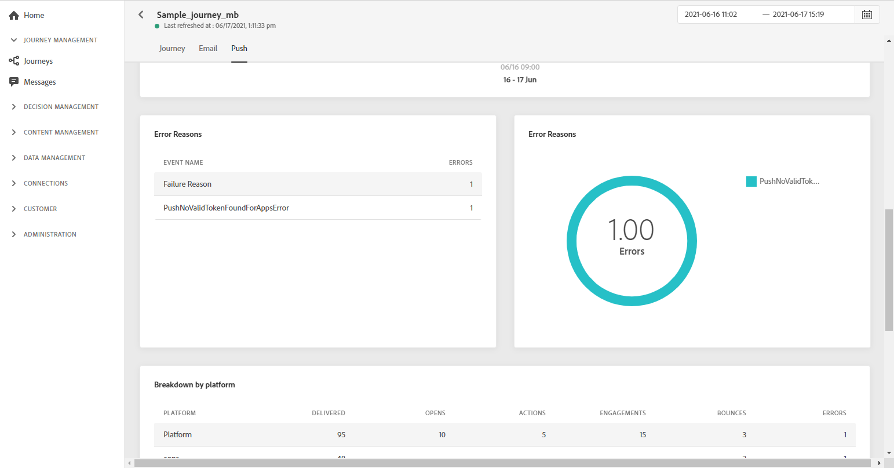

# 歷程全域報告 {#journey-global-report}

您可以直接從歷程存取歷程全域報表，其中包含 **[!UICONTROL Global report]** 按鈕。

歷程 **[!UICONTROL Global report]** 頁面中顯示以下索引標籤：

* [歷程](#journey-global)
* [電子郵件](#email-global)
* [推播](#push-global)

歷程 **[!UICONTROL Global report]** 會分為不同的Widget，詳述您歷程的成功與錯誤。 如有需要，可對每個介面工具集調整大小並加以刪除。 有關詳細資訊，請參閱 [節](global-report.md#modify-dashboard).

## 歷程標籤 {#journey-global}

從您的歷程 **[!UICONTROL Global report]**, **[!UICONTROL Journey]** 索引標籤可讓您清楚檢視歷程的最重要追蹤資料。

此 **[!UICONTROL Journey Performance]** 介面工具集可讓您逐步查看目標設定檔的路徑，以完成歷程。

此 **[!UICONTROL Journey Statistics]** 介面工具集顯示下列KPI:

* **[!UICONTROL Entered profiles]**:到達歷程進入事件的個人總數。

* **[!UICONTROL Exited profiles]**:離開歷程的個人總數。

* **[!UICONTROL Failed individual journey]**:未成功執行的個別歷程總數。

此 **[!UICONTROL Events received by event]**, **[!UICONTROL Events by origin]** 和 **[!UICONTROL Top events]** 介面工具集可讓您查看 **[!UICONTROL Events]** 已通過圖形和表成功執行。

**[!UICONTROL Action Performance]**, **[!UICONTROL Action Error Reasons]** 和 **[!UICONTROL Top Actions]** 介面工具集代表最成功的動作，以及您 **[!UICONTROL Actions]** 已觸發。

此 **[!UICONTROL Top Actions]** 表格包含可用於 **[!UICONTROL Actions]**，例如：

* **[!UICONTROL Actions successfully executed]**:總數 **[!UICONTROL Actions]** 成功執行歷程。

* **[!UICONTROL Error in action]**:發生的錯誤總數 **[!UICONTROL Actions]**.

## 電子郵件索引標籤 {#email-global}

從您的歷程 **[!UICONTROL Global report]**, **[!UICONTROL Email]** 索引標籤會詳細列出與歷程中傳送之電子郵件相關的主要資訊。

如需特定電子郵件傳送的詳細報告，請參閱 [電子郵件全域報表](#email-global-report) 區段。

此 **[!UICONTROL Email Sending Statistics]** 圖表會詳細說明您的傳送是否成功：

* **[!UICONTROL Sent]**:傳送的傳送總數。

* **[!UICONTROL Delivered]**:已成功傳送的訊息數，與已傳送的訊息總數相關。

* **[!UICONTROL Delivery Rate]**:已成功發送的消息的百分比。

* **[!UICONTROL Bounces]**:傳送和自動回傳處理期間累積的錯誤總數，與已傳送訊息的總數相關。

* **[!UICONTROL Bounce Rate]**:跳出的電子郵件與傳送的電子郵件的百分比。

* **[!UICONTROL Errors]**:傳送期間發生的錯誤總數，使其無法傳送至設定檔。

* **[!UICONTROL Error Rate]**:傳送期間發生、無法傳送的錯誤百分比，與已傳送的電子郵件相比。

此 **[!UICONTROL Email - Tracking statistics]** 包含您傳送之收件者活動的可用資料：

* **[!UICONTROL Opens]**:傳送中開啟傳送的次數。

* **[!UICONTROL Unique Opens]**:已開啟傳遞的百分比。

* **[!UICONTROL Open Rate]**:已開啟電子郵件的總數與已傳送電子郵件的總數相比。

* **[!UICONTROL Clicks]**:電子郵件中內容被點按的次數。

* **[!UICONTROL Unique Clicks]**：按一下電子郵件內容的收件者人數。

* **[!UICONTROL Click through rate]**:與歷程互動的使用者百分比。

* **[!UICONTROL Unsubscribe]**:取消訂閱連結的點按次數。

* **[!UICONTROL Spam complaints]**:宣告郵件為垃圾郵件或垃圾郵件的次數。

此 **[!UICONTROL Sending Statistics]** 圖表包含可用於傳送電子郵件的資料，例如：

* **[!UICONTROL Delivered]**:已成功傳送的訊息數，與已傳送的訊息總數相關。

* **[!UICONTROL Bounces]**:傳送和自動回傳處理期間累積的錯誤總數，與已傳送訊息的總數相關。

* **[!UICONTROL Errors]**:傳送期間發生的錯誤總數，使其無法傳送至設定檔。

此 **[!UICONTROL Bounce Reasons]** 和 **[!UICONTROL Bounce categories]** 小工具包含與退信消息相關的可用資料，例如：

* **[!UICONTROL Hard bounce]**:永久錯誤的總數，例如錯誤的電子郵件地址。 這包含明確指出地址無效的錯誤訊息，例如「未知」使用者。

* **[!UICONTROL Soft bounce]**:臨時錯誤（如完整收件箱）的總數。

* **[!UICONTROL Ignored]**:臨時的總數，例如「不在辦公室」或技術錯誤，例如，如果發送者類型是郵遞區號。

如需退信的詳細資訊，請參閱 [隱藏清單](../suppression-list.md) 頁面。

此 **[!UICONTROL Email - Top Url]** 圖表和表格會詳細說明哪些URL最常被瀏覽。

此 **[!UICONTROL Email - Top recipient domain]** 圖表和表格詳細說明收件者最常使用哪些網域來開啟電子郵件。

<!--

>[!NOTE]
>
>The Offers widgets and metrics are only available if a decision was inserted in an email. For more information on Decision Management, refer to this [page](../offers/get-started/starting-offer-decisioning.md).

The **[!UICONTROL Offers statistic]** and **[!UICONTROL Offers statistics]** over time widgets measure your offer's success and impact on your targeted audience. It detail the main information relative to your message with KPIs:

* **[!UICONTROL Offer sent]**: Total number of sends for the offer.

* **[!UICONTROL Offer impression]**: Number of times the offer was opened in a delivery.

* **[!UICONTROL Offer clicks]**: Number of times an offer was clicked on in a delivery.

The **[!UICONTROL Offers detailed statistic]** table contains the available data for recipient activity with your offer:

* **[!UICONTROL Placement name]**: Name of your placement used to display your offer. For more information on placement, refer to this [page](../offers/offer-library/creating-placements.md).

* **[!UICONTROL Offer name]**: Name of the offer added in the delivery. For more information on placement, refer to this [page](../offers/offer-library/creating-personalized-offers.md).

* **[!UICONTROL Offer sent]**: Total number of sends for the offer.

* **[!UICONTROL Offer impression rate]**: Percentage of opened offers compared to the number of sent offers.

* **[!UICONTROL Offer click rate]**: Percentage of users who interacted with the offer.
-->

## 推送標籤 {#push-global}

從您的歷程 **[!UICONTROL Global report]**, **[!UICONTROL Push]** 索引標籤會詳細說明與歷程中傳送的推送傳送相關的主要資訊。

如需特定推送傳送的詳細報表，請參閱 [推送全域報表](#push-global-report).

此 **[!UICONTROL Push notification - Sending statistics]** 表格會透過圖表和KPI，詳細說明與推播通知相關的主要資訊：

* **[!UICONTROL Sent]**:傳送的傳送總數。

* **[!UICONTROL Delivered]**:已成功傳送的訊息數，與已傳送的訊息總數相關。

* **[!UICONTROL Delivery Rate]**:已成功發送的消息的百分比。

* **[!UICONTROL Bounces]**:傳送和自動回傳處理期間累積的錯誤總數，與已傳送訊息的總數相關。

* **[!UICONTROL Bounce Rate]**:跳出的推播通知與傳送的推播通知的百分比。

* **[!UICONTROL Errors]**:傳送期間發生的錯誤總數，使其無法傳送至設定檔。

* **[!UICONTROL Error Rate]**:與傳送的推播通知相比，傳送期間發生而無法傳送的錯誤百分比。

此 **[!UICONTROL Push - Tracking statistics]** 包含您傳送之收件者活動的可用資料：

* **[!UICONTROL Opens]**:傳送中開啟訊息的次數。

* **[!UICONTROL Open Rate]**:已開啟推播通知的百分比。

* **[!UICONTROL Actions]**:已傳送推播通知的動作總數，例如按鈕點擊或解除。

* **[!UICONTROL Engagements]**:此推播通知的開啟次數和動作總數，亦即設定檔開啟了推播或按了按鈕。

* **[!UICONTROL Engagement Rate]**:此推播通知的開啟次數和動作百分比，亦即設定檔開啟了推播或按鈕被點按時。

此 **[!UICONTROL Push notification summary]** 圖形包含可用於傳送推播通知的資料，例如：

* **[!UICONTROL Opens]**:傳送中開啟訊息的次數。

* **[!UICONTROL Actions]**:已傳送推播通知的動作總數，例如按鈕點擊或解除。

* **[!UICONTROL Bounces]**:傳送和自動回傳處理期間累積的錯誤總數，與已傳送訊息的總數相關。

* **[!UICONTROL Delivered]**:已成功傳送的訊息數，與已傳送的訊息總數相關。

* **[!UICONTROL Errors]**:傳送期間發生的錯誤總數，使其無法傳送至設定檔。

此 **[!UICONTROL Error Reasons]** 圖形和表格可讓您查看在傳送期間發生的錯誤。

此 **[!UICONTROL Tracking by platform]**, **[!UICONTROL Sending by platform]** 和 **[!UICONTROL Breakdown by platform]** 圖形和表格會根據收件者的作業系統，詳細說明推播通知的成功。
