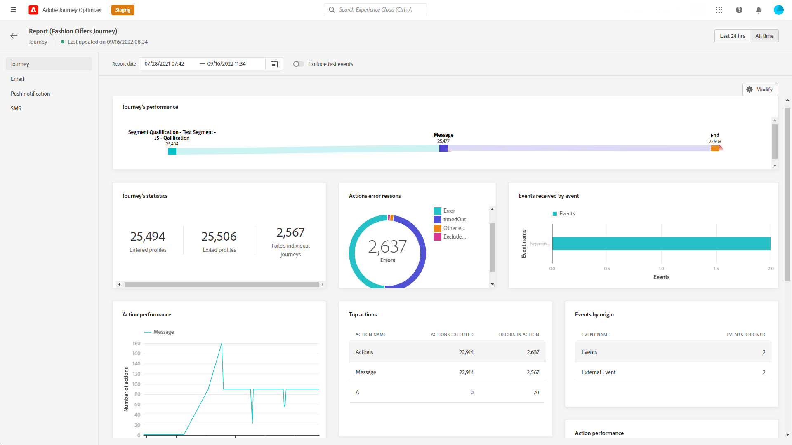

# 歷程全域報告 {#journey-global-report}

>[!CONTEXTUALHELP]
>id="ajo_journey_global_report"
>title="歷程全域報告"
>abstract="歷程全域報告可讓您測量您的歷程在選取時段內的影響。您的報告會分為不同的 Widget，詳細說明您的歷程的成功和錯誤。每個報告儀表板都可以透過調整大小或移除 Widget 來修改。"

全域報告可從「所有時間」標籤存取，顯示至少兩小時前發生的事件，以及涵蓋選定時段內的事件。 相較之下，即時報表著重於過去24小時內發生的事件，最短時間間隔為事件發生後的2分鐘。

歷程全域報告可直接從您的歷程存取，使用 **[!UICONTROL 檢視報告]** 按鈕。

歷程 **[!UICONTROL 全域報告]** 頁面會顯示以下索引標籤：

* [歷程](#journey-global)
* [電子郵件](#email-global)
* [推播](#push-global)
* [簡訊](#sms-global)

歷程 **[!UICONTROL 全域報告]** 分成不同的Widget，詳細說明您歷程的成功和錯誤。 如有需要，可以調整每個Widget的大小並將其刪除。 如需詳細資訊，請參閱此 [區段](global-report.md#modify-dashboard).

如需Adobe Journey Optimizer中可用每個量度的詳細清單，請參閱 [此頁面](global-report.md#list-of-components-global).

## 歷程索引標籤 {#journey-global}

從您的歷程 **[!UICONTROL 全域報告]**，則 **[!UICONTROL 歷程]** 標籤可讓您清楚檢視歷程最重要的追蹤資料。

+++進一步瞭解歷程報告可用的不同量度和Widget。

此 **[!UICONTROL 歷程績效]** widget可讓您在歷程中逐步檢視目標設定檔的路徑。

此 **[!UICONTROL 歷程統計資料]** widget會顯示下列KPI：

* **[!UICONTROL 輸入的設定檔]**：到達歷程進入事件的個人總數。

* **[!UICONTROL 已退出的設定檔]**：退出歷程的個人總數。

* **[!UICONTROL 失敗的個人歷程]**：未成功執行的個別歷程總數。

此 **[!UICONTROL 依事件收到的事件]**， **[!UICONTROL 依來源顯示的事件]** 和 **[!UICONTROL 熱門事件]** Widget可讓您檢視您的 **[!UICONTROL 事件]** 已透過圖表和表格成功執行。

**[!UICONTROL 動作績效]**， **[!UICONTROL 動作錯誤原因]** 和 **[!UICONTROL 熱門動作]** Widget代表在下列情況下發生的最成功動作和錯誤： **[!UICONTROL 動作]** 已觸發。

此 **[!UICONTROL 熱門動作]** 表格包含下列專案可用的資料： **[!UICONTROL 動作]**，例如：

* **[!UICONTROL 動作已成功執行]**：總數 **[!UICONTROL 動作]** 已成功為歷程執行。

* **[!UICONTROL 動作中發生錯誤]**：下列專案發生的錯誤總數 **[!UICONTROL 動作]**.

此 **[!UICONTROL 同意原則]** 表格和圖表會顯示自訂動作中從每個原則排除的設定檔數目。
如需自訂動作的詳細資訊，請參閱 [詳細檔案](../action/about-custom-action-configuration.md).

請注意，若要讓這些Widget顯示在您的歷程報告中，您需要重設儀表板。 若要這麼做，請按一下 **[!UICONTROL 修改]** 則 **[!UICONTROL 重設]** 在報表頂端。
+++

## 電子郵件索引標籤 {#email-global}

從您的歷程 **[!UICONTROL 全域報告]**，則 **[!UICONTROL 電子郵件]** 索引標籤會詳細說明與歷程中傳送的電子郵件傳遞相關的主要資訊。

+++進一步瞭解電子郵件報表可用的不同量度和Widget。

此 **[!UICONTROL 電子郵件傳送統計資料]** 圖表會詳細說明您的傳送是否成功：

* **[!UICONTROL 已定位]**：任何動作（例如傳送電子郵件或簡訊）的目標設定檔數。

* **[!UICONTROL 已傳送]**：傳遞的傳送總數。

* **[!UICONTROL 已傳遞]**：成功傳送的訊息數，與已傳送訊息總數相關。

* **[!UICONTROL 傳遞率]**：成功傳送的訊息百分比。

* **[!UICONTROL 彈回數]**：與已傳送訊息總數相關的傳送和自動傳回處理期間累計的錯誤總數。

* **[!UICONTROL 跳出率]**：與已傳送電子郵件相比跳出的電子郵件百分比。

* **[!UICONTROL 錯誤]**：傳送期間發生且無法傳送至設定檔的錯誤總數。

* **[!UICONTROL 錯誤率]**：與已傳送電子郵件相比，在傳送期間發生且無法傳送的錯誤百分比。

此 **[!UICONTROL 電子郵件 — 追蹤統計資料]** 包含傳遞的收件者活動可用資料：

* **[!UICONTROL 開啟次數]**：傳遞在傳遞中開啟的次數。

* **[!UICONTROL 不重複開啟次數]**：已開啟傳遞的百分比。

* **[!UICONTROL 不重複開啟率]**：已開啟電子郵件總數與已傳遞電子郵件數的比較。

* **[!UICONTROL 點按次數]**：內容在電子郵件中的點按次數。

* **[!UICONTROL 不重複點按]**：點按電子郵件中內容的收件者人數。

* **[!UICONTROL 點進率]**：與歷程互動的使用者百分比。

* **[!UICONTROL 取消訂閱]**：對取消訂閱連結的點按次數。

* **[!UICONTROL 垃圾郵件投訴]**：將郵件宣告為垃圾郵件或垃圾郵件的次數。

此 **[!UICONTROL 傳送統計資料]** 圖表包含可用於已傳送電子郵件的資料，例如：

* **[!UICONTROL 已傳遞]**：成功傳送的訊息數，與已傳送訊息總數相關。

* **[!UICONTROL 彈回數]**：與已傳送訊息總數相關的傳送和自動傳回處理期間累計的錯誤總數。

* **[!UICONTROL 錯誤]**：傳送期間發生且無法傳送至設定檔的錯誤總數。

此 **[!UICONTROL 退回原因]** 和 **[!UICONTROL 退回類別]** Widget包含與退信相關的可用資料，例如：

* **[!UICONTROL 硬跳出]**：永久錯誤的總數，例如錯誤的電子郵件地址。 這包含明確指出地址無效的錯誤訊息，例如「未知使用者」。

* **[!UICONTROL 軟退信]**：暫時性錯誤總數，例如完整收件匣。

* **[!UICONTROL 已忽略]**：暫時性的總數，例如「不在辦公室」，或是技術錯誤，例如，如果寄件者型別是postmaster。

如需退信的詳細資訊，請參閱 [隱藏清單](../reports/suppression-list.md) 頁面。

此 **[!UICONTROL 錯誤原因]** 圖表和表格可讓您檢視傳送期間發生的錯誤。

此 **[!UICONTROL 排除的原因]** 圖表和表格會顯示從目標設定檔中排除的使用者設定檔無法接收訊息的不同原因。

此 **[!UICONTROL 電子郵件 — 熱門URL]** 圖表和表格詳細說明來自您傳送的哪些URL的瀏覽次數最多。

此 **[!UICONTROL 電子郵件 — 熱門收件者網域]** 圖表和表格詳細說明收件者最常用來開啟電子郵件的網域。

>[!NOTE]
>
>此 **[!UICONTROL 已最佳化與未最佳化]** 和 **[!UICONTROL 傳送時間最佳化]**  只有針對您的傳送啟用傳送時間最佳化選項時，才可使用Widget。 如需傳送時間最佳化的詳細資訊，請參閱 [此頁面](../building-journeys/journeys-message.md#send-time-optimization).

此 **[!UICONTROL 已最佳化與未最佳化]** 圖表詳細說明與訊息相關的主要資訊（無論是否已最佳化）：

* **[!UICONTROL 已傳送]**：傳遞的傳送總數。
* **[!UICONTROL 開啟次數]**：傳遞在傳遞中開啟的次數。
* **[!UICONTROL 點按次數]**：內容在電子郵件中的點按次數。

此 **[!UICONTROL 傳送時間最佳化]** 根據傳送方式詳細說明您的傳送是否成功：已最佳化或正常。

* **[!UICONTROL 已傳遞]**：成功傳送的訊息數，與已傳送訊息總數相關。
* **[!UICONTROL 彈回數]**：與已傳送訊息總數相關的傳送和自動傳回處理期間累計的錯誤總數。

>[!NOTE]
>
>優惠方案Widget和量度僅在決定插入電子郵件時可用。 如需決策管理的詳細資訊，請參閱此 [頁面](../offers/get-started/starting-offer-decisioning.md).

此 **[!UICONTROL 優惠統計資料]** 和 **[!UICONTROL 優惠統計資料]** 一段時間內的Widget會衡量您選件的成功及對鎖定目標對象的影響。 它會使用KPI詳細說明與訊息相關的主要資訊：

* **[!UICONTROL 已傳送的優惠]**：優惠方案的傳送總數。

* **[!UICONTROL 優惠印象]**：在傳遞中開啟選件的次數。

* **[!UICONTROL 優惠點按次數]**：在傳送中點按優惠方案的次數。

此 **[!UICONTROL 優惠詳細統計資料]** 表格包含優惠方案的收件者活動可用資料：

* **[!UICONTROL 位置名稱]**：用來顯示優惠方案的位置名稱。 如需位置的詳細資訊，請參閱此 [頁面](../offers/offer-library/creating-placements.md).

* **[!UICONTROL 選件名稱]**：在傳送中新增的優惠方案名稱。 如需位置的詳細資訊，請參閱此 [頁面](../offers/offer-library/creating-personalized-offers.md).

* **[!UICONTROL 已傳送的優惠]**：優惠方案的傳送總數。

* **[!UICONTROL 優惠曝光率]**：已開啟選件相對於已傳送選件數的百分比。

* **[!UICONTROL 優惠點按率]**：與優惠方案互動的使用者百分比。
+++

## 推播通知標籤 {#push-global}

從您的歷程 **[!UICONTROL 全域報告]**，則 **[!UICONTROL 推播通知]** 索引標籤會詳細說明與歷程中傳送的推播傳遞相關的主要資訊。

+++進一步瞭解推送報告可用的不同量度和Widget。

此 **[!UICONTROL 推播通知 — 傳送統計資料]** 表格會使用圖表和KPI詳細列出與推播通知相關的主要資訊：

* **[!UICONTROL 已定位]**：任何動作（例如傳送電子郵件或簡訊）的目標設定檔數。

* **[!UICONTROL 已傳送]**：傳遞的傳送總數。

* **[!UICONTROL 已傳遞]**：成功傳送的訊息數，與已傳送訊息總數相關。

* **[!UICONTROL 傳遞率]**：成功傳送的訊息百分比。

* **[!UICONTROL 彈回數]**：與已傳送訊息總數相關的傳送和自動傳回處理期間累計的錯誤總數。

* **[!UICONTROL 跳出率]**：與已傳送的推播通知相比，已跳出的推播通知的百分比。

* **[!UICONTROL 錯誤]**：傳送期間發生且無法傳送至設定檔的錯誤總數。

* **[!UICONTROL 錯誤率]**：與已傳送的推播通知相比，在傳送期間發生且無法傳送的錯誤百分比。

此 **[!UICONTROL 推播 — 追蹤統計資料]** 包含傳遞的收件者活動可用資料：

* **[!UICONTROL 開啟次數]**：在傳遞中開啟訊息的次數。

* **[!UICONTROL 開啟率]**：已開啟推播通知的百分比。

* **[!UICONTROL 動作]**：推播通知已傳遞的動作總數，例如按鈕點選或解除。

* **[!UICONTROL 參與]**：此推播通知的開啟和動作總數，即設定檔是否已開啟推播，或按鈕是否已點按。

* **[!UICONTROL 參與率]**：此推播通知的開啟和動作百分比，亦即設定檔是否已開啟推播，或按鈕是否已點按。

此 **[!UICONTROL 推播通知摘要]** 圖表包含可用於傳送推播通知的資料，例如：

* **[!UICONTROL 開啟次數]**：在傳遞中開啟訊息的次數。

* **[!UICONTROL 動作]**：推播通知已傳遞的動作總數，例如按鈕點選或解除。

* **[!UICONTROL 彈回數]**：與已傳送訊息總數相關的傳送和自動傳回處理期間累計的錯誤總數。

* **[!UICONTROL 已傳遞]**：成功傳送的訊息數，與已傳送訊息總數相關。

* **[!UICONTROL 錯誤]**：傳送期間發生且無法傳送至設定檔的錯誤總數。

>[!NOTE]
>
>此 **[!UICONTROL 已最佳化與未最佳化]** 和 **[!UICONTROL 傳送時間最佳化]**  只有針對您的傳送啟用傳送時間最佳化選項時，才可使用Widget。 如需傳送時間最佳化的詳細資訊，請參閱 [此頁面](../building-journeys/journeys-message.md#send-time-optimization).

此 **[!UICONTROL 已最佳化與未最佳化]** 圖表詳細說明與訊息相關的主要資訊（無論是否已最佳化）：

* **[!UICONTROL 已傳遞]**：成功傳送的訊息數，與已傳送訊息總數相關。
* **[!UICONTROL 開啟次數]**：傳遞在傳遞中開啟的次數。
* **[!UICONTROL 動作]**：推播通知已傳遞的動作總數，例如按鈕點選或解除。

此 **[!UICONTROL 傳送時間最佳化]** 根據傳送方式詳細說明您的傳送是否成功：已最佳化或正常。

* **[!UICONTROL 已傳遞]**：成功傳送的訊息數，與已傳送訊息總數相關。
* **[!UICONTROL 彈回數]**：與已傳送訊息總數相關的傳送和自動傳回處理期間累計的錯誤總數。

此 **[!UICONTROL 錯誤原因]** 圖表和表格可讓您檢視傳送期間發生的錯誤。

此 **[!UICONTROL 排除的原因]** 圖表和表格會顯示從目標設定檔中排除的使用者設定檔無法接收訊息的不同原因。

此 **[!UICONTROL 依據平台的追蹤]**， **[!UICONTROL 由平台傳送]** 和 **[!UICONTROL 依平台劃分]** 圖表和表格會根據收件者的作業系統，詳細說明推播通知的成功與否。

簡訊 **[!UICONTROL 全域報告]** 分成不同的Widget，詳細說明傳送的成功和錯誤。 如有需要，可以調整每個Widget的大小並將其刪除。 如需詳細資訊，請參閱此 [區段](global-report.md#modify-dashboard).
+++

## 簡訊索引標籤 {#sms-global}

+++進一步瞭解SMS報表可用的不同量度和Widget。

此 **[!UICONTROL 簡訊 — 傳送統計資料]** 表格詳細說明您的傳送是否成功：

* **[!UICONTROL 已定位]**：符合此傳送目標設定檔資格的使用者設定檔數目。

* **[!UICONTROL 已排除]**：從目標設定檔中排除且未收到訊息的使用者設定檔數目。

* **[!UICONTROL 已傳送]**：傳遞的傳送總數。

* **[!UICONTROL 已傳遞]**：成功傳送的訊息數，與已傳送訊息總數相關。

* **[!UICONTROL 彈回數]**：與已傳送訊息總數相關的傳送和自動傳回處理期間累計的錯誤總數。

* **[!UICONTROL 錯誤]**：傳送期間發生且無法傳送至設定檔的錯誤總數。

此 **[!UICONTROL 簡訊摘要]** Widget會以圖表詳細列出與訊息相關的主要資訊：

* **[!UICONTROL 已傳送]**：傳遞的傳送總數。

* **[!UICONTROL 已傳遞]**：成功傳送的訊息數，與已傳送訊息總數相關。

* **[!UICONTROL 彈回數]**：與已傳送訊息總數相關的傳送和自動傳回處理期間累計的錯誤總數。

* **[!UICONTROL 錯誤]**：傳送期間發生且無法傳送至設定檔的錯誤總數。

此 **[!UICONTROL 排除原因]** 圖表和表格可讓您檢視傳送期間發生哪些錯誤和排除。

此 **[!UICONTROL 簡訊 — 依據連結的點按次數]** 和 **[!UICONTROL 簡訊 — 追蹤統計資料]** Widget會詳細說明與訪客對您URL的參與度相關的主要資訊。

+++
