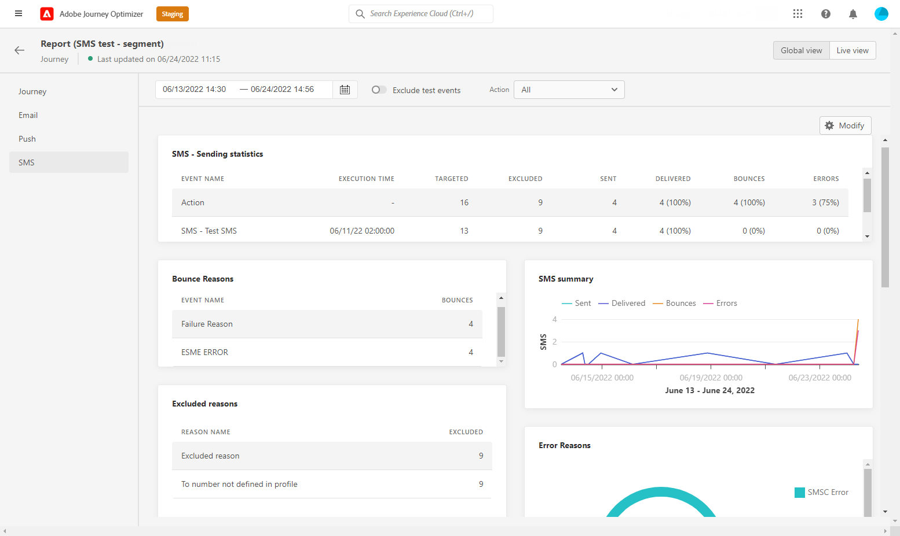

# 歷程全域報告 {#journey-global-report}

您可以直接通過 **[!UICONTROL Global report]** 按鈕

旅程 **[!UICONTROL Global report]** 的子菜單。

* [歷程](#journey-global)
* [電子郵件](#email-global)
* [推播](#push-global)
* [SMS](#sms-global)

旅程 **[!UICONTROL Global report]** 被分成不同的小部件，詳細描述你旅途的成功和錯誤。 如果需要，可以調整每個小部件的大小並將其刪除。 有關此的詳細資訊，請參閱此 [節](global-report.md#modify-dashboard)。

## 行程頁籤 {#journey-global}

從你的旅程 **[!UICONTROL Global report]**，也請參見Wiki頁。 **[!UICONTROL Journey]** 頁籤可讓您清楚地查看有關行程的最重要跟蹤資料。

的 **[!UICONTROL Journey Performance]** 構件允許您逐步查看目標配置檔案的路徑。

的 **[!UICONTROL Journey Statistics]** 小部件顯示以下KPI:

* **[!UICONTROL Entered profiles]**:到達旅程的入門事件的個人總數。

* **[!UICONTROL Exited profiles]**:離開旅程的個人總數。

* **[!UICONTROL Failed individual journey]**:未成功執行的單個行程的總數。

的 **[!UICONTROL Events received by event]**。 **[!UICONTROL Events by origin]** 和 **[!UICONTROL Top events]** 小部件可讓您查看 **[!UICONTROL Events]** 已通過圖形和表成功執行。

**[!UICONTROL Action Performance]**。 **[!UICONTROL Action Error Reasons]** 和 **[!UICONTROL Top Actions]** 小部件代表您在 **[!UICONTROL Actions]** 觸發。

的 **[!UICONTROL Top Actions]** 表包含可用於 **[!UICONTROL Actions]**，例如：

* **[!UICONTROL Actions successfully executed]**:總數 **[!UICONTROL Actions]** 成功執行。

* **[!UICONTROL Error in action]**:發生的錯誤總數 **[!UICONTROL Actions]**。

## 電子郵件頁籤 {#email-global}

從你的旅程 **[!UICONTROL Global report]**，也請參見Wiki頁。 **[!UICONTROL Email]** 頁籤，詳細列出與在旅途中發送的電子郵件遞送相關的主要資訊。

的 **[!UICONTROL Email Sending Statistics]** 圖表詳細說明了您交付的成功：

* **[!UICONTROL Targeted]**:AdobeJourney Orchestration針對任何操作（如發送電子郵件或SMS）的配置檔案數

* **[!UICONTROL Sent]**:交貨的發送總數。

* **[!UICONTROL Delivered]**:成功發送的消息數，與已發送的消息總數相關。

* **[!UICONTROL Delivery Rate]**:成功發送的郵件百分比。

* **[!UICONTROL Bounces]**:在傳遞和自動返回處理期間累積的與已發送消息總數有關的錯誤總數。

* **[!UICONTROL Bounce Rate]**:與發送的電子郵件相比，已跳轉的電子郵件的百分比。

* **[!UICONTROL Errors]**:在傳遞期間發生的錯誤總數，使其無法發送到配置檔案。

* **[!UICONTROL Error Rate]**:與發送的電子郵件相比，在發送過程中發生的阻止發送錯誤的百分比。

的 **[!UICONTROL Email - Tracking statistics]** 包含您交貨的收件人活動的可用資料：

* **[!UICONTROL Opens]**:在交貨中開啟交貨的次數。

* **[!UICONTROL Unique Opens]**:已開啟交貨的百分比。

* **[!UICONTROL Unique Open Rate]**:已開啟電子郵件的總數與已發送電子郵件的數量相比。

* **[!UICONTROL Clicks]**:在電子郵件中按一下內容的次數。

* **[!UICONTROL Unique Clicks]**：按一下電子郵件內容的收件人數。

* **[!UICONTROL Click through rate]**:與旅程互動的用戶百分比。

* **[!UICONTROL Unsubscribe]**:取消訂閱連結上的按一下次數。

* **[!UICONTROL Spam complaints]**:將郵件聲明為垃圾郵件或垃圾郵件的次數。

的 **[!UICONTROL Sending Statistics]** 圖形包含可用於已發送電子郵件的資料，如：

* **[!UICONTROL Delivered]**:成功發送的消息數，與已發送的消息總數相關。

* **[!UICONTROL Bounces]**:在傳遞和自動返回處理期間累積的與已發送消息總數有關的錯誤總數。

* **[!UICONTROL Errors]**:在傳遞期間發生的錯誤總數，使其無法發送到配置檔案。

的 **[!UICONTROL Bounce Reasons]** 和 **[!UICONTROL Bounce categories]** 小部件包含與已恢復消息相關的可用資料，如：

* **[!UICONTROL Hard bounce]**:永久錯誤（如錯誤的電子郵件地址）的總數。 這涉及一條錯誤消息，該錯誤消息明確指出地址無效，如「未知用戶」。

* **[!UICONTROL Soft bounce]**:臨時錯誤（如完整收件箱）的總數。

* **[!UICONTROL Ignored]**:臨時（如「外出」）或技術錯誤（例如，如果發件人類型是郵遞員）的總數。

有關退貨的詳細資訊，請參閱 [隱藏清單](../reports/suppression-list.md) 的子菜單。

的 **[!UICONTROL Error Reasons]** 圖形和表格允許您查看在交付期間發生的錯誤。

的 **[!UICONTROL Excluded reasons]** 圖形和表顯示阻止從目標配置檔案中排除的用戶配置檔案接收消息的不同原因。

的 **[!UICONTROL Email - Top Url]** 圖表和表詳細資訊，您傳遞的URL訪問量最大。

的 **[!UICONTROL Email - Top recipient domain]** 圖表和表詳細資訊，哪些域是收件人開啟電子郵件時最常用的域。

>[!NOTE]
>
>的 **[!UICONTROL Optimized vs non optimized]** 和 **[!UICONTROL Send time optimization]**  只有在為您的交貨激活「發送時間優化」選項時，小部件才可用。 有關發送時間優化的詳細資訊，請參閱 [此頁](../messages/send-time-optimization.md)。

的 **[!UICONTROL Optimized vs non optimized]** 圖表詳細列出了與消息相關的主要資訊，這些資訊是否已優化：

* **[!UICONTROL Sent]**:交貨的發送總數。
* **[!UICONTROL Opens]**:在交貨中開啟交貨的次數。
* **[!UICONTROL Clicks]**:在電子郵件中按一下內容的次數。

的 **[!UICONTROL Send time optimization]** 根據發送方法詳細說明您的交付成功：已優化或正常。

* **[!UICONTROL Delivered]**:成功發送的消息數，與已發送的消息總數相關。
* **[!UICONTROL Bounces]**:在傳遞和自動返回處理期間累積的與已發送消息總數有關的錯誤總數。

>[!NOTE]
>
>只有在電子郵件中插入了決定時，「提供」小部件和度量才可用。 有關決策管理的詳細資訊，請參閱 [頁](../offers/get-started/starting-offer-decisioning.md)。

的 **[!UICONTROL Offers statistic]** 和 **[!UICONTROL Offers statistics]** 隨著時間推移，小部件可衡量您的產品的成功程度以及對目標受眾的影響。 它使用KPI詳細列出與消息相關的主要資訊：

* **[!UICONTROL Offer sent]**:發送要約的總數。

* **[!UICONTROL Offer impression]**:在交貨中開啟要約的次數。

* **[!UICONTROL Offer clicks]**:在交貨中按一下要約的次數。

的 **[!UICONTROL Offers detailed statistic]** 表包含與您的優惠一起用於收件人活動的可用資料：

* **[!UICONTROL Placement name]**:用於顯示優惠的位置的名稱。 有關放置的詳細資訊，請參閱 [頁](../offers/offer-library/creating-placements.md)。

* **[!UICONTROL Offer name]**:在交貨中添加的要約的名稱。 有關放置的詳細資訊，請參閱 [頁](../offers/offer-library/creating-personalized-offers.md)。

* **[!UICONTROL Offer sent]**:發送要約的總數。

* **[!UICONTROL Offer impression rate]**:已開啟的優惠與已發送的優惠數目相比的百分比。

* **[!UICONTROL Offer click rate]**:與報價互動的用戶百分比。

## 推式頁籤 {#push-global}

從你的旅程 **[!UICONTROL Global report]**，也請參見Wiki頁。 **[!UICONTROL Push]** 頁籤詳細列出與在行程中發送的推送交貨相關的主要資訊。

的 **[!UICONTROL Push notification - Sending statistics]** 表詳細列出了與使用圖表和KPI的推送通知相關的主要資訊：

* **[!UICONTROL Targeted]**:AdobeJourney Orchestration針對任何操作（如發送電子郵件或SMS）的配置檔案數

* **[!UICONTROL Sent]**:交貨的發送總數。

* **[!UICONTROL Delivered]**:成功發送的消息數，與已發送的消息總數相關。

* **[!UICONTROL Delivery Rate]**:成功發送的郵件百分比。

* **[!UICONTROL Bounces]**:在傳遞和自動返回處理期間累積的與已發送消息總數有關的錯誤總數。

* **[!UICONTROL Bounce Rate]**:與發送的推送通知相比，已跳轉的推送通知的百分比。

* **[!UICONTROL Errors]**:在傳遞期間發生的錯誤總數，使其無法發送到配置檔案。

* **[!UICONTROL Error Rate]**:與發送的推送通知相比，在發送過程中發生的錯誤阻止發送的百分比。

的 **[!UICONTROL Push - Tracking statistics]** 包含您交貨的收件人活動的可用資料：

* **[!UICONTROL Opens]**:在傳遞中開啟消息的次數。

* **[!UICONTROL Open Rate]**:開啟的推送通知百分比。

* **[!UICONTROL Actions]**:已傳遞的推送通知操作總數，例如按一下按鈕或解除按鈕。

* **[!UICONTROL Engagements]**:此推送通知的開啟和操作總數，即，如果配置檔案開啟了推送或按一下了按鈕。

* **[!UICONTROL Engagement Rate]**:此推送通知的開啟和操作的百分比，即，如果配置檔案開啟了推送或按一下了按鈕。

的 **[!UICONTROL Push notification summary]** 圖形包含可用於發送推送通知的資料，如：

* **[!UICONTROL Opens]**:在傳遞中開啟消息的次數。

* **[!UICONTROL Actions]**:已傳遞的推送通知操作總數，例如按一下按鈕或解除按鈕。

* **[!UICONTROL Bounces]**:在傳遞和自動返回處理期間累積的與已發送消息總數有關的錯誤總數。

* **[!UICONTROL Delivered]**:成功發送的消息數，與已發送的消息總數相關。

* **[!UICONTROL Errors]**:在傳遞期間發生的錯誤總數，使其無法發送到配置檔案。

>[!NOTE]
>
>的 **[!UICONTROL Optimized vs non optimized]** 和 **[!UICONTROL Send time optimization]**  只有在為您的交貨激活「發送時間優化」選項時，小部件才可用。 有關發送時間優化的詳細資訊，請參閱 [此頁](../messages/send-time-optimization.md)。

的 **[!UICONTROL Optimized vs non optimized]** 圖表詳細列出了與消息相關的主要資訊，這些資訊是否已優化：

* **[!UICONTROL Delivered]**:成功發送的消息數，與已發送的消息總數相關。
* **[!UICONTROL Opens]**:在交貨中開啟交貨的次數。
* **[!UICONTROL Actions]**:已傳遞的推送通知操作總數，例如按一下按鈕或解除按鈕。

的 **[!UICONTROL Send time optimization]** 根據發送方法詳細說明您的交付成功：已優化或正常。

* **[!UICONTROL Delivered]**:成功發送的消息數，與已發送的消息總數相關。
* **[!UICONTROL Bounces]**:在傳遞和自動返回處理期間累積的與已發送消息總數有關的錯誤總數。

的 **[!UICONTROL Error Reasons]** 圖形和表格允許您查看在交付期間發生的錯誤。

的 **[!UICONTROL Excluded reasons]** 圖形和表顯示阻止從目標配置檔案中排除的用戶配置檔案接收消息的不同原因。

的 **[!UICONTROL Tracking by platform]**。 **[!UICONTROL Sending by platform]** 和 **[!UICONTROL Breakdown by platform]** 圖表和表格根據收件人的作業系統詳細說明推送通知的成功。

簡訊 **[!UICONTROL Global report]** 被分成不同的小部件，詳細列出交付的成功和錯誤。 如果需要，可以調整每個小部件的大小並將其刪除。 有關此項的詳細資訊，請參閱 [節](global-report.md#modify-dashboard)。

## SMS頁籤 {#sms-global}

的 **[!UICONTROL SMS - Sending statistics]** 表詳細列出了您交付的成功：

* **[!UICONTROL Targeted]**:符合此傳遞目標配置檔案的用戶配置檔案數。

* **[!UICONTROL Excluded]**:未接收消息的從目標配置檔案中排除的用戶配置檔案數。

* **[!UICONTROL Sent]**:交貨的發送總數。

* **[!UICONTROL Delivered]**:成功發送的消息數，與已發送的消息總數相關。

* **[!UICONTROL Bounces]**:在傳遞和自動返回處理期間累積的與已發送消息總數有關的錯誤總數。

* **[!UICONTROL Errors]**:在傳遞期間發生的錯誤總數，使其無法發送到配置檔案。

的 **[!UICONTROL SMS summary]** 小部件使用圖表詳細列出與消息相關的主要資訊：

* **[!UICONTROL Sent]**:交貨的發送總數。

* **[!UICONTROL Delivered]**:成功發送的消息數，與已發送的消息總數相關。

* **[!UICONTROL Bounces]**:在傳遞和自動返回處理期間累積的與已發送消息總數有關的錯誤總數。

* **[!UICONTROL Errors]**:在傳遞期間發生的錯誤總數，使其無法發送到配置檔案。

的 **[!UICONTROL Exclude Reasons]** 圖形和表格允許您查看在交付期間發生的錯誤和排除。
