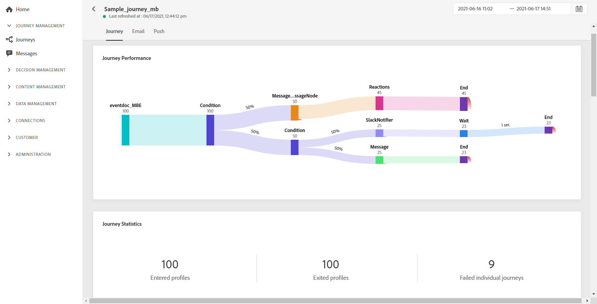

# 歷程全域報表{#journey-global-report}

您可使用&#x200B;**[!UICONTROL Global report]**&#x200B;按鈕，直接從您的歷程存取歷程全域報表。

歷程&#x200B;**[!UICONTROL Global report]**&#x200B;頁面將顯示以下索引標籤：

* [歷程](#journey-global)
* [電子郵件](#email-global)
* [推播](#push-global)

歷程&#x200B;**[!UICONTROL Global report]**&#x200B;會分為不同的Widget，詳述您歷程的成功和錯誤。 如有需要，可對每個介面工具集調整大小並加以刪除。 有關詳細資訊，請參閱此[節](global-report.md#modify-dashboard)。

## 歷程索引標籤{#journey-global}

從您的歷程&#x200B;**[!UICONTROL Global report]**&#x200B;中， **[!UICONTROL Journey]**&#x200B;標籤可讓您清楚檢視有關歷程的最重要追蹤資料。

**[!UICONTROL Journey`s performance]**&#x200B;介面工具集可讓您逐步查看目標設定檔的歷程路徑。

**[!UICONTROL Journey`s statistics]**&#x200B;介面工具集顯示以下KPI:

* **[!UICONTROL Entered profiles]**:到達歷程進入事件的個人總數。

* **[!UICONTROL Exited profiles]**:離開歷程的個人總數。

* **[!UICONTROL Failed individual journey]**:未成功執行的個別歷程總數。

**[!UICONTROL Event Performance]**&#x200B;和&#x200B;**[!UICONTROL Top events]**&#x200B;介面工具集允許您查看哪個&#x200B;**[!UICONTROL Events]**&#x200B;元件通過圖形和表成功執行。

**[!UICONTROL Action Performance]** 和 **[!UICONTROL Top Actions]** Widget代表觸發時發生的最成功動作 **[!UICONTROL Actions]** 和錯誤。**[!UICONTROL Top Actions]**&#x200B;表包含可用於&#x200B;**[!UICONTROL Actions]**&#x200B;的資料，例如：

* **[!UICONTROL Actions successfully executed]**:成功執 **[!UICONTROL Actions]** 行歷程的總數。

* **[!UICONTROL Error in action]**:發生的錯誤總 **[!UICONTROL Actions]**&#x200B;數。

**[!UICONTROL Error Reasons]**&#x200B;圖表詳細說明為&#x200B;**[!UICONTROL Actions]**&#x200B;發生的錯誤類型。

<!--Events by origin-->

## 電子郵件標籤{#email-global}

從您的歷程&#x200B;**[!UICONTROL Global report]**&#x200B;中， **[!UICONTROL Email]**&#x200B;標籤會詳細說明與歷程中傳送的電子郵件傳送相關的主要資訊。

如需特定電子郵件傳送的詳細報表，請參閱[電子郵件全域報表](#email-global-report)區段。

**[!UICONTROL Email Sending Statistics]**&#x200B;圖表會詳細說明傳送的成功：

* **[!UICONTROL Sent]**:傳送的傳送總數。

* **[!UICONTROL Delivered]**:已成功傳送的訊息數，與已傳送的訊息總數相關。

* **[!UICONTROL Delivery Rate]**:已成功發送的消息的百分比。

* **[!UICONTROL Bounces]**:傳送和自動回傳處理期間累積的錯誤總數，與已傳送訊息的總數相關。

* **[!UICONTROL Bounce Rate]**:跳出的電子郵件與傳送的電子郵件的百分比。

* **[!UICONTROL Errors]**:傳送期間發生的錯誤總數，使其無法傳送至設定檔。

* **[!UICONTROL Error Rate]**:傳送期間發生、無法傳送的錯誤百分比，與已傳送的電子郵件相比。

**[!UICONTROL Email - Tracking statistics]**&#x200B;包含傳遞的收件者活動可用資料：

* **[!UICONTROL Opens]**:傳送中開啟傳送的次數。

* **[!UICONTROL Unique Opens]**:已開啟傳遞的百分比。

* **[!UICONTROL Open Rate]**:已開啟電子郵件的總數與已傳送電子郵件的總數相比。

* **[!UICONTROL Clicks]**:電子郵件中內容被點按的次數。

* **[!UICONTROL Unique Clicks]**：按一下電子郵件內容的收件者人數。

* **[!UICONTROL Click through rate]**:與歷程互動的使用者百分比。

**[!UICONTROL Sending Statistics]**&#x200B;圖表包含可用於已傳送電子郵件的資料，例如：

* **[!UICONTROL Delivered]**:已成功傳送的訊息數，與已傳送的訊息總數相關。

* **[!UICONTROL Bounces]**:傳送和自動回傳處理期間累積的錯誤總數，與已傳送訊息的總數相關。

* **[!UICONTROL Errors]**:傳送期間發生的錯誤總數，使其無法傳送至設定檔。

**[!UICONTROL Bounce Reasons]**&#x200B;和&#x200B;**[!UICONTROL Bounce categories]**&#x200B;介面工具集包含與退信消息相關的可用資料，例如：

* **[!UICONTROL Hard bounce]**:永久錯誤的總數，例如錯誤的電子郵件地址。這包含明確指出地址無效的錯誤訊息，例如「未知」使用者。

* **[!UICONTROL Soft bounce]**:臨時錯誤（如完整收件箱）的總數。

* **[!UICONTROL Ignored]**:臨時的總數，例如「不在辦公室」或技術錯誤，例如，如果發送者類型是郵遞區號。

有關跳出的詳細資訊，請參閱[隱藏清單](../suppression-list.md)頁面。

**[!UICONTROL Email - Top Url]**&#x200B;圖表和表格會詳細說明您傳送中最常造訪的URL。

**[!UICONTROL Email - Best recipient domain]**&#x200B;圖表和表格會詳細說明收件者最常使用哪些網域來開啟電子郵件。

## 推播標籤{#push-global}

從您的歷程&#x200B;**[!UICONTROL Global report]**&#x200B;中，**[!UICONTROL Push]**&#x200B;標籤會詳細說明與歷程中傳送的推送傳送相關的主要資訊。

如需特定推送傳送的詳細報表，請參閱[推送全域報表](#push-global-report)。

**[!UICONTROL Push notification - Sending statistics]**&#x200B;表格會透過圖表和KPI詳細說明與推播通知相關的主要資訊：

* **[!UICONTROL Sent]**:傳送的傳送總數。

* **[!UICONTROL Delivered]**:已成功傳送的訊息數，與已傳送的訊息總數相關。

* **[!UICONTROL Delivery Rate]**:已成功發送的消息的百分比。

* **[!UICONTROL Bounces]**:傳送和自動回傳處理期間累積的錯誤總數，與已傳送訊息的總數相關。

* **[!UICONTROL Bounce Rate]**:跳出的推播通知與傳送的推播通知的百分比。

* **[!UICONTROL Errors]**:傳送期間發生的錯誤總數，使其無法傳送至設定檔。

* **[!UICONTROL Error Rate]**:與傳送的推播通知相比，傳送期間發生而無法傳送的錯誤百分比。

**[!UICONTROL Push - Tracking statistics]**&#x200B;包含傳遞的收件者活動可用資料：

* **[!UICONTROL Opens]**:傳送中開啟訊息的次數。

* **[!UICONTROL Open Rate]**:已開啟推播通知的百分比。

* **[!UICONTROL Actions]**:已傳送推播通知的動作總數，例如按鈕點擊或解除。

* **[!UICONTROL Engagements]**:此推播通知的開啟次數和動作總數，亦即設定檔開啟了推播或按了按鈕。

* **[!UICONTROL Engagement Rate]**:此推播通知的開啟次數和動作百分比，亦即設定檔開啟了推播或按鈕被點按時。

**[!UICONTROL Push notification summary]**&#x200B;圖表包含可用於傳送推播通知的資料，例如：

* **[!UICONTROL Opens]**:傳送中開啟訊息的次數。

* **[!UICONTROL Actions]**:已傳送推播通知的動作總數，例如按鈕點擊或解除。

* **[!UICONTROL Bounces]**:傳送和自動回傳處理期間累積的錯誤總數，與已傳送訊息的總數相關。

* **[!UICONTROL Delivered]**:已成功傳送的訊息數，與已傳送的訊息總數相關。

* **[!UICONTROL Errors]**:傳送期間發生的錯誤總數，使其無法傳送至設定檔。

**[!UICONTROL Error Reasons]**&#x200B;圖表和表格可讓您查看在傳送期間發生的錯誤。

**[!UICONTROL Tracking by platform]**、**[!UICONTROL Sending by platform]**&#x200B;和&#x200B;**[!UICONTROL Breakdown by platform]**&#x200B;圖表和表格會根據收件者的作業系統，詳細說明推播通知的成功。
