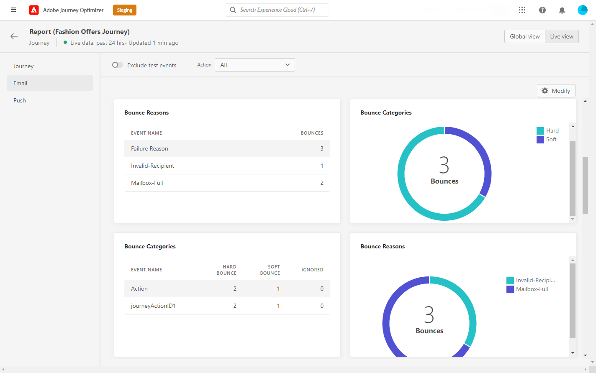
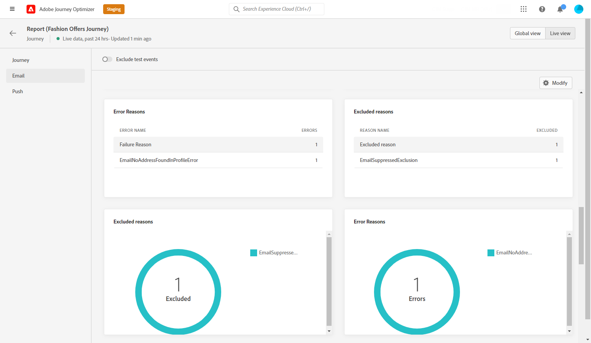
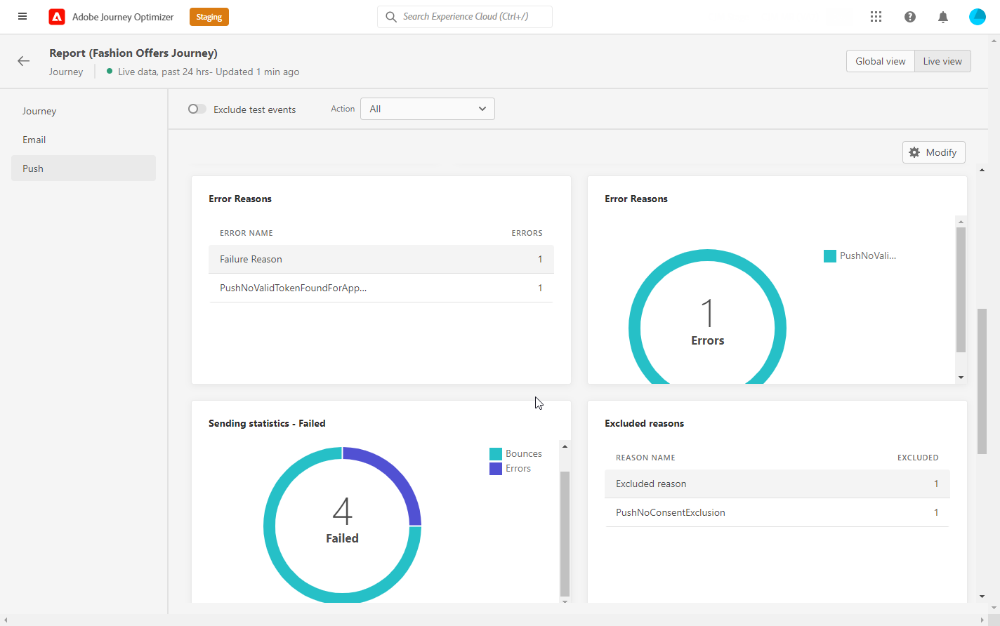
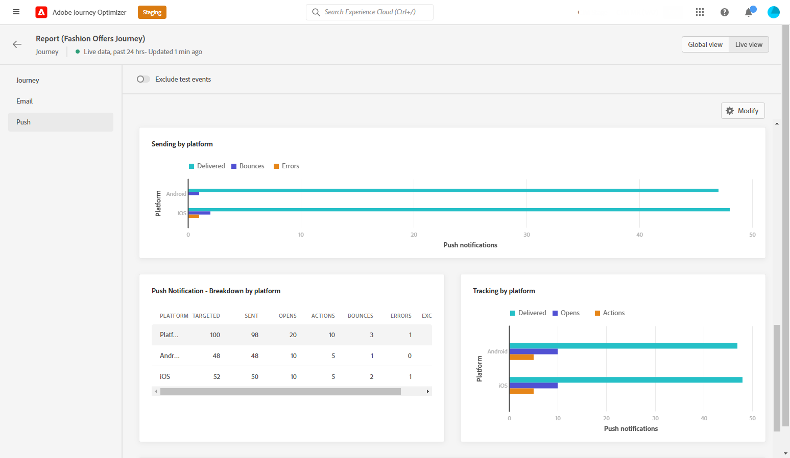

# 歷程即時報告 {#journey-live-report}

您可以直接通過 **[!UICONTROL Live report]** 按鈕

旅程 **[!UICONTROL Live report]** 的子菜單。

* [歷程](#journey-live)
* [電子郵件](#email-live)
* [推播](#push-live)
* [SMS](#sms-live)

旅程 **[!UICONTROL Live report]** 被分成不同的小部件，詳細描述你旅途的成功和錯誤。 如果需要，可以調整每個小部件的大小並將其刪除。 有關此的詳細資訊，請參閱此 [節](live-report.md#modify-dashboard)。

## 行程頁籤 {#journey-live}

從你的旅程 **[!UICONTROL Live report]**，也請參見Wiki頁。 **[!UICONTROL Journey]** 頁籤可讓您清楚地查看有關行程的最重要跟蹤資料。

**[!UICONTROL Journey Performance]** 允許您逐步查看目標配置檔案的路徑。

的 **[!UICONTROL Journey Statistics]** 小部件顯示以下KPI:

* **[!UICONTROL Entered profiles]**:到達旅程的入門事件的個人總數。

* **[!UICONTROL Exited profiles]**:離開旅程的個人總數。

* **[!UICONTROL Failed individual journeys]**:未成功執行的單個行程的總數。

的 **[!UICONTROL Event executed over the last 24 hours]** 和 **[!UICONTROL Events]** 通過小部件，您可以通過摘要編號、圖形和表來查看哪些事件已成功執行。

的 **[!UICONTROL Action executed over the last 24 hours]** 和 **[!UICONTROL Actions executed and errors]** 小部件表示觸發操作時發生的最成功的操作和錯誤。 「操作」圖形、表和摘要編號包含可用於操作的資料，例如：

* **[!UICONTROL Actions executed]**:成功執行行程的操作總數。

* **[!UICONTROL Error in actions]**:為操作發生的錯誤總數。

## 電子郵件頁籤 {#email-live}

從你的旅程 **[!UICONTROL Live report]**，也請參見Wiki頁。 **[!UICONTROL Email]** 頁籤，詳細列出與在旅途中發送的電子郵件遞送相關的主要資訊。

有關特定電子郵件傳遞的詳細報告，請參閱 [電子郵件即時報告](email-live-report.md) 的子菜單。

的 **[!UICONTROL Email Sending Statistics]** 小部件詳細列出與消息相關的主要資訊：

* **[!UICONTROL Delivered]**:成功發送的消息數。

* **[!UICONTROL Bounces]**:在交貨和自動退貨處理期間累積的錯誤總數。

* **[!UICONTROL Errors]**:在傳遞期間發生的錯誤總數，使其無法發送到配置檔案。

的 **[!UICONTROL Sending metrics by Email]** 表格和 **[!UICONTROL Email Summary]** 圖表詳細說明了您交付的成功：

* **[!UICONTROL Sent]**:交貨的發送總數。

* **[!UICONTROL Delivered]**:成功發送的消息數。

* **[!UICONTROL Bounces]**:在交貨和自動退貨處理期間累積的錯誤總數。

* **[!UICONTROL Errors]**:在傳遞期間發生的錯誤總數，使其無法發送到配置檔案。

* **[!UICONTROL Opens]**:在傳遞中開啟消息的次數。

* **[!UICONTROL Clicks]**:在傳遞中按一下內容的次數。

* **[!UICONTROL Unsubscribe]**:取消訂閱連結上的按一下次數。

* **[!UICONTROL Spam complaints]**:將郵件聲明為垃圾郵件或垃圾郵件的次數。

的 **[!UICONTROL Bounce Reasons]**。 **[!UICONTROL Bounce categories]** 和 **[!UICONTROL Hard and bounce - by Email]** 小部件包含與已恢復消息相關的可用資料，如：

* **[!UICONTROL Hard bounce]**:永久錯誤（如錯誤的電子郵件地址）的總數。 這涉及一條錯誤消息，該錯誤消息明確指出地址無效，如「未知用戶」。

* **[!UICONTROL Soft bounce]**:臨時錯誤（如完整收件箱）的總數。

* **[!UICONTROL Ignored]**:臨時（如「外出」）或技術錯誤（例如，如果發件人類型是郵遞員）的總數。

的 **[!UICONTROL Error Reasons]** 和 **[!UICONTROL Exclude Reasons]** 圖形和表格允許您查看在交付期間發生的錯誤和排除。

的 **[!UICONTROL Email - Top recipient domain]** 圖表和表詳細資訊，哪些域是收件人開啟電子郵件時最常用的域。

>[!NOTE]
>
>只有在電子郵件中插入了決定時，「提供」小部件和度量才可用。 有關決策管理的詳細資訊，請參閱 [頁](../offers/get-started/starting-offer-decisioning.md)。

的 **[!UICONTROL Offers statistic]** 和 **[!UICONTROL Offers statistics]** 隨著時間推移，小部件可衡量您的產品的成功程度以及對目標受眾的影響。 它使用KPI詳細列出與消息相關的主要資訊：

* **[!UICONTROL Offer sent]**:發送要約的總數。

* **[!UICONTROL Offer impression]**:在交貨中開啟要約的次數。

* **[!UICONTROL Offer clicks]**:在交貨中按一下要約的次數。

## 推式頁籤 {#push-live}

從你的旅程 **[!UICONTROL Live report]**，也請參見Wiki頁。 **[!UICONTROL Push]** 頁籤詳細列出與在行程中發送的推送交貨相關的主要資訊。

有關特定推送交付的詳細報告，請參閱 [推送即時報告](push-live-report.md) 的子菜單。

**[!UICONTROL Push notification sending performance]**。 **[!UICONTROL Push notification summary]** 和 **[!UICONTROL Sending metrics - by Push]** 小部件詳細列出與您的消息相關的主要資訊：

* **[!UICONTROL Sent]**:交貨的發送總數。

* **[!UICONTROL Delivered]**:成功發送的消息數。

* **[!UICONTROL Bounces]**:在交貨和自動退貨處理期間累積的錯誤總數。

* **[!UICONTROL Errors]**:在傳遞期間發生的錯誤總數，使其無法發送到配置檔案。

* **[!UICONTROL Opens]**:在傳遞中開啟消息的次數。

* **[!UICONTROL Actions]**:已傳遞的推送通知操作總數，例如按一下按鈕或解除按鈕。

* **[!UICONTROL Engagements]**:此推送通知的開啟和操作總數，即，如果配置檔案開啟了推送或按一下了按鈕。

的 **[!UICONTROL Error Reasons]** 和 **[!UICONTROL Exclude Reasons]** 圖形和表格允許您查看在交付期間發生的錯誤和排除。

的 **[!UICONTROL Sending statistics - Failed]** 小部件允許您查看發生了多少個錯誤和彈出。

的 **[!UICONTROL Tracking by platform]**。 **[!UICONTROL Sending by platform]** 和 **[!UICONTROL Breakdown by platform]** 圖表和表根據作業系統詳細說明了推送通知的成功。

## SMS頁籤 {#sms-live}

的 **[!UICONTROL SMS - Sending statistics]** 表詳細列出了您交付的成功：

* **[!UICONTROL Targeted]**:符合此傳遞目標配置檔案的用戶配置檔案數。

* **[!UICONTROL Excluded]**:未接收消息的從目標配置檔案中排除的用戶配置檔案數。

* **[!UICONTROL Sent]**:交貨的發送總數。

* **[!UICONTROL Delivered]**:成功發送的消息數。

* **[!UICONTROL Opens]**:在傳遞中開啟消息的次數。

* **[!UICONTROL Clicks]**:在傳遞中按一下內容的次數。

* **[!UICONTROL Bounces]**:在交貨和自動退貨處理期間累積的錯誤總數。

* **[!UICONTROL Errors]**:在傳遞期間發生的錯誤總數，使其無法發送到配置檔案。

的 **[!UICONTROL SMS Summary]** 圖表詳細說明了您交付的成功：

* **[!UICONTROL Delivered]**:成功發送的消息數。

* **[!UICONTROL Bounces]**:在交貨和自動退貨處理期間累積的錯誤總數。

* **[!UICONTROL Errors]**:在傳遞期間發生的錯誤總數，使其無法發送到配置檔案。

的 **[!UICONTROL Exclude Reasons]** 圖形和表格允許您查看在交付期間發生的錯誤和排除。
