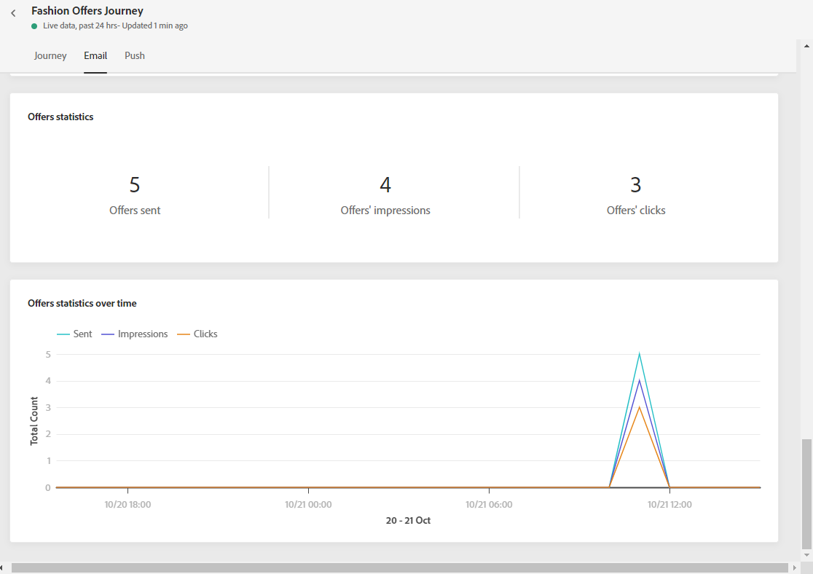

# 歷程即時報告 {#journey-live-report}

您可以直接從歷程存取即時報告，其中包含 **[!UICONTROL Live report]** 按鈕。

歷程 **[!UICONTROL Live report]** 頁面中顯示以下索引標籤：

* [歷程](#journey-live)
* [電子郵件](#email-live)
* [推播](#push-live)

歷程 **[!UICONTROL Live report]** 會分為不同的Widget，詳述您歷程的成功與錯誤。 如有需要，可對每個介面工具集調整大小並加以刪除。 有關詳細資訊，請參閱 [節](live-report.md#modify-dashboard).

## 歷程標籤 {#journey-live}

從您的歷程 **[!UICONTROL Live report]**, **[!UICONTROL Journey]** 索引標籤可讓您清楚檢視歷程的最重要追蹤資料。

**[!UICONTROL Journey Performance]** 可讓您逐步查看目標設定檔的路徑。

此 **[!UICONTROL Journey Statistics]** 介面工具集顯示下列KPI:

* **[!UICONTROL Entered profiles]**:到達歷程進入事件的個人總數。

* **[!UICONTROL Exited profiles]**:離開歷程的個人總數。

* **[!UICONTROL Failed individual journeys]**:未成功執行的個別歷程總數。

此 **[!UICONTROL Event executed over the last 24 hours]** 和 **[!UICONTROL Events]** 介面工具集可讓您透過摘要編號、圖表和表格，查看哪個事件成功執行。

此 **[!UICONTROL Action executed over the last 24 hours]** 和 **[!UICONTROL Actions executed and errors]** 介面工具集代表觸發動作時發生的最成功動作和錯誤。 動作圖表、表格和摘要數字包含可用於動作的資料，例如：

* **[!UICONTROL Actions executed]**:成功執行歷程之動作的總數。

* **[!UICONTROL Error in actions]**:針對動作發生的錯誤總數。

<!--

>[!NOTE]
>
>The Offers widgets and metrics are only available if a decision was inserted in an email. For more information on Decision Management, refer to this [page](../offers/get-started/starting-offer-decisioning.md).

The **[!UICONTROL Offers statistic]** and **[!UICONTROL Offers statistics]** over time widgets measure your offer's success and impact on your targeted audience. It detail the main information relative to your message with KPIs:

* **[!UICONTROL Offer sent]**: Total number of sends for the offer.

* **[!UICONTROL Offer impression]**: Number of times the offer was opened in a delivery.

* **[!UICONTROL Offer clicks]**: Number of times an offer was clicked on in a delivery.
-->

## 電子郵件索引標籤 {#email-live}

從您的歷程 **[!UICONTROL Live report]**, **[!UICONTROL Email]** 索引標籤會詳細列出與歷程中傳送之電子郵件相關的主要資訊。

如需特定電子郵件傳送的詳細報告，請參閱 [電子郵件即時報表](email-live-report.md) 區段。

此 **[!UICONTROL Email Sending Statistics]** 介面工具集詳細說明了與您的訊息相關的主要資訊：

* **[!UICONTROL Delivered]**:已成功傳送的訊息數，與已傳送的訊息總數相關。

* **[!UICONTROL Bounces]**:傳送和自動回傳處理期間累積的錯誤總數，與已傳送訊息的總數相關。

* **[!UICONTROL Errors]**:傳送期間發生的錯誤總數，使其無法傳送至設定檔。

此 **[!UICONTROL Sending metrics by Email]** 表格和 **[!UICONTROL Email Summary]** 圖表會詳細說明您的傳送是否成功：

* **[!UICONTROL Sent]**:傳送的傳送總數。

* **[!UICONTROL Delivered]**:已成功傳送的訊息數，與已傳送的訊息總數相關。

* **[!UICONTROL Bounces]**:傳送和自動回傳處理期間累積的錯誤總數，與已傳送訊息的總數相關。

* **[!UICONTROL Errors]**:傳送期間發生的錯誤總數，使其無法傳送至設定檔。

* **[!UICONTROL Opens]**:傳送中開啟訊息的次數。

* **[!UICONTROL Clicks]**:內容在傳送中被點按的次數。

* **[!UICONTROL Unsubscribe]**:取消訂閱連結的點按次數。

* **[!UICONTROL Spam complaints]**:宣告郵件為垃圾郵件或垃圾郵件的次數。

此 **[!UICONTROL Bounce Reasons]**, **[!UICONTROL Bounce categories]** 和 **[!UICONTROL Hard and bounce - by Email]** 小工具包含與退信消息相關的可用資料，例如：

* **[!UICONTROL Hard bounce]**:永久錯誤的總數，例如錯誤的電子郵件地址。 這包含明確指出地址無效的錯誤訊息，例如「未知」使用者。

* **[!UICONTROL Soft bounce]**:臨時錯誤（如完整收件箱）的總數。

* **[!UICONTROL Ignored]**:臨時的總數，例如「不在辦公室」或技術錯誤，例如，如果發送者類型是郵遞區號。

此 **[!UICONTROL Error Reasons]** 圖形和表格可讓您查看在傳送期間發生的錯誤。

## 推送標籤 {#push-live}

從您的歷程 **[!UICONTROL Live report]**, **[!UICONTROL Push]** 索引標籤會詳細說明與歷程中傳送的推送傳送相關的主要資訊。

如需特定推送傳送的詳細報表，請參閱 [推播即時報表](push-live-report.md) 區段。

**[!UICONTROL Push notification sending performance]**, **[!UICONTROL Push notification summary]** 和 **[!UICONTROL Sending metrics - by Push]** widget會詳細說明與訊息相關的主要資訊：

* **[!UICONTROL Sent]**:傳送的傳送總數。

* **[!UICONTROL Delivered]**:已成功傳送的訊息數，與已傳送的訊息總數相關。

* **[!UICONTROL Bounces]**:傳送和自動回傳處理期間累積的錯誤總數，與已傳送訊息的總數相關。

* **[!UICONTROL Errors]**:傳送期間發生的錯誤總數，使其無法傳送至設定檔。

* **[!UICONTROL Opens]**:傳送中開啟訊息的次數。

* **[!UICONTROL Actions]**:已傳送推播通知的動作總數，例如按鈕點擊或解除。

* **[!UICONTROL Engagements]**:此推播通知的開啟次數和動作總數，亦即設定檔開啟了推播或按了按鈕。

此 **[!UICONTROL Error Reasons]** 圖形和表格可讓您查看在傳送期間發生的錯誤。

此 **[!UICONTROL Tracking by platform]**, **[!UICONTROL Sending by platform]** 和 **[!UICONTROL Breakdown by platform]** 圖表和表格會根據作業系統，詳細說明推播通知的成功。

此 **[!UICONTROL Sending statistics - Failed]** 介面工具集可讓您查看發生了多少錯誤和跳出。
