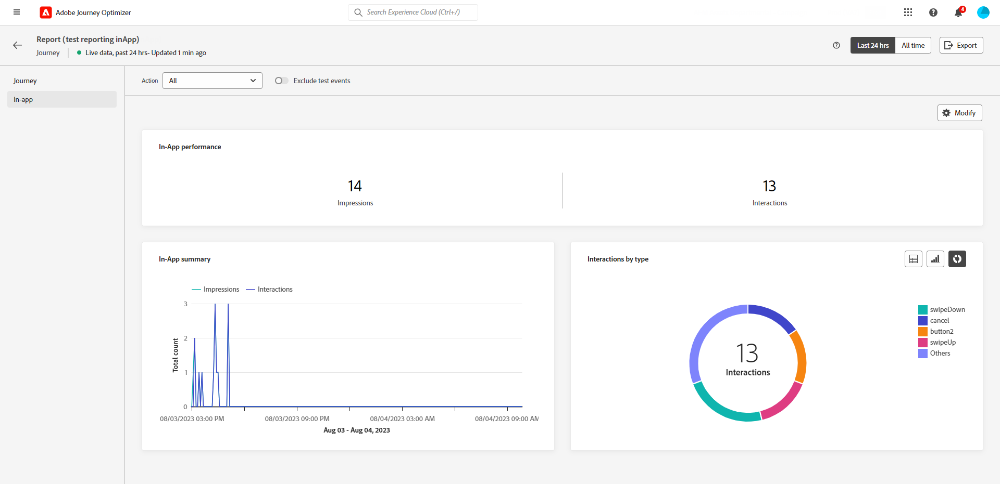

# 歷程即時報告 {#journey-live-report}

>[!CONTEXTUALHELP]
>id="ajo_journey_live_report"
>title="歷程即時報告"
>abstract="歷程即時報告可讓您僅在過去 24 小時內對歷程的影響和效能進行即時測量和視覺化。您的報告會分為不同的介面工具，詳細說明您的歷程的成功和錯誤。每個報告儀表板都可以透過調整大小或移除介面工具來修改。"

從「最近24小時」索引標籤存取的即時報告，會顯示過去24小時內發生的事件，從事件發生起的最短時間間隔為兩分鐘。 相較之下，全域報表著重於至少兩小時前發生的事件，並涵蓋選定時段內的事件。

歷程即時報告可直接從您的歷程存取，並透過 **[!UICONTROL 檢視報告]** 按鈕。

歷程 **[!UICONTROL 即時報告]** 頁面會顯示以下索引標籤：

* [歷程](#journey-live)
* [電子郵件](#email-live)
* [推播](#push-live)
* [簡訊](#sms-live)
* [應用程式內](#in-app-live)

歷程 **[!UICONTROL 即時報告]** 會分成不同的Widget，詳述您歷程的成功和錯誤。 如有需要，可以調整每個Widget的大小並將其刪除。 如需詳細資訊，請參閱此 [區段](live-report.md#modify-dashboard).

如需Adobe Journey Optimizer中可用每個量度的詳細清單，請參閱 [此頁面](live-report.md#list-of-components-live).

## 歷程索引標籤 {#journey-live}

從您的歷程 **[!UICONTROL 即時報告]**，則 **[!UICONTROL 歷程]** 標籤可讓您清楚檢視歷程最重要的追蹤資料。

+++進一步瞭解歷程報告可用的不同量度和Widget。

**[!UICONTROL 歷程績效]** 可讓您逐步檢視目標設定檔的路徑。

此 **[!UICONTROL 歷程統計資料]** widget會顯示下列KPI：

* **[!UICONTROL 輸入的設定檔]**：到達歷程進入事件的個人總數。

* **[!UICONTROL 已退出的設定檔]**：已退出歷程的個人總數。

* **[!UICONTROL 失敗的個人歷程]**：未成功執行的個別歷程總數。

此 **[!UICONTROL 過去24小時內執行的事件]** 和 **[!UICONTROL 活動]** Widget可讓您透過摘要編號、圖表和表格，檢視哪一個事件已成功執行。

此 **[!UICONTROL 過去24小時內執行的動作]** 和 **[!UICONTROL 已執行的動作和錯誤]** widget代表動作觸發時最成功的動作和發生錯誤。 動作圖形、表格和摘要數字包含可用於動作的資料，例如：

* **[!UICONTROL 已執行的動作]**：歷程成功執行的動作總數。

* **[!UICONTROL 動作中的錯誤]**：動作發生的錯誤總數。
+++

## 電子郵件索引標籤 {#email-live}

從您的歷程 **[!UICONTROL 即時報告]**，則 **[!UICONTROL 電子郵件]** 索引標籤會詳細說明歷程中傳送之電子郵件傳遞的相關主要資訊。

+++進一步瞭解可用於電子郵件報告的不同量度和Widget。

此 **[!UICONTROL 電子郵件傳送統計資料]** widget會詳細說明與訊息相關的主要資訊：

* **[!UICONTROL 已傳遞]**：成功傳送的訊息數。

* **[!UICONTROL 跳出數]**：傳送期間和自動傳回處理期間累計的錯誤總數。

* **[!UICONTROL 錯誤]**：在傳送期間發生且無法傳送至設定檔的錯誤總數。

此 **[!UICONTROL 依電子郵件傳送量度]** 表格和 **[!UICONTROL 電子郵件摘要]** 圖表會詳細說明您的傳送是否成功：

* **[!UICONTROL 已傳送]**：傳遞的傳送總數。

* **[!UICONTROL 已傳遞]**：成功傳送的訊息數。

* **[!UICONTROL 跳出數]**：傳送期間和自動傳回處理期間累計的錯誤總數。

* **[!UICONTROL 錯誤]**：在傳送期間發生且無法傳送至設定檔的錯誤總數。

* **[!UICONTROL 開啟次數]**：在傳遞中開啟訊息的次數。

* **[!UICONTROL 點按次數]**：內容在傳遞中的點按次數。

* **[!UICONTROL 取消訂閱]**：對取消訂閱連結的點按次數。

* **[!UICONTROL 垃圾郵件投訴數]**：訊息被宣告為垃圾郵件或垃圾郵件的次數。

此 **[!UICONTROL 退回原因]**， **[!UICONTROL 退信類別]** 和 **[!UICONTROL 硬退信 — 透過電子郵件]** Widget包含與退信相關的可用資料，例如：

* **[!UICONTROL 硬退信]**：永久錯誤的總數，例如錯誤的電子郵件地址。 這包含明確指出地址無效的錯誤訊息，例如「未知使用者」。

* **[!UICONTROL 軟退信]**：暫時性錯誤的總數，例如完整的收件匣。

* **[!UICONTROL 已忽略]**：暫時性總數，例如「不在辦公室」或技術錯誤，例如，如果傳送者型別是郵遞員。

此 **[!UICONTROL 錯誤原因]** 和 **[!UICONTROL 排除原因]** 圖表和表格可讓您檢視傳送期間發生哪些錯誤和排除。

此 **[!UICONTROL 電子郵件 — 熱門收件者網域]** 圖表和表格詳細說明收件者最常用來開啟電子郵件的網域。

>[!NOTE]
>
>優惠方案Widget和量度僅在決定已插入電子郵件中時才能使用。 有關決定管理的詳細資訊，請參閱此 [頁面](../offers/get-started/starting-offer-decisioning.md).

此 **[!UICONTROL 優惠統計資料]** 和 **[!UICONTROL 優惠統計資料]** 一段時間後，Widget會衡量您選件的成功及對目標對象的影響。 它會使用KPI詳細說明與訊息相關的主要資訊：

* **[!UICONTROL 已傳送的優惠]**：選件的傳送總數。

* **[!UICONTROL 優惠印象]**：在傳遞中開啟選件的次數。

* **[!UICONTROL 優惠點選次數]**：在傳送中點按優惠的次數。
+++

## 推播通知標籤 {#push-live}

從您的歷程 **[!UICONTROL 即時報告]**，則 **[!UICONTROL 推播通知]** 索引標籤會詳細說明歷程中傳送之推播傳遞的相關主要資訊。

+++進一步瞭解推送報表可用的不同量度和Widget。

**[!UICONTROL 推播通知傳送績效]**， **[!UICONTROL 推播通知摘要]** 和 **[!UICONTROL 傳送量度 — 透過推播]** Widget會詳細說明與訊息相關的主要資訊：

* **[!UICONTROL 已傳送]**：傳遞的傳送總數。

* **[!UICONTROL 已傳遞]**：成功傳送的訊息數。

* **[!UICONTROL 跳出數]**：傳送期間和自動傳回處理期間累計的錯誤總數。

* **[!UICONTROL 錯誤]**：在傳送期間發生且無法傳送至設定檔的錯誤總數。

* **[!UICONTROL 開啟次數]**：在傳遞中開啟訊息的次數。

* **[!UICONTROL 動作]**：推播通知已傳送的動作總數，例如按鈕點選或解除。

* **[!UICONTROL 參與]**：此推播通知的開啟和動作總數，也就是設定檔是否已開啟推播，或按鈕是否已點按。

此 **[!UICONTROL 錯誤原因]** 和 **[!UICONTROL 排除原因]** 圖表和表格可讓您檢視傳送期間發生哪些錯誤和排除。

此 **[!UICONTROL 傳送統計資料 — 失敗]** widget可讓您檢視發生多少錯誤和退信。

此 **[!UICONTROL 依據平台的追蹤]**， **[!UICONTROL 由平台傳送]** 和 **[!UICONTROL 依平台劃分]** 圖表和表格會根據作業系統詳細描述推播通知的成功情況。
+++

## 簡訊索引標籤 {#sms-live}

+++進一步瞭解SMS報表可用的不同量度和Widget。

此 **[!UICONTROL 簡訊 — 傳送統計資料]** 表格詳細說明您的傳送是否成功：

* **[!UICONTROL 已鎖定目標]**：符合此傳送目標設定檔資格的使用者設定檔數目。

* **[!UICONTROL 已排除]**：從目標設定檔中排除且未收到訊息的使用者設定檔數。

* **[!UICONTROL 已傳送]**：傳遞的傳送總數。

* **[!UICONTROL 開啟次數]**：在傳遞中開啟訊息的次數。

* **[!UICONTROL 點按次數]**：內容在傳遞中的點按次數。

* **[!UICONTROL 跳出數]**：傳送期間和自動傳回處理期間累計的錯誤總數。

* **[!UICONTROL 錯誤]**：在傳送期間發生且無法傳送至設定檔的錯誤總數。

此 **[!UICONTROL 簡訊摘要]** 圖表會詳細說明您的傳送是否成功：

* **[!UICONTROL 跳出數]**：傳送期間和自動傳回處理期間累計的錯誤總數。

* **[!UICONTROL 錯誤]**：在傳送期間發生且無法傳送至設定檔的錯誤總數。

此 **[!UICONTROL 排除原因]** 圖表和表格可讓您檢視傳送期間發生哪些錯誤和排除。
+++

## 應用程式內標籤 {#in-app-live}

+++進一步瞭解應用程式內報表可用的不同量度和Widget。

此 **[!UICONTROL 應用程式內績效]** KPI會詳細說明與訪客與您應用程式內訊息的參與度相關的主要資訊，例如：

* **[!UICONTROL 曝光數]**：傳送給所有使用者的應用程式內訊息總數。

  >[!NOTE]
  >
  >為確保計算曝光次數，使用者必須符合兩個條件：
  >* 應用程式內體驗中的資格，可透過存取其歷程中的特定應用程式內活動來達成。
  >* 符合觸發程式規則中指定的條件。
  > 
  >由於第二個標準，目標設定檔數量與不重複曝光數量之間可能會有顯著差異。

* **[!UICONTROL 互動]**：應用程式內訊息的參與總數。 這包括使用者所執行的任何動作，例如點選、解僱或任何其他互動。

此 **[!UICONTROL 應用程式內摘要]** 圖表會顯示相關期間應用程式內曝光次數和互動的演變。

此 **[!UICONTROL 依型別的互動]** 圖表和表格會詳細說明使用者如何透過追蹤任何點選、解除或互動來與您的應用程式內訊息互動。

+++
