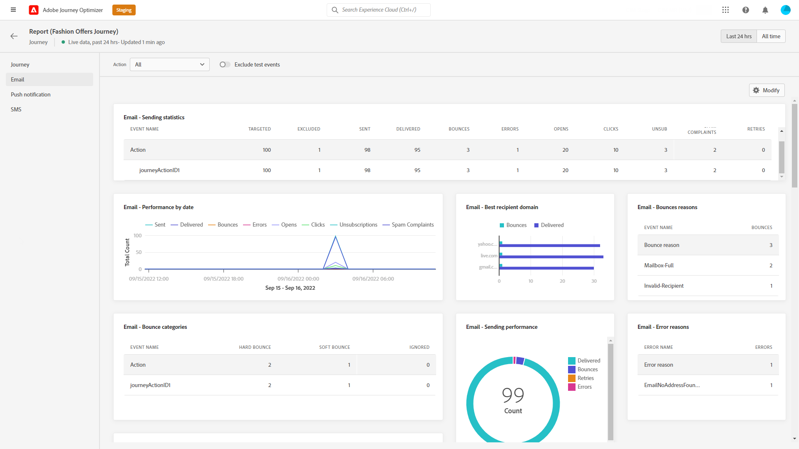

# 歷程即時報告 {#journey-live-report}

您可以直接從歷程存取即時報告，其中包含 **[!UICONTROL 檢視報表]** 按鈕。

歷程 **[!UICONTROL 即時報表]** 頁面中顯示以下索引標籤：

* [歷程](#journey-live)
* [電子郵件](#email-live)
* [推播](#push-live)
* [SMS](#sms-live)

歷程 **[!UICONTROL 即時報表]** 會分為不同的Widget，詳述您歷程的成功與錯誤。 如有需要，可對每個介面工具集調整大小並加以刪除。 有關詳細資訊，請參閱 [節](live-report.md#modify-dashboard).

如需Adobe Journey Optimizer中可用每個量度的詳細清單，請參閱 [本頁](live-report.md#list-of-components-live).

## 歷程標籤 {#journey-live}

從您的歷程 **[!UICONTROL 即時報表]**, **[!UICONTROL 歷程]** 索引標籤可讓您清楚檢視歷程的最重要追蹤資料。

+++進一步了解「歷程」報表可用的不同量度和Widget。

**[!UICONTROL 歷程績效]** 可讓您逐步查看目標設定檔的路徑。

此 **[!UICONTROL 歷程統計]** 介面工具集顯示下列KPI:

* **[!UICONTROL 輸入的設定檔]**:到達歷程進入事件的個人總數。

* **[!UICONTROL 退出設定檔]**:離開歷程的個人總數。

* **[!UICONTROL 個別歷程失敗]**:未成功執行的個別歷程總數。

此 **[!UICONTROL 過去24小時內執行的事件]** 和 **[!UICONTROL 事件]** 介面工具集可讓您透過摘要編號、圖表和表格，查看哪個事件成功執行。

此 **[!UICONTROL 過去24小時內執行的動作]** 和 **[!UICONTROL 執行的動作和錯誤]** 介面工具集代表觸發動作時發生的最成功動作和錯誤。 動作圖表、表格和摘要數字包含可用於動作的資料，例如：

* **[!UICONTROL 已執行的動作]**:成功執行歷程之動作的總數。

* **[!UICONTROL 動作錯誤]**:針對動作發生的錯誤總數。
+++

## 電子郵件索引標籤 {#email-live}

從您的歷程 **[!UICONTROL 即時報表]**, **[!UICONTROL 電子郵件]** 索引標籤會詳細列出與歷程中傳送之電子郵件相關的主要資訊。

+++進一步了解「電子郵件」報表中可用的不同量度和小工具。

此 **[!UICONTROL 電子郵件傳送統計資料]** 介面工具集詳細說明了與您的訊息相關的主要資訊：

* **[!UICONTROL 傳遞]**:已成功發送的消息數。

* **[!UICONTROL 跳出數]**:傳送和自動回訪處理期間累積的錯誤總數。

* **[!UICONTROL 錯誤]**:傳送期間發生的錯誤總數，使其無法傳送至設定檔。

此 **[!UICONTROL 依電子郵件傳送量度]** 表格和 **[!UICONTROL 電子郵件摘要]** 圖表會詳細說明您的傳送是否成功：

* **[!UICONTROL 已傳送]**:傳送的傳送總數。

* **[!UICONTROL 傳遞]**:已成功發送的消息數。

* **[!UICONTROL 跳出數]**:傳送和自動回訪處理期間累積的錯誤總數。

* **[!UICONTROL 錯誤]**:傳送期間發生的錯誤總數，使其無法傳送至設定檔。

* **[!UICONTROL 開啟]**:傳送中開啟訊息的次數。

* **[!UICONTROL 點按次數]**:內容在傳送中被點按的次數。

* **[!UICONTROL 取消訂閱]**:取消訂閱連結的點按次數。

* **[!UICONTROL 垃圾郵件投訴]**:宣告郵件為垃圾郵件或垃圾郵件的次數。

此 **[!UICONTROL 退回原因]**, **[!UICONTROL 跳出類別]** 和 **[!UICONTROL 硬式和彈回 — 依電子郵件]** 小工具包含與退信消息相關的可用資料，例如：

* **[!UICONTROL 硬跳出]**:永久錯誤的總數，例如錯誤的電子郵件地址。 這包含明確指出地址無效的錯誤訊息，例如「未知」使用者。

* **[!UICONTROL 軟跳出]**:臨時錯誤（如完整收件箱）的總數。

* **[!UICONTROL 已忽略]**:臨時的總數，例如「不在辦公室」或技術錯誤，例如，如果發送者類型是郵遞區號。

此 **[!UICONTROL 錯誤原因]** 和 **[!UICONTROL 排除原因]** 圖形和表格可讓您查看在傳送期間發生的錯誤和排除。

此 **[!UICONTROL 電子郵件 — 最上層收件者網域]** 圖表和表格詳細說明收件者最常使用哪些網域來開啟電子郵件。

>[!NOTE]
>
>只有在電子郵件中插入決策時，選件小工具和量度才可供使用。 有關「決策管理」的詳細資訊，請參閱 [頁面](../offers/get-started/starting-offer-decisioning.md).

此 **[!UICONTROL 優惠方案統計資料]** 和 **[!UICONTROL 選件統計資料]** 一段時間後，Widget會測量選件的成功，以及對目標對象的影響。 它會使用KPI詳細說明與訊息相關的主要資訊：

* **[!UICONTROL 已傳送選件]**:選件的傳送總數。

* **[!UICONTROL 選件曝光]**:傳遞中開啟選件的次數。

* **[!UICONTROL 選件點按次數]**:傳送中點按選件的次數。
+++

## 推播通知標籤 {#push-live}

從您的歷程 **[!UICONTROL 即時報表]**, **[!UICONTROL 推播通知]** 索引標籤會詳細說明與歷程中傳送的推送傳送相關的主要資訊。

+++進一步了解「推送」報表可用的不同量度和Widget。

**[!UICONTROL 推播通知傳送效能]**, **[!UICONTROL 推播通知摘要]** 和 **[!UICONTROL 傳送量度 — 依推播]** widget會詳細說明與訊息相關的主要資訊：

* **[!UICONTROL 已傳送]**:傳送的傳送總數。

* **[!UICONTROL 傳遞]**:已成功發送的消息數。

* **[!UICONTROL 跳出數]**:傳送和自動回訪處理期間累積的錯誤總數。

* **[!UICONTROL 錯誤]**:傳送期間發生的錯誤總數，使其無法傳送至設定檔。

* **[!UICONTROL 開啟]**:傳送中開啟訊息的次數。

* **[!UICONTROL 動作]**:已傳送推播通知的動作總數，例如按鈕點擊或解除。

* **[!UICONTROL 參與]**:此推播通知的開啟次數和動作總數，亦即設定檔開啟了推播或按了按鈕。

此 **[!UICONTROL 錯誤原因]** 和 **[!UICONTROL 排除原因]** 圖形和表格可讓您查看在傳送期間發生的錯誤和排除。

此 **[!UICONTROL 發送統計資訊 — 失敗]** 介面工具集可讓您查看發生了多少錯誤和彈回。

此 **[!UICONTROL 依平台追蹤]**, **[!UICONTROL 依平台傳送]** 和 **[!UICONTROL 依平台劃分]** 圖表和表格會根據作業系統，詳細說明推播通知的成功。
+++

## SMS標籤 {#sms-live}

+++進一步了解SMS報表可用的不同量度和Widget。

此 **[!UICONTROL SMS — 傳送統計資料]** 表格會詳細說明傳送的成功：

* **[!UICONTROL 已鎖定]**:符合此傳送目標設定檔資格的使用者設定檔數目。

* **[!UICONTROL 已排除]**:未接收訊息的使用者設定檔數目，已從目標設定檔中排除。

* **[!UICONTROL 已傳送]**:傳送的傳送總數。

* **[!UICONTROL 傳遞]**:已成功發送的消息數。

* **[!UICONTROL 開啟]**:傳送中開啟訊息的次數。

* **[!UICONTROL 點按次數]**:內容在傳送中被點按的次數。

* **[!UICONTROL 跳出數]**:傳送和自動回訪處理期間累積的錯誤總數。

* **[!UICONTROL 錯誤]**:傳送期間發生的錯誤總數，使其無法傳送至設定檔。

此 **[!UICONTROL 簡訊摘要]** 圖表會詳細說明您的傳送是否成功：

* **[!UICONTROL 傳遞]**:已成功發送的消息數。

* **[!UICONTROL 跳出數]**:傳送和自動回訪處理期間累積的錯誤總數。

* **[!UICONTROL 錯誤]**:傳送期間發生的錯誤總數，使其無法傳送至設定檔。

此 **[!UICONTROL 排除原因]** 圖形和表格可讓您查看在傳送期間發生的錯誤和排除。
+++
