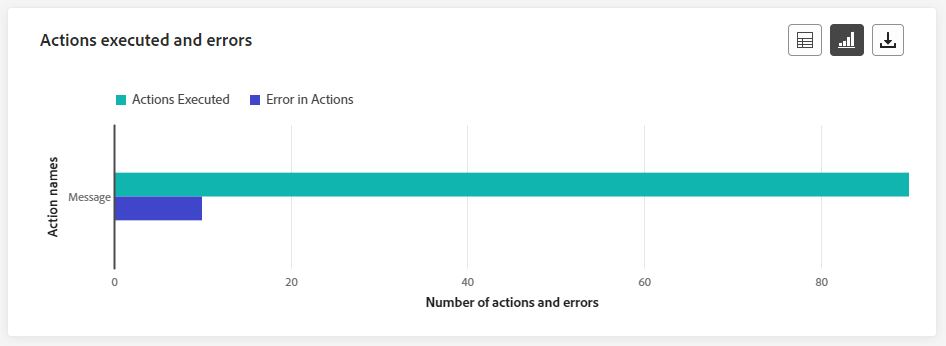

# 歷程即時報告 {#journey-live-report}

>[!CONTEXTUALHELP]
>id="ajo_journey_live_report"
>title="歷程即時報告"
>abstract="歷程即時報告可讓您僅在過去 24 小時內對歷程的影響和效能進行即時測量和視覺化。您的報告會分為不同的小工具，詳細說明您的歷程的成功和錯誤。每個報告儀表板都可以透過調整大小或移除小工具來修改。"

從「最近24小時」索引標籤存取的即時報告，會顯示過去24小時內發生的事件，從事件發生起的最短時間間隔為兩分鐘。 相較之下，Customer Journey Analytics報表著重於至少兩小時前發生的事件，並涵蓋選定時段內的事件。

從[!UICONTROL 歷程]功能表存取即時歷程報告，方法是開啟歷程的[!UICONTROL 更多動作]功能表並選取[!UICONTROL 檢視過去24小時的報告]。

歷程&#x200B;**[!UICONTROL 即時報告]**&#x200B;頁面將會顯示以下索引標籤：

* [歷程](#journey-live)
* [電子郵件](#email-live)
* [推播](#push-live)
* [簡訊](#sms-live)
* [應用程式內](#in-app-live)

歷程&#x200B;**[!UICONTROL 即時報告]**&#x200B;會分成不同的Widget，詳述您歷程的成功和錯誤。 如有需要，可以調整每個Widget的大小並將其刪除。 如需詳細資訊，請參閱此[區段](live-report.md#modify-dashboard)。

如需Adobe Journey Optimizer中每個可用量度的詳細清單，請參閱[此頁面](live-report.md#live-report)。

## 歷程索引標籤 {#journey-live}

從您的歷程&#x200B;**[!UICONTROL 即時報告]**，**[!UICONTROL 歷程]**&#x200B;索引標籤可讓您清楚檢視關於歷程最重要的追蹤資料。

### 歷程的績效 {#journey-performance}

>[!CONTEXTUALHELP]
>id="ajo_journey_performance_live"
>title="歷程的績效"
>abstract="「歷程的績效」小工具可讓您以視覺化方式追蹤目標設定檔於過去 24 小時內在您的歷程中的進展路徑。"

**[!UICONTROL 歷程績效]**&#x200B;可讓您逐步檢視目標設定檔的路徑。

請注意，節點的設定檔計數只會在設定檔完成節點之後更新，而不會在進入節點時更新。 例如，**等待**&#x200B;節點上的設定檔只有在到達指定的日期且設定檔已退出節點時才會計算。

### 歷程的統計資料 {#journey-statistics}

>[!CONTEXTUALHELP]
>id="ajo_journey_statistics_live"
>title="歷程的統計資料"
>abstract="「歷程統計資料關鍵績效指標 (KPI)」是一種綜合儀表板，提供過去 24 小時與您歷程相關重要指標的深入分析。"

**[!UICONTROL 歷程統計資料]**&#x200B;關鍵績效指標(KPI)可作為全方位儀表板，提供與過去24小時內您的歷程相關聯的基本量度分析。 這包含諸如輸入的設定檔計數和失敗的個人歷程例項等詳細資訊，提供全面的insight來瞭解歷程的有效性和參與程度。

+++ 深入瞭解歷程的統計量度

* **[!UICONTROL 已進入的設定檔]**：到達歷程進入事件的個人總數。

* **[!UICONTROL 已退出設定檔]**：已退出歷程的個人總數。

* **[!UICONTROL 失敗的個別歷程]**：未成功執行的個別歷程總數。
+++

### 過去 24 小時內執行的動作 {#action-executed}

>[!CONTEXTUALHELP]
>id="ajo_journey_actions_executed_live"
>title="過去 24 小時內執行的動作"
>abstract="「過去 24 小時內執行的動作」小工具提供最近績效的快照，進而呈現過去 24 小時內執行動作的效益。"

過去24小時內執行的&#x200B;**[!UICONTROL 動作]** Widget代表動作觸發時最成功的動作。

+++ 深入瞭解過去24小時量度內執行的動作

* **[!UICONTROL 已執行的動作]**：歷程已順利執行的動作總數。

* **[!UICONTROL 動作發生錯誤]**：動作發生的錯誤總數。

+++

### 已執行的動作和錯誤 {#actions-errors}

>[!CONTEXTUALHELP]
>id="ajo_journey_actions_executed__errors_live"
>title="已執行的動作和錯誤"
>abstract="「已執行的動作和錯誤」小工具呈現過去 24 小時內觸發動作期間發生的最成功動作和任何錯誤。這個小工具提供成功執行和所遇到錯誤的全面概觀，為您最近的動作績效提供珍貴的洞察。"

**[!UICONTROL 已執行的動作和錯誤]** Widget代表您動作在過去24小時內觸發時最成功的動作和發生錯誤。

+++ 深入瞭解已執行的動作和錯誤量度

* **[!UICONTROL 已執行的動作]**：歷程已順利執行的動作總數。

* **[!UICONTROL 動作發生錯誤]**：動作發生的錯誤總數。

+++

### 動作錯誤原因 {#actions-error-reasons}

>[!CONTEXTUALHELP]
>id="ajo_journey_actions_errors_live"
>title="動作錯誤原因"
>abstract="「動作錯誤原因」表格和圖表提供執行動作期間遇到錯誤的完整摘要，進而提供過去 24 小時內可能發生問題的全面概觀。"

**[!UICONTROL 動作錯誤原因]**&#x200B;表格和圖表提供過去24小時內執行動作期間所發生錯誤的完整概觀。

### 依動作劃分的錯誤類型 {#error-type-actions}

>[!CONTEXTUALHELP]
>id="ajo_journey_actions_error_type_live"
>title="依動作劃分的錯誤類型"
>abstract="「依動作劃分的錯誤類型」表格和圖表提供過去 24 小時內每次執行動作期間發生錯誤的全面概觀。"

動作&#x200B;**[!UICONTROL 的]**&#x200B;錯誤型別表格和圖表提供過去24小時內每次執行動作所發生錯誤的完整概觀。

### 過去 24 小時內執行的事件 {#event-executed-24hours}

>[!CONTEXTUALHELP]
>id="ajo_journey_event_24hours_live"
>title="過去 24 小時內執行的事件"
>abstract="「過去 24 小時內執行的事件」小工具可讓您識別過去 24 小時內成功執行哪些事件。 "

過去24小時內執行的&#x200B;**[!UICONTROL 事件]** Widget可讓您識別在過去24小時內成功執行了哪些事件。

### 活動 {#events}

>[!CONTEXTUALHELP]
>id="ajo_journey_events_live"
>title="活動"
>abstract="「事件」小工具提供哪些事件已成功執行的全面檢視，進而提供過去 24 小時內詳細洞察的摘要數字、圖表和表格。"

**[!UICONTROL 事件]** Widget可讓您透過摘要數字、圖表和表格，檢視您的哪個事件已成功執行。

### 依據來源劃分的事件 {#events-origin}

>[!CONTEXTUALHELP]
>id="ajo_journey_events_origin_live"
>title="依據來源劃分的事件"
>abstract="「依據來源劃分的事件」表格和圖表提供過去 24 小時內成功接收事件的檢視。這些視覺表示可讓您準確識別有效接收的事件，進而為您歷程中每個事件的績效和影響提供珍貴的洞察。"

依據來源的&#x200B;**[!UICONTROL 事件]**&#x200B;表格和圖表提供過去24小時內成功接收事件的詳細觀點。 透過這些視覺化表示，您可以準確辨識哪些事件已有效接收，針對歷程中個別事件的效能和影響提供寶貴見解。

## 電子郵件標籤 {#email-live}

從您的歷程&#x200B;**[!UICONTROL 即時報告]**，**[!UICONTROL 電子郵件]**&#x200B;索引標籤會詳細說明與歷程中傳送之電子郵件相關的主要資訊。

### 電子郵件 - 傳送績效 {#email-sending-performance}

>[!CONTEXTUALHELP]
>id="ajo_journey_email_sending_performance_live"
>title="電子郵件 - 傳送績效"
>abstract="「電子郵件 - 傳送統計資料」圖表總結有關你的電子郵件的基本資料，例如過去 24 小時內的指定對象或已送達的郵件。"

**[!UICONTROL 電子郵件 — 傳送效能]**&#x200B;圖表提供您歷程中已傳送電子郵件相關資料的完整檢視，提供關鍵量度的深入分析，例如過去24小時內發生的傳送和跳出。 這可啟用電子郵件傳送流程的詳細分析，提供關於歷程效率和效能的寶貴資訊。

+++ 深入瞭解電子郵件 — 傳送效能指標

* **[!UICONTROL 已傳遞]**：成功傳送的電子郵件數目。

* **[!UICONTROL 退回]**：傳送程式與自動傳回處理期間累積的錯誤總數。

* **[!UICONTROL 錯誤]**：在傳送過程中發生的錯誤總數，導致無法將其傳送至設定檔。

* **[!UICONTROL 重試]**：重試佇列中的電子郵件數目。

+++

### 電子郵件 - 統計資料 {#email-stat}

>[!CONTEXTUALHELP]
>id="ajo_journey_email_statistics_live"
>title="電子郵件 - 統計資料"
>abstract="「電子郵件 - 統計資料」表格提供過去 24 小時內你的電子郵件的設定檔活動資料。"

**[!UICONTROL 電子郵件 — 統計資料]**&#x200B;表格提供有關過去24小時內歷程中電子郵件之基本資料的完整摘要。 它會詳細說明關鍵量度，例如目標對象的大小和成功傳送的電子郵件數量，提供對電子郵件和歷程的成效和觸及範圍的寶貴見解。

+++ 進一步瞭解電子郵件傳送統計量度

* **[!UICONTROL 已鎖定目標]**：在套用排除、隱藏或同意移除之前，符合對象資格的設定檔數目。 在啟用重新進入的歷程中，設定檔可能會鎖定多次。

* **[!UICONTROL 已排除]**： Adobe Journey Optimizer已排除的設定檔數目。

* **[!UICONTROL 已傳送]**：已傳送的電子郵件總數。

* **[!UICONTROL 已傳遞]**：成功傳送的電子郵件數目，與已傳送的訊息總數相關。

* **[!UICONTROL 跳出數]**：在傳送程式期間累積的錯誤總數，以及相對於已傳送訊息總數的自動傳回處理次數。

* **[!UICONTROL 錯誤]**：在傳送過程中發生的錯誤總數，導致無法將其傳送至設定檔。

* **[!UICONTROL 開啟次數]**：您的電子郵件開啟次數。

* **[!UICONTROL 點按]**：內容在電子郵件中的點按次數。

* **[!UICONTROL 取消訂閱]**：取消訂閱連結的點按次數。

* **[!UICONTROL 垃圾訊息申訴]**：訊息被宣告為垃圾郵件或垃圾訊息的次數。

* **[!UICONTROL 重試]**：重試佇列中的電子郵件數目。

+++

### 電子郵件 - 依日期劃分的效能 {#email-perf-date}

>[!CONTEXTUALHELP]
>id="ajo_journey_email_performance_bydate_live"
>title="電子郵件 - 依日期劃分的效能"
>abstract="「電子郵件 - 依日期劃分的效能」圖表顯示過去 24 小時內有關已傳送電子郵件的綜合資料，提供關鍵量度例如送出和退回郵件的洞察，進而對電子郵件傳送過程進行詳細分析。"

**[!UICONTROL 電子郵件 — 依據日期的效能]**&#x200B;介面工具集提供與您的電子郵件相關的重要資訊的詳細總覽，透過圖表顯示，提供過去24小時效能趨勢的深入分析。

+++ 深入瞭解電子郵件 — 依據日期的績效

* **[!UICONTROL 已傳送]**：已傳送的電子郵件總數。

* **[!UICONTROL 已傳遞]**：成功傳送的電子郵件數目。

* **[!UICONTROL 退回]**：傳送程式與自動傳回處理期間累積的錯誤總數。

* **[!UICONTROL 錯誤]**：在傳送過程中發生的錯誤總數，導致無法將其傳送至設定檔。

* **[!UICONTROL 開啟次數]**：您的電子郵件開啟次數。

* **[!UICONTROL 點按]**：內容在電子郵件中的點按次數。

* **[!UICONTROL 取消訂閱]**：取消訂閱連結的點按次數。

* **[!UICONTROL 垃圾訊息申訴]**：訊息被宣告為垃圾郵件或垃圾訊息的次數。

+++

### 電子郵件 - 退回郵件的類別和原因 {#email-bounce-categories}

>[!CONTEXTUALHELP]
>id="ajo_journey_email_bounces_live"
>title="電子郵件 - 退回郵件的類別和原因"
>abstract="XX"

**[!UICONTROL 退信原因]**&#x200B;和&#x200B;**[!UICONTROL 退信類別]**&#x200B;介面工具會編譯與退信相關的可用資料，提供過去24小時內電子郵件退信背後的特定原因和類別的詳細深入分析。

如需退信的詳細資訊，請參閱[隱藏清單](../reports/suppression-list.md)頁面。

+++ 深入瞭解電子郵件 — 退回類別和原因量度

* **[!UICONTROL 硬退信]**：永久錯誤的總數，例如錯誤的電子郵件地址。 這包含明確指出地址無效的錯誤訊息，例如「未知使用者」。

* **[!UICONTROL 軟退信]**：暫時性錯誤的總數，例如完整的收件匣。

* **[!UICONTROL Ignored]**：暫時性的總數，例如「不在辦公室」，或是技術錯誤，例如，如果寄件者型別是郵遞員。

+++

### 電子郵件 - 錯誤原因 {#email-error-reasons}

>[!CONTEXTUALHELP]
>id="ajo_journey_email_errors_live"
>title="電子郵件 - 錯誤原因"
>abstract="「電子郵件 - 錯誤原因」圖表和表格讓你能夠確認過去 24 小時內發送過程中發生的特定錯誤。"

**[!UICONTROL 錯誤原因]**&#x200B;圖表和表格提供過去24小時內傳送程式期間發生的特定錯誤的可見度，提供有關錯誤性質和發生次數的寶貴資訊。

### 電子郵件 - 排除原因 {#email-excluded}

>[!CONTEXTUALHELP]
>id="ajo_journey_email_excluded_live"
>title="電子郵件 - 排除原因"
>abstract="「排除原因」圖表和表格說明在過去 24 小時內導致使用者設定檔被排除在目標對象之外，而未能收到訊息的各項因素。"

**[!UICONTROL 排除的原因]**&#x200B;圖表和表格可全面檢視導致目標對象排除使用者設定檔，導致過去24小時內未收到訊息的不同因素。

如需排除原因的完整清單，請參閱[此頁面](exclusion-list.md)。

### 電子郵件 - 最佳收件者網域 {#email-best-recipient}

>[!CONTEXTUALHELP]
>id="ajo_journey_email_best_recipient_live"
>title="電子郵件 - 最佳收件者網域"
>abstract="「電子郵件 - 最佳收件者」網域圖表和表格提供收件者開啟電子郵件時最常使用網域的詳細劃分，針對過去 24 小時內的收件者行為提供重要的洞察。"

**[!UICONTROL 電子郵件 — 最佳收件者網域]**&#x200B;圖表和表格提供過去24小時內設定檔最常用來開啟您的電子郵件的網域詳細劃分。 這可提供描述檔行為的寶貴見解，可幫助您瞭解偏好的平台。

### 電子郵件 - 產品建議 {#email-offers}

>[!CONTEXTUALHELP]
>id="ajo_journey_email_offers_live"
>title="電子郵件 - 產品建議"
>abstract="「產品建議統計資料」和「產品建議詳細統計資料」小工具提供過去 24 小時對產品建議績效的全面洞察，進而提供其長期影響的詳細分析，並呈現詳細的統計資料以供更深入的了解。"

>[!NOTE]
>
>優惠方案Widget和量度僅在決定已插入電子郵件中時才能使用。 如需決策管理的詳細資訊，請參閱此[頁面](../offers/get-started/starting-offer-decisioning.md)。

**[!UICONTROL 優惠統計資料]**&#x200B;和&#x200B;**[!UICONTROL 一段時間內的優惠統計資料]** Widget可測量您的優惠是否成功，以及是否對目標受眾造成影響。 它會使用KPI詳細說明與您的訊息相關的主要資訊。

+++ 深入瞭解電子郵件 — 優惠方案量度

* **[!UICONTROL 已傳送的優惠]**：優惠的傳送總數。

* **[!UICONTROL 優惠閱聽]**：在您的電子郵件中開啟優惠的次數。

* **[!UICONTROL 優惠點按次數]**：您的電子郵件中某個優惠的點按次數。

+++

### 電子郵件 - 最佳化 {#email-sto}

>[!CONTEXTUALHELP]
>id="ajo_journey_email_optimization_live"
>title="電子郵件 - 最佳化"
>abstract="「傳送時間最佳化」和「最佳化與非最佳化」小工具提供有關您郵件過去 24 小時的詳細資訊，進而凸顯它們是否已最佳化。"

>[!NOTE]
>
>**[!UICONTROL 傳送時間最佳化]**&#x200B;和&#x200B;**[!UICONTROL 已最佳化與未最佳化]** Widget只有在傳送的「傳送時間最佳化」選項已啟用時才可用。 如需傳送時間最佳化的詳細資訊，請參閱[此頁面](../building-journeys/send-time-optimization.md)。

**[!UICONTROL 傳送時間最佳化]**&#x200B;和&#x200B;**[!UICONTROL 已最佳化與未最佳化]** Widget會根據傳送方法（已最佳化或正常）詳細列出您的電子郵件是否成功。

+++ 深入瞭解傳送時間最佳化及最佳化與非最佳化量度的比較

* **[!UICONTROL 已傳遞]**：與已傳送訊息總數相關的成功傳送訊息數。
* **[!UICONTROL 跳出數]**：在傳送程式期間累積的錯誤總數，以及相對於已傳送訊息總數的自動傳回處理次數。

* **[!UICONTROL 已傳送]**：為歷程傳送的電子郵件總數。

* **[!UICONTROL 開啟次數]**：您在歷程中開啟電子郵件的次數。

* **[!UICONTROL 點按]**：內容在電子郵件中的點按次數。

+++

## 推播通知標籤 {#push-live}

從您的歷程&#x200B;**[!UICONTROL 即時報告]**，**[!UICONTROL 推播通知]**&#x200B;索引標籤會詳細說明與歷程中傳送之推播通知相關的主要資訊。

### 推播通知 - 傳送效能 {#push-sending-performance}

>[!CONTEXTUALHELP]
>id="ajo_journey_push_sending_performance_live"
>title="推播通知 - 傳送效能"
>abstract="「推播通知傳送效能」圖表總結有關推播通知的基本資料，例如過去 24 小時內的錯誤或已送達的訊息。"

**[!UICONTROL 推播通知傳送績效]**&#x200B;圖表提供過去24小時內傳送之推播通知相關資料的完整概觀。 它提供基本量度的深入分析，例如傳送和跳出，以便詳細檢查推播通知傳送流程。

+++ 深入瞭解推播通知 — 傳送效能量度

* **[!UICONTROL 已傳遞]**：已成功傳送的訊息數。

* **[!UICONTROL 退回]**：傳送程式與自動傳回處理期間累積的錯誤總數。

* **[!UICONTROL 錯誤]**：在傳送過程中發生的錯誤總數，導致無法將其傳送至設定檔。

+++

### 推播通知 - 統計資料 {#push-statistics}

>[!CONTEXTUALHELP]
>id="ajo_journey_push_statistics_live"
>title="推播通知 - 統計資料"
>abstract="「推播統計資料」表格提供過去 24 小時內推播通知的收件者活動相關資料。"

**[!UICONTROL 推播通知 — 統計資料]**&#x200B;表格提供與推播通知相關之基本資料的簡要摘要，包括關鍵量度，例如目標訊息數目以及過去24小時內成功傳送的訊息數目。

+++ 進一步瞭解推播通知 — 統計量度

* **[!UICONTROL 目標]**：任何動作（例如傳送電子郵件或簡訊）的目標設定檔數目。

* **[!UICONTROL 已排除]**： Adobe Journey Optimizer已排除的設定檔數目。

* **[!UICONTROL 已傳送]**：已傳送的推播通知總數。

* **[!UICONTROL 已傳遞]**：已成功傳送的推播通知數目。

* **[!UICONTROL 退回]**：傳送程式與自動傳回處理期間累積的錯誤總數。

* **[!UICONTROL 錯誤]**：在傳送過程中發生的錯誤總數，導致無法將其傳送至設定檔。

* **[!UICONTROL 開啟]**：您的推播通知開啟的次數。
+++

### 推播通知 - 依平台劃分 {#push-breakdown}

>[!CONTEXTUALHELP]
>id="ajo_journey_push_breakdown_live"
>title="推播通知 - 依平台劃分"
>abstract="「依平台劃分」圖表和表格根據收件人的作業系統提供過去 24 小時內成功傳送的推播通知的劃分資料。"

**[!UICONTROL 推播通知 — 依平台]**&#x200B;劃分圖表和表格提供推播通知成功的詳細分析，根據您設定檔的作業系統提供深入分析。 此劃分可讓您更瞭解推播通知在不同平台上的執行情形。

### 推播通知 - 傳送摘要 {#push-sending-summary}

>[!CONTEXTUALHELP]
>id="ajo_journey_push_sending_summary_live"
>title="推播通知 - 傳送摘要"
>abstract="「推播通知發送摘要」圖表顯示過去 24 小時內已發送的推播通知的可用資料。"

**[!UICONTROL 推播通知摘要]**&#x200B;圖表提供動態表示，顯示過去24小時內您推播通知活動的分析。 此圖形表示提供已傳送推播通知的完整劃分。

+++ 進一步瞭解推播通知 — 傳送摘要量度

* **[!UICONTROL 已傳送]**：已傳送的推播通知總數。

* **[!UICONTROL 已傳遞]**：已成功傳送的推播通知數目。

* **[!UICONTROL 退回]**：傳送程式與自動傳回處理期間累積的錯誤總數。

* **[!UICONTROL 錯誤]**：在傳送過程中發生的錯誤總數，導致無法將其傳送至設定檔。

* **[!UICONTROL 開啟]**：您的推播通知開啟的次數。

* **[!UICONTROL 點按]**：推播通知內容被點按的次數。

+++

### 推播通知 - 錯誤原因 {#push-error}

>[!CONTEXTUALHELP]
>id="ajo_journey_push_error_reasons_live"
>title="推播通知 - 錯誤原因"
>abstract="「錯誤原因」圖表和表格讓你能夠確認過去 24 小時內傳送過程中發生的特定錯誤。"

**[!UICONTROL 錯誤原因]**&#x200B;表格和圖表可讓您識別推播通知傳送過程中發生的特定錯誤，提供過去24小時內所遇到任何問題的詳細深入分析。

### 推播通知 - 排除原因 {#push-excluded}

>[!CONTEXTUALHELP]
>id="ajo_journey_push_excluded_reasons_live"
>title="推播通知 - 排除原因"
>abstract="「排除原因」圖表和表格說明在過去 24 小時內導致使用者設定檔被排除在目標對象之外，而未能收到訊息的各項因素。"

**[!UICONTROL 排除的原因]**&#x200B;圖表和表格會顯示阻止使用者設定檔從目標設定檔排除後，在最近24小時內無法接收推播通知的不同原因。

如需排除原因的完整清單，請參閱[此頁面](exclusion-list.md)。

## 簡訊標籤 {#sms-live}

### 簡訊 - 統計資料 {#sms-statistics}

>[!CONTEXTUALHELP]
>id="ajo_journey_sms_statistics_live"
>title="簡訊 - 統計資料"
>abstract="「簡訊傳送統計資料」表格總結有關簡訊的基本資料，例如過去 24 小時內指定對象或已送達的郵件。"

**[!UICONTROL 簡訊 — 統計資料]**&#x200B;表格提供與簡訊訊息相關之基本資料的簡要摘要，包含關鍵量度，例如目標訊息數目以及過去24小時內成功傳遞的訊息數目。

+++ 進一步瞭解簡訊 — 統計量度

* **[!UICONTROL 目標]**：符合目標設定檔資格的使用者設定檔數目。

* **[!UICONTROL 已排除]**：從目標設定檔中排除且未收到訊息的使用者設定檔數目。

* **[!UICONTROL 已傳送]**：已傳送的SMS訊息總數。

* **[!UICONTROL 點按]**：內容在簡訊訊息中的點按次數。

* **[!UICONTROL 退回]**：傳送程式與自動傳回處理期間，累積的錯誤總數。

* **[!UICONTROL 錯誤]**：在傳送過程中發生的錯誤總數，導致無法將其傳送至設定檔。

+++

### 簡訊 - 依日期劃分的效能 {#sms-performance}

>[!CONTEXTUALHELP]
>id="ajo_journey_sms_performance_live"
>title="簡訊 - 依日期劃分的績效"
>abstract="「依日期劃分的簡訊效能」小工具透過圖形呈現方式提供過去 24 小時內有關你的簡訊的重要資訊。"

**[!UICONTROL SMS — 依據日期的效能]**&#x200B;介面工具集提供與訊息相關之重要資訊的詳細總覽，透過圖表呈現，提供過去24小時內效能趨勢的深入分析。

+++ 深入瞭解簡訊 — 依據日期量度的效能

* **[!UICONTROL 已傳送]**：已傳送的SMS訊息總數。

* **[!UICONTROL 退回]**：傳送程式與自動傳回處理期間累積的錯誤總數。

* **[!UICONTROL 錯誤]**：在傳送過程中發生的錯誤總數，導致無法將其傳送至設定檔。

+++

### 簡訊 - 退回原因 {#sms-bounces}

>[!CONTEXTUALHELP]
>id="ajo_journey_sms_bounces_live"
>title="簡訊 - 退回原因"
>abstract="「退回原因」圖表和表格包含過去 24 小時內與退回郵件相關的可用資料。"

**[!UICONTROL SMS — 退回原因]**&#x200B;圖表和表格提供與退回SMS訊息相關的資料全面總覽，提供對過去24小時內SMS訊息退回執行個體背後特定原因的寶貴見解。

### 簡訊 - 錯誤原因 {#sms-error}

>[!CONTEXTUALHELP]
>id="ajo_journey_sms_error_live"
>title="簡訊 - 錯誤原因"
>abstract="「簡訊 - 錯誤原因」圖表和表格讓你能夠確認過去 24 小時內傳送過程中發生的特定錯誤。"

**[!UICONTROL SMS — 錯誤原因]**&#x200B;圖表和表格可讓您識別在SMS訊息傳送過程中發生的特定錯誤，協助您徹底分析過去24小時內遇到的任何問題。

### 簡訊 - 排除原因 {#sms-excluded}

>[!CONTEXTUALHELP]
>id="ajo_journey_sms_excluded_live"
>title="簡訊 - 排除原因"
>abstract="「排除原因」圖表和表格說明在過去 24 小時內導致使用者設定檔被排除在目標對象之外，而未能收到訊息的各項因素。"

**[!UICONTROL SMS — 排除的原因]**&#x200B;圖表和表格會以視覺化方式描述導致目標對象中排除使用者設定檔的各種因素，以防止他們接收您的SMS訊息。

如需排除原因的完整清單，請參閱[此頁面](exclusion-list.md)。

<!--
### SMS - Clicks by links {#sms-clicks}

The **[!UICONTROL SMS - Clicks by links]** widget offers essential insights into your visitors' engagement with the URLs included in your messages, providing valuable information about which links attract the most interaction within the last 24 hours.
-->

## 應用程式內標籤 {#in-app-live}

### 應用程式內績效 {#inapp-performance}

>[!CONTEXTUALHELP]
>id="ajo_journey_inapp_performance_live"
>title="應用程式內績效"
>abstract="應用程式內績效 KPI 提供有關訪客在過去 24 小時內與應用程式內訊息互動情況的基本洞察。"

**[!UICONTROL 應用程式內績效]** KPI提供過去24小時內設定檔與應用程式內訊息互動的基本深入分析，提供評估歷程中包含之應用程式內訊息效能和影響的基本量度。

+++ 進一步瞭解應用程式內 — 效能量度

* **[!UICONTROL 曝光次數]**：傳送給所有使用者的應用程式內訊息總數。

  >[!NOTE]
  >
  >為確保計算曝光次數，使用者必須符合兩個條件：
  >* 應用程式內體驗中的資格，可透過存取其歷程中的特定應用程式內活動來達成。
  >* 符合觸發程式規則中指定的條件。
  > 
  >由於第二個標準，目標設定檔數量與不重複曝光數量之間可能會有顯著差異。

* **[!UICONTROL 互動]**：與應用程式內訊息互動的總數。 這包括使用者所執行的任何動作，例如點選、解僱或任何其他互動。

+++

### 應用程式內摘要 {#inapp-summary}

>[!CONTEXTUALHELP]
>id="ajo_journey_inapp_summary_live"
>title="應用程式內摘要"
>abstract="應用程式內摘要圖表顯示過去 24 小時內應用程式內曝光與互動的進展。"

**[!UICONTROL 應用程式內摘要]**&#x200B;圖表說明過去24小時內您應用程式內曝光次數和互動的進度，提供您應用程式內訊息效能的完整概觀。

+++ 進一步瞭解應用程式內摘要量度

* **[!UICONTROL 曝光次數]**：傳送給所有使用者的應用程式內訊息總數。

  >[!NOTE]
  >
  >為確保計算曝光次數，使用者必須符合兩個條件：
  >* 應用程式內體驗中的資格，可透過存取其歷程中的特定應用程式內活動來達成。
  >* 符合觸發程式規則中指定的條件。
  > 
  >由於第二個標準，目標設定檔數量與不重複曝光數量之間可能會有顯著差異。

* **[!UICONTROL 互動]**：與應用程式內訊息互動的總數。 這包括使用者所執行的任何動作，例如點選、解僱或任何其他互動。

+++

### 依類型劃分的互動 {#interactions-type}

>[!CONTEXTUALHELP]
>id="ajo_journey_inapp_interactions_live"
>title="依類型劃分的互動"
>abstract="「依類型劃分的互動」圖表和表格透過追蹤過去 24 小時內的任何點選、關閉或互動，詳細說明使用者如何與應用程式內訊息進行互動。"

依型別&#x200B;**[!UICONTROL 的]**&#x200B;互動圖表和表格詳細說明了使用者如何透過追蹤任何點按、解除或互動來與您的應用程式內訊息互動。
