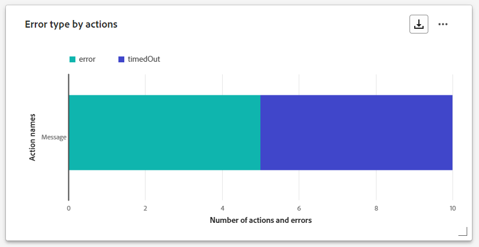
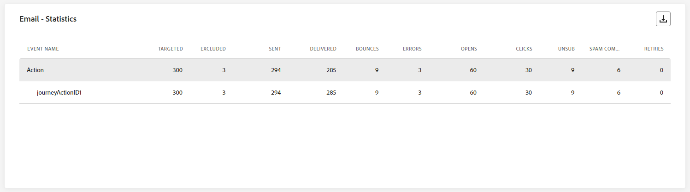

# 歷程即時報告 {#journey-live-report}

>[!CONTEXTUALHELP]
>id="ajo_journey_live_report"
>title="歷程即時報告"
>abstract="歷程即時報告可讓您僅在過去 24 小時內對歷程的影響和效能進行即時測量和視覺化。您的報告會分為不同的介面工具，詳細說明您的歷程的成功和錯誤。每個報告儀表板都可以透過調整大小或移除介面工具來修改。"

從「最近24小時」索引標籤存取的即時報告，會顯示過去24小時內發生的事件，從事件發生起的最短時間間隔為兩分鐘。 相較之下，全域報表著重於至少兩小時前發生的事件，並涵蓋選定時段內的事件。

歷程即時報告可直接從您的歷程存取，並透過 **[!UICONTROL 檢視報告]** 按鈕。

歷程 **[!UICONTROL 即時報告]** 頁面會顯示以下索引標籤：

* [歷程](#journey-live)
* [電子郵件](#email-live)
* [推播](#push-live)
* [簡訊](#sms-live)
* [應用程式內](#in-app-live)

歷程 **[!UICONTROL 即時報告]** 會分成不同的Widget，詳述您歷程的成功和錯誤。 如有需要，可以調整每個Widget的大小並將其刪除。 如需詳細資訊，請參閱此 [區段](live-report.md#modify-dashboard).

如需Adobe Journey Optimizer中可用每個量度的詳細清單，請參閱 [此頁面](live-report.md#list-of-components-live).

## 歷程索引標籤 {#journey-live}

從您的歷程 **[!UICONTROL 即時報告]**，則 **[!UICONTROL 歷程]** 標籤可讓您清楚檢視歷程最重要的追蹤資料。

### 歷程的績效 {#journey-performance}

**[!UICONTROL 歷程績效]** 可讓您逐步檢視目標設定檔的路徑。

### 歷程的統計資料 {#journey-statistics}

此 **[!UICONTROL 歷程統計資料]** 關鍵績效指標(KPI)可做為全方位儀表板，提供與過去24小時內您的歷程相關聯的基本量度分析。 這包含已輸入設定檔計數和失敗個別歷程例項等詳細資訊，提供歷程成效和參與層級的全面深入分析。

+++ 進一步瞭解歷程的統計量度

* **[!UICONTROL 輸入的設定檔]**：到達歷程進入事件的個人總數。

* **[!UICONTROL 已退出的設定檔]**：已退出歷程的個人總數。

* **[!UICONTROL 失敗的個人歷程]**：未成功執行的個別歷程總數。
+++

### 過去24小時內執行的動作 {#action-executed}

此 **[!UICONTROL 過去24小時內執行的動作]** widget代表動作觸發時最成功的動作。

+++ 深入瞭解過去24小時量度內執行的動作

* **[!UICONTROL 已執行的動作]**：歷程成功執行的動作總數。

* **[!UICONTROL 動作中的錯誤]**：動作發生的錯誤總數。

+++

### 已執行的動作和錯誤 {#actions-errors}

此 **[!UICONTROL 已執行的動作和錯誤]** widget代表動作觸發時最成功的動作和發生錯誤。

+++ 深入瞭解已執行的動作和錯誤量度

* **[!UICONTROL 已執行的動作]**：歷程成功執行的動作總數。

* **[!UICONTROL 動作中的錯誤]**：動作發生的錯誤總數。

+++

### 動作錯誤原因 {#actions-error-reasons}

此 **[!UICONTROL 動作錯誤原因]** 表格和圖表提供過去24小時內執行您的動作期間所發生錯誤的全面概觀。

### 依據動作的錯誤型別 {#error-type-actions}

此 **[!UICONTROL 依據動作的錯誤型別]** 表格和圖表提供過去24小時內每次執行您的動作所發生錯誤的全面概觀。

### 過去24小時內執行的事件 {#event-executed-24hours}

此 **[!UICONTROL 過去24小時內執行的事件]** widget可讓您識別過去24小時內成功執行了哪些事件。

### 活動 {#events}

此 **[!UICONTROL 活動]** widget可讓您透過摘要編號、圖表和表格，檢視哪一個事件已成功執行。

### 依據來源的事件 {#events-origin}

此 **[!UICONTROL 依據來源的事件]** 表格和圖表提供過去24小時內成功接收事件的詳細觀點。 透過這些視覺化表示，您可以準確辨識哪些事件已有效接收，針對歷程中個別事件的效能和影響提供寶貴見解。

## 電子郵件標籤 {#email-live}

從您的歷程 **[!UICONTROL 即時報告]**，則 **[!UICONTROL 電子郵件]** 索引標籤會詳細說明歷程中傳送之電子郵件相關的主要資訊。

### 電子郵件傳送績效 {#email-sending-performance}

此 **[!UICONTROL 電子郵件 — 傳送績效]** graph提供與您歷程中傳送之電子郵件相關的完整資料檢視，提供關鍵量度的深入分析，例如傳送和過去24小時內發生的跳出。 這可啟用電子郵件傳送流程的詳細分析，提供關於歷程效率和效能的寶貴資訊。

+++ 進一步瞭解電子郵件 — 傳送績效量度

* **[!UICONTROL 已傳遞]**：成功傳送的電子郵件數。

* **[!UICONTROL 跳出數]**：傳送流程和自動傳回處理期間累計的錯誤總數。

* **[!UICONTROL 錯誤]**：在傳送過程中發生且無法傳送至設定檔的錯誤總數。

* **[!UICONTROL 重試]**：重試佇列中的電子郵件數。

+++

### 電子郵件 - 統計資料 {#email-stat}

此 **[!UICONTROL 電子郵件 — 統計資料]** 表格提供有關過去24小時內歷程中電子郵件之基本資料的完整摘要。 它會詳細說明關鍵量度，例如目標對象的大小和成功傳送的電子郵件數量，提供對電子郵件和歷程的成效和觸及範圍的寶貴見解。

+++ 進一步瞭解電子郵件傳送統計量度

* **[!UICONTROL 已鎖定目標]**：傳送過程中處理的訊息總數。

* **[!UICONTROL 已排除]**：Adobe Journey Optimizer已排除的設定檔數。

* **[!UICONTROL 已傳送]**：已傳送的電子郵件總數。

* **[!UICONTROL 已傳遞]**：成功傳送的電子郵件數量，與已傳送訊息總數相關。

* **[!UICONTROL 跳出數]**：與已傳送訊息總數相關的傳送程式與自動傳回處理期間累計的錯誤總數。

* **[!UICONTROL 錯誤]**：在傳送過程中發生且無法傳送至設定檔的錯誤總數。

* **[!UICONTROL 開啟次數]**：您的電子郵件被開啟的次數。

* **[!UICONTROL 點按次數]**：內容在電子郵件中的點按次數。

* **[!UICONTROL 取消訂閱]**：對取消訂閱連結的點按次數。

* **[!UICONTROL 垃圾郵件投訴數]**：訊息被宣告為垃圾郵件或垃圾郵件的次數。

* **[!UICONTROL 重試]**：重試佇列中的電子郵件數。

+++

### 電子郵件 - 依日期劃分的效能 {#email-perf-date}

此 **[!UICONTROL 電子郵件 — 依據日期的績效]** widget提供與電子郵件相關之關鍵資訊的詳細總覽，透過圖表呈現，提供過去24小時內效能趨勢的深入分析。

+++ 進一步瞭解電子郵件 — 依據日期量度的績效

* **[!UICONTROL 已傳送]**：已傳送的電子郵件總數。

* **[!UICONTROL 已傳遞]**：成功傳送的電子郵件數。

* **[!UICONTROL 跳出數]**：傳送流程和自動傳回處理期間累計的錯誤總數。

* **[!UICONTROL 錯誤]**：在傳送過程中發生且無法傳送至設定檔的錯誤總數。

* **[!UICONTROL 開啟次數]**：您的電子郵件被開啟的次數。

* **[!UICONTROL 點按次數]**：內容在您的電子郵件中被點按的次數。

* **[!UICONTROL 取消訂閱]**：對取消訂閱連結的點按次數。

* **[!UICONTROL 垃圾郵件投訴數]**：訊息被宣告為垃圾郵件或垃圾郵件的次數。

+++

### 電子郵件 — 退回類別和原因 {#email-bounce-categories}

此 **[!UICONTROL 退回原因]** 和 **[!UICONTROL 退信類別]** Widget會編譯與退回訊息相關的可用資料，提供過去24小時內電子郵件退回的特定原因和類別的詳細深入分析。

有關退信的詳細資訊，請參閱 [隱藏清單](../reports/suppression-list.md) 頁面。

+++ 進一步瞭解電子郵件 — 退回類別和原因量度

* **[!UICONTROL 硬退信]**：永久錯誤的總數，例如錯誤的電子郵件地址。 這包含明確指出地址無效的錯誤訊息，例如「未知使用者」。

* **[!UICONTROL 軟退信]**：暫時性錯誤的總數，例如完整的收件匣。

* **[!UICONTROL 已忽略]**：暫時性總數，例如「不在辦公室」或技術錯誤，例如，如果傳送者型別是郵遞員。

+++

### 電子郵件 - 錯誤原因 {#email-error-reasons}

此 **[!UICONTROL 錯誤原因]** 圖表和表格可讓您檢視過去24小時傳送程式期間發生的特定錯誤，提供有關錯誤性質和發生次數的寶貴資訊。

### 電子郵件 - 排除原因 {#email-excluded}

此 **[!UICONTROL 排除的原因]** 圖表和表格可全面檢視導致目標對象中排除使用者設定檔，導致過去24小時內未收到訊息的不同因素。

請參閱 [此頁面](exclusion-list.md) 以取得排除原因的完整清單。

### 電子郵件 - 最佳收件者網域 {#email-best-recipient}

此 **[!UICONTROL 電子郵件 — 最佳收件者網域]** 圖表和表格提供過去24小時內設定檔最常用來開啟您電子郵件的網域詳細劃分。 這可提供描述檔行為的寶貴見解，可幫助您瞭解偏好的平台。

### 電子郵件 — 優惠方案 {#email-offers}

>[!NOTE]
>
>優惠方案Widget和量度僅在決定已插入電子郵件中時才能使用。 有關決定管理的詳細資訊，請參閱此 [頁面](../offers/get-started/starting-offer-decisioning.md).

此 **[!UICONTROL 優惠統計資料]** 和 **[!UICONTROL 一段時間內的優惠統計資料]** Widget可測量您選件的成功程度以及對目標受眾的影響。 它會使用KPI詳細說明與您的訊息相關的主要資訊。

+++ 進一步瞭解電子郵件 — 優惠方案量度

* **[!UICONTROL 已傳送的優惠]**：選件的傳送總數。

* **[!UICONTROL 優惠印象]**：在您的電子郵件中開啟選件的次數。

* **[!UICONTROL 優惠點選次數]**：在您的電子郵件中點按優惠的次數。

+++

## 推播通知標籤 {#push-live}

從您的歷程 **[!UICONTROL 即時報告]**，則 **[!UICONTROL 推播通知]** 索引標籤會詳細說明歷程中傳送之推播通知的相關主要資訊。

### 推播通知 - 統計資料 {#push-statistics}

**[!UICONTROL 推播通知 — 統計資料]** 表格提供與推播通知相關之基本資料的簡要摘要，包括關鍵量度，例如目標訊息數目以及過去24小時內成功傳送的訊息數目。

+++ 進一步瞭解推播通知 — 統計量度

* **[!UICONTROL 已鎖定目標]**：任何動作（例如傳送電子郵件或簡訊）的目標設定檔數。

* **[!UICONTROL 已排除]**：Adobe Journey Optimizer已排除的設定檔數。

* **[!UICONTROL 已傳送]**：已傳送的推播通知總數。

* **[!UICONTROL 已傳遞]**：成功傳送的推播通知數。

* **[!UICONTROL 跳出數]**：傳送流程和自動傳回處理期間累計的錯誤總數。

* **[!UICONTROL 錯誤]**：在傳送過程中發生且無法傳送至設定檔的錯誤總數。

* **[!UICONTROL 開啟次數]**：您的推播通知開啟次數。
+++

### 推播通知 - 依平台劃分 {#push-breakdown}

此 **[!UICONTROL 推播通知 — 依據平台的劃分]** 圖表和表格提供推送通知成功的詳細分析，根據您的設定檔作業系統提供深入分析。 此劃分可讓您更瞭解推播通知在不同平台上的執行情形。

### 推播通知 - 傳送摘要 {#push-sending-summary}

此 **[!UICONTROL 推播通知摘要]** 圖表提供動態顯示，顯示過去24小時內推播通知活動的分析。 此圖形表示提供已傳送推播通知的完整劃分。

+++ 進一步瞭解推播通知 — 傳送摘要量度

* **[!UICONTROL 已傳送]**：已傳送的推播通知總數。

* **[!UICONTROL 已傳遞]**：成功傳送的推播通知數。

* **[!UICONTROL 跳出數]**：傳送流程和自動傳回處理期間累計的錯誤總數。

* **[!UICONTROL 錯誤]**：在傳送過程中發生且無法傳送至設定檔的錯誤總數。

* **[!UICONTROL 開啟次數]**：您的推播通知開啟次數。

* **[!UICONTROL 點按次數]**：在推播通知中點按內容的次數。

+++

### 推播通知 - 錯誤原因 {#push-error}

此 **[!UICONTROL 錯誤原因]** 表格和圖表可讓您識別在傳送推播通知過程中發生的特定錯誤，提供過去24小時內遇到的任何問題的詳細深入分析。

### 推播通知 - 排除原因 {#push-excluded}

此 **[!UICONTROL 排除的原因]** 圖形和表格會顯示從目標設定檔中排除的使用者設定檔在最近24小時內無法接收推播通知的不同原因。

請參閱 [此頁面](exclusion-list.md) 以取得排除原因的完整清單。

## 簡訊標籤 {#sms-live}

### 簡訊 - 統計資料 {#sms-statistics}

此 **[!UICONTROL 簡訊 — 統計資料]** 表格提供與您的SMS訊息相關之基本資料的簡要摘要，包含關鍵量度，例如目標訊息數量和過去24小時內成功傳送的訊息計數。

+++ 進一步瞭解簡訊 — 統計量度

* **[!UICONTROL 已鎖定目標]**：符合目標設定檔資格的使用者設定檔數目。

* **[!UICONTROL 已排除]**：從目標設定檔中排除且未收到訊息的使用者設定檔數。

* **[!UICONTROL 已傳送]**：已傳送的SMS訊息總數。

* **[!UICONTROL 開啟次數]**：您的SMS訊息開啟次數。

* **[!UICONTROL 點按次數]**：內容在您的SMS訊息中被點按的次數。

* **[!UICONTROL 跳出數]**：在傳送程式、傳送程式和自動傳回處理期間累計的錯誤總數。

* **[!UICONTROL 錯誤]**：在傳送過程中發生且無法傳送至設定檔的錯誤總數。

+++

### 簡訊 - 依日期劃分的效能 {#sms-performance}

此 **[!UICONTROL 簡訊 — 依據日期的績效]** widget提供與訊息相關之關鍵資訊的詳細總覽，透過圖表呈現，提供過去24小時內效能趨勢的深入分析。

+++ 進一步瞭解簡訊 — 依據日期量度的績效

* **[!UICONTROL 已傳送]**：已傳送的SMS訊息總數。

* **[!UICONTROL 跳出數]**：傳送流程和自動傳回處理期間累計的錯誤總數。

* **[!UICONTROL 錯誤]**：在傳送過程中發生且無法傳送至設定檔的錯誤總數。

+++

### 簡訊 - 退回原因 {#sms-bounces}

此 **[!UICONTROL 簡訊 — 退回原因]** 圖表和表格提供與彈回SMS訊息相關的完整資料概觀，針對過去24小時內SMS訊息彈回例項背後的特定原因，提供有價值的深入分析。

### 簡訊 - 錯誤原因 {#sms-error}

此 **[!UICONTROL 簡訊 — 錯誤原因]** 圖表和表格可讓您識別SMS訊息傳送過程中發生的特定錯誤，促進對過去24小時內遇到的任何問題進行徹底分析。

### 簡訊 - 排除原因 {#sms-excluded}

此 **[!UICONTROL 簡訊 — 排除的原因]** 圖表和表格會以視覺化方式呈現導致目標對象中排除使用者設定檔的各種因素，以防止他們接收您的SMS訊息。

請參閱 [此頁面](exclusion-list.md) 以取得排除原因的完整清單。

### 簡訊 - 點選次數依連結劃分 {#sms-clicks}

此 **[!UICONTROL 簡訊 — 依據連結的點按]** Widget提供訪客與訊息中URL互動的基本深入分析，提供關於過去24小時內哪些連結吸引最多互動的寶貴資訊。

## 應用程式內標籤 {#in-app-live}

### 應用程式內效能 {#inapp-performance}

此 **[!UICONTROL 應用程式內績效]** KPI可讓您深入瞭解設定檔在過去24小時內與應用程式內訊息的互動情形，提供基本量度，以評估歷程中包含的應用程式內訊息效能和影響。

+++ 進一步瞭解應用程式內 — 效能量度

* **[!UICONTROL 曝光數]**：傳送給所有使用者的應用程式內訊息總數。

  >[!NOTE]
  >
  >為確保計算曝光次數，使用者必須符合兩個條件：
  >* 應用程式內體驗中的資格，可透過存取其歷程中的特定應用程式內活動來達成。
  >* 符合觸發程式規則中指定的條件。
  > 
  >由於第二個標準，目標設定檔數量與不重複曝光數量之間可能會有顯著差異。

* **[!UICONTROL 互動]**：應用程式內訊息的參與總數。 這包括使用者所執行的任何動作，例如點選、解僱或任何其他互動。

+++

### 應用程式內摘要 {#inapp-summary}

此 **[!UICONTROL 應用程式內摘要]** 圖表會說明過去24小時內應用程式內曝光和互動的進度，提供應用程式內訊息效能的完整概覽。

+++ 進一步瞭解應用程式內摘要量度

* **[!UICONTROL 曝光數]**：傳送給所有使用者的應用程式內訊息總數。

  >[!NOTE]
  >
  >為確保計算曝光次數，使用者必須符合兩個條件：
  >* 應用程式內體驗中的資格，可透過存取其歷程中的特定應用程式內活動來達成。
  >* 符合觸發程式規則中指定的條件。
  > 
  >由於第二個標準，目標設定檔數量與不重複曝光數量之間可能會有顯著差異。

* **[!UICONTROL 互動]**：應用程式內訊息的參與總數。 這包括使用者所執行的任何動作，例如點選、解僱或任何其他互動。

+++

### 依類型劃分的互動 {#interactions-type}

此 **[!UICONTROL 依型別的互動]** 圖表和表格會詳細說明使用者如何透過追蹤任何點選、解除或互動來與您的應用程式內訊息互動。
