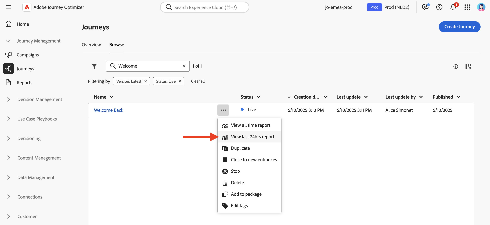
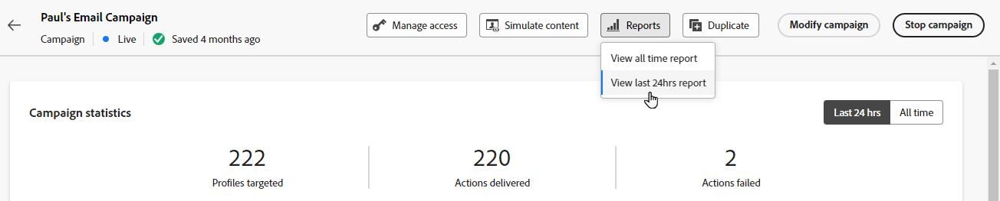
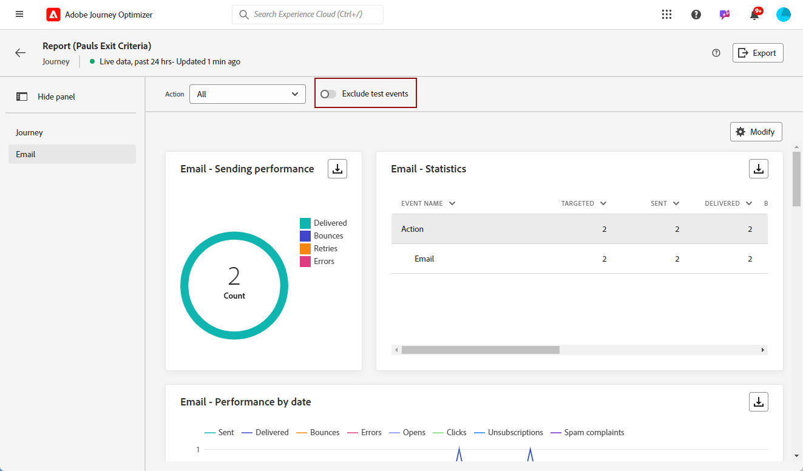
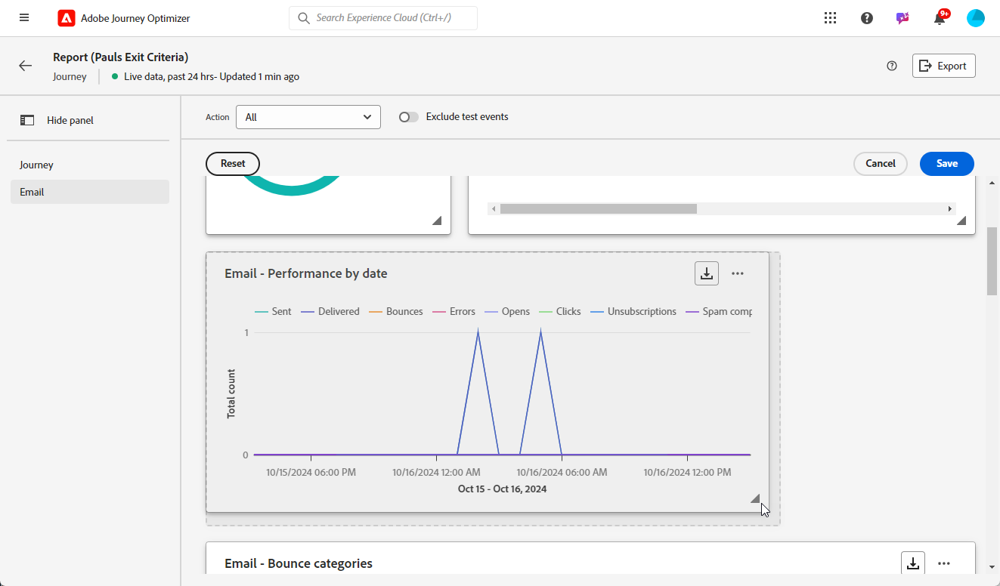
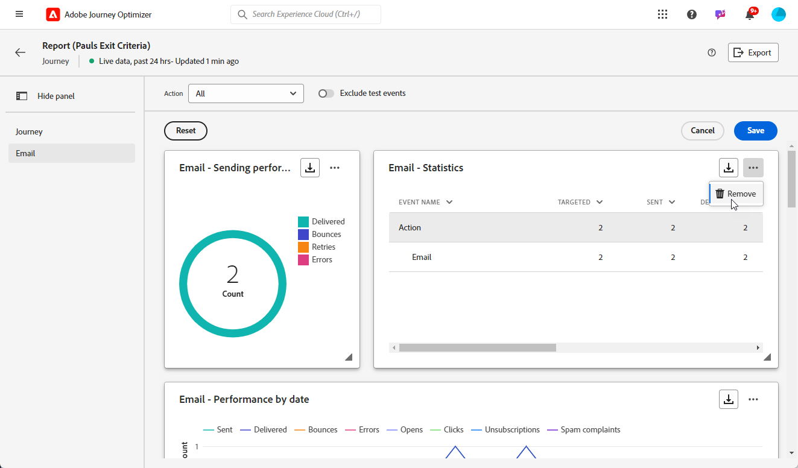
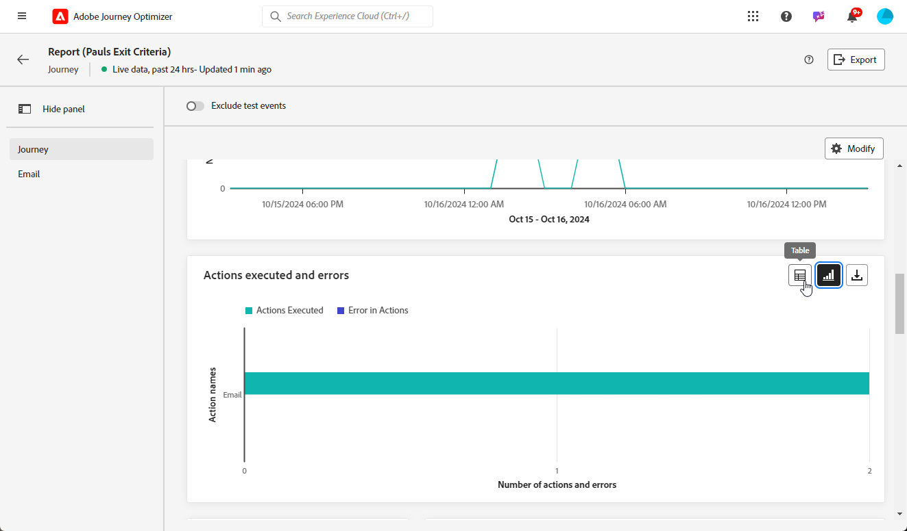
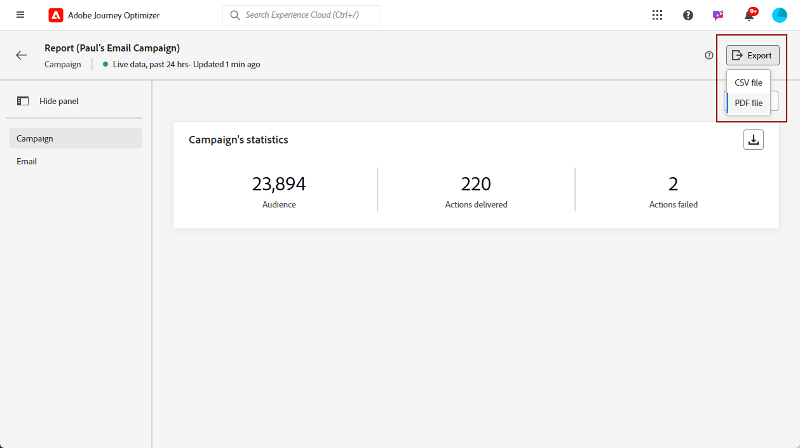
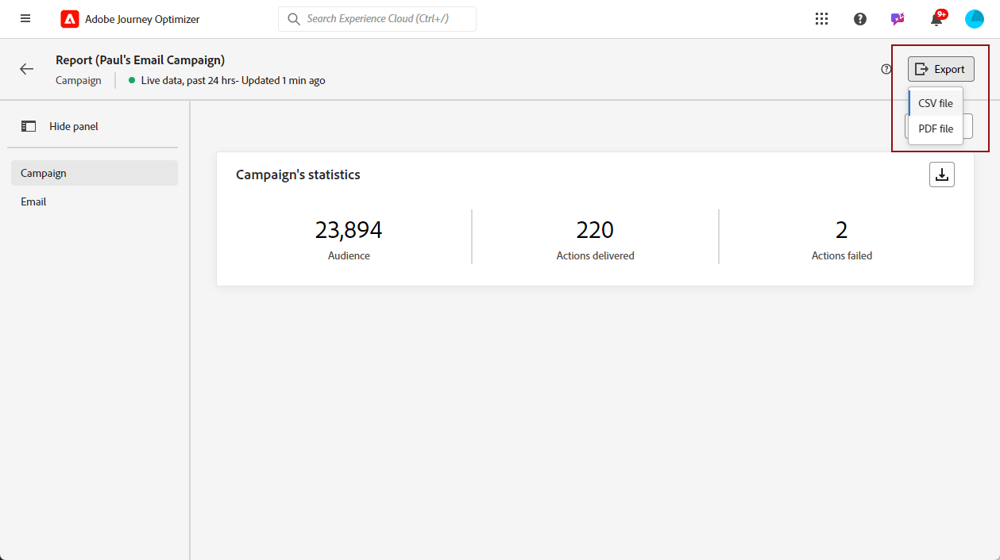

# 開始使用即時報告 {#live-report}

使用&#x200B;**[!UICONTROL 即時報告]**，在內建儀表板中即時測量並視覺化歷程和訊息的影響和效能。 當傳送您的傳遞或從&#x200B;**[!UICONTROL 過去24小時]**&#x200B;索引標籤執行您的歷程時，**[!UICONTROL 即時報告]**&#x200B;中就會提供資料。

* 如果您想要在歷程內容中鎖定歷程，請從&#x200B;**[!UICONTROL 歷程]**&#x200B;功能表，存取歷程的&#x200B;**[!UICONTROL 更多動作]**&#x200B;功能表，然後按一下&#x200B;**[!UICONTROL 檢視過去24小時報告]**&#x200B;按鈕。

  

* 如果您想要鎖定行銷活動，請從&#x200B;**[!UICONTROL 行銷活動]**&#x200B;功能表，存取您的行銷活動，然後按一下&#x200B;**[!UICONTROL 報表]**&#x200B;按鈕，然後&#x200B;**[!UICONTROL 檢視過去24小時的報表]**。

  

如需Adobe Journey Optimizer中每個可用量度的詳細清單，請參閱[此頁面](#list-of-components-live)。

## 自訂儀表板 {#modify-dashboard}

每個報表控制面板都可藉由調整大小或移除Widget加以修改。 變更Widget只會影響目前使用者的儀表板。 其他使用者將看到自己的儀表板或預設設定的儀表板。

1. 從&#x200B;**[!UICONTROL 動作]**&#x200B;下拉式清單中，選擇是否要報告歷程的一個特定動作。

1. 選擇是否要使用切換列從報表中排除測試事件。 如需測試事件的詳細資訊，請參閱[此頁面](../building-journeys/testing-the-journey.md)。

   請注意，**[!UICONTROL 排除測試事件]**&#x200B;選項僅適用於歷程報告。

   

1. 若要調整大小或移除Widget，請按一下&#x200B;**[!UICONTROL 修改]**。

   

1. 拖曳小工具的右下角，調整其大小。

   

1. 按一下「移除&#x200B;**&#x200B;**」以移除任何您不需要的Widget。

   

1. 在您滿意顯示順序和Widget的大小後，請按一下&#x200B;**[!UICONTROL 儲存]**。

1. 若要自訂資料的顯示方式，您可以切換不同的視覺化選項，例如圖形、表格和環圈圖。

   

您的儀表板現在已儲存。 您的不同變更將會重新套用，以供稍後使用您的即時報告。 如有需要，請使用&#x200B;**[!UICONTROL 重設]**&#x200B;選項來還原預設Widget和Widget的順序。

## 匯出您的報告 {#export-reports}

您可以輕鬆地將不同的報表匯出為PDF或CSV格式，以便共用或列印。

>[!BEGINTABS]

>[!TAB 將報表匯出為PDF檔案]

1. 從您的報表中，按一下[匯出]，然後選取[匯出]，並選取[PDF檔案]。**&#x200B;**&#x200B;**&#x200B;**

   

1. 在「列印」視窗中，視需要設定檔案。 請注意，選項可能會依您的瀏覽器而有所不同。

1. 選擇將報表列印或儲存為PDF。

1. 找到您要儲存檔案的資料夾，視需要重新命名，然後按一下「儲存」。

您的報告現在可以在pdf檔案中檢視或共用。

>[!TAB 將報表匯出為CSV檔案]

1. 從您的報表按一下[匯出]&#x200B;**&#x200B;**，然後選取[CSV檔案]&#x200B;**&#x200B;**&#x200B;來產生整體報表層級的CSV檔案。

   

1. 您也可以選擇從特定Widget匯出資料。 按一下所選Widget旁的&#x200B;**[!UICONTROL 下載CSV檔案]**。

   

1. 您的檔案會自動下載，並位於您的本機檔案中。

   如果在報表層級產生檔案，檔案會包含每個Widget的詳細資訊，包括其標題和資料。

   如果您在Widget層級產生檔案，它會特別提供所選Widget的資料。

>[!ENDTABS]
