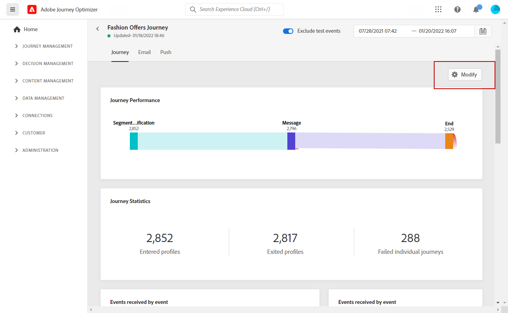

# 開始使用即時報告 {#live-report}

使用 **[!UICONTROL Live report]** 即時測量和可視化您的行程和消息在內置儀表板中的影響和效能。
資料在 **[!UICONTROL Live report]** 只要你的送貨上門或旅程被執行。

* 如果要在行程上下文中確定行程或交貨，請從 **[!UICONTROL Journeys]** 菜單，訪問您的旅程，然後按一下 **[!UICONTROL Live report]** 表徵圖 然後，您可以找到「旅程」、「電子郵件」和「推送」即時報告。

   

* 如果要針對特定交貨，請從 **[!UICONTROL Live view]** 的 **[!UICONTROL Executions]** 頁籤，選擇 **[!UICONTROL Live Report]** 的子菜單。

   

## 自定義儀表板 {#modify-dashboard}

可通過調整小部件大小或刪除小部件來修改每個報告儀表板。 更改小部件僅影響當前用戶的儀表板。 其他用戶將看到自己的儀表板或預設設定的儀表板。

1. 在您的即時報告中，按一下 **[!UICONTROL Modify]**。

   

1. 通過拖動小部件的右下角來調整小部件大小。

   

1. 按一下 **[!UICONTROL Remove]** 刪除不需要跟蹤彈出的其他小部件。

   

1. 對顯示順序和小部件大小感到滿意後，按一下 **[!UICONTROL Save]**。

您的儀表板現在已保存。 將重新應用您的不同更改，以便以後使用您的即時報告。 如果需要，請使用 **[!UICONTROL Reset]** 選項以恢復預設小部件和小部件的順序。
