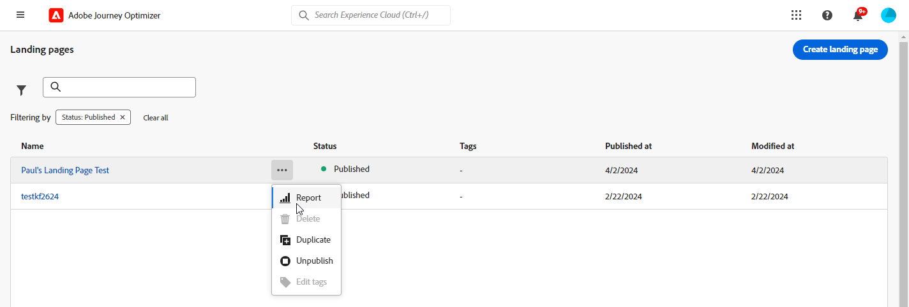
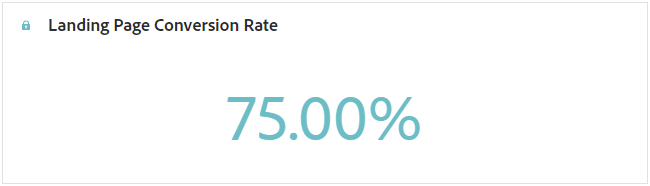
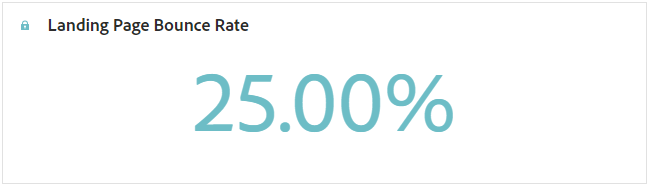
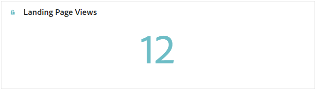
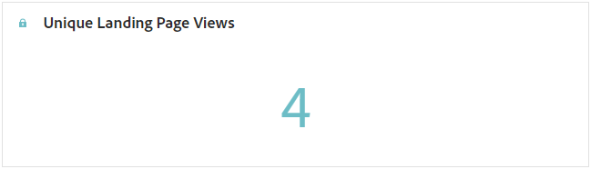
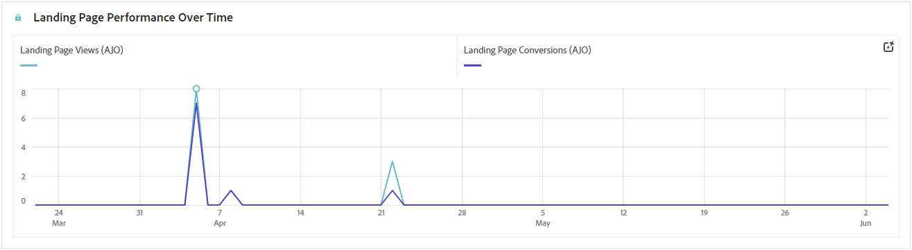
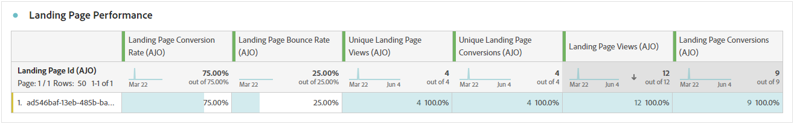

# 登陸頁面報告 {#lp-report-global-cja}

**登陸頁面**&#x200B;報表可提供使用者行為、參與模式、轉換率和其他關鍵量度的寶貴見解，讓您能夠做出明智的決策，並有效最佳化您的登陸頁面績效。

若要存取您的報告，請從您選取的登陸頁面的進階功能表中選取&#x200B;**[!UICONTROL 報告]**。

若要進一步瞭解Customer Journey Analytics工作區以及如何篩選及分析資料，請參閱[此頁面](https://experienceleague.adobe.com/zh-hant/docs/analytics-platform/using/cja-workspace/home)。

## 登陸頁面轉換率 {#lp-conversion}

**[!UICONTROL 登陸頁面轉換率]** KPI可讓您根據造訪次數和互動來評估登陸頁面的成效。

* **[!UICONTROL 登陸頁面轉換率]**：與登陸頁面互動的人數（例如訂閱了表單），與造訪總數相關。

## 登陸頁面跳出率 {#lp-bounce-rate}

**[!UICONTROL 登陸頁面跳出率]** KPI提供未互動或按一下任何元素而檢視您登陸頁面的設定檔資訊。

* **[!UICONTROL 登陸頁面跳出率]**：未與登陸頁面互動且未完成訂閱動作的人數，與造訪總數相關。

## 登陸頁面檢視 {#lp-views}

**[!UICONTROL 登陸頁面檢視]** KPI可讓您檢視登陸頁面的影響。

* **[!UICONTROL 登陸頁面檢視]**：來自歷程和外部來源的登陸頁面瀏覽總數，包括一個設定檔的多次瀏覽。

## 不重複登陸頁面檢視 {#lp-unique-views}

**[!UICONTROL 不重複登陸頁面檢視]** KPI可讓您從相同的設定檔中排除多個檢視，以評估登陸頁面的影響。

* **[!UICONTROL 不重複登陸頁面檢視]**：造訪您登陸頁面的人員數量，未考慮一個設定檔的多次造訪。

## 一段時間的登陸頁面效能 {#lp-performance-overtime}

**[!UICONTROL 登陸頁面在一段時間內的效能]**&#x200B;圖表會衡量您的登陸頁面成功及對您目標對象的影響。

* **[!UICONTROL 登陸頁面檢視]**：來自歷程和外部來源的登陸頁面瀏覽總數，包括一個設定檔的多次瀏覽。

* **[!UICONTROL 登陸頁面轉換]**：與登陸頁面互動的人數，例如訂閱了表單，與造訪總數相關。

## 登陸頁面績效 {#lp-performance}

**[!UICONTROL 登陸頁面績效]**&#x200B;表格可作為完整的儀表板，提供與您的登陸頁面相關之關鍵量度的詳細劃分。

* **[!UICONTROL 登陸頁面轉換率]**：與登陸頁面互動的人數（例如訂閱了表單），與造訪總數相關。

* **[!UICONTROL 登陸頁面跳出率]**：未與登陸頁面互動且未完成訂閱動作的人數，與造訪總數相關。

* **[!UICONTROL 不重複登陸頁面檢視]**：造訪您登陸頁面的人員數量，未考慮一個設定檔的多次造訪。

* **[!UICONTROL 不重複登陸頁面轉換]**：與登陸頁面互動的人數，一個設定檔的多重互動不會納入考量。

* **[!UICONTROL 登陸頁面檢視]**：來自歷程和外部來源的登陸頁面瀏覽總數，包括一個設定檔的多次瀏覽。

* **[!UICONTROL 登陸頁面轉換]**：與登陸頁面互動（例如訂閱表單）的人數。

## 歷程 {#lp-journeys}

**[!UICONTROL 歷程]**&#x200B;表格提供全方位的概觀，詳述使用者歷程內容中造訪您登陸頁面的頻率。 此富有洞察力的呈現方式可提供使用者互動方面的寶貴資料，讓您瞭解訪客如何導覽您的網站並與您的內容互動。

* **[!UICONTROL 登陸頁面檢視]**：來自歷程和外部來源的登陸頁面瀏覽總數，包括一個設定檔的多次瀏覽。

* **[!UICONTROL 登陸頁面轉換]**：與登陸頁面互動（例如訂閱表單）的人數。

## 行銷活動 {#lp-campaigns}

**[!UICONTROL 行銷活動]**&#x200B;表格提供由於特定行銷活動而導向至您登陸頁面的造訪次數深入分析，提供行銷活動成效及與登陸頁面內容互動的全面檢視。

* **[!UICONTROL 登陸頁面檢視]**：來自歷程和外部來源的登陸頁面瀏覽總數，包括一個設定檔的多次瀏覽。

* **[!UICONTROL 登陸頁面轉換]**：與登陸頁面互動（例如訂閱表單）的人數。

## Channel {#lp-channels}

**[!UICONTROL 管道]**&#x200B;表格顯示依每個管道分類的登入頁面造訪次數。

* **[!UICONTROL 登陸頁面檢視]**：來自歷程和外部來源的登陸頁面瀏覽總數，包括一個設定檔的多次瀏覽。

* **[!UICONTROL 登陸頁面轉換]**：與登陸頁面互動（例如訂閱表單）的人數。

## 熱門點按連結 {#lp-top-clicked}

**[!UICONTROL 熱門點按連結]**&#x200B;表格提供訪客如何與傳遞互動的深入分析，強調指出哪些連結受到對象最多參與和關注。

* **[!UICONTROL 登陸頁麵點按次數]**：內容在登陸頁面中被點按的次數。
