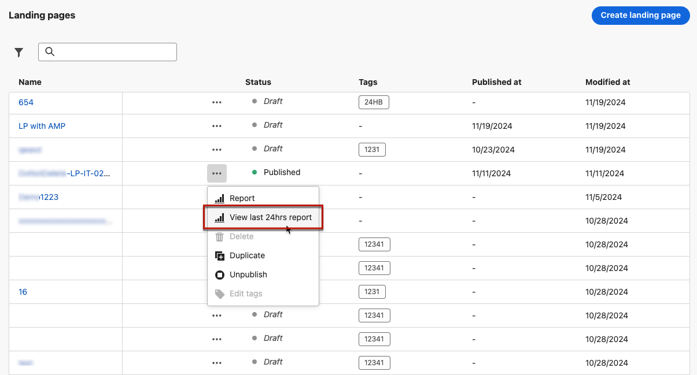

# 登陸頁面即時報告 {#lp-report-live}

>[!CONTEXTUALHELP]
>id="ajo_landing_page_live_report"
>title="登陸頁面即時報告"
>abstract="登陸頁面即時報告可讓您僅在過去 24 小時內對登陸頁面的影響和效能進行即時測量和視覺化。您的報告會分為不同的小工具，詳細說明您的登陸頁面的成功和錯誤。每個報告儀表板都可以透過調整大小或移除小工具來修改。"

從「最近24小時」索引標籤存取的即時報告，會顯示過去24小時內發生的事件，從事件發生起的最短時間間隔為兩分鐘。 相較之下，Customer Journey Analytics報表著重於至少兩小時前發生的事件，並涵蓋選定時段內的事件。

若要存取您的報告，請從您選取的登陸頁面的進階功能表中選取&#x200B;**[!UICONTROL 檢視最近24小時的報告]**。

登陸頁面&#x200B;**[!UICONTROL 即時報告]**&#x200B;會分成不同的Widget，詳細說明您傳送的成功和錯誤。 如有需要，可以調整每個Widget的大小並將其刪除。 如需詳細資訊，請參閱此[區段](live-report.md)。

+++進一步瞭解可用於登陸頁面即時報告的不同量度和Widget。

**[!UICONTROL 登陸頁面效能]** Widget透過KPI詳細列出過去24小時內與您的訊息相關的主要資訊：

* **[!UICONTROL 總造訪次數]**：從歷程或其他來源造訪您的登陸頁面的總次數，包括一個收件者的多次造訪。

* **[!UICONTROL 轉換]**：與登入頁面互動的人數，例如，訂閱了表單。

* **[!UICONTROL 跳出數]**：未與登陸頁面互動且未完成訂閱動作的人數。

**[!UICONTROL 造訪來源]** Widget代表訪客如何存取您的登陸頁面：

* **[!UICONTROL 歷程]**：來自歷程的登陸頁面造訪次數。

* **[!UICONTROL 其他來源]**：來自外部來源而非歷程的登陸頁面造訪次數。

**[!UICONTROL 熱門點按連結]**&#x200B;可識別訪客與登入頁面的互動：

* **[!UICONTROL 點按]**：內容在登入頁面上的點按次數。

**[!UICONTROL 歷程]**&#x200B;介面工具集代表從歷程造訪您的登陸頁面的次數。

**[!UICONTROL 其他來源]** Widget代表來自外部來源而非歷程的登陸頁面造訪次數。

**[!UICONTROL 依據訊息的造訪]** / **[!UICONTROL 依據訊息的轉換]**&#x200B;圖表代表過去24小時內與您的登入頁面成功互動的造訪總數和人員（視傳送的訊息而定）。

管道的&#x200B;**[!UICONTROL 造訪次數]** / **[!UICONTROL 管道的轉換]**&#x200B;圖表代表過去24小時內與您的登入頁面成功互動的造訪總數和人員，視管道而定。
+++

如需Adobe Journey Optimizer中每個可用量度的詳細清單，請參閱[此頁面](live-report.md#live-report)。
