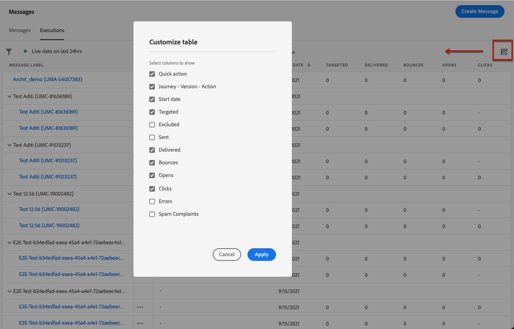

# 訊息監視 {#monitor-message-execution}

為確保成功執行、發送和傳遞您的消息， [!DNL Journey Optimizer] 提供了監視當前發佈和觸發的消息的功能。 您可以看到消息在各次旅程中的表現 <!--and APIs--> 即時 **[!UICONTROL Executions]** 清單框。

➡️ [在影片中探索此功能](#video)

要訪問此清單，請從 **[!DNL Journey Optimizer]** 首頁，選擇 **[!UICONTROL Messages]**，然後按一下 **[!UICONTROL Executions]** 頁籤。

此頁籤提供兩個視圖： **[!UICONTROL Live view]** 和 **[!UICONTROL Global view]**。

* 的 **[!UICONTROL Live view]** 頁籤提供 **所有已執行消息的即時概述** 一個或多個 [乘](../building-journeys/journey.md) **過去24小時里**。

   

   此清單每六十秒自動刷新一次。 如果在過去24小時內沒有執行特定消息，則所有列都將顯示該消息的空值(0)。

* 的 **[!UICONTROL Global view]** 頁籤提供 **所有已執行消息的概述** 一個或多個 [乘](../building-journeys/journey.md) **自消息開始日期起**。

   

   此清單每九十分鐘自動刷新一次。 自每個消息開始日期起，資料會隨時間而聚合。

如果某條消息已發佈但尚未由行程觸發，則它未列在任何頁籤中。 僅列出以下元素：
* 已觸發但尚未啟動（掛起）的消息。
* 已觸發且當前正在運行的消息（正在進行中）。

>[!NOTE]
>
>如果消息已用於多個行程，則每次執行都會顯示一行。

預設情況下，從最近的執行日期開始顯示消息。 按一下 **[!UICONTROL Filters]** 表徵圖，根據頻道、開始日期和/或結束日期搜索消息。 您還可以選擇從您的test中排除 **執行清單**。

的 <!--**[!UICONTROL Quick action]**-->第二列可開啟 [消息](../messages/get-started-content.md) 和 [即時報告](../reports/live-report.md) 如果你在 **[!UICONTROL Live view]**，或 [全局報告](../reports/global-report.md) 如果你在 **[!UICONTROL Global view]**。

對於每個消息執行，都會顯示多個指示符：

* **[!UICONTROL Message label]**:您定義的消息標題 [建立消息](../messages/get-started-content.md)。 自動生成的執行ID顯示在括弧中。

   <!--**[!UICONTROL Execution ID]**: Automatically generated identifier.
  **[!UICONTROL Source]**: Name of the journey leveraging that message.-->

* **[!UICONTROL Journey - Version - Action]**:利用消息的行程的名稱、行程的版本以及利用行程中消息的操作的標籤。

* **[!UICONTROL Status]**:消息執行狀態。

* **[!UICONTROL Start date]**:從行程執行消息的日期和時間。

* **[!UICONTROL Targeted]**:每個消息執行的目標配置檔案數。

* **[!UICONTROL Excluded]**:由於排除規則而從初始目標中排除的配置檔案數。

* **[!UICONTROL Sent]**:已發送的郵件數。

* **[!UICONTROL Delivered]**:在收件人的郵箱（電子郵件）或設備（推送）中成功傳遞的郵件數，但不會生成彈回或任何其他傳遞錯誤。

* **[!UICONTROL Bounces]**:由於傳遞失敗而無法傳遞的郵件數。 [瞭解更多有關彈出的資訊](suppression-list.md)。

* **[!UICONTROL Opens]**:已開啟的郵件數。

* **[!UICONTROL Clicks]**:電子郵件中連結的按一下次數。

   >[!NOTE]
   >
   >推送通知不存在按一下：當用戶按一下推送通知時，它會開啟該應用，該應用只能被視為開啟。

* **[!UICONTROL Errors]**:由於技術故障而無法發送的消息數。

* **[!UICONTROL Spam complaints]**:收件人標籤為垃圾郵件的郵件數。 瞭解有關中投訴的更多資訊 [交付能力最佳實踐指南](https://experienceleague.adobe.com/docs/deliverability-learn/deliverability-best-practice-guide/metrics-for-deliverability/complaints.html#metrics-for-deliverability){target=&quot;_blank&quot;}。

您可以選擇在表中顯示哪些列。 為此，請按一下 **[!UICONTROL Customize table]** 表徵圖，然後選擇要顯示的列。

在 **全局視圖** 只有，您才能選擇要將資料顯示為數字、百分比還是兩者。 按一下 **資料格式** 下拉清單，在三個選項之間切換。

按一下每個超連結將開啟相應的消息摘要視圖。 [瞭解有關郵件的更多資訊](../messages/get-started-content.md)。

## How-to視頻 {#video}

瞭解有關即時報告和全局報告的更多資訊，如何訪問和分析「行程」和「消息」特定報告，以及如何修改報告儀表板。

>[!VIDEO](https://video.tv.adobe.com/v/334108?quality=12)
