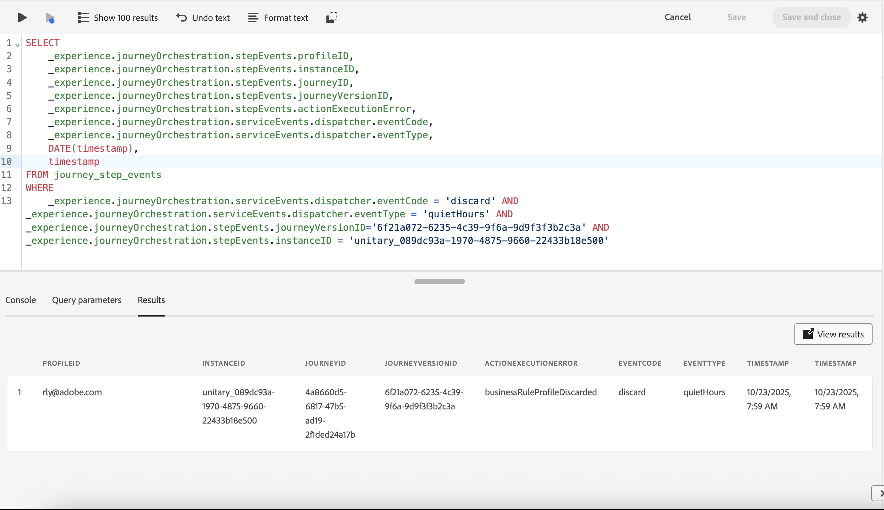

# 查詢範例{#query-examples}

本節列出幾個在Data Lake中查詢歷程步驟事件的常用範例。

請確定查詢中使用的欄位在對應結構描述中有關聯的值。

+++id、instanceid和profileid之間有何差異

* id：所有步驟事件專案均不重複。 兩個不同的步驟事件不能有相同的ID。
* instanceId：instanceID對於歷程執行中與設定檔相關聯的所有步驟事件都是相同的。 如果設定檔重新進入歷程，則會使用不同的instanceId。 此新instanceId將與重新進入之執行個體的所有步驟事件（從開始到結束）相同。
* profileID：與歷程名稱空間對應的設定檔身分。

>[!NOTE]
>
>基於疑難排解目的，我們建議在查詢歷程時使用journeyVersionID，而不是journeyVersionName。 在本節[中進一步瞭解歷程屬性](../building-journeys/expression/journey-properties.md#journey-properties-fields)。

+++

## 基本使用案例/常見查詢 {#common-queries}

+++在特定時間範圍內進入歷程的設定檔數

此查詢會提供在指定時間範圍內進入指定歷程的不同設定檔數量。

_資料湖查詢_

```sql
SELECT count(distinct _experience.journeyOrchestration.stepEvents.profileID)
FROM journey_step_events WHERE _experience.journeyOrchestration.stepEvents.journeyVersionID = '<journeyVersionID>'
AND _experience.journeyOrchestration.stepEvents.nodeType='start'
AND _experience.journeyOrchestration.stepEvents.instanceType = 'unitary'
AND DATE(timestamp) > (now() - interval '<last x hours>' hour);
```

瞭解如何在journey_step_events[中](../reports/sharing-field-list.md#discarded-events)疑難排解捨棄的事件型別。

+++

+++哪個規則導致設定檔未進入給定歷程

當設定檔因上限或適用性規則而無法進入歷程時，此查詢會傳回拒絕的規則集和規則資訊。

_範例_

```sql
SELECT 
    _experience.journeyOrchestration.serviceEvents.dispatcher.eventType,
    _experience.journeyOrchestration.serviceEvents.dispatcher.rejectedRuleset.ID AS RULESET_ID,
    _experience.journeyOrchestration.serviceEvents.dispatcher.rejectedRuleset.name AS RULESET_NAME,
    _experience.journeyOrchestration.serviceEvents.dispatcher.rejectedRuleset.rejectedRules.ID AS RULE_ID,
    _experience.journeyOrchestration.serviceEvents.dispatcher.rejectedRuleset.rejectedRules.name AS RULE_NAME
FROM
    journey_step_events
WHERE
    _experience.journeyOrchestration.serviceEvents.dispatcher.eventCode = 'discard'
AND
    _experience.journeyOrchestration.stepEvents.journeyVersionID='3855072d-79c3-438a-a5c3-c77fd6843812'
AND
    timestamp >= to_date('2025-05-16')
```

+++

+++哪個規則導致設定檔未收到歷程動作

此查詢會針對在歷程期間捨棄且未收到歷程動作的設定檔，傳回步驟事件詳細資訊。 它有助於識別為何因為商業規則（例如無訊息時間限制）而捨棄設定檔。

_資料湖查詢_

```sql
SELECT 
    _experience.journeyOrchestration.stepEvents.profileID,
    _experience.journeyOrchestration.stepEvents.instanceID,
    _experience.journeyOrchestration.stepEvents.journeyID,
    _experience.journeyOrchestration.stepEvents.journeyVersionID,
    _experience.journeyOrchestration.stepEvents.actionExecutionError,
    _experience.journeyOrchestration.serviceEvents.dispatcher.eventCode,
    _experience.journeyOrchestration.serviceEvents.dispatcher.eventType,
    DATE(timestamp),
    timestamp
FROM journey_step_events
WHERE
    _experience.journeyOrchestration.serviceEvents.dispatcher.eventCode = 'discard' AND
    _experience.journeyOrchestration.serviceEvents.dispatcher.eventType = '<eventType>' AND
    _experience.journeyOrchestration.stepEvents.journeyVersionID = '<journeyVersionID>' AND
    _experience.journeyOrchestration.stepEvents.instanceID = '<instanceID>';
```

_範例_

```sql
SELECT 
    _experience.journeyOrchestration.stepEvents.profileID,
    _experience.journeyOrchestration.stepEvents.instanceID,
    _experience.journeyOrchestration.stepEvents.journeyID,
    _experience.journeyOrchestration.stepEvents.journeyVersionID,
    _experience.journeyOrchestration.stepEvents.actionExecutionError,
    _experience.journeyOrchestration.serviceEvents.dispatcher.eventCode,
    _experience.journeyOrchestration.serviceEvents.dispatcher.eventType,
    DATE(timestamp),
    timestamp
FROM journey_step_events
WHERE
    _experience.journeyOrchestration.serviceEvents.dispatcher.eventCode = 'discard' AND
    _experience.journeyOrchestration.serviceEvents.dispatcher.eventType = 'quietHours' AND
    _experience.journeyOrchestration.stepEvents.journeyVersionID = '6f21a072-6235-4c39-9f6a-9d9f3f3b2c3a' AND
    _experience.journeyOrchestration.stepEvents.instanceID = 'unitary_089dc93a-1970-4875-9660-22433b18e500';
```



查詢結果會顯示索引鍵欄位，協助識別個人資料捨棄的原因：

* **actionExecutionError** — 設為`businessRuleProfileDiscarded`時，表示設定檔已因商業規則而捨棄。 `eventType`欄位提供特定商業規則造成捨棄的其他詳細資料。

* **eventType** — 指定造成捨棄的商業規則型別：
   * `quietHours`：由於設定無訊息時數，已捨棄設定檔
   * `forcedDiscardDueToQuietHours`：已強制捨棄設定檔，因為在無訊息小時內保留的設定檔已達到護欄限制

+++

+++特定歷程的每個節點在特定時間內發生多少錯誤

此查詢會依節點名稱分組，計算歷程每個節點遇到錯誤的不同設定檔。 其中包含所有型別的動作執行錯誤和擷取錯誤。

_資料湖查詢_

```sql
SELECT
_experience.journeyOrchestration.stepEvents.nodeName,
count(distinct _experience.journeyOrchestration.stepEvents.profileID)
FROM journey_step_events
WHERE _experience.journeyOrchestration.stepEvents.journeyVersionID='<journeyVersionID>'
AND DATE(timestamp) > (now() - interval '<last x hours>' hour)
AND
  (_experience.journeyOrchestration.stepEvents.actionExecutionError is not NULL
    OR _experience.journeyOrchestration.stepEvents.actionExecutionErrorCode is not NULL
    OR _experience.journeyOrchestration.stepEvents.actionExecutionOriginCode is not NULL
    OR _experience.journeyOrchestration.stepEvents.actionExecutionOriginError is not NULL
    OR _experience.journeyOrchestration.stepEvents.fetchError is not NULL
    OR _experience.journeyOrchestration.stepEvents.fetchErrorCode is not NULL
  )
GROUP BY _experience.journeyOrchestration.stepEvents.nodeName;
```

+++

+++在特定時間範圍內從特定歷程捨棄了多少事件

此查詢會計算歷程中捨棄的事件總數。 它會篩選各種捨棄事件代碼，包括區段匯出作業錯誤、Dispatcher捨棄和狀態機器捨棄。

_資料湖查詢_

```sql
SELECT
count(_id) AS NUMBER_OF_EVENTS_DISCARDED
FROM journey_step_events
WHERE (
   _experience.journeyOrchestration.serviceEvents.segmentExportJob.eventCode = 'error'
   OR _experience.journeyOrchestration.serviceEvents.dispatcher.eventCode = 'discard'
   OR _experience.journeyOrchestration.serviceEvents.stateMachine.eventCode = 'discard'
   OR _experience.journeyOrchestration.serviceEvents.segmentExportJob.eventCode is not null
)
AND _experience.journeyOrchestration.stepEvents.journeyVersionID='<journeyVersionID>'
AND DATE(timestamp) > (now() - interval '<last x hours>' hour);
```

+++

+++在特定時間範圍內，特定歷程中的特定設定檔會發生什麼事

此查詢會依時間順序，傳回指定時間內特定設定檔和歷程的所有步驟事件和服務事件。

_資料湖查詢_

```sql
SELECT
timestamp,
_experience.journeyOrchestration.stepEvents.journeyVersionID,
_experience.journeyOrchestration.stepEvents.profileID,
_experience.journeyOrchestration.stepEvents.nodeName,
_experience.journeyOrchestration.stepEvents.journeyNodeProcessed,
_experience.journeyOrchestration.serviceType,
to_json(_experience.journeyOrchestration.profile),
to_json(_experience.journeyOrchestration.serviceEvents)
FROM journey_step_events
WHERE _experience.journeyOrchestration.stepEvents.journeyVersionID='<journeyVersionID>'
AND DATE(timestamp) > (now() - interval '<last x hours>' hour)
AND
  (
    _experience.journeyOrchestration.stepEvents.profileID='<profileID>'
    OR _experience.journeyOrchestration.profile.ID='<profileID>'
  );
ORDER BY timestamp;
```

+++

+++兩個節點之間經過的時間長度 

例如，您可以使用這些查詢來預估等待活動所花費的時間。 這可讓您確保等待活動已正確設定。

_資料湖查詢_

```sql
WITH

START_NODE_INFO AS (

    SELECT 
    
        timestamp AS TS_START,
        _experience.journeyOrchestration.stepEvents.nodeName AS NODE_NAME,
        _experience.journeyOrchestration.stepEvents.instanceID AS INSTANCE_ID
        
    FROM 
    
        journey_step_events
    
    WHERE
    
        _experience.journeyOrchestration.stepEvents.journeyVersionID = '<journey version id>' AND
        _experience.journeyOrchestration.stepEvents.nodeName = '<name of node before wait activity>' AND
        _experience.journeyOrchestration.stepEvents.journeyNodeProcessed = true
        
),

END_NODE_INFO AS (

    SELECT 
    
        timestamp AS TS_END,
        _experience.journeyOrchestration.stepEvents.nodeName AS NODE_NAME,
        _experience.journeyOrchestration.stepEvents.instanceID AS INSTANCE_ID
        
    FROM 
    
        journey_step_events
    
    WHERE
    
        _experience.journeyOrchestration.stepEvents.journeyVersionID = '<journey version id>' AND
        _experience.journeyOrchestration.stepEvents.nodeName = '<name of wait activity node>' AND
        _experience.journeyOrchestration.stepEvents.journeyNodeProcessed = true
        
)

SELECT 

    T1.INSTANCE_ID AS INSTANCE_ID,
    T1.NODE_NAME AS START_NODE_NAME,
    T2.NODE_NAME AS END_NODE_NAME,
    DATEDIFF(millisecond,T1.TS_START,T2.TS_END) AS ELAPSED_TIME_MS
    
FROM

    START_NODE_INFO AS T1,
    END_NODE_INFO AS T2
    
WHERE

    T1.INSTANCE_ID = T2.INSTANCE_ID
```

_資料湖查詢_

```sql
WITH

START_NODE_INFO AS (

    SELECT 
    
        timestamp AS TS_START,
        _experience.journeyOrchestration.stepEvents.nodeName AS NODE_NAME,
        _experience.journeyOrchestration.stepEvents.instanceID AS INSTANCE_ID
        
    FROM 
    
        journey_step_events
    
    WHERE
    
        _experience.journeyOrchestration.stepEvents.journeyVersionID = '<journey version id>' AND
        _experience.journeyOrchestration.stepEvents.nodeName = '<name of node before wait activity>' AND
        _experience.journeyOrchestration.stepEvents.journeyNodeProcessed = true
        
),

END_NODE_INFO AS (

    SELECT 
    
        timestamp AS TS_END,
        _experience.journeyOrchestration.stepEvents.nodeName AS NODE_NAME,
        _experience.journeyOrchestration.stepEvents.instanceID AS INSTANCE_ID
        
    FROM 
    
        journey_step_events
    
    WHERE
    
        _experience.journeyOrchestration.stepEvents.journeyVersionID = '<journey version id>' AND
        _experience.journeyOrchestration.stepEvents.nodeName = '<name of wait activity node>' AND
        _experience.journeyOrchestration.stepEvents.journeyNodeProcessed = true
        
)

SELECT 

    AVG(DATEDIFF(millisecond,T1.TS_START,T2.TS_END)) AS AVERAGE_ELAPSED_TIME,
    MIN(DATEDIFF(millisecond,T1.TS_START,T2.TS_END)) AS MIN_ELAPSED_TIME,
    MAX(DATEDIFF(millisecond,T1.TS_START,T2.TS_END)) AS MAX_ELAPSED_TIME
    
FROM

    START_NODE_INFO AS T1,
    END_NODE_INFO AS T2
    
WHERE

    T1.INSTANCE_ID = T2.INSTANCE_ID
```

+++

+++如何檢查serviceEvent的詳細資訊 

Journey Step事件資料集包含所有stepEvents和serviceEvents。 stepEvents用於報告中，因為它們與歷程中設定檔的活動（事件、動作等）相關。 serviceEvents會儲存在相同的資料集中，並代表其他除錯資訊，例如體驗事件捨棄的原因。

以下是查詢serviceEvent詳細資訊的範例：

_資料湖查詢_

```sql
SELECT

     _experience.journeyOrchestration.profile.ID, 
     _experience.journeyOrchestration.journey.versionID, 
     to_json(_experience.journeyOrchestration.serviceEvents) 

FROM journey_step_event 

WHERE _experience.journeyOrchestration.serviceType is not null;
```

## 訊息/動作錯誤 {#message-action-errors}

+++歷程中遇到的每個錯誤的清單

此查詢可讓您列出執行訊息/動作時，在歷程中遇到的每個錯誤。

_資料湖查詢_

```sql
SELECT _experience.journeyOrchestration.stepEvents.actionExecutionError, count(distinct _id) FROM journey_step_events
WHERE _experience.journeyOrchestration.stepEvents.nodeName=<'message-name'>
AND _experience.journeyOrchestration.stepEvents.actionExecutionError IS NOT NULL
AND _experience.journeyOrchestration.stepEvents.journeyVersionID = '<journey-version-id>'
GROUP BY _experience.journeyOrchestration.stepEvents.actionExecutionError
```

_範例_

```sql
SELECT _experience.journeyOrchestration.stepEvents.actionExecutionError, count(distinct _id) FROM journey_step_events
WHERE _experience.journeyOrchestration.stepEvents.nodeName='Message - 100KB Email with Gateway and Kafkav2'
AND _experience.journeyOrchestration.stepEvents.actionExecutionError IS NOT NULL
AND _experience.journeyOrchestration.stepEvents.journeyVersionID = '67b14482-143e-4f83-9cf5-cfec0fca3d26'
GROUP BY _experience.journeyOrchestration.stepEvents.actionExecutionError
```

此查詢會傳回在歷程中執行動作時發生的所有不同錯誤，以及發生次數的計數。

+++

## 設定檔查詢 {#profile-based-queries}

+++尋找設定檔是否已進入特定歷程

此查詢會透過計算與該設定檔和歷程組合相關聯的事件，來檢查特定設定檔是否進入歷程。

_資料湖查詢_

```sql
SELECT count(distinct _id) FROM journey_step_events
where
_experience.journeyOrchestration.stepEvents.journeyVersionID = '<journey-version-id>' AND
_experience.journeyOrchestration.stepEvents.profileID = '<profileID corresponding to the namespace used>'
```

_範例_

```sql
SELECT count(distinct _id) FROM journey_step_events
where
_experience.journeyOrchestration.stepEvents.journeyVersionID = 'ec9efdd0-8a7c-4d7a-a765-b2cad659fa4e' AND
_experience.journeyOrchestration.stepEvents.profileID = 'saurgarg@adobe.com'
```

結果應大於0。 此查詢會傳回設定檔已進入歷程的確切次數。

+++

+++尋找設定檔是否已傳送特定訊息

方法1：如果訊息名稱在歷程中不是唯一的（它用於多個位置）。

_資料湖查詢_

```sql
SELECT count(distinct _id) FROM journey_step_events WHERE
_experience.journeyOrchestration.stepEvents.nodeID='<NodeId in the UI corresponding to the message>' AND
_experience.journeyOrchestration.stepEvents.actionExecutionError IS NULL AND
_experience.journeyOrchestration.stepEvents.journeyVersionID = '<journey-version-id>' AND
_experience.journeyOrchestration.stepEvents.profileID = '<profileID corresponding to the namespace used>'
```

_範例_

```sql
SELECT count(distinct _id) FROM journey_step_events WHERE
_experience.journeyOrchestration.stepEvents.nodeID='17ae65a1-02dd-439d-b54e-b56a78520eba' AND
_experience.journeyOrchestration.stepEvents.actionExecutionError IS NULL AND
_experience.journeyOrchestration.stepEvents.journeyVersionID = '67b14482-143e-4f83-9cf5-cfec0fca3d26' AND
_experience.journeyOrchestration.stepEvents.profileID = 'saurgarg@adobe.com'
```

結果應大於0。 此查詢只會告訴我們訊息動作是否已成功在歷程端執行。

方法2：如果您的訊息名稱在歷程中是唯一的。

_資料湖查詢_

```sql
SELECT count(distinct _id) FROM journey_step_events WHERE
_experience.journeyOrchestration.stepEvents.nodeName='<NodeName in the UI corresponding to the message>' AND
_experience.journeyOrchestration.stepEvents.actionExecutionError IS NULL AND
_experience.journeyOrchestration.stepEvents.journeyVersionID = '<journey-version-id>' AND
_experience.journeyOrchestration.stepEvents.profileID = '<profileID corresponding to the namespace used>'
```

_範例_

```sql
SELECT count(distinct _id) FROM journey_step_events WHERE
_experience.journeyOrchestration.stepEvents.nodeID='Message- 100KB Email' AND
_experience.journeyOrchestration.stepEvents.actionExecutionError IS NULL AND
_experience.journeyOrchestration.stepEvents.journeyVersionID = '67b14482-143e-4f83-9cf5-cfec0fca3d26' AND
_experience.journeyOrchestration.stepEvents.profileID = 'saurgarg@adobe.com'
```

查詢會傳回所有訊息的清單，連同針對所選設定檔叫用的訊息計數。

+++

+++尋找設定檔在過去30天內收到的所有訊息

此查詢會擷取過去30天內特定設定檔所有成功執行的訊息動作（依訊息名稱分組）。

_資料湖查詢_

```sql
SELECT _experience.journeyOrchestration.stepEvents.nodeName, count(distinct _id) FROM journey_step_events
WHERE  _experience.journeyOrchestration.stepEvents.actionExecutionError IS NULL AND
_experience.journeyOrchestration.stepEvents.nodeType = 'action' AND
_experience.journeyOrchestration.stepEvents.profileID = '<profileID corresponding to the namespace used>' AND
timestamp > (now() - interval '30' day)
GROUP BY _experience.journeyOrchestration.stepEvents.nodeName
```

_範例_

```sql
SELECT _experience.journeyOrchestration.stepEvents.nodeName, count(distinct _id) FROM journey_step_events
WHERE  _experience.journeyOrchestration.stepEvents.actionExecutionError IS NULL AND
_experience.journeyOrchestration.stepEvents.nodeType = 'action' AND
_experience.journeyOrchestration.stepEvents.profileID = 'saurgarg@adobe.com' AND
timestamp > (now() - interval '30' day)
GROUP BY _experience.journeyOrchestration.stepEvents.nodeName
```

查詢會傳回所有訊息的清單，連同針對所選設定檔叫用的訊息計數。

+++

+++尋找設定檔在過去30天內輸入的所有歷程

此查詢會傳回特定設定檔在過去30天內輸入的所有歷程，以及每個歷程的輸入計數。

_資料湖查詢_

```sql
SELECT _experience.journeyOrchestration.stepEvents.journeyVersionName, count(distinct _id) FROM journey_step_events
WHERE  _experience.journeyOrchestration.stepEvents.nodeType = 'start' AND
_experience.journeyOrchestration.stepEvents.profileID = '<profileID corresponding to the namespace used>' AND
timestamp > (now() - interval '30' day)
GROUP BY _experience.journeyOrchestration.stepEvents.journeyVersionName
```

_範例_

```sql
SELECT _experience.journeyOrchestration.stepEvents.journeyVersionName, count(distinct _id) FROM journey_step_events
WHERE  _experience.journeyOrchestration.stepEvents.nodeType = 'start' AND
_experience.journeyOrchestration.stepEvents.profileID = 'saurgarg@adobe.com' AND
timestamp > (now() - interval '30' day)
GROUP BY _experience.journeyOrchestration.stepEvents.journeyVersionName
```

查詢會傳回所有歷程名稱的清單，以及查詢的設定檔進入歷程的次數。

+++

+++符合歷程每日資格的設定檔數

此查詢提供在指定時段內進入歷程的相異設定檔數量的每日劃分。

_資料湖查詢_

```sql
SELECT DATE(timestamp), count(distinct _experience.journeyOrchestration.stepEvents.profileID) FROM journey_step_events
WHERE DATE(timestamp) > (now() - interval '<last x days>' day)
AND _experience.journeyOrchestration.stepEvents.journeyVersionID = '<journey-version-id>'
GROUP BY DATE(timestamp)
ORDER BY DATE(timestamp) desc
```

_範例_

```sql
SELECT DATE(timestamp), count(distinct _experience.journeyOrchestration.stepEvents.profileID) FROM journey_step_events
WHERE DATE(timestamp) > (now() - interval '100' day)
AND _experience.journeyOrchestration.stepEvents.journeyVersionID = '180ad071-d42d-42bb-8724-2a6ff0a109f1'
GROUP BY DATE(timestamp)
ORDER BY DATE(timestamp) desc
```

查詢會在定義的期間內傳回每天進入歷程的設定檔數。 如果透過多個身分輸入設定檔，則會計算兩次。 如果啟用重新進入，如果設定檔計數在不同日期重新進入歷程，則可能會跨不同日期複製。

瞭解如何在journey_step_events[中](../reports/sharing-field-list.md#discarded-events)疑難排解捨棄的事件型別。


+++

## 與讀取對象相關的查詢 {#read-segment-queries}

+++完成受眾匯出工作所需的時間

此查詢會找出工作排入佇列與完成時間之間的時間差，以計算對象匯出工作的持續時間。

_資料湖查詢_

```sql
select DATEDIFF (minute,
              (select timestamp
                where
_experience.journeyOrchestration.journey.versionID = '<journey-version-id>' AND
_experience.journeyOrchestration.serviceEvents.segmentExportJob.status = 'queued') ,
              (select timestamp
                where
_experience.journeyOrchestration.journey.versionID = '<journey-version-id>' AND
_experience.journeyOrchestration.serviceEvents.segmentExportJob.status = 'finished')) AS export_job_runtime;
```

_範例_

```sql
select DATEDIFF (minute,
              (select timestamp
                where
_experience.journeyOrchestration.journey.versionID = '180ad071-d42d-42bb-8724-2a6ff0a109f1' AND
_experience.journeyOrchestration.serviceEvents.segmentExportJob.status = 'queued') ,
              (select timestamp
                where
_experience.journeyOrchestration.journey.versionID = '180ad071-d42d-42bb-8724-2a6ff0a109f1' AND
_experience.journeyOrchestration.serviceEvents.segmentExportJob.status = 'finished')) AS export_job_runtime;
```

查詢會傳回對象匯出工作排入佇列與最終結束之間的時間差（以分鐘為單位）。

+++

+++歷程因為重複而捨棄的設定檔數

此查詢會計算在讀取對象活動期間由於執行個體重複錯誤而捨棄的不同設定檔數量。

_資料湖查詢_

```sql
SELECT count(distinct _experience.journeyOrchestration.profile.ID) FROM journey_step_events
where
_experience.journeyOrchestration.journey.versionID = '<journey-version-id>' AND
_experience.journeyOrchestration.serviceEvents.segmentExportJob.eventCode = 'ERROR_INSTANCE_DUPLICATION'
```

_範例_

```sql
SELECT count(distinct _experience.journeyOrchestration.profile.ID) FROM journey_step_events
where
_experience.journeyOrchestration.journey.versionID = '180ad071-d42d-42bb-8724-2a6ff0a109f1' AND
_experience.journeyOrchestration.serviceEvents.segmentExportJob.eventCode = 'ERROR_INSTANCE_DUPLICATION'
```

查詢會傳回歷程捨棄的所有設定檔ID，因為這些設定檔ID重複。

+++

+++歷程因名稱空間無效而捨棄的設定檔數

此查詢會傳回由於名稱空間無效或缺少必要名稱空間的身分而被捨棄的設定檔計數。

_資料湖查詢_

```sql
SELECT count(*) FROM journey_step_events
where
_experience.journeyOrchestration.journey.versionID = '<journey-version-id>' AND
_experience.journeyOrchestration.serviceEvents.segmentExportJob.eventCode = 'ERROR_INSTANCE_BAD_NAMESPACE'
```

_範例_

```sql
SELECT count(*) FROM journey_step_events
where
_experience.journeyOrchestration.journey.versionID = '180ad071-d42d-42bb-8724-2a6ff0a109f1' AND
_experience.journeyOrchestration.serviceEvents.segmentExportJob.eventCode = 'ERROR_INSTANCE_BAD_NAMESPACE'
```

查詢會傳回歷程捨棄的所有設定檔ID，因為這些設定檔ID具有無效的名稱空間，或沒有該名稱空間的身分。

+++

+++歷程因無身分對應而捨棄的設定檔數

此查詢會計算由於缺少歷程執行所需的身分對應而被捨棄的設定檔。

_資料湖查詢_

```sql
SELECT count(*) FROM journey_step_events
where
_experience.journeyOrchestration.journey.versionID = '<journey-version-id>' AND
_experience.journeyOrchestration.serviceEvents.segmentExportJob.eventCode = 'ERROR_INSTANCE_NO_IDENTITY_MAP'
```

_範例_

```sql
SELECT count(*) FROM journey_step_events
where
_experience.journeyOrchestration.journey.versionID = '180ad071-d42d-42bb-8724-2a6ff0a109f1' AND
_experience.journeyOrchestration.serviceEvents.segmentExportJob.eventCode = 'ERROR_INSTANCE_NO_IDENTITY_MAP'
```

查詢會傳回歷程捨棄的所有設定檔ID，因為缺少身分對應。

+++

+++由於歷程在測試節點中且該設定檔不是測試設定檔，因此被歷程捨棄的設定檔數

此查詢會識別歷程在測試模式下執行時捨棄的設定檔，但設定檔的testProfile屬性未設定為true。

_資料湖查詢_

```sql
SELECT count(distinct _experience.journeyOrchestration.profile.ID) FROM journey_step_events
where
_experience.journeyOrchestration.journey.versionID = '<journey-version-id>' AND
_experience.journeyOrchestration.serviceEvents.segmentExportJob.eventCode = 'ERROR_INSTANCE_NOT_A_TEST_PROFILE'
```

_範例_

```sql
SELECT count(distinct _experience.journeyOrchestration.profile.ID) FROM journey_step_events
where
_experience.journeyOrchestration.journey.versionID = '180ad071-d42d-42bb-8724-2a6ff0a109f1' AND
_experience.journeyOrchestration.serviceEvents.segmentExportJob.eventCode = 'ERROR_INSTANCE_NOT_A_TEST_PROFILE'
```

查詢會傳回歷程捨棄的所有設定檔ID，因為匯出作業是在測試模式下執行，但設定檔的testProfile屬性未設定為true。

+++

+++歷程因內部錯誤而捨棄的設定檔數

此查詢會傳回在歷程執行期間由於內部系統錯誤而捨棄的設定檔計數。

_資料湖查詢_

```sql
SELECT count(distinct _experience.journeyOrchestration.profile.ID) FROM journey_step_events
where
_experience.journeyOrchestration.journey.versionID = '<journey-version-id>' AND
_experience.journeyOrchestration.serviceEvents.segmentExportJob.eventCode = 'ERROR_INSTANCE_INTERNAL'
```

_範例_

```sql
SELECT count(distinct _experience.journeyOrchestration.profile.ID) FROM journey_step_events
where
_experience.journeyOrchestration.journey.versionID = '180ad071-d42d-42bb-8724-2a6ff0a109f1' AND
_experience.journeyOrchestration.serviceEvents.segmentExportJob.eventCode = 'ERROR_INSTANCE_INTERNAL'
```

查詢會傳回歷程因某些內部錯誤而捨棄的所有設定檔ID。

+++

+++特定歷程版本的讀取對象總覽

此查詢提供讀取對象活動的完整總覽，包括對象匯出流程所有階段的區段匯出工作詳細資訊、事件代碼、狀態和設定檔計數。

_資料湖查詢_

```sql
SELECT
    _experience.journeyOrchestration.serviceEvents.segmentExportJob.eventCode           AS EVENT_CODE,
    _experience.journeyOrchestration.serviceEvents.segmentExportJob.exportSegmentID     AS SEGMENT_ID,
    _experience.journeyOrchestration.serviceEvents.segmentExportJob.ID                  AS EXPORTJOB_ID,
    _experience.journeyOrchestration.serviceEvents.segmentExportJob.status              AS EXPORTJOB_STATUS,
    _experience.journeyOrchestration.serviceEvents.segmentExportJob.exportCountTotal    AS TOTAL_EXPORTED_PROFILES_COUNT,
    _experience.journeyOrchestration.serviceEvents.segmentExportJob.exportCountRealized AS SUCCESS_EXPORTED_PROFILES_COUNT,
    _experience.journeyOrchestration.serviceEvents.segmentExportJob.exportCountFailed   AS FAILED_EXPORTED_PROFILES_COUNT
FROM
    journey_step_events
WHERE
    _experience.journeyOrchestration.journey.versionID = '<journey-version-id>' AND
    _experience.journeyOrchestration.serviceEvents.segmentExportJob.eventType = 'segmenttrigger-orchestrator'
```

它會傳回與給定歷程版本相關的所有服務事件。 我們可以遵循操作鏈結：

* 主題建立
* 匯出工作建立
* 匯出工作終止（使用匯出設定檔上的量度）
* 工作者處理終止

我們也可以偵測下列問題：

* 建立主題或匯出工作時發生錯誤（包括對象匯出API呼叫逾時）
* 匯出作業可能卡住（針對指定的歷程版本，我們沒有任何有關匯出作業終止的事件）
* 若我們已收到匯出工作終止事件，但沒有工作人員處理終止事件，則為工作人員問題

重要：如果此查詢未傳回任何事件，可能是由於下列其中一個原因：

* 歷程版本尚未達到排程
* 如果歷程版本應該透過呼叫orchestrator來觸發匯出作業，則上游流程會出現問題：歷程部署問題、業務事件或排程器問題。

+++


+++取得特定歷程版本的讀取對象錯誤

此查詢會篩選與讀取對象失敗相關的特定錯誤事件代碼，例如主題建立錯誤、API呼叫錯誤、逾時及匯出作業失敗。

_資料湖查詢_

```sql
SELECT
    _experience.journeyOrchestration.serviceEvents.segmentExportJob.eventCode           AS EVENT_CODE,
    _experience.journeyOrchestration.serviceEvents.segmentExportJob.exportSegmentID     AS SEGMENT_ID,
    _experience.journeyOrchestration.serviceEvents.segmentExportJob.ID                  AS EXPORTJOB_ID,
    _experience.journeyOrchestration.serviceEvents.segmentExportJob.status              AS EXPORTJOB_STATUS,
    _experience.journeyOrchestration.serviceEvents.segmentExportJob.exportCountTotal    AS TOTAL_EXPORTED_PROFILES_COUNT,
    _experience.journeyOrchestration.serviceEvents.segmentExportJob.exportCountRealized AS SUCCESS_EXPORTED_PROFILES_COUNT,
    _experience.journeyOrchestration.serviceEvents.segmentExportJob.exportCountFailed   AS FAILED_EXPORTED_PROFILES_COUNT
FROM
    journey_step_events
WHERE
    _experience.journeyOrchestration.journey.versionID = '<journey-version-id>' AND
    _experience.journeyOrchestration.serviceEvents.segmentExportJob.eventType = 'segmenttrigger-orchestrator' AND
    _experience.journeyOrchestration.serviceEvents.segmentExportJob.eventCode IN (
        'ERROR_TOPIC_CREATION',
        'ERROR_EXPORTJOB_APICALL',
        'ERROR_EXPORTJOB_APICALL_TIMEOUT',
        'ERROR_EXPORTJOB_FAILED'
    )
```

+++

+++取得匯出作業處理狀態

此查詢會擷取對象匯出工作的處理狀態，以顯示其是否與設定檔匯出量度一起成功或失敗。

_資料湖查詢_

```sql
SELECT
    _experience.journeyOrchestration.serviceEvents.segmentExportJob.eventCode           AS EVENT_CODE,
    _experience.journeyOrchestration.serviceEvents.segmentExportJob.exportSegmentID     AS SEGMENT_ID,
    _experience.journeyOrchestration.serviceEvents.segmentExportJob.ID                  AS EXPORTJOB_ID,
    _experience.journeyOrchestration.serviceEvents.segmentExportJob.status              AS EXPORTJOB_STATUS,
    _experience.journeyOrchestration.serviceEvents.segmentExportJob.exportCountTotal    AS TOTAL_EXPORTED_PROFILES_COUNT,
    _experience.journeyOrchestration.serviceEvents.segmentExportJob.exportCountRealized AS SUCCESS_EXPORTED_PROFILES_COUNT,
    _experience.journeyOrchestration.serviceEvents.segmentExportJob.exportCountFailed   AS FAILED_EXPORTED_PROFILES_COUNT 
FROM
    journey_step_events
WHERE
    _experience.journeyOrchestration.journey.versionID = '<journey-version-id>' AND
    _experience.journeyOrchestration.serviceEvents.segmentExportJob.eventType = 'segmenttrigger-orchestrator' AND
    _experience.journeyOrchestration.serviceEvents.segmentExportJob.eventCode IN (
        'INFO_EXPORTJOB_SUCCEEDED',
        'ERROR_EXPORTJOB_FAILED'
    )
```

如果未傳回任何記錄，則表示：

* 主題或匯出作業建立期間發生錯誤
* 匯出工作仍在執行中

+++

+++取得已匯出設定檔的量度，包括每個匯出作業的丟棄和匯出作業量度

此查詢會結合捨棄的設定檔計數與匯出工作量度，以完整檢視每個個別匯出工作的對象匯出效能。

_資料湖查詢_

```sql
WITH
  
DISCARDED_EXPORTED_PROFILES AS (
  
    SELECT
        _experience.journeyOrchestration.serviceEvents.segmentExportJob.ID AS EXPORTJOB_ID,
        count(distinct _experience.journeyOrchestration.profile.ID) AS DISCARDED_PROFILES_COUNT
    FROM
        journey_step_events
    WHERE
        _experience.journeyOrchestration.journey.versionID = '<journey-version-id>' AND
        _experience.journeyOrchestration.serviceEvents.segmentExportJob.eventCode IN (
            'ERROR_INSTANCE_DUPLICATION',
            'ERROR_INSTANCE_BAD_NAMESPACE',
            'ERROR_INSTANCE_NO_IDENTITY_MAP',
            'ERROR_INSTANCE_NOT_A_TEST_PROFILE',
            'ERROR_INSTANCE_INTERNAL'
        )
    GROUP BY
        _experience.journeyOrchestration.serviceEvents.segmentExportJob.ID
 
),
  
SEGMENT_EXPORT_METRICS AS (
  
    SELECT
        _experience.journeyOrchestration.serviceEvents.segmentExportJob.ID AS EXPORTJOB_ID,
        sum(_experience.journeyOrchestration.serviceEvents.segmentExportJob.exportCountTotal) AS TOTAL_EXPORTED_PROFILES_COUNT,
        sum(_experience.journeyOrchestration.serviceEvents.segmentExportJob.exportCountRealized) AS SUCCESS_EXPORTED_PROFILES_COUNT,
        sum(_experience.journeyOrchestration.serviceEvents.segmentExportJob.exportCountFailed) AS FAILED_EXPORTED_PROFILES_COUNT
    FROM
        journey_step_events
    WHERE
        _experience.journeyOrchestration.journey.versionID = '<journey-version-id>' AND
        _experience.journeyOrchestration.serviceEvents.segmentExportJob.eventType = 'segmenttrigger-orchestrator' AND
        _experience.journeyOrchestration.serviceEvents.segmentExportJob.eventCode IN (
            'INFO_EXPORTJOB_SUCCEEDED',
            'ERROR_EXPORTJOB_FAILED'
        )
    GROUP BY
        _experience.journeyOrchestration.serviceEvents.segmentExportJob.ID
  
)
  
SELECT
    sum(T2.TOTAL_EXPORTED_PROFILES_COUNT),
    sum(T2.SUCCESS_EXPORTED_PROFILES_COUNT),
    sum(T2.FAILED_EXPORTED_PROFILES_COUNT),
    sum(T1.DISCARDED_PROFILES_COUNT)
FROM
    DISCARDED_EXPORTED_PROFILES AS T1,
    SEGMENT_EXPORT_METRICS AS T2
WHERE T1.EXPORTJOB_ID = T2.EXPORTJOB_ID
```

+++

+++取得所有匯出作業的彙總量度（對象匯出作業和捨棄）

此查詢會針對特定歷程版本彙總所有匯出工作的整體量度，對於週期性歷程或具有主題重複使用的業務事件觸發的歷程非常有用。

_資料湖查詢_

```sql
WITH
  
DISCARDED_EXPORTED_PROFILES AS (
  
    SELECT
        _experience.journeyOrchestration.journey.versionID AS JOURNEYVERSION_ID,
        count(distinct _experience.journeyOrchestration.profile.ID) AS DISCARDED_PROFILES_COUNT
    FROM
        journey_step_events
    WHERE
        _experience.journeyOrchestration.journey.versionID = '<journey-version-id>' AND
        _experience.journeyOrchestration.serviceEvents.segmentExportJob.eventCode IN (
            'ERROR_INSTANCE_DUPLICATION',
            'ERROR_INSTANCE_BAD_NAMESPACE',
            'ERROR_INSTANCE_NO_IDENTITY_MAP',
            'ERROR_INSTANCE_NOT_A_TEST_PROFILE',
            'ERROR_INSTANCE_INTERNAL'
        )
    GROUP BY
        _experience.journeyOrchestration.journey.versionID
),
  
SEGMENT_EXPORT_METRICS AS (
  
    SELECT
        _experience.journeyOrchestration.journey.versionID AS JOURNEYVERSION_ID,
        sum(_experience.journeyOrchestration.serviceEvents.segmentExportJob.exportCountTotal) AS TOTAL_EXPORTED_PROFILES_COUNT,
        sum(_experience.journeyOrchestration.serviceEvents.segmentExportJob.exportCountRealized) AS SUCCESS_EXPORTED_PROFILES_COUNT,
        sum(_experience.journeyOrchestration.serviceEvents.segmentExportJob.exportCountFailed) AS FAILED_EXPORTED_PROFILES_COUNT
    FROM
        journey_step_events
    WHERE
        _experience.journeyOrchestration.journey.versionID = '<journey-version-id>' AND
        _experience.journeyOrchestration.serviceEvents.segmentExportJob.eventType = 'segmenttrigger-orchestrator' AND
        _experience.journeyOrchestration.serviceEvents.segmentExportJob.eventCode IN (
            'INFO_EXPORTJOB_SUCCEEDED',
            'ERROR_EXPORTJOB_FAILED'
        )
    GROUP BY
          _experience.journeyOrchestration.journey.versionID
 
)
  
SELECT
    sum(T2.TOTAL_EXPORTED_PROFILES_COUNT),
    sum(T2.SUCCESS_EXPORTED_PROFILES_COUNT),
    sum(T2.FAILED_EXPORTED_PROFILES_COUNT),
    sum(T1.DISCARDED_PROFILES_COUNT)
FROM
    DISCARDED_EXPORTED_PROFILES AS T1,
    SEGMENT_EXPORT_METRICS AS T2
WHERE T1.JOURNEYVERSION_ID = T2.JOURNEYVERSION_ID
```

此查詢與上一個查詢不同。

它會傳回指定歷程版本的整體量度，無論為其執行的工作為何（如果是週期性歷程，則業務事件會觸發那些利用主題重複使用的事件）。

+++

## 與對象資格相關的查詢 {#segment-qualification-queries}

+++已捨棄設定檔，因為與設定的對象實現不同

此查詢會識別由於其對象實現狀態不符合歷程的對象資格設定（例如，設定為「enters」但設定檔為「exited」）而捨棄的設定檔。

_資料湖查詢_

```sql
SELECT DATE(timestamp),  _experience.journeyOrchestration.profile.ID
FROM journey_step_events
where
_experience.journeyOrchestration.journey.versionID = '<journey-version id>' AND
_experience.journeyOrchestration.serviceEvents.dispatcher.eventType = 'ERROR_SEGMENT_REALISATION_CONDITION_MISMATCH'
```

_範例_

```sql
SELECT DATE(timestamp),  _experience.journeyOrchestration.profile.ID
FROM journey_step_events
where
_experience.journeyOrchestration.journey.versionID = 'a868f3c9-4888-46ac-a274-94cdf1c4159d' AND
_experience.journeyOrchestration.serviceEvents.dispatcher.eventType = 'ERROR_SEGMENT_REALISATION_CONDITION_MISMATCH'
```

此查詢會傳回歷程版本因對象實現錯誤而捨棄的所有設定檔ID。

+++

+++特定設定檔因任何其他原因而捨棄的對象資格事件

此查詢會擷取因內部服務錯誤而被特定設定檔捨棄的所有對象資格或外部事件。

_資料湖查詢_

```sql
SELECT DATE(timestamp),  _experience.journeyOrchestration.profile.ID, _experience.journeyOrchestration.serviceEvents.dispatcher.projectionID
FROM journey_step_events
where
_experience.journeyOrchestration.profile.ID = '<profile-id>' AND
_experience.journeyOrchestration.serviceEvents.dispatcher.eventCode = 'discard' AND
_experience.journeyOrchestration.serviceEvents.dispatcher.eventType = 'ERROR_SERVICE_INTERNAL';
```

_範例_

```sql
SELECT DATE(timestamp),  _experience.journeyOrchestration.profile.ID, _experience.journeyOrchestration.serviceEvents.dispatcher.projectionID
FROM journey_step_events
where
_experience.journeyOrchestration.profile.ID = 'mandee@adobe.com' AND
_experience.journeyOrchestration.serviceEvents.dispatcher.eventCode = 'discard' AND
_experience.journeyOrchestration.serviceEvents.dispatcher.eventType = 'ERROR_SERVICE_INTERNAL';
```

此查詢會傳回由於設定檔的任何其他原因而捨棄的所有事件（外部事件/對象資格事件）。

+++

## 事件型查詢 {#event-based-queries}

+++檢查是否已收到歷程的業務事件

此查詢會計算在指定時間範圍內，由歷程（依日期分組）接收業務事件的次數。

_資料湖查詢_

```sql
SELECT DATE(timestamp), count(distinct _id)
FROM journey_step_events
where
_experience.journeyOrchestration.stepEvents.journeyVersionID = '<journey-version-id>' AND
_experience.journeyOrchestration.stepEvents.nodeName = '<node-name-corresponding-to-business-event>' AND
_experience.journeyOrchestration.stepEvents.nodeType = 'start' AND
WHERE DATE(timestamp) > (now() - interval '<last x hours>' hour)
```

_範例_

```sql
SELECT DATE(timestamp), count(distinct _id)
FROM journey_step_events
where
_experience.journeyOrchestration.stepEvents.journeyVersionID = 'b1093bd4-11f3-44cc-961e-33925cc58e18' AND
_experience.journeyOrchestration.stepEvents.nodeName = 'TEST_MLTrainingSession' AND
_experience.journeyOrchestration.stepEvents.nodeType = 'start' AND
WHERE DATE(timestamp) > (now() - interval '6' hour)
```

+++

+++檢查設定檔的外部事件是否因為找不到相關歷程而被捨棄

此查詢會識別特定設定檔的外部事件何時被捨棄，因為沒有作用中或相符的歷程設定為接收該事件。

_資料湖查詢_

```sql
SELECT _experience.journeyOrchestration.profile.ID, DATE(timestamp) FROM journey_step_events
where
_experience.journeyOrchestration.serviceEvents.dispatcher.eventID = '<eventId>' AND
_experience.journeyOrchestration.profile.ID = '<profileId>' AND
_experience.journeyOrchestration.serviceEvents.dispatcher.eventCode = 'discard' AND
_experience.journeyOrchestration.serviceEvents.dispatcher.eventType = 'EVENT_WITH_NO_JOURNEY'
```

_範例_

```sql
SELECT _experience.journeyOrchestration.profile.ID, DATE(timestamp) FROM journey_step_events
where
_experience.journeyOrchestration.serviceEvents.dispatcher.eventID = '515bff852185e434ca5c83bcfc4f24626b1545ca615659fc4cfff91626ce61a6' AND
_experience.journeyOrchestration.profile.ID = 'mandee@adobe.com' AND
_experience.journeyOrchestration.serviceEvents.dispatcher.eventCode = 'discard' AND
_experience.journeyOrchestration.serviceEvents.dispatcher.eventType = 'EVENT_WITH_NO_JOURNEY'
```

瞭解如何在journey_step_events[中](../reports/sharing-field-list.md#discarded-events)疑難排解捨棄的事件型別。

+++

+++檢查設定檔的外部事件是否因任何其他原因而捨棄

此查詢會擷取由於內部服務錯誤而為特定設定檔捨棄的外部事件，以及事件ID和錯誤代碼。

_資料湖查詢_

```sql
SELECT _experience.journeyOrchestration.profile.ID, DATE(timestamp), _experience.journeyOrchestration.serviceEvents.dispatcher.eventID, _experience.journeyOrchestration.serviceEvents.dispatcher.eventCode
FROM journey_step_events
where
_experience.journeyOrchestration.profile.ID='<profileID>' AND
_experience.journeyOrchestration.serviceEvents.dispatcher.eventID='<eventID>' AND
_experience.journeyOrchestration.serviceEvents.dispatcher.eventCode = 'discard' AND
_experience.journeyOrchestration.serviceEvents.dispatcher.eventType = 'ERROR_SERVICE_INTERNAL';
```

_範例_

```sql
SELECT _experience.journeyOrchestration.profile.ID, DATE(timestamp), _experience.journeyOrchestration.serviceEvents.dispatcher.eventID, _experience.journeyOrchestration.serviceEvents.dispatcher.eventCode
FROM journey_step_events
where
_experience.journeyOrchestration.profile.ID='mandee@adobe.com' AND
_experience.journeyOrchestration.serviceEvents.dispatcher.eventID='81c51be978d8bdf9ef497076b3e12b14533615522ecea9f5080a81c736491656' AND
_experience.journeyOrchestration.serviceEvents.dispatcher.eventCode = 'discard' AND
_experience.journeyOrchestration.serviceEvents.dispatcher.eventType = 'ERROR_SERVICE_INTERNAL';
```

瞭解如何在journey_step_events[中](../reports/sharing-field-list.md#discarded-events)疑難排解捨棄的事件型別。

+++

+++檢查stateMachine依errorCode捨棄的所有事件計數

此查詢會彙總歷程狀態機器捨棄的所有事件（依錯誤代碼分組），以協助識別捨棄的最常見原因。

_資料湖查詢_

```sql
SELECT _experience.journeyOrchestration.serviceEvents.stateMachine.eventCode, COUNT() FROM journey_step_events
where
_experience.journeyOrchestration.serviceEvents.stateMachine.eventType = 'discard' GROUP BY _experience.journeyOrchestration.serviceEvents.stateMachine.eventCode
```

_範例_

```sql
SELECT _experience.journeyOrchestration.serviceEvents.stateMachine.eventCode, COUNT() FROM journey_step_events
where
_experience.journeyOrchestration.serviceEvents.stateMachine.eventType = 'discard' GROUP BY _experience.journeyOrchestration.serviceEvents.stateMachine.eventCode
```

瞭解如何在journey_step_events[中](../reports/sharing-field-list.md#discarded-events)疑難排解捨棄的事件型別。

+++

+++檢查所有已捨棄的事件，因為不允許重新進入

此查詢會識別在歷程設定中不允許重新進入時，因為設定檔嘗試重新進入歷程而捨棄的所有事件。

_資料湖查詢_

```sql
SELECT DATE(timestamp), _experience.journeyOrchestration.profile.ID,
_experience.journeyOrchestration.journey.versionID,
_experience.journeyOrchestration.serviceEvents.stateMachine.eventCode 
FROM journey_step_events
where
_experience.journeyOrchestration.serviceEvents.stateMachine.eventType = 'discard' AND _experience.journeyOrchestration.serviceEvents.stateMachine.eventCode='reentranceNotAllowed'
```

_範例_

```sql
SELECT DATE(timestamp), _experience.journeyOrchestration.profile.ID,
_experience.journeyOrchestration.journey.versionID,
_experience.journeyOrchestration.serviceEvents.stateMachine.eventCode 
FROM journey_step_events
where
_experience.journeyOrchestration.serviceEvents.stateMachine.eventType = 'discard' AND _experience.journeyOrchestration.serviceEvents.stateMachine.eventCode='reentranceNotAllowed'
```

瞭解如何在journey_step_events[中](../reports/sharing-field-list.md#discarded-events)疑難排解捨棄的事件型別。

+++

## 常見的歷程型查詢 {#journey-based-queries}

+++每日作用中歷程的數量

此查詢會傳回具有活動的每日不重複歷程版本計數，可幫助您瞭解一段時間內的歷程執行模式。

_資料湖查詢_

```sql
SELECT DATE(timestamp), count(distinct _experience.journeyOrchestration.stepEvents.journeyVersionID) FROM journey_step_events
WHERE DATE(timestamp) > (now() - interval '<last x days>' day)
GROUP BY DATE(timestamp)
ORDER BY DATE(timestamp) desc
```

_範例_

```sql
SELECT DATE(timestamp), count(distinct _experience.journeyOrchestration.stepEvents.journeyVersionID) FROM journey_step_events
WHERE DATE(timestamp) > (now() - interval '100' day)
GROUP BY DATE(timestamp)
ORDER BY DATE(timestamp) desc
```

查詢會在定義的期間內傳回每天觸發的不重複歷程計數。 在多天觸發的單一歷程每天將計為一次。


+++

## 歷程執行個體上的查詢 {#journey-instances-queries}

+++特定時間內處於特定狀態的設定檔數

此查詢使用通用表格運算式(CTE)，透過尋找經過節點但尚未進入下一個節點的設定檔，來識別目前在歷程中的特定節點等待的設定檔。

_資料湖查詢_

```sql
WITH
 
INSTANCES_PASSED_IN_ALL_NODES_WITH_DETAILS AS (
 
    SELECT
        STEP_EVENTS.timestamp AS TS,
        STEP_EVENTS._experience.journeyOrchestration.stepEvents.nodeName AS NODE_NAME,
        STEP_EVENTS._experience.journeyOrchestration.stepEvents.instanceID AS ID
    FROM
        journey_step_events AS STEP_EVENTS
    WHERE
        STEP_EVENTS._experience.journeyOrchestration.stepEvents.journeyVersionName = '<journey version name>'
 
),
 
INSTANCES_PASSED_IN_NODE_WITH_DETAILS AS (
 
    SELECT
        T1.TS AS TS,
        T1.ID AS ID
    FROM
        INSTANCES_PASSED_IN_ALL_NODES_WITH_DETAILS AS T1
    WHERE
        T1.NODE_NAME = '<specific node name>' AND
        <filter on time for profile in specific node>
 
),
 
INSTANCES_PASSED_IN_NEXT_NODES AS (
     
    SELECT
        T1.TS AS TS,
        T1.ID AS ID
    FROM
        INSTANCES_PASSED_IN_ALL_NODES_WITH_DETAILS AS T1
    WHERE
        T1.NODE_NAME in (<list of next node names from the specific node>)
 
),
 
INSTANCES_PASSED_IN_NODE_NOT_PASSED_IN_NODES AS (
 
    SELECT
        distinct T1.ID AS ID
    FROM
        INSTANCES_PASSED_IN_NODE_WITH_DETAILS AS T1
 
    EXCEPT
     
    SELECT
        distinct T1.ID AS ID
    FROM
        INSTANCES_PASSED_IN_NEXT_NODES AS T1
 
)
 
SELECT
    DATE_FORMAT(T1.TS,'<date pattern>') AS DATETIME,
    count(T1.ID) AS INSTANCES_COUNT
FROM
    INSTANCES_PASSED_IN_NODE_WITH_DETAILS AS T1,
    INSTANCES_PASSED_IN_NODE_NOT_PASSED_IN_NODES AS T2
WHERE
    T1.ID = T2.ID
GROUP BY
    DATETIME
ORDER BY
    DATETIME DESC
```

_範例_

```sql
WITH
 
INSTANCES_PASSED_IN_ALL_NODES_WITH_DETAILS AS (
 
    SELECT
        STEP_EVENTS.timestamp AS TS,
        STEP_EVENTS._experience.journeyOrchestration.stepEvents.nodeName AS NODE_NAME,
        STEP_EVENTS._experience.journeyOrchestration.stepEvents.instanceID AS ID
    FROM
        journey_step_events AS STEP_EVENTS
    WHERE
        STEP_EVENTS._experience.journeyOrchestration.stepEvents.journeyVersionName = 'Journey20009'
 
),
 
INSTANCES_PASSED_IN_NODE_WITH_DETAILS AS (
 
    SELECT
        T1.TS AS TS,
        T1.ID AS ID
    FROM
        INSTANCES_PASSED_IN_ALL_NODES_WITH_DETAILS AS T1
    WHERE
        T1.NODE_NAME = 'slack_bso_tests - test1' AND
        T1.TS > (now() - interval '18 hour')
 
),
 
INSTANCES_PASSED_IN_NEXT_NODES AS (
     
    SELECT
        T1.TS AS TS,
        T1.ID AS ID
    FROM
        INSTANCES_PASSED_IN_ALL_NODES_WITH_DETAILS AS T1
    WHERE
        T1.NODE_NAME in ('slack_bso_tests - test2')
 
),
 
INSTANCES_PASSED_IN_NODE_NOT_PASSED_IN_NODES AS (
 
    SELECT
        distinct T1.ID AS ID
    FROM
        INSTANCES_PASSED_IN_NODE_WITH_DETAILS AS T1
 
    EXCEPT
     
    SELECT
        distinct T1.ID AS ID
    FROM
        INSTANCES_PASSED_IN_NEXT_NODES AS T1
 
)
 
SELECT
    DATE_FORMAT(T1.TS,'yyyy/MM/dd HH:mm') AS DATETIME,
    count(T1.ID) AS INSTANCES_COUNT
FROM
    INSTANCES_PASSED_IN_NODE_WITH_DETAILS AS T1,
    INSTANCES_PASSED_IN_NODE_NOT_PASSED_IN_NODES AS T2
WHERE
    T1.ID = T2.ID
GROUP BY
    DATETIME
ORDER BY
    DATETIME DESC
```

+++

+++在特定時段內有多少設定檔已退出歷程

此查詢會計算在指定時段內退出的歷程執行個體，包括因完成、錯誤、逾時或上限錯誤而退出的次數。

_資料湖查詢_

```sql
SELECT
    DATE_FORMAT(STEP_EVENTS.timestamp,'yyyy/MM/dd HH:mm') AS DATETIME,
    count(STEP_EVENTS._experience.journeyOrchestration.stepEvents.instanceID) AS EXITED_INSTANCES_COUNT
FROM
    journey_step_events AS STEP_EVENTS
WHERE
    STEP_EVENTS._experience.journeyOrchestration.stepEvents.journeyVersionName = '<journey version name>' AND
    STEP_EVENTS._experience.journeyOrchestration.stepEvents.stepStatus in ('endStep', 'error', 'timedOut', 'cappingError') AND
    <timestamp filter>
GROUP BY
    DATETIME
ORDER BY
    DATETIME DESC
```

_範例_

```sql
SELECT
    DATE_FORMAT(STEP_EVENTS.timestamp,'yyyy/MM/dd HH:mm') AS DATETIME,
    count(STEP_EVENTS._experience.journeyOrchestration.stepEvents.instanceID) AS EXITED_INSTANCES_COUNT
FROM
    journey_step_events AS STEP_EVENTS
WHERE
    STEP_EVENTS._experience.journeyOrchestration.stepEvents.journeyVersionName = 'Journey20009' AND
    STEP_EVENTS._experience.journeyOrchestration.stepEvents.stepStatus in ('endStep', 'error', 'timedOut', 'cappingError') AND
    STEP_EVENTS.timestamp > (now() - interval '22 hour')
GROUP BY
    DATETIME
ORDER BY
    DATETIME DESC
```

+++

+++在特定時段內，有多少設定檔退出具有節點/狀態的歷程

此查詢提供歷程退出的詳細劃分，顯示每個退出執行個體的節點名稱和退出狀態，以協助識別設定檔離開歷程的位置和原因。

_資料湖查詢_

```sql
SELECT
    DATE_FORMAT(STEP_EVENTS.timestamp,'yyyy/MM/dd HH:mm') AS DATETIME,
    STEP_EVENTS._experience.journeyOrchestration.stepEvents.nodeName AS NODE_NAME,
    STEP_EVENTS._experience.journeyOrchestration.stepEvents.stepStatus AS EXIT_STATUS,
    count(STEP_EVENTS._experience.journeyOrchestration.stepEvents.instanceID) AS EXITED_INSTANCES_COUNT
FROM
    journey_step_events AS STEP_EVENTS
WHERE
    STEP_EVENTS._experience.journeyOrchestration.stepEvents.journeyVersionName = '<journey version name>' AND
    STEP_EVENTS._experience.journeyOrchestration.stepEvents.stepStatus in ('endStep', 'error', 'timedOut', 'cappingError') AND
    <timestamp filter>
GROUP BY
    DATETIME, NODE_NAME, EXIT_STATUS
ORDER BY
    DATETIME DESC
```

_範例_

```sql
SELECT
    DATE_FORMAT(STEP_EVENTS.timestamp,'yyyy/MM/dd HH:mm') AS DATETIME,
    STEP_EVENTS._experience.journeyOrchestration.stepEvents.nodeName AS NODE_NAME,
    STEP_EVENTS._experience.journeyOrchestration.stepEvents.stepStatus AS EXIT_STATUS,
    count(STEP_EVENTS._experience.journeyOrchestration.stepEvents.instanceID) AS EXITED_INSTANCES_COUNT
FROM
    journey_step_events AS STEP_EVENTS
WHERE
    STEP_EVENTS._experience.journeyOrchestration.stepEvents.journeyVersionName = 'Journey20009' AND
    STEP_EVENTS._experience.journeyOrchestration.stepEvents.stepStatus in ('endStep', 'error', 'timedOut', 'cappingError') AND
    STEP_EVENTS.timestamp > (now() - interval '22 hour')
GROUP BY
    DATETIME, NODE_NAME, EXIT_STATUS
ORDER BY
    DATETIME DESC
```

+++

## 與自訂動作效能度量相關的查詢 {#query-custom-action}

+++ 特定時段內每個端點每秒的成功呼叫、錯誤和要求總數

此查詢提供自訂HTTP動作的效能度量，包括呼叫總數、成功呼叫、依型別（4xx、5xx、逾時、上限）的錯誤計數，以及每個端點的每秒要求傳輸量。

_資料湖查詢_

```sql
SELECT
    _experience.journeyOrchestration.stepEvents.actionOriginEndpoint AS ENDPOINT,
    COUNT(1) AS TOTAL_CALLS,
    COUNT(CASE WHEN _experience.journeyOrchestration.stepEvents.actionExecutionError IS NULL THEN 1 END) AS SUCCESSFUL_CALLS,
    COUNT(CASE WHEN _experience.journeyOrchestration.stepEvents.actionExecutionError = 'http' AND
                    _experience.journeyOrchestration.stepEvents.actionExecutionErrorCode LIKE '4%' THEN 1 END) AS "4xx_ERRORS",
    COUNT(CASE WHEN _experience.journeyOrchestration.stepEvents.actionExecutionError = 'http' AND
                    _experience.journeyOrchestration.stepEvents.actionExecutionErrorCode LIKE '5%' THEN 1 END) AS "5xx_ERRORS",
    COUNT(CASE WHEN _experience.journeyOrchestration.stepEvents.actionExecutionError = 'timedout' THEN 1 END) AS TIMEOUTS,
    COUNT(CASE WHEN _experience.journeyOrchestration.stepEvents.actionExecutionError = 'capped' THEN 1 END) AS CAPPED_CALLS,
    ROUND(COUNT(_experience.journeyOrchestration.stepEvents.actionExecutionOriginStartTime) / 
        COUNT(DISTINCT DATE_TRUNC('second', _experience.journeyOrchestration.stepEvents.actionExecutionOriginStartTime)), 0) AS THROUGHPUT_RPS
FROM 
    journey_step_events
WHERE 
    _experience.journeyOrchestration.stepEvents.actionType = 'customHttpAction' AND
    _experience.journeyOrchestration.stepEvents.actionOriginEndpoint IS NOT NULL AND
    (<actionExecutionOriginStartTime filter> OR
        (_experience.journeyOrchestration.stepEvents.actionExecutionError = 'capped' AND <timestamp filter>))
GROUP BY 
    ENDPOINT
ORDER BY
    ENDPOINT;
```

_範例_

```sql
SELECT
    _experience.journeyOrchestration.stepEvents.actionOriginEndpoint AS ENDPOINT,
    COUNT(1) AS TOTAL_CALLS,
    COUNT(CASE WHEN _experience.journeyOrchestration.stepEvents.actionExecutionError IS NULL THEN 1 END) AS SUCCESSFUL_CALLS,
    COUNT(CASE WHEN _experience.journeyOrchestration.stepEvents.actionExecutionError = 'http' AND
                    _experience.journeyOrchestration.stepEvents.actionExecutionErrorCode LIKE '4%' THEN 1 END) AS "4xx_ERRORS",
    COUNT(CASE WHEN _experience.journeyOrchestration.stepEvents.actionExecutionError = 'http' AND
                    _experience.journeyOrchestration.stepEvents.actionExecutionErrorCode LIKE '5%' THEN 1 END) AS "5xx_ERRORS",
    COUNT(CASE WHEN _experience.journeyOrchestration.stepEvents.actionExecutionError = 'timedout' THEN 1 END) AS TIMEOUTS,
    COUNT(CASE WHEN _experience.journeyOrchestration.stepEvents.actionExecutionError = 'capped' THEN 1 END) AS CAPPED_CALLS,
    ROUND(COUNT(_experience.journeyOrchestration.stepEvents.actionExecutionOriginStartTime) / 
        COUNT(DISTINCT DATE_TRUNC('second', _experience.journeyOrchestration.stepEvents.actionExecutionOriginStartTime)), 0) AS THROUGHPUT_RPS
FROM 
    journey_step_events
WHERE 
    _experience.journeyOrchestration.stepEvents.actionType = 'customHttpAction' AND
    _experience.journeyOrchestration.stepEvents.actionOriginEndpoint IS NOT NULL AND
    (_experience.journeyOrchestration.stepEvents.actionExecutionOriginStartTime > (now() - interval '1' day) OR
        (_experience.journeyOrchestration.stepEvents.actionExecutionError = 'capped' AND timestamp > (now() - interval '1' day)))
GROUP BY 
    ENDPOINT
ORDER BY
    ENDPOINT;
```

+++

+++ 特定時段內每個端點的成功呼叫、錯誤和輸送量的時間序列

此查詢提供與上一個查詢相同的效能量度，但以時間序列組織，顯示端點效能隨時間的變化，以每分鐘為粒度。

_資料湖查詢_

```sql
SELECT
    _experience.journeyOrchestration.stepEvents.actionOriginEndpoint AS ENDPOINT,
    DATE_FORMAT(COALESCE(_experience.journeyOrchestration.stepEvents.actionExecutionOriginStartTime, timestamp), 'yyyy/MM/dd HH:mm') AS SPAN,
    COUNT(1) AS TOTAL_CALLS,
    COUNT(CASE WHEN _experience.journeyOrchestration.stepEvents.actionExecutionError IS NULL THEN 1 END) AS SUCCESSFUL_CALLS,
    COUNT(CASE WHEN _experience.journeyOrchestration.stepEvents.actionExecutionError = 'http' AND
                    _experience.journeyOrchestration.stepEvents.actionExecutionErrorCode LIKE '4%' THEN 1 END) AS "4xx_ERRORS",
    COUNT(CASE WHEN _experience.journeyOrchestration.stepEvents.actionExecutionError = 'http' AND
                    _experience.journeyOrchestration.stepEvents.actionExecutionErrorCode LIKE '5%' THEN 1 END) AS "5xx_ERRORS",
    COUNT(CASE WHEN _experience.journeyOrchestration.stepEvents.actionExecutionError = 'timedout' THEN 1 END) AS TIMEOUTS,
    COUNT(CASE WHEN _experience.journeyOrchestration.stepEvents.actionExecutionError = 'capped' THEN 1 END) AS CAPPED_CALLS,
    ROUND(COUNT(_experience.journeyOrchestration.stepEvents.actionExecutionOriginStartTime) / 
        COUNT(DISTINCT DATE_TRUNC('second', _experience.journeyOrchestration.stepEvents.actionExecutionOriginStartTime)), 0) AS THROUGHPUT_RPS
FROM 
    journey_step_events
WHERE 
    _experience.journeyOrchestration.stepEvents.actionType = 'customHttpAction' AND
    _experience.journeyOrchestration.stepEvents.actionOriginEndpoint IS NOT NULL AND
    (<actionExecutionOriginStartTime filter> OR
        (_experience.journeyOrchestration.stepEvents.actionExecutionError = 'capped' AND
           <timestamp filter>))
GROUP BY 
    ENDPOINT, SPAN
ORDER BY
    ENDPOINT,
    SPAN;
```

_範例_

```sql
SELECT
    _experience.journeyOrchestration.stepEvents.actionOriginEndpoint AS ENDPOINT,
    DATE_FORMAT(COALESCE(_experience.journeyOrchestration.stepEvents.actionExecutionOriginStartTime, timestamp), 'yyyy/MM/dd HH:mm') AS SPAN,
    COUNT(1) AS TOTAL_CALLS,
    COUNT(CASE WHEN _experience.journeyOrchestration.stepEvents.actionExecutionError IS NULL THEN 1 END) AS SUCCESSFUL_CALLS,
    COUNT(CASE WHEN _experience.journeyOrchestration.stepEvents.actionExecutionError = 'http' AND
                    _experience.journeyOrchestration.stepEvents.actionExecutionErrorCode LIKE '4%' THEN 1 END) AS "4xx_ERRORS",
    COUNT(CASE WHEN _experience.journeyOrchestration.stepEvents.actionExecutionError = 'http' AND
                    _experience.journeyOrchestration.stepEvents.actionExecutionErrorCode LIKE '5%' THEN 1 END) AS "5xx_ERRORS",
    COUNT(CASE WHEN _experience.journeyOrchestration.stepEvents.actionExecutionError = 'timedout' THEN 1 END) AS TIMEOUTS,
    COUNT(CASE WHEN _experience.journeyOrchestration.stepEvents.actionExecutionError = 'capped' THEN 1 END) AS CAPPED_CALLS,
    ROUND(COUNT(_experience.journeyOrchestration.stepEvents.actionExecutionOriginStartTime) / 
        COUNT(DISTINCT DATE_TRUNC('second', _experience.journeyOrchestration.stepEvents.actionExecutionOriginStartTime)), 0) AS THROUGHPUT_RPS
FROM 
    journey_step_events
WHERE 
    _experience.journeyOrchestration.stepEvents.actionType = 'customHttpAction' AND
    _experience.journeyOrchestration.stepEvents.actionOriginEndpoint IS NOT NULL AND
    (_experience.journeyOrchestration.stepEvents.actionExecutionOriginStartTime > (now() - interval '1' day) OR
        (_experience.journeyOrchestration.stepEvents.actionExecutionError = 'capped' AND
           timestamp > (now() - interval '1' day)))
GROUP BY 
    ENDPOINT, SPAN
ORDER BY
    ENDPOINT,
    SPAN;
```

+++

+++特定時段內位於第50、95、99和99.9百分位數之每個端點的回應延遲

此查詢會計算自訂動作端點的回應時間百分位數，協助您瞭解延遲分佈，並識別不同百分位數臨界值的效能極端值。

_資料湖查詢_

```sql
SELECT
    _experience.journeyOrchestration.stepEvents.actionOriginEndpoint AS ENDPOINT,
    COUNT(1) AS SUCCESSFUL_CALLS,
    ROUND(PERCENTILE_CONT(0.50) WITHIN GROUP (ORDER BY _experience.journeyOrchestration.stepEvents.actionExecutionOriginTime),0) AS P50_LATENCY_MS,
    ROUND(PERCENTILE_CONT(0.95) WITHIN GROUP (ORDER BY _experience.journeyOrchestration.stepEvents.actionExecutionOriginTime),0) AS P95_LATENCY_MS,
    ROUND(PERCENTILE_CONT(0.99) WITHIN GROUP (ORDER BY _experience.journeyOrchestration.stepEvents.actionExecutionOriginTime),0) AS P99_LATENCY_MS,
    ROUND(PERCENTILE_CONT(0.999) WITHIN GROUP (ORDER BY _experience.journeyOrchestration.stepEvents.actionExecutionOriginTime),0) AS P999_LATENCY_MS
FROM 
    journey_step_events
WHERE 
    _experience.journeyOrchestration.stepEvents.actionType = 'customHttpAction' AND
    _experience.journeyOrchestration.stepEvents.actionOriginEndpoint IS NOT NULL AND
    _experience.journeyOrchestration.stepEvents.actionExecutionError IS NULL AND
    _experience.journeyOrchestration.stepEvents.actionExecutionOriginTime IS NOT NULL
    <actionExecutionOriginStartTime filter>
GROUP BY 
    ENDPOINT
ORDER BY
    ENDPOINT;
```

_範例_

```sql
SELECT
    _experience.journeyOrchestration.stepEvents.actionOriginEndpoint AS ENDPOINT,
    COUNT(1) AS SUCCESSFUL_CALLS,
    ROUND(PERCENTILE_CONT(0.50) WITHIN GROUP (ORDER BY _experience.journeyOrchestration.stepEvents.actionExecutionOriginTime),0) AS P50_LATENCY_MS,
    ROUND(PERCENTILE_CONT(0.95) WITHIN GROUP (ORDER BY _experience.journeyOrchestration.stepEvents.actionExecutionOriginTime),0) AS P95_LATENCY_MS,
    ROUND(PERCENTILE_CONT(0.99) WITHIN GROUP (ORDER BY _experience.journeyOrchestration.stepEvents.actionExecutionOriginTime),0) AS P99_LATENCY_MS,
    ROUND(PERCENTILE_CONT(0.999) WITHIN GROUP (ORDER BY _experience.journeyOrchestration.stepEvents.actionExecutionOriginTime),0) AS P999_LATENCY_MS
FROM 
    journey_step_events
WHERE 
    _experience.journeyOrchestration.stepEvents.actionType = 'customHttpAction' AND
    _experience.journeyOrchestration.stepEvents.actionOriginEndpoint IS NOT NULL AND
    _experience.journeyOrchestration.stepEvents.actionExecutionError IS NULL AND
    _experience.journeyOrchestration.stepEvents.actionExecutionOriginTime IS NOT NULL AND
    _experience.journeyOrchestration.stepEvents.actionExecutionOriginStartTime > (now() - interval '1' day)
GROUP BY 
    ENDPOINT
ORDER BY
    ENDPOINT;
```

+++

+++特定時段內每個端點的回應延遲百分位數的時間序列

此查詢提供以時間序列組織的延遲百分位數，可讓您在不同的百分位數層級追蹤端點回應時間隨時間的變化。

_資料湖查詢_

```sql
SELECT
    _experience.journeyOrchestration.stepEvents.actionOriginEndpoint AS ENDPOINT,    
    COUNT(1) AS SUCCESSFUL_CALLS,
    DATE_FORMAT(_experience.journeyOrchestration.stepEvents.actionExecutionOriginStartTime, 'yyyy/MM/dd HH:mm') AS SPAN,
    ROUND(PERCENTILE_CONT(0.50) WITHIN GROUP (ORDER BY _experience.journeyOrchestration.stepEvents.actionExecutionOriginTime),0) AS P50_LATENCY_MS,
    ROUND(PERCENTILE_CONT(0.95) WITHIN GROUP (ORDER BY _experience.journeyOrchestration.stepEvents.actionExecutionOriginTime),0) AS P95_LATENCY_MS,
    ROUND(PERCENTILE_CONT(0.99) WITHIN GROUP (ORDER BY _experience.journeyOrchestration.stepEvents.actionExecutionOriginTime),0) AS P99_LATENCY_MS,
    ROUND(PERCENTILE_CONT(0.999) WITHIN GROUP (ORDER BY _experience.journeyOrchestration.stepEvents.actionExecutionOriginTime),0) AS P999_LATENCY_MS
FROM 
    journey_step_events
WHERE 
    _experience.journeyOrchestration.stepEvents.actionType = 'customHttpAction' AND
    _experience.journeyOrchestration.stepEvents.actionOriginEndpoint IS NOT NULL AND
    _experience.journeyOrchestration.stepEvents.actionExecutionError IS NULL AND
    _experience.journeyOrchestration.stepEvents.actionExecutionOriginTime IS NOT NULL
    <actionExecutionOriginStartTime filter>
GROUP BY 
    ENDPOINT,
    SPAN
ORDER BY
    ENDPOINT,
    SPAN;
```

_範例_

```sql
SELECT
    _experience.journeyOrchestration.stepEvents.actionOriginEndpoint AS ENDPOINT,    
    COUNT(1) AS SUCCESSFUL_CALLS,
    DATE_FORMAT(_experience.journeyOrchestration.stepEvents.actionExecutionOriginStartTime, 'yyyy/MM/dd HH:mm') AS SPAN,
    ROUND(PERCENTILE_CONT(0.50) WITHIN GROUP (ORDER BY _experience.journeyOrchestration.stepEvents.actionExecutionOriginTime),0) AS P50_LATENCY_MS,
    ROUND(PERCENTILE_CONT(0.95) WITHIN GROUP (ORDER BY _experience.journeyOrchestration.stepEvents.actionExecutionOriginTime),0) AS P95_LATENCY_MS,
    ROUND(PERCENTILE_CONT(0.99) WITHIN GROUP (ORDER BY _experience.journeyOrchestration.stepEvents.actionExecutionOriginTime),0) AS P99_LATENCY_MS,
    ROUND(PERCENTILE_CONT(0.999) WITHIN GROUP (ORDER BY _experience.journeyOrchestration.stepEvents.actionExecutionOriginTime),0) AS P999_LATENCY_MS
FROM 
    journey_step_events
WHERE 
    _experience.journeyOrchestration.stepEvents.actionType = 'customHttpAction' AND
    _experience.journeyOrchestration.stepEvents.actionOriginEndpoint IS NOT NULL AND
    _experience.journeyOrchestration.stepEvents.actionExecutionError IS NULL AND
    _experience.journeyOrchestration.stepEvents.actionExecutionOriginTime IS NOT NULL AND
    _experience.journeyOrchestration.stepEvents.actionExecutionOriginStartTime > (now() - interval '1' day)
GROUP BY 
    ENDPOINT,
    SPAN
ORDER BY
    ENDPOINT,
    SPAN;
```

+++

+++ 在特定時段內於第50和第95個百分位點的節流端點上的佇列等待時間

此查詢會分析已節流端點的佇列等待時間，顯示第50和第95個百分位數的等待時間，以協助您瞭解節流對自訂動作的影響。

_資料湖查詢_

```sql
SELECT
    _experience.journeyOrchestration.stepEvents.actionOriginEndpoint AS ENDPOINT,
    COUNT(1) AS THROTTLED_CALLS,
    ROUND(PERCENTILE_CONT(0.50) WITHIN GROUP (ORDER BY _experience.journeyOrchestration.stepEvents.actionWaitTime),0) AS P50_QUEUE_TIME_MS,
    ROUND(PERCENTILE_CONT(0.95) WITHIN GROUP (ORDER BY _experience.journeyOrchestration.stepEvents.actionWaitTime),0) AS P95_QUEUE_TIME_MS
FROM 
    journey_step_events
WHERE 
    _experience.journeyOrchestration.stepEvents.actionType = 'customHttpAction' AND
    _experience.journeyOrchestration.stepEvents.actionOriginEndpoint IS NOT NULL AND
    _experience.journeyOrchestration.stepEvents.actionIsThrottled = 'true' AND
    _experience.journeyOrchestration.stepEvents.actionWaitTime IS NOT NULL AND
    <actionExecutionOriginStartTime filter>
GROUP BY 
    ENDPOINT
ORDER BY
    ENDPOINT;
```

_範例_

```sql
SELECT
    _experience.journeyOrchestration.stepEvents.actionOriginEndpoint AS ENDPOINT,
    COUNT(1) AS THROTTLED_CALLS,
    ROUND(PERCENTILE_CONT(0.50) WITHIN GROUP (ORDER BY _experience.journeyOrchestration.stepEvents.actionWaitTime),0) AS P50_QUEUE_TIME_MS,
    ROUND(PERCENTILE_CONT(0.95) WITHIN GROUP (ORDER BY _experience.journeyOrchestration.stepEvents.actionWaitTime),0) AS P95_QUEUE_TIME_MS
FROM 
    journey_step_events
WHERE 
    _experience.journeyOrchestration.stepEvents.actionType = 'customHttpAction' AND
    _experience.journeyOrchestration.stepEvents.actionOriginEndpoint IS NOT NULL AND
    _experience.journeyOrchestration.stepEvents.actionIsThrottled = 'true' AND
    _experience.journeyOrchestration.stepEvents.actionWaitTime IS NOT NULL AND
    _experience.journeyOrchestration.stepEvents.actionExecutionOriginStartTime > (now() - interval '1' day)
GROUP BY 
    ENDPOINT
ORDER BY
    ENDPOINT;
```

+++

+++ 每個節流端點的佇列等待時間百分比時間序列

此查詢提供佇列等待時間百分比作為時間序列，可讓您監視節流如何影響每個端點在一段時間內的等待時間。

_資料湖查詢_

```sql
SELECT
    _experience.journeyOrchestration.stepEvents.actionOriginEndpoint AS ENDPOINT,
    DATE_FORMAT(_experience.journeyOrchestration.stepEvents.actionExecutionOriginStartTime, 'yyyy/MM/dd HH:mm') AS SPAN,
    COUNT(1) AS THROTTLED_CALLS,
    ROUND(PERCENTILE_CONT(0.50) WITHIN GROUP (ORDER BY _experience.journeyOrchestration.stepEvents.actionWaitTime),0) AS P50_QUEUE_TIME_MS,
    ROUND(PERCENTILE_CONT(0.95) WITHIN GROUP (ORDER BY _experience.journeyOrchestration.stepEvents.actionWaitTime),0) AS P95_QUEUE_TIME_MS
FROM 
    journey_step_events
WHERE 
    _experience.journeyOrchestration.stepEvents.actionType = 'customHttpAction' AND
    _experience.journeyOrchestration.stepEvents.actionOriginEndpoint IS NOT NULL AND
    _experience.journeyOrchestration.stepEvents.actionIsThrottled = 'true' AND
    _experience.journeyOrchestration.stepEvents.actionWaitTime IS NOT NULL AND
    <actionExecutionOriginStartTime filter>
GROUP BY 
    ENDPOINT,
    SPAN
ORDER BY
    ENDPOINT,
    SPAN;
```

_範例_

```sql
SELECT
    _experience.journeyOrchestration.stepEvents.actionOriginEndpoint AS ENDPOINT,
    DATE_FORMAT(_experience.journeyOrchestration.stepEvents.actionExecutionOriginStartTime, 'yyyy/MM/dd HH:mm') AS SPAN,
    COUNT(1) AS THROTTLED_CALLS,
    ROUND(PERCENTILE_CONT(0.50) WITHIN GROUP (ORDER BY _experience.journeyOrchestration.stepEvents.actionWaitTime),0) AS P50_QUEUE_TIME_MS,
    ROUND(PERCENTILE_CONT(0.95) WITHIN GROUP (ORDER BY _experience.journeyOrchestration.stepEvents.actionWaitTime),0) AS P95_QUEUE_TIME_MS
FROM 
    journey_step_events
WHERE 
    _experience.journeyOrchestration.stepEvents.actionType = 'customHttpAction' AND
    _experience.journeyOrchestration.stepEvents.actionOriginEndpoint IS NOT NULL AND
    _experience.journeyOrchestration.stepEvents.actionIsThrottled = 'true' AND
    _experience.journeyOrchestration.stepEvents.actionWaitTime IS NOT NULL AND
    _experience.journeyOrchestration.stepEvents.actionExecutionOriginStartTime > (now() - interval '1' day)
GROUP BY 
    ENDPOINT,
    SPAN
ORDER BY
    ENDPOINT,
    SPAN;
```

+++

+++ 特定時段內特定端點的錯誤次數（依型別和程式碼）

此查詢提供特定端點的詳細錯誤劃分，按錯誤型別和錯誤代碼分組，包括重試嘗試的相關資訊。

_資料湖查詢_

```sql
SELECT
    _experience.journeyOrchestration.stepEvents.actionExecutionError AS ERROR_TYPE,
    _experience.journeyOrchestration.stepEvents.actionExecutionErrorCode AS ERROR_CODE,
    COUNT(1) AS CALLS,
    COUNT(CASE WHEN _experience.journeyOrchestration.stepEvents.actionExecutionOriginError IS NOT NULL THEN 1 END) AS CALLS_WITH_RETRY
FROM 
    journey_step_events
WHERE 
    _experience.journeyOrchestration.stepEvents.actionType = 'customHttpAction' AND
    _experience.journeyOrchestration.stepEvents.actionOriginEndpoint = '<endpoint URI>' AND
    _experience.journeyOrchestration.stepEvents.actionExecutionError IS NOT NULL AND
    (<actionExecutionOriginStartTime filter>) OR
        (_experience.journeyOrchestration.stepEvents.actionExecutionError = 'capped' AND <timestamp filter>))
GROUP BY 
    ERROR_TYPE, ERROR_CODE
ORDER BY
    ERROR_TYPE, ERROR_CODE;
```

_範例_

```sql
SELECT
    _experience.journeyOrchestration.stepEvents.actionExecutionError AS ERROR_TYPE,
    _experience.journeyOrchestration.stepEvents.actionExecutionErrorCode AS ERROR_CODE,
    COUNT(1) AS CALLS,
    COUNT(CASE WHEN _experience.journeyOrchestration.stepEvents.actionExecutionOriginError IS NOT NULL THEN 1 END) AS CALLS_WITH_RETRY
FROM 
    journey_step_events
WHERE 
    _experience.journeyOrchestration.stepEvents.actionType = 'customHttpAction' AND
    _experience.journeyOrchestration.stepEvents.actionOriginEndpoint = 'https://example.com/my/endpoint' AND
    _experience.journeyOrchestration.stepEvents.actionExecutionError IS NOT NULL AND
    (_experience.journeyOrchestration.stepEvents.actionExecutionOriginStartTime > (now() - interval '1' day) OR
        (_experience.journeyOrchestration.stepEvents.actionExecutionError = 'capped' AND timestamp > (now() - interval '1' day)))
GROUP BY 
    ERROR_TYPE, ERROR_CODE
ORDER BY
    ERROR_TYPE, ERROR_CODE;
```

+++

