# 管理您的報告 {#channel-cja-manage}

## 在Customer Journey Analytics中分析 {#analyze}

>[!AVAILABILITY]
>
> 擁有&#x200B;**授權的使用者可獨佔使用CJA中的**&#x200B;分析[!DNL Customer Journey Analytics]功能。

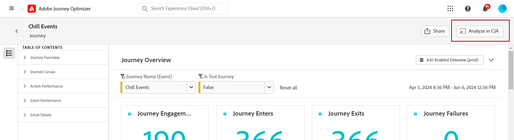

運用所有報表中提供的&#x200B;**[!DNL Customer Journey Analytics]**&#x200B;在CJA中分析&#x200B;**[!UICONTROL 功能，使用您的]**&#x200B;授權增強您的資料分析體驗。

這個功能強大的選項可順暢地將您重新導向至&#x200B;**[!DNL Customer Journey Analytics]**&#x200B;環境，讓您能夠廣泛個人化您的報告。 您可以使用專門的Customer Journey Analytics量度擴充您的Widget，將您的見解提升到全新的境界。

[進一步瞭解Customer Journey Analytics介面。](https://experienceleague.adobe.com/en/docs/analytics-platform/using/cja-overview/cja-getting-started)

## 定義報告期間 {#report-period}

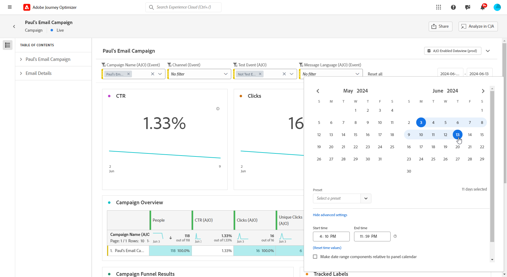

存取報表時，您可以套用位於報表右上角的時段篩選器。

依預設，行銷活動或歷程的篩選期間會設為其開始和結束日期。 如果沒有結束日期，則篩選器將預設為目前日期。

若要修改篩選器，您可以選取自訂開始日期和持續時間，或從預設集選項（例如上週或兩個月前）中選擇。

套用或修改篩選器後，報表將自動更新。

## 匯出您的報告 {#export-reports}

您可以輕鬆地將不同的報表匯出為PDF或CSV格式，以便共用或列印。 匯出報告的步驟會在以下標籤中詳細說明。

>[!BEGINTABS]

>[!TAB 將報表匯出為CSV檔案]

1. 從您的報表中，按一下「共用&#x200B;**[!UICONTROL 」]**&#x200B;並選取「下載CSV」****&#x200B;來產生整體報表層級的CSV檔案。

   

1. 您的檔案會自動下載，並位於您的本機檔案中。

   如果在報表層級產生檔案，檔案會包含每個Widget的詳細資訊，包括其標題和資料。

>[!TAB 將報表匯出為PDF檔案]

1. 從您的報表中，按一下[共用]****&#x200B;並選取[下載PDF]****。

   

1. 要求下載後，按一下&#x200B;**[!UICONTROL 下載]**。

   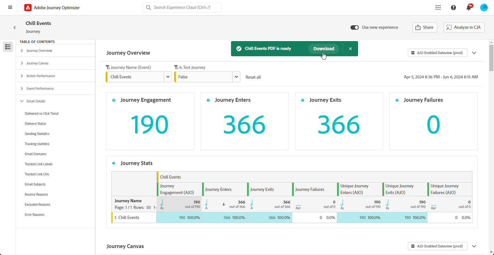

1. 您的檔案會自動在瀏覽器中開啟。

您的報告現在可以檢視、下載或共用pdf檔案。

>[!ENDTABS]

## 排程匯出 {#schedule-export}

**排程匯出**&#x200B;可讓您每週、每月或每年自動傳送最多10個報告。 您也可以透過更新、編輯、取消或刪除任何排程匯出的選項，輕鬆管理排程報告。

1. 在報表中，按一下[共用]，然後選取[排程匯出]。********。

   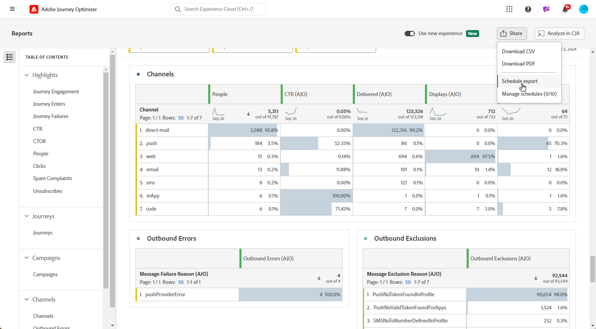

1. 在CSV和PDF之間選擇您的&#x200B;**[!UICONTROL 檔案型別]**。

1. 如有需要，您可以將&#x200B;**[!UICONTROL 描述]**&#x200B;新增至您的匯出。

1. 輸入將接收此自動傳遞的收件者名稱。

   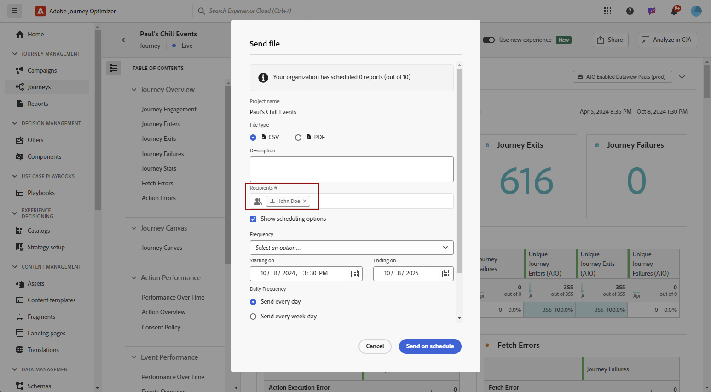

1. 選擇&#x200B;**[!UICONTROL 頻率]**。

1. 根據選取的頻率，提供相關的排程詳細資料，例如：

   * 開始和結束日期

   * 間隔（例如每幾週）

   * 一週中的特定日期

   * 該月內的周

   * 一個月中的日

   * 月份

1. 按一下&#x200B;**[!UICONTROL 依排程傳送]**。

1. 若要編輯先前建立的排程匯出，請按一下[共用] **[!UICONTROL ，然後選取[管理排程]]** **[!UICONTROL 。]**

   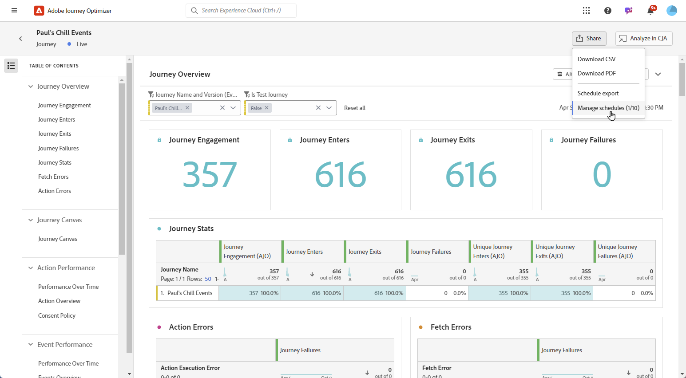

1. 從排程匯出清單中，選擇要更新的匯出專案，並進行必要的變更。

1. 若要刪除排程報告，請從Managed排程清單中選取一個排程報告，然後按一下&#x200B;**[!UICONTROL 刪除]**。

   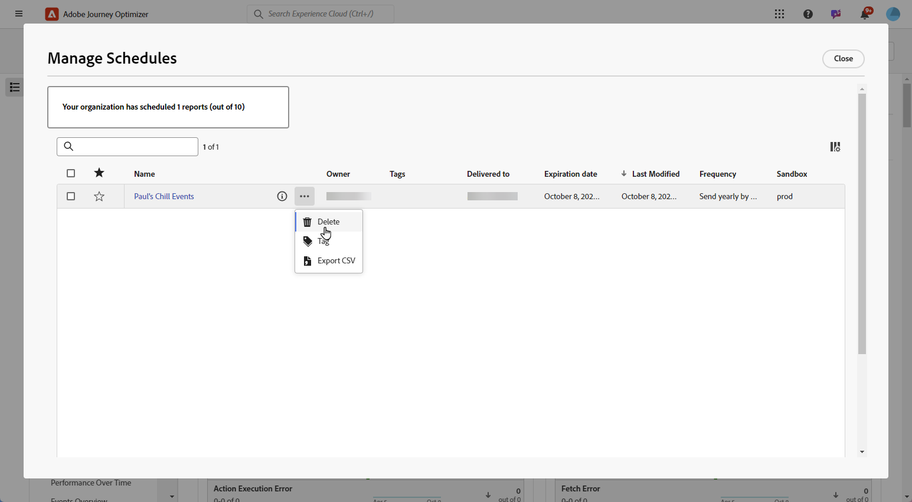

## 建立簡單量度 {#create-simple-metric}

您可以直接在報表中建立自訂計算量度。 您可以結合兩個現有量度，以符合您的特定報告需求，產生更量身打造的深入分析，並更好地分析資料。

1. 首先，存取您要新增量度的報表。

1. 在報表的表格中，按住`Shift`或`CTRL/CMD`鍵，同時按一下所需的量度，加以選取。 然後，按一下滑鼠右鍵並選取&#x200B;**[!UICONTROL 從選取專案建立量度]**。

   如果選取兩個以上的量度，量度產生器中只會使用前兩個量度。

   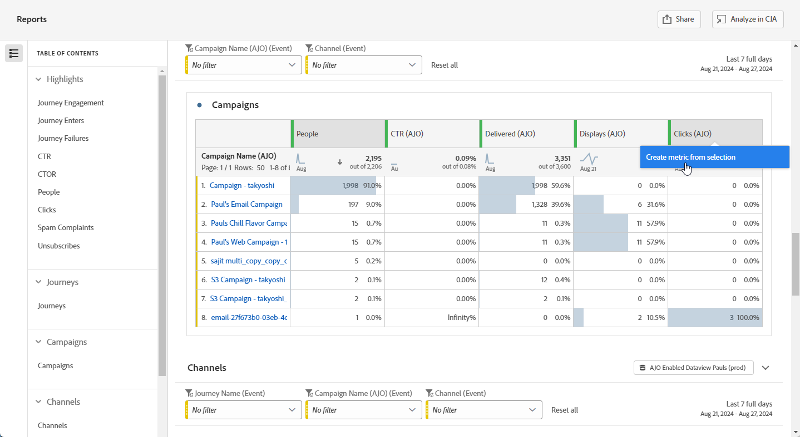

1. 在計算量度產生器中，輸入&#x200B;**[!UICONTROL 標題]**&#x200B;欄位以命名您的新量度。 您也可以新增&#x200B;**[!UICONTROL 描述]**。

   >[!NOTE]
   >
   >如果您擁有Customer Journey Analytics，則可使用其他選項進一步個人化您的量度。 [了解更多](https://experienceleague.adobe.com/en/docs/analytics-platform/using/cja-components/cja-calcmetrics/cm-workflow/cm-build-metrics#areas-of-the-calculated-metrics-builder)

1. 選擇適當的&#x200B;**[!UICONTROL 小數位數]**，並根據您希望量度的顯示方式，選取&#x200B;**[!UICONTROL 格式]** （小數、時間、百分比或貨幣）。

1. 選取將決定如何計算量度的運運算元，例如加、減、乘或除。

   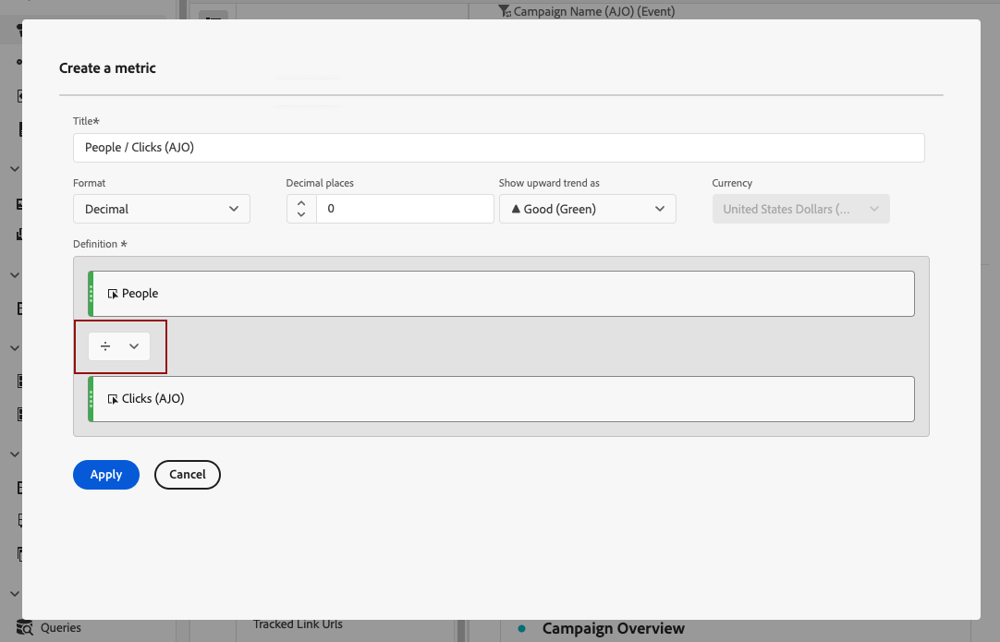

1. 您可以視需要重新排序元件。

1. 當您對設定感到滿意時，請按一下[套用] **[!UICONTROL 完成新量度。]**

1. 您的新量度會出現在報表中的原始量度旁。

   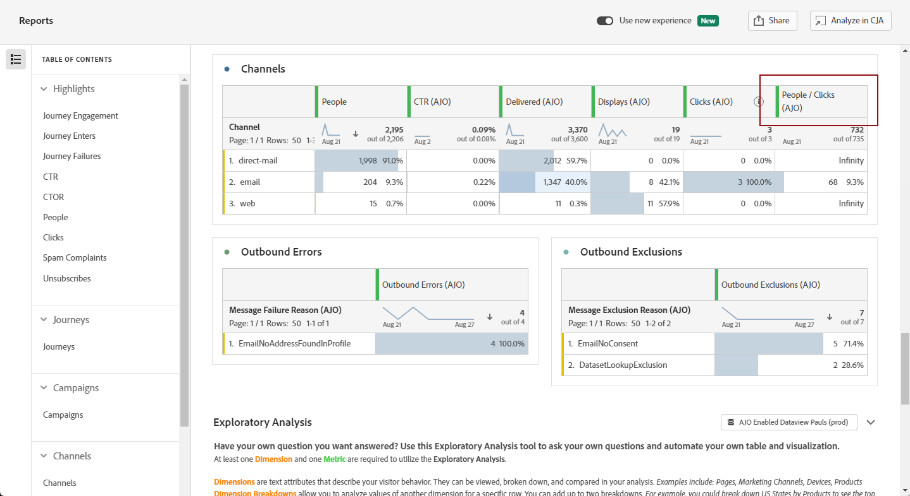

您將報表匯出為PDF或CSV時，新建立的量度將會包含在內。 不過，一旦您退出，系統就會將其從報表中移除。

## 使用Insight產生器探索資料 {#exploratory}

使用Insight產生器工具，從您選取的&#x200B;**[!UICONTROL 維度]**&#x200B;和&#x200B;**[!UICONTROL 量度]**&#x200B;輕鬆建立表格和視覺效果。 此工具可簡化資料探索，讓您輕鬆自動自訂和分析資訊。 深入瞭解[此檔案](https://experienceleague.adobe.com/en/docs/analytics/analyze/analysis-workspace/panels/quickinsight)。

1. 首先，存取您要使用Insight產生器的報表。

1. 從左側欄功能表選取Insight Builder功能表。

   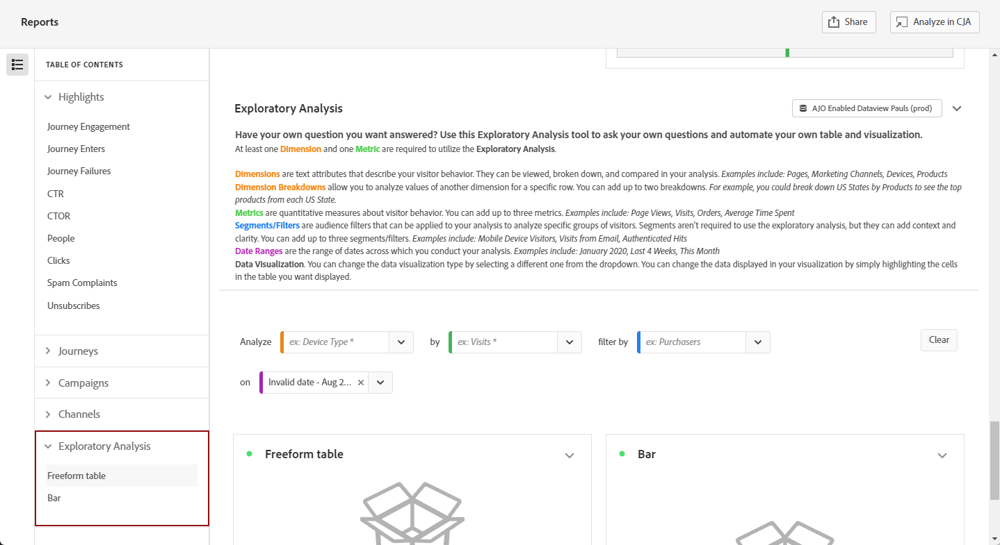

1. 使用下拉式功能表選擇&#x200B;**[!UICONTROL Dimension]**&#x200B;和&#x200B;**[!UICONTROL 量度]**，以建立查詢。 如有需要，您也可以選取&#x200B;**[!UICONTROL 區段]**。

   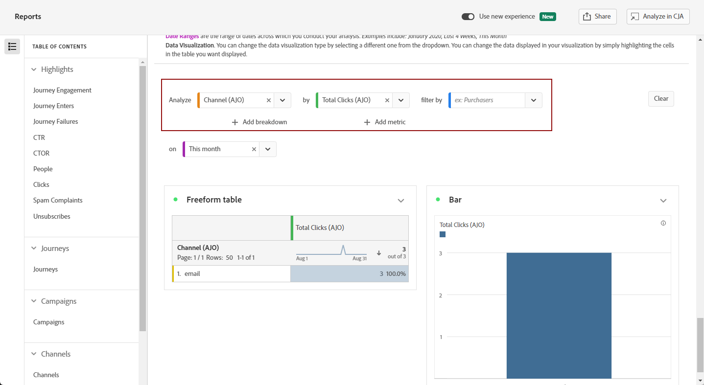

1. 定義分析的日期範圍，以指定您要專注的期間。 依預設，日期範圍將設為報表面板中使用的日期範圍。

1. 使用&#x200B;**[!UICONTROL 新增劃分]**&#x200B;或&#x200B;**[!UICONTROL 新增量度]**&#x200B;選項來包含其他維度，以允許更詳細的資料劃分。

   請注意，您最多只能新增三個&#x200B;**[!UICONTROL 維度]**、**[!UICONTROL 量度]**&#x200B;和&#x200B;**[!UICONTROL 區段]**。

您現在可以使用自訂表格和視覺化工具來分析資料。

<!--## Create a down-funnel metric {#down-funnel}

1. Create a new journey or open an existing one. [Learn more about journey creation](../building-journeys/journey-gs.md)

1. On the canvas editor, select the option to "add a metric".

c. In the metric selector, choose whichever conversion metric seems appropriate and publish your journey

d. Open the report for the journey that you added the metric to and ensure that the metric has been added to the table alongside all the other pre-configured metrics.
-->

## 從報表資料建立對象 {#create-audience}

>[!IMPORTANT]
>
>每個組織僅限發佈25個對象。 此外，使用者每小時最多可發佈5個對象，每天最多可發佈20個對象。
>> 一次性對象的生命週期為48小時。 因此，如果在該時間範圍內發佈25個對象，則僅在48小時期間過後才能發佈其他對象。

您現在可以選取表格中的特定資料，並從這些選取專案直接建立對象，以精簡及簡化對象建立流程。

1. 首先，導覽至包含您要轉換為對象之資料的報表表格。

1. 用滑鼠右鍵按一下所需的儲存格，然後選取&#x200B;**[!UICONTROL 建立對象]**。

   或者，您可以選取節點，然後按一下滑鼠右鍵，從&#x200B;**[!UICONTROL 歷程畫布]** Widget開始建立對象。

1. 在&#x200B;**[!UICONTROL 建立對象]**&#x200B;視窗中，輸入&#x200B;**[!UICONTROL 名稱]**，並為您計畫發佈的對象設定&#x200B;**[!UICONTROL 一次性日期範圍]**。

   >[!NOTE]
   >
   >如果您擁有Customer Journey Analytics，則可使用其他選項進一步個人化您的量度。 [了解更多](https://experienceleague.adobe.com/en/docs/analytics-platform/using/cja-components/audiences/publish)

   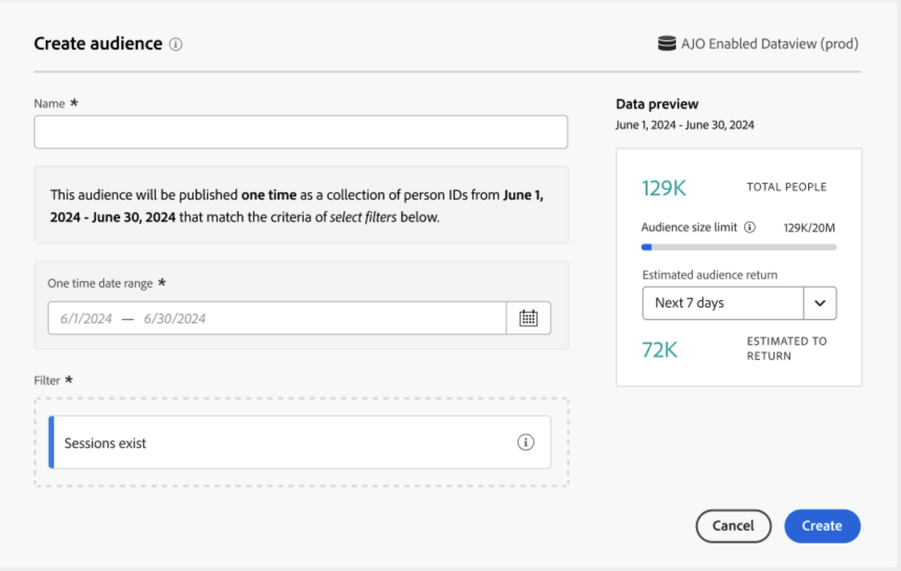

1. 按一下「**[!UICONTROL 建立]**」按鈕，完成建立對象。 請注意，此程式可能需要一些時間才能完成。

您現在可以繼續將新建立的對象用於歷程或行銷活動。

## 管理範本 {#cja-template}

>[!AVAILABILITY]
>
> **範本**&#x200B;功能會分階段逐步推出，預計於1月底全面推出，且僅供擁有[!DNL Customer Journey Analytics]授權的使用者使用。

您現可選擇運用客戶歷程分析範本來增強 Journey Optimizer 報告。[進一步瞭解Customer Journey Analytics範本](https://experienceleague.adobe.com/en/docs/analytics-platform/using/cja-workspace/templates/use-templates#use-reports)

存取報告時，您可以從&#x200B;**[!UICONTROL 選取範本]**&#x200B;下拉式清單中選擇兩種範本型別：

* Adobe提供的預設範本
* 客戶產生的範本

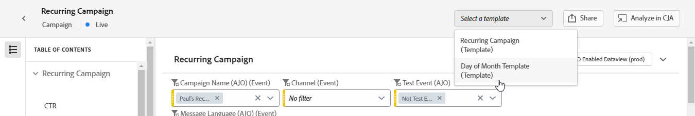

如果未建立範本，您的報表介面中就不會出現&#x200B;**[!UICONTROL 選取範本]**&#x200B;下拉式清單。

若要建立範本，請遵循下列步驟：

1. 在[!DNL Customer Journey Analytics]中，導覽至&#x200B;**[!UICONTROL Workspace]**&#x200B;功能表並選取&#x200B;**[!UICONTROL Adobe範本]**。 [進一步瞭解可用的範本](https://experienceleague.adobe.com/en/docs/analytics-platform/using/cja-workspace/templates/use-templates#available-templates)

1. 瀏覽可用的預先建立範本，然後按一下&#x200B;**[!UICONTROL 使用範本]**&#x200B;以選取一個範本。

   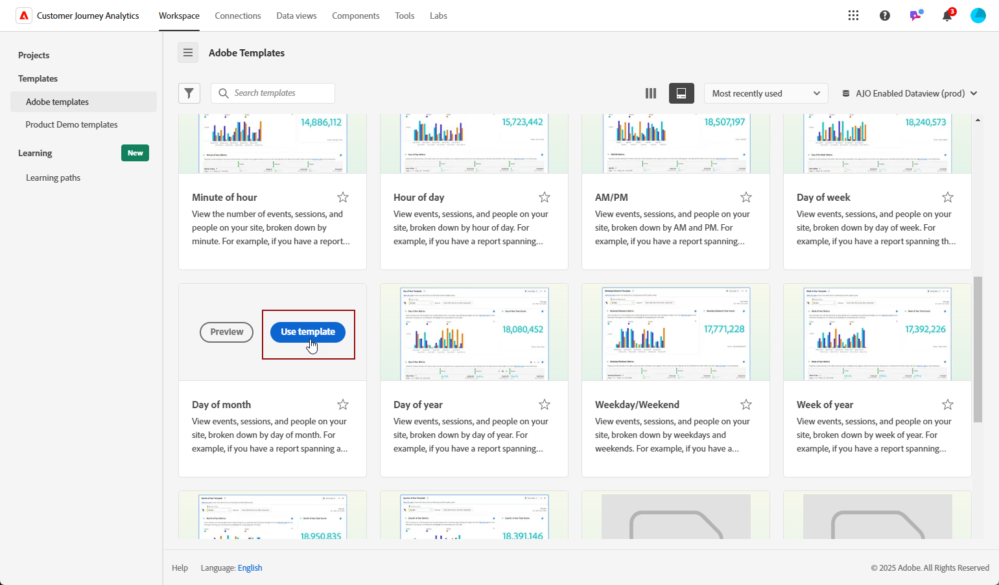

1. 調整您的報告以符合您的需求。 請參閱[Customer Journey Analytics檔案](https://experienceleague.adobe.com/en/docs/analytics-platform/using/cja-workspace/home)。

1. 完成自訂範本後，請存取&#x200B;**[!UICONTROL 專案]**&#x200B;功能表並選取&#x200B;**[!UICONTROL 另存為範本]**。

   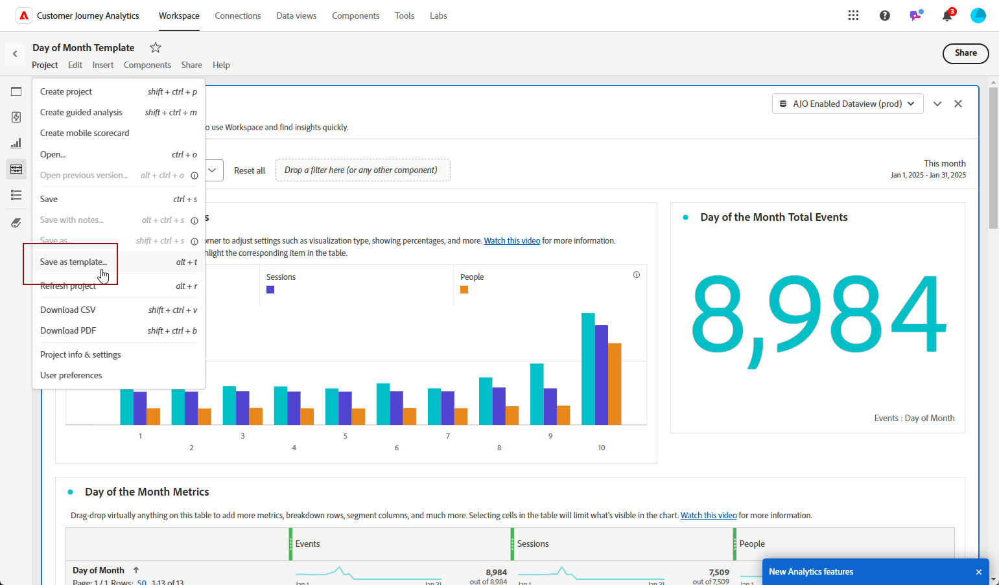

1. 提供範本的必要詳細資料。 如需詳細資訊，請參閱[Customer Journey Analytics檔案](https://experienceleague.adobe.com/en/docs/analytics-platform/using/cja-workspace/templates/create-templates#edit-or-delete-a-template)。

   >[!IMPORTANT]
   >
   > 請務必在&#x200B;**使用案例**&#x200B;下選擇&#x200B;**[!UICONTROL Journey Optimizer]**，並指定對應的&#x200B;**Journey Optimizer活動型別**&#x200B;和&#x200B;**活動**。 這可讓您的報表顯示在Journey Optimizer中。

   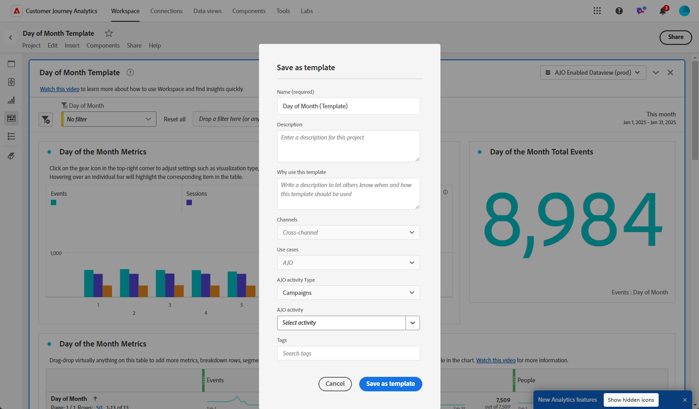

1. 在[!DNL Journey Optimizer]中，從您的報表存取您的報表，並從&#x200B;**[!UICONTROL 選取範本]**&#x200B;下拉式清單中選擇您先前建立的範本。

   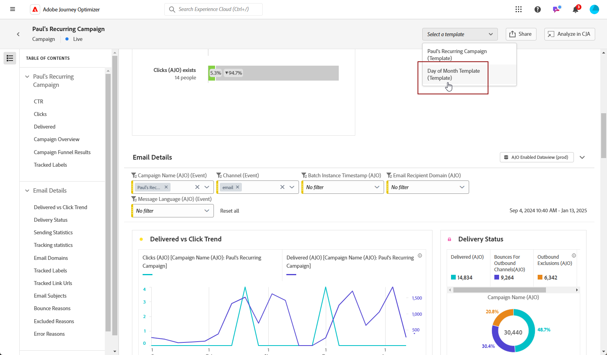

若要直接從Journey Optimizer報表建立範本，只要存取您的行銷活動或歷程報表，選取「**[!UICONTROL 在CJA中分析」]**，並依照上述步驟自訂預設範本。
