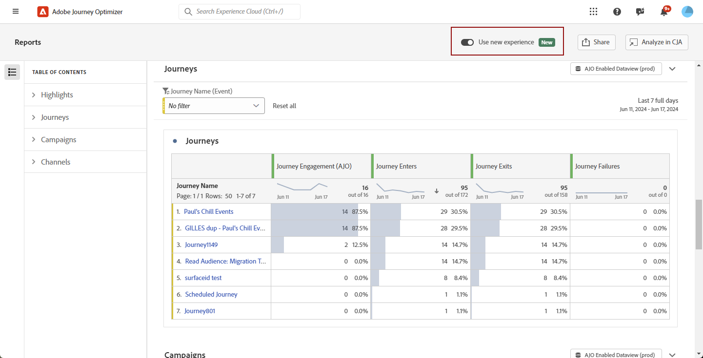

# 開始使用新的報告介面 {#channel-report-gs-cja}

>[!NOTE]
>
> 若要回覆成Journey Optimizer的傳統報表，只需將 **[!UICONTROL 使用新體驗]** 選項。

Journey Optimizer報告功能與Customer Journey Analytics功能的互通性得以改善、兩個平台的報告標準化，並改善資料一致性和可靠性。 Journey Optimizer 與 Customer Journey Analytics 之間的緊密整合可讓您更清楚檢視績效量度，讓使用者能做出更明智的決策。

* 如果您想在歷程內容中定位歷程或傳遞，請從 **[!UICONTROL 歷程]** 選單，存取您的歷程，然後按一下 **[!UICONTROL 檢視報告]** 按鈕。

  從現有歷程的清單中，您也可以選取 **[!UICONTROL 報告]** 從您所選歷程的進階功能表。 [進一步瞭解歷程報告](journey-global-report-cja.md)

  

* 如果您想要鎖定促銷活動，請從 **[!UICONTROL 行銷活動]** 選單，存取您的行銷活動，然後按一下 **[!UICONTROL 報表]** 按鈕。

  從現有行銷活動清單中，您也可以選取 **[!UICONTROL 報告]** 從您所選行銷活動的進階功能表。 [進一步瞭解行銷活動報告](campaign-global-report-cja.md)

  

* 如果您想要將環境中所有行銷活動和歷程的量度設為目標，請存取 **概觀** 報表：導覽至 **[!UICONTROL 報表]** 功能表中的 **[!UICONTROL 歷程管理]** 區段。 [進一步瞭解概述報告](channel-report-cja.md)

  

## 先決條件 {#prerequisites}

* 如果您有 **非** 自己的Customer Journey Analytics，或者如果您擁有資產但確實擁有 **非** 擁有任何Customer Journey Analytics產品設定檔的存取權，許可權是在Journey Optimizer中管理的。 在此情況下，您只需要 **[!UICONTROL 檢視管道報表]** 許可權或相關角色。 [進一步瞭解Journey Optimizer許可權](../administration/permissions.md)
* 如果您擁有Customer Journey Analytics並有權存取Customer Journey Analytics產品設定檔，則套用標準Customer Journey Analytics許可權。 Customer Journey Analytics管理員負責維護適當的使用者存取權。 [深入瞭解Customer Journey Analytics許可權](https://experienceleague.adobe.com/en/docs/analytics-platform/using/technotes/access-control)
* 您的Customer Journey Analytics資料檢視需要以下列設定進行設定： **在Adobe Journey Optimizer中設為預設資料檢視**. [進一步瞭解資料檢視](https://experienceleague.adobe.com/en/docs/analytics-platform/using/cja-dataviews/create-dataview)
* 若要存取Journey Optimizer中的Customer Journey Analytics控制面板，只需啟用 **[!UICONTROL 使用新體驗]** 在您的報告中切換。

  

## 操作說明影片{#video}

以下影片說明如何搭配Customer Journey Analytics使用增強的Journey Optimizer報表。

>[!VIDEO](https://video.tv.adobe.com/v/3430413)