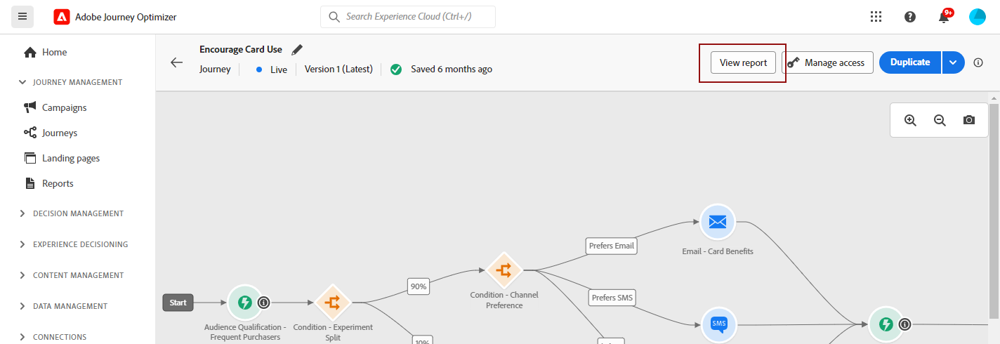
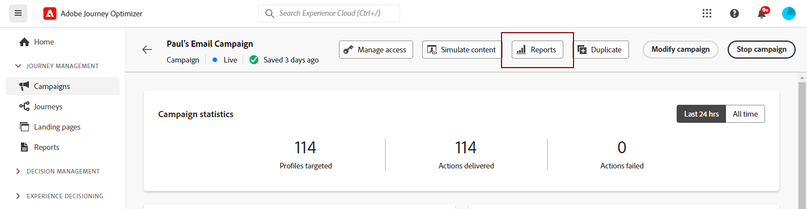
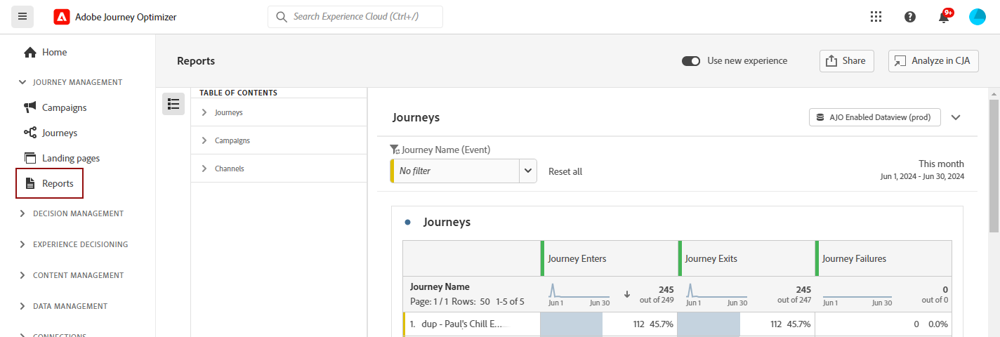

# 開始使用所有時間報告 {#channel-report-gs-cja}

>[!CONTEXTUALHELP]
>id="cja_connections_enable_cja"
>title="啟用 Customer Journey Analytics"
>abstract="若要在 Customer Journey Analytics 中分析這份報告，請聯絡您的管理員，確保您的組織已購買 Customer Journey Analytics 並且已經正確設定整合功能。"
>additional-url="https://experienceleague.adobe.com/zh-hant/docs/journey-optimizer/using/channels/email/design-email/add-content/content-components#add-content-components" text="Customer Journey Analytics"

Journey Optimizer 報告功能改善與 Customer Journey Analytics 功能的互通性，可將兩個平台間的報告標準化，並改善資料一致性與可靠性。Journey Optimizer 與 Customer Journey Analytics 之間緊密整合，讓您可以更清楚地檢視效能量度，讓使用者能做出更睿智的決策。

能否存取這些報表功能取決於內容與產品區域：

* **歷程** — 如果您想要在歷程內容中鎖定歷程或傳遞，請從&#x200B;**[!UICONTROL 歷程]**&#x200B;功能表存取您的歷程，然後按一下&#x200B;**[!UICONTROL 檢視報告]**&#x200B;按鈕。

  您也可以在現有歷程清單中，從所選歷程的進階功能表選取&#x200B;**[!UICONTROL 報表]**。 [進一步瞭解歷程報告](journey-global-report-cja.md)

  

* **行銷活動** — 如果您想要鎖定行銷活動，請從&#x200B;**[!UICONTROL 行銷活動]**&#x200B;功能表，存取您的行銷活動並按一下&#x200B;**[!UICONTROL 報表]**&#x200B;按鈕，然後&#x200B;**[!UICONTROL 檢視所有時間報表]**。

  從現有行銷活動的清單中，您也可以從所選行銷活動的進階功能表選取&#x200B;**[!UICONTROL 報表]**。 [進一步瞭解行銷活動報告](campaign-global-report-cja.md)

  

* **全域** — 如果您想要將您環境中所有行銷活動和歷程的量度設為目標，請導覽至&#x200B;**歷程管理**&#x200B;區段內的&#x200B;**[!UICONTROL 報表]**&#x200B;功能表，以存取&#x200B;**[!UICONTROL 概述]**&#x200B;報表。 [進一步瞭解概觀報告](channel-report-cja.md)

  

>[!IMPORTANT]
>
>Adobe Journey Optimizer中的報告目前標準化為UTC。 自訂報表時區的功能將在未來版本中推出。

## 先決條件 {#prerequisites}

* 如果您&#x200B;**沒有**&#x200B;擁有的Customer Journey Analytics，或如果您擁有它但&#x200B;**沒有**&#x200B;存取任何Customer Journey Analytics產品設定檔，許可權是在Journey Optimizer中進行管理。 在此情況下，您需要&#x200B;**[!UICONTROL 檢視管道報告]**&#x200B;許可權或相關角色。 [了解更多](../administration/permissions.md)

* 如果您&#x200B;**擁有** Customer Journey Analytics並有權存取Customer Journey Analytics產品設定檔，您需要：

   * Customer Journey Analytics的&#x200B;**[!UICONTROL 對象建立]**&#x200B;和&#x200B;**[!UICONTROL 對象檢視]**&#x200B;許可權。 [了解更多](https://experienceleague.adobe.com/zh-hant/docs/analytics-platform/using/technotes/access-control){target="_blank"}

   * **[!UICONTROL 管理Adobe Journey Optimizer的設定檔]**&#x200B;許可權。 [了解更多](../administration/permissions.md)

* 您的Customer Journey Analytics資料檢視需要以下列設定來設定： **在Adobe Journey Optimizer中設定為預設資料檢視**。 [進一步瞭解資料檢視](https://experienceleague.adobe.com/zh-hant/docs/analytics-platform/using/cja-dataviews/create-dataview){target="_blank"}

## 作法影片{#video}

以下影片說明如何搭配Customer Journey Analytics使用增強的Journey Optimizer報表。

>[!VIDEO](https://video.tv.adobe.com/v/3430413)