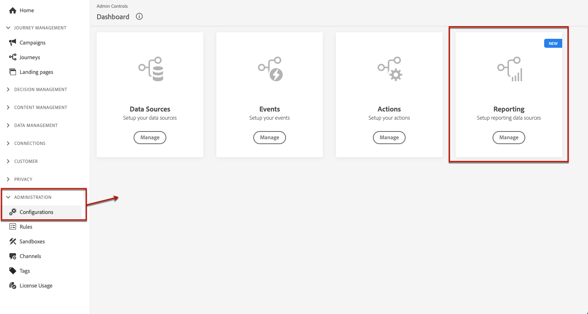

# 報告與實驗先決條件 {#reporting-configuration}

>[!CONTEXTUALHELP]
>id="ajo_admin_reporting_config"
>title="設定資料集以進行報告"
>abstract="報告設定可讓您擷取將在行銷活動報表中使用的其他量度。必須由技術使用者執行。"

>[!CONTEXTUALHELP]
>id="ajo_admin_reporting_dataset"
>title="選取資料集"
>abstract="您只能選取一個事件類型的資料集，該資料集必須至少包含一個受支援的欄位群組：應用程式詳細資訊、商務詳細資訊、Web 詳細資訊。"

>[!NOTE]
>
>報告設定必須由技術使用者執行。

資料來源設定可讓您定義系統連線，以擷取將用於報告的其他資訊。

對於此設定，您需要新增一個或多個包含您想用於報告的其他元素的資料集。 若要這麼做，請遵循以下[步驟](#add-datasets)。

請注意，針對網頁、程式碼型和應用程式內頻道，您必須確定針對資料收集所設定的[資料集](../data/get-started-datasets.md)也新增至此報告設定。 否則，網頁和應用程式內資料將不會顯示在內容實驗報表中。

## 先決條件

必須先建立該資料集，才能將資料集新增到報表設定。 在[Adobe Experience Platform檔案](https://experienceleague.adobe.com/docs/experience-platform/catalog/datasets/user-guide.html?lang=zh-Hant#create){target="_blank"}中進一步瞭解。

* 您只能新增事件型別資料集。

* 這些資料集必須包含`Experience Event - Proposition Interactions` [欄位群組](https://experienceleague.adobe.com/docs/experience-platform/xdm/tutorials/create-schema-ui.html?lang=zh-Hant#field-group){target="_blank"}。

* 這些資料集也可能包含下列[欄位群組](https://experienceleague.adobe.com/docs/experience-platform/xdm/tutorials/create-schema-ui.html?lang=zh-Hant#field-group){target="_blank"}之一： `Application Details`、`Commerce Details`、`Web Details`。

  >[!NOTE]
  >
  >可能還包括其他欄位群組，但Journey Optimizer報表中目前僅支援上述欄位群組。

  例如，如果您想要瞭解電子郵件行銷活動對商業資料（如購買或訂單）的影響，則需要建立體驗事件資料集`Commerce Details`欄位群組。

  同樣地，如果您想要報告行動互動，則需要建立體驗事件資料集`Application Details`欄位群組。

  <!--The metrics corresponding to each field group are listed [here](#objective-list).-->

* 您可以將這些欄位群組新增到一個或多個方案中，這些方案將用於一個或多個資料集。

>[!NOTE]
>
>在[XDM系統總覽檔案](https://experienceleague.adobe.com/docs/experience-platform/xdm/home.html?lang=zh-Hant){target="_blank"}中進一步瞭解XDM結構描述和欄位群組。

<!--
## Objectives corresponding to each field group {#objective-list}

The table below shows which metrics will be added to the **[!UICONTROL Objectives]** tab of your campaign reports for each field group.

| Field group | Objectives |
|--- |--- |
| Commerce Details | Price Total Payment Amount (Unique) Checkouts (Unique) Product List Adds (Unique) Product List Opens (Unique) Product List Removal (Unique) Product List Views (Unique) Product Views (Unique) Purchases (Unique) Save For Laters Product Price Total Product Quantity |
| Application Details | (Unique) App Launches First App Launches (Unique) App Installs (Unique) App Upgrades |
| Web Details | (Unique) Page Views |
-->

## 新增資料集 {#add-datasets}

>[!NOTE]
>
>任何新建立的資料集將只能在Customer Journey Analytics報表中使用。

1. 從&#x200B;**[!UICONTROL 管理]**&#x200B;功能表，選取&#x200B;**[!UICONTROL 組態]**。 在&#x200B;**[!UICONTROL 報表]**&#x200B;區段中，按一下&#x200B;**[!UICONTROL 管理]**。

   

   此時會顯示已新增的資料集清單。

1. 從&#x200B;**[!UICONTROL 資料集]**&#x200B;索引標籤，按一下&#x200B;**[!UICONTROL 新增資料集]**。

   

   >[!NOTE]
   >
   >如果您選取&#x200B;**[!UICONTROL 系統資料集]**&#x200B;標籤，則只會顯示系統建立的資料集。 您將無法新增其他資料集。

1. 從&#x200B;**[!UICONTROL 資料集]**&#x200B;下拉式清單中，選取您要用於報告的資料集。

   >[!CAUTION]
   >
   >您只能選取事件型別資料集，該資料集必須至少包含支援的[欄位群組](https://experienceleague.adobe.com/docs/experience-platform/xdm/tutorials/create-schema-ui.html?lang=zh-Hant#field-group){target="_blank"}之一： **應用程式詳細資料**、**Commerce詳細資料**、**網頁詳細資料**。 如果選取的資料集與這些條件不相符，將無法儲存變更。

   

   在[Adobe Experience Platform檔案](https://experienceleague.adobe.com/docs/experience-platform/catalog/datasets/overview.html?lang=zh-Hant){target="_blank"}中進一步瞭解資料集。

1. 從&#x200B;**[!UICONTROL 設定檔ID]**&#x200B;下拉式清單中，選取要用來識別報告中每個設定檔的資料集欄位屬性。

   

   >[!NOTE]
   >
   >只顯示可用於報告的 ID。

1. 預設會啟用&#x200B;**[!UICONTROL 使用主要ID名稱空間]**&#x200B;選項。 如果選取的&#x200B;**[!UICONTROL 設定檔識別碼]**&#x200B;是&#x200B;**[!UICONTROL 身分對應]**，您可以停用此選項，然後從顯示的下拉式清單中選擇另一個名稱空間。

   

   在[Adobe Experience Platform檔案](https://experienceleague.adobe.com/docs/experience-platform/identity/namespaces.html?lang=zh-Hant){target="_blank"}中進一步瞭解名稱空間。

1. 儲存變更以將選取資料集新增到報告設定清單。

   >[!CAUTION]
   >
   >如果選取了非事件類型的資料集，則無法繼續。

<!--
When building your campaign reports, you can now see the metrics corresponding to the field groups used in the datasets you added. Go to the **[!UICONTROL Objectives]** tab and select the metrics of your choice to better fine-tune your reports. [Learn more](content-experiment.md#objectives-global)

>[!NOTE]
>
>If you add several datasets, all data from all datasets will be available for reporting.

## How-to video {#video}

Understand how to configure Experience Platform reporting data sources.

>[!VIDEO]()
-->
