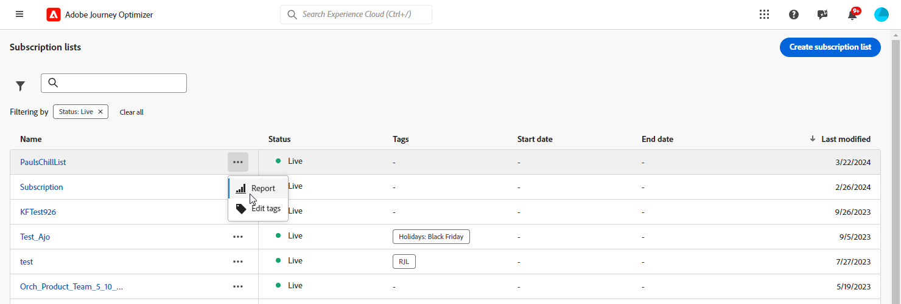
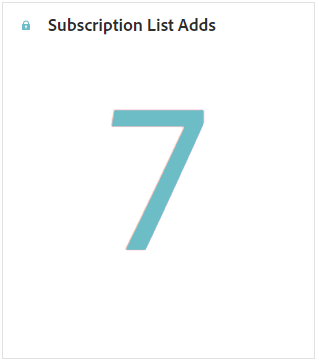
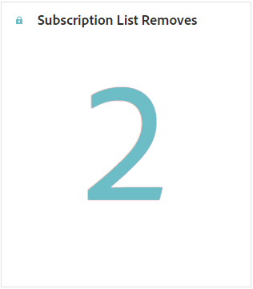
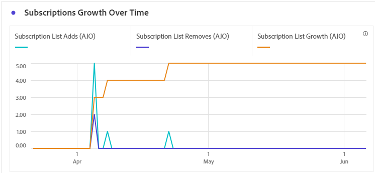
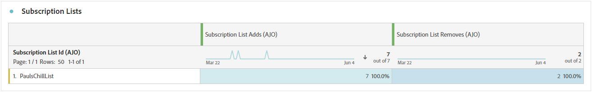
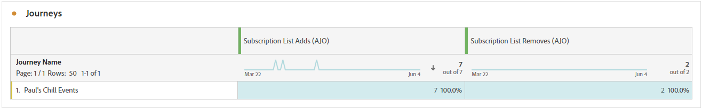
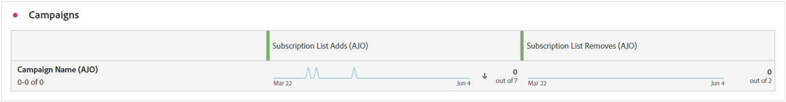
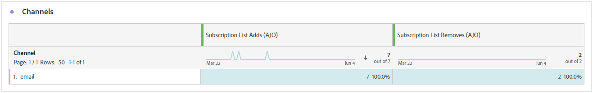

# 訂閱報告 {#subscription-report-global-cja}

**訂閱報告**&#x200B;可提供與特定清單相關的設定檔訂閱和取消訂閱的基本深入分析，協助您瞭解不同訂閱行銷活動和方案在提高參與度和轉換數方面的成效。

若要存取您的報表，請從進階功能表按一下您選取之訂閱清單的&#x200B;**[!UICONTROL 報表]**&#x200B;圖示。

若要進一步瞭解Customer Journey Analytics工作區以及如何篩選及分析資料，請參閱[此頁面](https://experienceleague.adobe.com/en/docs/analytics-platform/using/cja-workspace/home)。

## 訂閱清單新增

**[!UICONTROL 訂閱清單新增]** KPI提供指定期間所取得訂閱總數的完整概觀。 此量度著重於新訂閱者的成長與贏取，提供訂閱行銷活動或方案有效性的寶貴見解。

## 訂閱清單已移除

**[!UICONTROL 訂閱清單移除]** KPI提供指定期間發生的取消訂閱總數明細。 此量度提供訂閱者脫離參與的寶貴見解。

## 一段時間的訂閱成長

**[!UICONTROL 訂閱隨時間成長]**&#x200B;的圖表可透過視覺化方式呈現指定期間訂閱的進度，讓您清楚瞭解訂閱者基礎的演化。

* **[!UICONTROL 訂閱清單新增]**：相關期間的訂閱總數。

* **[!UICONTROL 訂閱清單移除]**：相關期間內的取消訂閱總數。

* **[!UICONTROL 訂閱清單成長率]**：特定期間訂閱者清單成長率。

## 訂閱清單

**[!UICONTROL 訂閱清單]**&#x200B;表格提供與特定訂閱清單關聯的設定檔訂閱和取消訂閱的重要深入分析。 此資訊可協助您瞭解不同訂閱清單在提高參與度和轉換率方面的成效。

* **[!UICONTROL 訂閱清單新增]**：相關期間的訂閱總數。

* **[!UICONTROL 訂閱清單移除]**：相關期間內的取消訂閱總數。

## 歷程

**[!UICONTROL 歷程]**&#x200B;表格提供廣闊的檢視範圍，呈現您訪客訂閱的複雜詳細資訊，作為其使用者歷程的一部分。

* **[!UICONTROL 訂閱清單新增]**：相關期間的訂閱總數。

* **[!UICONTROL 訂閱清單移除]**：相關期間內的取消訂閱總數。

## 行銷活動

**[!UICONTROL 行銷活動]**&#x200B;表格針對特定行銷活動所觸發的設定檔訂閱和取消訂閱，提供寶貴的深入分析。 此全方位檢視可讓您評估行銷活動的成效，並有效追蹤與登陸頁面內容的互動。

* **[!UICONTROL 訂閱清單新增]**：相關期間的訂閱總數。

* **[!UICONTROL 訂閱清單移除]**：相關期間內的取消訂閱總數。

## Channel

**[!UICONTROL 管道]**&#x200B;表格顯示依每個管道分類的設定檔訂閱和取消訂閱數目。

* **[!UICONTROL 訂閱清單新增]**：相關期間的訂閱總數。

* **[!UICONTROL 訂閱清單移除]**：相關期間內的取消訂閱總數。
