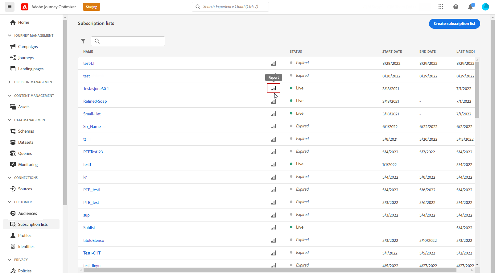

# 訂閱即時報表 {#subscription-report-live}

訂閱 **[!UICONTROL 即時報表]** 僅顯示過去24小時訂閱者的活動詳細資訊。 若要測量選定時段內的訂閱，請參閱 [訂閱全域報告](subscription-report-global.md).

若要存取您的報表，請按一下 **[!UICONTROL 報表]** 表徵圖。

訂閱 **[!UICONTROL 即時報表]** 會分為不同的小工具集，詳述您的訂閱和取消訂閱。 如有需要，可對每個介面工具集調整大小並加以刪除。 如需詳細資訊，請參閱 [節](live-report.md).

此 **[!UICONTROL 訂閱效能]** KPI與 **[!UICONTROL 依歷程的訂閱]**/**[!UICONTROL 依歷程取消訂閱]** 表格會詳細說明與訪客與著陸頁面的互動相關的主要資訊。 表格和KPI包含與您的登陸頁面相關的可用資料，例如：

* **[!UICONTROL 訂閱數]**:過去24小時內的訂閱總數。

* **[!UICONTROL 取消訂閱數]**:過去24小時內取消訂閱的總數。

此 **[!UICONTROL 訂閱效能]** 圖表顯示過去24小時內訂閱的演變。

此 **訂閱 — 劃分** 和 **取消訂閱 — 劃分** 圖形會根據訊息、登錄頁面和管道，代表過去24小時內訂閱或取消訂閱的總人數。
