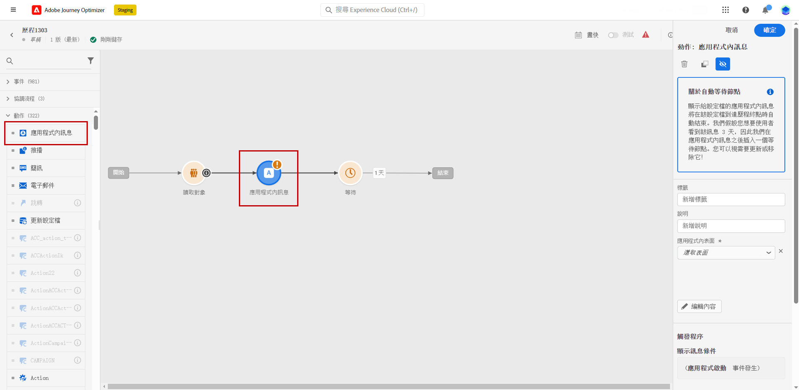

# 早期發行說明 {#e-release-notes}

[!DNL Adobe Journey Optimizer]持續提供新功能、現有功能的增強功能並修正錯誤。 所有變更都會在每月最後一週整合於[發行說明](release-notes.md)。

至發行日期之前，下方的搶先發行說明如有變更，恕不另行通知。 連結、畫面及更新的文件會在發行當日發佈於[發行說明](release-notes.md)。

## 2023年8月早期發行說明 {#aug-rn-2023}

**發行日期**： 2023年8月23至24日

### 新功能{#aug-2023-features}

此發行版本提供下列新功能。

<table>
<thead>
<tr>
<th><strong>在您的歷程中傳送應用程式內訊息</strong> </th>
</tr>
</thead>
<tbody>
<tr>
<td>

您現在可以在歷程中傳送個人化應用程式內訊息給應用程式使用者。 使用 Journey Optimizer 來設計通知並自訂訊息版面、顯示、文字及按鈕，以建立順暢的體驗。

如需詳細資訊，請參閱<a href="../in-app/get-started-in-app.md">詳細文件</a>。

</tr>
</tbody>
</table>

<table>
<thead>
<tr>
<th><strong>使用種子清單驗證您的電子郵件</strong> </th>
</tr>
</thead>
<tbody>
<tr>
<td>

您現在可以在Journey Optimizer中建立和管理種子清單。 種子清單包含測試電子郵件地址，您會先傳送電子郵件給測試對象，然後再傳送給實際對象。 使用此功能可監控所傳送的電子郵件復本，並確保所有顯示格式、URL、影像和連結正確無誤。

<!--p>For more information, refer to the <a href="../audience/get-started-audience-orchestration.md">detailed documentation</a>.</p-->
</td>
</tr>
</tbody>
</table>

<table>
<thead>
<tr>
<th><strong>使用內容助理產生文字和影像</strong> </th>
</tr>
</thead>
<tbody>
<tr>
<td>

在您建立並個人化訊息後，請使用內容助理將您的內容提升到新的境界。 您現在可以使用內容小幫手，透過實驗不同的主要標題和影像，將訊息的影響最佳化。 每個變體都會當作獨特的處理來管理，以便測量並比較哪個標題有效地產生更多點按。

此功能目前以私人測試版的形式提供。

<!--p>For more information, refer to the <a href="../start/search-filter-categorize.md#tags">detailed documentation</a>.</p-->
</td>
</tr>
</tbody>
</table>

### 改進項目 {#aug-2023-improvements}

此發行版本隨附下列改進項目。

**API**

提供新的API來建立和管理內容片段。 [了解更多](https://developer.adobe.com/journey-optimizer-apis/references/content-templates/#tag/Content-fragment-API){target="_blank"}.

**電子郵件頻道**

* 電子郵件介面設定中有新選項可用，可在交易式訊息對象中包含由於垃圾郵件投訴而抑制的電子郵件地址。 即使他們將行銷訊息標示為垃圾訊息，這些設定檔隨後仍可接收交易式訊息，例如密碼重設或帳戶陳述。 此選項預設為停用。

**歷程**

* 您現在可以在自訂動作中運用 API 呼叫回應，並根據這些回應精心安排您的歷程。
* 已引進新類型的系統警報。 您現在可以在自訂動作失敗時收到通知。

**直接郵件**

* 支援Azure Blob作為路由目的地。
* 支援「&amp;」做為自訂分隔符號。