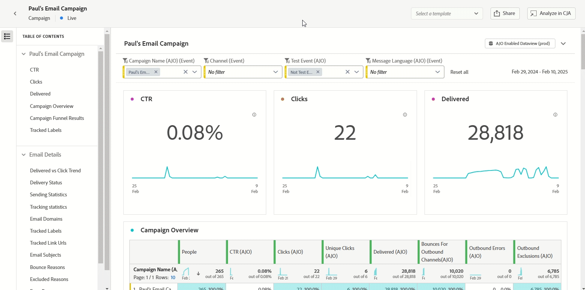

# 早期發行說明 {#e-release-notes}

[!DNL Adobe Journey Optimizer]持續提供新功能、現有功能的增強功能並修正錯誤。 所有變更都會在每月底整合於[發行說明](release-notes.md)。

**至發行日期之前，下方早期發行說明如有變更，恕不另行通知**。 連結、畫面及更新的文件會在發行當日發佈於[發行說明](release-notes.md)。

## 2025年2月搶先發行 {#25-02-rn}

### 全新功能 {#25-02-features}

此版本隨附的新功能詳述如下。

<table>
<thead>
<tr>
<th><strong>業務規則</strong> </th>
</tr>
</thead>
<tbody>
<tr>
<td>

您現在可以使用規則集建立商業規則。 規則集是規則群組，可協助您限制行銷活動中傳送的訊息和跨管道的歷程動作，並控制歷程中的設定檔專案。

<ul><li>建立管道規則集，以限制跨一或多個管道傳送的訊息數。 將它們套用至行銷活動或歷程動作，以強制執行規則集中定義的規則。 管道規則集可讓您根據通訊型別套用上限規則。 例如，設定規則集以限制「促銷訊息」，並針對「電子報」設定另一個規則集。 根據您傳送的通訊型別，在您的行銷活動或歷程動作中套用適當的規則集。</li>
<li> 建立歷程規則集以控制設定檔專案進入歷程。 限制設定檔在指定期間內輸入歷程的頻率，或設定檔可同時註冊的歷程數。 在歷程層級套用這些專案，以確保適當的進入管理。</li>

先前可供一組組織(LA)使用的商業規則，現在可供所有使用者使用(GA)。

<!--p>For more information, refer to the <a href="../configuration/business-rules.md">detailed documentation</a>.</p-->
</td>
</tr>
</tbody>
</table>

<table>
<thead>
<tr>
<th><strong>SMS的多區域支援</strong> </th>
</tr>
</thead>
<tbody>
<tr>
<td>

您現在可以透過覆寫傳送、回饋、傳入和回呼URL來管理來自多區域端點的SMS訊息傳送。 為了支援此功能，已在API認證設定中新增欄位覆寫URL。 此變更僅適用於Sinch提供者。

<!--p>For more information, refer to the <a href="../configuration/business-rules.md">detailed documentation</a>.</p-->
</td>
</tr>
</tbody>
</table>

<table>
<thead>
<tr>
<th><strong>客戶歷程分析範本</strong> </th>
</tr>
</thead>
<tbody>
<tr>
<td>

您現可選擇運用客戶歷程分析範本來增強 Journey Optimizer 報告。這項新功能可讓您透過根據分析需求量身打造的預先設計範本，來簡化報告流程。

如需詳細資訊，請參閱<a href="../reports/report-cja-manage.md#cja-template">詳細文件</a>。

可用日期：自2025年1月15日起

</tr>
</tbody>
</table>

<table>
<thead>
<tr>
<th><strong>彈性的對象評估（可用性限制）</strong> </th>
</tr>
</thead>
<tbody>
<tr>
<td>

彈性的受眾評估可讓您視需求針對選取的受眾執行細分工作，確保在將受眾鎖定目標至Journey Optimizer歷程和行銷活動之前，您始終擁有最新的受眾資料。

如需詳細資訊，請參閱<a href="../audience/about-audiences.md#flexible">詳細文件</a>。

 彈性的對象評估僅適用於一組組織（可用性限制）。 若要取得存取權，請和您的 Adobe 代表聯絡。

推出日期：2025年1月28日

</tr>
</tbody>
</table>

### 改進項目 {#25-02-improvements}

以下改良功能隨2月更新提供。

* **資料集存留時間(TTL)** — 從本月開始，存留時間(TTL)護欄將推出至新沙箱和新組織中的Journey Optimizer系統產生的資料集，如下所示：

   * 輪廓存放區中的資料為 90 天
   * 資料湖中的資料為 13 個月

  此變更將在後續階段中推出至現有客戶沙箱。

* **教戰手冊** — 您現在可以在Journey Optimizer中建立並發佈自己的使用案例教戰手冊。

* **直接郵件** - DLZ （DAta登陸區域）現在支援作為直接郵件設定中檔案路由的伺服器型別。

**電子郵件組態** — 推出日期： 2025年2月12日

* 如果您在Adobe外部管理同意，您現在可以設定自訂取消訂閱電子郵件地址和自訂一鍵取消訂閱URL，作為電子郵件通道組態設定的一部分。 [瞭解詳情](../email/list-unsubscribe.md#custom-managed)

  {width="80%"}

  >[!AVAILABILITY]
  >
  >此功能以有限可用性 (LA) 形式向一小部分客戶發布。

**決策** — 推出日期： 2025年1月28日

* 編輯專案目錄的結構描述時，決策功能現在支援物件資料型別。 [閱讀全文](../experience-decisioning/catalogs.md)

**Personalization** — 推出日期： 2025年1月29日

* 新的日期/時間協助程式功能可用於個人化編輯器。 [閱讀全文](../personalization/functions/dates.md)