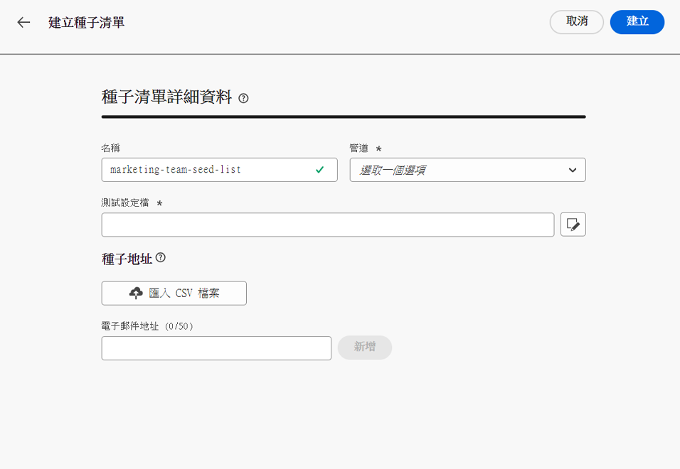

# 早期發行說明 {#e-release-notes}

[!DNL Adobe Journey Optimizer]持續提供新功能、現有功能的增強功能並修正錯誤。 所有變更都會在每月最後一週整合於[發行說明](release-notes.md)。

至發行日期之前，下方的搶先發行說明如有變更，恕不另行通知。 連結、畫面及更新的文件會在發行當日發佈於[發行說明](release-notes.md)。

## 2023 年 8 月搶先發行說明 {#aug-rn-2023}

**發行日期**：2023 年 8 月 23-24 日

### 新功能{#aug-2023-features}

此發行版本提供下列新功能。

<table>
<thead>
<tr>
<th><strong>在歷程中傳送應用程式內訊息</strong> </th>
</tr>
</thead>
<tbody>
<tr>
<td>

您現在可以在歷程中將個人化的應用程式內訊息傳送給應用程式使用者。 使用 Journey Optimizer 來設計通知並自訂訊息版面、顯示、文字及按鈕，以建立順暢的體驗。

如需詳細資訊，請參閱<a href="../in-app/get-started-in-app.md">詳細文件</a>。

</tr>
</tbody>
</table>

<table>
<thead>
<tr>
<th><strong>使用種子清單驗證電子郵件</strong> </th>
</tr>
</thead>
<tbody>
<tr>
<td>

現在您可在 Journey Optimizer 中建立和管理種子清單。 種子清單包含內部地址 (可以新增到實際對象) 並在傳送執行時收到與目標設定檔完全相同的訊息。 使用此功能可監視所傳送的通訊，並確保所有顯示格式、URL、影像和連結均正確無誤。

<!--p>For more information, refer to the <a href="../audience/get-started-audience-orchestration.md">detailed documentation</a>.</p-->
</td>
</tr>
</tbody>
</table>

<!--table>
<thead>
<tr>
<th><strong>Generate text and images with the Content assistant</strong> </th>
</tr>
</thead>
<tbody>
<tr>
<td>

Once you have created and personalized your message, take your content to the next level with the Content assistant. You can now use the Content assistant to optimize your message's impact by experimenting with different main titles, and images. Each variant is managed as a unique Treatment, to measure and compare which title effectively generates more clicks.

This capability is currently available as a private beta.

For more information, refer to the <a href="../start/search-filter-categorize.md#tags">detailed documentation</a>.

</td>
</tr>
</tbody>
</table-->

### 改進項目 {#aug-2023-improvements}

此發行版本隨附下列改進項目。

**API**

現已提供新的 API 來建立和管理內容片段。 [了解更多](https://developer.adobe.com/journey-optimizer-apis/references/content-templates/#tag/Content-fragment-API){target="_blank"}.

**電子郵件頻道**

電子郵件介面設定中提供的新選項，可在異動訊息對象中納入因垃圾訊息申訴而遭到抑制的電子郵件地址。 即使這些設定檔將行銷訊息標記為垃圾訊息，其隨後仍可收到異動訊息，例如密碼重設或帳戶聲明。 此選項預設為停用。

**歷程**

* 您現在可以在自訂動作中運用 API 呼叫回應，並根據這些回應精心安排您的歷程。此功能目前以 Private Beta 的形式提供。
<!--* A new type of system alert has been introduced. You can now get notified when a custom action fails.
* When duplicating a journey, you can now define the name of the journey copy.-->

**直接郵件**

* 現在可以在檔案路由設定中選取 Azure 作為伺服器型別。 
* ＆ 現在可作為直接郵件表面設定中的欄分隔符號欄位使用。 