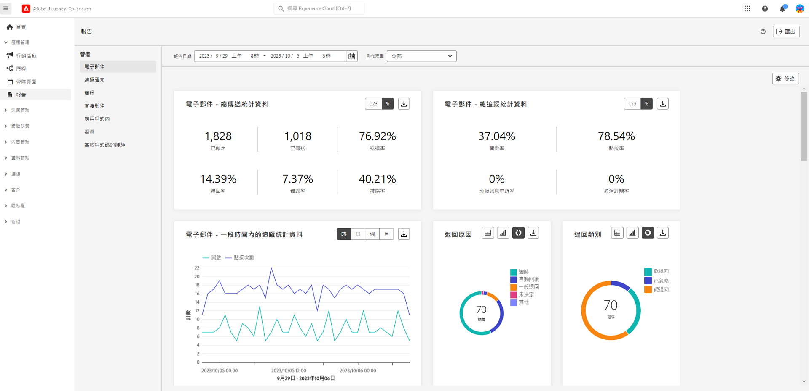

# 早期發行說明 {#e-release-notes}

[!DNL Adobe Journey Optimizer]持續提供新功能、現有功能的增強功能並修正錯誤。 所有變更都會在每月最後一週整合於[發行說明](release-notes.md)。

至發行日期之前，下方的搶先發行說明如有變更，恕不另行通知。 連結、畫面及更新的文件會在發行當日發佈於[發行說明](release-notes.md)。

## 2023 年 9 月搶先發行說明 {#sept-rn-2023}

**發行日期**：2023 年 9 月 26 日至 27 日

### 新功能{#sept-2023-features}

此發行版本提供下列新功能。

<table>
<thead>
<tr>
<th><strong>合併的頻道報告</strong> </th>
</tr>
</thead>
<tbody>
<tr>
<td>

頻道報告功能為分析師和行銷人員提供頻道層級流量和參與量度的全面概觀。 若要存取「報告」功能表，您必須擁有「檢視頻道報表」權限。

<!--p>For more information, refer to the <a href="../in-app/get-started-in-app.md">detailed documentation</a>.</p-->
</tr>
</tbody>
</table>

<table>
<thead>
<tr>
<th><strong>資料集匯出目的地 (GA)</strong> </th>
</tr>
</thead>
<tbody>
<tr>
<td>

現已正式推出將 Journey Optimizer 資料集匯出至雲端儲存空間目的地的功能。 此功能可讓您與雲端儲存空間位置建立即時連線，以匯出資料集的內容。 

<!--p>For more information, refer to the <a href="../audience/get-started-audience-orchestration.md">detailed documentation</a>.</p-->
</td>
</tr>
</tbody>
</table>

<table>
<thead>
<tr>
<th><strong>每個沙箱行動應用程式認證儲存</strong> </th>
</tr>
</thead>
<tbody>
<tr>
<td>

這項新功能可讓您輕鬆管理推播認證，並將其與應用程式介面中的專用沙箱建立關聯。

如需詳細資訊，請參閱<a href="../in-app/inapp-configuration.md">詳細文件</a>。

</tr>
</tbody>
</table>

<table>
<thead>
<tr>
<th><strong>計算屬性</strong> </th>
</tr>
</thead>
<tbody>
<tr>
<td>

計算屬性可讓您透過直覺式使用者介面，輕鬆地將事件資料總結為設定檔屬性，以增強行為型細分、個人化和啟用。 透過此功能，您可以自助建立計算屬性、管理這些屬性，並用於細分、即時客戶設定檔目的地或 Journey Optimizer。  
此外，計算屬性可簡化細分和歷程工作流程，協助您順暢地提供相關體驗。 在<a href="https://experienceleague.adobe.com/docs/experience-platform/profile/computed-attributes/overview.html?lang=zh-Hant">詳細文件</a>中了解更多相關資訊。

</tr>
</tbody>
</table>

### 改進項目 {#sept-2023-improvements}

此發行版本隨附下列改進項目。

<!--**Audiences**

* You can now target audiences uploaded from a CSV file into journeys and campaigns.
* You can now target audiences resulting from composition workflows into journeys. -->

**個人化**

* 除了視覺化片段之外，現在還可以透過運算式編輯器從 Journey Optimizer 介面建立、儲存及重複使用運算式片段。 運算式片段會取代先前儲存的運算式。

**警示**

* 已引進新類型的系統警示。現在您可以在讀取對象失敗時收到通知。

**網路頻道**

* 單頁應用程式 (SPA) 現在可以在網頁設計工具的視覺化編輯器中製作，這可讓您選取要對哪些特定檢視套用網頁修改。 檢視可定義為整個網站或網站上一組視覺化元素，例如首頁、整個產品網站或所有結帳頁面上的傳遞偏好設定框架。 若要在 SPA 上建立和執行 Adobe Journey Optimizer 網路行銷活動，需要進行一次性開發人員設定，以定義 Adobe Experience Platform Web SDK 實施中的檢視。

* 使用網頁設計工具編輯頁面時，目前不需從設計工具介面選取元件並加以編輯，您可以直接從&#x200B;**修改**&#x200B;窗格將新的變更新增至內容。
* 設定網頁子網域時，除了使用已委派給 Adobe 的子網域外，您目前可以選擇新增自己的子網域。

**歷程**

* 自訂動作回應的支援現已全面推出。 這可讓您在自訂動作中運用 API 呼叫回應，並根據這些回應協調歷程。此外，已新增護欄，所有自訂動作均以每個端點每秒 5000 次呼叫為限。
* 複製歷程時，您目前可以定義歷程副本的名稱。

<!--
* The maximum duration that you can define in the Wait activity is now 29 days instead of 30.
-->

**電子郵件頻道**

電子郵件介面設定中的新選項可讓您選擇將交易型郵件傳送至設定檔，即使其電子郵件地址在 Adobe Journey Optimizer 禁止清單中亦然。

**簡訊頻道**

**選擇加入訊息**&#x200B;和&#x200B;**說明訊息**&#x200B;這兩個新欄位已新增至 API 設定畫面，可讓使用者自訂傳入關鍵字的回應。 請注意，這僅適用於 Sinch 簡訊提供者。

**報告**

您現在可以將 Journey Optimizer 報告匯出為 CSV 檔案。[了解更多](../reports/global-report.md#export-reports)

<!--**Decision management**

Enhancements have been made to the audience picker in journeys or campaigns, with the addition of new columns displaying the origin and update frequency of audiences.    -->
