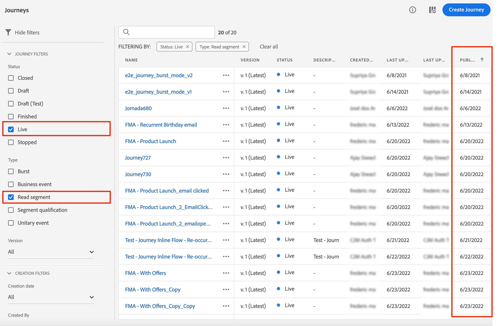
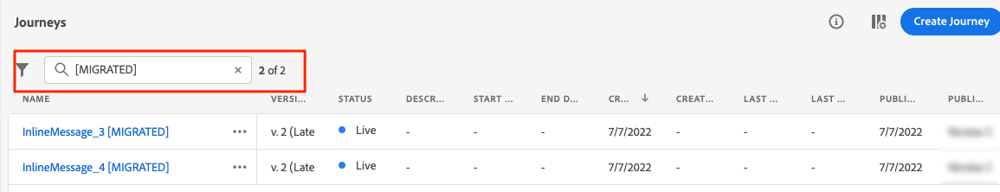

# 內聯創作遷移步驟{#migration-steps}

本文介紹了在Adobe Journey Optimizer創作內容的新過程 [頁](../rn/inline-messages.md)。 將為您執行自動轉換歷程。 話雖如此，我們需要你協助幾個步驟。 

>[!VIDEO](https://video.tv.adobe.com/v/344699)

以下是主要階段和步驟：

**[遷移前](../rn/inline-messages-steps.md#migration-step-1)**

1. 在非生產沙盒上，停止所有實況和關閉的旅程。 [閱讀全文](../rn/inline-messages-steps.md#migration-step-1-1)
1. 在生產沙箱上，停止所有即時即席行程，而不保留配置檔案。 [閱讀全文](../rn/inline-messages-steps.md#migration-step-1-2)

**[在第一次迭代之後](../rn/inline-messages-steps.md#migration-step-2)**

1. 檢查遷移的即時旅程中是否存在任何錯誤。 [閱讀全文](../rn/inline-messages-steps.md#migration-step-2-1)
1. 列出由遷移建立的所有新版本。 [閱讀全文](../rn/inline-messages-steps.md#migration-step-2-2)
1. Test，一個一個地出版。 [閱讀全文](../rn/inline-messages-steps.md#migration-step-2-3)
1. 列出所有即時版本。 [閱讀全文](../rn/inline-messages-steps.md#migration-step-2-4)
1. 檢查遷移的草稿版本上的錯誤。 [閱讀全文](../rn/inline-messages-steps.md#migration-step-2-5)

**[在第二次迭代之後](../rn/inline-messages-steps.md#migration-step-3)**

1. 檢查兩個遷移階段。 [閱讀全文](../rn/inline-messages-steps.md#migration-step-3-1)
1. 停止以前的版本。 [閱讀全文](../rn/inline-messages-steps.md#migration-step-3-2)

**[第三次和上次迭代之前](../rn/inline-messages-steps.md#migration-step-4)**

驗證所有內容在棄用之前已遷移。

 

## 移徙前（7月25日）{#migration-step-1}

### 1。停止所有即時和封閉的旅程{#migration-step-1-1}

開 **非生產沙箱**，停止所有實況和關閉的旅程。 這使自動遷移過程能夠從這些沙箱中遷移所有行程，而無需您執行任何操作。 遷移後，您將能夠複製已停止的行程版本並使用它們。

### 2.停止所有即時即席旅程，而不保留配置檔案{#migration-step-1-2}

在 **生產沙盒**，停止所有不再包含配置檔案的即時即席行程。

+++如何查找這些旅程？

要查找這些旅程，請導航到 **旅程** 菜單並過濾「狀態=活動」和「類型=讀取段」上的清單。 您還可以按時間順序訂購從最早到最晚「已發佈」日期的旅程。

從上到下開啟。

* 檢查旅途是否有消息。
* 看看它們不是經常的旅行。 這些不是臨時的。 你最想讓他們活下去。 例如，這一次是一次反複的旅行（而非臨時旅行）:

   

* 如果在這些行程中使用了等待或事件偵聽器，則配置檔案可能仍位於其中。 查看行程執行日期，並添加您在等待或事件偵聽器中定義的任何小時/天，以推斷當沒有配置檔案保留時的實際日期。 如果那天已經過去了，你可以停止這趟旅程。 否則，此行程在行程執行日期後30天自動移至「已完成」狀態。

+++

**重要備註**

* 避免在遷移日期（7月25日）前結束旅程。 知道遷移指令碼不會遷移即時或已結束的行程，因此限制生產沙箱中已結束的行程的次數將限制遷移後所需的手動操作數。

* 如果您有非最新版本的即時行程，則表示您在草稿中建立了另一個行程版本、發佈或刪除它。

* 如果您有未在行程中使用且要保留的消息，請將其另存為模板。 請參閱此 [頁](../design/email-templates.md#save-as-template)。 請注意，在棄用之前，您仍可以訪問它們。

## 遷移第一次迭代後（7月25日）{#migration-step-2}

遷移按兩個階段進行排序：自動化階段（7月25日至7月26日夜間）和手動階段（7月26日起），需要採取行動。

有關自動化階段，請參閱 [頁](../rn/inline-messages.md#process)。 對於手動階段，以下是要對 **生產沙盒**:

<!--
_On non-production sandboxes:_

**1. Check the migration status report for any error**

Click the **Check status** button in the top banner and check that there has been no error during the automatic migration and that there is nothing left to migrate. 

Look for the "ERROR" status. 

* If there is no error, you are good to go.
* If there are errors, look for the error by searching "errorMessage". The following error is expected as migration of multi-channel messages is not supported: "Migration of multi-channel messages is not supported". You will have to rebuild this journey.

    

_On the production sandbox:_

-->

### 1。檢查遷移的即時旅程中是否有錯誤{#migration-step-2-1}

在狀態報告中檢查自動遷移的即時行程上是否有錯誤([瞭解更多](../rn/inline-messages.md#status)。 按一下 **檢查狀態** 按鈕。

查找「ERROR_NEW_VERSION_CREATION」：

* 如果沒有錯誤，則表示已處理所有需要遷移的即時行程版本，並且已自動建立新的遷移草稿版本。

* 如果您看到錯誤，可以搜索「errorMessage」並檢查日誌中的錯誤消息。 不遷移多通道消息。 你必須創造另一段旅程。

   

* 有關其他錯誤，請與您的CSM或任何Adobe代表聯繫以獲得指導。

### 2.列出遷移建立的所有新版本{#migration-step-2-2}

它們被標籤為 [已遷移] 在行程標籤和建立日期中更新。

### 3.Test並逐個發佈{#migration-step-2-3}

確保旅途仍需在生產中運行。 如果 [遷移前準備](../rn/inline-messages-steps.md#migration-step-1) 未正確執行，您可以為一次性行程建立一個新版本，而這已不再需要。

Test您現在包含內聯渠道操作的旅程的草稿版本。

發佈您的新旅程版本。 您以前的即時版本隨後將移到「已關閉」狀態。

### 4.列出所有即時版本{#migration-step-2-4}

它們都應被標籤為最新。 否則，查找較新版本，test並發佈。

### 5.檢查遷移的草稿版本上的錯誤 {#migration-step-2-5}

按一下 **檢查狀態** 按鈕([瞭解更多](../rn/inline-messages.md#status) 並檢查自動遷移期間是否沒有錯誤，以及是否沒有剩餘的可遷移內容。 請注意，任何出錯行程（含消息）將在9月5日之後（在所有沙箱上）被棄用。

查找「錯誤」狀態。

* 如果沒有錯誤，你可以走了。

* 如果有錯誤，請通過搜索&quot;errorMessage&quot;查找錯誤。 由於不支援多通道消息的遷移，應出現以下錯誤：&quot;不支援多通道消息的遷移&quot;。 你必須重建這段旅程。

## 第二次迭代（8月1日）後{#migration-step-3}

第二次迭代發生在8月1日至8月2日的夜間。

<!--
_On non-production sandboxes:_

**1. Check at the status report**

Click the **Check status** button in the top banner and check that all journeys have been migrated and there's nothing left to migrate. If there is an error or something left to migrate, please reach out to your CSM or Adobe representative for guidance.

-->

如果已及時執行所有以前的步驟，則除關閉的步驟和出錯的步驟外，所有的步驟都已遷移。 下面是執行 **生產沙盒**:

### 1。檢查兩個遷移階段{#migration-step-3-1}

如果沒有錯誤，則在&quot;toMigrate&quot;和&quot;createNewVersion&quot;下的&quot;eligibilityStatus&quot;中不應有任何行程。 在以下示例中，有一個&quot;ERROR&quot;和一個&quot;ERROR_NEW_VERSION_CREATION&quot;。

### 2.停止以前的版本{#migration-step-3-2}

如果您尚未發佈較新的行程版本(請參閱 [節](../rn/inline-messages-steps.md#migration-step-2-3))，然後發佈較新版本。

>[!NOTE]
>
>停止以前的版本，否則您將丟失該版本及其關聯的報告。

## 第三次和最後一次迭代（9月5日）之前{#migration-step-4}

在8月1日至9月5日之間，您需要驗證是否已遷移所有內容，以及是否沒有剩餘的使用消息的行程，否則將在9月5日棄用這些內容。
