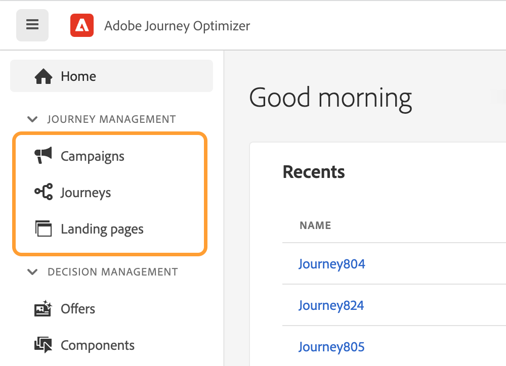
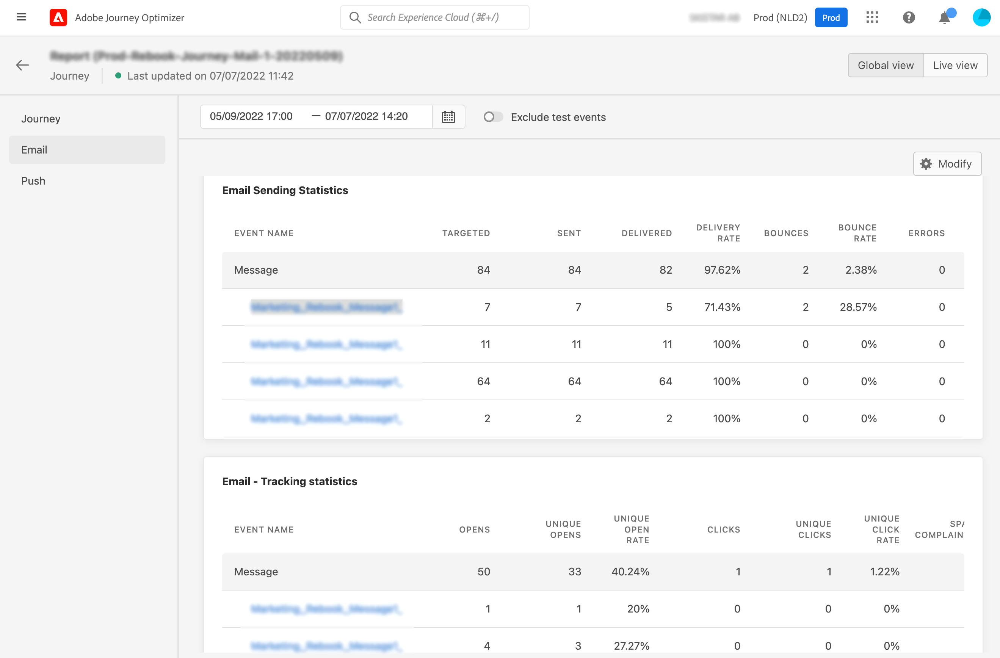
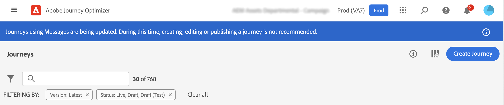

# 內聯創作遷移概述{#inline-authoring}

>[!CONTEXTUALHELP]
>id="ajo_messages_migration_before"
>title="瞭解有關新內聯創作消息的詳細資訊"
>abstract="從2022年7月25日起，郵件直接從Journey中編寫。 現有消息將自動遷移到新模型。 遷移後需要執行其他操作。"
>additional-url="https://experienceleague.adobe.com/docs/journey-optimizer/using/whats-new/inline-messages-steps.html" text="遷移步驟"

>[!CONTEXTUALHELP]
>id="ajo_messages_migration_during"
>title="瞭解發生的情況"
>abstract="從2022年7月25日起，郵件直接從Journey中編寫。 正在遷移您的環境。 遷移後需要執行其他操作。"
>additional-url="https://experienceleague.adobe.com/docs/journey-optimizer/using/whats-new/inline-messages-steps.html" text="遷移步驟"

>[!CONTEXTUALHELP]
>id="ajo_messages_migration_after"
>title="瞭解如何遷移郵件"
>abstract="從2022年7月25日起，郵件直接從Journey中編寫。 現有消息已遷移到新模型。 作為旅行實踐者，現在需要採取其他行動。"
>additional-url="https://experienceleague.adobe.com/docs/journey-optimizer/using/whats-new/inline-messages-steps.html" text="遷移步驟"

>[!CONTEXTUALHELP]
>id="ajo_messages_depecrated_inventory"
>title="瞭解如何遷移郵件"
>abstract="從2022年7月25日起，「消息」菜單消失，消息直接從「旅程」中創作。 如果要在行程中重新使用舊消息，則需要將它們另存為模板。"
>additional-url="https://experienceleague.adobe.com/docs/journey-optimizer/using/design/email-templates.html#save-as-template" text="將郵件另存為模板"

Adobe Journey Optimizer正在發佈一項新功能，該功能可改進您為Journey Optimizer頻道（電子郵件、推送、簡訊）編寫內容的方式。 作為Journey Optimizer的實踐者，您現在將直接從旅程建立和編寫您的資訊。

此功能需要遷移使用消息的現有行程。

在此頁中，您將找到有關此更改的必要資訊以及所需的步驟。

有關您作為Journey Optimizer從業人員的角色和職責的詳細資訊，請參閱此 [頁](../start/path/marketer.md)。

<!--
Here are the main changes in the interface:

* Messages are created direcly from journeys.
* The **Messages** entry in the left navigation menu has been removed. 
* There is no separate library of messages, the journey now centralizes all components.

-->

>[!VIDEO](https://video.tv.adobe.com/v/344698)

## 關鍵注意事項{#keys}

* **是否影響**:如果您從 **消息** 的下界。 如果您使用的是第三方系統(如Adobe Campaign)，則此遷移不會影響您。

* **產品更改**:在GA（7月25日），您的渠道內容將在每次行程中建立和管理。 的 **消息** 菜單，在左側導航中將不再可用([瞭解更多資訊](../rn/inline-messages.md#change))。 我們將針對您現有的行程進行遷移。

* **時間軸**:每個區域在夜間，通過若干個 [迭代](../rn/inline-messages.md#iterations)。

   

* **所需操作**:將為您執行自動轉換行程。 話雖如此，我們需要你的幫助。 瞭解有關此步驟中所需步驟的更多資訊 [頁](../rn/inline-messages-steps.md)。

* **棄用**:九月六日以後，所有仍使用舊版訊息的旅程，稍後將停止刪除。

## 好處和產品更改{#change}

Adobe的願景是不斷簡化產品，以提供高效和優化用戶流。 這種建立消息的新方法將帶來更簡化的用戶流程。

我們設計了這種新的工作流將內容放在一個位置，直接放在它的使用處。

現在，內容建立將直接在行程中執行。 立即 **利益** 您會得到：

* 在單個流中使用Journey Optimizer通道加快旅行建設。
* 通過在旅途中在所有電子郵件、推送和簡訊內容之間無縫切換，快速可視化內容。
* 使用畫布上的上下文個性化改進電子郵件和推送的流。
* 行程報告集中了詳細的渠道報告資訊。

這是 **產品更改** 這一新功能帶來的：

<table>
<tr>
<th>遷移前</th>
<th>遷移後</th>
</tr>
<tr>
<td>
之前，您已通過 <strong>消息</strong> 的子菜單。 
</td>
<td>
現在， <strong>消息</strong> 的下界。 
</td>
</tr>
<tr>
<td>
然後建立一個旅程， <strong>消息</strong> 的子菜單。
</td>
<td>
現在，您只需將所需的渠道操作活動（電子郵件、SMS、推送）添加到您的旅程中即可。 在練習中，您可以直接配置消息參數並訪問內容編輯器。
</td>
</tr>
<tr>
<td>
以前，報告可在消息和行程級別訪問。 您必須在消息執行頁籤和行程報告之間導航。
</td>
<td>
所有報告現在都集中在旅途級別。 這可改善導航和用戶體驗。 當您在旅途中有多個電子郵件時，您可以使用 <strong>操作</strong> 下拉菜單，查看相關報告。

</td>
</tr>
</table>

在GA（7月25日），此新用戶流適用於所有新旅程。 的 **消息** 的下界。

## 遷移時間表{#iterations}

需要遷移才能使用 **消息** 使用內聯創作的操作進入旅程。 將為您執行自動轉換行程。 話雖如此，我們需要你的幫助。

每個區域在夜間通過多次迭代進行遷移。 以下是遷移時間表：

* 2022年7月25日：GA — 第1次迭代
* 2022年8月1日：第2次迭代
* 2022年9月5日：第3次迭代
* 2022年9月6日：棄用

為什麼我們需要多次迭代？

在迭代過程中，我們將逐次遍歷並盡可能遷移它們。 有些情況下，我們不想自動遷移：當旅程是即時的或是結束的（這意味著它中還可能有個人資料）。 在這些情況下，我們要求您執行操作，然後下一個迭代將遷移在以前的迭代中無法遷移的這些行程。

## 常見問題集 {#faq}

### 如何通知我更改？{#inform}

Adobe在第一次迭代之前與您通信。

這個改變將在一夜之間通過多次反複部署。 瞭解更多 [迭代](../rn/inline-messages.md#inline-authoring)。

您還會收到產品內通知，顯示在「Orgeurnes」螢幕上：

* 更改部署前

   

* 在迭代期間

   

* 迭代後

   

   迭代後， **檢查狀態** 按鈕。 這允許您以JSON格式查看所有行程及其各自的遷移狀態。 查看 [節](../rn/inline-messages.md#status)。

* 當橫幅消失，你就可以走了。 您無需再執行任何操作。

### 遷移過程是什麼？{#process}

對於非即時或關閉的行程，遷移完全自動。 我們不想影響直播或關閉的旅程，以避免任何生產影響。 我們將要求您發佈我們為您建立的新版本。

將同時處理客戶組織的所有沙箱。 在更改部署期間，將執行以下操作：

**ANY Journey不使用消息**

這些不受變化影響。 遷移只針對使用消息的行程。 但是，您仍然可以通過以下URL訪問旅行中未使用的郵件：https://experience.adobe.com/#/@[組織]/sname:[沙盒]/journey優化程式/消息/

**DRAFT使用至少一條消息的旅程**

遷移期間將修改消息的草稿版本。 他們不再引用留言了。 的 **消息** 活動將替換為適當的渠道行動活動。 每個都包括頻道參數和內容。

像往常一樣，在發佈前test您的草稿。

**使用至少一條消息的LIVE Journeys**

即時版本的旅程持續運行，以避免任何生產影響。

遷移期間將建立此行程的新草稿版本。 此新草稿版本將是即時版本的副本，但郵件將替換為內聯創作的通道操作。 每個頻道操作活動都包括頻道參數和內容。 內容不會丟失。 報告未丟失

我們希望您審閱此草稿版本，test它並發佈它，以便它成為即時版本。

**使用至少一個消息完成或停止的旅程**

這些旅程也將被遷移。

查看行程報告時，報告將更豐富，以包括以前在「消息」報告中提供的資訊級別。

**使用至少一個消息的CLOSED旅程**

行程的封閉版本會針對內部任何配置檔案持續運行，以避免任何生產影響。

30天後，關閉的旅程將自動切換到「已完成」狀態。 完成後，在下一個迭代中將考慮這些參數。

**多頻道旅程**

這些不遷移。 你必須重新建立它們。

### 作為客戶，我的措施項目是什麼？{#actions}

將為您執行自動轉換行程，但需要一些步驟。 瞭解有關此步驟中所需步驟的更多資訊 [頁](../rn/inline-messages-steps.md)。

<!--

The process timeline is indicated in a blue banner on the Journeys screen. See this [section](../rn/inline-messages.md#inform). 

**Before migration**

* Check the date indicated in the banner. 
* Stop non-critical journeys, on development, stage and production environments.
* If you have draft messages that you want to keep using, add them to a journey so they are migrated.

**During migration**

* Migration occurs at night-time
* Do not to create, edit or delete journeys.

**After migration**

* After each iteration, click the **Check status** button in the top banner. This page lists all journeys and their migration status. See this [section](../rn/inline-messages.md#status). 

* For each live journey, a new version is created. Review the new version, test it and publish it. 

* The **Messages** menu, in the left navigation is no longer available. You need to use the new in-line message feature. See this [section](../rn/inline-messages.md#change). 

* If you need to access a specific message which was not used in a journey, you can use this URL and save the content as a template: https://experience.adobe.com/#/@[ORG]/sname:[SANDBOX]/journey-optimizer/messages/

## How can I check the migration status?{#status}

Click the **Check status** button in the top banner. The following page is displayed.

The status report is at sandbox level. This report includes several useful sections:

**migrationStatus**

This section displays the migration information since the first iteration. Numbers are incremented after each iteration.

* MIGRATED: number of draft journeys migrated successfully.
* NEW_VERSION_CREATED: number of live journeys migrated. For each live journey, a new draft version is created: you must test and publish this version.
* ERROR: number of draft journeys not migrated because of a failure. You need to re-create them.
* ERROR_ON_NEW_VERSION_CREATION: number of live journeys not migrated because of a failure. new draft journey versions not migrated because of a failure. You need to re-create them.

**eligibilityStatus**

This section lists the remaining items after the last iteration:

* toMigrate: number of draft journeys that need to be migrated.
* createNewVersion: number of live journeys to migrate.
* noMigration_live: number of live journeys that do not need to be migrated
* noMigration: number of draft journeys that do not need to be migrated.

The **details** section gives, for each of the above indicators, the list of related journeys.

-->

### 如何檢查遷移狀態？{#status}

按一下 **檢查狀態** 按鈕。 將顯示以下頁面。

狀態報告位於沙盒級別。 此報告包括幾個有用的部分：

**遷移狀態**

此部分顯示自第一次迭代以來的遷移資訊。 每次迭代後，數字都會遞增。

* 已遷移：成功遷移的草稿、已完成和已停止的旅程數。
* NEW_VERSION_CREATED:已遷移的即時旅程數。 對於每個即時行程，都會建立一個新的草稿版本：必須test並發佈此版本。
* 錯誤：由於失敗而未遷移的草稿、完成和停止的行程數。 你需要重新建立它們。
* ERROR_ON_NEW_VERSION_CREATION:由於失敗而未遷移的即時行程數。 由於失敗而未遷移新草稿版本。 尚未為它們建立新的草稿版本。 您需要手動重新建立它們。

**資格狀態**

本節列出上次迭代後的其餘項目：

* 遷移：需要遷移的擬定、完成和停止的行程數。
* createNewVersion:要遷移的即時旅程數。
* noMigration_live:不需要遷移的即時行程數。 此處還列出了已關閉的旅程。
* noMigration:不需要遷移的行程數。

的 **詳細資訊** 節為上述各節提供相關旅程的清單。

### 此更改是否會導致服務中斷？{#interruption}

不會中斷服務。

* 現場旅程：沒有影響，它們繼續運行。
* 在創作的旅程中：在遷移期間（夜間），強烈建議不建立、編輯或刪除旅程。

### 會丟失資料嗎？ {#data}

不會丟失資料，也不會影響即時旅行。 您將控制發佈更新的行程版本。

### 是否會丟失功能？{#functionality}

您撰寫郵件的方式將發生變化。 不會丟失功能。

### 在遷移過程中是否可以訪問環境？

遷移將在夜間進行。 您將能夠使用該產品。 但不要建立、編輯或刪除旅程。

### 是否繼續發送消息？

是的，直播旅程繼續。

### 如何知道遷移已完成？

當橫幅消失時，遷移完成。 查看 [節](../rn/inline-messages.md#inform)。

<!--
* Improved authoring flow and navigation
* Personalization: improved contextual personalization flow
* Reporting: the message execution screen will no longer exist. Reporting is centralized in journeys.
* You will still be able to update content in a live journey.
->>
