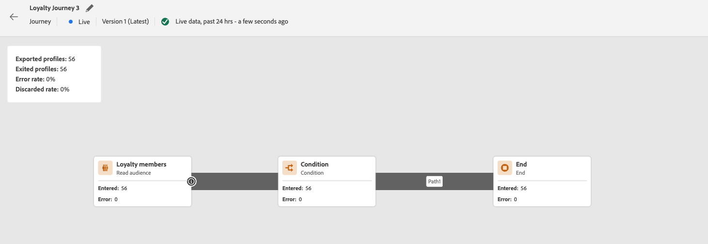

# 歡迎使用改良的歷程設計器 {#new-canvas}

>[!CONTEXTUALHELP]
>id="ajo_new_canvas"
>title="新增功能？"
>abstract="新的畫布"

歡迎使用改良的歷程設計器！

我們已開發 **簡化的歷程模型** 旨在改善內部流程。 雖然此新模式為後端改進，但我們的團隊趁機新增可看到並有利於Journey Optimizer使用者的功能：

* A **重新設計的歷程畫布** 打造現代化的UI體驗
* A **即時報告** 歷程畫布中直接可用的UI

## 歷程模型的更新

新的歷程模型將與現有模型同時存在，這表示將有歷程使用 **兩種不同的模型**：

* 舊的「v1」
* 而新的則稱為「v2」

v1中的所有歷程都將保留在v1。 您仍可編輯、測試或發佈這些專案。 任何從v1建立的新版本也將保留在v1中。 有 **無功能變更** 在v1歷程左右。

如以下熒幕擷圖所示，節點為圓形，這是v1模型上歷程的舊UI。

不過，當您在&#x200B;**建立新歷程** 或 **複製現有的一個**，這將是v2歷程。  我們計畫繼續支援v1歷程，直到大多數客戶轉換為v2歷程為止。

新歷程模型有一個限制；它會 **無法將活動從v1歷程複製並貼到v2，反之亦然**. 如果您想要這麼做，我們建議您複製v1歷程，使其成為v2，然後複製您的活動。

在下方熒幕擷圖中，您可以看到重新設計的歷程畫布UI （僅適用於v2模型）：

**此歷程設計器新增的任何新功能（包括即時報告）將僅適用於從現在起的v2歷程。**

## 改善歷程畫布設計

我們透過新的歷程模式，推出全新及改良的產品 **歷程畫布UI**，順暢地融入Adobe Experience Cloud解決方案和應用程式生態系統，提供直覺式且高效的使用者體驗。 v2棧疊中的任何歷程都將在該新設計上。

現在，活動將以方塊表示，且具有下列功能：

* 代表活動型別的第一行通常會被更多情境式資訊覆寫（例如：在讀取對象上，它將包含所選對象的名稱），或者如果您定義一個活動型別，則會被自訂標籤覆寫。
* 第二行一律代表活動型別。

此新UI透過提供以下內容，改善歷程畫布的可讀性 **更清楚的活動標籤和型別**.

它也能讓產品團隊透過較少的點按在畫布上新增更多資訊。 「更多資訊」的一個範例是在歷程畫布中包含即時報告，您可以在其中檢視由於錯誤而進入和退出活動的設定檔。

## 歷程畫布中的即時報告

除了改良的歷程畫布設計，我們還將推出以下功能： **過去24小時的報表量度** （稱為「即時報告」）直接在歷程畫布中。

有了新模式上的每個即時歷程，您就能看到兩種型別的「過去24小時」報告資訊：

* 在 **新插入**，您會看到：
   * 已針對受眾觸發的歷程匯出的設定檔數。 您將看到上次匯出作業中可用的設定檔數量，以及進行該匯出的時間。
   * 退出歷程的設定檔數
   * 錯誤百分比
     
* **在每個活動上**，您會看到進入該活動的設定檔數目，以及因錯誤而退出的數目：
  

使用者介面每分鐘會自動重新整理一次。

請注意，您可能會看到匯出的設定檔數量與流經歷程的設定檔數量之間的差異。 匯出的設定檔計數只會提供上次執行匯出工作的相關資訊，而進入活動的設定檔數目只包含過去24小時內執行匯出工作的設定檔。 這尤其可見於週期性每日歷程，因為兩天之間可能會出現資料重疊。
