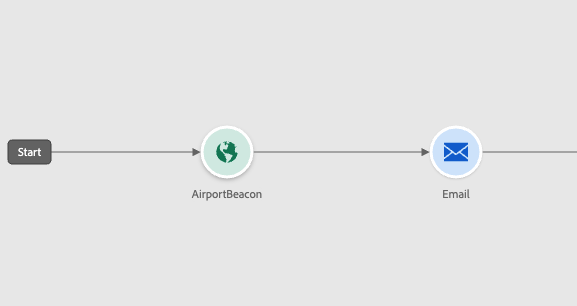
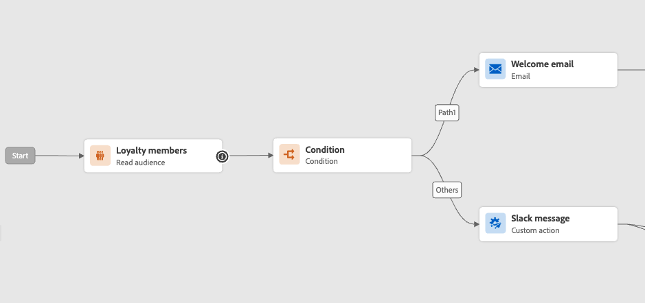
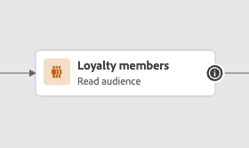
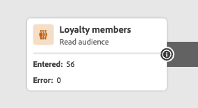

# 歡迎使用經改善的 Journey Designer {#new-canvas}

Journey Optimizer現在提供 **簡化的歷程模型** 旨在改善使用者體驗和內部流程。 自4月發行版本開始，您可以受益於下列功能：

* A **重新設計的歷程畫布** 打造現代化的UI體驗
* A **即時報告** 歷程畫布中直接可用的UI

>[!NOTE]
>
>請注意，此功能的推出將是漸進式的。 您可能無法立即看到變更。

## 歷程模型的更新

新的歷程模型將與現有模型同時存在，這表示將有歷程使用 **兩種不同的模型**：

* 舊版模型
* 新模型

舊版模式中的所有歷程都將保留在其中。 您仍可編輯、測試或發佈這些專案。 從舊版模型的歷程中建立的任何新版本也將保留在其中。 有 **無功能變更** 圍繞著那些歷程。

如以下熒幕擷圖所示，節點為圓形，這是舊版模型上歷程的舊UI。

然而，當您 **建立新歷程** 或 **複製現有的一個**，它將在新模型上。 在大部分客戶轉換為新版之前，仍支援舊版模式上的歷程。

新歷程模型有一個限制；它會 **無法將活動從舊版模型複製並貼上至新模型，反之亦然**. 如果您想要這麼做，我們建議您複製您的舊版歷程以將其切換至新模型，然後複製您的活動。

在下方熒幕擷圖中，您可以看到重新設計的歷程畫布UI （僅適用於新模式）：

**任何新增到歷程設計器的新功能（包括即時報告）此後將僅適用於新模型上的歷程。**

## 改善歷程畫布設計

我們透過新的歷程模式，推出全新及改良的產品 **歷程畫布UI**，順暢地融入Adobe Experience Cloud解決方案和應用程式生態系統，提供直覺式且高效的使用者體驗。 新模型中的任何歷程都將採用新設計。

現在，活動將以方塊表示，且具有下列功能：

* 代表活動型別的第一行通常會被更多情境式資訊覆寫（在讀取對象上，它將包含所選對象的名稱），或者如果您定義一個活動型別，則會被自訂標籤覆寫。
* 第二行一律代表活動型別。

此新UI透過提供以下內容，改善歷程畫布的可讀性 **更清楚的活動標籤和型別**.

它也能讓產品團隊透過較少的點按在畫布上新增更多資訊。 「更多資訊」的一個範例是在歷程畫布中包含即時報告，您可以在其中檢視由於錯誤而進入和退出活動的設定檔。

## 歷程畫布中的即時報告

除了改良歷程畫布版面配置外，使用者還可以使用新功能檢視即時報告量度 **過去24小時**，稱為即時報告，直接在歷程畫布中。

對於使用新模型的每個即時歷程中的每個活動，您都有權存取：

* 進入此活動的設定檔計數。
* 由於錯誤而退出此活動的設定檔計數。

<!--`
With every live journey on the new model, you will be able to see two types of "last 24 hours" reporting information:

* On a **new insert**, you will see:
    * The number of profiles that have been exported for audience-triggered journeys. You will see the number of profiles available in the last export job alongside the time when that export has been made.
    * The number of profiles who exited the journey
    * The percentage of errors
    
* **On each activity**, you will see the number of profiles who entered that activity and the number who exited because of an error:
    
-->
<!--
Please note that you may see differences between the number of exported profiles and the number of profiles flowing through the journey. The exported profiles count only provides information about the last export job being made while the number of profiles entering an activity only contains profiles who did it in the last 24 hours. This can especially be visible on recurring daily journeys as there could be a data overlap between two days.
-->
