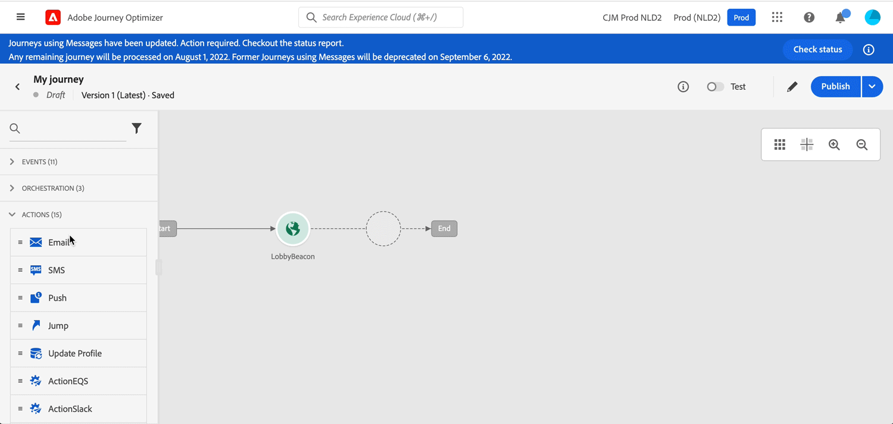

# 發行說明2022年 {#release-notes-2022}

本頁面列出 [!DNL Journey Optimizer] 於2022年發行。

## 2022年9月發行{#sept-2022-release}

### 新功能{#sept-2022-features}

<table>
<thead>
<tr>
<th><strong>動態內容與新條件式規則產生器</strong> </th>
</tr>
</thead>
<tbody>
<tr>
<td>

您現在可以建立動態內容，以根據條件規則調整訊息的內容。
 

條件式規則是使用運算式編輯器中的視覺化規則產生器來建立，您可以在其中儲存，以便在歷程和行銷活動中重複使用。

如需詳細資訊，請參閱 <a href="../personalization/get-started-dynamic-content.md">詳細檔案</a>.
</td>
</tr>
</tbody>
</table>

<table>
<thead>
<tr>
<th><strong>API觸發的行銷活動</strong> </th>
</tr>
</thead>
<tbody>
<tr>
<td>

除了現有的已排程促銷活動，您現在可以在Journey Optimizer中建立API觸發的促銷活動，並使用API從外部系統叫用它們。

這可讓您涵蓋各種操作和交易式訊息需求，例如密碼重設、OTP Token等。

如需詳細資訊，請參閱 <a href="../campaigns/api-triggered-campaigns.md">詳細檔案</a>.
</td>
</tr>
</tbody>
</table>

<table>
<thead>
<tr>
<th><strong>資料存取控制</strong> </th>
</tr>
</thead>
<tbody>
<tr>
<td>

通過基於屬性的訪問控制，管理員可以根據特定屬性控制對特定對象的訪問。 這些屬性可以是新增至物件的中繼資料，例如標籤。 從此版本開始，管理員還可以定義只能訪問特定欄位和/或對象以及與這些欄位和/或對象對應的資料的用戶角色。

 基於屬性的訪問控制目前僅限於選定的客戶使用，並將在將來的版本中部署到所有環境。

如需詳細資訊，請參閱 <a href="../administration/object-based-access.md">詳細檔案</a>.
</td>
</tr>
</tbody>
</table>

<table>
<thead>
<tr>
<th><strong>資料控管與隱私權</strong> </th>
</tr>
</thead>
<tbody>
<tr>
<td>

透過其資料使用標籤和實作(DULE)控管架構，Journey Optimizer現在可以運用Adobe Experience Platform控管原則，防止敏感欄位透過自訂動作匯出至協力廠商系統。 如果系統在自訂動作參數中識別限制欄位，系統會顯示錯誤，使您無法發佈歷程。

資料使用標籤和實作(DULE)的使用目前僅限選定客戶使用，並將在未來版本中部署至所有環境。

如需詳細資訊，請參閱 <a href="../action/action-privacy.md">詳細檔案</a>.
</td>
</tr>
</tbody>
</table>

<table>
<thead>
<tr>
<th><strong>自動同意強制（同意政策）</strong> </th>
</tr>
</thead>
<tbody>
<tr>
<td>

Adobe Experience Platform可讓您輕鬆採用及執行行銷政策，以遵循客戶的同意偏好設定。 同意原則是在Adobe Experience Platform中定義。 在Journey Optimizer中，您可以將這些同意原則套用至自訂動作。 例如，您可以定義同意原則，以排除尚未同意接收電子郵件、推播或簡訊通訊的客戶。

自動同意強制目前僅適用於已購買Healthcare Shield附加元件產品的組織。

如需詳細資訊，請參閱 <a href="../action/consent.md">詳細檔案</a>.
</td>
</tr>
</tbody>
</table>

<table>
<thead>
<tr>
<th><strong>權限管理</strong> </th>
</tr>
</thead>
<tbody>
<tr>
<td>

Journey Optimizer支援定義使用者角色和存取原則，以管理功能和物件的權限。 通過 <strong>Adobe Experience Cloud權限</strong>，您可以建立和管理角色，並為這些角色指派所需的資源權限。 權限也可讓您管理與特定角色相關聯的標籤、沙箱和使用者。

 權限的使用目前僅限於選取的客戶，且將在未來版本中部署至所有環境。

如需詳細資訊，請參閱 <a href="../administration/attribute-based-access.md">詳細檔案</a>.
</td>
</tr>
</tbody>
</table>

<table>
<thead>
<tr>
<th><strong>警報和監視</strong> </th>
</tr>
</thead>
<tbody>
<tr>
<td>

身為Journey Optimizer使用者，您現在可以透過使用者介面存取系統警報，以在歷程未如預期運作時收到通知。 您可以檢視可用警報並訂閱警報。 如果「讀取區段」活動在定義的時間範圍內未處理任何設定檔，則此版本提供的第一個警報將會警告您。 此工作流程已解除鎖定，將提供更多資訊。

如需詳細資訊，請參閱 <a href="../reports/alerts.md">詳細檔案</a>.
</td>
</tr>
</tbody>
</table>

<!--table>
<thead>
<tr>
<th><strong>Data Hygiene</strong> </th>
</tr>
</thead>
<tbody>
<tr>
<td>

Adobe Experience Platform provides a suite of data hygiene capabilities that allow you manage your stored data through programmatic deletions of consumer records and datasets. This capability is now available for Adobe Journey Optimizer. 

You can manage your data stores to ensure that information is used as expected, is updated when incorrect data needs fixing, and is deleted when organizational policies deem it necessary.

<strong>Caution</strong> - Data Hygiene capabilities are currently only available for organizations that have purchased the Healthcare Shield add-on offering.

For more information, refer to the <a href="../building-journeys/read-segment.md#configuring-segment-trigger-activity">detailed documentation</a>.
</td>
</tr>
</tbody>
</table-->

### 改良功能{#sept-2022-improvements}

**歷程**

* 此 **實體資料集** 現在可在Adobe Journey Optimizer中以現成可用的資料集形式使用。 此查詢資料集包含中繼資料，讓追蹤和意見資料集資訊更為豐富。 這可協助您使用更易理解的資料，改善報表和查詢。 [深入了解](../data/datasets-query-examples.md#entity-dataset)
* 已將新護欄新增至單一歷程（從事件或區段資格開始），以防止同一事件多次錯誤觸發歷程。 設定檔重新進入現在會依預設暫時封鎖5分鐘。 [深入了解](../start/guardrails.md#events-g)

**管理**

* 現在啟用或停用允許的清單時，會顯示新警告以詳細說明每個動作的影響。 [深入了解](../configuration/allow-list.md#enable-allow-list)
* 更新了用於建立通道表面、建立IP池、管理隱藏清單和允許清單以及配置SMS通道的用戶介面。
* 現在，為指定子網域建立第一個通道曲面時，處理時間將需要10分鐘到10天，使用該子網域的後續曲面最多只需3小時。 [深入了解](../configuration/channel-surfaces.md#create-channel-surface)
* 更新建立登錄頁面預設集和登錄頁面子網域的使用者介面。 [深入了解](../landing-pages/lp-subdomains.md)

**稽核控制**

* 透過Journey Optimizer，您可以識別系統中的使用者在各種服務和功能（例如促銷活動、歷程、訊息、登陸頁面等）上執行的動作。 稽核記錄資源現在包含對各種其他動作的變更，並會在活動發生時自動記錄。 深入了解 [在本頁](../privacy/audit-logs.md).

**封存支援**

* 新 **實體資料集** 包含「範本」欄位，可讓您匯出所有通道上已傳送訊息的格式和結構，以用於封存。 [深入了解](../configuration/archiving-support.md)

**登錄頁面**

* 您現在可以使用來自相同登陸頁面內其他頁面的內容資料。 例如，如果您將核取方塊連結至主要登陸頁面上的訂閱清單，則可以在「感謝您」子頁面上使用該訂閱清單。 [深入了解](../landing-pages/lp-content.md#use-primary-page-context)

<!--* When configuring the primary page, you can now create additional data to enable storing information when the landing page is being submitted. [Learn more](../landing-pages/lp-content.md#use-additional-data)-->

<!--* You can now use information that was submitted on a landing page to send communications to your customers. For example, if a user subscribes to a given subscription list, you can leverage that information to send an email recommending other subscription lists to that user.-->

### 其他變更{#sept-2022-other}

* 「促銷活動快速傳送」模式已取代「歷程突發模式」。 [深入了解](../campaigns/create-campaign.md#rapid-delivery)
* 為了改善效能，從「讀取」區段、「區段」資格或業務事件活動開始的歷程中，無法再使用體驗事件欄位群組。 此變更僅適用於新歷程。 現有行為會保留目前的行為。 [深入了解](../start/guardrails.md#expression-editor)
* 已移除已排程讀取區段歷程的1小時限制。 這些歷程現在可立即執行。

## 2022年8月發行 {#aug-2022-release}

### 新功能

<table>
<thead>
<tr>
<th><strong>在Journey Optimizer中建立和管理行銷活動</strong> </th>
</tr>
</thead>
<tbody>
<tr>
<td>

使用Journey Optimizer促銷活動，透過各種管道將一次性內容提供至特定區段。 使用歷程時，會設計為依序執行動作。 使用促銷活動時，可同時執行動作（立即執行或根據指定的排程執行）。 

了解如何在 <a href="../campaigns/get-started-with-campaigns.md">詳細檔案</a> 和 <a href="https://video.tv.adobe.com/v/346680">功能影片</a>.
</td>
</tr>
</tbody>
</table>

<table>
<thead>
<tr>
<th><strong>傳送簡訊給您的使用者（正式發行）</strong> </th>
</tr>
</thead>
<tbody>
<tr>
<td>

您現在可以透過與的整合，在Journey Optimizer中建立、個人化及傳送SMS <b>辛奇</b> 或 <b>Twilio</b>.

了解如何在此建立和傳送簡訊 <a href="../sms/create-sms.md">詳細檔案</a>.

</td>
</tr>
</tbody>
</table>

<!--table>
<thead>
<tr>
<th><strong>New Dynamic Expression Builder</strong> </th>
</tr>
</thead>
<tbody>
<tr>
<td>

You can now create conditional content blocks across different authoring services to personalize your content.

In addition to the Personalization Expression Library, the Expression Editor provides a new Conditional Rule Builder to help you design and save your content blocks.

For more information, refer to the <a href="../building-journeys/read-segment.md#configuring-segment-trigger-activity">detailed documentation</a>.
</td>
</tr>
</tbody>
</table-->

### 改良功能

**報表**

* 同意原則表格和圖表現在可在歷程全域報表中使用。 這些小工具可讓您從自訂動作中的原則追蹤排除的設定檔。 [深入了解](../reports/journey-global-report.md#journey-global)

   若要存取最新的Widget，請注意您必須重設不同的報表控制面板。 如需控制面板自訂的詳細資訊，請參閱 [詳細檔案](../reports/global-report.md).

**管理**

* 現在可以更新主要電話號碼以用於SMS通道。 [深入了解](../configuration/primary-email-addresses.md)

## 2022年7月發行 {#july-2022-release}

### 新功能

<table>
<thead>
<tr>
<th><strong>新的線上傳訊流程</strong> </th>
</tr>
</thead>
<tbody>
<tr>
<td>

Journey Optimizer提供在Journeys中製作訊息的新流程。 線上傳訊功能可節省使用者大量時間，並簡化在Journey Optimizer中建立及傳送電子郵件、推播通知或簡訊的工作流程程式。 將訊息移除為個別步驟，而非在歷程畫布上的動作中讓訊息可內嵌編輯，讓使用者只需按一下較少的按鈕，並導覽較少的畫面即可設計和編輯其內容。

</td>
</tr>
</tbody>
</table>

<table>
<thead>
<tr>
<th><strong>基於屬性的訪問控制（有限可用性）</strong> </th>
</tr>
</thead>
<tbody>
<tr>
<td>

您現在可以識別具有標籤的結構欄位，這些標籤定義了組織或資料使用範圍。 管理員可以使用權限介面來定義涵蓋XDM架構欄位的存取原則，並更妥善地管理授予使用者或使用者群組（內部、外部或第三方使用者）的存取權，以及管理對特定資料類型（即敏感個人資料/SPD）的存取權。

基於屬性的訪問控制目前僅限於選定的用戶，並將在未來版本中部署到所有環境。

如需詳細資訊，請參閱 <a href="../administration/attribute-based-access.md">詳細檔案</a>.

</td>
</tr>
</tbody>
</table>

<table>
<thead>
<tr>
<th><strong>批次決策工作</strong> </th>
</tr>
</thead>
<tbody>
<tr>
<td>

您現在可以從使用者介面執行批次決策作業，因此我不需要開發人員來執行批次api作業，而且我可以縮短行銷所需的時間。 此新介面可讓您建立作業，以及管理目前/過去的作業。

如需詳細資訊，請參閱 <a href="../offers/batch-delivery.md">詳細檔案。

</td>
</tr>
</tbody>
</table>

<table>
<thead>
<tr>
<th><strong>在決策中自動使用效能最佳的選件（有限的可用性）</strong> </th>
</tr>
</thead>
<tbody>
<tr>
<td>

您現在可以在決策管理中使用個人化最佳化模型系統。 這種新類型的模型可讓您根據區段和選件效能來最佳化及個人化選件。

個人化最佳化AI模型目前僅限選取的使用者使用，未來發行版本會部署至所有環境。

如需詳細資訊，請參閱 <a href="../offers/ranking/personalized-optimization-model.md">詳細檔案</a>.

</td>
</tr>
</tbody>
</table>

### 改良功能

**歷程**

* **結束歷程**  — 在歷程畫布中， **結束** 活動已從浮動視窗中移除。 現在，預設會在每個路徑的結尾新增結束標籤，且無法移除。 此項改善可讓您更妥善地報告客戶離開歷程的位置，而無需歷程從業者採取任何動作。 請參閱 [檔案](../building-journeys/end-journey.md) 和 [功能影片](https://video.tv.adobe.com/v/345376){target=&quot;_blank&quot;}。

* 此 **設定檔時區** 「歷程屬性」中的「 」選項現在預設為未勾選。 [深入了解](../building-journeys/timezone-management.md#timezone-from-profiles)

**訊息**

* 訊息預設集現在為 **通道曲面**. [深入了解](../configuration/channel-surfaces.md)

**管理**

* **PTR記錄版本**  — 現在，更新PTR記錄時，處理時間最多只需3小時。 [深入了解](../configuration/ptr-records.md#processing)

* **允許的清單UI**  — 您現在可以使用Journey Optimizer使用者介面，將新的電子郵件地址或網域新增至允許清單。 [深入了解](../configuration/allow-list.md)

* **允許的清單邏輯更新**  — 現在，即使清單為空，允許的清單邏輯也會在功能啟用時套用。 [深入了解](../configuration/allow-list.md#logic)

* **URL追蹤參數**  — 您現在可以使用運算式編輯器，在電子郵件介面中設定URL追蹤參數（即預設集）。 [深入了解](../email/email-settings.md#url-tracking)

**決策管理**

* **對象大小**  — 建立決策規則、選取區段或規則以設定優惠方案資格，或將區段或規則新增至決策範圍時，使用者介面現在會顯示新的受眾規模預估元件。

## 2022年6月發行 {#june-2022-release}

### 新功能

<table>
<thead>
<tr>
<th><strong>傳送簡訊給您的使用者（可用性有限）</strong> </th>
</tr>
</thead>
<tbody>
<tr>
<td>

您現在可以透過與的整合，在Journey Optimizer中建立、個人化及傳送SMS <b>辛奇</b> 或 <b>Twilio</b>.

<!--img src="assets/do-not-localize/SMS.gif"/-->

SMS通道目前僅適用於一組組織（有限可用性）。 如需詳細資訊，請連絡您的Adobe代表。

了解如何在此建立和傳送簡訊 <a href="../sms/create-sms.md">詳細檔案</a>.

</td>
</tr>
</tbody>
</table>

<table>
<thead>
<tr>
<th><strong>透過Adobe Stock整合，更快找到更具影響力的影像</strong> </th>
</tr>
</thead>
<tbody>
<tr>
<td>

Adobe Stock和Adobe Journey Optimizer電子郵件設計工具整合外掛程式可讓客戶輕鬆導覽、授權和儲存影像，以用於訊息製作。   新 <b>查找類似的Stock照片</b> 選項也可讓您找出符合影像內容、顏色和組成的Stock像片。 

<!--img src="assets/do-not-localize/stock-rn.gif"/-->

如需詳細資訊，請參閱 <a href="../email/stock.md">詳細檔案</a>.

</td>
</tr>
</tbody>
</table>

<table>
<thead>
<tr>
<th><strong>在所有電子郵件上使用電子郵件密件副本</strong> </th>
</tr>
</thead>
<tbody>
<tr>
<td>

您現在可以使用電子郵件密件副本（盲目碳副本）功能，儲存Adobe Journey Optimizer傳送的電子郵件。 在您的電子郵件預設集中啟用此選項，以便將所傳送的每封電子郵件盲複製到您的密件副本地址。

<!--img src="assets/do-not-localize/bcc-rn.gif"/-->

如需詳細資訊，請參閱 <a href="../configuration/archiving-support.md#bcc-email">詳細檔案</a>.

</td>
</tr>
</tbody>
</table>

<!--<table>
<thead>
<tr>
<th><strong>Automatically use the best performing offer in your decisions</strong> </th>
</tr>
</thead>
<tbody>
<tr>
<td>

You can now use personalized optimization model systems in Decision Management. This new type of model allows you to optimize and personalize offers based on segments and offer performance.

The use of personalized optimization AI models is currently restricted to selected users, and will be deployed to all environments in a future release.

For more information, refer to the <a href="../offers/ranking/personalized-optimization-model.md">detailed documentation</a>.

</td>
</tr>
</tbody>
</table>-->

<table>
<thead>
<tr>
<th><strong>在沙箱之間複製物件</strong> </th>
</tr>
</thead>
<tbody>
<tr>
<td>

您現在可以將體驗從Journey Optimizer沙箱重新建立至其他體驗，例如從非生產沙箱重新建立至生產沙箱。 這項新功能會複製整個歷程，包括歷程所仰賴的任何物件，以便從一個環境複製到另一個環境中正確執行。 除了歷程外，您也可以複製其他元件，例如選件、訊息、結構、資料集、資料來源、事件和動作。

如需詳細資訊，請參閱 <a href="../building-journeys/copy-to-sandbox.md">詳細檔案</a>.
</td>
</tr>
</tbody>
</table>

### 改良功能

**決策管理**

* **HTML和JSON檔案支援**  — 您現在可以從Adobe Experience Cloud資產資料庫將外部HTML和JSON檔案拖放至選件表示內容。 [深入了解](../offers/offer-library/add-representations.md#html-json)

**電子郵件**

* **另存為範本**  — 您現在可以將電子郵件內容儲存為範本，並在建立其他訊息時重複使用。 [深入了解](../email/email-templates.md)

**管理**

* **預覽追蹤URL參數**  — 在設定訊息預設集時，如果您定義URL追蹤參數，現在會顯示所產生追蹤URL的動態預覽。 [深入了解](../email/email-settings.md#url-tracking)

* **訊息預設集版本**  — 現在更新訊息預設集時，處理時間最多只需3小時。 [深入了解](../configuration/channel-surfaces.md#edit-channel-surface)

* **IP池版本**  — 現在更新IP池時，處理時間最多只需3小時。 [深入了解](../configuration/ip-pools.md#edit-ip-pool)

## 2022年5月發行 {#may-2022-release}

### 新功能

<table>
<thead>
<tr>
<th><strong>訊息頻率規則</strong> </th>
</tr>
</thead>
<tbody>
<tr>
<td>

您現在可以設定跨管道業務規則，自動從訊息和動作中排除過度請求的設定檔。

<!--img src="assets/do-not-localize/frequency-rn.gif"/-->

如需詳細資訊，請參閱 <a href="../configuration/frequency-rules.md">詳細檔案</a>.

</td>
</tr>
</tbody>
</table>

<table>
<thead>
<tr>
<th><strong>決策管理 — AI排名自動優化模型</strong> </th>
</tr>
</thead>
<tbody>
<tr>
<td>

您現在可以在決策管理中使用經過訓練的模型系統。 這項新功能會對選件進行排名，以針對指定的設定檔顯示。

<!--img src="assets/do-not-localize/optimization.gif"/-->

如需詳細資訊，請參閱 <a href="../offers/offer-activities/configure-offer-selection.md#use-ranking-strategy">詳細檔案</a>.

</td>
</tr>
</tbody>
</table>

<!--table>
<thead>
<tr>
<th><strong>Attribute-based Access Control (ABAC)</strong> </th>
</tr>
</thead>
<tbody>
<tr>
<td>

Permission management in Journey Optimizer has been extended to data access. You can now manage data access for specific teams or groups of users (i.e. internal, external, 3rd parties) ​and manage access to specific types of data (i.e. Sensitive Personal Data/SPD).

This capability is available for a limited set of customers.

For more information, refer to the <a href="../landing-pages/create-lp.md">detailed documentation</a>.

</td>
</tr>
</tbody>
</table-->

<table>
<thead>
<tr>
<th><strong>Journey Optimizer稽核記錄</strong> </th>
</tr>
</thead>
<tbody>
<tr>
<td>

您現在可以監視使用者在Adobe Journey Optimizer資源上執行的動作。

<!--img src="assets/do-not-localize/audit-rn.gif"/-->

如需詳細資訊，請參閱 <a href="../privacy/audit-logs.md">詳細檔案</a>.

</td>
</tr>
</tbody>
</table>

### 改良功能

**個人化**

* **用於字元隱藏的新協助程式功能** - `mask` 協助程式函式可讓您將字串的一部分取代為「X」字元。 [深入了解](../personalization/functions/string.md#mask)

**登錄頁面**

* **不含表單的登錄頁面**  — 您現在可以建立並發佈不含表單的登錄頁面，且不需要訪客採取任何動作。
* **登錄頁面範本**  — 您現在可以將登錄頁面儲存為範本，並在建立其他登錄頁面時重複使用。 [深入了解](../landing-pages/lp-templates.md)
* **返回主要頁面**  — 您現在可以從相同登錄頁面內的任何子頁面新增主要頁面的連結。
* **自訂JavaScript支援**  — 您現在可以將自訂JavaScript新增至您的登錄頁面內容，以執行進階樣式，或將自訂行為新增至您的登錄頁面。    [深入了解](../landing-pages/lp-custom-js.md)

**歷程**

* **讀取區段**  — 單次讀取區段歷程現在會在歷程執行後30天移至已完成狀態。 若為已排程的讀取區段，則為上次發生次數執行後的30天。 [深入了解](../building-journeys/read-segment.md)
* **運算式編輯器** - [限制](../building-journeys/functions/functionlimit.md) 函式，可讓您限制清單的項目數。 此 [排序](../building-journeys/functions/functionsort.md) 函式現在可讓您排序清單物件。 listObject的支援也已新增至 [盤旋](../building-journeys/functions/functiondistinct.md) 和 [distinctWithNull](../building-journeys/functions/functiondistinctwithnull.md) 函式。

**管理**

* **許可證使用控制面板更新**  — 適用於 [!DNL Adobe Journey Optimizer] 使用者介面現在會反映 **授權** 平均設定檔豐富度。 此量度表示法中會出現下降，這表示現在已正確回報授權限制。 [深入了解](../segment/license-usage.md)

## 2022年4月發行 {#april-2022-release}

### 改良功能

**登錄頁面**

* **選擇加入/選擇退出核取方塊的新選項**  — 您現在可以在訂閱登錄頁面中插入選擇加入/選擇退出的單一核取方塊。 使用者必須核取同意（選擇加入）方塊，並取消勾選以移除其同意（選擇退出）。 [深入了解](../landing-pages/design-lp.md#define-lp-specific-content)

* **預先填寫登錄頁面欄位**  — 現在可讓使用者使用設定檔資訊預先填入登錄頁面欄位。 [深入了解](../landing-pages/create-lp.md#configure-primary-page)

**決策管理**

* **Edge上的決策API** - Edge Decisioning API可提供及呈現決策管理中管理的個人化優惠方案。 您可以使用決策管理使用者介面(UI)或API來建立選件和其他相關物件。 [深入了解](../offers/api-reference/offer-delivery-api/edge-decisioning-api.md)

**管理**

* **PTR提交持續時間** - PTR編輯生效的持續時間現在為幾小時。 [深入了解](../configuration/ptr-records.md#processing)

**電子郵件設計**

* **20個全新電子郵件範本** 現在可在Journey Optimizer中設計您的電子郵件內容。

**使用者介面**

* **Journey Optimizer UI中的內容說明** - Journey Optimizer中的多個頁面已新增內容說明連結。 若有，按一下「i」圖示即可檢視目前功能的快速說明並存取相關文章。

**與Adobe Campaign Standard整合**

身為Adobe Campaign Standard客戶，您現在可以使用Journey Optimizer傳送電子郵件、推播通知和簡訊。 使用新的內建動作，將Campaign Standard交易訊息功能運用到Journey Optimizer中。  [深入了解](../action/acs-action.md)

<!--
### Fixes

* Fixed an issue which caused tracking reports not to be available as the `JourneyActionId` was not properly populated. PLATIR-19854, CJM-26006
* Fixed an error on business events which could block the journey publication. CJM-25931
* Fixed an issue which could prevent images in Email Designer templates from being displayed. PLATIR-18176, CJM-25008
-->

## 2022年3月發行 {#march-2022-release}

### 改良功能

**歷程**

* 為避免統一的設定檔結構中有不必要的欄位，預設不再為設定檔啟用歷程步驟事件結構。 如有需要，您可以啟動它。 [深入了解](../reports/sharing-overview.md)
* 與匯出工作相關的新步驟事件現在會由Journey Optimizer傳送至Adobe Experience Platform。 檔案已新增查詢範例。 [深入了解](../reports/query-examples.md)

**決策管理**

* 您現在可以指定是否對所有使用者或特定設定檔，以及對所有版位或每個版位套用優惠方案限定。 [深入了解](../offers/offer-library/add-constraints.md#capping)
* 批次決策API可讓組織在一次呼叫中，針對指定區段中的所有設定檔使用決策管理功能。 區段中每個設定檔的選件內容會放在AEP資料集中，供自訂批次工作流程使用。 [深入了解](../offers/api-reference/offer-delivery-api/batch-decisioning-api.md)

**管理**

* 您現在可以在訊息預設層級啟用/停用電子郵件標題中的/從中取消訂閱連結，並在訊息層級設定自訂取消訂閱URL。 [深入了解](../configuration/channel-surfaces.md#list-unsubscribe)
* 現在，您可以透過 [!DNL Journey Optimizer] 介面。 [深入了解](../configuration/allow-list.md#enable-allow-list)

**個人化**

* 您現在可以在程式庫中儲存超過40個個人化運算式。 [深入了解](../personalization/personalization-library.md)

## 2022年2月發行 {#feb-2022-release}

### 新功能

<table>
<thead>
<tr>
<th><strong>訂閱登錄頁面</strong> </th>
</tr>
</thead>
<tbody>
<tr>
<td>

您現在可以在Journey Optimizer中建立和設計登錄頁面，並將使用者導向線上表單，讓他們可以選擇加入或選擇退出以接收您的通訊，或訂閱特定服務，例如電子報。

如需詳細資訊，請參閱 <a href="../landing-pages/create-lp.md">詳細檔案</a> 與 <a href="../landing-pages/lp-use-cases.md">範例使用案例</a>.

</td>
</tr>
</tbody>
</table>

<table>
<thead>
<tr>
<th><strong>新的個人化運算式程式庫</strong> </th>
</tr>
</thead>
<tbody>
<tr>
<td>

Journey Optimizer現在提供一個程式庫，您可在其中存取預先定義的個人化運算式。 這些運算式是由管理員使用者設定。

如需詳細資訊，請參閱 <a href="../personalization/personalization-library.md">詳細檔案</a>.

</td>
</tr>
</tbody>
</table>

<!--table>
<thead>
<tr>
<th><strong>API Developer Site and Suppression API</strong> </th>
</tr>
</thead>
<tbody>
<tr>
<td>

Journey Optimizer provide RESTful APIs that allow you to programmatically perform key operations in your applications.
Developer SDK for Journey Optimizer is now available with the Suppression API (beta).

With this API, you can control your outgoing messages using suppression and allow lists.
The suppression list helps you with honoring the ISPs' feedback to preserve sending IP reputation. The allow list helps you ensure that you send only to those email addresses which are in the allowed list, and typically to ensure that you don't send mails to customers from your development sandbox.

See <a href="https://developer.adobe.com/journey-optimizer-apis/">Adobe Journey Optimizer APIs</a>.

</td>
</tr>
</tbody>
</table-->

<table>
<thead>
<tr>
<th><strong>使用UTM追蹤參數傳遞資訊以追蹤訊息</strong> </th>
</tr>
</thead>
<tbody>
<tr>
<td>

在Journey Optimizer訊息內容中，您現在可以將UTM參數新增至連結：他們可提供該連結的其他相關資料，並協助您識別使用者點按您連結的位置和原因。

如需詳細資訊，請參閱 <a href="../configuration/channel-surfaces.md#configure-email-settings">詳細檔案</a>.

</td>
</tr>
</tbody>
</table>

### 改良功能

**歷程**

* 為了最佳化效能，所有處於測試模式且一週未觸發的歷程，現在都會切換回草稿狀態。 [了解詳情](../building-journeys/testing-the-journey.md#important_notes)
* Journey Optimizer與Adobe Campaign Classic之間的整合已經過最佳化，以提升效能。 上限預設設定已變更為4000次呼叫/5分鐘。    [了解詳情](../action/acc-action.md#important-notes)

**報表**

* 您現在可以根據傳送的狀態來篩選傳送：
   * 從「訊息執行」清單中，您現在可以從傳送的清單中排除校樣。
   * 您可以從即時/全域報表中選擇排除測試事件。

* 您現在可以存取「傳送時間最佳化」資料的報表：立即成為報文的人數，以1小時優化、2小時優化等方式發送報文的人數。

<!--* decision management reports are now available in Journey Optimizer. You can access the following metrics: Offers sent - Offers' impression rate - Offers' click rate - Breakdown report on Offers' sent.-->

**決策管理**

* 排名和人工智慧排名現在分組為單一索引標籤。

## 2022年1月發行 {#january-2022-release}

### 新功能

<table>
<thead>
<tr>
<th><strong>歷程 — 使用設定檔上限條件最佳化您的IP加速</strong> </th>
</tr>
</thead>
<tbody>
<tr>
<td>

設定 <strong>條件</strong> 歷程中的活動，您現在可以定義設定檔上限。 這個新條件類型可讓您設定歷程路徑的設定檔數目上限。 達到此限制時，輸入的設定檔會採取替代路徑。 這可讓您增加傳送量（IP增加）。 例如，您可能想要分割執行，以加速網域上的傳送：在第1天、第2天等時發送1000條消息。

如需詳細資訊，請參閱 <a href="../building-journeys/condition-activity.md#profile_cap">詳細檔案</a> 與 <a href="../building-journeys/ramp-up-deliveries-uc.md">範例使用案例</a>.

</td>
</tr>
</tbody>
</table>

<table>
<thead>
<tr>
<th><strong>歷程 — 閱讀區段改善</strong> </th>
</tr>
</thead>
<tbody>
<tr>
<td>

此 <strong>增量讀取</strong> 選項已新增至循環 <strong>讀取區段</strong> 活動。 此選項可讓您僅鎖定自上次執行歷程以來進入區段的個人。 第一次執行一律會鎖定所有區段成員。

如需詳細資訊，請參閱 <a href="../building-journeys/read-segment.md#configuring-segment-trigger-activity">詳細檔案</a>.
</td>
</tr>
</tbody>
</table>

### 改良功能

**歷程**

* Journey Optimizer步驟事件現在可連結至 [Adobe Customer Journey Analytics](https://experienceleague.adobe.com/docs/analytics-platform/using/cja-overview/cja-overview.html). 此 **profileID** 在內建的歷程步驟事件結構中，欄位現已定義為身分欄位。 [深入了解](../reports/sharing-overview.md#integration-cja)

**決策管理**

* 當您更新已發佈訊息中直接或間接參考的優惠方案、備援優惠方案、優惠方案收集或優惠方案決策時，更新現在會自動反映在對應的訊息中，而無需重新發佈。 [深入了解](../offers/offers-e2e.md#insert-decision-in-email)

* 在模擬將針對指定測試設定檔傳送哪些選件時，您現在可以修改預設模擬設定，並檢視與您的模擬相對應的程式碼，以用於疑難排解目的。 [深入了解](../offers/offer-activities/simulation.md#define-simulation-settings)

**管理**

* 管理員現在可以編輯PTR記錄，CNAME設定了子網域。 [深入了解](../configuration/ptr-records.md#edit-ptr-subdomains-cname)

**個人化**

* **添加到收藏夾**  — 為了在使用個人化時協助提高效率，我們導入了儲存我的最愛的概念。 將不同屬性新增至您的最愛功能表，可讓您快速存取最常使用的項目。 [深入了解](../personalization/personalize.md#fav)
