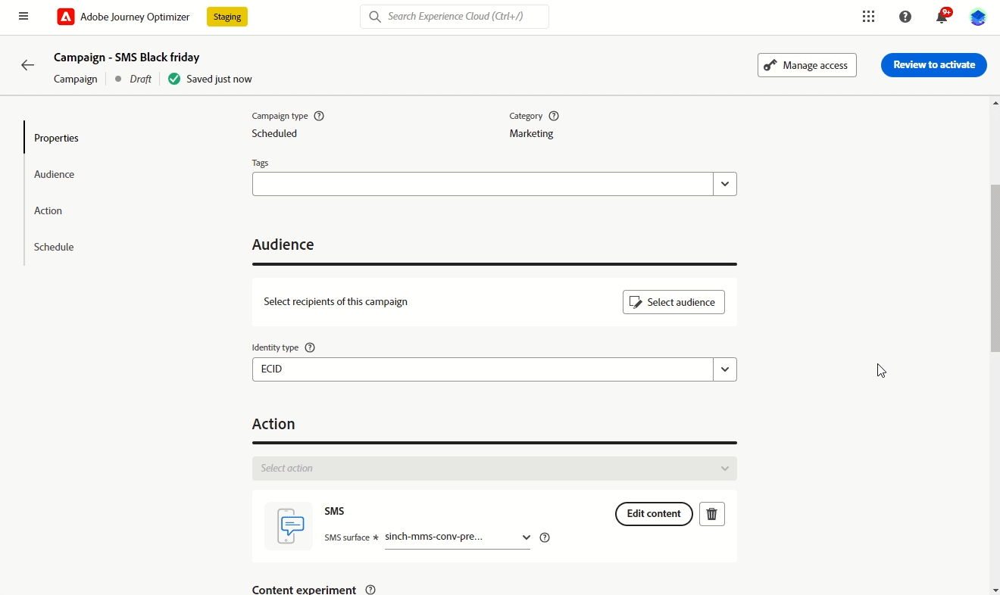
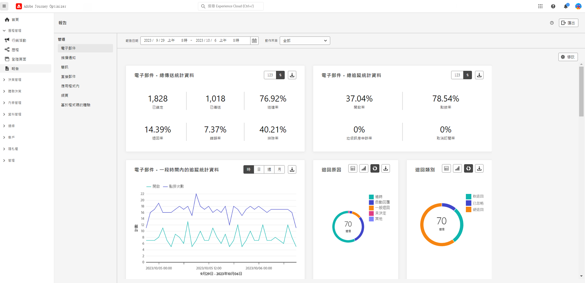
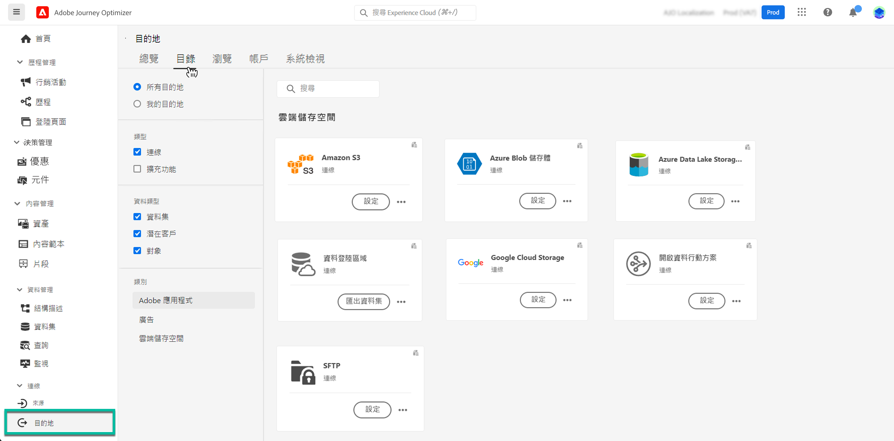
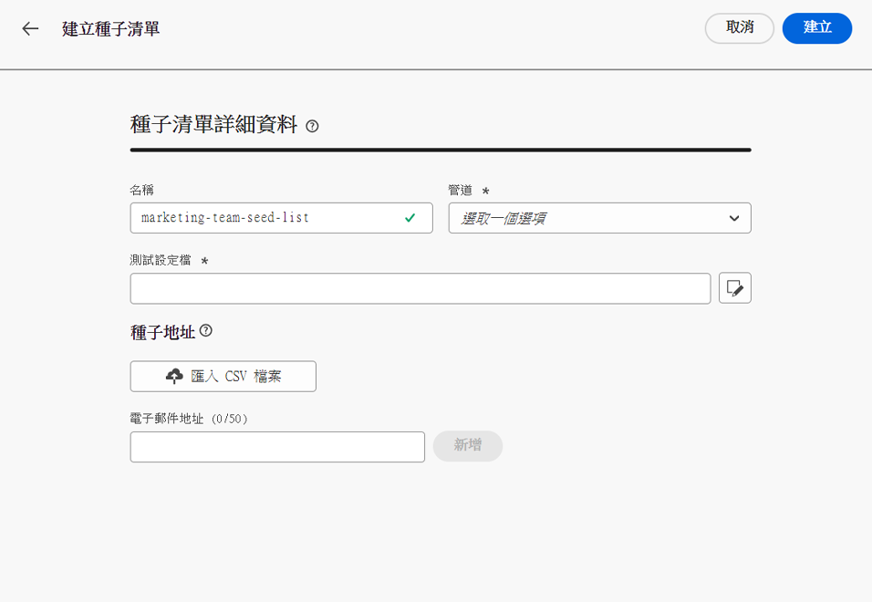
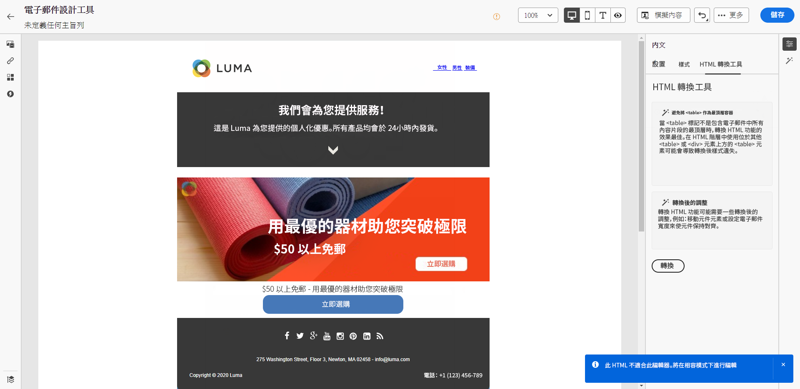
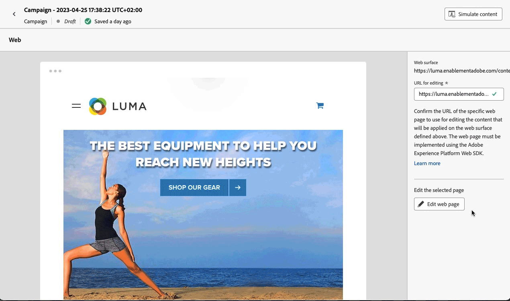

# 發行說明 2023 年 {#release-notes-2023}

此頁面列出了於 2023 年發行的[!DNL Journey Optimizer]所有功能和改善。

## 2022 年 10 月發行版本 {#oct-rn-2023}

### 全新功能{#oct-2023-features}

此發行版本提供下列新功能。

<table>
<thead>
<tr>
<th><strong>沙箱工具</strong> </th>
</tr>
</thead>
<tbody>
<tr>
<td>

沙箱工具可讓您運用套件匯出和匯入功能，跨多個沙箱複製物件。 套件可以包含單一物件或多個物件。 套件中包含的任何物件都必須來自相同沙箱。

<!--img src="../data/assets/dataset-export-setup.png"-->

如需詳細資訊，請參閱<a href="../building-journeys/copy-to-sandbox.md">詳細文件</a>。

</td>
</tr>
</tbody>
</table>

<table>
<thead>
<tr>
<th><strong>簡訊中的多媒體訊息服務 (MMS)</strong> </th>
</tr>
</thead>
<tbody>
<tr>
<td>

透過簡訊管道，您現在可以傳送多媒體訊息服務 (MMS) 訊息，來與客戶分享影像、GIF 或影片，藉此增強通訊交流。 請注意，目前只有 Sinch 提供此功能。

如需詳細資訊，請參閱<a href="../sms/create-sms.md#mms-content">詳細說明文件</a>。

</tr>
</tbody>
</table>

### 功能改進 {#oct-2023-improvements}

此發行版本隨附下列改善項目。

**客群**

* 您現在可以鎖定從 CSV 檔案上傳至歷程和行銷活動中的目標客群。[了解更多](../audience/about-audiences.md#segments-in-journey-optimizer)
* 您現在可以鎖定透過客群構成所建立的目標客群，並在歷程中運用擴充屬性。 [了解更多](../building-journeys/read-audience.md)

>[!AVAILABILITY]
>
>這些功能目前以測試版形式提供。

<!--
**Spam scoring for emails**

* When simulating an email content, a new option enables you to check how your content performs against inboxes spam filtering. This feature is currently proposed to a set of customers only (Limited Availability), and available for the Email channel.-->

**行銷活動**

<!--* You can now stop a live one-time campaign, make modifications and resume it again. This improvement is available in Beta.-->
* 當您的其中一個行銷活動發生錯誤時，警告圖示現在會與行銷活動的狀態一起出現在行銷活動清單中。[了解更多](../campaigns/manage-campaigns.md#statuses)

**歷程**

* 現在，您可在任何等待時間中定義的最長期間是 29 天，而不是 30 天。此項改進的目的是在防止等待的持續時間超過 30 天的歷程期限。 這適用於：

   * [等待活動](../building-journeys/wait-activity.md)中的&#x200B;**時間長度**&#x200B;欄位
   * [歷程屬性](../building-journeys/journey-properties.md#entrance)中的&#x200B;**重新進入等待期**
   * [事件活動](../building-journeys/general-events.md#events-specific-time)逾時定義中的&#x200B;**等待**&#x200B;欄位。

<!--
**Consent in channel configuration**

* You can now select a marketing action at the channel configuration level. When used in a surface, all consent policies associated with that marketing action are leveraged in order to respect the preferences of your customers.-->

**決策管理**

* 已更新與決策管理介面中的產品建議上限相關的幾個標籤。 [了解更多](../offers/offer-library/add-constraints.md#capping)

## 2023 年 9 月發行版本 {#sept-rn-2023}

### 全新功能{#sept-2023-features}

此發行版本提供下列新功能。

<table>
<thead>
<tr>
<th><strong>計算屬性</strong> </th>
</tr>
</thead>
<tbody>
<tr>
<td>

計算屬性可讓您透過直覺式使用者介面，輕鬆地將事件資料總結為輪廓屬性，以增強行為型細分、個人化和啟用。 透過此功能，您可以自助建立計算屬性、管理這些屬性，並用於細分、即時客戶輪廓目的地或 Journey Optimizer。  
此外，計算屬性可簡化細分和歷程工作流程，協助您順暢地提供相關體驗。 在<a href="../audience/computed-attributes.md">詳細文件</a>中了解更多相關資訊。

</tr>
</tbody>
</table>

<table>
<thead>
<tr>
<th><strong>合併的頻道報告</strong> </th>
</tr>
</thead>
<tbody>
<tr>
<td>

頻道報告功能為分析師和行銷人員提供頻道層級流量和參與量度的全面概觀。 

若要存取<b>報告</b>功能表，您必須擁有<b>檢視頻道報告</b>權限。

如需詳細資訊，請參閱<a href="../reports/channel-report-cja.md">詳細文件</a>。

</tr>
</tbody>
</table>

<table>
<thead>
<tr>
<th><strong>資料集匯出目的地 (GA)</strong> </th>
</tr>
</thead>
<tbody>
<tr>
<td>

現已正式推出將 Journey Optimizer 資料集匯出至雲端儲存空間目的地的功能。 此功能可讓您與雲端儲存空間位置建立即時連線，以匯出資料集的內容。 

如需詳細資訊，請參閱<a href="../data/export-datasets.md">詳細文件</a>。

</td>
</tr>
</tbody>
</table>

<table>
<thead>
<tr>
<th><strong>每個沙箱行動應用程式認證儲存</strong> </th>
</tr>
</thead>
<tbody>
<tr>
<td>

這項新功能可讓您輕鬆管理推播認證，並將其與應用程式介面中的專用沙箱建立關聯。

如需詳細資訊，請參閱<a href="../in-app/inapp-configuration.md#channel-prerequisites">詳細說明文件</a>。

</tr>
</tbody>
</table>

### 功能改進 {#sept-2023-improvements}

此發行版本隨附下列改善項目。

**決策管理**

* 現已推出用於建立和管理決策管理物件的新 API。這些 API 可以提升效能並增強使用者體驗。 舊版 API 支援將持續至 2024 年 3 月 27 日為止。 [進一步了解](../offers/api-reference/getting-started.md)

**個人化**

* 除了視覺化片段之外，現在還可以透過運算式編輯器從 Journey Optimizer 介面建立、儲存及重複使用運算式片段。 運算式片段會取代先前儲存的運算式。[了解更多](../personalization/use-expression-fragments.md)

**警示**

* 已引進新類型的系統警示。現在您可以在&#x200B;**讀取客群**&#x200B;活動失敗時收到通知。 [了解更多](../reports/alerts.md)。

**網路頻道**

* 單頁應用程式 (SPA) 現在可以在網頁視覺化編輯器中編寫，這可讓您選取要對哪些特定檢視套用網頁修改內容。 檢視可定義為整個網站或網站上一組視覺化元素，例如首頁、整個產品網站或所有結帳頁面上的傳遞偏好設定框架。 需進行開發人員一次性設定，以定義 Adobe Experience Platform Web SDK 實作中的檢視；這可讓行銷人員在 SPA 上建立和執行 Adobe Journey Optimizer 網路行銷活動。 [了解更多](../web/web-spa.md)

* 使用網頁設計工具編輯頁面時，您現在可以直接從「修改」窗格新增對內容的新變更，而不需要從設計工具介面選取元件並加以編輯。 [了解更多](../web/manage-web-modifications.md#add-modifications)

* 設定網頁子網域時，除了使用已委派給 Adobe 的子網域外，您現在可以選擇新增自己的子網域。 [了解更多](../web/web-delegated-subdomains.md#web-configure-new-subdomain)

**歷程**

* 複製歷程時，您現在可以定義歷程副本的名稱。 [了解更多](../building-journeys/journey-gs.md#duplicate-a-journey)

* 自訂動作回應的支援現已全面推出。 此功能可讓您在自訂動作中運用 API 呼叫回應，並根據這些回應協調歷程。此外，已新增[新的上限護欄](../start/guardrails.md#custom-actions-g)以自動限制自訂動作呼叫。[了解更多](../action/action-response.md)
<!--
* The maximum duration that you can define in the Wait activity is now 29 days instead of 30.
-->

**電子郵件頻道**

* 電子郵件表面設定中的新選項可讓您選擇將交易型訊息傳送至輪廓，即使其電子郵件地址在 Adobe [!DNL Journey Optimizer] 禁止清單中亦然。[了解更多](../email/email-settings.md#send-to-suppressed-email-addresses)

**簡訊頻道**

* **選擇加入訊息**&#x200B;和&#x200B;**說明訊息**&#x200B;這兩個新欄位已新增至 API 設定畫面，可讓使用者自訂傳入關鍵字的回應。 請注意，這僅適用於 Sinch 簡訊提供者。 [了解更多](../sms/sms-configuration.md)

* 簡訊選擇退出不再於頻道層級管理。 現在這是號碼特定功能，亦即如果部分輪廓選擇退出指定號碼或短代碼，您仍可使用其他正用來傳送簡訊的號碼，將訊息傳送給輪廓。 新選項可讓您選取要用於指定表面的&#x200B;**選擇退出號碼**。 [了解更多](../sms/sms-configuration.md)

**直接郵件頻道**

* 現在，將檔案傳輸至伺服器時，您可以將提供給直接郵件提供者的檔案加密。 若要執行此操作，檔案路由設定畫面中提供的新欄位，可讓您複製並貼上加密金鑰。 [了解更多](../direct-mail/direct-mail-configuration.md)

**報告**

* 您現在可以將 Journey Optimizer 報告匯出為 CSV 檔案。在[詳細文件](../reports/report-gs-cja.md)中了解更多相關資訊。

**資產**

* Assets 的新選項可讓您在 Journey Optimizer 中選擇 Assets 的存放庫。 如果您擁有此解決方案，您可以選擇使用 Assets Essentials 存放庫或 Assets as a Cloud Service 存放庫。 [了解更多](../integrations/assets.md)

<!--**Decision management**

Enhancements have been made to the audience picker in journeys or campaigns, with the addition of new columns displaying the origin and update frequency of audiences.    -->

## 2023 年 8 月發行版本 {#aug-rn-2023}

### 全新功能{#aug-2023-features}

此發行版本提供下列新功能。

<table>
<thead>
<tr>
<th><strong>在歷程中傳送應用程式內訊息</strong> </th>
</tr>
</thead>
<tbody>
<tr>
<td>

您現在可以在歷程中將個人化的應用程式內訊息傳送給應用程式使用者。 使用 Journey Optimizer 來設計通知並自訂訊息版面、顯示、文字及按鈕，以建立順暢的體驗。

如需詳細資訊，請參閱<a href="../in-app/create-in-app.md">詳細文件</a>。

</tr>
</tbody>
</table>

<table>
<thead>
<tr>
<th><strong>使用種子清單驗證電子郵件</strong> </th>
</tr>
</thead>
<tbody>
<tr>
<td>

現在您可在 Journey Optimizer 中建立和管理種子清單。 種子清單包含內部地址 (可以新增到實際客群) 並在傳送執行時收到與目標輪廓完全相同的訊息。 使用此功能可監視所傳送的通訊，並確保所有顯示格式、URL、影像和連結均正確無誤。

如需詳細資訊，請參閱<a href="../configuration/seed-lists.md">詳細說明文件</a>。

</td>
</tr>
</tbody>
</table>

<!--table>
<thead>
<tr>
<th><strong>Generate text and images with the Content assistant</strong> </th>
</tr>
</thead>
<tbody>
<tr>
<td>

Once you have created and personalized your message, take your content to the next level with the Content assistant. You can now use the Content assistant to optimize your message's impact by experimenting with different main titles, and images. Each variant is managed as a unique Treatment, to measure and compare which title effectively generates more clicks.

This capability is currently available as a private beta.

For more information, refer to the <a href="../start/search-filter-categorize.md#tags">detailed documentation</a>.

</td>
</tr>
</tbody>
</table-->

### 功能改進 {#aug-2023-improvements}

此發行版本隨附下列改進項目。

<!--
**APIs**

A new API to create and manage Content Fragments is now available. [Learn more](https://developer.adobe.com/journey-optimizer-apis/references/content-templates/#tag/Content-fragment-API){target="_blank"}.-->

<!--**Email channel**

A new option is available in the email surface settings to include email addresses suppressed due to spam complaint in your transactional messages audiences. Even if they marked marketing messages as spam, these profiles can then receive transactional messages, such as password reset or account statements. This option is disabled by default.-->

**歷程**

* 您現在可以在自訂動作中運用 API 呼叫回應，並根據這些回應精心安排您的歷程。此功能目前以 Beta 的形式提供。[了解更多](../action/action-response.md)。
* 已引進新類型的系統警報。您現在可以在自訂動作失敗時收到通知。[了解更多](../reports/alerts.md)。
  <!--* When duplicating a journey, you can now define the name of the journey copy.-->

**直接郵件**

* 現在可以在檔案路由設定中選取 Azure 作為伺服器型別。 [了解更多](../direct-mail/direct-mail-configuration.md#file-routing-configuration)
* ＆ 現在可作為直接郵件表面設定中的欄分隔符號欄位使用。 [了解更多](../direct-mail/direct-mail-configuration.md#direct-mail-surface)

## 2023 年 7 月發行版本 {#july-rn-2023}

### 新功能{#july-2023-features}

<table>
<thead>
<tr>
<th><strong>客群構成</strong> </th>
</tr>
</thead>
<tbody>
<tr>
<td>

您現在可以建立構成工作流程，將現有 Adobe Experience Platform 客群與視覺畫布結合，並利用各種活動 (分割、擴充...) 來建立新客群。 新建立的客群會與現有客群一起儲存回 Adobe Experience Platform，並可在 Journey Optimizer 行銷活動中運用，來鎖定目標客戶。

如需詳細資訊，請參閱<a href="../audience/get-started-audience-orchestration.md">詳細文件</a>。

客群構成已與新的 Adobe Experience Platform「客群」選單完全整合，該選單可作為客群的集中式入口網站。 您現在可以使用瀏覽頁面，利用其中具有區段趨勢和重疊的新儀表板 ，來發掘新的深入分析，以及探索以資料夾與標記整理歸類的組織工具。 此體驗包含標準化客群標籤的治理控制項，以及管理啟用工作流程的客群生命週期管理功能。 有了這項新的管理體驗，您現在可以輕鬆安全地從單一位置管理客群。 如需詳細資訊，請參閱 <a href="https://experienceleague.adobe.com/docs/experience-platform/segmentation/ui/overview.html?lang=zh-Hant" target="_blank">Adobe Experience Platform 文件</a>。

</td>
</tr>
</tbody>
</table>

<table>
<thead>
<tr>
<th><strong>直接郵件頻道</strong> </th>
</tr>
</thead>
<tbody>
<tr>
<td>

您現在可以在行銷活動中新增直接郵件訊息。 直接郵件是離線頻道，可讓您個人化和產生直接郵件提供者傳送郵件給客戶所需的檔案。

當您準備傳送直接郵件時，Journey Optimizer 會產生一個檔案，其中包含所有目標輪廓和選擇的聯絡資訊 (例如，郵遞區號)。然後，您就可以將此檔案傳送給直接郵件提供者，由他們負責實際傳送。

目前，直接郵件頻道不適用於已購買 Adobe Healthcare Shield 附加產品的組織。

如需詳細資訊，請參閱<a href="../direct-mail/get-started-direct-mail.md">詳細文件</a>。

</tr>
</tbody>
</table>

<table>
<thead>
<tr>
<th><strong>為電子郵件設計工具轉換 HTML 內容</strong> </th>
</tr>
</thead>
<tbody>
<tr>
<td>

您現在可以在 Journey Optimizer 的電子郵件編輯器中匯入和轉換任何 HTML 內容。 在電子郵件設計工具中，可自動識別和提供內容區塊：使用該工具的強大設計功能來更新和個人化！

如需詳細資訊，請參閱<a href="../email/existing-content.md">詳細文件</a>。

</td>
</tr>
</tbody>
</table>

<table>
<thead>
<tr>
<th><strong>在 Journey Optimizer 中使用標記</strong> </th>
</tr>
</thead>
<tbody>
<tr>
<td>

除了行銷活動和歷程之外，您現在還可以將 Adobe Experience Platform 整合標籤指派給登陸頁面、內容範本、片段及訂閱清單。 這可讓您輕鬆分類，以及改善所有清單的搜尋和導覽。 

如需詳細資訊，請參閱<a href="../start/search-filter-categorize.md#tags">詳細文件</a>。

</td>
</tr>
</tbody>
</table>

<table>
<thead>
<tr>
<th><strong>內容範本 API</strong> </th>
</tr>
</thead>
<tbody>
<tr>
<td>

您現在可以使用專用的 API 來建立和管理 Adobe Journey Optimizer 內容範本，與現有的內容系統緊密整合。

如需詳細資訊，請參閱<a href="https://developer.adobe.com/journey-optimizer-apis/references/content/">詳細說明文件</a>。

</td>
</tr>
</tbody>
</table>

### 功能改進 {#july-2023-improvements}

此發行版本隨附下列改善項目。

**行銷活動**

與行銷活動相關的內容事件現在可用於個人化編輯器的「內容屬性」選單。

**客群**

已增強歷程或行銷活動中的客群選取器功能，新增數欄顯示客群的來源與更新頻率。隨著客群構成入口網站的發行，Adobe Experience Platform 與 Adobe Journey Optimizer 已更新系統和文件內的「客群」與「區段」的使用方式。

* 客群：一組具有共同特徵和行為的人員、帳戶、家庭或其他實體。
* 區段定義：在 Adobe Experience Platform 中，用來描述目標客群之關鍵特性或行為的規則。 此辭彙先前稱為「區段」。

因此，在 Adobe Journey Optimizer 和 Adobe Experience Platform UI 中，您會看到「區段」被「客群」取代，以反映建立和管理客群的新路徑。

**API**

已棄用產生 Adobe Journey Optimizer APIsauthentication 存取權杖的 JWT 方法。 務必使用 OAuth 伺服器對伺服器驗證方法來建立所有新的整合。 Adobe 也建議您將現有的整合移轉至 OAuth 方法。 [了解更多](https://developer.adobe.com/journey-optimizer-apis/references/authentication/){target="_blank"}。

**其他變更**

所有公開測試版客戶現在都能將 Journey Optimizer 資料集匯出至雲端儲存空間目標。 此功能可讓您與雲端儲存空間位置建立即時連線，以匯出資料集的內容。 [了解更多](../data/export-datasets.md)

## 2022 年 6 月發行版本 {#june-rn-2023}

<table>
<thead>
<tr>
<th><strong>適用於行銷使用案例的 API 觸發行銷活動</strong> </th>
</tr>
</thead>
<tbody>
<tr>
<td>

您現在可以從外部系統使用 API，在 Adobe Journey Optimizer 中觸發行銷活動。

在此發行版本之前，API 觸發的行銷活動功能涵蓋各種操作和異動訊息傳送需求，例如密碼重設或 OTP 權杖，但無法用於建立行銷活動。 API 觸發的行銷活動可用管道包括：電子郵件、簡訊及推播訊息。

如需詳細資訊，請參閱<a href="../campaigns/api-triggered-campaigns.md">詳細文件</a>。
</td>
</tr>
</tbody>
</table>

<!--
### Improvements {#june-2023-improvements}

**Audiences**

Enhancements have been made to the audience picker in journeys or campaigns, with the addition of new columns displaying the origin and update frequency of audiences.

**Journeys**

You can now leverage API call responses in custom actions and orchestrate your journey based on these responses.
-->

<!--
## June 2023 early release notes {#june-rn-2023}

Information below is subject to change without prior notice until the release availability date. Updated documentation will be published at the release date, and direct links will be added on this page.

**Audiences**

Enhancements have been made to the audience picker in journeys or campaigns, with the addition of new columns displaying the origin and update frequency of audiences.    

**Journeys**

* You can now leverage API call responses in custom actions and orchestrate your journey based on these responses.     

* A new type of system alert has been introduced. You can now get notified when a custom action fails.
-->

## 2023 年 5 月發行版本 {#may-rn-2023}

### 新功能{#may-2023-features}

<table>
<thead>
<tr>
<th><strong>行銷活動的內容實驗</strong> </th>
</tr>
</thead>
<tbody>
<tr>
<td>

Adobe Journey Optimizer 現在支援行銷活動實驗。 實驗是在線上測試的情境下進行的隨機試驗，意即某些隨機選取的使用者會接觸到訊息的指定變化，而另一組隨機選取的使用者則會接觸到一些其他處理方式。 接觸到後，您就可以測量感興趣的結果量度，例如電子郵件開啟、訂閱或購買數。

如需詳細資訊，請參閱<a href="../content-management/content-experiment.md">詳細文件</a>。

</td>
</tr>
</tbody>
</table>

<!--
<table>
<thead>
<tr>
<th><strong>Objective reporting and performance measurement in campaigns</strong> </th>
</tr>
</thead>
<tbody>
<tr>
<td>

You can now measure the performance of your campaigns across inbound and outbound through dedicated reports. Adobe Journey Optimizer reports can retrieve additional metrics to use in the Objectives tab of your campaign reports.

For more information, refer to the <a href="../reports/campaign-global-report-cja.md">detailed documentation</a>.

</td>
</tr>
</tbody>
</table>
-->

<table>
<thead>
<tr>
<th><strong>在電子郵件內容中建立和使用片段</strong> </th>
</tr>
</thead>
<tbody>
<tr>
<td>

您現在可以製作、使用和管理片段，以快速組合電子郵件與內容範本。 片段是預先建立的可重複使用元件，可在跨 Journey Optimizer 行銷活動和歷程的多封電子郵件中參考，以改進和加快設計流程。

如需詳細資訊，請參閱<a href="../content-management/fragments.md">詳細文件</a>。

</td>
</tr>
</tbody>
</table>

<table>
<thead>
<tr>
<th><strong>在您的行銷活動中使用標籤 (測試版)</strong> </th>
</tr>
</thead>
<tbody>
<tr>
<td>

您現可指派 Adobe Experience Platform 統一標籤至行銷活動。 這可讓您輕鬆分類，並改進行銷活動清單的搜尋。 請注意，統一標籤功能目前仍在測試中。

如需詳細資訊，請參閱<a href="../start/search-filter-categorize.md#tags">詳細文件</a>。

</td>
</tr>
</tbody>
</table>

<table>
<thead>
<tr>
<th><strong>Personalized Optimization AI 排名模型 (一般可用性)</strong> </th>
</tr>
</thead>
<tbody>
<tr>
<td>

Personalized Optimization AI 排名模型現在通常可在決策管理中使用。 這種新類型的模型可讓您根據客群與產品建議績效來將產品建議最佳化和個人化。

如需詳細資訊，請參閱<a href="../offers/ranking/personalized-optimization-model.md">詳細說明文件</a>。

</td>
</tr>
</tbody>
</table>

### 改善 {#may-2023-improvements}

**客群**

* 為了因應全面推出的 Audience Portal 功能，Adobe Experience Platform 正在更新系統和文件內「對象」和「區段」的使用情況。

   * 客群：一組具有共同特徵和行為的人員、帳戶、家庭或其他實體。
   * 區段定義：在 Adobe Experience Platform 中，用來描述目標客群之關鍵特性或行為的規則。 此辭彙先前稱為「區段」。

  因此，在 Adobe Journey Optimizer 和 Adobe Experience Platform UI 中，您會看到「區段」被「客群」取代，以反映建立和管理客群的新路徑。

  在指稱目標為接收訊息的一組輪廓時，「客群」一詞的翻譯已在部分語言的所有數位體驗產品中保持一致：

   * 德文：Zielgruppe
   * 巴西葡萄牙文：público-alvo
   * 西班牙文：público destinatario

<!--* Enhancements have been made to the audience picker in journeys or campaigns, with the addition of new columns displaying the origin and update frequency of audiences.-->

**簡訊頻道**

* 在設定您的簡訊管道設定時，Infobip 已新增為供應商提供者。 [閱讀全文](../sms/sms-configuration.md)
* Twillio - API 認證設定現在包含新增傳送訊息服務 SID 的功能，以便與您的 Twillio 帳戶緊密整合。 [閱讀全文](../sms/sms-configuration.md)

**應用程式內頻道**

* 新增 Adobe 地標服務的新訊息觸發規則。 [閱讀全文](../in-app/inapp-configuration.md)
* 新增新的 Adobe Experience Platform 保證功能，以擷取裝置事件並新增為觸發規則。

<!--
**Journeys**

* You can now leverage API call responses in custom actions and orchestrate your journey based on these responses.
-->

**行銷活動**

* 現在可以使用省略符號動作選單從庫存畫面複製行銷活動。 [閱讀全文](../campaigns/manage-campaigns.md#duplicate)
* 您現在可以刪除即時行銷活動的草稿修改。
* 啟用行銷活動的步驟現已簡化。 [閱讀全文](../campaigns/manage-campaigns.md)

**決策管理**

* 如果產品建議具有&#x200B;**[!UICONTROL 草稿]** 狀態，之前從未發佈且已啟用頻率上限，您現在可以編輯頻率上限。 [閱讀全文](../offers/offer-library/add-constraints.md#frequency-capping)

**個人化**

* 在 HTML 內容中工作時，您現在可以直接從個人化編輯器中選取和插入資產參考。

### 修正{#may-2023-fixes}

* 應用程式內訊息 — 修正行銷活動排程與訊息頻率設定衝突的問題。

## 2023 年 4 月發行版本 {#apr-rn-2023}

<!--Information below is subject to change without prior notice until the release availability date. Updated documentation will be published at the release date, and direct links will be added on this page.

**Release date**: April 27, 2023-->

### 新功能{#apr-2023-features}

<table>
<thead>
<tr>
<th><strong>網路頻道 (一般可用性)</strong> </th>
</tr>
</thead>
<tbody>
<tr>
<td>

Adobe Journey Optimizer 透過新增網路頻道支援，來擴充其跨頻道功能。您現在可以和其他任何頻道一樣，透過直覺式的智慧型視覺介面編寫、變更和預覽網路體驗，打造自己的個人化使用者體驗。請注意，目前您只能在 Journey Optimizer 中建立行銷活動中的網路體驗。

如需詳細資訊，請參閱<a href="../web/get-started-web.md">詳細文件</a>。

</tr>
</tbody>
</table>

<table>
<thead>
<tr>
<th><strong>Mobile 上線快速入門工作流程 (測試版)</strong> </th>
</tr>
</thead>
<tbody>
<tr>
<td>

全新 Mobile 上線快速入門工作流程現已推出。使用此新產品功能來快速設定 Mobile SDK，以開始收集和驗證行動事件資料，並透過 Adobe Journey Optimizer 傳送行動推播通知。這項功能可透過「資料彙集」首頁以公開 Beta 版的形式存取。

如需詳細資訊，請參閱<a href="../push/mobile-onboarding-wf.md">詳細文件</a>。

</td>
</tr>
</tbody>
</table>

<table>
<thead>
<tr>
<th><strong>新歷程儀表板 (測試版)</strong> </th>
</tr>
</thead>
<tbody>
<tr>
<td>

 歷程儀表板現在分成兩個標籤：

<ul><li>使用<strong>概觀</strong>標籤來存取顯示與您的歷程相關的關鍵量度新儀表板。</li>
<li>使用<strong>瀏覽</strong>標籤來存取所有歷程的清單。</li></ul>

此功能可在公開測試版的所有歷程中使用。

如需詳細資訊，請參閱<a href="../building-journeys/journey-gs.md#journey-access">詳細說明文件</a>。

</td>
</tr>
</tbody>
</table>

### 功能改進 {#april-2023-improvements}

**歷程**

* 歷程畫布現在會在訊息活動和結束標籤上顯示活動 ID。這可改善報告和重新目標定位。
* 顯示在動作、資料來源、事件和歷程中的設定窗格，其版面配置已有所改善。
* 對畫布上的節點數提供新分析，搭配保障措施協助成長：利用每個歷程最多可有 50 個的節點，讓歷程易於閱讀、進行 QA 及疑難排解。 [閱讀全文](../start/guardrails.md#journeys-guardrails-journeys)
* 在歷程中新增[電子郵件](../email/create-email.md)、[簡訊](../sms/create-sms.md)或[推播](../push/create-push.md)動作時，現在依預設會以目前歷程中，最後一個為該管道使用的表面來預先填入表面。
* 您現在可以在自訂動作中定義靜態或動態查詢參數。[了解更多](../action/about-custom-action-configuration.md#url-configuration)

**報告**

* 您現在可以將 Journey Optimizer 報告匯出為 PDF。[了解更多](../reports/report-gs-cja.md)

**內容設計工具**

* Adobe Journey Optimizer 內容設計工具已更新，現在能更輕鬆存取設計樣式和元件。這個新版本提出經過改善的使用者體驗，並帶來效能提升、深色模式部分相容性，以及新的協助工具標準支援。

## 2023 年 3 月發行版本 {#mar-2023}

### 新功能{#mar-2023-features}

<table>
<thead>
<tr>
<th><strong>應用程式內通道 (一般可用性)</strong> </th>
</tr>
</thead>
<tbody>
<tr>
<td>

您現在可以在行銷活動中將個人化的應用程式內訊息傳送給您的應用程式使用者。使用 Journey Optimizer 來設計通知並自訂訊息版面、顯示、文字及按鈕，以建立順暢的體驗。

如需詳細資訊，請參閱<a href="../../rp_landing_pages/in-app-landing-page.md">詳細文件</a>。

</tr>
</tbody>
</table>

<table>
<thead>
<tr>
<th><strong>簡訊點擊追蹤</strong> </th>
</tr>
</thead>
<tbody>
<tr>
<td>

透過簡訊點擊追蹤，您可以監控縮短 URL 的效果、識別誰點擊了 URL，並利用此資料透過後續行銷活動重新鎖定這些客戶。

如需詳細資訊，請參閱<a href="../sms/create-sms.md#sms-content">詳細文件</a>。

</td>
</tr>
</tbody>
</table>

<table>
<thead>
<tr>
<th><strong>在您的歷程使用標籤 (測試版)</strong> </th>
</tr>
</thead>
<tbody>
<tr>
<td>

身為 Journey Optimizer 從業人員，您現在可以使用標籤來組織業務物件。標籤是一種快速、簡便的物件分類方法，用於改進搜尋。此功能目前處於測試階段，僅適用於歷程。

如需詳細資訊，請參閱<a href="../start/search-filter-categorize.md#tags">詳細說明文件</a>。

</td>
</tr>
</tbody>
</table>

### 功能改進 {#mar-2023-improvements}

**歷程**

* 新&#x200B;**限制 API** 可讓您設定每秒傳送事件數的上限，防止外部系統或 API 出現流量尖峰。當達到設定限制時，所有後續 API 呼叫會以接收順序排入佇列並盡快處理。請注意，此功能僅支援跨所有沙箱進行一種限制設定。[了解更多](../configuration/external-systems.md)
* 已增強歷程畫布，提供更簡單且改善的使用者體驗。 在畫布的每個路徑結尾處，已移除空白預留位置。 您現在只需將活動拖曳到路徑結尾即可新增活動。
* 在歷程畫布，**結束**&#x200B;標籤的標籤不再自動設定為先前活動的名稱。使用者可視需要手動新增自訂標籤。
* 歷程屬性中的預設逾時和錯誤持續時間已從 5 秒變更為 30 秒。[了解更多](../configuration/external-systems.md#timeout)
* 讀取客群活動的預設節流率已從每秒 20,000 則訊息變更為每秒 5,000 則訊息。 [了解更多](../building-journeys/read-audience.md#configuring-segment-trigger-activity)
* 已將護欄新增至測試模式，以只監聽透過介面傳送的事件。透過外部工具傳送的事件不會納入考量。[進一步了解](../building-journeys/testing-the-journey.md)

<!-- 
* When adding an Email, SMS or Push action in a journey, the surface is now pre-filled, by default, with the last used surface for that channel.
* A new type of system alert has been introduced. You can now get notified when a custom action fails. [Learn more](../reports/alerts.md)
* Timeout and error management has been improved in journeys. Timeout and error paths are now always added on the canvas. A new toolbar button is available to show/hide these paths. [Learn more](../building-journeys/journey-gs.md#timeout_and_error)
* The Journey dashboard is now split in two tabs:
    * Use the **Overview** tab to access a new dashboard which displays key metrics related to your journeys.
    * Use the **Browse** tab to access list of all journeys.
-->

**決定管理**

* 為避免與 Adobe Experience Platform 最近發佈的標籤功能產生混淆，「決策管理」標籤已重新命名為「集合限定詞」。 

  請注意，雖然「標籤」一詞不再用於決策管理使用者介面，但仍用於 API 及資料集等後端服務。

* 您現在可以每天、每週或每月重設產品建議限定計數器。[了解更多](../offers/offer-library/add-constraints.md#capping)

* 您也可以選擇應查看哪個 Adobe Experience Platform 事件以設定 Offer Decisioning 上限。[了解更多](../offers/offer-library/add-constraints.md#capping)

* 已在版位建立畫面中新增其他參數。它們可讓您控制某個活動內容是否可在多個版位之間複製，以及指定是否應將該活動內容的內容與中繼資料包含在 API 回應中。 [了解更多](../offers/offer-library/creating-placements.md)

**個人化**

* 您現在可以在運算式編輯器中包含字串式輪廓屬性的預設遞補文字。如果選取的屬性未傳回任何結果，則會顯示這些值。[了解更多](../personalization/personalization-build-expressions.md#add)

**報告**

* 報告小工具功能已得到改善，可自訂使用者檢視其資料的方式。透過這項改善，使用者現在可以在多個視覺效果選項之間進行選擇，包括圖表、表格和環圈圖。 

  若要存取最新的小工具，請注意您必須重設不同的報告儀表板。 如需儀表板客製化的詳細資訊，請參閱[詳細文件](../reports/report-gs-cja.md)。

## 2023 年 2 月發行版本 {#feb-2023}

### 新功能{#feb-2023-features}

<table>
<thead>
<tr>
<th><strong>應用程式內頻道 (測試版)</strong> </th>
</tr>
</thead>
<tbody>
<tr>
<td>

您現在可以在行銷活動中將個人化的應用程式內訊息傳送給您的應用程式使用者。使用 Journey Optimizer 來設計通知並自訂訊息版面、顯示、文字及按鈕，以建立順暢的體驗。

<strong>注意</strong> - 此功能目前為測試版，僅供測試版客戶使用。 若要加入 Beta 版計畫，請連絡 Adobe 客戶服務。

如需詳細資訊，請參閱<a href="../../rp_landing_pages/in-app-landing-page.md">詳細文件</a>。

</td>
</tr>
</tbody>
</table>

<table>
<thead>
<tr>
<th><strong>將 Journey Optimizer 資料集匯出至雲端儲存空間目的地 (測試版)</strong> </th>
</tr>
</thead>
<tbody>
<tr>
<td>

您現在可以與雲端儲存空間位置建立即時連線，以匯出資料集的內容。 可用目的地包括：Amazon S3 雲端儲存空間、 Azure Blob、Azure Data Lake Gen 2、資料登陸區、Google 雲端儲存空間、SFTP。

<strong>注意</strong> - 此功能目前為測試版，所有 Adobe Journey Optimizer 使用者都能使用。 如果您尚未擁有存取權，請與 Adobe 代表合作，取得目的地的存取權。

如需詳細資訊，請參閱<a href="../data/export-datasets.md">詳細說明文件</a>。

</td>
</tr>
</tbody>
</table>

<!--

<table>
<thead>
<tr>
<th><strong>Performance Measurement in campaigns</strong> </th>
</tr>
</thead>
<tbody>
<tr>
<td>

You can now measure the performance of your campaigns across inbound and outbound through dedicated reports. Adobe Journey Optimizer reports can retrieve additional metrics to use in the <strong>Objective</strong> tab of your campaign reports. 

For more information, refer to the <a href="../privacy/data-hygiene.md">detailed documentation</a>.

</td>
</tr>
</tbody>
</table>

+++ Learn more about Performance Measurement

The **[!UICONTROL Objective]** tab of your Campaign report allows you to better fine-tune your deliveries' reports by targeting one specific metric. With this feature, you can effectively track and analyze your campaign's performance and make informed decisions to improve your results.

The **[!UICONTROL Objectives]** listed are linked to **[!UICONTROL Datasets]** that define a connection to a system in order to retrieve additional information. A list of pre-configured **[!UICONTROL Objectives]** is available, but you can also customize your report by adding new **[!UICONTROL Datasets]** and defining your own objectives. 

By selecting the desired Objectives, the **[!UICONTROL Performance overview]** and **[!UICONTROL Campaign objective]** widgets provide a comprehensive and insightful summary of your delivery performance, allowing you to closely monitor and evaluate the success of your campaign.

With the **[!UICONTROL Campaign objective]** widget, you can also choose to compare your primary objective against another performance metric.

Note that each widget can be resized and deleted as needed.
+++

<table>
<thead>
<tr>
<th><strong>Use Tags in your Journeys</strong> </th>
</tr>
</thead>
<tbody>
<tr>
<td>

As a Journey Optimizer practitioner, you can now organize your business objects using tags. Tags are a quick and easy way of classifying objects to improve search. Tags are currently only available for Journeys.

</td>
</tr>
</tbody>
</table>

-->

### 功能改進 {#feb-2023-improvements}

**歷程**

* 此&#x200B;**重新進入等待期**&#x200B;欄位已新增至歷程屬性。此欄位可讓您定義在允許輪廓在單一歷程中再次進入歷程 (從事件或客群資格篩選開始) 之前等待的時間。 這可防止同一事件多次錯誤觸發歷程。預設情況下，欄位會設為 5 分鐘。 [了解更多](../building-journeys/journey-properties.md#entrance)

* 改進了&#x200B;**歷程開始與結束日期**。如果您尚未指定開始日期，則現在會在發佈時自動新增開始日期。針對&#x200B;**讀取客群**&#x200B;歷程，您現在可以新增結束日期。 這可讓輪廓在達到日期時自動退出。 [進一步了解](../building-journeys/journey-gs.md#dates)

<!--

* The Journey canvas has been enhanced for a simpler and improved user experience. At the end of each path in the canvas, the empty placeholders have been removed. You can now simply add your activities by dragging them anywhere between nodes. [Learn more](../building-journeys/using-the-journey-designer.md)

* Timeout and error management has been improved in journeys. Timeout and error paths are now always added on the canvas. A new toolbar button is available to show/hide these paths. [Learn more](../building-journeys/journey-gs.md#timeout_and_error)

* A new type of system alert has been introduced. You can now get notified when a custom action fails. [Learn more](../reports/alerts.md)

* The Journey dashboard is now split in two tabs:
    * Use the **Overview** tab to access a new dashboard which displays key metrics related to your journeys.
    * Use the **Browse** tab to access list of all journeys.
-->

**管理**

* **允許清單** - 您現在可以將允許清單下載為 .csv 檔案。 [了解更多](../configuration/allow-list.md#download-allowed-list)

* **電子郵件介面** - 電子郵件介面設定已新增額外檢查：如果&#x200B;**回覆 (電子郵件) 地址**&#x200B;或 **密件副本電子郵件地址**&#x200B;未正確設定，則無法再建立電子郵件介面。您必須已設定或使用其他設定。 [了解更多](../email/email-settings.md#reply-to-email)

* **電子郵件介面** - 在 **URL 追蹤參數**&#x200B;電子郵件介面設定的區段，每個&#x200B;**值**&#x200B;欄位已從 255 個字元更新為 5 KB，以與 Adobe Analytics 追蹤相容。 [進一步了解](../email/email-settings.md#url-tracking)

**決定管理**

* **版位** - 版位建立畫面中已新增其他參數。 它們可讓您控制某個活動內容是否可在多個版位之間複製，以及指定是否應將該活動內容的內容與中繼資料包含在 API 回應中。 [了解更多](../offers/offer-library/creating-placements.md)

* **URL 個人化** - 將 URL 新增為產品建議表示法的內容時，您現在可以使用運算式編輯器對這些 URL 進行個人化設定。[了解更多](../offers/offer-library/add-representations.md)

## 2023 年 1 月發行版本 {#jan-2023-release}

### 新功能{#jan-2023-features}

<table>
<thead>
<tr>
<th><strong>資料衛生</strong> </th>
</tr>
</thead>
<tbody>
<tr>
<td>

Adobe Experience Platform 提供一套資料整理功能，可讓您以程式化方式刪除消費者記錄與資料集，管理儲存的資料。 此功能現已可供 Adobe Journey Optimizer 使用。 

您可管理資料存放區，確保資訊以預期方式使用、在需要修正錯誤資料時更新，以及在組織原則認為有需要時刪除。

<strong>注意</strong> - 資料整理功能目前僅適用已購買 <strong>Healthcare Shield</strong> 與<strong>隱私權與安全性防護</strong>附加產品的組織。

如需詳細資訊，請參閱<a href="../privacy/data-hygiene.md">詳細文件</a>。
</td>
</tr>
</tbody>
</table>

<table>
<thead>
<tr>
<th><strong>電子郵件內容範本</strong> </th>
</tr>
</thead>
<tbody>
<tr>
<td>

您現在可以建立獨立內容範本，這些範本可用於歷程及行銷活動，以快速重複使用。
 

在<a href="https://experienceleague.adobe.com/docs/journey-optimizer-learn/tutorials/email-channel/content-templates.html?lang=zh-Hant">此影片</a>瞭解如何建立、編輯並使用內容範本。如需詳細資訊，請參閱<a href="../content-management/content-templates.md">詳細說明文件</a>。

</td>
</tr>
</tbody>
</table>

### 功能改進 {#jan-2023-improvements}

**歷程**

* 在歷程中新增&#x200B;**客群資格篩選**&#x200B;或&#x200B;**讀取客群**&#x200B;時，現已預設為使用上次使用的命名空間預先填入命名空間。 請參閱[客群資格篩選](../building-journeys/audience-qualification-events.md#about-segment-qualification)與[讀取客群](../building-journeys/read-audience.md#configuring-segment-trigger-activity)小節。

* 在歷程畫布中，工具列提供新按鈕，可讓您下載歷程的螢幕擷取畫面。

**電子郵件設計工具**

* 您現可從&#x200B;**匯出 HTML** 功能表匯出電子郵件內容。 匯出的檔案可在封存 (.ZIP) 檔案取得。

**管理**

* 新子段落提供建議以建立&#x200B;**回覆 (電子郵件)** 地址，並確保正確的回覆管理。 [了解更多](../email/email-settings.md#reply-to-email)

* 在建立或編輯 **IP 集區**&#x200B;時，關聯的 PTR 記錄現可顯示在 IP 清單，以及當游標暫留在選取的 IP 位址時顯示。 [了解更多](../configuration/ip-pools.md#create-ip-pool)

* 在管道設定選擇 IP 集區後，現在當游標暫留在 IP 位址時，立即可見 PTR 記錄資訊。 [了解更多](../email/email-settings.md#subdomains-and-ip-pools)

* 已更新使用者介面以編輯 [PTR 記錄](../configuration/ptr-records.md#edit-ptr-record)與[執行欄位](../configuration/primary-email-addresses.md)。

* 已改進使用者介面以建立並編輯子網域。 [了解更多](../configuration/delegate-subdomain.md)

* 已更新黑名單&#x200B;**最近上傳**&#x200B;畫面。 [了解更多](../configuration/manage-suppression-list.md#recent-uploads)

**行銷活動**

* 現可自動產生允許執行 API 觸發行銷活動的 cURL 請求範例，並可在行銷活動畫面使用。 [進一步了解](../campaigns/api-triggered-campaigns.md)

**個人化**

* 提供新輔助函式：formatCurrency、charCodeAt、stringToDate、toString、formatNumber 與 toHexString。 此外，toDateTimeOnly 函式現可接受字串、日期、較長與整型欄位類型。 [了解更多](../personalization/functions/functions.md)
