# 發行說明 2024 年 {#release-notes-2024}

此頁面列出了於 2024 年發行的[!DNL Journey Optimizer]所有功能和改善。

## 2024 年 10 月發行版本 {#24-10-rn}

**發行日期**：2024 年 10 月 29-30 日

### 全新功能 {#24-10-features}

此發布內容有提供下列詳細介紹的新功能：

<table>
<thead>
<tr>
<th><strong>鎖定電子郵件內容</strong> </th>
</tr>
</thead>
<tbody>
<tr>
<td>

Journey Optimizer 現在允許您透過鎖定整個範本，或是特定結構和元件，鎖定電子郵件範本中的內容。這樣做讓您可以防止無意間不小心編輯內容，或將內容刪除，讓您更能掌控範本自訂，進而提高電子郵件行銷活動的效率和可靠性。

如需詳細資訊，請參閱<a href="../content-management/content-locking.md">詳細文件</a>。

自 2024 年 10 月 24 日起開放使用

</td>
</tr>
</tbody>
</table>

<table>
<thead>
<tr>
<th><strong>歷程中的程式碼型體驗</strong> </th>
</tr>
</thead>
<tbody>
<tr>
<td>

透過程式碼型體驗管道，Adobe Journey Optimizer 可讓您針對任何傳入屬性進行進階個人化及測試，跨不同接觸點 (例如網頁應用程式、行動應用程式、桌面應用程式、視訊主控台、電視連結的裝置、智慧型電視、資訊站、ATM、IoT 裝置等) 達成量身打造的無縫傳遞體驗。程式碼型體驗管道現可在歷程版面中使用。

如需詳細資訊，請參閱<a href="../code-based/create-code-based.md">詳細文件</a>。

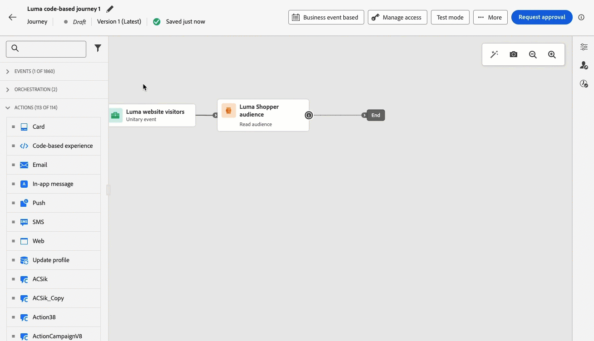

自 2024 年 10 月 1 日起開放使用

</tr>
</tbody>
</table>

<table>
<thead>
<tr>
<th><strong>歷程中的網站體驗</strong> </th>
</tr>
</thead>
<tbody>
<tr>
<td>

有了網頁管道，Adobe Journey Optimizer 可讓您將透過傳入網頁歷程向客戶提供的網站體驗個人化。網頁管道現可在歷程版面中使用。

如需詳細資訊，請參閱<a href="../web/create-web.md">詳細文件</a>。

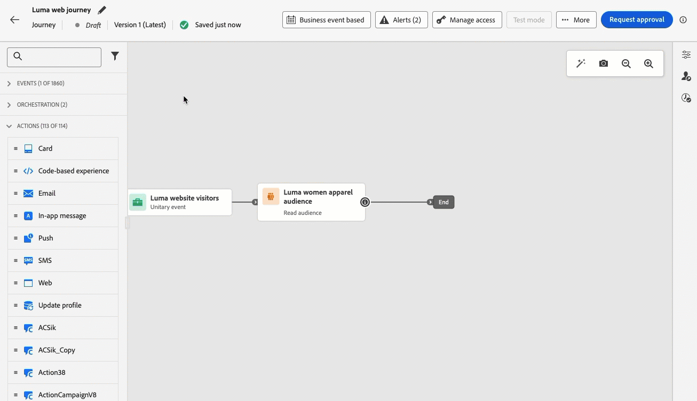

自 2024 年 10 月 1 日起開放使用

</tr>
</tbody>
</table>

<table>
<thead>
<tr>
<th><strong>衝突與優先順序管理 (可用性限制)</strong> </th>
</tr>
</thead>
<tbody>
<tr>
<td>

在 Journey Optimizer 中，管理行銷活動和歷程的數量與時機，正是避免客戶因互動次數過於頻繁而感到不知所措的重要關鍵。 Journey Optimizer 目前有提供多種衝突管理和排定優先順序工具。 
如需詳細資訊，請參閱<a href="../conflict-prioritization/gs-conflict-prioritization.md">詳細文件</a>。

<ul><li><b>歷程頻率上限</b>：您目前可以建立規則集，以便套用至歷程中，讓您可以為設定檔限制每日、每週或每月的歷程次數，還能控制同時執行的並行歷程次數。</li>
<li><b>優先順序分數</b>：您目前可以將優先順序分數指派給行銷活動，或是歷程，分數由 0 到100 分起跳。 分數越高則表示優先順序越高。 當有兩種行銷活動同時使用到相同的管道設定時，Journey Optimizer 就會選取優先順序分數最高的行銷活動。如果行銷活動的分數一樣，就會選擇最近才修改過的行銷活動。</li>
<li><b>檢視潛在衝突</b>：歷程和行銷活動中的最新「檢視潛在衝突」按鈕目前可以讓您識別與其他歷程，或是行銷活動之間的重疊程度，例如開始日期、目標對象，或是選取的管道設定。</li>
<li><b>歷程仲裁</b>：這項新功能讓您可以找出最重要的歷程優先順序，再提供給客戶使用。 您可以建立規則，以便在客戶符合即將進入的優先順序較高的歷程資格時，阻止對方進入優先順序較低的歷程。</li>
<li><b>依通訊類型設定頻率上限：</b>使用規則集，您目前可以依通訊類型 (例如「銷售」、「促銷活動」) 設定精細規則，以防訊息類似的客戶負荷過重。 您可以橫跨多個管道來控制頻率，自動排除過度請求的設定檔，以便確保帶來更美好的客戶體驗。</li></ul>

指定客戶群組可在限量中，使用衝突和優先順序管理功能。 請注意，未來將會向更多使用者逐步推出以上功能。 如果您有興趣加入上述功能的等候名單，請洽詢客戶團隊。

</td>
</tr>
</tbody>
</table>

<table>
<thead>
<tr>
<th><strong>將 Movable Ink 整合入 Adobe Journey Optimizer</strong> </th>
</tr>
</thead>
<tbody>
<tr>
<td>

您目前可以將 Movable Ink Da Vinci 整合入 Adobe Journey Optimizer。 透過這項新的整合，您可以做到以下幾點： 

<ul><li>善用 Movable Ink Da Vinci 產品中的強大功能，將批次行銷活動的電子郵件變化版本加以組合並進行個人化</li>
<li>使用 Da Vinci 進行製作，利用 Adobe Journey Optimizer 進行最佳化和傳遞，可為 Journey Optimizer 的客戶，加速從業人員的工作流程</li>
<li>使用 Adobe 資料，將 Da Vinci 模型最佳化。</li></ul>

如需詳細資訊，請參閱<a href="https://movableink.com/adobe-and-movable-ink">Movable Ink Da Vinci 文件</a>。

</tr>
</tbody>
</table>

先前會開放給整個組織 (LA) 使用，目前所有使用者 (GA) 都可以使用以下功能。

<table>
<thead>
<tr>
<th><strong>電子郵件組態個人化 (一般可用性) </strong> </th>
</tr>
</thead>
<tbody>
<tr>
<td>

為提高彈性，掌控電子郵件設定，您可以在建立電子郵件頻道設定時，定義動態子網域和個人化的標題參數。

如需詳細資訊，請參閱<a href="../email/surface-personalization.md">詳細文件</a>。

自 2024 年 10 月 23 日起開放使用

</tr>
</tbody>
</table>

<table>
<thead>
<tr>
<th><strong>歷程與行銷活動 (一般可用性) 通過核准</strong> </th>
</tr>
</thead>
<tbody>
<tr>
<td>

待政策通過核准，您就可以立即在 Journey Optimizer 中設定核准程序，允許行銷團隊使用，以確保行銷活動和歷程在正式上線之前，會先由合適的利害關係人負責審核，並完成簽核。

如需詳細資訊，請參閱<a href="../test-approve/gs-approval.md">詳細文件</a>。

自 2024 年 10 月 22 日起開放使用

</td>
</tr>
</tbody>
</table>

<table>
<thead>
<tr>
<th><strong>歷程中的內容實驗 (一般可用性)</strong> </th>
</tr>
</thead>
<tbody>
<tr>
<td>

Adobe Journey Optimizer 現在支援歷程的實驗，行銷活動已提供此功能。實驗是在線上測試的情境下進行的隨機試驗，意即某些隨機選取的使用者會接觸到訊息的指定變化，而另一組隨機選取的使用者則會接觸到一些其他處理方式。 接觸到後，您就可以測量感興趣的結果量度，例如電子郵件開啟、訂閱或購買數。

如需詳細資訊，請參閱<a href="../content-management/content-experiment.md">詳細文件</a>。

</td>
</tr>
</tbody>
</table>

<table>
<thead>
<tr>
<th><strong>Decisioning (一般可用性)</strong> </th>
</tr>
</thead>
<tbody>
<tr>
<td>

Decisioning 之前有開放給一整組組織 (LA) 使用，又稱為體驗決策，目前可供所有使用者 (GA) 使用，包括已購買 Adobe Healthcare Shield 或 Privacy and Security Shield 附加產品的組織的使用者。

Decisioning 會透過提供集中行銷產品建議目錄，又稱為「決策項目」，還有複雜的決策引擎，設法簡化個人化。 此引擎會運用規則與排名標準來選取，並呈現出最相關的決定項目給每個人。這些決策項目會透過新的程式碼型體驗頻道，無縫整合入廣泛的傳入介面。

如需詳細資訊，請參閱<a href="../experience-decisioning/gs-experience-decisioning.md">詳細文件</a>。

</td>
</tr>
</tbody>
</table>

<table>
<thead>
<tr>
<th><strong>歷程與行銷活動的多語言訊息 (一般可用性)</strong> </th>
</tr>
</thead>
<tbody>
<tr>
<td>

您現在可以在單一行銷活動或歷程中，輕鬆建立多種語言的內容。透過此功能，您可以在編輯行銷活動或歷程時切換語言、簡化整個編輯流程，並提高有效管理多種語言內容的能力。

如需詳細資訊，請參閱<a href="../content-management/multilingual-gs.md">詳細文件</a>。

</td>
</tr>
</tbody>
</table>

<table>
<thead>
<tr>
<th><strong>已更新報告體驗 (一般可用性)</strong> </th>
</tr>
</thead>
<tbody>
<tr>
<td>

Journey Optimizer 報告功能目前開放給一般人使用 (GA)，改良後的版本擁有互通性，能使用 Customer Journey Analytics 功能，可將兩邊平台之間的報告標準化，改善資料一致性與可靠性。Journey Optimizer 與 Customer Journey Analytics 之間緊密整合，讓您可以更清楚地檢視效能量度，讓使用者能做出更睿智的決策。

推廣一般可用性之後，會引進四種新功能：可以建立簡易量度，建立並發佈對象，使用 Insight Builder 臨時提出問題，將排程報告流程自動化，寫封電子郵件寄給主要收件者。

如需詳細資訊，請參閱<a href="../reports/report-cja-manage.md">詳細文件</a>。

重要提醒：目前的報告體驗將於推出 2025 年 1 月份版本後，正式終止服務。過了上述日期，新的報告體驗就會成為標準版。建議您先自己熟悉一下新的功能，以確保能順利轉換服務。<a href="../reports/report-gs-cja.md">了解如何開始使用 Journey Optimizer 的新報告介面</a>

自 2024 年 10 月 16 日起開放使用

</tr>
</tbody>
</table>

<!--The following capabilities are available to all customers in public beta:-->

<table>
<thead>
<tr>
<th><strong>使用範例輸入資料 (測試版) 來測試內容</strong> </th>
</tr>
</thead>
<tbody>
<tr>
<td>

Journey Optimizer 目前讓您可以預覽內容，還能使用從檔案上傳或是手動新增的範例輸入資料，傳送電子郵件校樣，以便測試電子郵件內容的不同變體。 系統會自動偵測您在內容中使用到的所有設定檔屬性，以便進行個人化，以上屬性可應用到測試上，即可建立多個變體。

此功能目前會透過公開測試版的形式，開放給所有客戶使用，可用於電子郵件、簡訊和推播通知頻道。

如需詳細資訊，請參閱<a href="../test-approve/simulate-sample-input.md">詳細文件</a>。

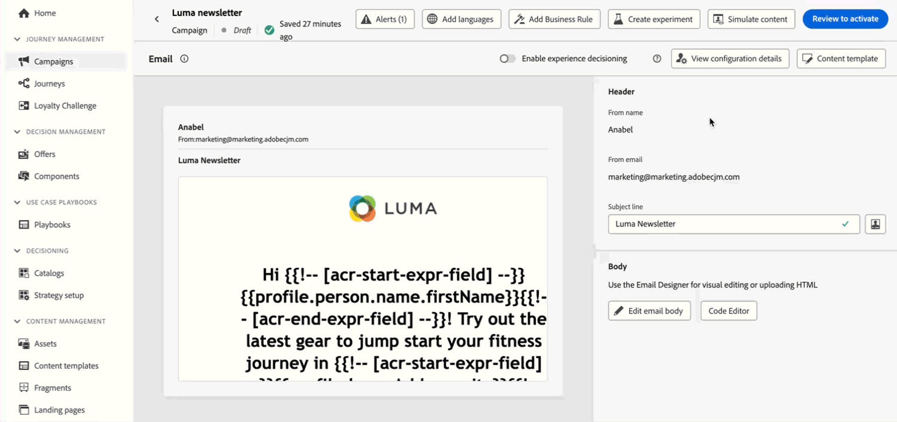
</td>
</tr>
</tbody>
</table>

<table>
<thead>
<tr>
<th><strong>使用 Adobe Experience Platform 資料進行個人化 (測試版)</strong> </th>
</tr>
</thead>
<tbody>
<tr>
<td>

善用在個人化編輯器中的 Adobe Experience Platform 資料，將內容個人化。 若想這樣做，就必須先透過 API 呼叫，啟用查詢個人化所需的資料集。 一旦完成，您就可以使用這些資料，將內容個人化，改成[!DNL Journey Optimizer]。

只要是客戶都可在公開測試版中使用此功能。

如需詳細資訊，請參閱<a href="../personalization/aep-data-perso.md">詳細說明文件</a>。

</td>
</tr>
</tbody>
</table>

### 功能改進 {#24-10-improvements}

此發行版本隨附下列改善項目。

**簡訊頻道**

* 目前可以編輯或刪除簡訊 API 管道設定。[了解更多](../sms/sms-configuration.md)

* 我們引進下列增強功能，即可改善使用 Infobip 和 Sinch 的簡訊傳送訊息功能：

   * 您可以定義並管理簡訊行銷活動，還有歷程的唯一關鍵字，啟用更個人化、有效率的通訊服務。

   * 當無法辨識關鍵字時，您可以先建立並傳遞預設簡訊。

  在 [Infobip](../sms/sms-configuration-infobip.md) 和 [Sinch](../sms/sms-configuration-sinch.md) 的簡訊設定文件中，進一步瞭解改進項目。

<!--**Journeys**-->

<!--* **Path experiment in journeys** - With the journey path experiment, you can now define and track key metrics for your journey paths, allowing you to measure the impact of your activities and to provide clearer insights into your performance. -->

<!--* **Max number of Live journeys** - Journey Optimizer now has a guardrail of 500 live journeys on production sandboxes, instead of 100. The number of live journeys is visible in the journey canvas. (DOCAC-10977) -->

**網路頻道**

* **網頁設計工具的非視覺化編輯模式**：作為 Journey Optimizer 網頁設計工具的替代方案，目前可以使用非視覺化編輯模式，將修改版本新增至自己的網站。 這項工具讓您可以手動輸入變更，不用在視覺化編輯器中開啟頁面。如果您無法安裝瀏覽器擴充功能，例如 Adobe Experience Cloud Visual Helper，這種非視覺化編輯模式可以算是相當實用，只要在網頁設計工具中載入頁面，就會需要用到這種擴充功能。[了解更多](../web/web-non-visual-editor.md)

**資料集**

* **傳送並開啟事件**：自 2024 年 11 月 1 日起，串流細分將不再支援使用 Journey Optimizer 追蹤和回饋意見資料集中的傳送和未結事件功能。 會將此變更套用至所有客戶沙箱和組織中。 [了解更多](../data/datasets-ttl.md#segmentation-update)

* **資料集存留時間 (TTL)**：自 2025 年 2 月起，將在新沙箱和新組織中，向 Journey Optimizer 系統產生的資料集，開放使用存留時間 (TTL) 護欄功能，如下所示：

   * 輪廓存放區中的資料為 90 天
   * 資料湖中的資料為 13 個月

  將在後續階段，開放現有客戶沙箱使用這項變更。 [了解更多](../data/datasets-ttl.md#ttl-guardrail)

* **自訂動作中的參數** - 可用日期：2024 年 10 月 3 日：自訂動作目前有支援無效和選用參數。[了解更多](../action/about-custom-action-configuration.md#define-the-message-parameters)

**報告**

* **決策報告**&#x200B;現已開放使用，可提供基本洞察，告訴訪客如何與體驗互動。[了解更多](../reports/campaign-global-report-cja-code.md#decisioning-kpis)

**資料治理與同意原則** - 推出日期：2024 年 10 月 7 日

* 已在 Journey Optimizer 的所有管道中強制執行&#x200B;**資料治理原則**。對於已在 Adobe Experience Platform 中建立原則的客戶，這些原則會在設定頻道設定時套用至行銷動作。使用設定建立內容時，系統會檢查所有個人化欄位是否有任何資料治理違規。如果發現違規，將無法發佈歷程或行銷活動。[了解更多](../action/action-privacy.md)

* **自訂同意原則**&#x200B;現在適用於所有Journey Optimizer 管道。在傳送訊息或提供傳入體驗之前強制執行時，系統會檢查使用者是否已同意在將收到的內容中使用個人化欄位。如果未予以同意，則不會顯示該體驗。[了解更多](../action/consent.md)

  >[!NOTE]
  >
  >同意原則目前僅適用已購買 Adobe **Healthcare Shield** 與&#x200B;**隱私權與安全性防護**&#x200B;附加產品的組織。

**對象** - 推出日期： 2024 年 10 月 8 日

* 當鎖定目標的 CSV 檔案對象時，您現在可於個人化編輯器與在行銷活動和歷程規則產生器，使用檔案中的屬性。[了解更多](../audience/about-audiences.md)

* 現在可以使用自訂上傳 (CSV 檔案) 中的對象與屬性，來與 Healthcare Shield 或 Privacy and Security Shield 搭配使用

**設定**：可用日期：2024 年 10 月 23 日

* 當在行銷活動或歷程中使用個人化設定時，您就可以立即預覽電子郵件內容，以便使用定義好的動態設定，檢查潛在錯誤。 [了解更多](../email/surface-personalization.md#check-configuration)

**程式碼型頻道**

* 目前有提供內容範本。 您可以從開發人員建立的內容範本開始使用，加速完成程式碼型體驗的製作。 使用內容範本，讓行銷人員只要修改某些數值或欄位，不用撰寫整個 HTML 或 JSON 內容承載。[了解更多](../content-management/content-templates.md)

**Decisioning**

* [Adobe Customer Journey Analytics](https://experienceleague.adobe.com/docs/analytics-platform/using/cja-overview/cja-overview.html?lang=zh-Hant) 使用者目前可以選擇在決定中設定 AI 模型時，將 AI 模型最佳化 (之前又稱為體驗決策)。 舉例來說，這讓您可以將自訂「購買」表格最佳化，不必受到轉換率等定義限制。[了解更多](../experience-decisioning/ranking/ranking.md)

* 當將決定原則新增至擁有決策的程式碼型行銷活動時，除了選取策略之外，目前還可以手動選取單一決定項目。 此外，您目前還可以選取多種後備產品建議。 這能保證會傳回一定數量的決定項目。 [了解更多](../experience-decisioning/create-decision.md)

## 2024 年 9 月發行版本 {#24-9-rn}

<!--
>[!CAUTION]
>
>**Early release notes below are subject to change without prior notice until the release date**. Links, screens and updated documentation are published at the release date.
>
-->

**發行版本日期**：2024 年 9 月 24-26 日

### 全新功能 {#24-9-features}

此發行版本提供下列詳細介紹的新功能。

<table>
<thead>
<tr>
<th><strong>行動應用程式和網站的內容卡</strong> </th>
</tr>
</thead>
<tbody>
<tr>
<td>

內容卡是 Adobe Journey Optimizer 新的數位傳訊功能，可直接在行動應用程式和網站提供個人化且吸引人的內容。與傳統推播通知不同，內容卡可順暢整合到使用者介面，提供永久、非侵入式更新來增強使用者互動和體驗。

此功能可讓行銷人員向使用者呈現相關的豐富媒體內容，促進更高參與度，同時確保看到重要訊息，而不會中斷使用者歷程。

如需詳細資訊，請參閱<a href="../../rp_landing_pages/content-card-landing-page.md">詳細文件</a>。

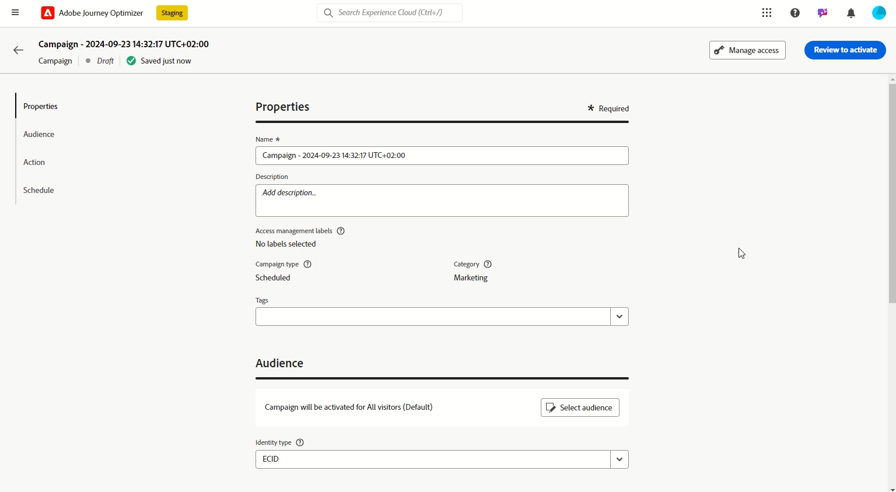
</td>
</tr>
</tbody>
</table>

<table>
<thead>
<tr>
<th><strong>歷程與行銷活動 (LA) 通過核准</strong> </th>
</tr>
</thead>
<tbody>
<tr>
<td>

待政策通過核准，您就可以立即在 Journey Optimizer 中設定核准程序，允許行銷團隊使用，以確保行銷活動和歷程在正式上線之前，會先由合適的利害關係人負責審核，並完成簽核。

目前核准原則僅開放給部分組織使用 (有限可用性)。若要取得存取權，請聯絡您的 Adobe 代表。

如需詳細資訊，請參閱<a href="../test-approve/gs-approval.md">詳細文件</a>。

</td>
</tr>
</tbody>
</table>

<!--<table>
<thead>
<tr>
<th><strong>Email Content Locking</strong> </th>
</tr>
</thead>
<tbody>
<tr>
<td>

Journey Optimizer now allows you to lock content in email templates, either by locking the entire template or specific structures and component. This allows you to prevent unintentional edits or deletions, giving you greater control over template customization, and improving the efficiency and reliability of your email campaigns.

For more information, refer to the <a href="../content-management/gs-generative.md">detailed documentation</a>.

</td>
</tr>
</tbody>
</table>-->

<table>
<thead>
<tr>
<th><strong>歷程中的全域退出標準</strong> </th>
</tr>
</thead>
<tbody>
<tr>
<td>

現在您可以在歷程層級為退出標準下定義。透過新增退出標準，一旦出現事件 (例如：購買)，或是符合對象資格時，您就可以馬上讓設定檔退出歷程。這能阻止使用者從歷程處取得任何進一步通訊資料。

如需詳細資訊，請參閱<a href="../building-journeys/journey-properties.md#exit-criteria">詳細文件</a>。

</td>
</tr>
</tbody>
</table>

<table>
<thead>
<tr>
<th><strong>AI 助理</strong> </th>
</tr>
</thead>
<tbody>
<tr>
<td>

建立訊息並進行個人化後，請在 Journey Optimizer 使用 AI 助理，把內容提升到新的境界。您目前可以使用 AI 助理，使用不同的主要標題和影像進行實驗，讓訊息的影響力發揮最佳成效。 每個變體都會視為獨特的處理來管理，以測量並比較哪個標題能有效產生更多點按次數。

透過<a href="https://experienceleague.adobe.com/zh-hant/apps/journey-optimizer/ai-assistant-content-accelerator">我們的即時功能預覽</a>，沉浸在親身體驗中，讓您親身體驗實際功能並充分瞭解其功能。</a>

如需詳細資訊，請參閱<a href="../content-management/gs-generative.md">詳細文件</a>。

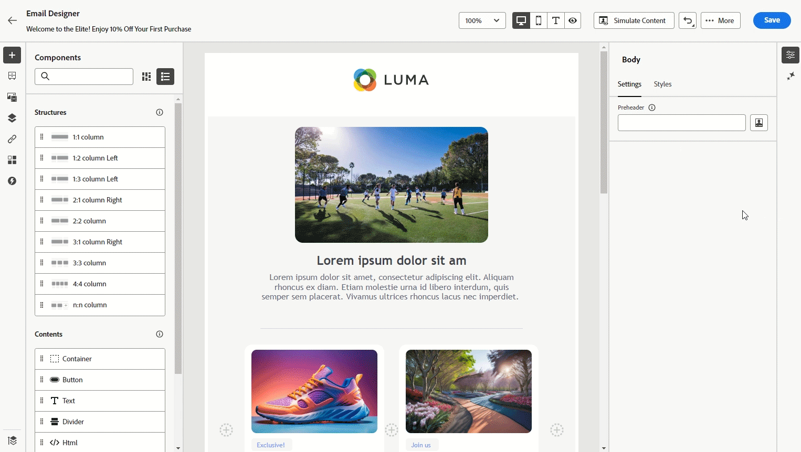

推出日期：2024 年 9 月 12 日

</td>
</tr>
</tbody>
</table>

<table>
<thead>
<tr>
<th><strong>引導式頻道設定</strong> </th>
</tr>
</thead>
<tbody>
<tr>
<td>

引導式頻道設定讓您可以透過統一體驗，將頻道設定自動化，並加以驗證，便可使用 Journey Optimizer，加速快速入門的流程。 這項全新引導式設定能簡化快速頻道設定，確保能在 Experience Platform、Journey Optimizer 和資料彙集中，輕鬆安裝所有必要資源，確保一切運作都能順暢。這讓行銷、產品和資料工程團隊可以快速展開行銷活動，同時建立歷程。

如需詳細資訊，請參閱<a href="../configuration/set-mobile-config.md">詳細文件</a>。

推出日期：2024 年 9 月 3 日

 
</td>
</tr>
</tbody>
</table>

### 功能改進 {#24-9-improvements}

此發行版本隨附下列改善項目。

**對象** - 推出日期：2024 年 9 月 17 日

**授權使用情況** - 授權使用情況控制面板現在會顯示可互動輪廓，而非可互動對象。[了解更多](../audience/license-usage.md)

**內容管理**

您現在可於沙箱之間匯出內容範本與片段。[了解更多](../configuration/copy-objects-to-sandbox.md)

**歷程**

* **即時報告增強功能** - 即時報告會針對您的歷程效能，提供過去 24 小時內的洞察。我們已透過加入新的量度 (已進入、已退出、已捨棄的輪廓與錯誤輪廓) 增強此功能，讓您直接從歷程版面更深入了解使用者行為與效能。[了解更多](../building-journeys/report-journey.md)

* (推出日期為：9 月 10 日) **在讀取對象上方的自動重試功能** - 正在擷取匯出工作時，會按預設在對象觸發歷程上套用重試功能 (從&#x200B;**讀取對象**&#x200B;或&#x200B;**商業事件**&#x200B;開始)。如果在匯出工作建立期間發生錯誤，將每隔 10 分鐘進行重試，最長為 1 小時。在這之後，我們會將其視為失敗。因此，這些類型的歷程最多可以在預定時間後 1 小時執行。[了解更多](../building-journeys/read-audience.md#retries)

**電子郵件頻道**

* **已傳送電子郵件與密件副本內文中的郵件標頭** - 已新增至所有電子郵件訊息的新標頭。對每封已送出的電子郵件和對應的密件副本來說，只會產生唯一的標題數值。此標頭也會儲存在訊息與密件副本回饋意見資料集，以調和密件副本與對應的已傳送電子郵件資訊。[閱讀全文](../configuration/archiving-support.md#bcc-header)

* **垃圾郵件評分** (GA) - 您現在可以在專屬&#x200B;**垃圾郵件報告**&#x200B;中，查看內容垃圾郵件評分。使用 SpamAssassin，Adobe Journey Optimizer 現在可以測試您的電子郵件內容並為其評分，以指出 ISP 或信箱提供者是否將其視為垃圾郵件。 [閱讀全文](../content-management/spam-report.md)

**簡訊頻道**

* **編輯 API 認證** - 您現在可以編輯簡訊 API 認證中的設定，包括更新選擇加入或退出的關鍵字和回覆。

**API**

* **行銷活動模擬 API** - 使用此 API 來觸發行銷活動的校訂工作。傳送行銷活動校訂是種非同步程序，API 將傳回 proofJobId，可用來檢查校訂的狀態。[了解更多](https://developer.adobe.com/journey-optimizer-apis/references/simulations/){target="_blank"}

* (推出日期：9 月 10 日) [Adobe Journey Optimizer API 文件](https://developer.adobe.com/journey-optimizer-apis/references/simulations/){target="_blank"}現為互動式。直接從文件頁面那邊探索 API 端點，即可立即取得回饋意見，加快技術實作的速度。

  所有 API 參考頁面目前都有推出&#x200B;**試用版**&#x200B;功能，您就可以使用此功能，直接在文件網站頁面上測試 API 呼叫。[取得必要的驗證憑證](https://developer.adobe.com/journey-optimizer-apis/references/authentication/){target="_blank"}並開始使用該功能，即可探索 API 端點。

  使用這項新功能，即可探索從 API 端點收到的請求，還有送出的回應，立即取得回饋意見，加快技術實作速度。

  >[!CAUTION]
  >
  >請注意，使用文件頁面上的互動式 API 功能時，就是在對端點進行真正的 API 呼叫。在試驗生產沙箱時，請記住這一點。

**設定**

* **IP 暖身計劃** - 此功能現在可供所有客戶使用，包括已購買 Adobe **Healthcare Shield** 或 **Privacy and Security Shield** 附加產品的組織。[了解更多](../configuration/ip-warmup-gs.md)

<!--
 Sign up for the [Adobe Journey Optimizer quarterly newsletter](https://www.adobe.com/subscription/Adobe_Journey_Optimizer_NL.html){target="_blank"} today, and receive the latest product updates, exciting stories, use cases, tips and more delivered directly to your inbox every quarter.-->

## 2024 年 8 月發行版本 {#8-2024}

**發行日期**：2024 年 8 月 20-21 日

### 全新功能 {#8-features}

此發行版本提供下列詳細介紹的新功能。

<!--
<table>
<thead>
<tr>
<th><strong>Content Cards (Limited Availability)</strong> </th>
</tr>
</thead>
<tbody>
<tr>
<td>

Content cards are a new digital messaging feature in Adobe Journey Optimizer that delivers personalized and engaging content directly within mobile apps and websites. Unlike traditional push notifications, Content Cards integrate seamlessly into the user interface, offering persistent, non-intrusive updates that enhance user interaction and experience.

This feature enables marketers to present relevant, rich media content to users, driving higher engagement and ensuring important messages are seen without disrupting the user journey.

 

Content card are currently only available for a set of organizations (Limited Availability). To gain access, contact your Adobe representative.

</td>
</tr>
</tbody>
</table-->

<table>
<thead>
<tr>
<th><strong>改善的頻道設定</strong> </th>
</tr>
</thead>
<tbody>
<tr>
<td>

已增強目前的管道表面功能，以在所有管道中採取一致的方法。您現在可以為任何管道定義、管理和重複使用這些設定，包括網頁、應用程式內訊息或基於程式碼的體驗。

<ul>
<li>管道表面現在已重新命名為<strong>管道設定</strong></li>
<li>您可以附加一或多個行銷動作，以強制執行同意和資料治理原則</li>
<li>物件層級存取控制 (OLAC) 現在可用於每個管道設定，可讓您決定允許哪些使用者建立或使用特定設定</li>
<li>對於某些管道，您可以建立以多個平台為目標的管道設定。以下為可鎖定網頁、iOS 應用程式和 Android 應用程式的應用程式內傳送訊息管道設定範例。</li>
</ul>

如需詳細資訊，請參閱<a href="../configuration/channel-surfaces.md">詳細文件</a>。

</td>
</tr>
</tbody>
</table>

<table>
<thead>
<tr>
<th><strong>Marketo Engage 自訂動作</strong> </th>
</tr>
</thead>
<tbody>
<tr>
<td>

您現在可以將 Adobe Journey Optimizer 與Adobe Marketo Engage 整合，來建置您的 B2B 使用案例。 新的自訂動作可讓您從歷程將資料收錄到 Marketo。

如需詳細資訊，請參閱<a href="../action/marketo-engage.md">詳細文件</a>。

</td>
</tr>
</tbody>
</table>

<table>
<thead>
<tr>
<th><strong>內容片段變數</strong> </th>
</tr>
</thead>
<tbody>
<tr>
<td>

片段全域變數可增強現有片段功能，以提高內容再使用性與指令碼使用案例的效率。 片段現在可以使用輸入變數，以及建立可用於行銷活動和歷程內容的輸出變數。在<a href="../personalization/use-expression-fragments.md">運算式片段</a>和<a href="../email/use-visual-fragments.md">視覺片段</a>這兩種片段中，皆可使用輸入變數。您可以使用這些變數，在行銷活動和歷程個人化您的訊息內容和參數。

如需詳細資訊，請參閱<a href="../personalization/use-expression-fragments.md">詳細文件</a>。

</td>
</tr>
</tbody>
</table>

<table>
<thead>
<tr>
<th><strong>IP 暖身工作流程</strong> </th>
</tr>
</thead>
<tbody>
<tr>
<td>

推出日期：8 月 13 日

如果您使用全新的 IP 位址傳送電子郵件，現在可以直接從使用者介面輕鬆執行 IP 暖身工作流程。 Adobe Journey Optimizer 提供標準化和有效率的方式，讓您的 IP 位址按照最佳實務來暖身，以實現最佳傳遞能力。

如需詳細資訊，請參閱<a href="../configuration/ip-warmup-gs.md">詳細說明文件</a>。

</td>
</tr>
</tbody>
</table>

### 功能改進 {#8-improvements}

此發行版本隨附下列改進項目。

**歷程**

* 在&#x200B;**條件**&#x200B;活動中，預設情況下，**[!UICONTROL 時間條件]**&#x200B;現在會從 00:00 到 12:00，依小時設定。[閱讀全文](../building-journeys/condition-activity.md#time_condition)
* 當建立歷程時，現在會從&#x200B;**警示**&#x200B;按鈕顯示提醒，跟其他提醒保持同步，提供一致的使用者體驗。[閱讀全文](../building-journeys/troubleshooting.md#activity-errors)
* 已改善歷程工具列的縮放選項：您現在可以看到縮放百分比，可以更輕鬆將重設縮放值。

**推播管道**

* 您現在可於 Adobe Journey Optimizer 管道設定的設定中新增行動應用程式推播認證。您不再需要在 Adobe Experience Platform 資料彙集中建立應用程式表面。

### 其他變更 {#changes}

**報告**

* 已將新的使用案例新增至全新報告體驗：

   * 可直接在報告中建立自訂計算量度。
   * 請從報告資料那邊建立對象。
   * 使用探索分析工具，可從已選取的&#x200B;**[!UICONTROL 維度]**&#x200B;和&#x200B;**[!UICONTROL 量度]**，輕鬆地建立表格和視覺效果。

  如需詳細資訊，請參閱[詳細文件](../reports/report-cja-manage.md)。

## 2024 年 7 月發行版本 {#24-7-2024}

**發行日期**：2024 年 7 月 30-31 日

### 全新功能 {#27-4-features}

此發行版本提供下列新功能。

<table>
<thead>
<tr>
<th><strong>具有任何提供者的 SMS 頻道 (Beta)</strong> </th>
</tr>
</thead>
<tbody>
<tr>
<td>

除了預設提供者 Sinch、Infobip 和 Twilio 之外，您現在可以在 Journey Optimizer 設定其他 SMS 提供者。

如需詳細資訊，請參閱<a href="../sms/sms-configuration-custom.md">詳細文件</a>。

</td>
</tr>
</tbody>
</table>

<table>
<thead>
<tr>
<th><strong>聯合客群構成 (可用性限制)</strong> </th>
</tr>
</thead>
<tbody>
<tr>
<td>

Adobe Journey Optimizer 現已提供聯合客群構成。它可讓企業自行組合資料，以便在各種使用案例中能善加運用。有了這種新方法，身為 Adobe Real-Time 客戶資料平台和/或 Adobe Journey Optimizer 使用者，您就可以直接聯合現有資料倉儲中的資料集，透過單一系統建置並擴充 Adobe 體驗平台的客群及屬性。

如需詳細資訊，請參閱<a href="https://experienceleague.adobe.com/zh-hant/docs/federated-audience-composition/using/home"  target="_blank">詳細說明文件</a>。

</td>
</tr>
</tbody>
</table>

### 功能改進 {#27-4-improvements}

此發行版本隨附下列改進項目。

**歷程**

* (有效日期：7 月 8 日) **歷程事件設定中的進階運算式編輯器** - 您現在可以在設定事件時善用進階運算式編輯器，讓您定義更複雜的運算式或在事件 ID 條件中使用函數。[了解更多](../event/about-creating.md#adv-exp-editor)

## 2024 年 6 月發行版本 {#24-6-2024}

**發行日期**：2024 年 6 月 18 日至 19 日

### 全新功能 {#june-24-features}

此發行版本提供下列詳細介紹的新功能。

<table>
<thead>
<tr>
<th><strong>內容片段客製化</strong> </th>
</tr>
</thead>
<tbody>
<tr>
<td>

您現在可以在片段中定義特定欄位，當片段新增到行銷活動或歷程時可以編輯這些欄位。 這允許在使用時調整內容部分，提供以內容特定的詳細資訊覆寫預設值的彈性。

如需詳細資訊，請參閱<a href="../content-management/customizable-fragments.md">詳細文件</a>。

</td>
</tr>
</tbody>
</table>

<table>
<thead>
<tr>
<th><strong>使用 Customer Journey Analytics (可用性限制) 進行報告</strong> </th>
</tr>
</thead>
<tbody>
<tr>
<td>

Journey Optimizer 報告功能改善與 Customer Journey Analytics 功能的互通性，可將兩個平台間的報告標準化，並改善資料一致性與可靠性。Journey Optimizer 與 Customer Journey Analytics 之間的緊密整合可讓您更清楚檢視績效量度，讓使用者能做出更明智的決策。

如需詳細資訊，請參閱<a href="../reports/report-gs-cja.md">詳細文件</a>。

</td>
</tr>
</tbody>
</table>

<table>
<thead>
<tr>
<th><strong>Adobe Journey Optimizer 中的 AI 助理</strong> </th>
</tr>
</thead>
<tbody>
<tr>
<td>

AI 助理是使用者介面功能，可用於導覽和了解 Adobe 概念，並獲取指定環境的運作洞察。 它適用於 Adobe Experience Cloud 的多種產品，包括 Adobe Journey Optimizer。

如需詳細資訊，請參閱<a href="../start/ai-features.md#ai-assistant">詳細文件</a>。

</td>
</tr>
</tbody>
</table>

<table>
<thead>
<tr>
<th><strong>歷程與行銷活動的多種語言訊息 (可用性限制)</strong> </th>
</tr>
</thead>
<tbody>
<tr>
<td>

您現在可以在單一行銷活動或歷程中，輕鬆建立多種語言的內容。透過此功能，您可以在編輯行銷活動或歷程時切換語言、簡化整個編輯流程，並提高有效管理多種語言內容的能力。

多種語言內容目前僅適用於一組組織 (可用性限制)。若要取得存取權，請聯絡您的 Adobe 代表。

</td>
</tr>
</tbody>
</table>

<table>
<thead>
<tr>
<th><strong>歷程的實驗 (可用性限制)</strong> </th>
</tr>
</thead>
<tbody>
<tr>
<td>

Adobe Journey Optimizer 現在支援歷程的實驗，行銷活動已提供此功能。實驗是在線上測試的情境下進行的隨機試驗，意即某些隨機選取的使用者會接觸到訊息的指定變化，而另一組隨機選取的使用者則會接觸到一些其他處理方式。 接觸到後，您就可以測量感興趣的結果量度，例如電子郵件開啟、訂閱或購買數。

歷程的實驗目前僅適用於一組組織 (可用性限制)。若要取得存取權，請聯絡您的 Adobe 代表。

</td>
</tr>
</tbody>
</table>

<!--table>
<thead>
<tr>
<th><strong>Extended personalization data - Beta</strong> </th>
</tr>
</thead>
<tbody>
<tr>
<td>

You can now lookup and fetch data values within Adobe Experience Platform datasets, and use these values to build conditions in Adobe Journey Optimizer. You can leverage data from a lookup dataset when a relationship has been defined using an attribute inside of an array of objects. You can specify non-profile enabled datasets for lookup. Once enabled, you can use a profile attribute as a join key to the specified dataset to retrive further data for personalization.

This capability is currently available as a public beta.

</td>
</tr>
</tbody>
</table-->

### 功能改進 {#june24-improvements}

此發行版本隨附下列改善項目。

#### 決策管理

* **決策管理中的多規則支援** - 您現在可以在決定管理中，為指定產品建議新增最多 10 個上限規則。這可讓您針對活動內容傳送方式提高控制等級。[了解更多](../offers/offer-library/add-constraints.md#capping)

<!--* **Audits** - The **Change log** tab allowing you to see all the changes that have been made to an offer or a decision has been removed. Changes related to offers and decisions can now be seen in the **Audits** menu. -->

#### 內容片段

>[!AVAILABILITY]
>
>請注意，這些增強功能將於首次發布後的幾天內逐步推出。雖然某些使用者可以立即存取，但其他使用者在其環境可用之前可能會遇到延遲。

* 片段現在可以編輯，並可以在使用它們的所有即時歷程和行銷活動中傳播變更。
* 已引進內容片段的新狀態：**草稿**，**即時**，**發佈**、和&#x200B;**已封存**。
* 若要在歷程或行銷活動中使用片段，它現在必須處於&#x200B;**即時**&#x200B;狀態。 已新增步驟至片段建立流程，可發佈片段並用於歷程及行銷活動。 請注意，片段發佈需要新的權限。

  **注意** - 由於 Journey Optimizer 已在 6 月發行版本中匯入&#x200B;**草稿**&#x200B;和&#x200B;**即時**&#x200B;狀態，因此在此版本之前建立的所有片段都具有&#x200B;**草稿**&#x200B;狀態，即使它們用於歷程或行銷活動中。如果您對這些片段進行任何變更，則需要[發佈它們](../content-management/create-fragments.md#publish)以使其進入「即時」狀態，並將變更內容傳遞到關聯的行銷活動和旅程。您還需要建立一個新的歷程/行銷活動版本，然後進行發佈。

請閱讀以下內容，了解更多資訊：[內容片段](../content-management/fragments.md)文件。

#### 歷程

* 歷程的全域逾時已延長至 91 天。 [閱讀全文](../building-journeys/journey-properties.md#global_timeout)

  任何建立的新歷程都會反映此新逾時。 請參考此[常見問題集章節](../building-journeys/journey-properties.md#timeout-faq)以進一步了解。請注意，這些變更將於 6 月期間逐步推出。

* Adobe Journey Optimizer 現在支援隱私權刪除/存取請求，以及資料生命週期管理請求。[閱讀全文](../privacy/requests.md)
* 您現在可以調整歷程庫存中的欄大小。
  <!--* **Advanced expression editor in Event configuration** is now GA - You can now leverage the advanced expression editor while configuring an event, allowing you to define more complex expressions or use functions in the event id condition. This capability is released in Limited Availability for selected customers. [Read more](../event/about-creating.md)-->
* **合併原則**&#x200B;現已正式上市 - 歷程使用的合併原則現在在整個歷程中可見且一致。 [閱讀全文](../building-journeys/journey-properties.md#merge-policies)

#### 行銷活動

* 在 Adobe Journey Optimizer 中建立行銷活動時，您現在可以在新模式中選擇行銷活動類型 (已排程或啟動)。[閱讀全文](../campaigns/create-campaign.md)

#### 電子郵件管道

* **清單 - 取消訂閱** - 繼最近 Gmail 和 Yahoo 針對大量寄件者的公告後，Journey Optimizer 支援「發佈/一鍵點擊」清單取消訂閱選項。請參閱下列頁面：[電子郵件選擇退出管理](../email/email-opt-out.md#unsubscribe-header)和[設定電子郵件設定](../email/email-settings.md#list-unsubscribe)。

  **注意** - 針對任何新管道表面，預設會啟動清單取消訂閱標題選項。 對於現有表面，預設會取消核取管道表面設定中的「一鍵取消訂閱 URL」選項。 如果您先前在電子郵件內文使用一鍵選擇退出 URL，此設定仍然有效。 如果勾選了管道表面設定中的「一鍵取消訂閱 URL」 ，Adobe Journey Optimizer 將會在管道表面設定中使用預設產生的一鍵取消訂閱 URL。

#### 簡訊頻道

* 您現在可以使用單一 API 設定，為每個沙箱新增唯一的短程式碼，讓流程更有效率且簡化。[了解更多](../sms/sms-configuration.md)

* 在建立之後，位於 **API 認證詳細資料**&#x200B;頁面的 **API 權杖**&#x200B;欄現已遮罩。

<!--* You can now modify existing SMS configurations.-->

#### 應用程式內管道

<!--* **Expression fragment** - Expression fragments are now available for the **In-app channel**. [Read more](../personalization/use-expression-fragments.md)-->

* 您現在可以使用 Edge Delivery 外掛程式，取得了解傳入實作及疑難排解所需的資訊。[了解更多 Edge Delivery 檢視](https://experienceleague.adobe.com/zh-hant/docs/experience-platform/assurance/view/edge-delivery){target="_blank"}。

#### 直接郵件頻道

* 直接郵件頻道現在可供所有客戶使用。 [閱讀全文](../direct-mail/get-started-direct-mail.md)

## 2024 年 5 月發行版本 {#may-2024}

**發行日期**：2024 年 5 月 21 日至 22 日

### 全新功能 {#e-features}

此發行版本提供下列詳細介紹的新功能。

<table>
<thead>
<tr>
<th><strong>體驗決策──有限可用性</strong> </th>
</tr>
</thead>
<tbody>
<tr>
<td>

體驗決策透過提供稱為「決策項目」的集中行銷產品建議目錄與複雜的決策引擎來簡化個人化。 此引擎運用規則與排名標準來選取並呈現最相關的決定項目給每個人。

這些決策項目透過新的程式碼型體驗管道無縫整合到廣泛的傳入設定，現在可在 Journey Optimizer 行銷活動中存取。Experience Decisioning 決策原則僅可用於程式碼型的體驗活動。

體驗決策目前僅可適用於一組組織 (可用性限制)。 若要取得存取權，請聯絡您的 Adobe 代表。

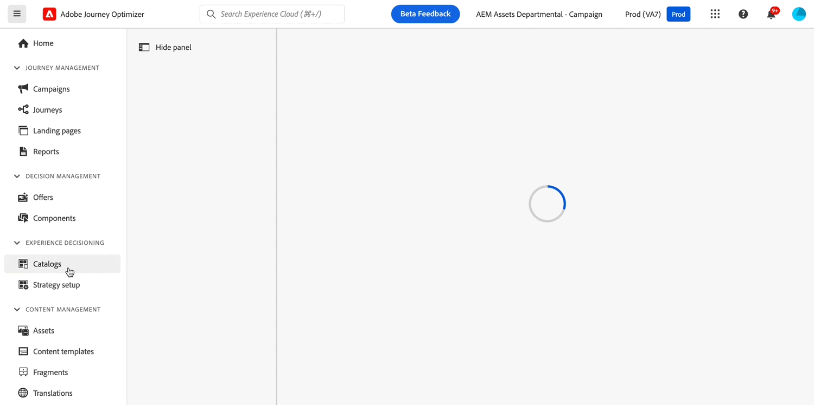

如需詳細資訊，請參閱<a href="../experience-decisioning/gs-experience-decisioning.md">詳細文件</a>。

</td>
</tr>
</tbody>
</table>

<table>
<thead>
<tr>
<th><strong>電子郵件設定個人化 - 有限可用性</strong> </th>
</tr>
</thead>
<tbody>
<tr>
<td>

您可以在建立電子郵件管道設定時，馬上定義動態子網域和個人化標題參數，就能提高電子郵件設定彈性，更能夠掌握得當。

電子郵件設定個人化目前僅開放給某些組織使用 (有限可用性)。若要取得存取權，請聯絡您的 Adobe 代表。

如需詳細資訊，請參閱<a href="../email/surface-personalization.md">詳細說明文件</a>。

</td>
</tr>
</tbody>
</table>

<!--table>
<thead>
<tr>
<th><strong>IP Warmup Workflow</strong> </th>
</tr>
</thead>
<tbody>
<tr>
<td>

If you are sending email on a brand new IP address, you can now easily perform IP warmup workflows directly from the user interface. Adobe Journey Optimizer offers a standardized and efficient way to warm up your IP adresses that follows the best practices for optimal deliverability.

For more information, refer to the <a href="../configuration/ip-warmup-gs.md">detailed documentation</a>.

</td>
</tr>
</tbody>
</table-->

<!--table>
<thead>
<tr>
<th><strong>Business rules - Beta</strong> </th>
</tr>
</thead>
<tbody>
<tr>
<td>

You can now create granular frequency capping rules, and apply them to different types of marketing communications through rule sets. This new capability lets you control how often your audiences receive a message by setting cross-channel rules, that automatically exclude over-solicited profiles from messages and actions.

Business rules capability is currently available as a beta. To join the beta program, contact your Adobe representative.

For more information, refer to the <a href="../configuration/business-rules.md">detailed documentation</a>.

</td>
</tr>
</tbody>
</table-->

<!--table>
<thead>
<tr>
<th><strong>Extended personalization data - Beta</strong> </th>
</tr>
</thead>
<tbody>
<tr>
<td>

You can now lookup and fetch data values within Adobe Experience Platform datasets, and use these values to build conditions in Adobe Journey Optimizer. You can leverage data from a lookup dataset when a relationship has been defined using an attribute inside of an array of objects. You can specify non-profile enabled datasets for lookup. Once enabled, you can use a profile attribute as a join key to the specified dataset to retrive further data for personalization.

This capability is currently available as a public beta.

</td>
</tr>
</tbody>
</table-->

### 功能改進 {#e-improvements}

此發行版本隨附下列改善項目。

**體驗決策** (限量)

從 Beta 版到此版本，新增了以下改善：

* **體驗決策 + 程式碼型的體驗** ：您現在可以利用體驗決策功能在程式碼型的行銷活動中使用決策項目。 注意：程式碼型的體驗管道和體驗決策不適用於已購買 Adobe Healthcare Shield 以及 Privacy and Security Shield 附加產品的組織。[閱讀全文](../code-based/get-started-code-based.md)
* **內容資料** - 現在您可以在決策規則和排名公式中利用 Adobe Experience Platform 的內容資料。[閱讀全文](../experience-decisioning/context-data.md)
* **新權限** - 決策管理資源現在有新的「管理體驗決策」權限可用。 它可讓您管理與體驗決策相關的權限。[閱讀全文](../experience-decisioning/gs-experience-decisioning.md)
* **上限規則** - 您現在可以為體驗決策中的指定決策項目新增多個上限規則。 這可讓您針對活動內容傳送方式提高控制等級。[閱讀全文](../experience-decisioning/items.md#capping)
* **報告** - 現在您可以使用[!DNL Customer Journey Analytics]建立體驗決策活動的自訂報告儀表板。 [閱讀全文](../experience-decisioning/cja-reporting.md)

<!--**Decision Management**

* **Multi-rule support** - You can now add up to 10 capping rules for a given offer in Decision Management. This allows you to increase the level of control over the way offers are sent.
* **Audits** - The **Change log** tab allowing you to see all the changes that have been made to an offer or a decision has been removed. Changes related to offers and decisions can now be seen in the **Audits** menu. -->

**電子郵件頻道**

<!--
* **List-unsubscribe** - Following on the recent Gmail and Yahoo announcements for bulk senders, Journey Optimizer supports the "post/1-click" List-Unsubscribe option. Refer to the following pages: [Email opt-out management](../email/email-opt-out.md#unsubscribe-header) and [Configure email settings](../email/email-settings.md#list-unsubscribe)
-->

* **垃圾郵件評分** (Beta) - 您現在可以在專用的垃圾郵件報告中檢查您的內容垃圾郵件評分。 使用 SpamAssassin，Adobe Journey Optimizer 現在可以測試您的電子郵件內容並為其評分，以指出 ISP 或信箱提供者是否將其視為垃圾郵件。 [閱讀全文](../content-management/spam-report.md)

  >[!AVAILABILITY]
  >
  >此功能目前為 Beta 版本，僅供 Beta 版客戶使用。若要加入 Beta 版計畫，請聯絡 Adobe 代表。

<!--
**Audiences**

* The use of audiences and attributes from audience composition and custom upload (CSV file) is now available for use with Healthcare Shield or Privacy and Security Shield.-->

<!--**Personalization**

* **Expression fragment** - Expression fragments are now available for the **In-app channel**. [Read more](../personalization/use-expression-fragments.md)-->

**歷程**

<!--* **Merge policies** (Limited Availability)- Merge policies used by a journey are now visible and consistent throughout the journey.-->
* **mTLS 支援** - 自訂動作現在支援 mTLS 驗證。 自訂動作或歷程中不需要額外設定即可啟用 mTLS；當偵測到啟用 mTLS 的端點時，它會自動發生。 [閱讀全文](../action/about-custom-action-configuration.md#mtls-protocol-support)
* **查詢事件中的表格** - 現在，當使用物件陣列內的屬性定義關聯性時，您可以運用查詢資料集中的資料。 將在歷程中的 (條件、自訂動作等) 開放使用查閱數值，還有訊息個人化。[閱讀全文](../event/experience-event-schema.md#relationships_limitations)
* **事件設定中的進階運算式編輯器** (LA) - 您現在可以在設定事件時運用進階運算式編輯器，讓您定義更複雜的運算式或在事件 ID 條件中使用函數。 此功能以「限量」形式向選定的客戶發布。[閱讀全文](../event/about-creating.md#adv-exp-editor)
* **合併原則** (LA) - 歷程使用的合併原則現在在整個歷程中可見且一致。 此功能以「限量」形式向選定的客戶發布。[閱讀全文](../building-journeys/journey-properties.md#merge-policies)

**全球化**

作為我們不斷努力提供統一使用者體驗的一部分，我們統一了 Adobe Experience Cloud 產品和應用程式中使用的術語。 這會影響德文術語「標題」，在與物件名稱相關時會變更為「標籤」。 這些變更將會逐步在使用者介面與檔案中逐步推出。

## 2024 年 4 月發行版本 {#apr-2024}

**發行日期**：2024 年 5 月 2 日

### 全新功能 {#apr-features}

此發行版本提供下列詳細介紹的新功能。

<table>
<thead>
<tr>
<th><strong>多媒體訊息服務 (MMS) - 所有提供者</strong> </th>
</tr>
</thead>
<tbody>
<tr>
<td>

透過簡訊管道，您現在可以傳送多媒體訊息服務 (MMS) 訊息，來與客戶分享影像、GIF 或影片，藉此增強通訊交流。 MMS 最初僅適用 Sinch，現在也適用 Infobip 與 Twilio。

</td>
</tr>
</tbody>
</table>

<table>
<thead>
<tr>
<th><strong>改善的歷程設計工具與即時報告</strong> </th>
</tr>
</thead>
<tbody>
<tr>
<td>

此版本隨附改善的畫布使用者介面以供歷程使用，同時提供更直覺且有效率的使用者體驗。 活動更清晰明瞭，只需更少的點按次數就能在 Canvas 歷程上呈現更多資訊。

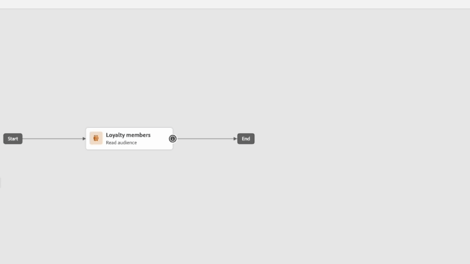

除改善歷程畫布設計外，我們也引進了直接在歷程畫布檢視過去 24 小時報告量度的功能。 

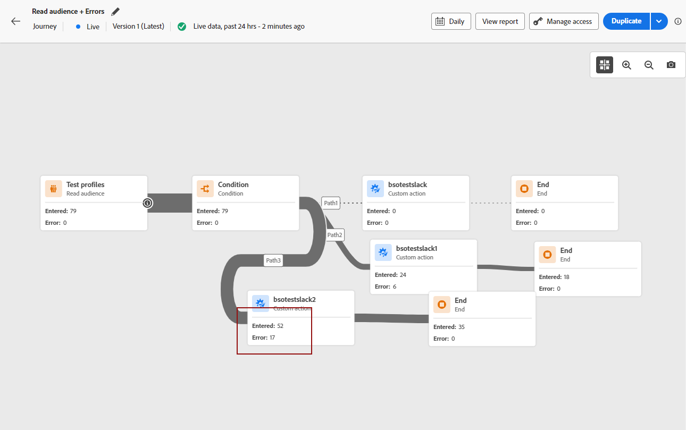

<strong>注意</strong>：這些變更將會從 4 月發布內容開始在所有環境逐步推出。

如需詳細資訊，請參閱<a href="new-canvas.md">詳細說明文件</a>。

</td>
</tr>
</tbody>
</table>

<!-- table>
<thead>
<tr>
<th><strong>AI Assistant - Experience Variant Generation - Beta</strong> </th>
</tr>
</thead>
<tbody>
<tr>
<td>

Once you have created and personalized your message, take your content to the next level with AI Assistant. You can now use AI Assistant to optimize your message's impact by experimenting with different main titles, and images. Each variant is managed as a unique Treatment, to measure and compare which title effectively generates more clicks.

</td>
</tr>
</tbody>
</table-->

<!--table>
<thead>
<tr>
<th><strong>Email Surface Personalization - Private beta </strong> </th>
</tr>
</thead>
<tbody>
<tr>
<td>

You can now define dynamic subdomains and personalized header parameters when creating email channel configurations, for increased flexibility and control over your email settings.

</td>
</tr>
</tbody>
</table-->

### 功能改進 {#apr-improvements}

此發行版本隨附下列改善項目。

<!--
* **Expression Fragments supported for Web and In-App**: Expression fragments are now available for the Web and In-app channels. 
-->

<!--
* **DULE for AJO channel configuration**: It is now possible to apply a label on certain profile attributes to restrict their usage inside a channel configuration through marketing actions.
-->

<!--
* **List-Unsubscribe updates**: Following on the recent Gmail and Yahoo announcements for bulk senders, Journey Optimizer supports the "post/1-click" List-Unsubscribe option. 
-->

**設定**

* 您現在可以在管道設定層級選取行銷動作。在設定使用時，會運用與該行銷動作相關的所有同意原則，以尊重客戶的偏好設定。[閱讀全文](../action/consent.md#surface-marketing-actions)
* 現在管道設定可以使用「物件層級存取控制」。[閱讀全文](../configuration/channel-surfaces.md#create-channel-surface)
* 在管道設定中啟用清單取消訂閱時，您現在可以定義同意級別，以與您管理所有其他來源的同意的方式保持一致。[閱讀全文](../email/email-settings.md#list-unsubscribe)

**內容管理**

* 現在您可以模擬所有頻道的內容範本。 [閱讀全文](../content-management/content-templates.md#video-templates)

**個人化**

* 運算式編輯器中提供了新的 **toInt** 輔助函數。它允許您將任何類型 (數字、雙精度、整數、長整型、浮點型、短整型、位元組、布林型、字串) 轉換為整數。[閱讀全文](../personalization/functions/math.md#to-int)

## 2024 年 3 月發行版本 {#mar-2024}

**發行日期**： 2024 年 3 月 19 至 20 日

### 新功能 {#mar-features}

此發行版本提供的新功能詳述如下。

<table>
<thead>
<tr>
<th><strong>程式碼型體驗</strong> </th>
</tr>
</thead>
<tbody>
<tr>
<td>

透過新的程式碼型體驗管道，Adobe Journey Optimizer 可讓您針對任何傳入屬性進行進階個人化及測試，跨不同接觸點 (例如網頁應用程式、行動應用程式、桌面應用程式、視訊主控台、電視連結的裝置、智慧型電視、資訊站、ATM、IoT 裝置等) 達成量身打造的無縫傳遞體驗。

主要功能包括：

<ul><li> 通用個人化：擴充所有接觸點的個人化體驗，確保一致且量身打造的使用者歷程</li>
<li>精細的編輯精確度：在應用程式或網頁內的個別位置編輯特定內容</li>
<li>多樣化實施：支援伺服器端、API 或 SDK 型實施方法，以便順暢整合您的開發環境。</li></ul>

如需詳細資訊，請參閱<a href="../code-based/get-started-code-based.md">詳細說明文件</a>。

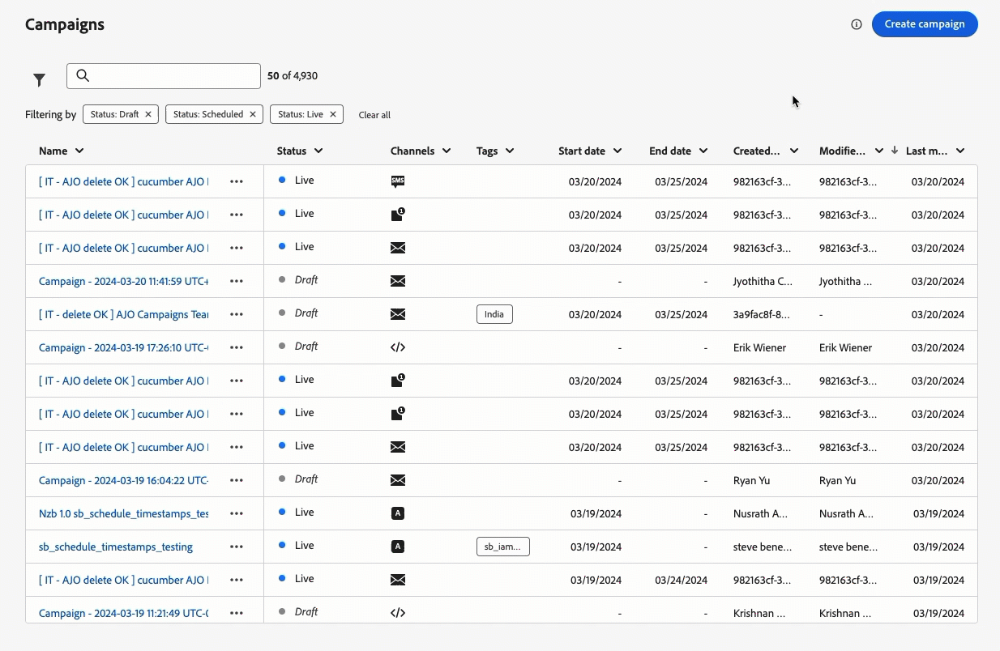 
</tr>
</tbody>
</table>

### 功能改進 {#mar-improvements}

此發行版本隨附下列改善項目。

**內容範本**

* **縮圖** - **網格檢視**&#x200B;模式現可用於內容範本，展示縮圖以便改善視覺化存取。目前僅支援電子郵件 HTML 範本。 [了解更多](../content-management/content-templates.md#template-thumbnails)

  >[!AVAILABILITY]
  >
  >此功能以有限可用性 (LA) 形式向一小部分客戶發布。

**歷程**

歷程編寫生命週期已新增新中介狀態：

* **正在發佈**&#x200B;狀態介於&#x200B;**草稿**&#x200B;狀態與&#x200B;**即時**&#x200B;狀態之間
* **正在停止**&#x200B;狀態介於&#x200B;**即時**&#x200B;狀態與&#x200B;**已停止**&#x200B;狀態之間
* **正在啟用測試模式**&#x200B;或&#x200B;**正在停用測試模式**&#x200B;狀態介於&#x200B;**草稿**&#x200B;狀態與&#x200B;**草稿 (測試)**&#x200B;狀態

當歷程處於中介狀態時，其是唯讀。[了解更多](../building-journeys/journey-gs.md#filter)

## 2024 年 2 月發行版本 {#feb-2024}

**發行日期**：2024 年 2 月 21 日至 22 日

### 全新功能{#feb-features}

此發行版本提供下列新功能。

<table>
<thead>
<tr>
<th><strong>網頁應用程式內傳訊</strong> </th>
</tr>
</thead>
<tbody>
<tr>
<td>

現在您可以使用新的網頁應用程式內訊息功能，透過模態疊加訊息直接在網站上顯示個人化內容。此功能可讓您有效地與網路訪客互動，從而增強使用者互動、保留率和轉換率。  

如需詳細資訊，請參閱<a href="../in-app/create-in-app-web.md">詳細文件</a>。  

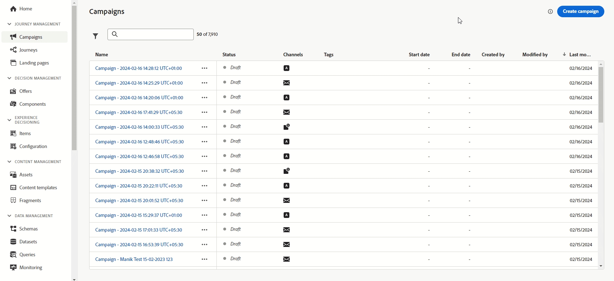
</tr>
</tbody>
</table>

<table>
<thead>
<tr>
<th><strong>多管道內容範本</strong> </th>
</tr>
</thead>
<tbody>
<tr>
<td>

除了電子郵件，以下管道現在也提供內容範本：推播、應用程式內、簡訊與直接郵件，每個管道都有專用的範本類型。針對電子郵件，您現在可以選取內容類型，這可讓您將主旨行儲存為電子郵件範本的一部分。   

如需詳細資訊，請參閱<a href="../content-management/content-templates.md">詳細說明文件</a>。  

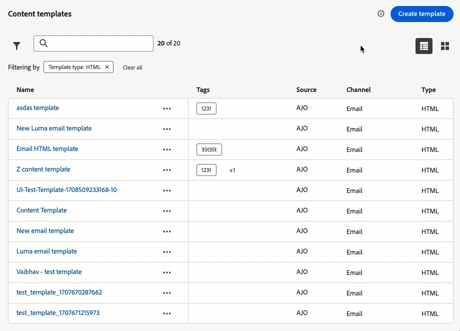 
</tr>
</tbody>
</table>

### 功能改進 {#feb-improvements}

此發行版本隨附下列改善項目。

**客群**

* **種子清單** - 使用&#x200B;**種子清單**&#x200B;時現在支援變體。種子地址會收到相同訊息的所有變體的副本 (例如內容實驗的不同處理方式)。[閱讀全文](../configuration/seed-lists.md)

以下改進之前以測試版形式提供，現在可供所有使用者使用：

* 您現在可以選擇&#x200B;**透過客群構成所建立的目標客群**，並在歷程中運用擴充屬性。 [了解更多](../building-journeys/read-audience.md)

* 您現在可以選擇&#x200B;**從 CSV 檔案上傳**&#x200B;至歷程和行銷活動中的目標客群。[了解更多](../audience/about-audiences.md#about-segments)

  >[!AVAILABILITY]
  >
  >* 目前無法將客群構成和自訂上傳 (CSV 檔案) 中的客群和屬性與 Healthcare Shield 或 Privacy and Security Shield 結合使用。
  >* **從 CSV 檔案上傳客群**&#x200B;的改進將在首次發布後的幾天內逐步推出。雖然某些使用者可以立即存取，但其他使用者在其環境可用之前可能會遇到延遲。

**歷程**

* **篩選您的歷程** - 除了現有的預定義日期篩選器之外，您現在可以使用&#x200B;**自訂日期篩選歷程**&#x200B;庫存。這使您可以透過顯示在特定日期、特定月份、全年或指定時間範圍內發布的歷程來細化清單。[閱讀全文](../building-journeys/journey-gs.md#filter)
* **自訂動作** - 您現在可以更新 **content-type** 標題。 這個新的 **content-type** 應參考 JSON 內容。 [閱讀全文](../action/about-custom-action-configuration.md#url-configuration)
* **設定** - stepEvents 中的 IdentityMap 屬性現在已預先填入。主要身分識別定義為「primary = true」。[閱讀全文](../reports/sharing-field-list.md)
* **使用者介面** - 歷程畫面中的頂部欄已重新組織，以改善體驗。 在不同的更新中，請注意，允許您存取歷程屬性的「鉛筆」圖示現在顯示在頂部欄的左側，歷程名稱旁邊。[閱讀全文](../building-journeys/journey-properties.md)

**簡訊頻道**

* **選擇加入/選擇退出關鍵字** - 當設定簡訊管道時，您現在可根據您的偏好自訂&#x200B;**選擇加入及選擇退出關鍵字**。 Journey Optimizer 會根據這些指定關鍵字來觸發回應。[了解更多](../sms/sms-configuration.md)

**行銷活動**

* **API 觸發的活動** - 在啟動 API 觸發的活動後產生的 cURL 程式碼已增強。 現在其可包含訊息中使用的所有個人化 (輪廓與內容) 變數。[閱讀全文](../campaigns/api-triggered-campaigns.md#execute)

**頻率規則**

* 除了電子郵件及推播之外，您現在還可以為簡訊和直接郵件管道建立頻率規則。 當達到頻率上限時，頻率規則會自動從訊息和動作中排除過度請求的輪廓。[閱讀全文](../conflict-prioritization/rule-sets.md)

<!--**Decision management**

* **Capping rules** - You can now add **multiple capping rules** for one offer. This allows you to increase the level of control over the way offers are sent.-->

## 2024 年 1 月發行版本 {#jan-2024}

**發行日期**：2024 年 1 月 30 日至 31 日

### 全新功能{#jan24-features}

此發行版本提供下列新功能。

<table>
<thead>
<tr>
<th><strong>傳遞能力更新</strong> </th>
</tr>
</thead>
<tbody>
<tr>
<td>

Journey Optimizer 現在支援 DMARC 驗證技術。

2024 年 2 月 1 日起，Google 和 Yahoo! 都要求您對傳送電子郵件所使用的任何網域留有 DMARC 記錄。請確定您已在 Journey Optimizer 中，為要委派給或即將委派給 Adobe 的所有子網域設定 DMARC 記錄。

如需詳細資訊，請參閱<a href="../configuration/dmarc-record-update.md">詳細文件</a>。

 
</tr>
</tbody>
</table>

<table>
<thead>
<tr>
<th><strong>使用案例教戰手冊</strong> </th>
</tr>
</thead>
<tbody>
<tr>
<td>

在 Real-Time CDP 和 Journey Optimizer 中，利用特定產業使用案例教戰手冊的目錄，解決您可以使用 Adobe Experience Platform 和 Adobe Journey Optimizer 來執行的常見使用案例。

在您選擇最符合需求的教戰手冊後，您可加以啟用來產生歷程、訊息、結構描述或區段等支援使用案例所需的資產，並根據結構描述來予以自訂，以加速創造價值。

如需詳細資訊，請參閱<a href="../start/ai-features.md#playbooks">詳細說明文件</a>。

 
</tr>
</tbody>
</table>

### 功能改進 {#jan24-improvements}

此發行版本隨附下列改善項目。

**報告**

* **新的網域型劃分小工具** - 已新增新的小工具來增強 Campaign 和 Journey 報告。**退回原因 (依網域)**、**傳送次數與送達次數 (依網域)**、**開啟次數與點按次數 (依網域)** 和&#x200B;**退回數與錯誤數 (依網域)** 小工具會針對關鍵電子郵件傳送和追蹤量度，提供網域層級的詳細劃分。[了解更多](../reports/channel-report-cja.md)

**簡訊頻道**

* **雙重確認選擇加入** - 簡訊的雙重確認選擇加入工作流程可確保使用者從其裝置發出請求時，明確選擇加入要接收訊息。 使用者開始進行同意流程的方式為，傳送傳入簡訊。確認同意後，隨即會傳送後續追蹤訊息，要求進行最終驗證。如果使用者輪廓不存在，則會在成功確認時加以建立。[了解更多](../sms/sms-configuration.md)

  請注意，此功能適用於 Sinch 和 Infobip 簡訊提供者。

**歷程**

* **反應事件期間** - 您可在&#x200B;**反應事件**&#x200B;中定義的最長期間現在為 29 天，而非 30 天。 [了解更多](../building-journeys/reaction-events.md)

<!--* **Date filters** - You can now use custom dates to filter the journeys inventory, in addition to the existing predefined date filters. This allows you to refine the list by displaying journeys published on a specific date, within a particular month, throughout an entire year, or within specified time ranges. [Learn more](../building-journeys/journey-gs.md#filter)-->

* **讀取客群** - **讀取客群**&#x200B;活動現在仰賴批次細分群體的輪廓快照資料集。批次細分群體會在排定的每日批次工作執行後產生，一天只會產生一次。所以資料將會是截至每日批次工作的最新資料。[了解更多](../building-journeys/read-audience.md)

* **欄位群組** - 此發行版本修正在特定情況下無法儲存欄位群組的問題。

* 已在多個函數中修改 `<listObject>` 的支援。

**頻率規則**

* **每週頻率上限** - 除了以月為單位之外，您現在可以指定一週內所能傳送給客戶輪廓的訊息數量上限。頻率上限是以所選的行事曆期間為基礎，並會在對應的時間段開始時重設。 [了解更多](../conflict-prioritization/rule-sets.md)

  >[!NOTE]
  >
  >每日頻率上限也可隨選提供。 請聯絡您的 Adobe 代表。

**決策管理**

* **Edge 的頻率上限** - 頻率上限計數器現已更新，並可在不到 3 秒內做出 Edge Decisioning API 決定。[了解更多](../offers/api-reference/offer-delivery-api/start-offer-delivery-apis.md)
