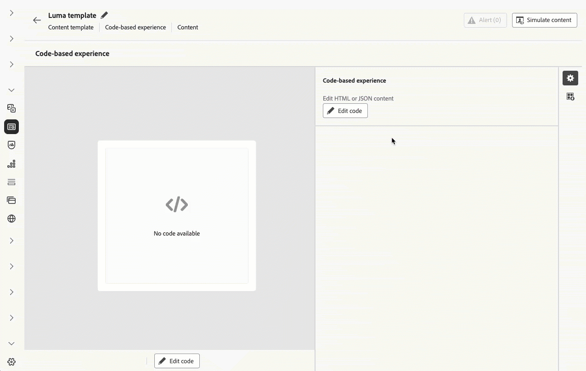

# 發行說明 2025 年 {#release-notes-2025}

此頁面列出了於 2025 年發行的 [!DNL Journey Optimizer] 所有功能和改進項目。

## 2025 年 8 月發行說明 {#25-8-rn}

**發行日期**：2025 年 8 月 19 日

### 全新功能 {#Aug-25-8-features}

此版本隨附的新功能詳述如下。

<table>
<thead>
<tr>
<th><strong>暫停並繼續歷程</strong> </th>
</tr>
</thead>
<tbody>
<tr>
<td>

您立即可以暫停，繼續歷程。在不中斷客戶體驗的情況下，此功能可讓歷程從業人員暫時暫停即時歷程，藉此提供更大控制力，帶來更多彈性。 暫停時，系統就不會傳送任何通訊，設定檔會維持在暫停狀態，直到繼續歷程為止。

您只能暫停並繼續單一歷程，或可執行大量暫停，然後繼續另一組歷程操作。

此外，您還可以將全域篩選器套用至已暫停歷程，即可根據屬性排除設定檔。

此功能之前以「有限可用性」的名義發行，目前所有環境都適用 (一般可用性)。

如需詳細資訊，請參閱<a href="../building-journeys/journey-pause.md">詳細文件</a>

</td>
</tr>
</tbody>
</table>

<table>
<thead>
<tr>
<th><strong>行事曆檢視</strong> </th>
</tr>
</thead>
<tbody>
<tr>
<td>

歷程和行銷活動清單中，目前只有提供行事曆視圖。 行事曆視圖讓您可以透過視覺化方式，呈現個別清單中的所有歷程，同時啟用行銷活動。

此功能之前以「限量」的名義發行，目前所有環境都可以使用。在此「一般可用性」版本中，功能包括：

<ul>
<li>日期中導覽的設計改善；</li>
<li>能夠檢視草稿行銷活動 (如果您已設定開始和結束日期)；</li>
<li>隱藏和顯示長時間執行行事曆項目的新設定。</li>
</ul>

如需詳細資訊，請參閱<a href="../building-journeys/journey-ui.md#calendar">詳細文件</a>

</td>
</tr>
</tbody>
</table>

<!--table>
<thead>
<tr>
<th><strong>Use Adobe Experience Platform data for personalization</strong> </th>
</tr>
</thead>
<tbody>
<tr>
<td>

Leverage data from [!DNL Adobe Experience Platform] in the personalization editor to personalize your content and decision attributes. In particular, this allows you to extend the definition of your attributes to additional data in datasets for bulk updates that change periodically without having to manually update the attributes one at a time.

With this release, the following enhancements have been introduced:

<ul>
<li>Support of inbound channels,</li>
<li>The "datasetLookup" helper function can now be used within expression and visual fragments to personalize content using data from Adobe Experience Platform datasets,</li>
<li>An option in the dataset now allows you to enable datasets for lookup personalization, without having to perform an API call.</li>
</ul>

This capability is available in Limited Availability. Contact your Adobe representative to gain access.

For more information, refer to the <a href="../personalization/aep-data-perso.md">detailed documentation</a>

</td>
</tr>
</tbody>
</table-->

<!--table>
<thead>
<tr>
<th><strong>Use Decisioning in email channel</strong> </th>
</tr>
</thead>
<tbody>
<tr>
<td>

You can now add Decision policies into email journeys and campaigns. Decision policies are containers for your offers that leverage the Decisioning engine to dynamically return the best content to deliver for each audience member.

Previously released in Limited Availability, this capability is now available to all environments (General Availability).

<For more information, refer to the <a href="../FILE.md">detailed documentation</a>

</td>
</tr>
</tbody>
</table-->

<table>
<thead>
<tr>
<th><strong>歷程中的動作活動</strong> </th>
</tr>
</thead>
<tbody>
<tr>
<td>

Journey Optimizer 支援新的一般動作活動，可讓您設定單一動作和多動作的傳入動作群組，進而簡化歷程畫布中的動作設定。尤其是這項新功能允許：

<ul>
<li>簡化歷程畫布中的原生動作設定。</li>
<li>容量用來建立多動作傳入動作群組。</li>
<li>能夠將最佳化新增至任何內建管道動作。</li>
<li>能夠將實驗與多語言選項新增至任何動作。</li>
</ul>

此功能為「有限可用性」的狀態。請聯絡您的 Adobe 代表以取得存取權。

如需詳細資訊，請參閱<a href="../building-journeys/journey-action.md">詳細文件</a>

</td>
</tr>
</tbody>
</table>

<table>
<thead>
<tr>
<th><strong>電子郵件的 PDF 附件</strong> </th>
</tr>
</thead>
<tbody>
<tr>
<td>

您現在可以對透過 Journey Optimizer 傳送的電子郵件訊息附加靜態 PDF 檔案。

<ul>
<li>您每年最多可以為每個設定檔傳送 6 封含有 PDF 附件的訊息。</li>
<li>每個附件允許的大小上限為 5 MB。</li>
<li>如需其他大小或流量，您可以購買附件套組附加元件。 如需詳細資訊，請聯絡您的 Adobe 代表。</li>
</ul>

此功能為「有限可用性」的狀態。請聯絡您的 Adobe 代表以取得存取權。

如需詳細資訊，請參閱<a href="../email/pdf-attachments.md">詳細文件</a>

</td>
</tr>
</tbody>
</table>

<!--
<table>
<thead>
<tr>
<th><strong>Landing page custom forms</strong> </th>
</tr>
</thead>
<tbody>
<tr>
<td>

With [!DNL Journey Optimizer], you can now capture profile attributes though your landing pages.

Create, design and manage custom forms tailored to your needs based on a specific dataset. You can then leverage these forms in landing pages to add the profile attributes of your choice into the dataset defined for each form.

This capability is currently in beta version and only available to beta customers. To join the beta program, contact your Adobe representative.

For more information, refer to the <a href="../FILE.md">detailed documentation</a>

</td>
</tr>
</tbody>
</table>
-->

<table>
<thead>
<tr>
<th><strong>行銷活動中的最佳化</strong> </th>
</tr>
</thead>
<tbody>
<tr>
<td>

Journey Optimizer 現在可讓您使用工具，為客群提供個人化和最佳化內容，讓您執行內容實驗、建立規則型目標定位，以及使用兩者的進階組合，從而最大化行銷活動和歷程的有效性。

使用最佳化時，您可以：

<ul>
<li>測試多種內容變化，以確定出最有效的傳訊。</li>
<li>根據使用者屬性和內容資料提供個人化內容。</li>
<li>針對進階策略結合目標定位和實驗。</li>
<li>篩選出不符合變體條件的使用者。</li>
<li>確保遞補機制以維持使用者參與。</li>
</ul>

歷程或行銷活動上線後，會根據定義的條件評估輪廓，並根據比對條件，提供輪廓和適當的體驗或內容。

先前於 8 月 8 日僅在行銷活動中發行，現在自 8 月 22 日期起，此容量也可在歷程中使用。

如需詳細資訊，請參閱<a href="../campaigns/campaigns-message-optimization.md">詳細文件</a>

</td>
</tr>
</tbody>
</table>

### 改善 {#Aug-25-8-improv}

以下列舉部分發布內容附上的改良功能。

* **管理**

   * **管道設定監視警示** - 您現在可以透過電子郵件或在 Journey Optimizer 通知中心訂閱接收系統警示，以防<!--a channel configuration failure happens or if -->遺失 DNS 記錄。[閱讀全文](../reports/alerts.md#alert-dns-record-missing)

* **AI 助理**

   * **以多種語言產生內容** - 現在可以法文、西班牙文、德文、義大利文、日文、瑞典文、荷蘭文和挪威文產生內容。[閱讀全文](../content-management/generative-uc.md#languages)

     推出日期：8 月 25 日

* **行銷活動**

   * **傳出行銷活動的速率控制** - 您現在可以為傳出行銷活動 (電子郵件、簡訊、推播通知) 啟用速率控制，讓您防止下游系統 (例如登陸頁面或客戶服務平台) 上的超載。[閱讀全文](../campaigns/campaign-schedule.md#rate-control)

   * **動作行銷活動排程** - 行銷活動每日、每週和每月排程器已更新，為定期排程提供更詳細控制：

      * **每週重複**：您現在可以選擇每週或每兩週重複一次行銷活動，以及選擇應該在一週中的哪一天進行。

      * **每月重複**：您現在可以選擇每個月或每隔一個月重複一次行銷活動，以及選擇應在該月的哪一天進行。

      * **每日、每週或每月排程**：您可以指定是否應在特定日期停止定期排程，或在進行特定次數後停止。

   * **排程交易動作行銷活動** - 排程交易動作行銷活動現在可用於透過電子郵件、簡訊和推播管道傳送批次、以客群為基礎的交易型通訊。

* **頻道 - 內容卡**

   * **內容卡版面配置範本** - 內容卡管道現在提供 OOTB 訊息版面配置，可簡化您的體驗製作流程。此版本包含小型影像、大型影像和僅限影像版面配置範本。[閱讀全文](../content-card/design-content-card.md)

* **管道 - 推播**

   * **推播通知過期日期** - 您現在可以為每個推播通知指定過期日期，以防止在特定日期之後傳送對時間敏感的訊息 (例如黑色星期五特賣)，從而避免使客戶體驗不佳。

* **管道 - 簡訊**

   * **模糊選擇退出** - 啟用時，**模糊選擇退出**&#x200B;選項會偵測與定義的選擇退出關鍵字 (例如「CANCIL」) 非常相似的傳入訊息，並自動傳送確認回覆以驗證使用者的取消訂閱意圖。如果使用者透過定義的提示確認，則可以取消訂閱。[閱讀全文](../sms/sms-configuration-sinch.md)

     >[!NOTE]
     >
     >**模糊選擇退出**&#x200B;僅適用於 Sinch 與 Infobip。

   * **驗證簡訊連線** - 您現在可以將範例訊息傳送至指定裝置，在 Adobe Journey Optimizer 中輕鬆測試和驗證簡訊 API 認證。[閱讀全文](../sms/sms-configuration-sinch.md)

* **設定**

   * **一鍵取消訂閱 URL 的自訂屬性支援** - 使用 Journey Optimizer，如果您在 Adobe 外部管理同意，則可以在電子郵件設定中定義您自己的一鍵取消訂閱連結，以設定外部自訂端點。當您的收件者按一下取消訂閱連結時，Journey Optimizer 會將一些預設的輪廓特定參數附加至同意更新事件。

     若要進一步個人化一鍵取消訂閱連結，您現在可以定義將要同時附加至同意事件的自訂屬性。[閱讀全文](../email/list-unsubscribe.md#custom-attributes)

* **資料集**

   * **體驗決策物件存放庫 - 個人化產品建議項目** - 內建的匯出資料集現在會擷取所有產品建議屬性與生命週期狀態，啟用完整的個人化及報告功能。[閱讀全文](../data/export-datasets.md)

   * 已透過 `etag` 欄位引入版本檢查，以改善一致性並追蹤變更，進而更可靠地提供項目。

* **決策**

   * **將片段附加至決策項目** - Journey Optimizer 現在提供將片段附加至決策項目的功能，而決策項目可透過決策原則用於程式碼型體驗行銷活動。此功能為有限可用性，僅提供給一組客戶。[閱讀全文](../experience-decisioning/create-decision.md#fragments)

* **歷程**

   * **歷程大量作業** - 您現在可以從歷程清單中選取多個項目。選取後，您一次最多可以暫停或恢復 10 個歷程。

   * **自訂動作中的重新導向 (302) 支援** - 自訂動作現在可以根據每個要求處理 HTTP 302 重新導向。 如此一來，歷程便可整合 API，將請求重新導向至本地化或區域特定的 URL。 系統會自動遵循重新導向，確保提供正確內容而不需要額外設定。

   * **歷程中有多個傳入動作** - 為簡化歷程協調，您現在可以在單一歷程中定義數個傳入動作。此功能先前僅供行銷活動使用，可讓您同時向不同位置提供多個程式碼型體驗、應用程式內訊息、內容卡或網頁動作，每個動作都包含特定內容。[閱讀全文](../building-journeys/journey-action.md#multi-action)

## 行銷活動協調

**推出日期**：2025 年 8 月 4 日

Journey Optimizer 現在包含&#x200B;**行銷活動協調**，這是專為品牌啟動的批次行銷活動而建置的新功能。此發行版本推出行銷活動協調畫布和增強型資料模型，共同讓行銷人員規劃、鎖定目標及提供個人化的跨頻道行銷活動。

>[!IMPORTANT]
>
>若要存取行銷活動協調，您的授權必須包含 **Journey Optimizer - 行銷活動和歷程**&#x200B;或 **Journey Optimizer - 行銷活動**&#x200B;套件。請聯絡您的 Adobe 代表以確認您的授權並在需要時進行更新。

它包含[關聯式結構描述與資料集](#oc-relational)和[行銷活動畫布](#oc-canvas)。這兩項創新加在一起，在 Journey Optimizer 中開啟了協調批次行銷活動的新標準。主要功能列於下方。

### 主要功能 {#oc-capabilities}

* **多步驟工作流程**

  使用專門建置的全新行銷活動協調畫布，推進複雜的多頻道批次行銷活動。

* **隨選對象**

  隨選區段對象以立即啟用。

* **多實體細分**

  使用產品、商店、續約、預留等商業內容 (非人員維度) 來建立對象。

* **預先傳送可見度**

  在推出之前和行銷活動執行期間，檢閱、調整及最佳化對象和行銷活動

### 行銷活動畫布 {#oc-canvas}

專為批次行銷活動建置的全新視覺協調介面。此畫布能夠實現：

* 多步驟、多頻道行銷活動流程的視覺化規劃

* 支援從關聯式查詢建立的隨選對象

* 進階對象分割、等待和條件式邏輯

* 套用商業規則和篩選器後的精確預先傳送計數

### 關聯式結構描述和資料集 {#oc-relational}

Adobe Journey Optimizer 現在支援連結至以人員為基礎的輪廓的關聯式實體 (例如產品、商店、預訂、合約)。這允許跨多維度資料結構的細分和個人化，啟用如下的使用案例：

* 每個預訂、訂閱或合約有一則訊息

* 根據相關實體屬性 (例如產品類別或商店位置) 細分

* 增強可尋址能力 (例如，傳送給與實體繫結的所有已知聯絡人)

### 為何這項能力很重要

此版本讓行銷人員可完全控制品牌啟動、以對象為基礎的批次行銷，結合彈性的資料建模與特意建置的協調體驗。它專為即時歷程的批次行銷活動協調而設計，同時提供進階的個人化與擴充性。

### 了解更多

閱讀[行銷活動協調文件](../orchestrated/gs-orchestrated-campaigns.md)並深入了解。

## 2025 年 7 月發行說明 {#25-7-rn}

**發行日期**：2025 年 7 月 29 日

### 全新功能 {#features-25-7}

此版本隨附的新功能詳述如下。

#### 功能

<table>
<thead>
<tr>
<th><strong>品牌</strong> </th>
</tr>
</thead>
<tbody>
<tr>
<td>

您現在可以建立和自訂自己的品牌，以在整個通訊過程中清楚地定義您的視覺和語言識別。透過品牌一致性分數，您可以收到即時回饋，以了解您的內容對您的品牌基調、風格和方針的反映程度，協助您在傳送的每則訊息中始終保持一致的品牌形象。

之前以 Beta 版本發行，目前此功能所有環境都適用 (一般可用性)。

如需詳細資訊，請參閱<a href="../content-management/brands.md">詳細文件</a>。

</td>
</tr>
</tbody>
</table>

<table>
<thead>
<tr>
<th><strong>在電子郵件頻道中使用決策</strong> </th>
</tr>
</thead>
<tbody>
<tr>
<td>

您現在可以將決定原則新增至電子郵件歷程與行銷活動。決策原則是優惠方案的容器，可運用決策引擎以動態方式傳回最佳內容，傳送給每個對象成員。

此功能為「有限可用性」的狀態。請聯絡您的 Adobe 代表以取得存取權。

如需詳細資訊，請參閱<a href="../experience-decisioning/create-decision.md">詳細文件</a>

</td>
</tr>
</tbody>
</table>

<table>
<thead>
<tr>
<th><strong>LINE 頻道</strong> </th>
</tr>
</thead>
<tbody>
<tr>
<td>

Adobe Journey Optimizer 已擴充其跨頻道功能，以包含對 LINE 頻道的支援。此增強功能可讓您建立、編輯和預覽 LINE 體驗，以啟用更個人化且吸引人的互動。透過 LINE，您可以與更多客戶連絡、傳送相關內容並改善您的參與度。

先前僅開放請求，現在所有使用者均可使用 LINE 頻道 (一般可用性)。

如需詳細資訊，請參閱<a href="../../rp_landing_pages/line-landing-page.md">詳細文件</a>。
</td>
</tr>
</tbody>
</table>

<table>
<thead>
<tr>
<th><strong>歷程試運行</strong> </th>
</tr>
</thead>
<tbody>
<tr>
<td>

歷程試執行是 Adobe Journey Optimizer 中的特殊歷程發佈模式，允許歷程從業人員使用真實的生產資料測試歷程，而無需聯絡真實客戶或更新輪廓資訊。此功能可協助歷程從業人員，針對歷程設計、客群目標市場選擇，累積信心，然後再將歷程發佈上線。

此功能之前以「有限可用性」的名義發行，目前所有環境都適用 (一般可用性)。

如需詳細資訊，請參閱<a href="../building-journeys/journey-dry-run.md">詳細文件</a>

</td>
</tr>
</tbody>
</table>

<table>
<thead>
<tr>
<th><strong>歷程的補充識別碼</strong> </th>
</tr>
</thead>
<tbody>
<tr>
<td>

目前您可以使用輪廓 ID 和其他識別碼（例如訂購 ID、訂閱 ID 或處方 ID）來觸發歷程，即可允許同一設定檔同時出現在同一歷程中許多次。這能啟用某些情境，同時管理許多訂單或訂閱，每個執行個體還會依循自己的歷程路徑操作。

之前以「限量」的名義發行，現在所有環境都可以在歷程中使用補充識別碼。在此「一般可用性」版本中，功能現在包含對「讀取對象」歷程的支援。

如需詳細資訊，請參閱<a href="../building-journeys/supplemental-identifier.md">詳細文件</a>

</td>
</tr>
</tbody>
</table>

### 產品內警報

您現在可以訂閱 Journey Optimizer 產品發行的&#x200B;**電子郵件和產品內警報**。

若要訂閱：

* 瀏覽至 **Adobe Experience Cloud 偏好設定**。
* 在&#x200B;**通知**&#x200B;下，尋找 **Journey Optimizer 新發行版本**
* 啟用應用程式內通知和電子郵件通知

{width="70%" align="left"}

### 歷程條件的變更 {#ee-change@}

自 7 月 8 日開始，在新的客戶組織中，歷程條件中使用的運算式編輯器不再支援使用體驗事件來建立運算式。因此，[Experience Platform 資料來源](../datasource/adobe-experience-platform-data-source.md)中的體驗事件無法用於建立運算式。使用體驗事件建立運算式/邏輯的替代方法和最佳做法可參考[這裡](../building-journeys/exp-event-lookup.md)。

在單一歷程中存取歷程內容事件資料的方式不會變更。在運算式和個人化編輯器中，使用者可以繼續存取透過初始歷程事件傳入的資料。

在[本常見問題集](../building-journeys/exp-event-lookup.md#faq-ee)中深入瞭解。

### 改善 {#25-7-improv}

以下列舉部分發布內容附上的改良功能。

* **行銷活動**

   * **行銷活動中有多個傳入動作** — 為簡化行銷活動協調，您現在可以在單一行銷活動中定義數個傳入動作。此功能可讓您同時向不同位置提供多個程式碼型體驗、應用程式內訊息、內容卡或網頁動作，每個動作都包含特定內容。
     [閱讀全文](../campaigns/campaign-action.md#multi-action)

   * **行銷活動詳細目錄重組** — 排程和 API 觸發的行銷活動現在分割為行銷活動詳細目錄中的個別索引標籤，以便更輕鬆導覽和管理。

[閱讀全文](../campaigns/manage-campaigns.md)

* **資料管理**
   * **決策管理系統資料集更新** — 已刪除的個人化和遞補優惠現在在「decision_object_repository_personalized_offers」和「decision_object_repository_fallback_offers」資料集中標示為已封存。資料集中的現有記錄不會變更。

[閱讀全文](../offers/export-catalog/access-dataset.md)

* **歷程**
   * **歷程沙箱工具增強功能** — 使用封裝匯出和匯入功能，跨多個沙箱複製歷程時，現在也可使用下列功能：
      * 選取目標上的現有事件
      * 複製獨立於歷程之外的事件
      * 偵測欄位群組/資料來源關係，如果它們存在，則在目標連結至它們，如果不存在，則建立它們。

[閱讀全文](../configuration/copy-objects-to-sandbox.md)

* **頻道 — 應用程式內**
   * **應用程式內金鑰/值配對** — 使用應用程式內訊息，您可以定義金鑰和值配對，以在訊息承載中包含自訂變數。這些金鑰-值配對可讓您根據特定設定和使用案例傳遞其他資料。[閱讀全文](../in-app/design-in-app.md)

* **頻道 — 內容卡**

   * **規則型行銷活動取消資格** — 編輯其他傳遞規則時，先前的「傳遞規則」選項已取代為三種不同的規則類型，以便更妥善地控制訊息時間與可見度：
      * 顯示訊息條件：決定何時顯示內容卡的條件。
      * 關閉訊息條件：暫時隱藏內容卡的條件。如果再次符合顯示條件，則可重新顯示。
      * 取消訊息資格條件：永久阻止內容卡再次顯示的條件。

[閱讀全文](../content-card/design-content-card.md)

* **決策**
   * **移轉工具 API** — Journey Optimizer 團隊目前正在處理移轉工具 API，以將決策管理實體移轉至決策。此工具可讓您在沙箱之間無縫移轉，並具備相依性解析和復原功能。如有興趣，請聯絡您的 Adobe 代表。

* **個人化**
   * 個人化編輯器已新增新協助程式函數「SHA256」。此函數用於計算及傳回字串的 sha256 雜湊。

[閱讀全文](../personalization/functions/string.md#sha256)

## 2025 年 6 月發行說明 {#25-6-rn}

**發行日期**：2025 年 6 月 18 日

### 全新功能 {#25-06-features}

此版本隨附的新功能詳述如下。

<table>
<thead>
<tr>
<th><strong>決策中的 Adobe Experience Platform 資料集 (Beta)</strong> </th>
</tr>
</thead>
<tbody>
<tr>
<td>

先前可用於個人化的 Adobe Experience Platform 資料集現在可用於決策。這可讓您將決策屬性的定義擴充至資料集中的其他資料，以便進行定期變更的大量更新，而無需一次手動更新一個屬性。例如，可用性、等待時間等。

所有客戶都可在公開測試版中，使用此功能。如果您想要存取權，請聯絡您的客戶代表。

如需詳細資訊，請參閱<a href="../experience-decisioning/aep-data-exd.md">詳細文件</a>。

推出日期：2025 年 6 月 20 日

</td>
</tr>
</tbody>
</table>

<table>
<thead>
<tr>
<th><strong>RCS 傳送訊息</strong> </th>
</tr>
</thead>
<tbody>
<tr>
<td>

您現在可以與自訂 SMS 提供者解決方案整合，藉此透過第三方提供者設定、自訂及傳遞進階通訊解決方案 (RCS) 訊息。

如需詳細資訊，請參閱<a href="../sms/sms-configuration-custom.md">詳細文件</a>。

</td>
</tr>
</tbody>
</table>

<table>
<thead>
<tr>
<th><strong>程式碼型體驗內容中的表單欄位</strong> </th>
</tr>
</thead>
<tbody>
<tr>
<td>

您可以立即到 JSON 或 HTML 內容範本中，定義特定可編輯欄位，即便不是技術使用者，也能輕鬆地在製作程式碼型體驗頻道上的表單檢視中編輯內容，不用要操作任何程式碼。 此外，當定義程式碼型體驗內容範本時，目前可以在範本中插入決定原則，增加可重複使用性，方便使用。

如需詳細資訊，請參閱<a href="../code-based/code-based-form-fields.md">詳細文件</a>。

</td>
</tr>
</tbody>
</table>

<!--
<table>
<thead>
<tr>
<th><strong>Custom delegation method for subdomains</strong> </th>
</tr>
</thead>
<tbody>
<tr>
<td>

In addition to the full delegation and the CNAME method, a new subdomain configuration method is now available: the Custom delegation method, which enables you to fully own controlling and maintaining all aspects of DNS that are required for delivering, rendering and tracking messages.

</td>
</tr>
</tbody>
</table>
-->

<table>
<thead>
<tr>
<th><strong>歷程中的內容決策活動</strong> </th>
</tr>
</thead>
<tbody>
<tr>
<td>

您目前可以透過歷程畫布中的專用內容決策活動，將個人化優惠方案納入歷程中，然後在歷程活動，包括條件和自訂動作中使用。

此功能僅適用於一組組織 (有限可用性)，將透過未來版本在全球推出。

如需詳細資訊，請參閱<a href="../building-journeys/content-decision.md">詳細文件</a>。

</td>
</tr>
</tbody>
</table>

<table>
<thead>
<tr>
<th><strong>歷程試運行</strong> </th>
</tr>
</thead>
<tbody>
<tr>
<td>

歷程試執行是 Adobe Journey Optimizer 中的特殊歷程發佈模式，允許歷程從業人員使用真實的生產資料測試歷程，而無需聯絡真實客戶或更新輪廓資訊。此功能可協助歷程從業人員，針對歷程設計、客群目標市場選擇，累積信心，然後再將歷程發佈上線。

此功能僅適用於一組組織 (有限可用性)，將透過未來版本在全球推出。

如需詳細資訊，請參閱<a href="../building-journeys/journey-dry-run.md">詳細文件</a>。

</td>
</tr>
</tbody>
</table>

<table>
<thead>
<tr>
<th><strong>暫停並繼續歷程</strong> </th>
</tr>
</thead>
<tbody>
<tr>
<td>

您立即可以暫停，繼續歷程。在不中斷客戶體驗的情況下，此功能可讓歷程從業人員暫時暫停即時歷程，藉此提供更大控制力，帶來更多彈性。 暫停時，系統就不會傳送任何通訊，設定檔會維持在暫停狀態，直到繼續歷程為止。

您只能暫停並繼續單一歷程，或可執行大量暫停，然後繼續另一組歷程操作。

此外，您還可以將全域篩選器套用至已暫停歷程，即可根據屬性排除設定檔。

此功能僅適用於一組組織 (有限可用性)，將透過未來版本在全球推出。

如需詳細資訊，請參閱<a href="../building-journeys/journey-pause.md">詳細文件</a>。

</td>
</tr>
</tbody>
</table>

<table>
<thead>
<tr>
<th><strong>提高實驗勝率</strong> </th>
</tr>
</thead>
<tbody>
<tr>
<td>

擴大實驗獲勝者的規模，讓您能夠透過自動或手動方式，將實驗的獲勝變化版本推廣給所有客群參考。此功能可確保一旦確定高績效人才，您就可以大幅提高影響力和效率，不必再不斷進行人工監督。

如需詳細資訊，請參閱<a href="../content-management/content-experiment.md">詳細文件</a>。

推出日期：2025 年 6 月 2 日
</td>
</tr>
</tbody>
</table>

<table>
<thead>
<tr>
<th><strong>衝突與優先順序</strong> </th>
</tr>
</thead>
<tbody>
<tr>
<td>

請在 Journey Optimizer 中，管理行銷活動和歷程流量和時間非常重要，才能避免過多的互動，給客戶帶來負擔。Journey Optimizer 目前有提供幾種可用於衝突管理和優先排序的工具，以前只適用於有限存取 (LA) 組織 - 現已普遍開放使用 (GA)。

此功能之前以 [限量] 的名義發行，目前所有環境都可以使用。 已在此一般可用性版本中，引進以下增強功能：

<ul>
<li>擴展支援：除了閱讀受眾歷程之外，衝突管理工具目前還有支援單一歷程和受眾資格歷程。</li>
<li>改善的疑難排解：查詢服務中目前有提供兩種新的步驟事件欄位，讓您能分析設定檔遭到歷程或行銷活動拒絕的原因。</li>
<li>增強報告：報告目前可以指定哪些特定規則會將設定檔排除在歷程，或是行銷活動之外，提供更高透明度和可操作的洞察力。</li></ul>

如需詳細資訊，請參閱<a href="../conflict-prioritization/gs-conflict-prioritization.md">詳細文件</a>。

推出日期：2025 年 6 月 3 日

</td>
</tr>
</tbody>
</table>

### 改善 {#25-06-improv}

以下列舉部分發布內容附上的改良功能。

* **頻道規則集**

   * 上限專用&#x200B;**自訂持續時間視窗** - 頻道規則集設定畫面中目前有提供新的&#x200B;**間隔**&#x200B;欄位，讓您可以根據指定持續時間，選擇數天、數週或數月內套用頻率上限規則。

   * **每小時重設上限頻率** - 您目前可以將每小時上限套用至頻道規則集。此功能僅適用於一組組織 (有限可用性)。 請聯絡您的客戶服務以啟用這項功能。

   * **每日持續時間** - 先前在「有限可用性」中提供，現在所有客戶都可以使用頻道規則集中的「每日」頻率上限。

  如需詳細資訊，請參閱[詳細文件](../conflict-prioritization/channel-capping.md)。

* **程式碼型體驗**

   * 現在可在程式碼型體驗內容範本中新增決策原則，以便用於利用可編輯表單欄位中的優惠方案。[閱讀全文](../code-based/code-based-form-fields.md)

   * 只要到程式碼型體驗歷程，或透過行銷活動版本畫面，就可以立即直接新增決策原則，不用開啟個人化編輯器。[閱讀全文](../code-based/create-code-based.md#edit-code)

* **電子郵件設計工具的自訂 CSS 支援**

  Journey Optimizer 目前可讓您直接在電子郵件設計工具中，將自訂 CSS 新增至電子郵件內容。[閱讀全文](../email/custom-css.md)

* **新的行銷活動索引標籤式導覽**

  新的導覽模式讓您可以更快速地存取內容製作，能在行銷活動中，支援進一步擴充設定。[閱讀全文](../campaigns/create-campaign.md)

* **決策**

   * **沙箱複製和決策** (推出日期：2025 年 6 月 3 日) - 決策物件現在可以在沙箱之間複製，以便簡化測試，同時部署工作流程。[閱讀全文](../configuration/copy-objects-to-sandbox.md#decisioning)

   * **決策規則的決策項目屬性支援** (推出日期：2025 年 6 月 4 日) * 您現在可以運用決策項目屬性來建立決策規則。[閱讀全文](../experience-decisioning/rules.md#create)

* **互動式訊息執行 API 更新** — 推出日期：2025 年 6 月 6 日

  互動式訊息執行 API 讓您可以立即刪除即將執行的行銷活動排程。[閱讀全文](https://developer.adobe.com/journey-optimizer-apis/references/messaging/){target="_blank"}

## 2025 年 5 月發行說明 {#25-5-rn}

<!--**Release date**: May 20-21, 2025-->

### 全新功能 {#25-05-features}

此版本隨附的新功能詳述如下。

<table>
<thead>
<tr>
<th><strong>行銷活動和歷程庫存的行事曆視圖</strong> </th>
</tr>
</thead>
<tbody>
<tr>
<td>

歷程和行銷活動清單中，目前只有提供行事曆視圖。 行事曆視圖讓您可以透過視覺化方式，呈現個別清單中的所有歷程，同時啟用行銷活動。

目前此變更只限開放給部分組織使用 (有限可用性)。若想請求存取權，請使用<a href="https://forms.cloud.microsoft/r/FC49afuJVi" target="_blank">這份表單</a>。

如需詳細資訊，請參閱下列區段：<a href="../building-journeys/journey-ui.md">瀏覽並篩選您的歷程</a>、<a href="../campaigns/manage-campaigns.md">存取行銷活動</a>。

推出日期：2025 年 5 月 28 日

</td>
</tr>
</tbody>
</table>

<table>
<thead>
<tr>
<th><strong>Adobe Experience Manager 內容片段整合</strong> </th>
</tr>
</thead>
<tbody>
<tr>
<td>

透過整合 Adobe Experience Manager 與 Adobe Journey Optimizer，您就可以立即在 Journey Optimizer 內容中，輕鬆使用 Adobe Experience Manager 內容片段。 這種順暢連線讓您能更輕鬆地直接在 Journey Optimizer 中存取，同時使用 AEM 內容。

此功能之前可用於一系列有限公司組織 (LA)，目前改為 GA，同時具備以下增強功能：您目前可以使用編輯器模式，定義片段簽名中的預留位置、對應個人化值。

<ul>
<!--li>Create offers by directly selecting an AEM Content Fragment.</li>
<li>Define placeholders and map personalization values within the fragment signature using the Editor mode.</li-->
</ul>
 

如需詳細資訊，請參閱<a href="../integrations/aem-fragments.md">詳細文件</a>。

推出日期：2025 年 5 月 23 日

</td>
</tr>
</tbody>
</table>

<table>
<thead>
<tr>
<th><strong>Adobe Experience Manager 動態媒體整合</strong> </th>
</tr>
</thead>
<tbody>
<tr>
<td>

Dynamic Media 資產現在可直接在 Journey Optimizer 中使用和存取。此整合可讓您：

<ul>
<li>透過即時更新，集中一處管理資產</li>
<li>立即修改資產設定，例如長寬的數字</li>
<li>更新內容並新增個人化欄位，以便自訂動態媒體範本。</li>
</ul>
 

此功能之前以「有限可用性」的名義發行，目前所有環境都適用 (一般可用性)。

如需詳細資訊，請參閱<a href="../integrations/aem-dynamic.md">詳細文件</a>。

推出日期：2025 年 5 月 23 日

</td>
</tr>
</tbody>
</table>

<table>
<thead>
<tr>
<th><strong>事件觸發歷程的補充識別碼</strong> </th>
</tr>
</thead>
<tbody>
<tr>
<td>

目前您可以使用輪廓 ID 和其他識別碼（例如訂購 ID、訂閱 ID 或處方 ID）來觸發歷程，即可允許同一設定檔同時出現在同一歷程中許多次。這能啟用某些情境，同時管理許多訂單或訂閱，每個執行個體還會依循自己的歷程路徑操作。

如需詳細資訊，請參閱<a href="../building-journeys/supplemental-identifier.md">詳細文件</a>。

此功能僅適用於一組組織 (可用性限制)。 若想取得存取權，請聯絡您的 Adobe 代表。

推出日期：2025 年 5 月 23 日

</td>
</tr>
</tbody>
</table>

<table>
<thead>
<tr>
<th><strong>模擬內容變化版本</strong> </th>
</tr>
</thead>
<tbody>
<tr>
<td>
<!--p>Previously available in beta, content variations simulation is now generally available (GA). It allows you to preview different variations of your content using sample input data uploaded from a CSV or JSON file or added manually. All the attributes used in your content for personalization are automatically detected by the system and can be used for your tests to create multiple variants.</p-->

此功能之前以 [限量] 的名義發行，目前所有環境都可以使用。 在 [一般可用性] 發行版本中，此功能現在包含對多語言內容和內容實驗的支援，讓您能夠測試不同語言和處理方式的變化。 此外，目前有支援內容屬性（除了設定檔屬性外），以便允許進行更多動態和情境式內容測試。

如需詳細資訊，請參閱<a href="../test-approve/simulate-sample-input.md">詳細文件</a>。

推出日期：2025 年 5 月 23 日

</td>
</tr>
</tbody>
</table>

<table>
<thead>
<tr>
<th><strong>將讀取客群排程與批次分段工作同步處理</strong> </th>
</tr>
</thead>
<tbody>
<tr>
<td>

完成批次分段後，就可以立即觸發日常歷程執行目前所有客戶都可以在每日排程的歷程中，使用此選項。 此選項可讓您定義的時間視窗長達 6 小時之久，等待批次分段作業的客群資料，確保使用到最新資料，執行歷程。或者如果還未準備好，就可以直接跳過。

此功能之前以「有限可用性」的名義發行，目前所有環境都適用 (一般可用性)。

如需詳細資訊，請參閱<a href="../building-journeys/read-audience.md#schedule">詳細文件</a>。

推出日期：2025 年 5 月 20 日

</td>
</tr>
</tbody>
</table>

<table>
<thead>
<tr>
<th><strong>自訂簡訊提供者</strong> </th>
</tr>
</thead>
<tbody>
<tr>
<td>

Journey Optimizer 目前可讓您在預設選項之外，設定以下其他 SMS 提供者：Sinch、Infobip 和 Twilio。 透過自訂 SMS 提供者設定，您就可以直接整合第三方提供者，運用動態訊息的進階來承載自訂，同時管理同意偏好設定（選擇加入/選擇退出），以便確保有遵守法規遵循規範。

如需詳細資訊，請參閱<a href="../sms/sms-configuration-custom.md">詳細文件</a>。

此功能之前以「有限可用性」的名義發行，目前所有環境都適用 (一般可用性)。

推出日期：2025 年 5 月 20 日

</td>
</td>
</tr>
</tbody>
</table>

<table>
<thead>
<tr>
<th><strong>電子郵件設計工具中的主題</strong> </th>
</tr>
</thead>
<tbody>
<tr>
<td>

目前您可以快速套用事先審核通過的主題，以便確保所有電子郵件的品牌都有保持一致性，加快投放行銷活動的流程，個別製作高品質的電子郵件，同時減少對設計團隊的依賴。

此功能目前為 Beta 版本，僅供 Beta 版客戶使用。若要加入 Beta 版計畫，請聯絡 Adobe 代表。

如需詳細資訊，請參閱<a href="../email/apply-email-themes.md">詳細文件</a>。

推出日期：2025 年 5 月 14 日

</td>
</tr>
</tbody>
</table>

<table>
<thead>
<tr>
<th><strong>決策 — 全新 AI 公式產生器</strong> </th>
</tr>
</thead>
<tbody>
<tr>
<td>

您可以馬上從改善的新介面，定義並結合條件，以便建立特定決策排名公式。 您可以定義自訂排名公式，這類公式會透過引導式介面，結合 AI 模型分數、優惠方案優先順序、設定檔屬性、優惠方案屬性和內容訊號，不會只單純仰賴靜態優惠方案的優先順序。

如需詳細資訊，請參閱<a href="../experience-decisioning/ranking/ranking-formulas.md">詳細文件</a>。

推出日期：2025 年 5 月 14 日

</td>
</tr>
</tbody>
</table>

### 改善 {#25-05-improv}

以下列舉部分發布內容附上的改良功能。

* **沙箱副本的全新行銷活動物件支援** — 推出日期：2025 年 5 月 15 日

  當使用套件匯出和匯入功能跨眾多沙箱複製活動時，也會立即複製以下相依性：頻道設定、實驗變體和設定、決策策略和項目。[閱讀全文](../configuration/copy-objects-to-sandbox.md)

* **登陸頁面的資料夾** — 推出日期：2025 年 5 月 9 日

  為了輕鬆管理登陸頁面，您可以立即使用資料夾，便可更有效地將資料夾整理成精簡的階層。[閱讀全文](../landing-pages/manage-lp.md)

* **直接郵件：SFTP 連線的 SSH 金鑰支援** — 推出日期：2025 年 5 月 5 日

  除了具有密碼驗證型別的現有 SFTP 之外，還可在直接郵件檔案路由設定中，立即將直接郵件檔案匯出至具有 SSH 金鑰驗證的 SFTP 伺服器。 [閱讀全文](../direct-mail/direct-mail-configuration.md)

* **啟用 [膠囊狀] 按鈕來執行個人化** — 推出日期：2025 年 5 月 5 日

  個人化編輯器已新增新的 [膠囊狀] 按鈕。啟用時，設定檔和內容屬性都會以 [膠囊狀] 按鈕形式顯示，增強驗證碼的可讀性。[閱讀全文](../personalization/personalization-build-expressions.md#options)

  >[!AVAILABILITY]
  >
  >在接下來 30 天內，會將此功能逐步推廣到合適環境。

* **網頁管道**&#x200B;中的 [重新導向至 URL] 支援 — 推出日期：2025 年 5 月 20 日

  Journey Optimizer 網頁管道目前可讓您將訪客重新導向至其他現有網址，而不是重新導向視覺化編輯器中製作的新變化版本。 此功能可用來執行比較兩種截然不同頁面的實驗，而不只是用來更改頁面中的少數元素。 [閱讀全文](../web/create-web.md#web-redirect-to-url)

* **範本和片段的資料夾** — 推出日期：2025 年 5 月 20 日

  資料夾讓您可以更輕鬆有效地將內容範本、片段整理成結構化的階層。以前可供一組組織 (LA) 使用的資料夾，現在可供所有使用者 (GA) 管理其內容範本和片段。 請到[內容範本](../content-management/access-content-templates.md#folders)和[片段](../content-management/manage-fragments.md#folders)專區，閱讀更多內容。

* **電子郵件範本中的點擊追蹤** — 推出日期：2025 年 5 月 20 日

  請在以下位置點擊追蹤：`<area>`位於電子郵件內容中影像地圖內的元素，目前有提供原生支援[!DNL Journey Optimizer]。 這是為了確保影像地圖區域收到與標準超連結相同的追蹤包裝、追蹤資料和附加參數。[深入了解訊息追蹤](../email/message-tracking.md#manage-tracking)

<!--
* **Decisioning - Leverage Adobe Experience Platform datasets** 
  
  Journey Optimizer now allows you to leverage Adobe Experience Platform datasets in the following Decisioning objects: eligibility rules, ranking formulas, and capping rules.-->

* **行銷活動清單中的右側邊欄** — 推出日期：2025 年 5 月 20 日

  現在，在行銷活動清單中，選取行銷活動會開啟窗格並顯示其詳細資訊。

<!--* **Form fields in code-based experience content**

  In content templates, you can now define specific JSON or HTML fields which enable non-technical users to easily edit content in code-based experiences without the need to manipulate code.-->

<!--* **Subdomains - 'Custom delegation' method**  
  In addition to the full delegation and the CNAME method, a new subdomain configuration method is now available: the Custom delegation method, which enables you to fully own controlling and maintaining all aspects of DNS that are required for delivering, rendering, and tracking messages.
  -->

## 2025 年 4 月發行說明 {#25-4-rn}

**發布內容日期**：2025 年 4 月 29-30 日

### 全新功能 {#25-04-features}

此發布內容版本隨附的新功能，會詳述如下。

<table>
<thead>
<tr>
<th><strong>個人化編輯器：透過實踐學習</strong> </th>
</tr>
</thead>
<tbody>
<tr>
<td>

目前有提供個人化遊樂場，您可以在裡面實驗個人化運算式。這讓您可以探索範例範本和裝載，以便協助您開始使用，可以自己試用看看個人化運算式。

如需詳細資訊，請參閱<a href="../personalization/personalize.md#playground">詳細文件</a>。

推出日期： 2025 年 4 月 24 日

</td>
</tr>
</tbody>
</table>

<!--table>
<thead>
<tr>
<th><strong>Adobe Experience Manager as a Cloud Service integration</strong> </th>
</tr>
</thead>
<tbody>
<tr>
<td>

The integration between Adobe Journey Optimizer and Adobe Experience Manager as a Cloud Service is now released in General Availability (GA). This integration enables seamless content sourcing and management for personalized customer journeys.

For more information, refer to the <a href="../integrations/aem-templates.md">detailed documentation</a>.

</td>
</tr>
</tbody>
</table-->

<!--<table>
<thead>
<tr>
<th><strong>Simulate content variations (General Availability)</strong> </th>
</tr>
</thead>
<tbody>
<tr>
<td>

Previously available in beta, content variations simulation is now generally available (GA). It allows you to preview different variations of your content using sample input data uploaded from a CSV or JSON file or added manually. All the attributes used in your content for personalization are automatically detected by the system and can be used for your tests to create multiple variants.

With the General Availability release, the feature now includes support for multilingual content and content experiments, enabling you to test variations across different languages and treatments. Additionally, it now supports contextual attributes (in addition to profile attributes), allowing for even more dynamic and situational content testing.

</td>
</tr>
</tbody>
</table>-->

<table>
<thead>
<tr>
<th><strong>LINE 頻道</strong> </th>
</tr>
</thead>
<tbody>
<tr>
<td>

Adobe Journey Optimizer 已擴充其跨頻道功能，以包含對 LINE 頻道的支援。此增強功能可讓您建立、編輯和預覽 LINE 體驗，以啟用更個人化且吸引人的互動。透過 LINE，您可以與更多客戶連絡、傳送相關內容並改善您的參與度。

客戶可按請求，啟用 Adobe Journey Optimizer 的 LINE 頻道。請聯絡 Adobe 客戶服務，或是您的 Adobe 代表，為貴組織啟用這項功能。

如需詳細資訊，請參閱<a href="../../rp_landing_pages/line-landing-page.md">詳細文件</a>。
</td>
</tr>
</tbody>
</table>

<!--table>
<thead>
<tr>
<th><strong>Custom SMS provider (General Availability)</strong> </th>
</tr>
</thead>
<tbody>
<tr>
<td>

Adobe Journey Optimizer now supports custom SMS providers, allowing you to integrate your preferred SMS services for enhanced communication flexibility.

For more information, refer to the <a href="../sms/sms-configuration-custom.md">detailed documentation</a>.
</td>
</tr>
</tbody>
</table-->

<table>
<thead>
<tr>
<th><strong>歷程量度</strong> </th>
</tr>
</thead>
<tbody>
<tr>
<td>

歷程量度現已推出，可讓您衡量您的活動對業務關鍵指標的影響，並針對您的績效提供更清楚的深入分析。

 

如需詳細資訊，請參閱<a href="../building-journeys/success-metrics.md">詳細文件</a>。

推出日期： 2025 年 4 月 9 日

</td>
</tr>
</tbody>
</table>

<!--<table>
<thead>
<tr>
<th><strong>Calendar view for campaign and journey inventory (Limited Availability)</strong> </th>
</tr>
</thead>
<tbody>
<tr>
<td>

A new calendar view is now available for campaigns and journey activations. This feature provides a visual representation of scheduled activities, allowing you to view and manage your campaigns and journeys more effectively. Selecting a calendar item opens a right rail with detailed information. This feature is currently in Limited Availability.

</td>
</tr>
</tbody>
</table>-->

<table>
<thead>
<tr>
<th><strong>Adobe Express 整合 (可用性限制)</strong> </th>
</tr>
</thead>
<tbody>
<tr>
<td>

Adobe Journey Optimizer 目前可以整合入 Adobe Express，讓您可以透過歷程協調，順利連上創意資產。此整合能簡化跨行銷活動設計、部署個人化內容的程序。 

此整合目前不適用於 Healthcare Shield 或 Privacy 和 Security Shield。

如需詳細資訊，請參閱<a href="../integrations/express.md">詳細文件</a>。

</td>
</tr>
</tbody>
</table>

<table>
<thead>
<tr>
<th><strong>批次分段完成後，就會觸發每日歷程執行 (可用性限制)</strong> </th>
</tr>
</thead>
<tbody>
<tr>
<td>

針對每日既定行程，新增選項可讓您定義的時間視窗長達 6 小時之久，等待批次分段作業的受眾資料，確保使用到最新資料來執行歷程，或者如果尚未準備好，就會直接跳過。[批次客群評估後就會觸發] 選項僅適用於一組組織 (可用性限制)。若想取得存取權，請聯絡您的 Adobe 代表。

如需詳細資訊，請參閱<a href="../building-journeys/read-audience.md#schedule">詳細文件</a>。

</td>
</tr>
</tbody>
</table>

<!--table>
<thead>
<tr>
<th><strong>Themes in the Email Designer (Beta)</strong> </th>
</tr>
</thead>
<tbody>
<tr>
<td>

You can now quickly apply pre-approved styling themes to your email content to ensure brand consistency across all emails, speed up your campaign creation process and independently produce hight-quality emails while reducing dependency on design teams.

This capability is currently in beta version and only available to beta customers. To join the beta program, contact your Adobe representative.

For more information, refer to the <a href="../content-management/brands-score.md">detailed documentation</a>.

Availability date: May 5, 2025

</td>
</tr>
</tbody>
</table-->

<table>
<thead>
<tr>
<th><strong>品牌聯名分數 (Beta)</strong> </th>
</tr>
</thead>
<tbody>
<tr>
<td>

品牌聯名分數功能可直接在電子郵件設計工具中，提供清晰的意見回饋，協助您了解內容是否符合品牌的語氣、樣式和方針。Beta 提供此功能。

如需詳細資訊，請參閱<a href="../content-management/brands-score.md">詳細說明文件</a>。

</td>
</tr>
</tbody>
</table>

<!--
<table>
<thead>
<tr>
<th><strong>Decisioning - New AI formula builder</strong> </th>
</tr>
</thead>
<tbody>
<tr>
<td>

You can now create specific Decisioning ranking formulas by defining and combining criteria from a new improved interface. Ranking formulas allow you to define rules that will determine which decision items should be presented first, rather than taking into account the priority scores.

For more information, refer to the <a href="../content-management/brands-score.md">detailed documentation</a>.

Availability date: May 5, 2025

</td>
</tr>
</tbody>
</table>
-->

### 改善 {#25-04-improv}

**行銷活動預覽 API**

除了現有的校訂傳送功能外，新的 API 也可預覽行銷活動。[閱讀全文](https://developer.adobe.com/journey-optimizer-apis/references/simulations/#operation/createCampaignPreview){target="_blank"}。

**沙箱工具**

* **自訂動作的沙箱工具**

  自訂動作目前已加入在 Adobe Journey Optimizer 物件清單中，可以使用沙箱工具功能複製，以便簡化測試和部署。[閱讀全文](../configuration/copy-objects-to-sandbox.md)

* **行銷活動適用的沙箱工具** — 推出日期： 2025 年 4 月 3 日

  您現在可以使用套件匯出和匯入功能，跨多個沙箱複製行銷活動。 行銷活動會連同與輪廓、對象、結構描述、內嵌訊息以及從屬物件相關的所有項目一起複製。 有些項目不會複製，例如決定項目、資料使用標籤及語言設定。 [閱讀全文](../configuration/copy-objects-to-sandbox.md#custom-actions)

**個人化**

* **新的內容屬性**

  新的內容屬性、**訊息設定檔識別碼**&#x200B;目前都可以從個人化編輯器那邊選取。這是訊息導向屬性，唯一標識出的每條訊息，都會傳送到交付中的每個目標設定檔。例如，此唯一識別碼可用作網址追蹤參數，以便區分收件者開啟或點選的每個連結。

* **請在屬性窗格中填入屬性** — 使用日期：2025 年 4 月 2 日

  個人化編輯器的屬性窗格，現在預設僅顯示已填入的屬性。 若要檢視所有屬性，請使用設定按鈕來關閉&#x200B;**[!UICONTROL 僅顯示填入的屬性]**&#x200B;選項。 [閱讀全文](../personalization/personalization-build-expressions.md)

**電子郵件頻道**

* **個人化網址追蹤** — 推出日期： 2025 年 4 月 30 日

  為了提高彈性和對電子郵件設定之控制力，您目前可以到電子郵件頻道設定層級那邊，一次將所有網址追蹤參數最佳化，不必到電子郵件設計工具，專為內容中的每個連結，執行以上操作。[閱讀全文](../email/surface-personalization.md#personalize-url-tracking)

* **電子郵件設計工具** — 推出日期： 2025 年 4 月 1 日

  為了增強 Journey Optimizer 協助工具，電子郵件設計工具現在提供兩個新欄位：它們對應至電子郵件內容 `<html>` 元素中的 `<title>` 元素和 `lang` 屬性。 除了電子郵件&#x200B;**[!UICONTROL 內文]**&#x200B;區段的&#x200B;**[!UICONTROL 預覽文字]**&#x200B;欄位外，您還可以定義這些設定。 [閱讀全文](../email/email-metadata.md)

**使用案例教戰手冊**

* **教戰手冊製作與分享 (Private beta)** - 您可以立即建立、管理並分享自己的使用案例教戰手冊。此功能目前僅作為 Private Beta 使用，可提供給某些組織參考。若想取得存取權，請聯絡 Adobe 代表。[閱讀全文](../start/playbooks.md)

**導覽**

* **內容管理** — 推出日期： 2025 年 4 月 2 日

  為了輕鬆管理您的內容範本與片段，您現在可以使用資料夾將其更有效地整理至結構化階層之中。請在[內容範本](../content-management/access-content-templates.md#folders)和[片段](../content-management/manage-fragments.md#folders)一節瞭解更多資訊。

  >[!AVAILABILITY]
  >
  >此改善功能僅適用於一組組織 (有限可用性)。

<!--- **Folders for content templates and fragments** - Availability date: May 5, 2025

  Previously available for a set of organizations (LA), folders are now available to all users (GA) to manage their content templates and fragments. Folders let you organize your content templates and fragments more easily and effectively into a structured hierarchy.

<!--- **Right rail in campaigns list**  

  A right rail has been added to the campaigns list, providing detailed information when a campaign is selected.-->

<!--**Playbooks**

- **Create your own playbooks (Beta)**
  
  You can now create your own playbooks in Adobe Journey Optimizer, enabling greater customization and flexibility in journey planning.-->

## 2025 年 3 月發行說明 {#25-3-rn}

### 全新功能 {#25-03-features}

此版本隨附的新功能詳述如下。

<!--table>
<thead>
<tr>
<th><strong>Integration with Adobe Express (Limited Availability)</strong> </th>
</tr>
</thead>
<tbody>
<tr>
<td>

The Adobe Express integration in Adobe Journey Optimizer lets you use Adobe Express's editing tools directly during content creation, enabling you to resize, remove backgrounds, crop, and convert assets to JPEG or PNG.

Adobe Express integration in Adobe Journey Optimizer is currently only available for a set of organizations (Limited Availability). It cannot be deployed for use with Healthcare Shield or Privacy and Security Shield.

For more information, refer to the <a href="../integrations/express.md">detailed documentation</a>.

 

</td>
</tr>
</tbody>
</table-->

<!--table>
<thead>
<tr>
<th><strong>Journey metrics</strong> </th>
</tr>
</thead>
<tbody>
<tr>
<td>

Journey metrics are now available, allowing you to measure the impact of your activities across the key metrics of your business and to provide clearer insights into your performance.

For more information, refer to the <a href="../building-journeys/success-metrics.md">detailed documentation</a>.

</td>
</tr>
</tbody>
</table-->

<!-- table>
<thead>
<tr>
<th><strong>Calendar view for journeys (Limited Availability)</strong> </th>
</tr>
</thead>
<tbody>
<tr>
<td>

A calendar view is now available in Journey Optimizer to visualize all journeys activations. From this view, you can browse your journeys and check details and properties.

This change is only available for a set of organizations (Limited Availability). To gain access, contact your Adobe representative.

For more information, refer to the <a href="../conflict-prioritization/rule-sets.md">detailed documentation</a>.

</td>
</tr>
</tbody>
</table-->

<table>
<thead>
<tr>
<th><strong>與 Dynamic Media 的整合（有限可用性）</strong> </th>
</tr>
</thead>
<tbody>
<tr>
<td>

Dynamic Media 資產現在可直接在 Journey Optimizer 中使用和存取。此整合可讓您：
<ul>
<li>透過即時更新集中管理資產</li>
<li>立即修改您的資產設定，例如寬度和高度</li>
<li>更新您的內容並新增個人化欄位，以自訂 Dynamic Media 範本</li>
</ul>

此整合僅適用於一組組織 (有限可用性)。若想取得存取權，請聯絡您的 Adobe 代表。

如需詳細資訊，請參閱<a href="../integrations/aem-dynamic.md">詳細文件</a>。

</td>
</tr>
</tbody>
</table>

<table>
<thead>
<tr>
<th><strong>與 Adobe GenStudio 的整合 (有限可用性)</strong> </th>
</tr>
</thead>
<tbody>
<tr>
<td>

為了提升行銷效率及維持品牌一致性，您現在可以將 GenStudio for Performance Marketing 體驗與 Journey Optimizer 緊密整合。這使您能夠利用 GenStudio 的 AI 支援內容建立以及 Journey Optimizer 的進階協調功能。

Journey Optimizer 中的 GenStudio 整合目前無法與 Healthcare Shield 或 Privacy and Security Shield (有限可用性) 搭配使用。

如需詳細資訊，請參閱<a href="../integrations/genstudio.md">詳細文件</a>。

</td>
</tr>
</tbody>
</table>

<table>
<thead>
<tr>
<th><strong>彈性客群評估限制 (GA)</strong> </th>
</tr>
</thead>
<tbody>
<tr>
<td>

靈活的受眾評估以前僅供一組組織 (LA) 使用，現在可供所有使用者 (GA) 使用。此功能可讓您根據需要針對選定的客群執行細分工作，確保在將客群鎖定目標至 Journey Optimizer 歷程和行銷活動之前，始終擁有最新的客群資料。

如需詳細資訊，請參閱<a href="../audience/creating-a-segment-definition.md#flexible">詳細說明文件</a>。

</tr>
</tbody>
</table>
</table>

<!--table>
<thead>
<tr>
<th><strong>LINE channel (Limited Availability)</strong> </th>
</tr>
</thead>
<tbody>
<tr>
<td>

Adobe Journey Optimizer has expanded its cross-channel capabilities to include support for the LINE channel. This enhancement allows you to create, edit, and preview LINE experiences enabling more personalized and engaging interactions. With LINE, you can connect with more customers, send relevant content, and improve your engagement.

This capability is only available for a set of organizations (Limited Availability). To gain access, contact your Adobe representative.

For more information, refer to the <a href="../conflict-prioritization/rule-sets.md">detailed documentation</a>.

</td>
</tr>
</tbody>
</table-->

### 改善 {#25-03-improv}

**個人化編輯器** (推出日期：3 月 12 日)

已更新 Journey Optimizer 個人化編輯器，並新增功能：

* **已更新程式碼編輯器設計** – 更簡潔的現代化介面，可改善使用性和焦點。
* **搜尋和取代** – 新增的功能可在編輯器中快速尋找和取代內容。
* **復原與重做支援** – 可讓您輕鬆還原或重新套用變更。
* **可自訂的字型大小** – 可調整編輯器的字型大小，以提升可讀性。
* **內嵌 JSON 驗證** – 為 JSON 內容提供即時用戶端驗證，以加速錯誤偵測。
* **自動完成設定檔和內容屬性** – 提供智慧型建議以簡化內容建立。
* **增強語法強調** – 讓程式碼結構在視覺上更加不同，來改善可讀性。

如需詳細資訊，請參閱[詳細文件](../personalization/personalization-build-expressions.md)。

**核准**

定義核准原則的條件時，您現在可以選擇依標籤和/或物件類別篩選。

如需詳細資訊，請參閱[詳細文件](../test-approve/approval-policies.md)。

**設定**

* 您現可指派 Adobe Experience Platform 統一標籤至管道設定。這可讓您輕鬆分類，以及改善所有清單的搜尋和導覽體驗。[了解更多](../configuration/channel-surfaces.md#channel-config-tags)

* 在 Journey Optimizer 設定或編輯電子郵件子網域時，如果您可在上層網域可使用，您現在可以選擇自行管理相關的 DMARC 記錄。 [了解更多](../configuration/dmarc-record.md#set-up-dmarc)

**業務規則**

您現在可以在包含批次細分的歷程和行銷活動中，使用每日頻率上限。為確保每日頻率上限規則的準確性，請確保在製作行銷活動或歷程時選擇最高優先順序的命名空間。在[平台身分識別服務指南](https://experienceleague.adobe.com/zh-hant/docs/experience-platform/identity/features/identity-graph-linking-rules/namespace-priority){target="_blank"}之中進一步了解命名空間優先順序

提醒您，規則集中的每日頻率上限僅適用於一組組織（可用性限制）。 若想取得存取權，請聯絡您的 Adobe 代表。

如需有關業務規則的詳細資訊，請參閱[詳細說明文件](../conflict-prioritization/rule-sets.md)。

**內容範本**

HTML 類型內容範本現已棄用。請注意，您仍可使用之前在 [!DNL Journey Optimizer] 中建立的現有 HTML 內容範本。[深入瞭解內容範本](../content-management/content-templates.md)

<!--**Deliverability**

You can now choose to have your emails relayed to your SMTP servers instead of being sent directly from Journey Optimizer to ISPs. This allows you to route final email deliveries through your own Mail Transfer Agents and IPs, or to perform final validations on the emails before sending them to your recipients. The SMTP relay capacity is available on demand - contact your Adobe representative.-->

## 2025 年 2 月發行說明 {#25-02-rn}

**發行日期**：2025 年 2 月 18-19 日

### 全新功能 {#25-02-features}

此版本隨附的新功能詳述如下。

<table>
<thead>
<tr>
<th><strong>建立和管理業務規則</strong> </th>
</tr>
</thead>
<tbody>
<tr>
<td>

您現在可以使用規則集建立業務規則。 規則集是規則群組，可協助您限制行銷活動中傳送的訊息和跨管道的歷程動作，並控制進入歷程的設定檔專案。

<ul><li>建立管道規則集，以限制跨一或多個管道傳送的訊息數。 將它們套用至行銷活動或歷程動作，以強制執行規則集中定義的規則。 管道規則集可讓您根據通訊類型套用上限規則。 例如，設定規則集以限制「促銷訊息」，並針對「電子報」設定另一個規則集。 根據您傳送的通訊類型，在您的行銷活動或歷程動作中套用適當的規則集。</li>
<li> 建立歷程規則集以控制設定檔專案進入歷程。 限制設定檔在指定期間內輸入歷程的頻率，或設定檔可同時註冊的歷程數。 在歷程層級套用這些專案，以確保適當地進入管理。</li></ul>

業務規則以前僅可供一組組織 (LA) 使用，目前可供所有使用者使用 (GA)。歷程網域業務規則仍僅可用於有限的一組組織 (LA)。

如需詳細資訊，請參閱<a href="../conflict-prioritization/rule-sets.md">詳細文件</a>。

</td>
</tr>
</tbody>
</table>

<table>
<thead>
<tr>
<th><strong>使用 AI 助理，產生登陸頁面</strong> </th>
</tr>
</thead>
<tbody>
<tr>
<td>

現在就可以使用 AI 助理，為登陸頁面製作引人入勝的內容，包括全頁設計、個人化文字和自訂視覺效果。

如需詳細資訊，請參閱<a href="../content-management/generative-lp.md">詳細文件</a>。

</td>
</tr>
</tbody>
</table>

<table>
<thead>
<tr>
<th><strong>擁有 AI 助理 (Beta) 的品牌</strong> </th>
</tr>
</thead>
<tbody>
<tr>
<td>

您現在可以設定自己的品牌，以定義品牌的視覺和語言身分。 

此功能以私人測試版的形式發行給有限的客戶群。 未來版本將逐步開放所有客戶使用。

如需詳細資訊，請參閱<a href="../content-management/brands.md">詳細文件</a>。

</td>
</tr>
</tbody>
</table>

<table>
<thead>
<tr>
<th><strong>疑難排解自訂動作</strong> </th>
</tr>
</thead>
<tbody>
<tr>
<td>

您現在可以直接從 Adobe Journey Optimizer 進行真正的 API 呼叫，以驗證自訂動作設定。這項新功能可協助您在歷程中使用自訂動作之前或之後，進行疑難排解。  

如需詳細資訊，請參閱<a href="../action/troubleshoot-custom-action.md">詳細文件</a>。

<!--p> This capability is only available for a set of organizations (Limited Availability). To gain access, contact your Adobe representative.</p-->
</td>
</tr>
</tbody>
</table>

<table>
<thead>
<tr>
<th><strong>彈性客群評估 (可用性限制)</strong> </th>
</tr>
</thead>
<tbody>
<tr>
<td>

彈性客群評估可讓您視需求針對選取的客群執行細分工作，確保在將客群鎖定目標至 Journey Optimizer 歷程和行銷活動之前，始終擁有最新的客群資料。

如需詳細資訊，請參閱<a href="../audience/creating-a-segment-definition.md#flexible">詳細文件</a>。

此功能僅適用於一組組織 (可用性限制)。 若想取得存取權，請聯絡您的 Adobe 代表。

推出日期：2025 年 1 月 28 日

</tr>
</tbody>
</table>
</table>

### 改善 {#25-02-improvements}

以下列出了 2 月發行的改進項目。

* **資料集存留時間 (TTL)** ：自本月起，將在新沙箱和新組織中，向 Journey Optimizer 系統產生的資料集，開放使用存留時間 (TTL) 護欄功能，如下所示：

   * 輪廓存放區中的資料為 90 天
   * 資料湖中的資料為 13 個月

  將在後續階段，開放現有客戶沙箱使用這項變更。 

  在[專屬常見問答集](../data/datasets-ttl.md#frequently-asked-questions)中進一步瞭解此項更新。

<!--* **Playbooks** - You can now create and publish your own Use Case Playbooks in Journey Optimizer.-->

* **直接郵件** — 直接郵件管道設定的檔案路由現在支援新的伺服器類型，即資料登陸區域。 [閱讀全文](../direct-mail/direct-mail-configuration.md#file-routing-configuration)

* **SMS 簡訊** — 您現在可以覆寫傳送、回饋、傳入和回撥 URL，以管理來自多區域端點的 SMS 簡訊傳送。 為了支援此功能，已在 API Credentials 設定中新增欄位覆寫 URL。 此變更僅適用於 Sinch 提供者。 [閱讀全文](../sms/sms-configuration-sinch.md)

* **個人化** (推出日期： 2025 年 1 月 29 日) — 新的日期/時間協助程式功能可用於個人化編輯器。 [閱讀全文](../personalization/functions/dates.md)

<!--
* The personalization editor has been enhanced with new capabilities such as Auto-complete, Search, and filtering options. You can also show or hide deprecated attributes.-->

* **電子郵件組態** — 如果您在 Adobe 外部管理同意聲明，現在可以在電子郵件管道設定中設定自訂的取消訂閱電子郵件地址和自訂的一鍵取消訂閱 URL。[閱讀全文](../email/list-unsubscribe.md#custom-managed)

  {width="80%"}

* **決策** (推出日期：2025 年 1 月 28 日) — 決策現在在編輯專案目錄的結構描述時支援物件資料類型。 [閱讀全文](../experience-decisioning/catalogs.md)
