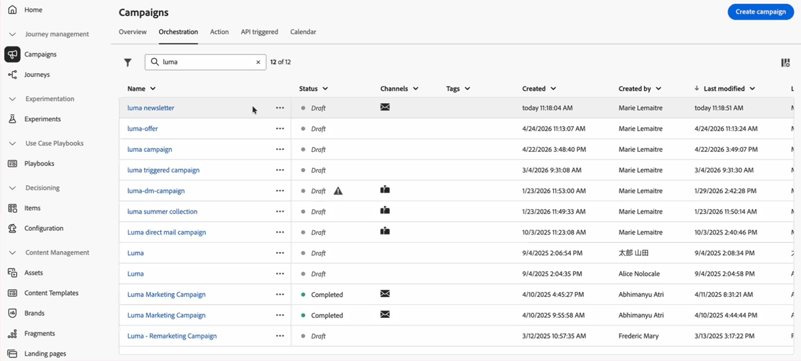

# 發行說明2026年 {#release-notes-2026}

本頁面列出了[!DNL Journey Optimizer]於2026年發行的所有功能和改善。

## 2026年4月發行說明 {#april-26-rn}

**發行日期**：2026 年 4 月 28 日至 29 日

### 新功能 {#april-26-features}

下列功能已於2026年4月發行。

<table>
<thead>
<tr>
<th><strong>協調行銷活動中的增量查詢活動</strong> </th>
</tr>
</thead>
<tbody>
<tr>
<td>

<strong>協調的行銷活動</strong>現在支援<strong>增量查詢</strong>活動，其目標僅是自上次執行以來新獲資格的輪廓或事件。

這可讓週期性行銷活動專注於全新客群 (新註冊、新獲資格的忠誠度會員和類似客群)，同時減少查詢工作量，並避免隨著時間推移而出現的重複傳送。

如需詳細資訊，請參閱<a href="../orchestrated/activities/incremental-query.md#incremental-query-configuration">詳細文件</a>。

推出日期： 2026年4月30日

</td>
</tr>
</tbody>
</table>

<table>
<thead>
<tr>
<th><strong>電子郵件標頭中的寄件者參數</strong> </th>
</tr>
</thead>
<tbody>
<tr>
<td>

透過 Journey Optimizer，您現在可以在傳輸實體 (寄件者) 與編寫實體 (編寫者) 不同的情況下傳送電子郵件。 支援此功能的電子郵件用戶端通常會將其轉譯為「代表編寫者的寄件者」或顯示「透過」指標。 填寫電子郵件管道設定中選填的<strong>寄件者標題</strong>欄位，以設定此功能。

如需詳細資訊，請參閱<a href="../email/header-parameters.md#sender-header">詳細說明文件</a>。

</td>
</tr>
</tbody>
</table>

<table>
<thead>
<tr>
<th><strong>電子郵件管道設定中的 CC 欄位</strong> </th>
</tr>
</thead>
<tbody>
<tr>
<td>

您現在可以在電子郵件管道設定中設定選用的 CC (副本) 欄位。 不同於 BCC，CC 收件者對主要收件者可見，可實現透明通訊和更清晰的擁有權。

這可讓您自動複製每則訊息上正確的利害關係人，例如關係經理或帳戶擁有者，同時確保客戶知道要聯絡誰以進行後續追蹤。

CC 欄位支援個人化，因此單一設定可根據輪廓資料動態路由副本，使其可在多個使用案例中擴充，而無需其他設定。

如需詳細資訊，請參閱<a href="../configuration/cc-email-field.md">詳細說明文件</a>。

</td>
</tr>
</tbody>
</table>

<table>
<thead>
<tr>
<th><strong>跨沙箱複製協調的行銷活動</strong> </th>
</tr>
</thead>
<tbody>
<tr>
<td>

沙箱工具現在支援將協調的行銷活動從一個沙箱封裝和複製到另一個沙箱。 如此一來，您就不需要在每個環境中手動重新建立行銷活動。 封裝行銷活動時，會自動包含其核心相依物件，例如合併原則、訊息，以便匯入的行銷活動到達時便能進行設定和驗證。 為了保護生產環境，所有匯入的行銷活動都會以草稿狀態傳送至目標沙箱中，在任何行銷活動上線之前為團隊提供審查和核准步驟。

如需詳細資訊，請參閱<a href="../configuration/copy-objects-to-sandbox.md">詳細說明文件</a>。

</td>
</tr>
</tbody>
</table>

<table>
<thead>
<tr>
<th><strong>透過 MCP 整合 Journey Optimizer AI 代理</strong> </th>
</tr>
</thead>
<tbody>
<tr>
<td>

Adobe Journey Optimizer現在提供<strong>MCP （模型內容通訊協定）伺服器</strong>，直接在任何MCP相容應用程式中呈現行銷活動、管道設定和沙箱作業。 透過這項整合，不同的角色可以圍繞相同的協調資料共同作業。 您可以對話形式描述您的意圖，讓 LLM 叫用適當的 MCP 工具，而無需針對 Adobe Journey Optimizer REST API 撰寫查詢或導覽多個 UI 畫面。 此功能目前在網頁版和桌面版 Claude 中提供。

此功能以公開 Beta 版的形式提供給所有客戶。

如需詳細資訊，請參閱<a href="../integrations/ajo-mcp.md">詳細文件</a>。

</td>
</tr>
</tbody>
</table>

<table>
<thead>
<tr>
<th><strong>歷程仲裁 – AI 模型</strong> </th>
</tr>
</thead>
<tbody>
<tr>
<td>

您現在可以在排名公式中使用 <strong>AI 模型</strong>，根據客戶輪廓屬性和內容因素自動提升歷程優先順序分數，確保客戶進入最相關的歷程。

此功能僅適用於一組組織 (可用性限制)。 若想取得存取權，請聯絡您的 Adobe 代表。

如需詳細資訊，請參閱<a href="../conflict-prioritization/journey-ai-models.md">詳細說明文件</a>。

</td>
</tr>
</tbody>
</table>

<table>
<thead>
<tr>
<th><strong>Adobe Express 整合</strong> </th>
</tr>
</thead>
<tbody>
<tr>
<td>

Adobe Journey Optimizer 中的 <b>Adobe Express 整合</b>可讓您在內容建立期間直接使用 Adobe Express 的編輯工具，以便調整大小、移除背景、裁切，以及將資產轉換為 JPEG 或 PNG。

此功能之前以「有限可用性」的名義發行，目前所有環境都適用 (一般可用性)。

如需詳細資訊，請參閱<a href="../integrations/express.md">詳細說明文件</a>。

推出日期：2026 年 4 月 23 日

</td>
</tr>
</tbody>
</table>

<table>
<thead>
<tr>
<th><strong>針對 AI 收件匣最佳化電子郵件</strong> </th>
</tr>
</thead>
<tbody>
<tr>
<td>

Adobe Journey Optimizer 現在包含新功能，可確保您的電子郵件結構最佳化，以便用於 Apple Intelligence 和 Gmail 中的 Google Gemini 等 AI 支援收件匣。

隨著 AI 助理日益控制收件者讀取和操作電子郵件的方式，此功能可幫助您產生和製作可在下游 AI 工作 (包括摘要、分級、優先順序設定和意圖擷取) 中妥善執行的內容。

如需詳細資訊，請參閱<a href="../email/llm-email-optimizer.md">為 AI 收件匣最佳化電子郵件</a>。

推出日期：2026 年 4 月 17 日

</td>
</tr>
</tbody>
</table>

<table>
<thead>
<tr>
<th><strong>個人化運算式的 AI 助理</strong> </th>
</tr>
</thead>
<tbody>
<tr>
<td>

[!DNL Adobe Journey Optimizer] 現在在個人化編輯器中直接包含<strong>AI助理</strong>，以及可將自然語言提示轉換為有效個人化運算式和條件邏輯的電子郵件Designer，不需要語法專業知識。 描述您想要實現的個人化，而 AI 會產生現成的程式碼，您可以立即套用或透過後續提示進行調整。

助理也會反向運作。 選取任何現有的運算式，並要求其說明邏輯、識別問題或提出改進建議。 這可讓此工具不僅適合用於撰寫新運算式，也適合用於檢閱及偵錯團隊中的現有運算式。

如需詳細資訊，請參閱<a href="../content-management/generative-personalization-expressions.md">適用於個人化運算式的 AI 助理</a>。

推出日期：2026 年 4 月 13 日

</td>
</tr>
</tbody>
</table>

<table>
<thead>
<tr>
<th><strong>歷程路徑實驗</strong> </th>
</tr>
</thead>
<tbody>
<tr>
<td>

使用新的<strong>最佳化</strong>節點，執行 A/B 測試或多臂老虎機實驗，以判斷達到以業務為中心的 KPI 所需的最佳途徑。 此工具可讓您測試、變更及自訂通訊、順序和時間，以便最好地觸及客戶。

此功能之前以「有限可用性」的名義發行，目前所有環境都適用 (一般可用性)。

作為「一般可用性」的一部分，此版本針對單一歷程引入了<strong>實驗類型</strong>選擇 (A/B 或多臂老虎機) 和<strong>擴充獲勝者</strong>。

如需詳細資訊，請參閱<a href="../building-journeys/path-experimentation.md">詳細說明文件</a>。

推出日期：2026 年 4 月 7 日

</td>
</tr>
</tbody>
</table>

<table>
<thead>
<tr>
<th><strong>收件匣</strong> </th>
</tr>
</thead>
<tbody>
<tr>
<td>

<strong>收件匣</strong>是一項行動功能，可搭配內容卡使用，允許客戶在應用程式或網站中建立集中式位置，以顯示傳送給使用者的訊息。 這可延長行銷通訊的存留期，確保即使在訊息關閉後，仍可存取訊息。

如需詳細資訊，請參閱<a href="../inbox/inbox-gs.md">詳細說明文件</a>。

推出日期：2026 年 4 月 7 日

</td>
</tr>
</tbody>
</table>

<table>
<thead>
<tr>
<th><strong>電子郵件管道的決策支援</strong> </th>
</tr>
</thead>
<tbody>
<tr>
<td>

您現在可以使用 <strong>Decisioning</strong> 來個人化並最佳化電子郵件訊息的內容。 利用優先順序分數、公式或 AI 模型，向每位收件者顯示最相關的產品建議和內容。

此功能之前以「有限可用性」的名義發行，目前所有環境都適用 (一般可用性)。 在此「一般可用性」版本中，現在支援鏡像頁面。

如需詳細資訊，請參閱<a href="../experience-decisioning/create-decision-policy.md">詳細說明文件</a>。

推出日期：2026 年 4 月 6 日

</td>
</tr>
</tbody>
</table>

### 改善 {#april-26-improv}

以下改良功能也於2026年4月發行。

#### AI

<!--
* **Brand alignment score in Campaign dashboard** - You can now assess your brand alignment score directly within your Campaign dashboard to ensure content stays on-brand. This allows you to verify guidelines at a glance without having to open the content designer.
-->

* **提示助理增強功能** - 提示助理可以即時分析使用者提示，並找出清晰度、完整性和內容之間的差距，藉此增強 AI 內容的產生能力。 它建議改善重寫，並提供可操作的指引，以利用客群、語調和意圖等關鍵詳細資訊擴充提示。 此功能也會提出針對性的澄清問題，以協助使用者在產生之前調整其輸入。 如此一來，可減少反覆操作，並提供更精確、高品質的輸出。 [了解更多](../content-management/ai-assistant-prompting-guide.md#prompt-assistant)

  推出日期： 2026年5月5日

#### 推播

* **在管道設定中個人化應用程式 ID** - 在推播管道設定中，您現在可以個人化&#x200B;**應用程式 ID** 欄位，讓每位收件者都能根據其輪廓資訊，從適當的品牌接收推播通知。 [閱讀全文](../push/push-configuration.md#app-id-personalization)

#### 決策

* **決定移轉工作流程API** — 建立相依性分析和移轉工作流程的API合約已更新：在要求URL （`sandbox`、`offer`或`decision`）上傳遞&#x200B;**`request-level`**&#x200B;作為&#x200B;**查詢引數**。 JSON內文中不得再傳送請求層級。 [閱讀全文](../experience-decisioning/decisioning-migration-api.md)

  推出日期： 2026年5月6日

* **將片段附加至決策項目** - Journey Optimizer 現在提供將片段附加至決策項目的功能，而決策項目可透過決策原則用於程式碼型體驗和電子郵件行銷活動。 [閱讀全文](../experience-decisioning/fragments-decision-policies.md)

  此功能之前以「有限可用性」的名義發行，目前所有環境都適用 (一般可用性)。

* **已略過暫時無法使用的片段** - 在決策項目中使用片段時，如果 Edge 上暫時無法使用片段，則會略過該片段，而且歷程或行銷活動會繼續轉譯而不是失敗。 [閱讀全文](../experience-decisioning/fragments-decision-policies.md#temporary-unavailable-fragments)

  推出日期：2026 年 4 月 14 日

#### Adobe Experience Manager 整合

* **Adobe Experience Manager內容片段變數支援** — 您可以在插入Adobe Experience Manager內容片段時選取&#x200B;**內容片段變數** （例如語言或頻道變數），以改善地區設定和多語言情境的處理方式。 [閱讀全文](../integrations/aem-fragments.md#aem-variations)

  此功能之前以「有限可用性」的名義發行，目前所有環境都適用 (一般可用性)。

* **製作時 Adobe Experience Manager 內容片段內容** - 當您在文字欄位和內容區塊之間移動時，您的內容片段選取範圍會保持作用中，因此您可以新增更多片段欄位，而無需每次重新開啟&#x200B;**開啟 AEM 內容顧問**。 [閱讀全文](../integrations/aem-fragments.md)

  此功能之前以「有限可用性」的名義發行，目前所有環境都適用 (一般可用性)。

#### 電子郵件設計

* **適用於電子郵件內容的進階 HTML 編輯器** - 進階 HTML 模式可讓您在電子郵件設計工具中編輯內容的 HTML 來源，在來源中新增進階運算式 (例如條件)，以及在 HTML 檢視和桌面檢視之間切換，而不會遺失您的變更。

  此功能先前僅可用於電子郵件內容範本；現在，除電子郵件內容範本外，此功能已部署至電子郵件設計工具中的&#x200B;**電子郵件**&#x200B;內容 (例如，在歷程及行銷活動中撰寫的電子郵件)。 目前僅以「有限可用性」提供，請聯絡您的 Adobe 代表以取得存取權。 [閱讀全文](../email/email-expert-mode.md)

  推出日期：2026 年 4 月 9 日

#### 歷程

* **在歷程屬性中可見的目前歷程裝載大小** — 歷程屬性面板現在會顯示與設定的限制相較之目前歷程裝載的大小 — 例如，*1.5 MB （共4 MB）*。 此唯讀指標可協助您在發佈前監控歷程複雜性，並避免因超過裝載大小限制而造成的錯誤。 [閱讀全文](../building-journeys/journey-properties.md#journey-payload-size)

  推出日期： 2026年4月30日

#### 歷程路徑最佳化

* **實驗類型** - 您現在可以在設定路徑實驗時，選擇 A/B 實驗 (開始時固定分割) 或多臂老虎機 (每週更新權重的自動分割)。 [閱讀全文](../building-journeys/path-experimentation.md)

  推出日期：2026 年 4 月 7 日

* **路徑實驗：擴充獲勝者** - 您現在可以透過自動或手動方式，將實驗的獲勝路徑推廣給所有客群。 一旦確定獲勝路徑，您就可以擴大其觸及範圍和有效性，而無需持續監視實驗。 [閱讀全文](../building-journeys/path-experimentation.md#scale-winner)

  此功能僅適用於單一歷程 (事件觸發和客群資格)。 它不適用於讀取客群歷程。

  推出日期：2026 年 4 月 7 日

* **條件** - [最佳化](../building-journeys/optimize.md)活動是在歷程中建立條件路徑的新工具。 它取代了先前的&#x200B;**條件**&#x200B;活動，此活動已從 UI 中移除。 所有條件式邏輯都會保留，現在會透過&#x200B;**最佳化**&#x200B;活動的條件來處理。 [閱讀全文](../building-journeys/conditions.md)

  此功能之前以「有限可用性」的名義發行，目前所有環境都適用 (一般可用性)。

  推出日期：2026 年 4 月 7 日

#### 協調的行銷活動

* **協調行銷活動中的全域變數** - 協調行銷活動現在支援全域變數，這些變數只需定義一次，便可在工作流程內的所有活動中重複使用，進而簡化設定，並確保動態值、運算式和內容個人化的一致性。 [閱讀全文](../orchestrated/global-variables.md)
* **資料建模工具增強功能** - 協調的關聯式結構描述現在支援跨多個欄位的複合金鑰。 從 DDL 檔案載入結構描述也會產生分項清單，而從 DDL 或 Excel 檔案載入會自動建立表格之間的複合關係。 在實體關係檢視中，複合連結現在會在檔案上傳後，顯示表格之間的完整欄位配對集。 [閱讀全文](../orchestrated/gs-schemas.md)

## 2026 年 3 月發行說明 {#march-26-rn}

[新功能](#march-26-features)和[改進功能](#march-26-improv)區段涵蓋已提供的功能。<!--The [Coming soon](#coming-soon) section lists features and improvements scheduled for release later in March.-->

<!--
**The pre-release notes below are subject to change without prior notice until the release availability date**. Links, screens and updated documentation are published in the release notes, at the release date.

See also [Adobe Experience Platform pre-release notes](https://experienceleague.adobe.com/zh-hant/docs/experience-platform/release-notes/pre-release-notes){target="_blank"}.
-->

**發行日期**：2026 年 3 月 24 日至 25 日

### 新功能 {#march-26-features}

<table>
<thead>
<tr>
<th><strong>URL 參數加密</strong> </th>
</tr>
</thead>
<tbody>
<tr>
<td>

已新增至您的電子郵件訊息的追蹤和登陸頁面連結中的 URL 參數現在可以加密，為敏感參數資料提供額外的保護層。

<ul>
<li>在專用的<strong>管理</strong>登錄中註冊及管理加密金鑰。</li>
<li>在運算式中使用新的「Encrypt」協助程式函式，針對您要在轉譯時保護的查詢參數，加密 URL 中的敏感資料。</li>
</ul>

此功能僅適用於一組組織 (可用性限制)。 若想取得存取權，請聯絡您的 Adobe 代表。

如需詳細資訊，請參閱<a href="../personalization/url-parameter-encryption.md">詳細說明文件</a>。

推出日期：2026 年 3 月 31 日

</td>
</tr>
</tbody>
</table>

<table>
<thead>
<tr>
<th><strong>將影像轉換為電子郵件內容範本</strong> </th>
</tr>
</thead>
<tbody>
<tr>
<td>

您現在可以直接在 Journey Optimizer 中將影像轉換為電子郵件內容範本。 使用 AI 支援的分析，從視覺參考自動產生結構化 HTML 範本，大幅縮短電子郵件設計時間。

此功能之前以「有限可用性」的名義發行，目前所有環境都適用 (一般可用性)。

如需詳細資訊，請參閱<a href="../content-management/image-to-html.md">詳細說明文件</a>。

推出日期：2026 年 3 月 31 日

</td>
</tr>
</tbody>
</table>

<table>
<thead>
<tr>
<th><strong>登陸頁面自訂表單</strong> </th>
</tr>
</thead>
<tbody>
<tr>
<td>

使用 [!DNL Journey Optimizer]，可以透過登陸頁面擷取輪廓屬性。

根據特定資料集，建立、設計和管理為您的需求量身打造的自訂表單。 然後，您可以在登陸頁面中善用自訂表單，將選擇的設定檔屬性新增至為每個表單定義的資料集。

此功能之前以「有限可用性」的名義向美國和澳洲的客戶發行，目前所有環境都適用 (一般可用性)。

如需詳細資訊，請參閱<a href="../landing-pages/lp-forms.md">詳細說明文件</a>。

推出日期：2026 年 3 月 26 日。

</td>
</tr>
</tbody>
</table>

<table>
<thead>
<tr>
<th><strong>在協調的行銷活動中測試活動</strong> </th>
</tr>
</thead>
<tbody>
<tr>
<td>

新的<strong>測試</strong>活動現在可用於協調的行銷活動。 此活動會根據定義的條件，將工作流程執行路由至不同的分支，讓您在啟用即時傳遞之前，先驗證行銷活動邏輯和設定。

如需詳細資訊，請參閱<a href="../orchestrated/activities/test.md">詳細說明文件</a>。

</td>
</tr>
</tbody>
</table>

<table>
<thead>
<tr>
<th><strong>歷程中的資料集查詢支援</strong> </th>
</tr>
</thead>
<tbody>
<tr>
<td>

歷程中的新<strong>資料集查詢</strong>活動可讓您在執行階段動態擷取 Adobe Experience Platform 記錄資料集的資料，允許您存取不屬於輪廓或事件承載的資訊，以便客戶互動保持相關且即時。

歷程中的資料集查詢活動先前以「有限可用性」的名義向一組有限組織發行，現在提供給所有有權使用 [資料集查詢](../data/lookup-aep-data.md) 的客戶，但同時仍為「有限可用性」。

如需詳細資訊，請參閱<a href="../building-journeys/dataset-lookup.md">詳細說明文件</a>。

</td>
</tr>
</tbody>
</table>

<table>
<thead>
<tr>
<th><strong>動作活動會取代管道特定的歷程活動</strong> </th>
</tr>
</thead>
<tbody>
<tr>
<td>

在 2026 年 2 月<strong>動作活動</strong>以「一般可用性」的名義發行後，歷程畫布中的舊版原生管道活動 (電子郵件、推播、簡訊、應用程式內、網頁、程式碼型體驗和內容卡) 現已棄用。

您現在必須使用單一動作活動來設定所有管道動作，不再需要個別的管道專用節點。

使用舊版管道活動的現有歷程仍可繼續運作，無需進行任何變更或移轉。

如需詳細資訊，請參閱<a href="../building-journeys/journey-action.md">詳細說明文件</a>。

</td>
</tr>
</tbody>
</table>

<table>
<thead>
<tr>
<th><strong>適用於電子郵件範本的進階 HTML 編輯器</strong> </th>
</tr>
</thead>
<tbody>
<tr>
<td>

適用於電子郵件內容範本的進階 HTML 模式可讓您在電子郵件設計工具中編輯內容的 HTML 來源，在來源中新增進階運算式 (例如條件)，以及在 HTML 檢視和桌面檢視之間切換，而不會遺失您的變更。

此功能僅適用於電子郵件管道的內容範本。 目前僅以「有限可用性」提供，請聯絡您的 Adobe 代表以取得存取權。

如需詳細資訊，請參閱<a href="../email/email-expert-mode.md">詳細說明文件</a>。

推出日期：2026 年 3 月 10 日

</td>
</tr>
</tbody>
</table>

<table>
<thead>
<tr>
<th><strong>自訂 Firefly 模型與第三方影像產生模型的整合</strong> </th>
</tr>
</thead>
<tbody>
<tr>
<td>

啟用標準與自訂 Firefly 模型，以及經核准的第三方影像模型的緊密整合，以便在生成影像時提供更大的彈性、控制力及品牌一致性。

選擇符合您需求的正確模型：

<ul><li> <strong>Adobe 模型</strong> (由 Firefly Image Model 4 提供支援) 可立即產生影像，無需額外設定</li><li> <strong>合作夥伴模型</strong> (由 Gemini 2.5 Flash 提供支援) 提供專門的功能</li><li><strong>自訂模型</strong> (在您自己的資產上訓練的品牌特定模型) 用於符合品牌形象的產生，完全符合您的品牌識別、風格和視覺准則。</li></ul>

如需詳細資訊，請參閱<a href="../content-management/generative-models.md">詳細文件</a>。

推出日期：2026 年 3 月 2 日

</td>
</tr>
</tbody>
</table>

<table>
<thead>
<tr>
<th><strong>iOS 的即時動態</strong> </th>
</tr>
</thead>
<tbody>
<tr>
<td>

透過 Adobe Journey Optimizer 中的 <strong>iOS 即時動態</strong>，直接將即時體驗帶入客戶的鎖定畫面和動態島。 提供即時更新，從訂單追蹤和航班狀態到事件倒計時、即時分數和傳送進度，而不需要使用者開啟您的應用程式。 即時為客群提供最新資訊，並在正確的時間讓客群在所在位置參與。

此功能之前以 Beta 版本發行，目前所有環境都適用 (一般可用性)。

如需詳細資訊，請參閱<a href="../mobile-live/get-started-mobile-live.md">詳細文件</a>。

推出日期：2026 年 3 月 3 日

</td>
</tr>
</tbody>
</table>

<table>
<thead>
<tr>
<th><strong>Journey 代理：管道內容建立</strong> </th>
</tr>
</thead>
<tbody>
<tr>
<td>

由 <strong>Adobe Experience Platform Agent Orchestrator</strong> 提供技術支援，<strong>Journey 代理</strong> 可在 Journey Optimizer 中使用，並可讓您透過自然語言介面分析歷程。 您現在也可以直接在 Journey 代理中產生和管理管道特定內容、建立電子郵件和推播之類的管道內容、套用和預覽範本、透過提示調整語調和風格，以及在<strong>內容設計工具</strong>中開啟內容以進行內容內編輯。

此功能僅適用於一組組織 (可用性限制)。 若想取得存取權，請聯絡您的 Adobe 代表。

如需詳細資訊，請參閱<a href="https://experienceleague.adobe.com/docs/experience-cloud-ai/experience-cloud-ai/agents/ajo-agent.html?lang=zh-Hant" target="_blank">詳細文件</a>。

推出日期：2026 年 3 月 4 日

</td>
</tr>
</tbody>
</table>

<table>
<thead>
<tr>
<th><strong>AI 模型監視</strong> </th>
</tr>
</thead>
<tbody>
<tr>
<td>

Journey Optimizer 現在可讓您監視 Decisioning AI 模型的健康情況、訓練狀態和效能。 這可讓您驗證訓練是否成功、疑難排解失敗，並瞭解對您結果的影響，以便使用 AI 為每位客戶選取最佳產品建議。 請注意，此功能僅適用於 <strong>Decisioning</strong> (不適用於舊版決策管理模型)。

此功能目前僅適用於<strong>個人化最佳化</strong>模型 (非自動最佳化)。

如需詳細資訊，請參閱<a href="../experience-decisioning/ranking/ai-model-observability.md">詳細說明文件</a>。

推出日期：2026 年 3 月 9 日

</td>
</tr>
</tbody>
</table>

<table>
<thead>
<tr>
<th><strong>使用訊號觸發協調的行銷活動</strong> </th>
</tr>
</thead>
<tbody>
<tr>
<td>

現在可以透過 <strong>API 訊號</strong>觸發協調的行銷活動。 若要進行此設定，請將目標行銷活動設定為<strong>由訊號觸發</strong>，發佈行銷活動，然後使用 API 呼叫引發。 API 呼叫中包含的任何參數都可在執行的行銷活動中作為變數使用。 請注意，訊號觸發的協調行銷活動仍為<strong>批次</strong>行銷活動，與 API 觸發的行銷活動不同。

如需詳細資訊，請參閱<a href="../orchestrated/trigger-orchestrated-campaign.md">詳細說明文件</a>。

</td>
</tr>
</tbody>
</table>

<table>
<thead>
<tr>
<th><strong>協調行銷活動中的交易型類別</strong> </th>
</tr>
</thead>
<tbody>
<tr>
<td>

在協調的行銷活動中，您現在可以將管道活動設定為<strong>交易型</strong>類別。 這會將交易型管道設定套用至該活動，在業務規則不應套用或客戶不需要選擇加入時很有用。

如需詳細資訊，請參閱<a href="../orchestrated/activities/channels.md#add">詳細說明文件</a>。

在接下來幾天內，此功能會逐步推廣到所有地區。

</td>
</tr>
</tbody>
</table>

### 改善 {#march-26-improv}

以下列舉部分發布內容附上的改良功能。

#### 個人化

* **完整/基本 URL 個人化** - 您可以使用輪廓屬性 (例如網域或路徑) 個人化目的地 URL。 若要啟用此功能，請向 Adobe 提供您接受的網域清單。 [閱讀全文](../personalization/personalization-build-expressions.md#where)

  此功能之前以「有限可用性」的名義發行並供歷程使用，目前所有環境都適用 (一般可用性)。

  推出日期：2026 年 4 月 1 日

#### 報告

* **傳送時間最佳化：更新的控制項位置和新的提升度報告** - 傳送時間最佳化 (STO) 控制項已重新放置到 [動作] 設定功能表。 此外，歷程報表現在提供新的提升度報告，以測量 STO 對行銷活動績效量度的影響。 [閱讀全文](../reports/channel-report-cja.md#optimization-models)

  推出日期：2026 年 3 月 27 日

<!--
* **Exclude bot clicks for email and SMS reporting** - Email and SMS reporting now automatically filters out bot clicks from click metrics, providing more accurate engagement data and preventing automated traffic from inflating your performance figures.

#### Email Designer

* **Email Designer displayed in Unified Shell** - The Email Designer is now displayed within the Unified Shell experience, providing a consistent navigation and header experience that aligns with other Adobe applications.

* **Text mode support in fragments** - To support text-based email workflows, you can now create and manage text versions of your visual fragments for optimal use in the plain text version of emails that include that fragment.

  **Caution:** When using a fragment that was created before the current release, the fragment text version may be incorrectly rendered—both in the Email Designer and in the final email delivered to your recipients. For best results with older fragments, edit, save and republish each fragment.
-->

#### 設定

<!--* **Folders for journeys and campaigns** - You can now organize your journeys and campaigns into folders, enabling structured navigation and easier management for teams working with large volumes of content. This capability is only available for a set of organizations (Limited Availability). To gain access, contact your Adobe representative.-->

* **AJO 網域憑證續約失敗** - 您現在可以透過電子郵件或在 Journey Optimizer 通知中心訂閱接收系統警示，瞭解用於電子郵件傳遞的網域憑證何時接近過期或已過期。 [閱讀全文](../reports/alerts.md#alert-certificates-renewal-unsuccessful)

  推出日期：2026 年 3 月 26 日

* **AJO 次要收件者意見回饋事件資料集重新命名** - `AJO Email BCC Feedback Event` 資料集已重新命名為 `AJO Secondary Recipient Feedback Event` 資料集。 其影響會依您的情況而有所不同：

   * **現有使用者**：只更新顯示名稱。 基礎資料表名稱保持不變。
   * **新使用者和沙箱**：顯示名稱和表格名稱都會反映新名稱。
   * **具有新沙箱的現有使用者**：顯示名稱和表格名稱都會更新為新名稱。

  >[!NOTE]
  >
  >新資料集會立即顯示新名稱。 對於較舊的資料集名稱，回填和調和會逐步進行，並且可能需要幾週的時間才能完成。

  推出日期：2026 年 3 月 2 日

#### 歷程

* **更新輪廓動作：支援多個輪廓屬性** - **更新輪廓**&#x200B;動作活動現在支援在單一節點中最多更新五個輪廓屬性。 以前，每個動作一次只能更新一個屬性，因此需要多個節點來更新多個屬性。 使用新的&#x200B;**更新其他欄位**&#x200B;按鈕來新增其他欄位/值組，減少版面複雜性並改善效能。 [了解更多](../building-journeys/update-profiles.md)

* **在歷程中波次傳送傳出訊息** - 您現在可以排程來自 Journey Optimizer 歷程的訊息，在一段時間內以受控批次方式傳送。 [了解更多](../building-journeys/send-using-waves.md)

  此功能之前以「有限可用性」的名義發行並供歷程使用，目前所有環境都適用 (一般可用性)。

  推出日期：2026 年 3 月 16 日

* **歷程技術詳細資料中的暫停和繼續詳細資料** - 歷程&#x200B;**技術詳細資料**&#x200B;現在包含額外的暫停和繼續詳細資料：上次暫停和繼續的日期和時間、執行每個動作之使用者的顯示名稱和內部識別碼，以及整套暫停的歷程設定，例如暫停行為、最長暫停期間和自動繼續狀態。 [了解更多](../building-journeys/journey-properties.md)

  推出日期：2026 年 3 月 2 日

#### 決策

* **決策移轉 — 產品建議與內容屬性** - 移轉 API 實體對應現在會列出&#x200B;**產品建議屬性** (個人化產品建議項目結構描述上的 `migratedofferattributes`) 與&#x200B;**內容屬性** (移轉資料集結構描述上的 `migratedcontextattributes`)。 [閱讀全文](../experience-decisioning/decisioning-migration-api.md#entity-mapping)

  推出日期：2026 年 3 月 31 日

<!--
## Coming soon {#coming-soon}

The features and improvements below are planned for release later in March/early April. Release dates and scope are **subject to change without prior notice**.

WAITING RELEASE DATE CONFIRMATION * **Target dimension simplification in Orchestrated Campaigns** - The active targeting dimension is now shown on the workflow canvas, so you can see which dimension is used by a channel activity. The multi-entity segmentation flow is simpler as you no longer need a separate "Change dimension" activity. Moreover, you can now choose explicitly whether messages are sent at the profile level or at a secondary dimension level.

WAITING RELEASE DATE CONFIRMATION
* **Target dimension simplification in Orchestrated Campaigns** - The active targeting dimension is now shown on the workflow canvas, so you can see which dimension is used by a channel activity. The multi-entity segmentation flow is simpler as you no longer need a separate "Change dimension" activity. Moreover, you can now choose explicitly whether messages are sent at the profile level or at a secondary dimension level.
-->

## 2026年2月發行說明 {#feb-26-01-rn}

### 新功能 {#feb-26-01-features}

<table>
<thead>
<tr>
<th><strong>歷程仲裁</strong> </th>
</tr>
</thead>
<tbody>
<tr>
<td>

您現在可以使用<strong>排名公式</strong>，根據客戶設定檔屬性和內容因素，自動提升歷程優先順序分數，確保客戶進入最相關的歷程。

此功能僅適用於一組組織 (可用性限制)。 若想取得存取權，請聯絡您的 Adobe 代表。

如需詳細資訊，請參閱<a href="../conflict-prioritization/journey-ranking-formulas.md">詳細說明文件</a>。

推出日期： 2026年2月24日

</td>
</tr>
</tbody>
</table>

<table>
<thead>
<tr>
<th><strong>歷程中的動作活動</strong> </th>
</tr>
</thead>
<tbody>
<tr>
<td>

Journey Optimizer支援新的通用<strong>動作活動</strong>，可讓您設定單一動作和多動作傳入動作群組，以簡化歷程畫布中的動作設定。 尤其是這項新功能允許：

<ul>
<li>簡化歷程畫布中的原生動作設定。</li>
<li>容量用來建立多動作傳入動作群組。</li>
<li>能夠將最佳化新增至任何內建管道動作。</li>
<li>能夠新增實驗和多語言選項至任何動作。</li>
</ul>

此功能之前以「有限可用性」的名義發行，目前所有環境都適用 (一般可用性)。

如需詳細資訊，請參閱<a href="../building-journeys/journey-action.md">詳細文件</a>。

推出日期：2026年2月20日

<strong>注意：</strong>所有原生頻道現在都可透過動作歷程活動存取。 舊版原生管道活動將在3月版本中停用。 包含舊版動作的現有歷程仍可繼續正常運作，無需移轉。

</td>
</tr>
</tbody>
</table>

<table>
<thead>
<tr>
<th><strong>傳出訊息的波動傳送</strong> </th>
</tr>
</thead>
<tbody>
<tr>
<td>

您現在可以排程來自Journey Optimizer行銷活動或歷程的訊息，以控管批次方式隨時間傳遞。

波次傳送提供下列優點：

<ul>
<li>更好的可遞送性 — 隨著時間推移分散式傳送，以協助維持強大的傳送者信譽，並降低被標籤為垃圾訊息的風險。</li>
<li>載入控制 — 透過限制同時傳出的訊息數量，避免讓下游系統（例如呼叫中心、登陸頁面）不堪重負。</li>
<li>大量且有時效性的使用案例 — 適合大型對象，或您需要控制時機時（例如客服中心容量、加電或有時限的選件）。</li>
</ul>

在<strong>行銷活動</strong>中，此功能適用於所有環境（一般可用性）。 如需詳細資訊，請參閱<a href="../campaigns/send-using-waves.md">詳細文件</a>。

在<strong>歷程</strong>中，此功能僅適用於一組組織（可用性限制） — 若要取得存取權，請聯絡您的Adobe代表。 如需詳細資訊，請參閱<a href="../building-journeys/send-using-waves.md">詳細文件</a>。

推出日期： 2026年2月19日

</td>
</tr>
</tbody>
</table>

<table>
<thead>
<tr>
<th><strong>將子網域移轉至自訂委派</strong> </th>
</tr>
</thead>
<tbody>
<tr>
<td>

您現在可以從介面使用CNAME委派模式將子網域移轉至自訂委派，這樣您就可以符合公司指引的更嚴格安全性原則，而無需重新建立通道設定。

此功能僅適用於一組組織 (可用性限制)。 若想取得存取權，請聯絡您的 Adobe 代表。

如需詳細資訊，請參閱<a href="../configuration/custom-subdomain-migration.md">詳細說明文件</a>。

推出日期： 2026年2月19日

</td>
</tr>
</tbody>
</table>

<table>
<thead>
<tr>
<th><strong>網頁推播通知頻道</strong> </th>
</tr>
</thead>
<tbody>
<tr>
<td>

Adobe Journey Optimizer現在支援<strong>網頁推播通知</strong>，將推播通道擴充至行動裝置以外。 您可以順暢地將通知傳送至<strong>行動瀏覽器和桌面瀏覽器</strong>，讓您無需應用程式即可直接在其裝置上聯絡客戶。 此增強功能可讓您運用行動推播中現有的相同製作工作流程和目標定位功能，透過即時的個人化訊息與使用者互動。

此功能先前在Beta中發行，現在可供所有環境使用（全面發佈）。

如需詳細資訊，請參閱<a href="../push/push-configuration-web.md">詳細文件</a>。

推出日期： 2026年2月13日

</td>
</tr>
</tbody>
</table>

<table>
<thead>
<tr>
<th><strong>內容決活動</strong> </th>
</tr>
</thead>
<tbody>
<tr>
<td>

歷程畫布現在提供新的<strong>內容決定活動</strong>，可將個人化優惠直接整合至您的客戶歷程。 此活動可讓您提供決策型內容，並在整個歷程中參考這些優惠方案 — 在建立資格型分支的條件、在自訂動作中將優惠方案資料傳遞至外部系統，以及在其他活動中建立完全個人化的客戶體驗。

此功能之前以「有限可用性」的名義發行，目前所有環境都適用 (一般可用性)。

如需詳細資訊，請參閱<a href="../building-journeys/content-decision.md">詳細說明文件</a>。

推出日期：2026年2月10日

</td>
</tr>
</tbody>
</table>

<table>
<thead>
<tr>
<th><strong>自助移轉工具 API</strong> </th>
</tr>
</thead>
<tbody>
<tr>
<td>

移轉工具API現在可用於以程式設計方式將<strong>決定管理</strong>實體移轉到<strong>決定</strong>，其功能：

<ul>
<li>彈性的移轉範圍 (沙箱、產品建議或決策層級)</li>
<li>自動化相依性分析和驗證</li>
<li>已完成移轉的復原支援</li>
<li>包含物件對應的詳細移轉報表</li>
</ul>

如需詳細資訊，請參閱<a href="../experience-decisioning/decisioning-migration-api.md">詳細文件</a>。

推出日期：2026 年 2 月 3 日

</td>
</tr>
</tbody>
</table>

<table>
<thead>
<tr>
<th><strong>自訂動作監視</strong> </th>
</tr>
</thead>
<tbody>
<tr>
<td>

透過新的監視儀表板和豐富的歷程步驟事件資料，更深入瞭解insight的健康狀況和效能，讓您瞭解自訂動作端點。 追蹤成功的呼叫、錯誤、輸送量、回應時間和佇列等待時間，以快速瞭解異常情況發生的時間、地點和原因。

此功能之前以「有限可用性」的名義發行，目前所有環境都適用 (一般可用性)。

如需詳細資訊，請參閱<a href="../action/reporting.md">詳細文件</a>。

推出日期：2026 年 2 月 3 日

</td>
</tr>
</tbody>
</table>

<table>
<thead>
<tr>
<th><strong>簡訊頻道中的決策支援</strong> </th>
</tr>
</thead>
<tbody>
<tr>
<td>

您現在可以使用Decisioning個人化及最佳化SMS訊息內容。 使用優先順序分數、公式或 AI 模型，向客戶顯示最佳內容。

如需詳細資訊，請參閱<a href="../experience-decisioning/create-decision.md">詳細文件</a>。

推出日期：2026 年 2 月 2 日

</td>
</tr>
</tbody>
</table>

### 改善 {#feb-26-01-improv}

以下列舉部分發布內容附上的改良功能。

#### 設定

* **歷程運算式中的體驗事件使用方式** — 自2026年4月1日起，過去90天內未使用此功能的組織將不再支援在歷程運算式中使用體驗事件屬性。 自2025年7月8日起，新客戶組織已無法使用此功能。 如需其他選擇，請參閱歷程中的[體驗事件查閱](../building-journeys/exp-event-lookup.md)。

#### 內容管理

<!--
* **Update brands with new color tab** - Brand guidelines help ensure your brand is presented consistently across all touchpoints. The new <strong>Colors</strong> section defines the standards for your brand's color system, outlining how colors are selected, organized, and applied across experiences. It ensures consistent use of primary, secondary, accent, and neutral colors to support a cohesive, accessible, and recognizable brand identity. [Read more](../content-management/brands.md)
-->

* **使用主題將影像轉換為電子郵件範本** — 在Journey Optimizer中將影像轉換為電子郵件範本時，您現在可以使用主題作為輸入，讓產生的HTML遵循您的品牌引數。 系統會自動套用背景顏色、按鈕顏色、字型、行距、邊界及邊框間距等樣式，減少手動設計工作，並提供可立即使用且只需少量編輯的範本。 [閱讀全文](../content-management/image-to-html.md)

  推出日期：2026年2月17日。

<!--* **Text mode for fragments** - You can now create and manage text versions of your fragments, supporting workflows that rely on plain text content and providing the same flexibility as in email content. [Read more](../content-management/create-fragments.md)-->

#### 電子郵件設計工具

* **文字縮排** — 您現在可以直接從屬性面板將可自訂的左縮排套用至文字元件中的第一行段落。 <!--The new **Indentation** control lets you define indentation in pixels or percentage via a numeric input or slider, with live preview on the canvas. -->這可以改善長篇內容（例如編輯和文章）的可讀性。 [閱讀全文](../email/get-started-email-style.md)

  推出日期：2026年2月18日。

#### 決策

* **在決定中使用Adobe Experience Platform資料的Edge傳入支援** — 在決定中使用Adobe Experience Platform資料時，除了歷程中的電子郵件和自訂動作之外，現在還能支援邊緣傳入使用案例。 [閱讀全文](../experience-decisioning/aep-data-exd.md)

  此功能僅適用於一組組織 (可用性限制)。 若想取得存取權，請聯絡您的 Adobe 代表。

* **程式碼型體驗管道中的決策預覽** — 您現在可以在使用程式碼型體驗管道設定決策時預覽決策專案。 上線之前，可以直接在編寫介面中使用預覽。 [閱讀全文](../code-based/test-code-based.md#preview-code-based)

  推出日期： 2026年2月18日

<!--
THIS WAS FINALLY NOT RELEASED IN FEBRUARY

* **Attach fragments to decision items** - Journey Optimizer now provides the ability to attach fragments to decision items which can be leveraged in code-based experience campaigns through decision policies. [Read more](../experience-decisioning/fragments-decision-policies.md)

  Previously released in Limited Availability, this capability is now available to all environments (General Availability).

  Availability date: February 12, 2026.
-->

#### 個人化

* **執行中繼資料協助程式** - `executionMetadata`協助程式函式現在可供所有Journey Optimizer客戶使用。 使用此外掛程式來動態附加內容資訊至任何原生動作，並在資料集中擷取該資訊，以匯出至外部系統。 [閱讀全文](../personalization/functions/helpers.md#execution-metadata)

  此功能之前以「有限可用性」的名義發行，目前所有環境都適用 (一般可用性)。

  推出日期：2026年2月20日。

#### 簡訊

* **SMS Webhook** — 所有SMS提供者現在都支援Webhook。 您可以根據每個Webhook的預期用途進行設定：傳入Webhook以擷取傳入訊息，反饋Webhook以接收傳遞回條、狀態更新和其他訊息相關事件。 [閱讀全文](../sms/sms-webhook.md)

  推出日期：2026年2月2日。

## 2026 年 1 月發行說明 {#jan-26-rn}

<!--**Release date**: January 27-28, 2026-->

### 新功能 {#jan-26-01-features}

<table>
<thead>
<tr>
<th><strong>推播頻道中的決策支援</strong> </th>
</tr>
</thead>
<tbody>
<tr>
<td>

您現在可以使用<strong>決策</strong>個人化和最佳化<strong>推播通知</strong>的內容。 使用優先順序分數、公式或 AI 模型，向客戶顯示最佳內容。

具有推播通知的Experience Decisioning需要特定版本的Mobile SDK。 在實作此功能之前，請檢查<a href="https://developer.adobe.com/client-sdks/home/release-notes" target="_blank">發行說明</a>以識別所需的版本，並確定您已相應地升級。 您也可以在<a href="https://developer.adobe.com/client-sdks/home/current-sdk-versions" target="_blank">本節</a>中檢視您平台的所有可用SDK版本。

如需詳細資訊，請參閱<a href="../experience-decisioning/create-decision.md">詳細文件</a>。

推出日期：2026 年 1 月 30 日

</td>
</tr>
</tbody>
</table>

<table>
<thead>
<tr>
<th><strong>歷程中的直接郵件管道</strong> </th>
</tr>
</thead>
<tbody>
<tr>
<td>

以前僅限於行銷活動，現在歷程畫布上也提供<strong>直接郵件</strong>管道，可讓您將直接郵件整合到歷程中。 直接郵件現在可同時用於<strong>批次和 1:1 歷程案例</strong>，並支援檔案擷取設定和時間頻率設定。

此功能之前以「有限可用性」的名義發行，目前所有環境都適用 (一般可用性)。

如需詳細資訊，請參閱<a href="../direct-mail/get-started-direct-mail.md">詳細說明文件</a>。

推出日期： 2026年1月29日

</td>
</tr>
</tbody>
</table>

<table>
<thead>
<tr>
<th><strong>勿打擾時間 (不接收訊息的時間)</strong> </th>
</tr>
</thead>
<tbody>
<tr>
<td>

<strong>勿打擾時間</strong>可讓您定義不接收電子郵件、簡訊、推播和 WhatsApp 管道訊息的時間。 此功能可確保在特定時段內不會傳送任何訊息，協助您遵守客戶偏好設定和合規性要求。 您可以透過<strong>規則集</strong>套用勿打擾時間，這些規則集可指派給行銷活動或歷程中的個別動作，以進行精確控制。

此功能之前以「有限可用性」的名義發行，目前所有環境都可以使用。 在此「一般可用性」版本中，功能現在包括讓客戶將行銷活動動作排入佇列直到完成勿打擾時間，以及預覽啟用的勿打擾時間規則。

如需詳細資訊，請參閱<a href="../conflict-prioritization/quiet-hours.md">詳細說明文件</a>。

推出日期： 2026年1月29日

</td>
</tr>
</tbody>
</table>

<table>
<thead>
<tr>
<th><strong>訊息匯出</strong> </th>
</tr>
</thead>
<tbody>
<tr>
<td>

新的<strong>訊息匯出</strong>功能現在可用於電子郵件和簡訊管道。 此功能可讓您將傳送的訊息內容自動匯出至專用的 Experience Platform 資料集，讓您能夠：

<ul>
<li>符合法規合規性要求 (例如 HIPAA)</li>
<li>封存法律索償和客戶服務查詢的訊息</li>
<li>保留傳送給個人的個人化內容複本</li>
</ul>

從擷取之日起，記錄會在 AJO 訊息匯出資料集中保留 7 天。 在此保留期間，您可以透過Experience Platform目標將其匯出至您自己的儲存空間。 此功能已在管道設定層級啟用，可讓您對要匯出的訊息進行<strong>精細控制</strong>。

此功能僅適用於電子郵件和簡訊管道，以及已購買訊息匯出附加產品的組織。 如需詳細資訊，請聯絡您的 Adobe 代表。

如需詳細資訊，請參閱<a href="../configuration/message-export.md#message-export">詳細說明文件</a>。

推出日期：2026 年 1 月 28 日

</td>
</tr>
</tbody>
</table>

<table>
<thead>
<tr>
<th><strong>協調行銷活動中的直接郵件管道</strong> </th>
</tr>
</thead>
<tbody>
<tr>
<td>

協調行銷活動現在提供直接郵件管道。 <strong>直接郵件活動</strong>讓您在協調的行銷活動中傳送直接郵件更加方便，單次訊息和定期訊息皆適用。 此類活動可用於將直接郵件提供者所需之<strong>摘取檔案</strong>產生流程自動化。 您可以將管道活動與協調行銷活動畫布結合，建立可根據客戶行為和資料觸發動作的跨管道行銷活動。

如需詳細資訊，請參閱<a href="../orchestrated/activities/channels.md#channel">詳細說明文件</a>。

推出日期：2026 年 1 月 28 日

</td>
</tr>
</tbody>
</table>

<table>
<thead>
<tr>
<th><strong>Journey 代理 - 建立歷程</strong> </th>
</tr>
</thead>
<tbody>
<tr>
<td>

Journey 代理現在提供建立功能，可讓 Journey Optimizer 使用者透過<strong>自然語言介面</strong>建立及設定行銷歷程。 透過這些新的技能，從業人員只需在<strong>對話提示</strong>中描述他們的需求，即可快速建立歷程。 這項創新簡化了歷程建立流程，讓行銷人員能夠專注於策略而非技術設定。

如需詳細資訊，請參閱<a href="../start/ai-features.md#journey-agent">詳細文件</a>。

推出日期：2026 年 1 月 12 日

</td>
</tr>
</tbody>
</table>

<table>
<thead>
<tr>
<th><strong>動作行銷活動擷取 API</strong> </th>
</tr>
</thead>
<tbody>
<tr>
<td>

現已提供新的 Journey Optimizer API，可讓您以程式設計方式擷取及檢查<strong>行銷活動相關資料</strong>，例如詳細資訊、版本和設定。

如需詳細資訊，請參閱<a href="https://developer.adobe.com/journey-optimizer-apis/references/campaigns-retrieve" target="_blank">詳細文件</a>。

推出日期：2025 年 11 月 24 日

</td>
</tr>
</tbody>
</table>

<table>
<thead>
<tr>
<th><strong>電子郵件設計工具主題</strong> </th>
</tr>
</thead>
<tbody>
<tr>
<td>

目前您可以快速套用<strong>事先核准的主題</strong>，以便確保所有電子郵件的<strong>品牌都有保持一致性</strong>，加快行銷活動的建立流程，個別製作高品質的電子郵件，同時減少對設計團隊的依賴。

此功能先前以 Beta 版發行，現在可供部分組織使用 (有限可用性)。 若想取得存取權，請聯絡您的 Adobe 代表。

如需詳細資訊，請參閱<a href="../email/apply-email-themes.md">詳細說明文件</a>。

推出日期：2025 年 11 月 5 日

</td>
</tr>
</tbody>
</table>

### 改善 {#jan-26-01-improv}

#### AI

* **AI 助理內容品質檢查** - 除了品牌一致性之外，您現在還可以評估整體的<strong>內容品質</strong>，以找出潛在的<strong>可讀性</strong>、一致性和效能問題，不受品牌准則影響。 這些自動化檢查有助於識別不清楚的訊息、不一致的語調或結構性缺口。 [閱讀全文](../content-management/brands-score.md#validate-quality)。

  [在影片中探索此功能](https://video.tv.adobe.com/v/3470557/?captions=chi_hant&learn=on)。

#### 歷程

* **結合原生和 Adobe Campaign 訊息動作** - Journey Optimizer 現在可讓您在同一歷程中結合 <strong>Adobe Campaign v7/v8</strong> 訊息動作和<strong>原生管道動作</strong>。 [閱讀全文](../building-journeys/using-adobe-campaign-v7-v8.md)

  推出日期：2026年1月27日。

* **自訂動作錯誤回應承載** - 您現在可以為自訂動作定義選用的<strong>錯誤回應承載</strong>。 呼叫失敗時，歷程內容會公開錯誤承載 (在動作的 errorResponse 節點下)，並可`jo_status_code`一併在<strong>逾時/錯誤分支</strong>中提供，以支援更豐富的遞補邏輯和偵錯。 [閱讀全文](../action/about-custom-action-configuration.md#define-the-message-parameters)

  推出日期：2026年1月27日。

* **歷程中的歷程承載大小驗證** - Journey Optimizer 現在會驗證<strong>承載大小</strong>，以協助確保最佳績效和系統穩定性。 當建立或發佈歷程時，如果承載大小接近或超過建議的限制，您會收到明確的<strong>警告和錯誤</strong>，並提供可操作的指引，以最佳化您的歷程設定。 此主動式驗證可幫助您儘早識別潛在問題並維護歷程績效。 [閱讀全文](../start/guardrails.md#journey-payload-size)

  推出日期：2026年1月27日。

* **歷程警示** - 新的<strong>預先設定警示</strong>可供歷程使用。
   * <strong>超過輪廓捨棄率</strong>：過去 5 分鐘超過臨界值的輪廓捨棄與輸入輪廓的比率
   * <strong>超過自訂動作錯誤率</strong>：過去 5 分鐘超出臨界值的自訂動作錯誤與成功 HTTP 呼叫的比率
   * <strong>超過輪廓錯誤率</strong>：過去 5 分鐘超過臨界值的輪廓出錯與輸入輪廓的比率

  如需詳細資訊，請參閱[詳細文件](../reports/alerts.md)。

  推出日期：2025 年 10 月 14 日。

#### 協調的行銷活動

* **客群的資料使用標籤繼承** - 現在，在協調的行銷活動中儲存<strong>客群</strong>時，Adobe Experience Platform 中套用的標籤會自動延續，減少手動 <strong>DULE 標記</strong>。 [閱讀全文](../orchestrated/activities/save-audience.md)

* **含參數的預先定義篩選器** - 您現在可以在協調的行銷活動中建立含<strong>參數</strong>的<strong>預先定義篩選器</strong>，以取得可重複使用、可編輯的規則。 [閱讀全文](../orchestrated/predefined-filters.md)

* **選取屬性並複製分佈值** - 您現在可以直接從協調行銷活動的<strong>值分佈</strong>檢視中<strong>選取或複製值</strong>。 [閱讀全文](../orchestrated/build-query.md)

* **傳送前的訊息確認** - 現在預設會在傳送協調的行銷活動前啟用<strong>確認步驟</strong>，以減少意外傳送。 [閱讀全文](../orchestrated/activities/channels.md#confirm-message-sending)

* **預先定義的重定向篩選器** - 為了支援更輕鬆地針對協調的行銷活動使用案例進行重定向，此版本引進了新的<strong>行銷活動意見回饋篩選器</strong>。 這些篩選器可讓您根據<strong>訊息參與</strong> (例如已傳送、僅開啟、已開啟或已按一下，或已開啟和已按一下) 直接鎖定客群，並選取您要重定向的特定行銷活動或轉換中行銷活動。 [閱讀全文](../orchestrated/retarget.md)

* **速率控制支援** - 協調的行銷活動現在支援<strong>速率控制</strong>，協助您加速傳遞並符合<strong>數量限制</strong>。 [閱讀全文](../orchestrated/activities/channels.md#rate-control)

* **重新啟動按鈕** - 協調的行銷活動現在包含<strong>重新啟動按鈕</strong>，因此您可以在發佈行銷活動之前，視需要快速<strong>重新啟動執行</strong>。 [閱讀全文](../orchestrated/start-monitor-campaigns.md)

* **使用者產生的中繼資料支援** - <strong>executionMetadata 協助程式函式</strong>現在可在協調行銷活動的個人化編輯器中使用，可讓您將內容相關資訊附加至任何原生動作，並將其儲存在資料集中，以匯出至外部系統。 [閱讀全文](../personalization/functions/helpers.md#execution-metadata)

  推出日期：2026年1月27日。

* **將即時行銷活動還原為草稿狀態** — 您現在可以在行銷活動發生執行錯誤或您需要修改排程的行銷活動才能開始執行時，將即時協調的行銷活動還原為草稿狀態。 在傳送第一則訊息之前，此選項均可用。 [閱讀全文](../orchestrated/start-monitor-campaigns.md#back-to-draft)

#### 行銷活動

* **使用輪廓時區排程行銷活動** - 行銷活動排程現在可以使用每個輪廓的<strong>時區</strong>，在預期的當地時間傳送訊息。 [閱讀全文](../campaigns/campaign-schedule.md)

  **注意**：這項改善僅適用於一組組織（可用性限制）。

  推出日期：2026年1月27日。

#### 權限

* **防止自我核准歷程與行銷活動** - 新增建立或設定<strong>核准原則</strong>時的選項，以防止歷程或行銷活動建立者<strong>核准自己的物件</strong>。 [閱讀全文](../test-approve/approval-policies.md)

  推出日期：2026年1月27日。
