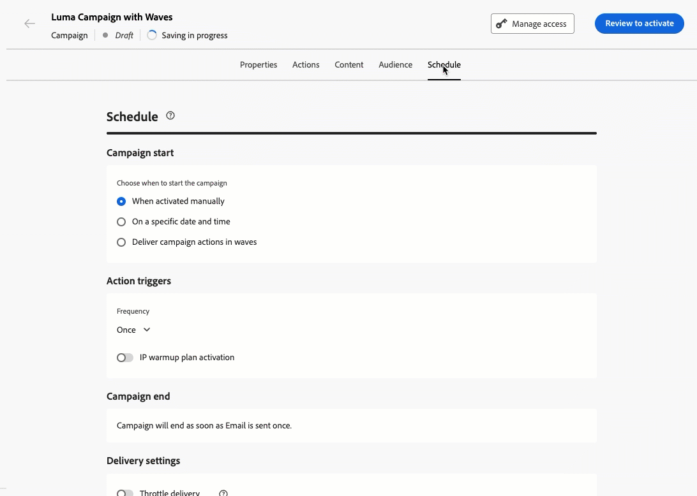

# 發行說明 {#release-notes}

>[!CONTEXTUALHELP]
>id="ajo_homepage_card1"
>title="最新資訊"
>abstract="**Adobe Journey Optimizer** 持續提供新功能、現有功能的增強功能並修正錯誤。 所有變更都會在每月最後一週整合於發行說明。"

[!DNL Adobe Journey Optimizer] 遵循持續傳遞模式，允許 Adobe 持續傳遞新功能、增強功能和修正。此方法可讓您分階段推出可擴充的功能，以確保所有環境的效能和穩定性。

基於此模型，發行說明會在每月發行之間更新。如需發行週期與可用性階段的完整詳細資訊，請參閱 [Journey Optimizer 發行週期](releases.md)。

[!DNL Adobe Journey Optimizer] 是原生建置在 [!DNL Adobe Experience Platform] 的並繼承其最新創新和改善項目。若要了解更多有關這些變更的資訊，請參閱 [Adobe Experience Platform 發行說明](https://experienceleague.adobe.com/docs/experience-platform/release-notes/latest.html?lang=zh-Hant){target="_blank"}。

## 2026年2月發行說明 {#feb-26-01-rn}

[新功能](#feb-26-01-features)和[改進](#feb-26-01-improv)區段已涵蓋可用的功能。 [即將推出](#coming-soon)區段列出排定於2月稍後發行的功能和改善。

<!--**The pre-release notes below are subject to change without prior notice until the release availability date**. Links, screens and updated documentation are published in the release notes, at the release date.

See also [Adobe Experience Platform Pre-release notes](https://experienceleague.adobe.com/en/docs/experience-platform/release-notes/pre-release-notes){target="_blank"}.-->

<!--**Release date**: February 17-18, 2026-->

### 新功能 {#feb-26-01-features}

<!--
<table>
<thead>
<tr>
<th><strong>Mobile Live Activities</strong> </th>
</tr>
</thead>
<tbody>
<tr>
<td>

<strong>Live Activities</strong> provide real-time updates and interactive experiences within mobile apps, allowing users to stay informed about ongoing events or tasks directly on their device's screen. This feature enhances engagement by delivering live information, such as progress tracking, event updates, or interactive content, without requiring users to open the app.

Previously released in beta, this capability is now available to all environments (General Availability).

</td>
</tr>
</tbody>
</table>
-->

<table>
<thead>
<tr>
<th><strong>傳出訊息的波動傳送</strong> </th>
</tr>
</thead>
<tbody>
<tr>
<td>

您現在可以排程來自Journey Optimizer行銷活動或歷程的訊息，以控管批次方式隨時間傳遞。

波次傳送提供下列優點：

<ul>
<li>更好的可遞送性 — 隨著時間推移分散式傳送，以協助維持強大的傳送者信譽，並降低被標籤為垃圾訊息的風險。</li>
<li>載入控制 — 透過限制同時傳出的訊息數量，避免讓下游系統（例如呼叫中心、登陸頁面）不堪重負。</li>
<li>大量且有時效性的使用案例 — 適合大型對象，或您需要控制時機時（例如客服中心容量、加電或有時限的選件）。</li>
</ul>

在<strong>行銷活動</strong>中，此功能適用於所有環境（一般可用性）。 如需詳細資訊，請參閱<a href="../campaigns/send-using-waves.md">詳細說明文件</a>。

在<strong>歷程</strong>中，此功能僅適用於一組組織（可用性限制） — 若要取得存取權，請聯絡您的Adobe代表。 如需詳細資訊，請參閱<a href="../building-journeys/send-using-waves.md">詳細說明文件</a>。

推出日期： 2026年2月19日

</td>
</tr>
</tbody>
</table>

<table>
<thead>
<tr>
<th><strong>將子網域移轉至自訂委派</strong> </th>
</tr>
</thead>
<tbody>
<tr>
<td>

您現在可以從介面使用CNAME委派模式將子網域移轉至自訂委派，這樣您就可以符合公司指引的更嚴格安全性原則，而無需重新建立通道設定。

此功能僅適用於一組組織 (可用性限制)。 若想取得存取權，請聯絡您的 Adobe 代表。

如需詳細資訊，請參閱<a href="../configuration/custom-subdomain-migration.md">詳細文件</a>。

推出日期： 2026年2月19日

</td>
</tr>
</tbody>
</table>

<table>
<thead>
<tr>
<th><strong>網頁推播通知頻道</strong> </th>
</tr>
</thead>
<tbody>
<tr>
<td>

Adobe Journey Optimizer現在支援<strong>網頁推播通知</strong>，將推播通道擴充至行動裝置以外。 您可以順暢地將通知傳送至<strong>行動瀏覽器和桌面瀏覽器</strong>，讓您無需應用程式即可直接在其裝置上聯絡客戶。此增強功能可讓您運用行動推播中現有的相同製作工作流程和目標定位功能，透過即時的個人化訊息與使用者互動。

此功能先前在Beta中發行，現在可供所有環境使用（全面發佈）。

如需詳細資訊，請參閱<a href="../push/push-configuration-web.md">詳細說明文件</a>。

推出日期： 2026年2月13日

</td>
</tr>
</tbody>
</table>

<table>
<thead>
<tr>
<th><strong>內容決活動</strong> </th>
</tr>
</thead>
<tbody>
<tr>
<td>

歷程畫布現在提供新的<strong>內容決定活動</strong>，可將個人化優惠直接整合至您的客戶歷程。 此活動可讓您提供決策型內容，並在整個歷程中參考這些優惠方案 — 在建立資格型分支的條件、在自訂動作中將優惠方案資料傳遞至外部系統，以及在其他活動中建立完全個人化的客戶體驗。

此功能之前以「有限可用性」的名義發行，目前所有環境都適用 (一般可用性)。

如需詳細資訊，請參閱<a href="../building-journeys/content-decision.md">詳細文件</a>。

推出日期：2026年2月10日

</td>
</tr>
</tbody>
</table>

<table>
<thead>
<tr>
<th><strong>自助移轉工具 API</strong> </th>
</tr>
</thead>
<tbody>
<tr>
<td>

移轉工具API現在可用於以程式設計方式將<strong>決定管理</strong>實體移轉到<strong>決定</strong>，其功能：

<ul>
<li>彈性的移轉範圍 (沙箱、產品建議或決策層級)</li>
<li>自動化相依性分析和驗證</li>
<li>已完成移轉的復原支援</li>
<li>包含物件對應的詳細移轉報表</li>
</ul>

如需詳細資訊，請參閱<a href="../experience-decisioning/decisioning-migration-api.md">詳細文件</a>。

推出日期：2026 年 2 月 3 日

</td>
</tr>
</tbody>
</table>

### 改善 {#feb-26-01-improv}

以下列舉部分發布內容附上的改良功能。

#### 設定

* **歷程運算式中的體驗事件使用方式** — 自2026年4月1日起，過去90天內未使用此功能的組織將不再支援在歷程運算式中使用體驗事件屬性。 自2025年7月8日起，新客戶組織已無法使用此功能。 如需其他選擇，請參閱歷程中的[體驗事件查閱](../building-journeys/exp-event-lookup.md)。

#### 電子郵件設計工具

* **文字縮排** — 您現在可以直接從屬性面板將可自訂的左縮排套用至文字元件中的第一行段落。 <!--The new **Indentation** control lets you define indentation in pixels or percentage via a numeric input or slider, with live preview on the canvas. -->這可以改善長篇內容（例如編輯和文章）的可讀性。

  推出日期：2026年2月18日。

#### 內容範本

* **使用主題將影像轉換為電子郵件範本** — 在Journey Optimizer中將影像轉換為電子郵件範本時，您現在可以使用主題作為輸入，讓產生的HTML遵循您的品牌引數。 系統會自動套用背景顏色、按鈕顏色、字型、行距、邊界及邊框間距等樣式，減少手動設計工作，並提供可立即使用且只需少量編輯的範本。 [閱讀全文](../content-management/image-to-html.md)

  推出日期：2026年2月17日。

#### 體驗決策

* **在決定中使用Adobe Experience Platform資料的Edge傳入支援** — 在決定中使用Adobe Experience Platform資料時，除了歷程中的電子郵件和自訂動作之外，現在還能支援邊緣傳入使用案例。 [閱讀全文](../experience-decisioning/aep-data-exd.md)

  **注意**：此功能僅適用於一組組織（<strong>有限可用性</strong>）。 若想取得存取權，請聯絡您的 Adobe 代表。

* **將片段附加至決策項目** - Journey Optimizer 現在提供將片段附加至決策項目的功能，而決策項目可透過決策原則用於程式碼型體驗行銷活動。[閱讀全文](../experience-decisioning/fragments-decision-policies.md)

  **注意**：此功能先前以「有限可用性」發行，現在可供所有環境使用（一般可用性）。

  推出日期：2026年2月12日。

## 即將推出 {#coming-soon}

以下功能和改進專案計畫於2月下旬發行。 發行日期和範圍可能會變更，恕不另行通知。

<table>
<thead>
<tr>
<th><strong>Journey Agent：建立管道內容</strong> </th>
</tr>
</thead>
<tbody>
<tr>
<td>

由<strong>Adobe Experience Platform Agent Orchestrator</strong>提供技術支援的<strong>Journey Agent</strong>可在Journey Optimizer中使用，並可讓您透過自然語言介面分析歷程。 您現在也可以直接在Journey Agent中產生和管理頻道特定內容、建立電子郵件和推播之類的頻道內容、套用和預覽範本、透過提示調整色調和風格，以及在<strong>內容Designer</strong>中開啟內容以進行內容內編輯。

推出日期：2026年2月20日

</td>
</tr>
</tbody>
</table>

<table>
<thead>
<tr>
<th><strong>歷程仲裁</strong> </th>
</tr>
</thead>
<tbody>
<tr>
<td>

您現在可以使用<strong>排名公式</strong>和<strong>AI模型</strong>，根據客戶設定檔屬性和情境因素自動提升歷程優先順序分數，以確保客戶進入最相關的歷程。

此功能僅適用於一組組織 (可用性限制)。 若想取得存取權，請聯絡您的 Adobe 代表。

推出日期： 2026年2月24日

</td>
</tr>
</tbody>
</table>

<table>
<thead>
<tr>
<th><strong>歷程中的動作活動</strong> </th>
</tr>
</thead>
<tbody>
<tr>
<td>

Journey Optimizer支援新的通用<strong>動作活動</strong>，可讓您設定單一動作和多動作傳入動作群組，以簡化歷程畫布中的動作設定。 尤其是這項新功能允許：

<ul>
<li>簡化歷程畫布中的原生動作設定。</li>
<li>容量用來建立多動作傳入動作群組。</li>
<li>能夠將最佳化新增至任何內建管道動作。</li>
<li>能夠新增實驗和多語言選項至任何動作。</li>
</ul>

此功能之前以「有限可用性」的名義發行，目前所有環境都適用 (一般可用性)。

推出日期：2026年2月20日

</td>
</tr>
</tbody>
</table>

<table>
<thead>
<tr>
<th><strong>AI模型監視</strong> </th>
</tr>
</thead>
<tbody>
<tr>
<td>

Journey Optimizer現在可讓您監視決策AI模型的健全狀態、培訓狀態和效能。 這可讓您驗證培訓成功、疑難排解失敗，並瞭解對您結果的影響，以便使用AI為每個客戶選取最佳選件。 請注意，此功能僅適用於<strong>決策</strong> （不適用於舊版決策管理模型）。

此功能目前僅適用於<strong>個人化最佳化</strong>模型（非自動最佳化）。

推出日期：2026年2月20日

</td>
</tr>
</tbody>
</table>

### 改進 {#coming-soon-improv}

* **程式碼型體驗管道中的Experience Decisioning預覽** — 您現在可以在使用程式碼型體驗管道設定Experience Decisioning時預覽決定專案。 上線之前，可以直接在編寫介面中使用預覽。

  推出日期：2026年2月20日。

* **整合自訂Firefly模型與協力廠商影像產生模型** — 可緊密整合標準與自訂Firefly模型，以及經核准的協力廠商影像模型（例如NanoBanana），以便在產生影像時提供更大的彈性、控制力及品牌一致性。 這可讓您為每個使用案例選取最佳模型：適用於一般需求的標準Firefly、適用於品牌內產生的自訂Firefly，或適用於特殊或實驗場景的已核准第三方模型。

  推出日期：2026年2月20日。

