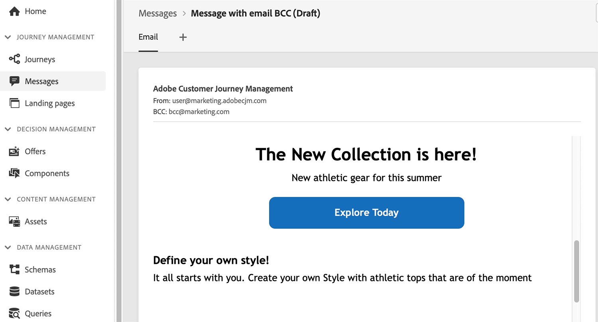
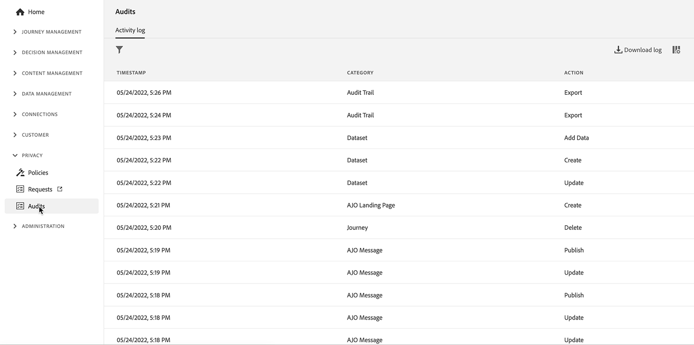

# 發行說明 {#release-notes}

本頁面列出[!DNL Journey Optimizer]所有新功能和改進項目。您還可以參閱[最新文件更新](documentation-updates.md)頁面以了解更多變更。

[!DNL Adobe Experience Platform] 上內建的原生 [!DNL Adobe Journey Optimizer] 延續了最新版本的創新和改進內容。 欲深入瞭解這些變動，可參閱 [Adobe Experience Platform 發行說明](https://experienceleague.adobe.com/docs/experience-platform/release-notes/latest.html?lang=zh-Hant){target=&quot;_blank&quot;}。

 立即註冊 [Adobe Journey Optimizer 季度電子報](https://www.adobe.com/subscription/Adobe_Journey_Optimizer_NL.html){target=&quot;_blank&quot;} ，直接把每季最新產品更新、激勵人心的故事、使用案例、提示等內容傳送到您的收件匣。

## 2022 年 5 月發行 {#may-2022-release}

### 新功能

<table>
<thead>
<tr>
<th><strong>消息頻率規則</strong> </th>
</tr>
</thead>
<tbody>
<tr>
<td>

現在，您可以設定跨渠道業務規則，這些業務規則將自動從消息和操作中排除過度請求的配置檔案。

如需詳細資訊，請參閱<a href="../configuration/frequency-rules.md">詳細文件</a>。

</td>
</tr>
</tbody>
</table>

<!--table>
<thead>
<tr>
<th><strong>Email BCC</strong> </th>
</tr>
</thead>
<tbody>
<tr>
<td>

Availability date: <strong>May, 31</strong>

You can now use the Email BCC (blind carbon copy) capability to store emails sent by Adobe Journey Optimizer. Enable this option in your email presets so that every email sent is blind-copied to your BCC address.

For more information, refer to the <a href="../configuration/email-settings.md#bcc-email">detailed documentation</a>.

</td>
</tr>
</tbody>
</table-->

<table>
<thead>
<tr>
<th><strong>決策管理 — AI排序自動優化模型</strong> </th>
</tr>
</thead>
<tbody>
<tr>
<td>

現在，您可以在決策管理中使用經過培訓的模型系統。 此新功能等級可為給定配置檔案顯示。

如需詳細資訊，請參閱<a href="../offers/offer-activities/configure-offer-selection.md#use-ranking-strategy">詳細文件</a>。

</td>
</tr>
</tbody>
</table>

<!--table>
<thead>
<tr>
<th><strong>Attribute-based Access Control (ABAC)</strong> </th>
</tr>
</thead>
<tbody>
<tr>
<td>

Permission management in Journey Optimizer has been extended to data access. You can now manage data access for specific teams or groups of users (i.e. internal, external, 3rd parties) ​and manage access to specific types of data (i.e. Sensitive Personal Data/SPD).

This capability is available for a limited set of customers.

For more information, refer to the <a href="../landing-pages/create-lp.md">detailed documentation</a>.

</td>
</tr>
</tbody>
</table-->

<table>
<thead>
<tr>
<th><strong>Journey Optimizer審計日誌</strong> </th>
</tr>
</thead>
<tbody>
<tr>
<td>

您現在可以監視用戶對Adobe Journey Optimizer資源執行的操作。

如需詳細資訊，請參閱<a href="../reports/audit-logs.md">詳細文件</a>。

</td>
</tr>
</tbody>
</table>

### 改進項目

**個人化**

* **用於字元隱藏的新幫助程式函式** - `mask` helper函式允許您將字串的一部分替換為「X」字元。 [了解更多](../personalization/functions/string.md#mask)

**登陸頁面**

* **沒有表單的登錄頁**  — 您現在可以建立並發佈不包含表單且不需要訪問者執行任何操作的登錄頁。
* **登錄頁模板**  — 現在，您可以將登錄頁另存為模板，並在建立其他登錄頁時重新使用它。 [了解更多](../landing-pages/lp-templates.md)
* **返回首頁**  — 現在，您可以從同一登錄頁內的任何子頁添加到首頁的連結。
* **自定義JavaScript支援**  — 現在，您可以將自定義JavaScript添加到登錄頁內容中，以執行高級樣式設定或將自定義行為添加到登錄頁。	[了解更多](../landing-pages/lp-custom-js.md)

**歷程**

* **讀取段**  — 一次性讀取段行程現在在行程執行30天後移至「已完成」狀態。 對於計畫的讀取段，它是在上次執行該事件後30天。 [了解更多](../building-journeys/read-segment.md)
* **表達式編輯器** - [限](../building-journeys/functions/functionlimit.md) 已添加函式，以允許您限制清單的項數。 的 [排序](../building-journeys/functions/functionsort.md) 函式現在允許您對清單對象進行排序。 對listObject的支援也添加到 [斷層](../building-journeys/functions/functiondistinct.md) 和 [distinctWithNull](../building-journeys/functions/functiondistinctwithnull.md) 的子菜單。

**管理**

* **許可證使用儀表板更新**  — 許可證使用儀表板，位於 [!DNL Adobe Journey Optimizer] 用戶介面現在反映 **許可** 平均配置檔案豐富度。 您將看到此度量表示法中的一個刪除，這意味著現在已正確報告許可證限制。 [了解更多](../segment/licence-usage.md)
