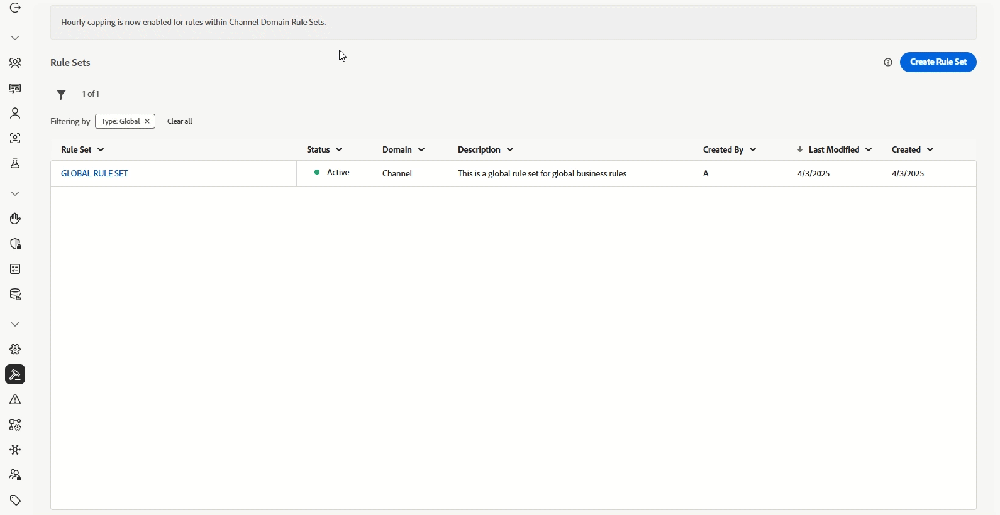
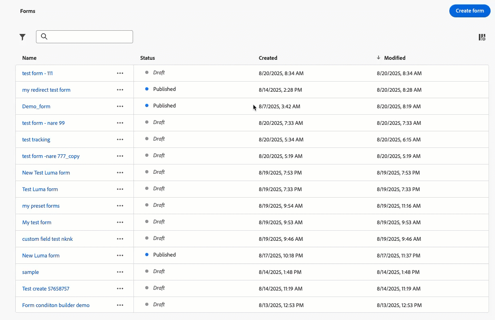

# 發行說明 {#release-notes}

>[!CONTEXTUALHELP]
>id="ajo_homepage_card1"
>title="有哪幾種新增功能？"
>abstract="**Adobe Journey Optimizer** 持續提供新功能、現有功能的增強功能並修正錯誤。 所有變更都會在每月最後一週整合於發行說明。"

[!DNL Adobe Journey Optimizer]遵循持續傳遞模式，允許Adobe持續傳遞新功能、增強功能和修正。 此方法可讓您分階段推出可擴充的功能，以確保所有環境的效能和穩定性。

基於此模型，發行說明會在每月發行之間更新。  專屬的[最新更新](#updates-rn)區段會強調在部署到生產環境時的新功能和改善 — 因此您一律會即時收到所有變更的通知。<!--For full details about the release cycle and availability phases, see [Journey Optimizer release cycle](#releases.md).-->

[!DNL Adobe Journey Optimizer] 是原生建置在 [!DNL Adobe Experience Platform] 的並繼承其最新創新和改善項目。若要了解更多有關這些變更的資訊，請參閱 [Adobe Experience Platform 發行說明](https://experienceleague.adobe.com/docs/experience-platform/release-notes/latest.html?lang=zh-Hant){target="_blank"}。

## 2025年10月發行說明 {#oct-25-10-rn}

**發行日期**：2025年10月22日

### 全新功能 {#oct-25-10-features}

<table>
<thead>
<tr>
<th><strong>無訊息時數/基於時間的排除</strong> </th>
</tr>
</thead>
<tbody>
<tr>
<td>

無訊息小時可讓您定義電子郵件、簡訊、推播和WhatsApp頻道的時間型排除專案。 它們可確保在特定時段內不會傳送任何訊息，協助您遵守客戶偏好設定和合規性要求。

您可以透過規則集套用無訊息時數，這些規則集可指派給行銷活動或歷程中的個別動作，以進行精確控制。

無訊息小時規則目前僅適用於一組組織（可用性限制）。 若要新增至輪候表，請聯絡您的Adobe代表。

如需詳細資訊，請參閱<a href="../conflict-prioritization/quiet-hours.md">詳細文件</a>。

推出日期： 2025年10月22日

</td>
</tr>
</tbody>
</table>

<!--table>
<thead>
<tr>
<th><strong>Custom action monitoring and reporting</strong> </th>
</tr>
</thead>
<tbody>
<tr>
<td>

This capability provides better visibility into journey health and execution, including lifecycle status and performance alerts. You can now quickly understand when, where, and why an anomalous situation is occurring in a custom action.

For more information, refer to the <a href="../FILE.md">detailed documentation</a>.

Availability date: October 22, 2025

</td>
</tr>
</tbody>
</table-->

<!--table>
<thead>
<tr>
<th><strong>RCS Basic Messaging</strong> </th>
</tr>
</thead>
<tbody>
<tr>
<td>

With the new RCS Basic add-on offering, you can now deliver basic Rich Communication Services (RCS) messaging in Journey Optimizer, enabling the following enhanced messaging capabilities subject to provider and geographical support:

<ul>
<li><strong>Branded and verified sender support:</strong> Send messages using verified business profiles with branding elements (logo, sender name, etc.).</li>
<li><strong>Message delivery insights:</strong> Receive detailed delivery reports including message status updates (e.g., sent, delivered, read).</li>
<li><strong>Link tracking:</strong> Embed and track URLs within RCS messages for engagement analytics.</li>
<li><strong>Fallback to SMS:</strong> Automatic fallback to SMS when the recipient's device does not support RCS or is temporarily unreachable via RCS.</li>
<li><strong>Basic message composition:</strong> Send basic text-based RCS messages.</li>
</ul>
<!--img src="assets/do-not-localize/FILE.gif"-->
<!-- p>For more information, refer to the <a href="../FILE.md">detailed documentation</a>.

<!--/td>
</tr>
</tbody>
</table-->

<!--table>
<thead>
<tr>
<th><strong>Direct mail channel in Orchestrated campaigns</strong> </th>
</tr>
</thead>
<tbody>
<tr>
<td>

Direct mail channel is now available in orchestrated campaigns. The Direct mail activity facilitates direct mail sending within your Orchestrated campaign, for both one-time and recurring messages. It serves to automate the process of generating the extraction file required by direct mail providers. You can combine channel activities into the Orchestrated campaign canvas to create cross-channel campaigns that can trigger actions based on customer behavior and data.

<!--img src="assets/do-not-localize/FILE.gif"-->
<!-- p>For more information, refer to the <a href="../FILE.md">detailed documentation</a>.

<!--/td>
</tr>
</tbody>
</table-->

<!--table>
<thead>
<tr>
<th><strong>Direct Mail channel in journeys</strong> </th>
</tr>
</thead>
<tbody>
<tr>
<td>

Previously limited to Campaigns, Direct Mail channel is now available on the journey canvas, enabling you to incorporate Direct Mail into your journeys. Direct Mail can now be used in both batch and 1:1 journey scenarios, with support for file extraction configuration and time-based frequency settings.

 Previously released in Limited Availability, this capability is now available to all environments (General Availability).

<!--img src="assets/do-not-localize/FILE.gif"-->
<!-- p>For more information, refer to the <a href="../FILE.md">detailed documentation</a>.

<!--/td>
</tr>
</tbody>
</table-->

<!--table>
<thead>
<tr>
<th><strong>New API to retrieve Action Campaigns</strong> </th>
</tr>
</thead>
<tbody>
<tr>
<td>

A new Journey Optimizer API is now available, enabling you to programmatically retrieve and inspect campaign-related data such as details, versions, and configurations.

For more information, refer to the <a href="https://developer.adobe.com/journey-optimizer-apis/references/campaigns-retrieve/">detailed documentation</a>.

Availability date: October 22, 2025

</td>
</tr>
</tbody>
</table-->

<!--<table>
<thead>
<tr>
<th><strong>New source connectors for loyalty apps</strong> </th>
</tr>
</thead>
<tbody>
<tr>
<td>

New source connectors are now available in Adobe Experience Platform for the Talon.One, Capillary and Kobie loyalty Apps. These connectors let you seamlessly stream loyalty data into Adobe Experience Platform and leverage these data in Journey Optimizer.

For more information, refer to the <a href="../start/get-started-sources.md">detailed documentation</a>.

Availability date: October 22, 2025

</td>
</tr>
</tbody>
</table>-->

<!--table>
<thead>
<tr>
<th><strong>Decisioning support in email channel</strong> </th>
</tr>
</thead>
<tbody>
<tr>
<td>

You can now add Decision policies into email journeys and campaigns. Decision policies are containers for your offers that leverage the Decisioning engine to dynamically return the best content to deliver for each audience member.

Previously released in Limited Availability, this capability is now available to all environments (General Availability).

For more information, refer to the <a href="../FILE.md">detailed documentation</a>.

Availability date: October 22, 2025

</td>
</tr>
</tbody>
</table-->

<!--<table>
<thead>
<tr>
<th><strong>High throughput messaging for API triggered email campaigns</strong> </th>
</tr>
</thead>
<tbody>
<tr>
<td>

A new high throughput transactional messaging mode is available in API triggered campaigns. This mode is designed for large-scale, real-time transactional messaging and supports up to 5,000 transactions per second with higher availability. This mode also supports transactional messages without referencing or creating customer profiles, such as guest checkout, order confirmation, password resets, security notifications, and one-time passwords for two-factor authentication.

This capability is only available for the email channel, for organizations that have purchased the Adobe High Throughput Transactional Messaging add-on offering. Contact your Adobe representative for more details.

For more information, refer to the <a href="../campaigns/api-triggered-campaign-action.md">detailed documentation</a>.

Availability date: October 22, 2025

</td>
</tr>
</tbody>
</table>-->

<table>
<thead>
<tr>
<th><strong>可重複使用的鎖定規則</strong> </th>
</tr>
</thead>
<tbody>
<tr>
<td>

為了節省時間和精力，Journey Optimizer現在可讓您從專用的UI選單建立可重複使用的規則，並在建立目標定位時運用這些規則，做為行銷活動或歷程中的內容最佳化的一部分，或是最佳化歷程活動。

鎖定目標規則目前處於「有限可用性」。 請聯絡您的 Adobe 代表以取得存取權。請注意，此功能僅適用於已購買決策附加元件產品的組織。 此版本將逐步向所有客戶推出。

如需詳細資訊，請參閱<a href="../experience-decisioning/rules.md">詳細文件</a>。

推出日期： 2025年10月22日

</td>
</tr>
</tbody>
</table>

<table>
<thead>
<tr>
<th><strong>新歷程警報</strong> </th>
</tr>
</thead>
<tbody>
<tr>
<td>

有新的預先設定警報可用來監視歷程執行：

<ul><li><a href="../reports/alerts.md#alert-discard-rate">超過設定檔捨棄率</a>：在過去5分鐘內超過閾值的設定檔捨棄與輸入設定檔的比率</li>
<li><a href="../reports/alerts.md#alert-custom-action-error-rate">超出自訂動作錯誤率</a>：過去5分鐘超出臨界值的自訂動作錯誤與成功HTTP呼叫的比率</li>
<li><a href="../reports/alerts.md#alert-profile-error-rate">超過設定檔錯誤率</a>：在過去5分鐘內，超過臨界值的設定檔錯誤率。</li></ul> 
您可以修改臨界值，並訂閱個別歷程層級警示與全域警示。

如需詳細資訊，請參閱<a href="../reports/alerts.md">詳細文件</a>。

推出日期： 2025年10月14日

</td>
</tr>
</tbody>
</table>

<table>
<thead>
<tr>
<th><strong>執行中繼資料協助程式</strong> </th>
</tr>
</thead>
<tbody>
<tr>
<td>

個人化編輯器中提供新的「executionMetadata」協助程式功能。 它可讓您將內容相關資訊附加至任何原生動作，並將其擷取至資料集，以匯出至外部系統。

此功能為「有限可用性」的狀態。請聯絡您的 Adobe 代表以取得存取權。

如需詳細資訊，請參閱<a href="../personalization/functions/helpers.md#execution-metadata">詳細文件</a>。

推出日期： 2025年10月13日

</td>
</tr>
</tbody>
</table>

<table>
<thead>
<tr>
<th><strong>Experimentation Accelerator搭配Experimentation Agent</strong> </th>
</tr>
</thead>
<tbody>
<tr>
<td>

Journey Optimizer Experimentation Accelerator現在包含Experimentation Agent，這是AI支援的對話工具，可讓您與實驗、見解和機會互動。 它增強了Journey Optimizer Experimentation Accelerator體驗，幫助您更高效地執行實驗、揭示哪些有效，並探索下一步最佳化的目標。

如需詳細資訊，請參閱<a href="https://experienceleague.adobe.com/docs/experience-cloud-ai/experience-cloud-ai/agents/agent-experiment.html" target="_blank">詳細文件</a>。

推出日期： 2025年10月10日

</td>
</tr>
</tbody>
</table>

<table>
<thead>
<tr>
<th><strong>電子郵件的 PDF 附件</strong> </th>
</tr>
</thead>
<tbody>
<tr>
<td>

您現在可以對透過 Journey Optimizer 傳送的電子郵件訊息附加靜態 PDF 檔案。

<ul>
<li>您每年最多可以為每個設定檔傳送 6 封含有 PDF 附件的訊息。</li>
<li>每個附件允許的大小上限為 5 MB。</li>
<li>如需其他大小或流量，您可以購買 PDF 附件附加元件。如需詳細資訊，請聯絡您的 Adobe 代表。</li>
</ul>

此功能之前以「有限可用性」的名義發行，目前所有環境都適用 (一般可用性)。

如需詳細資訊，請參閱<a href="../email/pdf-attachments.md">詳細文件</a>。

推出日期：2025 年 9 月 30 日

</td>
</tr>
</tbody>
</table>

<table>
<thead>
<tr>
<th><strong>用於檢索歷程的公用 API</strong> </th>
</tr>
</thead>
<tbody>
<tr>
<td>

新的 Journey Optimizer API 現在可用於檢索歷程及其關聯的物件，例如行銷活動和表面。

如需詳細資訊，請參閱<a href="https://developer.adobe.com/journey-optimizer-apis/references/journeys-retrieve/">詳細文件</a>

推出日期：2025 年 9 月 25 日

</td>
</tr>
</tbody>
</table>

<!--
## Latest updates {#updates-rn}

New capabilities and improvements released in the past weeks are listed below, with their availability date. They will be grouped with the next release notes content at the end of the month. See also the latest [release notes below](#latest-rn).
-->

### 改善 {#updates-improvements}

<!--Availability date: October 22, 2025-->

WhatsApp頻道&#x200B;**的**&#x200B;執行欄位

除了電子郵件和簡訊之外，您也會在沙箱層級更新WhatsApp傳送的預設執行欄位。 您也可以在WhatsApp歷程活動進階引數或WhatsApp頻道設定中變更執行欄位，以覆寫全域設定的執行欄位。 [閱讀全文](../configuration/primary-email-addresses.md)

推出日期： 2025年10月22日

**Mailto (取消訂閱) 地址的自訂屬性支援**

使用 Journey Optimizer，如果您在 Adobe 外部管理同意，則可以在電子郵件設定中定義您自己的一鍵取消訂閱連結和自訂取消訂閱電子郵件地址，以設定外部自訂端點。當您的收件者按一下取消訂閱連結時，Journey Optimizer 會將一些預設的輪廓特定參數附加至同意更新事件。

若要進一步個人化自訂端點，您現在可以定義將要同時附加至同意事件的自訂屬性。[閱讀全文](../email/list-unsubscribe.md#custom-attributes)

>[!AVAILABILITY]
>
>自 2025 年 8 月起，此功能已可用於自訂&#x200B;**[!UICONTROL 一鍵取消訂閱 URL]**，現在為有限可用性，僅為 **[!UICONTROL Mailto (取消訂閱)]** 選項發行。請聯絡您的 Adobe 代表以取得存取權。

推出日期：2025 年 10 月 6 日

### 即將推出 {#oct-25-10-soon}

下列功能和增強功能已排定在未來幾天發行。**資訊可能會有變更**。這些更新推出後，更新的連結、畫面和文件將會共用。

#### 全新功能 {#oct-25-10-soon-features}

<table>
<thead>
<tr>
<th><strong>電子郵件設計工具中的主題</strong> </th>
</tr>
</thead>
<tbody>
<tr>
<td>

目前您可以快速套用事先審核通過的主題，以便確保所有電子郵件的品牌都有保持一致性，加快投放行銷活動的流程，個別製作高品質的電子郵件，同時減少對設計團隊的依賴。

此功能先前以Beta版發佈，現在可供一組組織使用（可用性限制）。 若想取得存取權，請聯絡您的 Adobe 代表。

<!--img src="assets/do-not-localize/themes.gif">

For more information, refer to the <a href="../email/apply-email-themes.md">detailed documentation</a>.

Availability date: November 4, 2025</p-->
</td>
</tr>
</tbody>
</table>

#### 改良功能 {#oct-25-10-soon-improvements}

透過AI模型在電子郵件中&#x200B;**決策**

您現在可以使用AI模型，透過使用決策將電子郵件中的最佳內容最佳化。 例如，此功能可讓您根據自訂事件（例如購買、按鈕點選、加入購物車等）提供最佳內容。

<!--
<table>
<thead>
<tr>
<th><strong>New Web Push notifications channel</strong> </th>
</tr>
</thead>
<tbody>
<tr>
<td>

Adobe Journey Optimizer now supports Web Push notifications, expanding the push channel beyond mobile. You can seamlessly deliver notifications to both mobile and desktop browsers, enabling you to reach customers directly on their devices without requiring an app.

This enhancement allows you to engage users with timely, personalized messages in real time, leveraging the same authoring workflows and targeting capabilities already available for mobile push.

For more information, refer to the <a href="../FILE.md">detailed documentation</a>

Availability date: Sept XX, 2025

</td>
</tr>
</tbody>
</table>

<table>
<thead>
<tr>
<th><strong>Custom action monitoring and reporting</strong> </th>
</tr>
</thead>
<tbody>
<tr>
<td>

Custom action monitoring and reporting is now available. This capability provides better visibility into journey health and execution, including lifecycle status and performance alerts. You can now quickly understand when, where, and why an anomalous situation is occurring in a custom action.

For more information, refer to the <a href="../FILE.md">detailed documentation</a>

Availability date: Sept XX, 2025

</td>
</td>
</tr>
</tbody>
</table>

<table>
<thead>
<tr>
<th><strong>New source connectors for loyalty apps</strong> </th>
</tr>
</thead>
<tbody>
<tr>
<td>

New source connectors are now available in Adobe Experience Platform for the Talon.One, Capillary, and Kobie loyalty apps. These connectors let you seamlessly stream loyalty data into Adobe Experience Platform and leverage these data in Journey Optimizer.

</td>
</tr>
</tbody>
</table>

<table>
<thead>
<tr>
<th><strong>Landing page custom forms</strong> </th>
</tr>
</thead>
<tbody>
<tr>
<td>

With [!DNL Journey Optimizer], you can now capture profile attributes though your landing pages.

Create, design and manage custom forms tailored to your needs based on a specific dataset. You can then leverage these forms in landing pages to add the profile attributes of your choice into the dataset defined for each form.

This capability is available in Limited Availability. Contact your Adobe representative to gain access.

For more information, refer to the <a href="../landing-pages/lp-forms.md">detailed documentation</a>

Availability date: Sept XX, 2025

</td>
</tr>
</tbody>
</table>
-->
