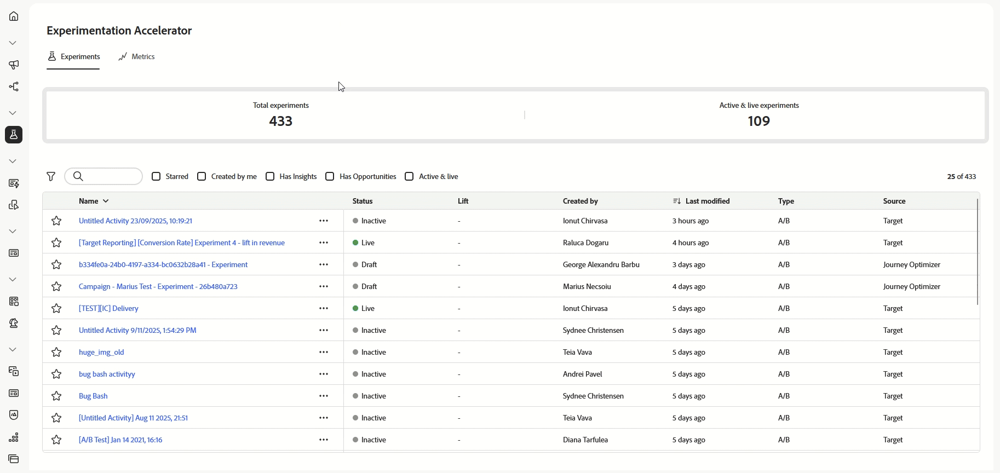

# 發行說明 {#release-notes}

>[!CONTEXTUALHELP]
>id="ajo_homepage_card1"
>title="有哪幾種新增功能？"
>abstract="**Adobe Journey Optimizer** 持續提供新功能、現有功能的增強功能並修正錯誤。 所有變更都會在每月最後一週整合於發行說明。"

[!DNL Adobe Journey Optimizer]遵循持續傳遞模式，允許Adobe持續傳遞新功能、增強功能和修正。 此方法可讓您分階段推出可擴充的功能，以確保所有環境的效能和穩定性。

基於此模型，發行說明會在每月發行之間更新。  專屬的[最新更新](#updates-rn)區段會強調在部署到生產環境時的新功能和改善 — 因此您一律會即時收到所有變更的通知。<!--For full details about the release cycle and availability phases, see [Journey Optimizer release cycle](#releases.md).-->

[!DNL Adobe Journey Optimizer] 是原生建置在 [!DNL Adobe Experience Platform] 的並繼承其最新創新和改善項目。若要了解更多有關這些變更的資訊，請參閱 [Adobe Experience Platform 發行說明](https://experienceleague.adobe.com/docs/experience-platform/release-notes/latest.html?lang=zh-Hant){target="_blank"}。

## 最新更新 {#updates-rn}

以下列出過去幾週發佈的新功能和改進專案及其推出日期。 他們將在月底與下一個發行說明內容一起分組。 另請參閱下面[的最新](#latest-rn)發行說明。

### 全新功能 {#updates-features}

<table>
<thead>
<tr>
<th><strong>執行中繼資料協助程式</strong> </th>
</tr>
</thead>
<tbody>
<tr>
<td>

個人化編輯器中提供新的「executionMetadata」協助程式功能。 它可讓您將內容相關資訊附加至任何原生動作，並將其擷取至資料集，以匯出至外部系統。

此功能為「有限可用性」的狀態。請聯絡您的 Adobe 代表以取得存取權。

如需詳細資訊，請參閱<a href="../personalization/functions/helpers.md#execution-metadata">詳細文件</a>

推出日期： 2025年10月13日

</td>
</tr>
</tbody>
</table>

<table>
<thead>
<tr>
<th><strong>實驗代理程式已推出！</strong> </th>
</tr>
</thead>
<tbody>
<tr>
<td>

由<a href="https://experienceleague.adobe.com/en/docs/experience-cloud-ai/experience-cloud-ai/agents/agent-orchestrator.html" target="_blank">Adobe Experience Platform Agent Orchestrator</a>提供支援，Experimentation Agent可在Journey Optimizer中使用。 

Experimentation Agent是AI支援的工具，可更新您跨網站、電子郵件、推送訊息和應用程式執行和管理數位實驗的方式。 它可協助您更有效率地執行實驗、組織業務目標，以及產生可操作的深入分析，並著重說明哪些有效果、哪些無效以及下一步該在何處實驗。

如需詳細資訊，請參閱<a href="https://experienceleague.adobe.com/docs/experience-cloud-ai/experience-cloud-ai/agents/agent-experiment.html" target="_blank">詳細文件</a>

推出日期： 2025年10月10日

</td>
</tr>
</tbody>
</table>

<table>
<thead>
<tr>
<th><strong>電子郵件的 PDF 附件</strong> </th>
</tr>
</thead>
<tbody>
<tr>
<td>

您現在可以對透過 Journey Optimizer 傳送的電子郵件訊息附加靜態 PDF 檔案。

<ul>
<li>您每年最多可以為每個設定檔傳送 6 封含有 PDF 附件的訊息。</li>
<li>每個附件允許的大小上限為 5 MB。</li>
<li>如需其他大小或流量，您可以購買 PDF 附件附加元件。如需詳細資訊，請聯絡您的 Adobe 代表。</li>
</ul>

此功能之前以「有限可用性」的名義發行，目前所有環境都適用 (一般可用性)。

如需詳細資訊，請參閱<a href="../email/pdf-attachments.md">詳細文件</a>

推出日期：2025 年 9 月 30 日

</td>
</tr>
</tbody>
</table>

<table>
<thead>
<tr>
<th><strong>用於擷取歷程的公用API</strong> </th>
</tr>
</thead>
<tbody>
<tr>
<td>

新的Journey Optimizer API現在可用於擷取歷程及其關聯的物件，例如行銷活動和表面。

如需詳細資訊，請參閱<a href="https://developer.adobe.com/journey-optimizer-apis/references/journeys-retrieve/">詳細文件</a>

推出日期：2025 年 9 月 25 日

</td>
</tr>
</tbody>
</table>

### 改善 {#updates-improvements}

Mailto （取消訂閱）位址的&#x200B;**自訂屬性支援**

透過Journey Optimizer，如果您在Adobe之外管理同意，則可在電子郵件設定中定義您自己的一鍵式取消訂閱連結和自訂取消訂閱電子郵件地址，藉此設定外部自訂端點。 當您的收件者按一下取消訂閱連結時，Journey Optimizer 會將一些預設的輪廓特定參數附加至同意更新事件。

若要進一步個人化您的自訂端點，您現在可以定義將附加至同意事件的自訂屬性。 [閱讀全文](../email/list-unsubscribe.md#custom-attributes)

>[!AVAILABILITY]
>
>此功能自2025年8月起已可用於自訂&#x200B;**[!UICONTROL 一鍵取消訂閱URL]**，現在已針對「有限可用性」中的&#x200B;**[!UICONTROL Mailto （取消訂閱）]**&#x200B;選項發行。 請聯絡您的 Adobe 代表以取得存取權。

推出日期： 2025年10月6日

## 2025 年 9 月發行說明 {#latest-rn}

**發行日期**：2025 年 9 月 23-24 日

### 全新功能 {#sept-25-9-features}

<table>
<thead>
<tr>
<th><strong>Journey Optimizer Experimentation Accelerator</strong> </th>
</tr>
</thead>
<tbody>
<tr>
<td>

Journey Optimizer Experimentation Accelerator 是 AI 優先的產品，旨在將您的實驗提升到新的境界。此產品專為 Adobe Journey Optimizer 和 Adobe Target 使用者打造，可整合實驗管理、提供 AI 支援的深入分析和機會，並推出新的實驗代理程式。

您可以期待：

<ul>
<li><strong>整合實驗詳細目錄：</strong>在單個集中式工作區中快速檢視、篩選及管理 Adobe Journey Optimizer 和 Adobe Target 的所有實驗。</li>
<li><strong>AI 實驗見解和機會：</strong>不僅有統計讀數，還有 GenAI 驅動的見解和推薦。現在，每個實驗都會顯示可操作的機會，以及完整的支援理由，讓團隊可以更自信地決定下一個要測試的內容。</li>
<li><strong>Journey Optimizer 中的多臂老虎機 (MAB) 支援：</strong>透過多臂老虎機實驗，最大化影響，同時減少浪費的流量。MAB 不會平均分割客群，而是會即時將更多訪客自動分配到效能最佳的變化版本，這樣您就能為更多客戶提供更好的體驗，同時仍會了解哪些變化版本有效。</li></ul>

如需詳細資訊，請參閱<a href="../content-management/experiment-accelerator.md">詳細文件</a>

推出日期：2025 年 10 月 3 日

</td>
</tr>
</tbody>
</table>

<table>
<thead>
<tr>
<th><strong>Journey 代理已推出！</strong> </th>
</tr>
</thead>
<tbody>
<tr>
<td>

Journey 代理由 <a href="https://experienceleague.adobe.com/zh-hant/docs/experience-cloud-ai/experience-cloud-ai/agents/agent-orchestrator" target="_blank">Adobe Experience Platform Agent Orchestrator</a> 提供技術支援，可在 Journey Optimizer 中使用。它可讓您透過自然語言介面分析歷程。代理程式會偵測歷程中的客群或排程衝突與輪廓流失，協助您採取步驟解決這些問題。不久，您將能夠使用代理程式支援建立歷程。

如需詳細資訊，請參閱<a href="https://experienceleague.adobe.com/zh-hant/docs/experience-cloud-ai/experience-cloud-ai/agents/ajo-agent-analyze" target="_blank">詳細文件</a>

推出日期：2025 年 9 月 24 日

</td>
</tr>
</tbody>
</table>

<table>
<thead>
<tr>
<th><strong>電子郵件設計工具中的深色模式</strong> </th>
</tr>
</thead>
<tbody>
<tr>
<td>

Journey Optimizer 電子郵件設計工具現在提供切換到深色模式視圖的功能，您可以在此處額外定義特定的自訂設定，該設定將僅對在深色模式下讀取其電子郵件的收件者顯示。

請注意下列事項：

<ul>
<li>深色模式的最終呈現可能會有所不同，取決於收件者的電子郵件用戶端。</li>
<li>並非所有電子郵件用戶端都支援自訂深色模式。此外，某些電子郵件用戶端只會對收到的所有電子郵件套用自己的預設深色模式。在這兩種情況下，系統無法呈現您在電子郵件設計工具中定義的自訂設定。</li>
</ul>

如需詳細資訊，請參閱<a href="../email/dark-mode.md">詳細文件</a>

 
推出日期：2025 年 9 月 16 日

</td>
</tr>
</tbody>
</table>

<table>
<thead>
<tr>
<th><strong>歷程路徑最佳化</strong> </th>
</tr>
</thead>
<tbody>
<tr>
<td>

使用新的「最佳化」節點，鎖定特定客群或執行 A/B 測試，以判斷達到以業務為中心的 KPI 所需的最佳途徑。

此工具可讓您測試並變更內容，以及自訂通訊、排序和時機，以便最有效地觸及客戶。

此功能為「有限可用性」的狀態。請聯絡您的 Adobe 代表以取得存取權。

如需詳細資訊，請參閱<a href="../building-journeys/optimize.md">詳細文件</a>

推出日期：2025 年 9 月 4 日

</td>
</tr>
</tbody>
</table>

<table>
<thead>
<tr>
<th><strong>子網域的自訂委派方法</strong> </th>
</tr>
</thead>
<tbody>
<tr>
<td>

除了完全委派和 CNAME 方法之外，目前還有提供一種新的子網域設定方法：自訂委派方法可讓您能完全掌控並維護傳遞、呈現，還有追蹤訊息所需的 DNS 各大層面。

此功能為「有限可用性」的狀態。請聯絡您的 Adobe 代表以取得存取權。

如需詳細資訊，請參閱<a href="../configuration/delegate-custom-subdomain.md">詳細文件</a>

推出日期：2025 年 9 月 4 日

</td>
</tr>
</tbody>
</table>

<table>
<thead>
<tr>
<th><strong>使用 Adobe Experience Platform 資料進行個人化與決策</strong> </th>
</tr>
</thead>
<tbody>
<tr>
<td>

之前以公開 Beta 版本發行，目前此功能所有環境都適用。已在此版本中，引進以下增強功能：

<ul><li>支援傳入頻道中的資料集查詢個人化。</li>
<li>「datasetLookup」協助程式函式現在可用於運算式片段中。目前，此功能僅供有限的一組客戶使用。若想取得存取權，請聯絡您的 Adobe 代表。</li>
<li>資料集管理介面中的選項現在可讓您啟用記錄型資料集以進行查詢個人化，而無需執行 API 呼叫。</li>
<li>增強的監視功能，可追蹤資料擷取狀態，並了解資料集何時準備好進行查詢。</li>
<li>更新使用指南和護欄，確保最佳績效和可靠性。</li>
<li>現在可以在決策上限規則中利用 Adobe Experience Platform 資料集。</li></ul>

如需詳細資訊，請參閱<a href="../data/lookup-aep-data.md">詳細文件</a>

推出日期：2025 年 9 月 1 日

</td>
</tr>
</tbody>
</table>

### 改善 {#sept-25-9-improvements}

* **API 觸發的行銷活動的 Webhook 支援**\
  API 觸發的行銷活動現在支援 Webhook。設定webhook URL以接收每則訊息的即時狀態更新，進而改善可觀察性，並實現順暢的監控和自動化。 [閱讀全文](../configuration/feedback-webhooks.md)

  推出日期：2025 年 9 月 29 日

* **簡訊管道的 mTLS 支援**
設定自訂簡訊提供者時，您現在可以選擇啟用雙向 TLS (mTLS) 驗證，這要求用戶端和伺服器在建立安全連線之前確認彼此的身分。[閱讀全文](../sms/sms-configuration-custom.md) - 推出日期：2025 年 9 月 23 日

* **基於模型的結構描述**\
  現在可以使用基於模型的結構描述，來支援協調行銷活動中的關聯式模型需求。[閱讀全文](../orchestrated/gs-schemas.md) - 推出日期：2025 年 9 月 23 日

* **歷程中的資料集查詢支援**\
  歷程中的全新&#x200B;**資料集查詢**&#x200B;活動可讓您在執行階段從 Adobe Experience Platform 記錄資料集中動態擷取資料。透過運用此功能，您可以存取輪廓或事件裝載內容中可能未駐留的資料，確保客戶互動相關且及時。[閱讀全文](../building-journeys/dataset-lookup.md) - 推出日期：2025 年 9 月 23 日

  此活動僅適用於一組組織 (有限可用性)。若想取得存取權，請聯絡您的 Adobe 代表。

* **歷程自訂動作中的重新導向支援**\
  歷程自訂動作現在支援重新導向 (302)。- 推出日期：2025 年 9 月 23 日

* **管道設定監視警示** - 您現在可以透過電子郵件或在 Journey Optimizer 通知中心訂閱接收系統警示，以防發生使用自訂子網域委派類型的電子郵件管道設定錯誤。[閱讀全文](../reports/alerts.md#alert-channel-config-failure) - 推出日期：2025 年 9 月 23 日

* **一鍵取消訂閱請求** - 我們已推出改進功能，進一步加強 Adobe Managed 下所設定一鍵取消訂閱請求的處理能力，確保處理可靠且一致。- 推出日期：2025 年 9 月 23 日

* **自訂驗證現在支援巢狀 JSON 正文參數**\
  設定自訂動作的自訂驗證時，現在支援巢狀 JSON 物件 (例如 `bodyParams` 內的子物件)。[閱讀全文](../datasource/external-data-sources.md#custom-authentication-mode) - 推出日期：2025 年 9 月 18 日

* **每小時重設上限頻率** - 您目前可以將每小時上限套用至頻道規則集。此功能之前以「有限可用性」的名義發行，目前所有環境都適用，並允許您選擇 1 小時 (之前為 3 小時)。[閱讀全文](../conflict-prioritization/channel-capping.md) - 推出日期：2025 年 9 月 17 日

* **模擬所有傳入管道的內容變化版本**\
  先前僅可用於電子郵件、簡訊和推播通知管道，模擬內容變化版本現在也適用於所有傳入管道。[閱讀全文](../test-approve/simulate-sample-input.md) - 推出日期：2025 年 9 月 17 日

* **決策上限規則的運算式** - 您現在可以建立自己的運算式，以定義決策項目的上限規則臨界值。[閱讀全文](../experience-decisioning/items.md#capping) - 推出日期：2025 年 9 月 16 日

* **動態網域支援** - Journey Optimizer 現在支援 Adobe 所接受的預先定義網域的完整/基底 URL 個人化。[閱讀全文](../personalization/personalization-build-expressions.md#where) - 推出日期：2025 年 9 月 12 日

  此功能為有限可用性，僅提供給一組客戶。

* **Webhooks** — 此版本在設定自訂SMS提供者時，為Webhooks引進下列增強功能：

   * 您現在可以定義您的webhook用途，可以是傳入或回饋，具體取決於您要擷取的資料型別。 [閱讀全文](../sms/sms-configuration-custom.md#webhook) - 推出日期：2025 年 9 月 23 日

   * 設定關鍵字的介面已經過改良，更易於設定。 [閱讀全文](../sms/sms-configuration-custom.md#webhook) - 推出日期：2025 年 9 月 23 日

* **簡訊**

   * 設定自訂SMS提供者時，您現在可以定義當傳入的SMS包含無法辨識的關鍵字時使用的&#x200B;**預設**&#x200B;關鍵字。 您也可以為特定動作建立&#x200B;**自訂**&#x200B;關鍵字。 [閱讀全文](../sms/sms-configuration-custom.md) - 推出日期：2025 年 9 月 23 日

   * 您現在可以存取透過SMS訊息傳送的未定義傳入關鍵字回應，包括未在設定中明確定義的拼字、字詞或句子。 它們儲存在&#x200B;**AJO電子郵件追蹤體驗事件**&#x200B;資料集中的&#x200B;**InboundMessage**&#x200B;下，為期13個月。 僅適用於Sinch、Infobip和自訂SMS提供者。  — 推出日期： 2025年9月23日

<!--
* **Approval policy permissions**
  Added an option when creating or setting Approval Policy to prevent Journey/Campaign creators from approving their own objects. [Read more](../test-approve/approval-policies.md) - Availability date: Sept 23, 2025-->

<!--
### Coming soon {#sept-25-9-soon}

In the next few days, the following capabilities and enhancements are scheduled for release. **Information is subject to change**. Updated links, screens, and documentation will be shared once these updates are live in production.

<table>
<thead>
<tr>
<th><strong>New Web Push notifications channel</strong> </th>
</tr>
</thead>
<tbody>
<tr>
<td>

Adobe Journey Optimizer now supports Web Push notifications, expanding the push channel beyond mobile. You can seamlessly deliver notifications to both mobile and desktop browsers, enabling you to reach customers directly on their devices without requiring an app.

This enhancement allows you to engage users with timely, personalized messages in real time, leveraging the same authoring workflows and targeting capabilities already available for mobile push.

For more information, refer to the <a href="../FILE.md">detailed documentation</a>

Availability date: Sept XX, 2025

</td>
</tr>
</tbody>
</table>

<table>
<thead>
<tr>
<th><strong>Custom action monitoring and reporting</strong> </th>
</tr>
</thead>
<tbody>
<tr>
<td>

Custom action monitoring and reporting is now available. This capability provides better visibility into journey health and execution, including lifecycle status and performance alerts. You can now quickly understand when, where, and why an anomalous situation is occurring in a custom action.

For more information, refer to the <a href="../FILE.md">detailed documentation</a>

Availability date: Sept XX, 2025

</td>
</td>
</tr>
</tbody>
</table>

<table>
<thead>
<tr>
<th><strong>New source connectors for loyalty apps</strong> </th>
</tr>
</thead>
<tbody>
<tr>
<td>

New source connectors are now available in Adobe Experience Platform for the Talon.One, Capillary, and Kobie loyalty apps. These connectors let you seamlessly stream loyalty data into Adobe Experience Platform and leverage these data in Journey Optimizer.

</td>
</tr>
</tbody>
</table>

<table>
<thead>
<tr>
<th><strong>Landing page custom forms</strong> </th>
</tr>
</thead>
<tbody>
<tr>
<td>

With [!DNL Journey Optimizer], you can now capture profile attributes though your landing pages.

Create, design and manage custom forms tailored to your needs based on a specific dataset. You can then leverage these forms in landing pages to add the profile attributes of your choice into the dataset defined for each form.

This capability is available in Limited Availability. Contact your Adobe representative to gain access.

For more information, refer to the <a href="../landing-pages/lp-forms.md">detailed documentation</a>

Availability date: Sept XX, 2025

</td>
</tr>
</tbody>
</table>

* **New Journey Alerts**  
  New pre-configured alerts are available for journeys:

  * Profile Discard Rate Exceeded: Ratio of profile discards to entered profiles over the last 5 mins exceeded threshold.  
  * Custom Action Error Rate Exceeded: Ratio of custom action errors to successful HTTP calls over the last 5 mins exceeded threshold.  
  * Profile Error Rate Exceeded: Ratio of profiles-in-error to entered profiles over the last 5 mins exceeded threshold.

  * [Profile Discard Rate Exceeded](../reports/alerts.md#profile-discard-rate-exceeded): Ratio of profile discards to entered profiles over the last 5 mins exceeded threshold.  
  * [Custom Action Error Rate Exceeded](../reports/alerts.md#custom-action-error-rate-exceeded): Ratio of custom action errors to successful HTTP calls over the last 5 mins exceeded threshold.  
  * [Profile Error Rate Exceeded](../reports/alerts.md#profile-error-rate-exceeded): Ratio of profiles-in-error to entered profiles over the last 5 mins exceeded threshold.

  You can modify threshold values and subscribe to individual journey-level alerts vs globally.

  Availability date: Sept XX, 2025

-->
