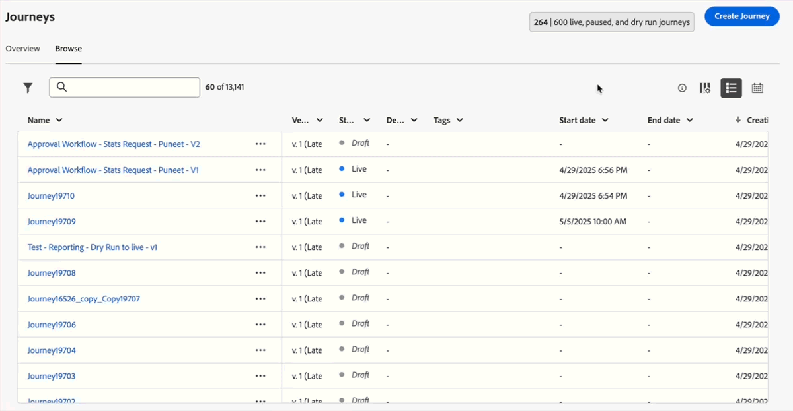
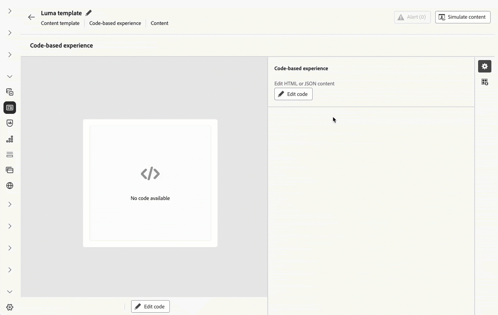
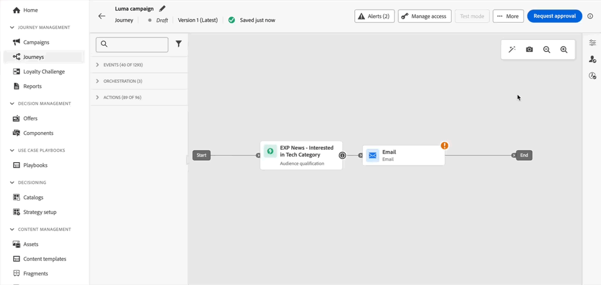

# 發行說明 {#release-notes}

>[!CONTEXTUALHELP]
>id="ajo_homepage_card1"
>title="有哪幾種新增功能？"
>abstract="**Adobe Journey Optimizer** 持續提供新功能、現有功能的增強功能並修正錯誤。 所有變更都會在每月最後一週整合於發行說明。"

[!DNL Adobe Journey Optimizer]持續提供新功能、現有功能的增強功能並修正錯誤。所有變更都會整合到每月最後一週的發行說明一起發表。[!DNL Adobe Journey Optimizer] 是原生建置在 [!DNL Adobe Experience Platform] 的並繼承其最新創新和改善項目。若要了解更多有關這些變更的資訊，請參閱 [Adobe Experience Platform 發行說明](https://experienceleague.adobe.com/docs/experience-platform/release-notes/latest.html?lang=zh-Hant){target="_blank"}。

## 2025年7月發行說明 {#25-7-rn}

**在發行日期**&#x200B;之前，下列發行前說明可能會有所變更，恕不另行通知。 連結、畫面和更新文件會於發行日期發佈。

另請參閱[Adobe Experience Platform發行前說明](https://experienceleague.adobe.com/zh-hant/docs/experience-platform/release-notes/pre-release-notes){target="_blank"}。

**發行日期**： 2025年7月29日

### 全新功能 {#25-7-features}

此版本隨附的新功能詳述如下。

#### 功能

<table>
<thead>
<tr>
<th><strong>WhatsApp頻道</strong> </th>
</tr>
</thead>
<tbody>
<tr>
<td>

Journey Optimizer現在支援直接的WhatsApp傳訊，可順利整合至您的歷程和行銷活動，以改善收件者通訊和參與。 此原生管道提供立即可用的WhatsApp範本整合、訊息預覽、個人化、傳遞報告、Webhook、選擇加入和選擇退出同意管理等功能。

此功能先前在Beta中發行，現在可供所有環境使用（全面發佈）。

<!--For more information, refer to the <a href="../FILE.md">detailed documentation</a>-->

</td>
</tr>
</tbody>
</table>

<table>
<thead>
<tr>
<th><strong>品牌</strong> </th>
</tr>
</thead>
<tbody>
<tr>
<td>

您現在可以建立與自訂您自己的品牌，以清楚定義跨通訊的視覺與口頭身分。 透過品牌一致性分數，您可以即時收到內容反映品牌語調、風格和指引的意見反應，協助您以一致的方式與品牌保持溝通，處理您傳送的每則訊息。

此功能先前在Beta中發行，現在可供所有環境使用（全面發佈）。

<!--img src="assets/do-not-localize/FILE.gif"/>-->

<!--For more information, refer to the <a href="../FILE.md">detailed documentation</a>-->

</td>
</tr>
</tbody>
</table>

<table>
<thead>
<tr>
<th><strong>在電子郵件頻道中使用Experience Decisioning</strong> </th>
</tr>
</thead>
<tbody>
<tr>
<td>

您現在可以將決定原則新增至電子郵件歷程與行銷活動。 決策原則是優惠方案的容器，可運用決策引擎以動態方式傳回最佳內容，供每個受眾成員傳送。

此功能目前不適用於Healthcare Shield，以及Privacy and Security Shield （限量提供）。

<!--img src="assets/do-not-localize/FILE.gif"/>-->

<!--For more information, refer to the <a href="../FILE.md">detailed documentation</a>-->

</td>
</tr>
</tbody>
</table>

<table>
<thead>
<tr>
<th><strong>歷程中的內容決策活動</strong> </th>
</tr>
</thead>
<tbody>
<tr>
<td>

您目前可以透過歷程畫布中的專用內容決策活動，將個人化優惠方案納入歷程中，然後在歷程活動，包括條件和自訂動作中使用。

之前以「限量」的名義發行，目前此功能所有環境都適用（一般可用性）。

<!--img src="assets/do-not-localize/FILE.gif"/>-->

<!--For more information, refer to the <a href="../FILE.md">detailed documentation</a>-->

</td>
</tr>
</tbody>
</table>

<table>
<thead>
<tr>
<th><strong>行銷活動中的最佳化</strong> </th>
</tr>
</thead>
<tbody>
<tr>
<td>

Journey Optimizer現在可讓您使用工具，為行銷活動的對象提供個人化和最佳化內容，讓您執行內容實驗、建立規則型鎖定目標，以及使用兩者的進階組合，以最大化行銷活動的有效性。

透過最佳化，您可以：

<ul>
<li>執行內容實驗</li>
<li>善用目標規則</li>
<li>在單一行銷活動中使用實驗和定位的進階組合</li></ul>

行銷活動上線後，會根據定義的條件評估設定檔，並根據比對條件，提供行銷活動中的適當體驗或內容。

<!--img src="assets/do-not-localize/FILE.gif"/>-->

<!--For more information, refer to the <a href="../FILE.md">detailed documentation</a>-->

</td>
</tr>
</tbody>
</table>

<table>
<thead>
<tr>
<th><strong>歷程練習</strong> </th>
</tr>
</thead>
<tbody>
<tr>
<td>

歷程試運行是 Adobe Journey Optimizer 中的特殊歷程發佈模式，允許歷程從業人員使用真實的生產資料，即可測試歷程，不用聯絡實際客戶，或是更新設定檔資訊。此功能可協助歷程從業人員，針對歷程設計、客群目標市場選擇，累積信心，然後再將歷程發佈上線。

之前以「限量」的名義發行，目前此功能所有環境都適用（一般可用性）。

<!--img src="assets/do-not-localize/FILE.gif"/>-->

<!--For more information, refer to the <a href="../FILE.md">detailed documentation</a>-->

</td>
</tr>
</tbody>
</table>

<table>
<thead>
<tr>
<th><strong>行事曆檢視</strong> </th>
</tr>
</thead>
<tbody>
<tr>
<td>

歷程和行銷活動清單中，目前只有提供行事曆視圖。 行事曆視圖讓您可以透過視覺化方式，呈現個別清單中的所有歷程，同時啟用行銷活動。

此功能先前在「有限可用性」中提供，現在可供所有環境使用。 透過此「一般可用性」版本，功能包括：

<ul>
<li>日期中導覽的設計改善</li>
<li>能夠檢視草稿行銷活動（如果您已設定開始和結束日期）</li>
<li>隱藏和顯示長時間執行行事曆專案的新設定</li>
</ul>

<!--For more information, refer to the <a href="../FILE.md">detailed documentation</a>-->

</td>
</tr>
</tbody>
</table>

<table>
<thead>
<tr>
<th><strong>歷程的補充ID</strong> </th>
</tr>
</thead>
<tbody>
<tr>
<td>

目前您可以使用輪廓 ID 和其他識別碼（例如訂購 ID、訂閱 ID 或處方 ID）來觸發歷程，即可允許同一設定檔同時出現在同一歷程中許多次。這能啟用某些情境，同時管理許多訂單或訂閱，每個執行個體還會依循自己的歷程路徑操作。

以前在「有限可用性」中發佈，現在所有環境都可以在歷程中使用補充ID。 在此「一般可用性」版本中，功能現在包含對「讀取對象」歷程的支援。

<!--img src="assets/do-not-localize/FILE.gif"/>-->

<!--For more information, refer to the <a href="../FILE.md">detailed documentation</a>-->

</td>
</tr>
</tbody>
</table>

### 歷程條件的變更 {#ee-change@}

從7月8日開始，在新的客戶組織中，歷程條件中使用的運算式編輯器不再支援使用體驗事件建立運算式。 因此，[Experience Platform 資料來源](../datasource/adobe-experience-platform-data-source.md)中的體驗事件無法用於建立運算式。使用體驗事件建立運算式/邏輯的替代方法和最佳做法可參考[這裡](../building-journeys/exp-event-lookup.md)。

在單一歷程中存取歷程內容事件資料的方式不會變更。在運算式和個人化編輯器中，使用者可以繼續存取透過初始歷程事件傳入的資料。

在[本常見問題集](../building-journeys/exp-event-lookup.md#faq-ee)中深入瞭解。

### 改良功能 {#25-7-improv}

以下列舉部分發布內容附上的改良功能。

- **電子郵件設計工具**
   - Journey Optimizer電子郵件Designer現在提供切換到深色模式檢視的功能，您可以在此處額外定義特定自訂設定。 請注意，最終呈現取決於收件者的電子郵件使用者端。 此外，並非所有電子郵件使用者端都支援深色模式。
  <!-- [Read more](../FILE.md) -->

- **行銷活動**
   - **規則型行銷活動取消資格** — 在「內容」卡片中，當編輯其他傳送規則時，先前的「傳送規則」選項已取代為三種不同的規則型別，以便更妥善地控制訊息時間與可見度：
      - 顯示訊息條件：決定何時顯示內容卡的條件。
      - 關閉訊息，如果：暫時隱藏內容卡的條件。 如果再次符合顯示條件，則可重新顯示縮圖。
      - 符合以下條件時取消訊息資格：永久阻止內容卡再次顯示的條件。
  <!-- [Read more](../FILE.md) -->

   - **行銷活動中有多個傳入動作** — 為簡化行銷活動協調，您現在可以在單一行銷活動中定義數個傳入動作。 此功能可讓您同時向不同位置提供多個程式碼型體驗、應用程式內訊息、內容卡片或網頁動作，每個動作都包含特定內容。
  <!-- [Read more](../FILE.md) -->

   - **行銷活動詳細目錄重組** — 排程和API觸發的行銷活動現在分割為行銷活動詳細目錄中的個別索引標籤，以便更輕鬆導覽和管理。
  <!-- [Read more](../FILE.md) -->

- **資料管理**
   - **決定管理系統資料集更新** — 已刪除的個人化和遞補優惠現在在「decision_object_repository_personalized_offers」和「decision_object_repository_fallback_offers」資料集中標示為已封存。 資料集中的現有記錄不會變更。
  <!-- [Read more](../FILE.md) -->

- **歷程**
   - **歷程沙箱工具增強功能** — 使用封裝匯出和匯入功能，跨多個沙箱複製歷程時，現在也可使用下列功能：
      - 選取目的地上的現有事件
      - 在歷程之外獨立複製事件
      - 正在偵測欄位群組/資料來源關係，如果它們存在，則在目的地連結至它們，如果不存在，則建立它們。
  <!-- [Read more](../FILE.md) -->

- **頻道 — InApp**
   - **應用程式內索引鍵/值配對** — 使用應用程式內訊息，您可以定義索引鍵和值配對，以在訊息裝載中包含自訂變數。 這些機碼值組可讓您根據特定設定和使用案例傳遞其他資料。
  <!-- [Read more](../FILE.md) -->

## 2025 年 6 月發行說明 {#25-6-rn}

<!--
**Early release notes below are subject to change without prior notice until the release availability date**. Links, screens and updated documentation are published at the release date.-->

**發行日期**：2025 年 6 月 18 日

<!--See also [Adobe Experience Platform Pre Release Notes](https://experienceleague.adobe.com/zh-hant/docs/experience-platform/release-notes/pre-release-notes){target="_blank"}.-->

### 全新功能 {#25-06-features}

此版本隨附的新功能詳述如下。

<table>
<thead>
<tr>
<th><strong>決策中的 Adobe Experience Platform 資料集 (Beta)</strong> </th>
</tr>
</thead>
<tbody>
<tr>
<td>

先前可用於個人化的 Adobe Experience Platform 資料集現在可用於決策。這可讓您將決策屬性的定義擴充至資料集中的其他資料，以便進行定期變更的大量更新，而無需一次手動更新一個屬性。例如，可用性、等待時間等。

所有客戶都可在公開測試版中，使用此功能。如果您想要存取權，請聯絡您的客戶代表。

如需詳細資訊，請參閱<a href="../experience-decisioning/aep-data-exd.md">詳細文件</a>。

推出日期：2025 年 6 月 20 日

</td>
</tr>
</tbody>
</table>

<table>
<thead>
<tr>
<th><strong>RCS 傳送訊息</strong> </th>
</tr>
</thead>
<tbody>
<tr>
<td>

Journey Optimizer 目前有支援進階通訊解決方案 (RCS) 傳訊，可根據提供者、電信業者支援，啟用下列增強傳送訊息的功能：

<ul>
<li>有品牌、已驗證寄件者支援：使用具有品牌化元素（標誌、寄件者名稱等）的已驗證企業檔案，可以用來來傳送訊息。</li>
<li>訊息傳遞洞察力：接收包括訊息狀態更新（例如已傳送、已傳遞、已讀取）等詳細傳遞報告。</li>
<li>連結追蹤：請在 RCS 訊息中內嵌、追蹤網址，以便進行參與分析。</li>
<li>遞補簡訊：當設定檔的裝置暫不支援 RCS，或是暫時無法透過 RCS 連線時，系統會自動回覆簡訊。</li>
<li>基本訊息構成：傳送包含選擇性媒體、豐富元素的文字型 RCS 訊息，會視供應商支援而定。</li>
</ul>

如需詳細資訊，請參閱<a href="../sms/sms-configuration.md">詳細文件</a>。

</td>
</tr>
</tbody>
</table>

<table>
<thead>
<tr>
<th><strong>程式碼型體驗內容中的表單欄位</strong> </th>
</tr>
</thead>
<tbody>
<tr>
<td>

您可以立即到 JSON 或 HTML 內容範本中，定義特定可編輯欄位，即便不是技術使用者，也能輕鬆地在製作程式碼型體驗頻道上的表單檢視中編輯內容，不用要操作任何程式碼。 此外，當定義程式碼型體驗內容範本時，目前可以在範本中插入決定原則，增加可重複使用性，方便使用。

如需詳細資訊，請參閱<a href="../code-based/code-based-form-fields.md">詳細文件</a>。

</td>
</tr>
</tbody>
</table>

<!--
<table>
<thead>
<tr>
<th><strong>Custom delegation method for subdomains</strong> </th>
</tr>
</thead>
<tbody>
<tr>
<td>

In addition to the full delegation and the CNAME method, a new subdomain configuration method is now available: the Custom delegation method, which enables you to fully own controlling and maintaining all aspects of DNS that are required for delivering, rendering and tracking messages.

</td>
</tr>
</tbody>
</table>
-->

<table>
<thead>
<tr>
<th><strong>歷程中的內容決策活動</strong> </th>
</tr>
</thead>
<tbody>
<tr>
<td>

您目前可以透過歷程畫布中的專用內容決策活動，將個人化優惠方案納入歷程中，然後在歷程活動，包括條件和自訂動作中使用。

此功能僅適用於一組組織 (有限可用性)，將透過未來版本在全球推出。

如需詳細資訊，請參閱<a href="../building-journeys/content-decision.md">詳細文件</a>。

</td>
</tr>
</tbody>
</table>

<table>
<thead>
<tr>
<th><strong>歷程試運行</strong> </th>
</tr>
</thead>
<tbody>
<tr>
<td>

歷程試運行是 Adobe Journey Optimizer 中的特殊歷程發佈模式，允許歷程從業人員使用真實的生產資料，即可測試歷程，不用聯絡實際客戶，或是更新設定檔資訊。此功能可協助歷程從業人員，針對歷程設計、客群目標市場選擇，累積信心，然後再將歷程發佈上線。

此功能僅適用於一組組織 (有限可用性)，將透過未來版本在全球推出。

如需詳細資訊，請參閱<a href="../building-journeys/journey-dry-run.md">詳細文件</a>。

</td>
</tr>
</tbody>
</table>

<table>
<thead>
<tr>
<th><strong>暫停並繼續歷程</strong> </th>
</tr>
</thead>
<tbody>
<tr>
<td>

您立即可以暫停，繼續歷程。在不中斷客戶體驗的情況下，此功能可讓歷程從業人員暫時暫停即時歷程，藉此提供更大控制力，帶來更多彈性。 暫停時，系統就不會傳送任何通訊，設定檔會維持在暫停狀態，直到繼續歷程為止。

您只能暫停並繼續單一歷程，或可執行大量暫停，然後繼續另一組歷程操作。

此外，您還可以將全域篩選器套用至已暫停歷程，即可根據屬性排除設定檔。

此功能僅適用於一組組織 (有限可用性)，將透過未來版本在全球推出。

如需詳細資訊，請參閱<a href="../building-journeys/journey-pause.md">詳細文件</a>。

</td>
</tr>
</tbody>
</table>

<table>
<thead>
<tr>
<th><strong>提高實驗勝率</strong> </th>
</tr>
</thead>
<tbody>
<tr>
<td>

擴大實驗獲勝者的規模，讓您能夠透過自動或手動方式，將實驗的獲勝變化版本推廣給所有客群參考。此功能可確保一旦確定高績效人才，您就可以大幅提高影響力和效率，不必再不斷進行人工監督。

如需詳細資訊，請參閱<a href="../content-management/content-experiment.md">詳細文件</a>。

推出日期：2025 年 6 月 2 日
</td>
</tr>
</tbody>
</table>

<table>
<thead>
<tr>
<th><strong>衝突與優先順序</strong> </th>
</tr>
</thead>
<tbody>
<tr>
<td>

請在 Journey Optimizer 中，管理行銷活動和歷程流量和時間非常重要，才能避免過多的互動，給客戶帶來負擔。Journey Optimizer 目前有提供幾種可用於衝突管理和優先排序的工具，以前只適用於有限存取 (LA) 組織 - 現已普遍開放使用 (GA)。

此功能之前以 [限量] 的名義發行，目前所有環境都可以使用。 已在此一般可用性版本中，引進以下增強功能：

<ul>
<li>擴展支援：除了閱讀受眾歷程之外，衝突管理工具目前還有支援單一歷程和受眾資格歷程。</li>
<li>改善的疑難排解：查詢服務中目前有提供兩種新的步驟事件欄位，讓您能分析設定檔遭到歷程或行銷活動拒絕的原因。</li>
<li>增強報告：報告目前可以指定哪些特定規則會將設定檔排除在歷程，或是行銷活動之外，提供更高透明度和可操作的洞察力。</li></ul>

如需詳細資訊，請參閱<a href="../conflict-prioritization/gs-conflict-prioritization.md">詳細文件</a>。

推出日期：2025 年 6 月 3 日

</td>
</tr>
</tbody>
</table>

### 改良功能 {#25-06-improv}

以下列舉部分發布內容附上的改良功能。

- **頻道規則集**

   - 上限專用&#x200B;**自訂持續時間視窗** - 頻道規則集設定畫面中目前有提供新的&#x200B;**間隔**&#x200B;欄位，讓您可以根據指定持續時間，選擇數天、數週或數月內套用頻率上限規則。

   - **每小時重設上限頻率** - 您目前可以將每小時上限套用至頻道規則集。此功能僅適用於一組組織 (有限可用性)。 請聯絡您的客戶服務以啟用這項功能。

   - **每日持續時間** - 先前在「有限可用性」中提供，現在所有客戶都可以使用頻道規則集中的「每日」頻率上限。

  如需詳細資訊，請參閱[詳細文件](../conflict-prioritization/channel-capping.md)。

- **程式碼型體驗**

   - 現在可在程式碼型體驗內容範本中新增決策原則，以便用於利用可編輯表單欄位中的優惠方案。[閱讀全文](../code-based/code-based-form-fields.md)

   - 只要到程式碼型體驗歷程，或透過行銷活動版本畫面，就可以立即直接新增決策原則，不用開啟個人化編輯器。[閱讀全文](../code-based/create-code-based.md#edit-code)

- **電子郵件設計工具的自訂 CSS 支援**

  Journey Optimizer 目前可讓您直接在電子郵件設計工具中，將自訂 CSS 新增至電子郵件內容。[閱讀全文](../email/custom-css.md)

- **新的行銷活動索引標籤式導覽**

  新的導覽模式讓您可以更快速地存取內容製作，能在行銷活動中，支援進一步擴充設定。[閱讀全文](../campaigns/create-campaign.md)

- **決策**

   - **沙箱複製和決策** (推出日期：2025 年 6 月 3 日) - 決策物件現在可以在沙箱之間複製，以便簡化測試，同時部署工作流程。[閱讀全文](../configuration/copy-objects-to-sandbox.md#decisioning)

   - **決策規則的決策項目屬性支援** (推出日期：2025 年 6 月 4 日) - 您現在可以運用決策項目屬性來建立決策規則。[閱讀全文](../experience-decisioning/rules.md#create)

- **互動式訊息執行 API 更新** — 推出日期：2025 年 6 月 6 日

  互動式訊息執行 API 讓您可以立即刪除即將執行的行銷活動排程。[閱讀全文](https://developer.adobe.com/journey-optimizer-apis/references/messaging/){target="_blank"}
