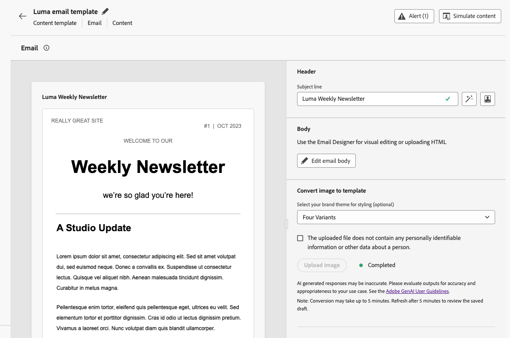

# 發行說明 {#release-notes}

>[!CONTEXTUALHELP]
>id="ajo_homepage_card1"
>title="有哪幾種新增功能？"
>abstract="**Adobe Journey Optimizer** 持續提供新功能、現有功能的增強功能並修正錯誤。 所有變更都會在每月最後一週整合於發行說明。"

[!DNL Adobe Journey Optimizer] 遵循持續傳遞模式，允許 Adobe 持續傳遞新功能、增強功能和修正。此方法可讓您分階段推出可擴充的功能，以確保所有環境的效能和穩定性。

基於此模型，發行說明會在每月發行之間更新。專屬的[最新更新](#latest-updates)區段會強調在部署到生產環境時的新功能和改善 — 因此您一律會即時收到所有變更的通知。 如需發行週期與可用性階段的完整詳細資訊，請參閱[Journey Optimizer發行週期](releases.md)。

[!DNL Adobe Journey Optimizer] 是原生建置在 [!DNL Adobe Experience Platform] 的並繼承其最新創新和改善項目。若要了解更多有關這些變更的資訊，請參閱 [Adobe Experience Platform 發行說明](https://experienceleague.adobe.com/docs/experience-platform/release-notes/latest.html?lang=zh-Hant){target="_blank"}。

## 最新更新 {#latest-updates}

以下列出過去幾週發佈的新功能和改進專案及其推出日期。 他們將在月底與下一個發行說明內容一起分組。 另請參閱下面[的最新](#latest-rn)發行說明。

### 全新功能 {#features}

<table>
<thead>
<tr>
<th><strong>電子郵件設計工具中的主題</strong> </th>
</tr>
</thead>
<tbody>
<tr>
<td>

目前您可以快速套用事先審核通過的主題，以便確保所有電子郵件的品牌都有保持一致性，加快投放行銷活動的流程，個別製作高品質的電子郵件，同時減少對設計團隊的依賴。

此功能先前以 Beta 版發行，現在可供部分組織使用 (有限可用性)。若想取得存取權，請聯絡您的 Adobe 代表。

如需詳細資訊，請參閱<a href="../email/apply-email-themes.md">詳細文件</a>。

推出日期： 2025年11月5日

</td>
</tr>
</tbody>
</table>

## 2025 年 10 月發行說明 {#oct-25-10-rn}

### 全新功能 {#oct-25-10-features}

<table>
<thead>
<tr>
<th><strong>影像至HTML轉換工具</strong> </th>
</tr>
</thead>
<tbody>
<tr>
<td>

影像至HTML轉換器是AI支援的功能，可將靜態影像設計轉換為完全可自訂、模組化的HTML電子郵件內容範本。 此無程式碼工具可讓行銷人員將視覺設計轉換為回應式、可編輯的電子郵件範本，而不需要技術專業知識 — 非常適合平台移轉、快速建立範本及建立可重複使用的範本程式庫。

此功能為「有限可用性」的狀態。請聯絡您的 Adobe 代表以取得存取權。

如需詳細資訊，請參閱<a href="../email/image-to-html.md">詳細文件</a>。

推出日期：2025 年 10 月 30 日

</td>
</tr>
</tbody>
</table>

<table>
<thead>
<tr>
<th><strong>自訂動作監視和報告</strong> </th>
</tr>
</thead>
<tbody>
<tr>
<td>

此功能可讓您更清楚地瞭解自訂動作端點的健康狀況和效能。 新的自訂動作監視儀表板以及歷程步驟事件資料集中的對應欄位將協助您監視自訂動作端點的成功呼叫、錯誤、輸送量、回應時間和佇列等待時間。 您現在可以快速了解自訂動作中發生異常狀況的時間、位置和原因。

此功能目前對客戶而言為有限可用性。

如需詳細資訊，請參閱<a href="../action/reporting.md">詳細文件</a>。

推出日期： 2025年10月28日

</td>
</tr>
</tbody>
</table>

<table>
<thead>
<tr>
<th><strong>登陸頁面自訂表單</strong> </th>
</tr>
</thead>
<tbody>
<tr>
<td>

現在使用 [!DNL Journey Optimizer]，可以透過登入頁面擷取設定檔屬性。

根據特定資料集，建立、設計和管理為您的需求量身打造的自訂表單。 然後，您可以在登陸頁面中善用自訂表單，將選擇的設定檔屬性新增至為每個表單定義的資料集。

此功能目前在美國和澳洲的客戶中處於「有限可用」狀態。 請聯絡您的 Adobe 代表以取得存取權。

如需詳細資訊，請參閱<a href="../landing-pages/lp-forms.md">詳細文件</a>。

推出日期： 2025年10月23日

</td>
</tr>
</tbody>
</table>

<table>
<thead>
<tr>
<th><strong>勿打擾時間/不接收訊息的時間</strong> </th>
</tr>
</thead>
<tbody>
<tr>
<td>

勿打擾時間可讓您定義不接收電子郵件、簡訊、推播和 WhatsApp 管道訊息的時間。此功能可確保在特定時段內不會傳送任何訊息，協助您遵守客戶偏好設定和合規性要求。

您可以透過規則集套用勿打擾時間，這些規則集可指派給行銷活動或歷程中的個別動作，以進行精確控制。

目前勿打擾時間規則僅開放給部分組織使用 (有限可用性)。若要新增至輪候表，請聯絡您的 Adobe 代表。

如需詳細資訊，請參閱<a href="../conflict-prioritization/quiet-hours.md">詳細文件</a>。

推出日期：2025 年 10 月 22 日

</td>
</tr>
</tbody>
</table>

<!--table>
<thead>
<tr>
<th><strong>RCS Basic Messaging</strong> </th>
</tr>
</thead>
<tbody>
<tr>
<td>

With the new RCS Basic add-on offering, you can now deliver basic Rich Communication Services (RCS) messaging in Journey Optimizer, enabling the following enhanced messaging capabilities subject to provider and geographical support:

<ul>
<li><strong>Branded and verified sender support:</strong> Send messages using verified business profiles with branding elements (logo, sender name, etc.).</li>
<li><strong>Message delivery insights:</strong> Receive detailed delivery reports including message status updates (e.g., sent, delivered, read).</li>
<li><strong>Link tracking:</strong> Embed and track URLs within RCS messages for engagement analytics.</li>
<li><strong>Fallback to SMS:</strong> Automatic fallback to SMS when the recipient's device does not support RCS or is temporarily unreachable via RCS.</li>
<li><strong>Basic message composition:</strong> Send basic text-based RCS messages.</li>
</ul>
<!--img src="assets/do-not-localize/FILE.gif"-->
<!-- p>For more information, refer to the <a href="../FILE.md">detailed documentation</a>.

<!--/td>
</tr>
</tbody>
</table-->

<!--table>
<thead>
<tr>
<th><strong>Direct mail channel in Orchestrated campaigns</strong> </th>
</tr>
</thead>
<tbody>
<tr>
<td>

Direct mail channel is now available in orchestrated campaigns. The Direct mail activity facilitates direct mail sending within your Orchestrated campaign, for both one-time and recurring messages. It serves to automate the process of generating the extraction file required by direct mail providers. You can combine channel activities into the Orchestrated campaign canvas to create cross-channel campaigns that can trigger actions based on customer behavior and data.

<!--img src="assets/do-not-localize/FILE.gif"-->
<!-- p>For more information, refer to the <a href="../FILE.md">detailed documentation</a>.

<!--/td>
</tr>
</tbody>
</table-->

<!--table>
<thead>
<tr>
<th><strong>Direct Mail channel in journeys</strong> </th>
</tr>
</thead>
<tbody>
<tr>
<td>

Previously limited to Campaigns, Direct Mail channel is now available on the journey canvas, enabling you to incorporate Direct Mail into your journeys. Direct Mail can now be used in both batch and 1:1 journey scenarios, with support for file extraction configuration and time-based frequency settings.

 Previously released in Limited Availability, this capability is now available to all environments (General Availability).

<!--img src="assets/do-not-localize/FILE.gif"-->
<!-- p>For more information, refer to the <a href="../FILE.md">detailed documentation</a>.

<!--/td>
</tr>
</tbody>
</table-->

<!--table>
<thead>
<tr>
<th><strong>New API to retrieve Action Campaigns</strong> </th>
</tr>
</thead>
<tbody>
<tr>
<td>

A new Journey Optimizer API is now available, enabling you to programmatically retrieve and inspect campaign-related data such as details, versions, and configurations.

For more information, refer to the <a href="https://developer.adobe.com/journey-optimizer-apis/references/campaigns-retrieve/">detailed documentation</a>.

Availability date: October 22, 2025

</td>
</tr>
</tbody>
</table-->

<!--<table>
<thead>
<tr>
<th><strong>New source connectors for loyalty apps</strong> </th>
</tr>
</thead>
<tbody>
<tr>
<td>

New source connectors are now available in Adobe Experience Platform for the Talon.One, Capillary and Kobie loyalty Apps. These connectors let you seamlessly stream loyalty data into Adobe Experience Platform and leverage these data in Journey Optimizer.

For more information, refer to the <a href="../start/get-started-sources.md">detailed documentation</a>.

Availability date: October 22, 2025

</td>
</tr>
</tbody>
</table>-->

<!--table>
<thead>
<tr>
<th><strong>Decisioning support in email channel</strong> </th>
</tr>
</thead>
<tbody>
<tr>
<td>

You can now add Decision policies into email journeys and campaigns. Decision policies are containers for your offers that leverage the Decisioning engine to dynamically return the best content to deliver for each audience member.

Previously released in Limited Availability, this capability is now available to all environments (General Availability).

For more information, refer to the <a href="../FILE.md">detailed documentation</a>.

Availability date: October 22, 2025

</td>
</tr>
</tbody>
</table-->

<table>
<thead>
<tr>
<th><strong>API 觸發的電子郵件行銷活動的高輸送量傳訊</strong> </th>
</tr>
</thead>
<tbody>
<tr>
<td>

API 觸發的行銷活動提供新的高輸送量交易型傳訊。此模式專為大規模即時交易型傳訊而設計，最高可支援每秒 5,000 筆交易，而且可用性更高。此模式也支援交易訊息，而不需參考或建立客戶輪廓，例如訪客結帳、訂單確認、密碼重設、安全性通知和其他服務/營運通知。

此功能僅適用於電子郵件管道，以及已購買 Adobe 高輸送量交易訊息附加產品的組織。請聯絡您的 Adobe 代表以取得更多資訊。

如需詳細資訊，請參閱<a href="../campaigns/api-triggered-high-throughput.md">詳細文件</a>。

推出日期：2025 年 10 月 22 日

</td>
</tr>
</tbody>
</table>

<table>
<thead>
<tr>
<th><strong>可重複使用的目標定位規則</strong> </th>
</tr>
</thead>
<tbody>
<tr>
<td>

為了節省時間和精力，Journey Optimizer 現在可讓您從專用的 UI 選單建立可重複使用的規則，並在建立目標定位時運用這些規則，作為行銷活動或歷程中的內容最佳化的一部分，或是最佳化歷程活動。

目標定位規則目前處於「有限可用性」。請聯絡您的 Adobe 代表以取得存取權。請注意，此功能僅適用於已購買決策附加產品的組織。此功能將逐步向所有客戶推出。

如需詳細資訊，請參閱<a href="../experience-decisioning/rules.md">詳細文件</a>。

推出日期：2025 年 10 月 22 日

</td>
</tr>
</tbody>
</table>

<table>
<thead>
<tr>
<th><strong>新歷程警示</strong> </th>
</tr>
</thead>
<tbody>
<tr>
<td>

新的預先設定警示可用來監視歷程執行：

<ul><li><a href="../reports/alerts.md#alert-discard-rate">超過輪廓捨棄率</a>：過去 5 分鐘超過臨界值的輪廓捨棄與輸入輪廓的比率。</li>
<li><a href="../reports/alerts.md#alert-custom-action-error-rate">超過自訂動作錯誤率</a>：過去 5 分鐘超出臨界值的自訂動作錯誤與成功 HTTP 呼叫的比率。</li>
<li><a href="../reports/alerts.md#alert-profile-error-rate">超過輪廓錯誤率</a>：過去 5 分鐘超過臨界值的輪廓出錯與輸入輪廓的比率。</li></ul> 
您可以修改臨界值，並訂閱個別歷程層級警示與全域警示。

如需詳細資訊，請參閱<a href="../reports/alerts.md">詳細文件</a>。

推出日期：2025 年 10 月 14 日

</td>
</tr>
</tbody>
</table>

<table>
<thead>
<tr>
<th><strong>執行中繼資料協助程式</strong> </th>
</tr>
</thead>
<tbody>
<tr>
<td>

個人化編輯器中提供了新的「executionMetadata」協助程式函式。它可讓您將內容相關資訊附加至任何原生動作，並將其擷取至資料集，以匯出至外部系統。

此功能為「有限可用性」的狀態。請聯絡您的 Adobe 代表以取得存取權。

如需詳細資訊，請參閱<a href="../personalization/functions/helpers.md#execution-metadata">詳細文件</a>。

推出日期：2025 年 10 月 13 日

</td>
</tr>
</tbody>
</table>

<table>
<thead>
<tr>
<th><strong>Experimentation Accelerator 與實驗代理</strong> </th>
</tr>
</thead>
<tbody>
<tr>
<td>

Journey Optimizer Experimentation Accelerator 現在包含實驗代理，這是 AI 支援的對話工具，可讓您與實驗、深入分析和機會互動。它增強了 Journey Optimizer Experimentation Accelerator 體驗，幫助您更高效地執行實驗、揭示有效之處，並探索下一步最佳化的目標。

如需詳細資訊，請參閱<a href="https://experienceleague.adobe.com/docs/experience-cloud-ai/experience-cloud-ai/agents/agent-experiment.html?lang=zh-Hant" target="_blank">詳細文件</a>。

推出日期：2025 年 10 月 10 日

</td>
</tr>
</tbody>
</table>

<table>
<thead>
<tr>
<th><strong>電子郵件的 PDF 附件</strong> </th>
</tr>
</thead>
<tbody>
<tr>
<td>

您現在可以對透過 Journey Optimizer 傳送的電子郵件訊息附加靜態 PDF 檔案。

<ul>
<li>您每年最多可以為每個設定檔傳送 6 封含有 PDF 附件的訊息。</li>
<li>每個附件允許的大小上限為 5 MB。</li>
<li>如需其他大小或流量，您可以購買 PDF 附件附加元件。如需詳細資訊，請聯絡您的 Adobe 代表。</li>
</ul>

此功能之前以「有限可用性」的名義發行，目前所有環境都適用 (一般可用性)。

如需詳細資訊，請參閱<a href="../email/pdf-attachments.md">詳細文件</a>。

推出日期：2025 年 9 月 30 日

</td>
</tr>
</tbody>
</table>

<table>
<thead>
<tr>
<th><strong>用於檢索歷程的公用 API</strong> </th>
</tr>
</thead>
<tbody>
<tr>
<td>

新的 Journey Optimizer API 現在可用於檢索歷程及其關聯的物件，例如行銷活動和表面。

如需詳細資訊，請參閱<a href="https://developer.adobe.com/journey-optimizer-apis/references/journeys-retrieve/">詳細文件</a>

推出日期：2025 年 9 月 25 日

</td>
</tr>
</tbody>
</table>

### 改善 {#updates-improvements}

**WhatsApp 管道的執行欄位**

除了電子郵件和簡訊之外，您也會在沙箱層級更新 WhatsApp 傳送的預設執行欄位。您也可以在 WhatsApp 歷程活動進階參數或 WhatsApp 管道設定中變更執行欄位，以覆寫全域設定的執行欄位。[閱讀全文](../configuration/primary-email-addresses.md)

推出日期：2025 年 10 月 22 日

**Mailto (取消訂閱) 地址的自訂屬性支援**

使用 Journey Optimizer，如果您在 Adobe 外部管理同意，則可以在電子郵件設定中定義您自己的一鍵取消訂閱連結和自訂取消訂閱電子郵件地址，以設定外部自訂端點。當您的收件者按一下取消訂閱連結時，Journey Optimizer 會將一些預設的輪廓特定參數附加至同意更新事件。

若要進一步個人化自訂端點，您現在可以定義將要同時附加至同意事件的自訂屬性。[閱讀全文](../email/list-unsubscribe.md#custom-attributes)

>[!AVAILABILITY]
>
>自 2025 年 8 月起，此功能已可用於自訂&#x200B;**[!UICONTROL 一鍵取消訂閱 URL]**，現在為有限可用性，僅為 **[!UICONTROL Mailto (取消訂閱)]** 選項發行。請聯絡您的 Adobe 代表以取得存取權。

推出日期：2025 年 10 月 6 日

<!--
### Coming soon {#oct-25-10-soon}

In the next few days, the following capabilities and enhancements are scheduled for release. **Information is subject to change**. Updated links, screens, and documentation will be shared once these updates are live in production.

#### New capabilities {#oct-25-10-soon-features}

<table>
<thead>
<tr>
<th><strong>Themes in the Email Designer</strong> </th>
</tr>
</thead>
<tbody>
<tr>
<td>

You can now quickly apply pre-approved themes to ensure brand consistency across all emails, speed up your campaign creation process, and independently produce high-quality emails while reducing dependency on design teams.

Previously released in beta version, this capability is now available for a set of organizations (Limited Availability). To gain access, contact your Adobe representative.

For more information, refer to the <a href="../email/apply-email-themes.md">detailed documentation</a>.

Availability date: November 4, 2025

</td>
</tr>
</tbody>
</table>

#### Improvements {#oct-25-10-soon-improvements}

**Decisioning in emails through AI models**

You can now use AI models to optimize the best content in your email through the use of Decisioning. For example, this capability allows you to offer the best content based on custom events such as Purchases, Button Clicks, Add to Cart, etc.
-->

<!--
<table>
<thead>
<tr>
<th><strong>New Web Push notifications channel</strong> </th>
</tr>
</thead>
<tbody>
<tr>
<td>

Adobe Journey Optimizer now supports Web Push notifications, expanding the push channel beyond mobile. You can seamlessly deliver notifications to both mobile and desktop browsers, enabling you to reach customers directly on their devices without requiring an app.

This enhancement allows you to engage users with timely, personalized messages in real time, leveraging the same authoring workflows and targeting capabilities already available for mobile push.

For more information, refer to the <a href="../FILE.md">detailed documentation</a>

Availability date: Sept XX, 2025

</td>
</tr>
</tbody>
</table>

<table>
<thead>
<tr>
<th><strong>Custom action monitoring and reporting</strong> </th>
</tr>
</thead>
<tbody>
<tr>
<td>

Custom action monitoring and reporting is now available. This capability provides better visibility into journey health and execution, including lifecycle status and performance alerts. You can now quickly understand when, where, and why an anomalous situation is occurring in a custom action.

For more information, refer to the <a href="../FILE.md">detailed documentation</a>

Availability date: Sept XX, 2025

</td>
</td>
</tr>
</tbody>
</table>

<table>
<thead>
<tr>
<th><strong>New source connectors for loyalty apps</strong> </th>
</tr>
</thead>
<tbody>
<tr>
<td>

New source connectors are now available in Adobe Experience Platform for the Talon.One, Capillary, and Kobie loyalty apps. These connectors let you seamlessly stream loyalty data into Adobe Experience Platform and leverage these data in Journey Optimizer.

</td>
</tr>
</tbody>
</table>

-->
