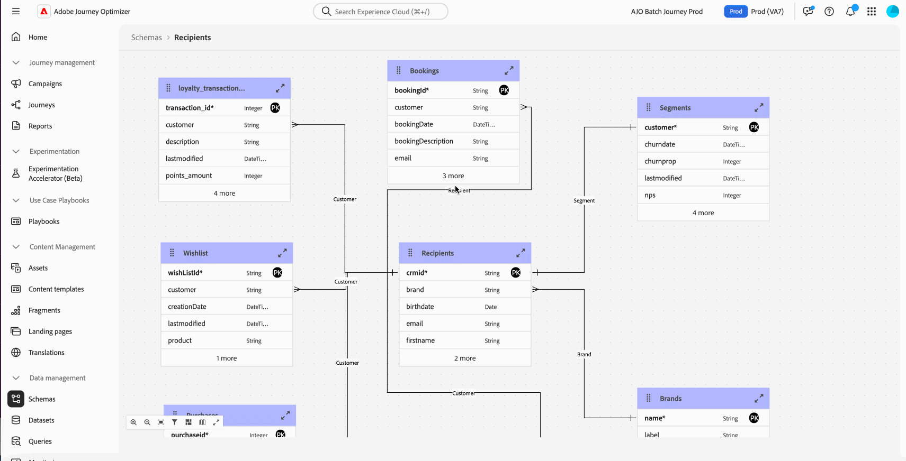

# 發行說明 {#release-notes}

>[!CONTEXTUALHELP]
>id="ajo_homepage_card1"
>title="有哪幾種新增功能？"
>abstract="**Adobe Journey Optimizer** 持續提供新功能、現有功能的增強功能並修正錯誤。 所有變更都會在每月最後一週整合於發行說明。"

[!DNL Adobe Journey Optimizer]持續提供新功能、現有功能的增強功能並修正錯誤。所有變更都會整合到每月最後一週的發行說明一起發表。[!DNL Adobe Journey Optimizer] 是原生建置在 [!DNL Adobe Experience Platform] 的並繼承其最新創新和改善項目。若要了解更多有關這些變更的資訊，請參閱 [Adobe Experience Platform 發行說明](https://experienceleague.adobe.com/docs/experience-platform/release-notes/latest.html?lang=zh-Hant){target="_blank"}。

## 2025 年 8 月搶鮮版發行說明 {#25-8-rn}

**至發行日期之前，下方搶鮮版發行說明如有變更，恕不另行通知**。連結、畫面和更新文件會於發行日期發佈。

另請參閱 [Adobe Experience Platform 搶鮮版發行說明](https://experienceleague.adobe.com/zh-hant/docs/experience-platform/release-notes/pre-release-notes){target="_blank"}。

**發行日期**：2025 年 8 月 19 日

### 全新功能 {#Aug-25-8-features}

此版本隨附的新功能詳述如下。

<table>
<thead>
<tr>
<th><strong>暫停並繼續歷程</strong> </th>
</tr>
</thead>
<tbody>
<tr>
<td>

您立即可以暫停，繼續歷程。在不中斷客戶體驗的情況下，此功能可讓歷程從業人員暫時暫停即時歷程，藉此提供更大控制力，帶來更多彈性。 暫停時，系統就不會傳送任何通訊，設定檔會維持在暫停狀態，直到繼續歷程為止。

您只能暫停並繼續單一歷程，或可執行大量暫停，然後繼續另一組歷程操作。

此外，您還可以將全域篩選器套用至已暫停歷程，即可根據屬性排除設定檔。

<!--img src="assets/do-not-localize/PauseResume.gif"/>-->

之前以「限量」的名義發行，目前此功能所有環境都適用 (一般可用性)。

<!--For more information, refer to the <a href="../building-journeys/journey-pause.md">detailed documentation</a>-->

</td>
</tr>
</tbody>
</table>

<table>
<thead>
<tr>
<th><strong>行事曆檢視</strong> </th>
</tr>
</thead>
<tbody>
<tr>
<td>

歷程和行銷活動清單中，目前只有提供行事曆視圖。 行事曆視圖讓您可以透過視覺化方式，呈現個別清單中的所有歷程，同時啟用行銷活動。

此功能之前以「限量」的名義發行，目前所有環境都可以使用。在此「一般可用性」版本中，功能包括：

<ul>
<li>日期中導覽的設計改善，</li>
<li>能夠檢視草稿行銷活動（如果您已設定開始和結束日期），</li>
<li>隱藏和顯示長時間執行行事曆專案的新設定。</li>
</ul>

<!--img src="assets/do-not-localize/calendar.gif"/>-->

<!--For more information, refer to the <a href="../building-journeys/journey-ui.md#journeys-calendar">detailed documentation</a>-->

</td>
</tr>
</tbody>
</table>

<!--table>
<thead>
<tr>
<th><strong>Dark mode in the Email Designer</strong> </th>
</tr>
</thead>
<tbody>
<tr>
<td>

The Journey Optimizer Email Designer now offers the ability to switch to dark mode view, where you can additionally define specific custom settings that will display only for recipients reading their emails in dark mode.

Note the following:

<ul>
<li>The dark mode final rendering may vary and depends on the recipient's email client.</li>
<li>Not all email clients support custom dark mode. Moreover, some email clients only apply their own default dark mode for all emails that are received. In both cases, the custom settings that you defined in the Email Designer cannot be rendered.</li>
</ul>

This capability is currently in beta version and only available to beta customers. To join the beta program, contact your Adobe representative.

For more information, refer to the <a href="../email/dark-mode.md">detailed documentation</a>

</td>
</tr>
</tbody>
</table-->

<table>
<thead>
<tr>
<th><strong>使用 Adobe Experience Platform 資料進行個人化</strong> </th>
</tr>
</thead>
<tbody>
<tr>
<td>

利用個人化編輯器中[!DNL Adobe Experience Platform]的資料，個人化您的內容和決定屬性。 尤其是，這可讓您將屬性的定義擴充至資料集中的其他資料，以定期變更大量更新，而無需一次手動更新一個屬性。

此功能之前以 [限量] 的名義發行，目前所有環境都可以使用。 已在此一般可用性版本中，引進以下增強功能：

<ul>
<li>支援傳入頻道、</li>
<li>「datasetLookup」協助程式函式現在可用於運算式和視覺片段中，以使用Adobe Experience Platform資料集中的資料進行個人化內容。</li>
<li>資料集中的選項現在可讓您啟用資料集以進行查詢個人化，而無需執行API呼叫。</li>
</ul>

<!--img src="assets/do-not-localize/FILE.gif"/>-->

<!--For more information, refer to the <a href="../FILE.md">detailed documentation</a>-->

</td>
</tr>
</tbody>
</table>

<!--table>
<thead>
<tr>
<th><strong>Use Decisioning in email channel</strong> </th>
</tr>
</thead>
<tbody>
<tr>
<td>

You can now add Decision policies into email journeys and campaigns. Decision policies are containers for your offers that leverage the Decisioning engine to dynamically return the best content to deliver for each audience member.

Previously released in Limited Availability, this capability is now available to all environments (General Availability).

<For more information, refer to the <a href="../FILE.md">detailed documentation</a>

</td>
</tr>
</tbody>
</table-->

<table>
<thead>
<tr>
<th><strong>歷程路徑最佳化</strong> </th>
</tr>
</thead>
<tbody>
<tr>
<td>

Journey Optimizer現在可讓您運用人工智慧和實驗架構，最佳化您的歷程，同時確保條件與最佳化功能之間的無縫可用性及差異。

使用路徑最佳化來鎖定目標、進行實驗或使用AI來決定通訊順序、通訊之間的時間、管道的組合，以及您在歷程畫布上可以夢見的任何事物。

此功能為「有限可用性」的狀態。請聯絡您的 Adobe 代表以取得存取權。

<!--img src="assets/do-not-localize/FILE.gif"/>-->

<!--For more information, refer to the <a href="../FILE.md">detailed documentation</a>-->

</td>
</tr>
</tbody>
</table>

<table>
<thead>
<tr>
<th><strong>歷程中的動作活動</strong> </th>
</tr>
</thead>
<tbody>
<tr>
<td>

Journey Optimizer支援新的通用動作活動，可讓您設定單一動作和多動作傳入動作群組，進而簡化歷程畫布中的動作設定。 這項新功能特別允許：

<ul>
<li>歷程畫布中的簡化原生動作設定。</li>
<li>建立多動作傳入節點的容量。</li>
<li>將最佳化新增至任何內建頻道動作的功能。</li>
<li>能夠新增實驗和多語言選項至任何動作。</li>
</ul>

此功能為「有限可用性」的狀態。請聯絡您的 Adobe 代表以取得存取權。

<!--img src="assets/do-not-localize/FILE.gif"/>-->

<!--For more information, refer to the <a href="../FILE.md">detailed documentation</a>-->

</td>
</tr>
</tbody>
</table>

<table>
<thead>
<tr>
<th><strong>登陸頁面自訂表單</strong> </th>
</tr>
</thead>
<tbody>
<tr>
<td>

Journey Optimizer現在可讓您建立自訂表單，並在登入頁面中運用自訂表單，將設定檔屬性擷取至為每個表單定義的資料集中。

此功能為「有限可用性」的狀態。請聯絡您的 Adobe 代表以取得存取權。

<!--This capability is currently in beta version and only available to beta customers. To join the beta program, contact your Adobe representative.-->

<!--img src="assets/do-not-localize/FILE.gif"/>-->

<!--For more information, refer to the <a href="../FILE.md">detailed documentation</a>-->

</td>
</tr>
</tbody>
</table>

<table>
<thead>
<tr>
<th><strong>行銷活動中的最佳化</strong> </th>
</tr>
</thead>
<tbody>
<tr>
<td>

Journey Optimizer 現在可讓您使用工具，為行銷活動的對象提供個人化和最佳化內容，讓您執行內容實驗、建立規則型目標定位，以及使用兩者的進階組合，從而最大化行銷活動的有效性。

使用最佳化時，您可以：

<ul>
<li>測試多種內容變化，以確定出最有效的傳訊。</li>
<li>根據使用者屬性和內容資料提供個人化內容。</li>
<li>針對進階行銷活動策略結合目標定位和實驗。</li>
<li>篩選出不符合變體條件的使用者。</li>
<li>確保遞補機制以維持使用者參與。</li>
</ul>

行銷活動上線後，會根據定義的條件評估設定檔，並根據比對條件，提供設定檔和行銷活動中的適當體驗或內容。

發行日期： 2025年8月8日

如需詳細資訊，請參閱<a href="../campaigns/campaigns-message-optimization.md">詳細文件</a>

</td>
</tr>
</tbody>
</table>

### 改良功能 {#Aug-25-8-improv}

以下列舉部分發布內容附上的改良功能。

* **管理**

   * **頻道設定監視警示** — 您現在可以透過電子郵件或在Journey Optimizer通知中心訂閱接收系統警示，以防發生頻道設定失敗或遺失DNS記錄。

* **行銷活動**

   * **傳出行銷活動的速率控制** — 您現在可以為傳出行銷活動（電子郵件、簡訊、推播通知）啟用節流速率控制，讓您防止下游系統（例如登陸頁面或客戶服務平台）上的超載。

   * **動作行銷活動排程** — 行銷活動每日、每週和每月排程器已更新，以提供對週期性排程的更詳細控制：

      * **每週重複**：您現在可以選擇每週或每兩週重複一次行銷活動，並選取該行銷活動應該在一週中的哪一天執行。

      * **每月週期**：您現在可以選擇每個月或每隔一個月重複行銷活動，並選取該月應該執行的日期。

      * **每日、每週或每月排程**：您可以指定週期性排程應在特定日期停止，還是在特定次數後停止。

   * **排程交易動作行銷活動** — 排程交易動作行銷活動現在可用於透過電子郵件、簡訊和推播頻道傳送批次、對象交易式通訊。

* **頻道 — 推播**

   * **推播通知到期日** — 您現在可以為每個推播通知指定到期日，以防止在特定日期之後傳送對時間敏感的訊息（例如黑色星期五特賣），從而避免給您的客戶帶來不佳的體驗。

* **頻道 — 電子郵件**

   * **電子郵件的PDF附件** — 您現在可以將靜態PDF檔案附加至透過Journey Optimizer傳送的電子郵件訊息。 此功能為「有限可用性」的狀態。請聯絡您的 Adobe 代表以取得存取權。

* **頻道 — SMS**

   * **模糊選擇退出** — 啟用時，**模糊選擇退出**&#x200B;選項會偵測與定義的選擇退出關鍵字（例如「CANCIL」）非常相似的傳入訊息，並自動傳送確認回覆以驗證使用者的取消訂閱意圖。 如果使用者透過定義的提示確認，則取消訂閱他們。

     請注意，**Fuzzy Opt-out**&#x200B;僅適用於Sinch和Infobip。

   * **驗證SMS連線** — 您現在可以傳送範例訊息至指定裝置，在Adobe Journey Optimizer中輕鬆測試及驗證SMS API認證。

* **設定**

   * **動態網域支援** - Journey Optimizer現在支援在管道設定層級所列之預先定義網域的追蹤URL中的個人化。

   * **一鍵取消訂閱URL的自訂屬性支援** — 使用Journey Optimizer，如果您在Adobe外部管理同意，則可以在電子郵件設定中定義您自己的一鍵取消訂閱連結，以設定外部自訂端點。 當您的收件者按一下取消訂閱連結時，Journey Optimizer會將一些預設的設定檔特定引數附加至同意更新事件。

     若要進一步個人化您的一鍵式取消訂閱連結，您現在可以定義將附加至同意事件的自訂屬性。

* **決策**

   * **將片段附加至決定專案** - Journey Optimizer現在提供將片段附加至決定專案的功能，而決定專案可透過決定原則用於程式碼型體驗行銷活動。

* **歷程**

   * **歷程大量作業** — 您現在可以從歷程清單中選取多個專案。 選取後，您一次最多可以暫停或恢復10個歷程。

   * 自訂動作中的&#x200B;**重新導向(302)支援** — 自訂動作現在可以根據每個要求處理HTTP 302重新導向。 如此一來，歷程便可整合API，將請求重新導向至當地語系化或區域專屬的URL。 重新導向程式會自動執行，確保提供正確內容而不需要額外設定。

* **資料集**

   * **Experience Decisioning物件存放庫 — 個人化優惠專案** — 內建的匯出資料集現在會擷取所有優惠屬性和生命週期狀態，啟用完整的個人化及報告。

## 行銷活動協調

**推出日期**：2025 年 8 月 4 日

Journey Optimizer 現在包含&#x200B;**行銷活動協調**，這是專為品牌啟動的批次行銷活動而建置的新功能。此發行版本推出行銷活動協調畫布和增強型資料模型，共同讓行銷人員規劃、鎖定目標及提供個人化的跨頻道行銷活動。

>[!IMPORTANT]
>
>若要存取Campaign Orchestration，您的授權必須包含&#x200B;**Journey Optimizer — 行銷活動和歷程**&#x200B;或&#x200B;**Journey Optimizer — 行銷活動**&#x200B;套件。 請聯絡您的Adobe代表以確認您的授權並在需要時進行更新。

它包含[關聯式結構描述與資料集](#oc-relational)和[行銷活動畫布](#oc-canvas)。這兩項創新加在一起，在 Journey Optimizer 中開啟了協調批次行銷活動的新標準。主要功能列於下方。

### 主要功能 {#oc-capabilities}

* **多步驟工作流程**

  使用專門建置的全新行銷活動協調畫布，推進複雜的多頻道批次行銷活動。

* **隨選對象**

  隨選區段對象以立即啟用。

* **多實體細分**

  使用產品、商店、續約、預留等商業內容 (非人員維度) 來建立對象。

* **預先傳送可見度**

  在推出之前和行銷活動執行期間，檢閱、調整及最佳化對象和行銷活動

### 行銷活動畫布 {#oc-canvas}

專為批次行銷活動建置的全新視覺協調介面。此畫布能夠實現：

* 多步驟、多頻道行銷活動流程的視覺化規劃

* 支援從關聯式查詢建立的隨選對象

* 進階對象分割、等待和條件式邏輯

* 套用商業規則和篩選器後的精確預先傳送計數

### 關聯式結構描述和資料集 {#oc-relational}

Adobe Journey Optimizer現在支援連結至以人物為基礎的設定檔的關聯式實體（例如產品、商店、預訂、合約）。 這允許跨多維度資料結構的細分和個人化，啟用如下的使用案例：

* 每個預訂、訂閱或合約有一則訊息

* 根據相關實體屬性 (例如產品類別或商店位置) 細分

* 增強可尋址能力 (例如，傳送給與實體繫結的所有已知聯絡人)

### 為何這項能力很重要

此版本讓行銷人員可完全控制品牌啟動、以對象為基礎的批次行銷，結合彈性的資料建模與特意建置的協調體驗。它專為即時歷程的批次行銷活動協調而設計，同時提供進階的個人化與擴充性。

### 了解更多

閱讀[行銷活動協調文件](../orchestrated/gs-orchestrated-campaigns.md)並深入了解。

