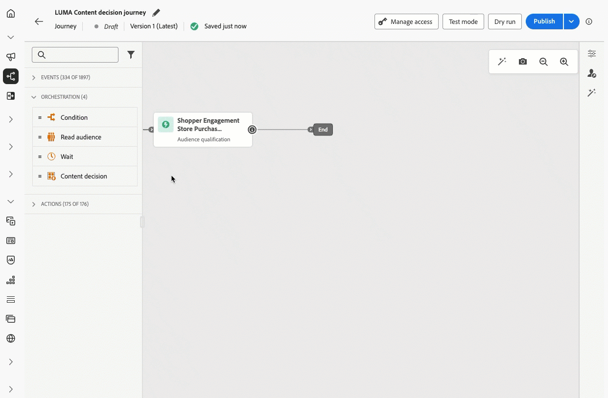
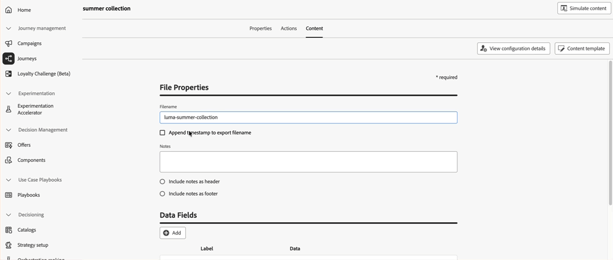
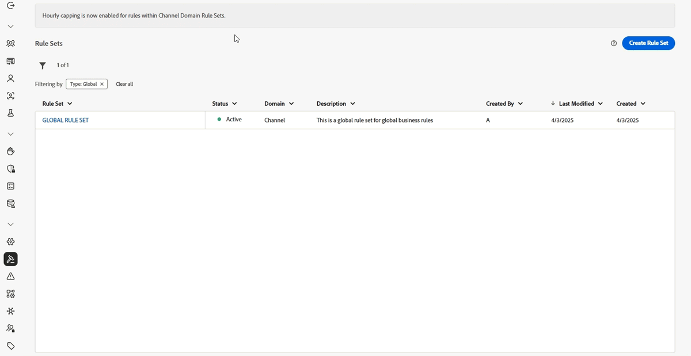
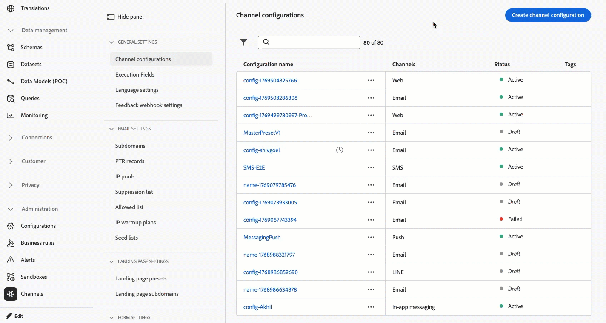
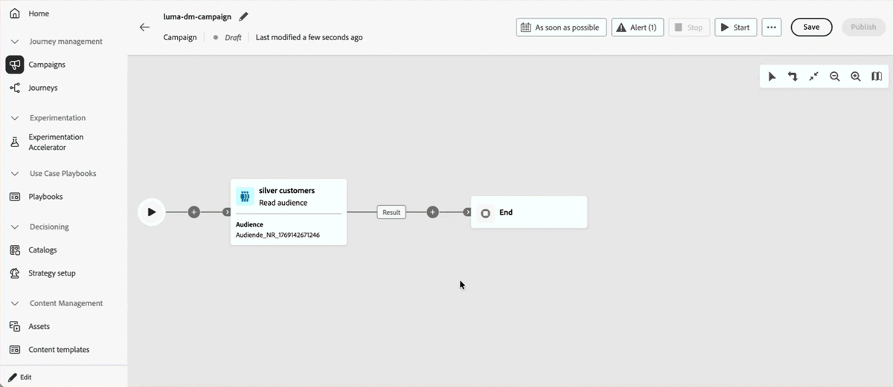
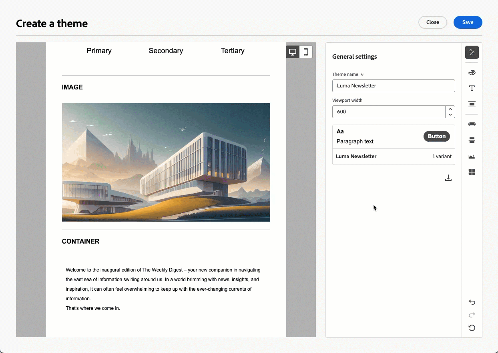
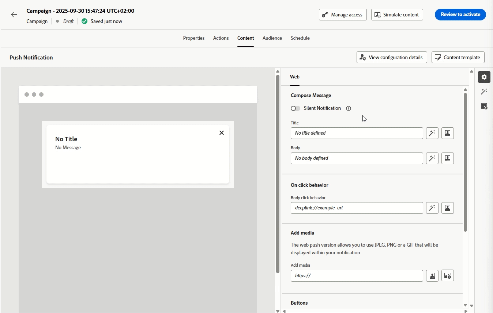

# 發行說明 {#release-notes}

>[!CONTEXTUALHELP]
>id="ajo_homepage_card1"
>title="最新資訊"
>abstract="**Adobe Journey Optimizer** 持續提供新功能、現有功能的增強功能並修正錯誤。 所有變更都會在每月最後一週整合於發行說明。"

[!DNL Adobe Journey Optimizer] 遵循持續傳遞模式，允許 Adobe 持續傳遞新功能、增強功能和修正。此方法可讓您分階段推出可擴充的功能，以確保所有環境的效能和穩定性。

基於此模型，發行說明會在每月發行之間更新。如需發行週期與可用性階段的完整詳細資訊，請參閱 [Journey Optimizer 發行週期](releases.md)。

[!DNL Adobe Journey Optimizer] 是原生建置在 [!DNL Adobe Experience Platform] 的並繼承其最新創新和改善項目。若要了解更多有關這些變更的資訊，請參閱 [Adobe Experience Platform 發行說明](https://experienceleague.adobe.com/docs/experience-platform/release-notes/latest.html?lang=zh-Hant){target="_blank"}。

## 2026年2月更新 {#feb-26-updates}

### 新功能 {#feb-26-01-updates-features}

<table>
<thead>
<tr>
<th><strong>內容決策活動</strong> </th>
</tr>
</thead>
<tbody>
<tr>
<td>

歷程畫布現在提供新的<strong>內容決策活動</strong>，以便將<strong>個人化產品建議</strong>直接整合至您的客戶歷程。此活動可讓您提供決策型內容，並在整個歷程中參考這些產品建議，在建立資格型分支的條件、在自訂動作中將產品建議資料傳遞至外部系統，以及在其他活動中建立完全個人化的客戶體驗。

此功能之前以「有限可用性」的名義發行，目前所有環境都適用 (一般可用性)。

如需詳細資訊，請參閱<a href="../building-journeys/content-decision.md">詳細文件</a>。

推出日期： 2026年2月11日

</td>
</tr>
</tbody>
</table>

<table>
<thead>
<tr>
<th><strong>自助移轉工具 API</strong> </th>
</tr>
</thead>
<tbody>
<tr>
<td>

<strong>移轉工具 API</strong> 現在可用於以程式設計方式將決策管理實體移轉到決策，包括：

<ul>
<li>彈性的移轉範圍 (沙箱、產品建議或決策層級)</li>
<li>自動化相依性分析和驗證</li>
<li>已完成移轉的復原支援</li>
<li>包含物件對應的詳細移轉報表</li>
</ul>

如需詳細資訊，請參閱<a href="../experience-decisioning/decisioning-migration-api.md">詳細文件</a>。

推出日期：2026 年 2 月 3 日

</td>
</tr>
</tbody>
</table>

<table>
<thead>
<tr>
<th><strong>自訂動作監視</strong> </th>
</tr>
</thead>
<tbody>
<tr>
<td>

透過新的監視儀表板和豐富的歷程步驟事件資料，更深入瞭解<strong>自訂動作端點</strong>的健康情況和績效。追蹤成功的呼叫、錯誤、輸送量、回應時間和佇列等待時間，以快速瞭解異常情況發生的時間、地點和原因。

此功能之前以「有限可用性」的名義發行，目前所有環境都適用 (一般可用性)。

如需詳細資訊，請參閱<a href="../action/reporting.md">詳細文件</a>。

推出日期：2026 年 2 月 3 日

</td>
</tr>
</tbody>
</table>

<table>
<thead>
<tr>
<th><strong>簡訊頻道中的決策支援</strong> </th>
</tr>
</thead>
<tbody>
<tr>
<td>

您現在可以使用<strong>決策</strong>個人化和最佳化<strong>簡訊訊息</strong>的內容。 使用優先順序分數、公式或 AI 模型，向客戶顯示最佳內容。

如需詳細資訊，請參閱<a href="../experience-decisioning/create-decision.md">詳細文件</a>。

推出日期：2026 年 2 月 2 日

</td>
</tr>
</tbody>
</table>

### 改進 {#feb-26-01-updates-improv}

* **將片段附加至決策項目** - Journey Optimizer 現在提供將<strong>片段</strong>附加至<strong>決策項目</strong>的功能，而決策項目可透過決策原則用於程式碼型體驗行銷活動。先前以「有限可用性」發佈，該改進現在可供所有環境使用（一般可用性）。 [閱讀全文](../experience-decisioning/fragments-decision-policies.md)

  推出日期：2026年2月12日。

* **JSON型別運算式片段驗證** - JSON型別運算式片段現在會在儲存時進行語法驗證。 驗證錯誤會被視為警告，並在儲存後顯示為警示。 [閱讀全文](../content-management/create-fragments.md#content)

  推出日期：2026年2月12日。

* **SMS Webhook** — 所有SMS提供者現在都支援Webhook。 您可以根據每個Webhook的預期用途、入站Webhook來設定以擷取傳入訊息，以及回饋Webhook來接收傳遞回條、狀態更新和其他訊息相關事件。 [閱讀全文](../sms/sms-webhook.md)

  推出日期：2026年2月2日。

## 2026 年 1 月發行說明 {#latest-rn}

<!--**Release date**: January 27-28, 2026-->

[功能](#jan-26-01-features)和[改善](#jan-26-01-improv)區段涵蓋已提供的功能，而[即將推出](#jan-26-01-coming-soon)則列出排程在稍後日期推出的項目。

<!-- **The pre-release notes below are subject to change without prior notice until the release availability date**. Links, screens and updated documentation are published in the release notes, at the release date. 

See also [Adobe Experience Platform Pre-release notes](https://experienceleague.adobe.com/en/docs/experience-platform/release-notes/pre-release-notes){target="_blank"}.-->

### 全新功能 {#jan-26-01-features}

<table>
<thead>
<tr>
<th><strong>推播頻道中的決策支援</strong> </th>
</tr>
</thead>
<tbody>
<tr>
<td>

您現在可以使用<strong>決策</strong>個人化和最佳化<strong>推播通知</strong>的內容。 使用優先順序分數、公式或 AI 模型，向客戶顯示最佳內容。

具有推播通知的Experience Decisioning需要特定版本的Mobile SDK。 在實作此功能之前，請檢查<a href="https://developer.adobe.com/client-sdks/home/release-notes/" target="_blank">發行說明</a>以識別所需的版本，並確定您已相應地升級。 您也可以在<a href="https://developer.adobe.com/client-sdks/home/current-sdk-versions/" target="_blank">本節</a>中檢視您平台的所有可用SDK版本。

如需詳細資訊，請參閱<a href="../experience-decisioning/create-decision.md">詳細文件</a>。

推出日期：2026 年 1 月 30 日

</td>
</tr>
</tbody>
</table>

<table>
<thead>
<tr>
<th><strong>歷程中的直接郵件管道</strong> </th>
</tr>
</thead>
<tbody>
<tr>
<td>

以前僅限於行銷活動，現在歷程畫布上也提供<strong>直接郵件</strong>管道，可讓您將直接郵件整合到歷程中。直接郵件現在可同時用於<strong>批次和 1:1 歷程案例</strong>，並支援檔案擷取設定和時間頻率設定。

此功能之前以「有限可用性」的名義發行，目前所有環境都適用 (一般可用性)。

如需詳細資訊，請參閱<a href="../direct-mail/get-started-direct-mail.md">詳細文件</a>。

推出日期： 2026年1月29日

</td>
</tr>
</tbody>
</table>

<table>
<thead>
<tr>
<th><strong>勿打擾時間 (不接收訊息的時間)</strong> </th>
</tr>
</thead>
<tbody>
<tr>
<td>

<strong>勿打擾時間</strong>可讓您定義不接收電子郵件、簡訊、推播和 WhatsApp 管道訊息的時間。此功能可確保在特定時段內不會傳送任何訊息，協助您遵守客戶偏好設定和合規性要求。您可以透過<strong>規則集</strong>套用勿打擾時間，這些規則集可指派給行銷活動或歷程中的個別動作，以進行精確控制。

此功能之前以「有限可用性」的名義發行，目前所有環境都可以使用。在此「一般可用性」版本中，功能現在包括讓客戶將行銷活動動作排入佇列直到完成勿打擾時間，以及預覽啟用的勿打擾時間規則。

如需詳細資訊，請參閱<a href="../conflict-prioritization/quiet-hours.md">詳細文件</a>。

推出日期： 2026年1月29日

</td>
</tr>
</tbody>
</table>

<table>
<thead>
<tr>
<th><strong>訊息匯出</strong> </th>
</tr>
</thead>
<tbody>
<tr>
<td>

新的<strong>訊息匯出</strong>功能現在可用於電子郵件和簡訊管道。此功能可讓您將傳送的訊息內容自動匯出至專用的 Experience Platform 資料集，讓您能夠：

<ul>
<li>符合法規合規性要求 (例如 HIPAA)</li>
<li>封存法律索償和客戶服務查詢的訊息</li>
<li>保留傳送給個人的個人化內容複本</li>
</ul>

從擷取之日起，記錄會在 AJO 訊息匯出資料集中保留 7 天。在此保留期間，您可以透過Experience Platform目標將其匯出至您自己的儲存空間。 此功能已在管道設定層級啟用，可讓您對要匯出的訊息進行<strong>精細控制</strong>。

此功能僅適用於電子郵件和簡訊管道，以及已購買訊息匯出附加產品的組織。如需詳細資訊，請聯絡您的 Adobe 代表。

如需詳細資訊，請參閱<a href="../configuration/message-export.md#message-export">詳細文件</a>。

推出日期：2026 年 1 月 28 日

</td>
</tr>
</tbody>
</table>

<table>
<thead>
<tr>
<th><strong>協調行銷活動中的直接郵件管道</strong> </th>
</tr>
</thead>
<tbody>
<tr>
<td>

協調行銷活動現在提供直接郵件管道。<strong>直接郵件活動</strong>讓您在協調的行銷活動中傳送直接郵件更加方便，單次訊息和定期訊息皆適用。此類活動可用於將直接郵件提供者所需之<strong>摘取檔案</strong>產生流程自動化。您可以將管道活動與協調行銷活動畫布結合，建立可根據客戶行為和資料觸發動作的跨管道行銷活動。

如需詳細資訊，請參閱<a href="../orchestrated/activities/channels.md#channel">詳細文件</a>。

推出日期：2026 年 1 月 28 日

</td>
</tr>
</tbody>
</table>

<table>
<thead>
<tr>
<th><strong>Journey 代理 - 建立歷程</strong> </th>
</tr>
</thead>
<tbody>
<tr>
<td>

Journey 代理現在提供建立功能，可讓 Journey Optimizer 使用者透過<strong>自然語言介面</strong>建立及設定行銷歷程。透過這些新的技能，從業人員只需在<strong>對話提示</strong>中描述他們的需求，即可快速建立歷程。這項創新簡化了歷程建立流程，讓行銷人員能夠專注於策略而非技術設定。

如需詳細資訊，請參閱<a href="../start/ai-features.md#journey-agent">詳細文件</a>。

推出日期：2026 年 1 月 12 日

</td>
</tr>
</tbody>
</table>

<table>
<thead>
<tr>
<th><strong>動作行銷活動擷取 API</strong> </th>
</tr>
</thead>
<tbody>
<tr>
<td>

現已提供新的 Journey Optimizer API，可讓您以程式設計方式擷取及檢查<strong>行銷活動相關資料</strong>，例如詳細資訊、版本和設定。

如需詳細資訊，請參閱<a href="https://developer.adobe.com/journey-optimizer-apis/references/campaigns-retrieve/" target="_blank">詳細文件</a>。

推出日期：2025 年 11 月 24 日

</td>
</tr>
</tbody>
</table>

<table>
<thead>
<tr>
<th><strong>電子郵件設計工具主題</strong> </th>
</tr>
</thead>
<tbody>
<tr>
<td>

目前您可以快速套用<strong>事先核准的主題</strong>，以便確保所有電子郵件的<strong>品牌都有保持一致性</strong>，加快行銷活動的建立流程，個別製作高品質的電子郵件，同時減少對設計團隊的依賴。

此功能先前以 Beta 版發行，現在可供部分組織使用 (有限可用性)。若想取得存取權，請聯絡您的 Adobe 代表。

如需詳細資訊，請參閱<a href="../email/apply-email-themes.md">詳細文件</a>。

推出日期：2025 年 11 月 5 日

</td>
</tr>
</tbody>
</table>

### 改善 {#jan-26-01-improv}

#### AI

* **AI 助理內容品質檢查** - 除了品牌一致性之外，您現在還可以評估整體的<strong>內容品質</strong>，以找出潛在的<strong>可讀性</strong>、一致性和效能問題，不受品牌准則影響。這些自動化檢查有助於識別不清楚的訊息、不一致的語調或結構性缺口。[閱讀全文](../content-management/brands-score.md#validate-quality)。

  [在影片中探索此功能](https://video.tv.adobe.com/v/3470544/?learn=on)。

#### 歷程

* **結合原生和 Adobe Campaign 訊息動作** - Journey Optimizer 現在可讓您在同一歷程中結合 <strong>Adobe Campaign v7/v8</strong> 訊息動作和<strong>原生管道動作</strong>。[閱讀全文](../building-journeys/using-adobe-campaign-v7-v8.md)

  推出日期：2026年1月27日。

* **自訂動作錯誤回應承載** - 您現在可以為自訂動作定義選用的<strong>錯誤回應承載</strong>。呼叫失敗時，歷程內容會公開錯誤承載 (在動作的 errorResponse 節點下)，並可`jo_status_code`一併在<strong>逾時/錯誤分支</strong>中提供，以支援更豐富的遞補邏輯和偵錯。[閱讀全文](../action/about-custom-action-configuration.md#define-the-message-parameters)

  推出日期：2026年1月27日。

* **歷程中的歷程承載大小驗證** - Journey Optimizer 現在會驗證<strong>承載大小</strong>，以協助確保最佳績效和系統穩定性。當建立或發佈歷程時，如果承載大小接近或超過建議的限制，您會收到明確的<strong>警告和錯誤</strong>，並提供可操作的指引，以最佳化您的歷程設定。此主動式驗證可幫助您儘早識別潛在問題並維護歷程績效。[閱讀全文](../start/guardrails.md#journey-payload-size)

  推出日期：2026年1月27日。

* **歷程警示** - 新的<strong>預先設定警示</strong>可供歷程使用。
   * <strong>超過輪廓捨棄率</strong>：過去 5 分鐘超過臨界值的輪廓捨棄與輸入輪廓的比率
   * <strong>超過自訂動作錯誤率</strong>：過去 5 分鐘超出臨界值的自訂動作錯誤與成功 HTTP 呼叫的比率
   * <strong>超過輪廓錯誤率</strong>：過去 5 分鐘超過臨界值的輪廓出錯與輸入輪廓的比率

  如需詳細資訊，請參閱[詳細文件](../reports/alerts.md)。

  推出日期：2025 年 10 月 14 日。

#### 協調的行銷活動

* **客群的資料使用標籤繼承** - 現在，在協調的行銷活動中儲存<strong>客群</strong>時，Adobe Experience Platform 中套用的標籤會自動延續，減少手動 <strong>DULE 標記</strong>。[閱讀全文](../orchestrated/activities/save-audience.md)

* **含參數的預先定義篩選器** - 您現在可以在協調的行銷活動中建立含<strong>參數</strong>的<strong>預先定義篩選器</strong>，以取得可重複使用、可編輯的規則。[閱讀全文](../orchestrated/predefined-filters.md)

* **選取屬性並複製分佈值** - 您現在可以直接從協調行銷活動的<strong>值分佈</strong>檢視中<strong>選取或複製值</strong>。[閱讀全文](../orchestrated/build-query.md)

* **傳送前的訊息確認** - 現在預設會在傳送協調的行銷活動前啟用<strong>確認步驟</strong>，以減少意外傳送。[閱讀全文](../orchestrated/activities/channels.md#confirm-message-sending)

* **預先定義的重定向篩選器** - 為了支援更輕鬆地針對協調的行銷活動使用案例進行重定向，此版本引進了新的<strong>行銷活動意見回饋篩選器</strong>。這些篩選器可讓您根據<strong>訊息參與</strong> (例如已傳送、僅開啟、已開啟或已按一下，或已開啟和已按一下) 直接鎖定客群，並選取您要重定向的特定行銷活動或轉換中行銷活動。[閱讀全文](../orchestrated/retarget.md)

* **速率控制支援** - 協調的行銷活動現在支援<strong>速率控制</strong>，協助您加速傳遞並符合<strong>數量限制</strong>。[閱讀全文](../orchestrated/activities/channels.md#rate-control)

* **重新啟動按鈕** - 協調的行銷活動現在包含<strong>重新啟動按鈕</strong>，因此您可以在發佈行銷活動之前，視需要快速<strong>重新啟動執行</strong>。[閱讀全文](../orchestrated/start-monitor-campaigns.md)

* **使用者產生的中繼資料支援** - <strong>executionMetadata 協助程式函式</strong>現在可在協調行銷活動的個人化編輯器中使用，可讓您將內容相關資訊附加至任何原生動作，並將其儲存在資料集中，以匯出至外部系統。[閱讀全文](../personalization/functions/helpers.md#execution-metadata)

  推出日期：2026年1月27日。

* **將即時行銷活動還原為草稿狀態** — 您現在可以在行銷活動發生執行錯誤或您需要修改排程的行銷活動才能開始執行時，將即時協調的行銷活動還原為草稿狀態。 在傳送第一則訊息之前，此選項均可用。 [閱讀全文](../orchestrated/start-monitor-campaigns.md#back-to-draft)

#### 行銷活動

* **使用設定檔時區排程行銷活動** — 行銷活動排程現在可以使用每個設定檔的<strong>時區</strong>，在預期的當地時間傳送訊息。 [閱讀全文](../campaigns/campaign-schedule.md)

  **注意**：這項改善僅適用於一組組織（可用性限制）。

  推出日期：2026年1月27日。

#### 權限

* **防止自我核准歷程與行銷活動** - 新增建立或設定<strong>核准原則</strong>時的選項，以防止歷程或行銷活動建立者<strong>核准自己的物件</strong>。[閱讀全文](../test-approve/approval-policies.md)

  推出日期：2026年1月27日。

<!--
## Coming soon {#jan-26-01-coming-soon}

In the next few days, the following capabilities and enhancements are scheduled for release. **Information is subject to change**. Updated links, screens, and documentation will be shared once these updates are live in production.

### Features

<table>
<thead>
<tr>
<th><strong>Web Push notifications channel</strong> </th>
</tr>
</thead>
<tbody>
<tr>
<td>

Adobe Journey Optimizer now supports <strong>Web Push notifications</strong>, expanding the push channel beyond mobile. You can seamlessly deliver notifications to both <strong>mobile and desktop browsers</strong>, enabling you to reach customers directly on their devices without requiring an app. This enhancement allows you to engage users with timely, personalized messages in real time, leveraging the same authoring workflows and targeting capabilities already available for mobile push.

Previously released in Beta, this capability will be available to all environments (General Availability).

Availability date: February 11, 2026

</td>
</tr>
</tbody>
</table>

### Improvements

-->