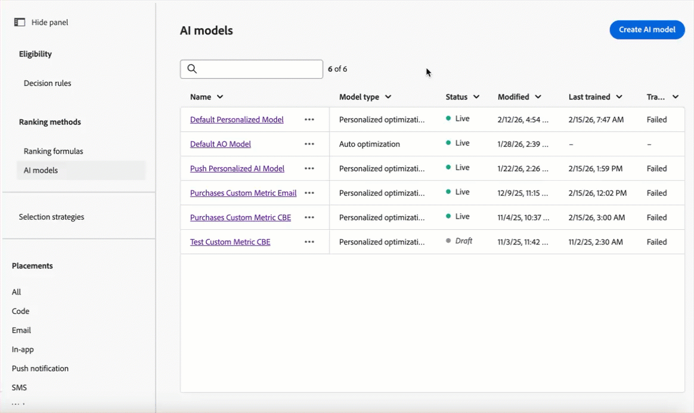

# 發行說明 {#release-notes}

>[!CONTEXTUALHELP]
>id="ajo_homepage_card1"
>title="最新資訊"
>abstract="**Adobe Journey Optimizer**&#x200B;持續提供新功能、現有功能的增強功能，以及錯誤修正。 所有變更都會在每月最後一週整合於發行說明。"

[!DNL Adobe Journey Optimizer]遵循持續傳遞模式，允許Adobe持續提供新功能、增強功能和修正。 此方法可讓您分階段推出可擴充的功能，以確保所有環境的效能和穩定性。

基於此模型，發行說明會在每月發行之間更新。如需發行週期與可用性階段的完整詳細資訊，請參閱 [Journey Optimizer 發行週期](releases.md)。

[!DNL Adobe Journey Optimizer] 是原生建置在 [!DNL Adobe Experience Platform] 的並繼承其最新創新和改善項目。若要了解更多有關這些變更的資訊，請參閱 [Adobe Experience Platform 發行說明](https://experienceleague.adobe.com/docs/experience-platform/release-notes/latest.html?lang=zh-Hant){target="_blank"}。

## 2026年3月發行說明 {#march-26-rn}

[新功能](#march-26-features)和[改進](#march-26-improv)區段已涵蓋可用的功能。 [即將推出](#coming-soon)區段列出排定於3月稍後發行的功能和改善。

<!--
**The pre-release notes below are subject to change without prior notice until the release availability date**. Links, screens and updated documentation are published in the release notes, at the release date.

See also [Adobe Experience Platform pre-release notes](https://experienceleague.adobe.com/zh-hant/docs/experience-platform/release-notes/pre-release-notes){target="_blank"}.-->

**發行日期**：2026 年 3 月 24-25 日

### 新功能 {#march-26-features}

<table>
<thead>
<tr>
<th><strong>登陸頁面自訂表單</strong> </th>
</tr>
</thead>
<tbody>
<tr>
<td>

透過[!DNL Journey Optimizer]，您可以透過登入頁面擷取設定檔屬性。

根據特定資料集，建立、設計和管理為您的需求量身打造的自訂表單。 然後，您可以在登陸頁面中善用自訂表單，將選擇的設定檔屬性新增至為每個表單定義的資料集。

此功能先前以「有限可用性」發佈，以供美國和澳洲的客戶使用，而現在則可用於所有環境（一般可用性）。

如需詳細資訊，請參閱<a href="../landing-pages/lp-forms.md">詳細說明文件</a>。

推出日期：2026年3月26日。

</td>
</tr>
</tbody>
</table>

<table>
<thead>
<tr>
<th><strong>在協調的行銷活動中測試活動</strong> </th>
</tr>
</thead>
<tbody>
<tr>
<td>

新的<strong>測試</strong>活動現在可在協調的行銷活動中使用。 此活動會根據定義的條件，將工作流程執行路由至不同的分支，讓您在啟用即時傳遞之前，先驗證行銷活動邏輯和設定。

如需詳細資訊，請參閱<a href="../orchestrated/activities/test.md">詳細說明文件</a>。

</td>
</tr>
</tbody>
</table>

<table>
<thead>
<tr>
<th><strong>歷程中的資料集查詢支援</strong> </th>
</tr>
</thead>
<tbody>
<tr>
<td>

歷程中的新<strong>資料集查詢</strong>活動可讓您在執行階段動態擷取Adobe Experience Platform記錄資料集的資料，讓您存取不屬於設定檔或事件裝載的資訊，讓客戶互動保持相關且即時。

此功能之前以「有限可用性」的名義發行，目前所有環境都適用 (一般可用性)。 

如需詳細資訊，請參閱<a href="../building-journeys/dataset-lookup.md">詳細文件</a>。

</td>
</tr>
</tbody>
</table>

<table>
<thead>
<tr>
<th><strong>原生管道動作活動已棄用</strong> </th>
</tr>
</thead>
<tbody>
<tr>
<td>

在2026年2月<strong>動作活動</strong>正式發行後，歷程畫布中的舊版原生頻道活動（電子郵件、推播、簡訊、應用程式內、網頁、程式碼型體驗和內容卡）現已棄用。

您現在使用單一<strong>動作活動</strong>來設定所有通道動作，取代個別通道特定節點的需求。
使用舊版管道活動的現有歷程將繼續正常運作，不會進行任何變更或需要進行移轉。

如需詳細資訊，請參閱<a href="../building-journeys/journey-action.md">詳細說明文件</a>。

</td>
</tr>
</tbody>
</table>

<!--<table>
<thead>
<tr>
<th><strong>Decisioning support in email channel</strong> </th>
</tr>
</thead>
<tbody>
<tr>
<td>

You can now use <strong>Decisioning</strong> to personalize and optimize the content of your email messages. Leverage Priority Scores, Formulas, or AI Models to display the most relevant offers and content to each recipient.

Previously released in Limited Availability, this capability is now available to all environments (General Availability). With this General Availability release, mirror pages are now supported.

For more information, refer to the <a href="../experience-decisioning/create-decision-policy.md">detailed documentation</a>.

</td>
</tr>
</tbody>
</table>-->

<table>
<thead>
<tr>
<th><strong>電子郵件範本的高階HTML編輯器</strong> </th>
</tr>
</thead>
<tbody>
<tr>
<td>

電子郵件內容範本的進階HTML模式可讓您在電子郵件Designer中編輯內容的HTML來源、在來源中新增進階運算式（例如條件），以及在HTML檢視和案頭檢視之間切換，而不會遺失您的變更。

此功能僅適用於電子郵件通道的內容範本。 目前處於「有限可用性」 — 請聯絡您的Adobe代表以取得存取權。

如需詳細資訊，請參閱<a href="../content-management/email-template-expert-mode.md">詳細說明文件</a>。

推出日期： 2026年3月10日

</td>
</tr>
</tbody>
</table>

<table>
<thead>
<tr>
<th><strong>整合自訂Firefly模型與協力廠商影像產生模型</strong> </th>
</tr>
</thead>
<tbody>
<tr>
<td>

可緊密整合標準與自訂Firefly模型，以及經核准的協力廠商影像模型，以便在產生影像時提供更大的彈性、控制力及品牌一致性。

選擇符合您需求的正確模式：

<ul><li> <strong>Adobe模型</strong> （由Firefly Image Model 4提供技術支援）可立即產生影像，無需額外設定</li><li> <strong>合作夥伴機型</strong> （由Gemini 2.5 Flash提供），提供專門的功能</li><li><strong>自訂模型</strong> （在您自己的資產上訓練的品牌特定模型），用於品牌上產生，完全符合您的品牌識別、風格和視覺准則。</li></ul>

如需詳細資訊，請參閱<a href="../content-management/generative-models.md">詳細說明文件</a>。

推出日期： 2026年3月2日

</td>
</tr>
</tbody>
</table>

<table>
<thead>
<tr>
<th><strong>iOS的已上線活動</strong> </th>
</tr>
</thead>
<tbody>
<tr>
<td>

透過Adobe Journey Optimizer中的<strong>iOS上線活動</strong>，直接將即時體驗帶入客戶的Lock Screens和Dynamic Island。 提供即時更新，從訂單追蹤和航班狀態到事件倒計時、即時分數和傳送進度，而不需要使用者開啟您的應用程式。 讓您的對象保持知情並在正確的時間參與，就在他們所在的位置。

此功能先前以Beta版發佈，現已開放所有環境使用（全面發佈）。

如需詳細資訊，請參閱<a href="../mobile-live/get-started-mobile-live.md">詳細說明文件</a>。

推出日期： 2026年3月3日

</td>
</tr>
</tbody>
</table>

<table>
<thead>
<tr>
<th><strong>Journey Agent：頻道內容建立</strong> </th>
</tr>
</thead>
<tbody>
<tr>
<td>

由<strong>Adobe Experience Platform Agent Orchestrator</strong>提供技術支援的<strong>Journey Agent</strong>可在Journey Optimizer中使用，並可讓您透過自然語言介面分析歷程。 您現在也可以直接在Journey Agent中產生和管理頻道特定內容、建立電子郵件和推播之類的頻道內容、套用和預覽範本、透過提示調整色調和風格，以及在<strong>內容Designer</strong>中開啟內容以進行內容內編輯。

此功能僅適用於一組組織 (可用性限制)。 若想取得存取權，請聯絡您的 Adobe 代表。

如需詳細資訊，請參閱<a href="https://experienceleague.adobe.com/docs/experience-cloud-ai/experience-cloud-ai/agents/ajo-agent.html?lang=zh-Hant" target="_blank">詳細說明文件</a>。

推出日期： 2026年3月4日

</td>
</tr>
</tbody>
</table>

<table>
<thead>
<tr>
<th><strong>AI模型監視</strong> </th>
</tr>
</thead>
<tbody>
<tr>
<td>

Journey Optimizer現在可讓您監視決策AI模型的健全狀態、培訓狀態和效能。 這可讓您驗證培訓成功、疑難排解失敗，並瞭解對您結果的影響，以便使用AI為每個客戶選取最佳選件。 請注意，此功能僅適用於<strong>決策</strong> （不適用於舊版決策管理模型）。

此功能目前僅適用於<strong>個人化最佳化</strong>模型（非自動最佳化）。

如需詳細資訊，請參閱<a href="../experience-decisioning/ranking/ai-model-observability.md">詳細說明文件</a>。

推出日期： 2026年3月9日

</td>
</tr>
</tbody>
</table>

### 改善 {#march-26-improv}

以下列舉部分發布內容附上的改良功能。

<!--
#### Reporting

* **Send-Time Optimization: updated controls location and new lift report** - Send-Time Optimization (STO) controls have been relocated to the Action configuration menu. Additionally, a new lift report is now available in Journeys reports to measure the impact of STO on your campaign performance metrics.

* **Exclude bot clicks for email and SMS reporting** - Email and SMS reporting now automatically filters out bot clicks from click metrics, providing more accurate engagement data and preventing automated traffic from inflating your performance figures.

#### Email Designer

* **Email Designer displayed in Unified Shell** - The Email Designer is now displayed within the Unified Shell experience, providing a consistent navigation and header experience that aligns with other Adobe applications.

* **Text mode support in fragments** - To support text-based email workflows, you can now create and manage text versions of your visual fragments for optimal use in the plain text version of emails that include that fragment.

  **Caution:** When using a fragment that was created before the current release, the fragment text version may be incorrectly rendered—both in the Email Designer and in the final email delivered to your recipients. For best results with older fragments, edit, save and republish each fragment.-->
<!--
#### Decisioning

* **Optional fragments in decision items** - When using fragments in decision items, you can now make a fragment optional so that if it is temporarily unavailable on Edge, it is skipped and the journey or campaign continues rendering instead of failing.
-->

#### 設定

<!--* **Folders for journeys and campaigns** - You can now organize your journeys and campaigns into folders, enabling structured navigation and easier management for teams working with large volumes of content. This capability is only available for a set of organizations (Limited Availability). To gain access, contact your Adobe representative.-->

* **AJO次要收件者意見反應事件資料集重新命名** - `AJO Email BCC Feedback Event`資料集已重新命名為`AJO Secondary Recipient Feedback Event`資料集。 其影響會依您的情況而有所不同：

   * **現有使用者**：只更新顯示名稱。 基礎資料表名稱保持不變。
   * **新使用者和沙箱**：顯示名稱和表格名稱都會反映新名稱。
   * **具有新沙箱的現有使用者**：顯示名稱和表格名稱都會更新為新名稱。

  推出日期： 2026年3月2日

#### 歷程

* **更新設定檔動作：支援多個設定檔屬性** - **更新設定檔**&#x200B;動作活動現在支援在單一節點中最多更新五個設定檔屬性。 以前，每個動作一次只能更新一個屬性，而需要多個節點更新多個屬性。 使用新的&#x200B;**更新其他欄位**&#x200B;按鈕來新增其他欄位/值組，減少畫布複雜性並改善效能。 [了解更多](../building-journeys/update-profiles.md)

* **在歷程中傳送傳出訊息的波次** — 您現在可以排程來自Journey Optimizer歷程的訊息，以控管批次方式傳送一段期間。 [了解更多](../building-journeys/send-using-waves.md)

  此功能先前以「有限可用性」發佈，以供歷程使用，現在則可用於所有環境（一般可用性）。

  推出日期： 2026年3月16日

* **歷程技術詳細資料中的暫停和繼續詳細資訊** — 歷程&#x200B;**技術詳細資訊**&#x200B;現在包含額外的暫停和繼續資訊：上次暫停和繼續的日期和時間、執行每個動作之使用者的顯示名稱和內部識別碼，以及整套暫停的歷程設定，例如暫停行為、最長暫停期間和自動繼續狀態。 [了解更多](../building-journeys/journey-properties.md)

  推出日期： 2026年3月2日

## 即將推出 {#coming-soon}

以下的功能和改進計畫於3月下旬/4月初發行。 發行日期和範圍有&#x200B;**可能會變更，恕不另行通知**。

### 功能

<table>
<thead>
<tr>
<th><strong>將影像轉換為電子郵件內容範本</strong> </th>
</tr>
</thead>
<tbody>
<tr>
<td>

您現在可以直接在Journey Optimizer中將影像轉換為電子郵件內容範本。 使用AI支援的分析，從視覺參考自動產生結構化HTML範本，大幅縮短電子郵件設計時間。

先前以「有限可用性」發行，現在此功能可用於所有環境（一般可用性）。 <a href="../content-management/image-to-html.md">了解更多</a>

推出日期： 2026年3月26日

</td>
</tr>
</tbody>
</table>

<table>
<thead>
<tr>
<th><strong>協調行銷活動中的交易式類別</strong> </th>
</tr>
</thead>
<tbody>
<tr>
<td>

在協調的行銷活動中，您現在可以將管道活動設定為<strong>異動</strong>類別。 這會將異動管道設定套用至該活動，並在業務規則不應套用或客戶不需要選擇加入時很有用。

推出日期： 2026年3月26日 — 此功能將在未來幾天內逐步向所有區域推出。

</td>
</tr>
</tbody>
</table>

<table>
<thead>
<tr>
<th><strong>URL引數加密</strong> </th>
</tr>
</thead>
<tbody>
<tr>
<td>

追蹤連結和登入頁面中的URL引數現在可以加密，為敏感引數資料提供額外的安全層。

<ul>
<li>在專用的<strong>管理</strong>登入中登入及管理加密金鑰。</li>
<li>使用運算式中新的加密協助程式，針對您要在轉譯時保護的查詢引數，加密追蹤連結和登陸頁面URL中的敏感資料。</li>
</ul>

此功能僅適用於一組組織 (可用性限制)。 若想取得存取權，請聯絡您的 Adobe 代表。

推出日期： 2026年3月31日

</td>
</tr>
</tbody>
</table>

<table>
<thead>
<tr>
<th><strong>收件匣</strong> </th>
</tr>
</thead>
<tbody>
<tr>
<td>

<strong>收件匣</strong>是一項行動功能，可搭配內容卡使用，讓客戶在應用程式或網站中建立集中式位置，以顯示傳送給使用者的訊息。 這可延長行銷通訊的存留期，確保即使在訊息關閉後，仍可存取訊息。

推出日期： 2026年3月31日

</td>
</tr>
</tbody>
</table>

<table>
<thead>
<tr>
<th><strong>使用訊號觸發協調的行銷活動</strong> </th>
</tr>
</thead>
<tbody>
<tr>
<td>

現在可以透過<strong>API訊號</strong>觸發協調的行銷活動。 若要進行此設定，請將目標行銷活動設定為<strong>由訊號</strong>觸發，發佈，然後使用API呼叫引發它。 API呼叫中包含的任何引數都可在執行的行銷活動中作為變數使用。 請注意，訊號觸發的協調行銷活動仍為<strong>批次</strong>行銷活動，與API觸發的行銷活動不同。

推出日期： 2026年4月1日

</td>
</tr>
</tbody>
</table>

<table>
<thead>
<tr>
<th><strong>歷程路徑最佳化</strong> </th>
</tr>
</thead>
<tbody>
<tr>
<td>

使用新的「最佳化」節點來鎖定特定對象，或執行A/B測試，以決定符合以業務為中心的KPI的最佳途徑。
此工具可讓您測試並變更內容，以及自訂通訊、排序和時機，以便最有效地觸及客戶。

先前以「有限可用性」發行，現在此功能可用於所有環境（一般可用性）。 <a href="../building-journeys/optimize.md">了解更多</a>

推出日期： 2026年4月3日

</td>
</tr>
</tbody>
</table>

<!--WAITING RELEASE DATE CONFIRMATION * **Target dimension simplification in Orchestrated Campaigns** - The active targeting dimension is now shown on the workflow canvas, so you can see which dimension is used by a channel activity. The multi-entity segmentation flow is simpler as you no longer need a separate "Change dimension" activity. Moreover, you can now choose explicitly whether messages are sent at the profile level or at a secondary dimension level.-->
