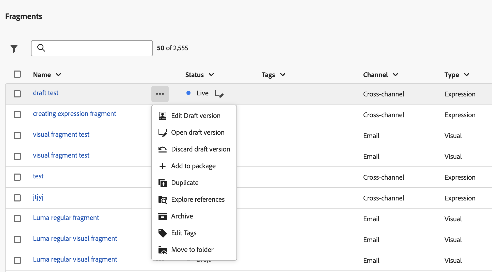

# 發行說明 {#release-notes}

>[!CONTEXTUALHELP]
>id="ajo_homepage_card1"
>title="最新資訊"
>abstract="**Adobe Journey Optimizer** 持續提供新功能、現有功能的增強功能，並修正錯誤。 所有變更都會在每月最後一週整合於發行說明。"

[!DNL Adobe Journey Optimizer] 遵循持續傳遞模式，允許 Adobe 持續傳遞新功能、增強功能和修正。 此方法可讓您分階段推出可擴充的功能，以確保所有環境的效能和穩定性。 基於此模型，發行說明會在每月發行之間更新。 如需發行週期與可用性階段的完整詳細資訊，請參閱 [Journey Optimizer 發行週期](releases.md)。

[!DNL Adobe Journey Optimizer] 是原生建置在 [!DNL Adobe Experience Platform] 的並繼承其最新創新和改善項目。 若要了解更多有關這些變更的資訊，請參閱 [Adobe Experience Platform 發行說明](https://experienceleague.adobe.com/docs/experience-platform/release-notes/latest.html?lang=zh-Hant){target="_blank"}。

>[!NOTE]
>
>這些發行說明中列出的功能包括&#x200B;**可用日期**，指出每個變更在您的環境中可用的時間。 **即將推出**&#x200B;摺疊式版面中的項目預計將在未來幾天或幾週內推出。 這些部分的資訊可能會有變更。

## 2026年7月更新 {#july-26-updates}

### 全新功能 {#july-26-new-capabilities}

<table>
<thead>
<tr>
<th><strong>電子郵件設計工具中的內容檢查功能</strong> </th>
</tr>
</thead>
<tbody>
<tr>
<td>

Journey Optimizer 現在包含直接在電子郵件設計工具中的自動化技術驗證，可幫助您在傳送前捕捉 HTML 和 CSS 問題。

檢查涵蓋不支援的元素，例如 <code>&lt;script&gt;</code> 和 <code>&lt;base&gt;</code> 標籤、可能中斷 Microsoft Outlook 版面的空白 div、HTML 中繼重新整理標籤，以及觸發 Gmail 轉譯失敗的 CSS 或 HTML 大小臨界值。

結果會直接在製作面板中顯示為錯誤、警告或資訊性通知，其中包含內容詳細資訊和適用的一鍵式修正，因此無需離開編輯器即可解決問題。

此功能之前以「有限可用性」的名義提供，現在可供所有客戶使用。

如需詳細資訊，請參閱<a href="../email/content-check.md">詳細文件</a>。

推出日期： 2026年7月16日

</td>
</tr>
</tbody>
</table>

<table>
<thead>
<tr>
<th><strong>協調行銷活動中的檔案型目標定位</strong> </th>
</tr>
</thead>
<tbody>
<tr>
<td>

協調的行銷活動現在支援直接將<strong>CSV或TXT檔案</strong>載入行銷活動畫布，作為目標對象，而不先將檔案擷取到Adobe Experience Platform。 檔案資料會在執行時使用，不會儲存為Adobe Experience Platform資料集。 在檔案設定期間，您可以定義欄對應、資料型別、NULL處理和每欄錯誤原則。 未通過驗證的列會在行銷活動執行前遭到拒絕並記錄，讓對象保持乾淨，無需手動預先處理。 這尤其適合在無法建立完整擷取管道的臨時傳送或合作夥伴清單行銷活動。

如需詳細資訊，請參閱<a href="../orchestrated/activities/load-file.md">詳細文件</a>。

 推出日期：2026年7月6日

</td>
</tr>
</tbody>
</table>

### 功能改進 {#july-26-improvements}

* **AJO MCP伺服器新工具** - [!DNL Adobe Journey Optimizer] MCP伺服器現在會公開五個額外的唯讀&#x200B;**通道設定工具**，讓您能夠直接從AI助理查詢通道設定、支援資源和行銷動作。 您現在可以使用&#x200B;**列出頻道設定** （橫跨所有AJO頻道）、**取得頻道設定**、**列出設定資源**、**取得設定資源**&#x200B;以及&#x200B;**列出行銷動作**。 [閱讀更多](../integrations/ajo-mcp.md#mcp-tools)

  推出日期： 2026年7月9日

### 可用性改進功能 {#july-26-usability}

以下可用性改良已於2026年7月發行。

#### 內容管理

* **片段詳細目錄中的快速啟動捷徑** — 您現在可以使用&#x200B;**[!UICONTROL 更多動作]**&#x200B;按鈕，從片段清單中快速存取常見動作。 可用的捷徑包括編輯片段、開啟其詳細資訊以及捨棄草稿版本。 [了解更多](../content-management/manage-fragments.md#quick-launch-fragments)

  

* **範本詳細目錄中的快速啟動捷徑** — 「內容範本」清單中的&#x200B;**[!UICONTROL 更多動作]**&#x200B;按鈕現在提供對常見動作的快速存取：編輯範本詳細資料、模擬內容以及刪除範本。 對於電子郵件範本，其他捷徑可讓您編輯主旨行和電子郵件內文、檢視或傳送校樣、執行垃圾郵件報告，以及呈現電子郵件。 [了解更多](../content-management/access-content-templates.md#quick-launch-templates)

  

#### 歷程

已針對歷程畫布引入&#x200B;**新使用者介面**，為大型歷程提供更優異的效能、可更好閱讀的自動版面配置，以及引導式撰寫體驗。

若要切換到新的UI，請按一下&#x200B;**[!UICONTROL 新增體驗]**&#x200B;按鈕。 此設定會儲存在歷程層級，因此預設會在新體驗中重新開啟歷程。 若要還原，請按一下&#x200B;**[!UICONTROL 舊體驗]**。 [了解更多](../building-journeys/using-the-journey-designer.md#canvas-capabilities)

{width="50%" align="center" zoomable="yes"}

## 2026年6月發行說明 {#june-26-rn}

### 歷程 {#june-26-journeys}

下列功能和改進功能已新增到此版本的歷程。 預計未來幾天或幾週也會有其他變更。

<table>
<thead>
<tr>
<th><strong>歷程模擬 (一般可用性)</strong> </th>
</tr>
</thead>
<tbody>
<tr>
<td>

您現在可以將歷程設定為模擬。 此模式可讓您使用模擬的使用者來驗證您的邏輯。 這些是專為模擬建立的臨時輪廓，可讓您自由測試，而無需在 Adobe Experience Platform 中管理持續的測試輪廓。 

歷程模擬之前以「有限可用性」的名義發行，目前所有環境都可以使用。 透過此一般可用性版本，您現在可以使用 Journey 代理直接在模擬選單中產生模擬使用者和事件。

如需詳細資訊，請參閱<a href="../building-journeys/simulate-journey-gs.md">詳細文件</a>。

推出日期：2026 年 6 月 9 日

</td>
</tr>
</tbody>
</table>

<table>
<thead>
<tr>
<th><strong>歷程片段 (一般可用性)</strong> </th>
</tr>
</thead>
<tbody>
<tr>
<td>

您現在可以在 Adobe Journey Optimizer 中建立<strong>歷程片段</strong>。 歷程片段是可重複使用的歷程節點集合，您可以只建立一次，然後放入沙箱的任何歷程中。 無論是適用性檢查、偏好的管道路由邏輯還是歡迎順序，片段都有助於團隊更快行動並保持一致，而不會每次都從頭開始重建相同的邏輯。

建立後，片段會儲存在專用的<strong>片段詳細目錄</strong>中，並可使用<strong>歷程片段</strong>活動將其插入任何歷程。

此功能之前以「有限可用性」的名義提供，現在可供所有客戶使用。 歷程片段也支援<strong>沙箱工具</strong>，可讓您跨沙箱封裝及匯出片段。

如需詳細資訊，請參閱<a href="../building-journeys/journey-fragments.md">詳細文件</a>。

推出日期：2026 年 6 月 9 日

</td>
</tr>
</tbody>
</table>

<table>
<thead>
<tr>
<th><strong>歷程路徑最佳化 - 目標定位 (一般可用性)</strong> </th>
</tr>
</thead>
<tbody>
<tr>
<td>

<strong>最佳化活動</strong>現在支援<strong>目標定位規則</strong>，可讓您根據客群區段或輪廓屬性，定義客戶必須滿足的特定條件，以符合特定歷程路徑的資格。

目標定位和實驗不同，在實驗中，客戶會被隨機指派到路徑，而目標定位會使用確定性邏輯，以確保將適當的客群或客戶輪廓路由到預期的路徑。

此功能之前以「有限可用性」的名義發行，目前所有環境都適用 (一般可用性)。

如需詳細資訊，請參閱<a href="../building-journeys/path-targeting.md">詳細文件</a>。

推出日期：2026 年 6 月 8 日

</td>
</tr>
</tbody>
</table>

<table>
<thead>
<tr>
<th><strong>用於歷程運算式的 AI 助理 (公開 Beta 版)</strong> </th>
</tr>
</thead>
<tbody>
<tr>
<td>

AI 助理現在會在進階的運算式編輯器中運作，將自然語言提示轉換為有效的運算式和條件式邏輯。 描述您想要建立的運算式，而 AI 助理會產生現成的程式碼，您可以立即套用或透過後續提示進行調整。

此功能以公開 Beta 版的形式提供給所有客戶。

如需詳細資訊，請參閱<a href="../building-journeys/expression/expression-agent.md">詳細文件</a>。

推出日期：2026 年 6 月 3 日
 
</td>
</tr>
</tbody>
</table>

* [!BADGE 淘汰]{type=Negative} **對象資格節點中已淘汰的批次對象** — 從&#x200B;**2026年8月**&#x200B;開始，Journey Optimizer將封鎖在&#x200B;**對象資格**&#x200B;節點中使用批次對象之任何歷程的發佈。 歷程畫布中已經出現驗證警告。 現有的即時歷程不受影響。 包含此設定的新歷程、草稿歷程和重複歷程必須在2026年8月之前更新。 在「對象資格」節點中使用串流對象，或切換至&#x200B;**讀取對象**&#x200B;活動。 [瞭解如何移轉您的歷程](../building-journeys/aq-batch-audiences-migration.md)

* **直接停止暫停的歷程** — 您現在可以直接從&#x200B;**暫停**&#x200B;狀態停止歷程。 之前，暫停的歷程必須先恢復為&#x200B;**即時**，才能停止。 [閱讀更多](../building-journeys/journey-pause.md#stop-close-paused)

  推出日期： 2026年6月18日至22日

* **外部客群的補充識別碼支援** - 歷程中的補充識別碼現在支援外部客群，包括從 CSV 檔案匯入的客群和使用聯合客群構成建立的客群。 您可以從客群中指定任何非身分屬性或非個人身分屬性作為補充識別碼，不需要結構描述標籤。 [閱讀更多](../building-journeys/supplemental-identifier.md)

  推出日期：2026 年 6 月 11 日

* **自動停止非定期讀取客群歷程** - 非定期&#x200B;**讀取客群**&#x200B;歷程現在會在最後一個作用中輪廓退出後，自動轉換成&#x200B;**已停止**&#x200B;狀態。 以往，這些歷程會維持&#x200B;**即時**&#x200B;狀態，直到 91 天全域逾時到期，即使不再有輪廓流過也會維持該狀態。 透過這項改進功能，歷程狀態會在完成時立即反映實際執行狀態，讓您無需手動介入即可保持歷程詳細目錄準確。

  請注意，此行為不適用於包含導致等待期的節點的歷程，例如等待節點、反應節點或事件觸發的轉換。 這些歷程仍受標準 91 天全域逾時的約束。 [了解更多](../building-journeys/end-journey.md#auto-stop-non-recurring)

  推出日期：2026 年 6 月 9 日

* **自訂動作中的憑證型自訂驗證** - 自訂動作現在支援憑證型自訂驗證。 將 `subType: "certificateCredential"` 新增至自訂授權設定後，Journey Optimizer 會使用 Adobe 管理的憑證來簽署 JWT 用戶端宣告，並將其交換為存取權杖，而不需要用戶端密碼。 專為執行憑證型身分驗證的企業 API (例如 Microsoft Entra ID) 而設計。 [了解更多](../datasource/external-data-sources.md#certificate-credential)

  推出日期：2026 年 6 月 4 日

* **提高即時歷程限制與新護欄** - 您現在最多可以有 **200 個作用中歷程**，比先前 100 個的限制有所增加。 [閱讀更多](../start/guardrails.md#journeys-guardrails-journeys)

  推出日期：2026年6月18日。 未來幾天，此功能將逐步推廣到所有地區。

+++ 即將推出 — **下列資訊可能會有變更。**

* **歷程標頭中的開始和結束日期** - 當即時歷程設定開始和/或結束日期時，它們現在會出現在即時狀態徽章旁邊的&#x200B;**歷程標頭**&#x200B;中。 顯示的標籤會根據每個日期是即將到來或是已過去而調整。

+++

### 協調的行銷活動 {#june-26-oc}

下列功能和改進功能將新增到此版本的協調行銷活動。

* **關聯式資料以回圈為基礎的個人化** — 個人化編輯器現在支援在關聯式集合（例如訂單、帳戶或預訂）上重複執行的Loop區塊，並在單一電子郵件或簡訊中為每個記錄呈現一個內容區塊。 集合是使用個人化權杖透過資料選擇器設定的，不需要撰寫運算式。 [閱讀更多](../orchestrated/add-personalization.md#enrichment-collections)

  推出日期： 2026年6月26日

### 決策 {#june-26-decisioning}

下列功能和改進功能已新增到此版本的決策。

<table>
<thead>
<tr>
<th><strong>直接郵件管道的決策支援</strong> </th>
</tr>
</thead>
<tbody>
<tr>
<td>

您現在可以將決定原則新增至直接郵件歷程與行銷活動。 決策原則是產品建議的容器，可運用決策引擎以動態方式傳回最佳內容給每個客群成員。 直接郵件決策也支援批次決策使用案例，讓您為特定 Adobe Experience Platform 客群中的每個輪廓匯出對應的產品建議。 

如需詳細資訊，請參閱<a href="../experience-decisioning/use-decision-policy.md">詳細文件</a>。

推出日期：2026 年 6 月 3 日

</td>
</tr>
</tbody>
</table>

* **在決定中利用Adobe Experience Manager內容片段** — 您現在可以將Adobe Experience Manager內容片段對應到決定中的決定專案，並在決定政策中利用這些內容片段，在適當的時間將適當的片段提供給適當的客戶。 此功能之前以「有限可用性」的名義發行，目前所有環境都適用 (一般可用性)。 [閱讀更多](../experience-decisioning/fragments-decision-policies.md)

  推出日期： 2026年6月18日

### 內容管理 {#june-26-content}

下列功能和改善專案已新增至此版本的內容管理。

<table>
<thead>
<tr>
<th><strong>模擬內容變化版本 — 更新的體驗和 AI 變體產生</strong> </th>
</tr>
</thead>
<tbody>
<tr>
<td>

<strong>模擬內容</strong>工作流程現在有兩個更新：

<ul>
<li><strong>新的預設路徑</strong> — 按一下<strong>模擬內容</strong>現在預設會開啟<strong>模擬內容變化版本</strong>體驗。 您可以從單一畫面手動或 CSV/JSON 檔案新增範例輸入、重複使用模擬使用者、預覽轉譯及傳送校樣。 若要使用 Adobe Experience Platform 測試輪廓預覽、傳送包含測試輪廓資料的校樣，或檢查電子郵件收件匣轉譯和垃圾郵件報告，請按一下<strong>模擬內容</strong>，然後從下拉式清單中選取<strong>模擬內容 (AEP 輪廓)</strong>。</li>
<li><strong>AI 產生的內容變體</strong> — 在<strong>模擬內容變化版本</strong>體驗中，按一下<strong>產生</strong>以使用 AI 自動建立內容變體。 系統會分析您的訊息、偵測個人化欄位和條件式分支，並填入實際值，以便您驗證轉譯，且無需手動建立每個變體。</li>
</ul>

如需詳細資訊，請參閱<a href="../test-approve/simulate-sample-input.md">詳細文件</a>。

推出日期：2026 年 6 月 9 日

</td>
</tr>
</tbody>
</table>

### 電子郵件管道 {#june-26-email}

下列改善專案已新增至此版本的電子郵件通道。

* **URL 參數加密** - 您現在可以加密追蹤中的 URL 參數，以及新增至您電子郵件訊息的登陸頁面連結。 這為敏感的參數資料提供額外的安全層。 此功能之前以「有限可用性」的名義發行，目前所有環境都適用 (一般可用性)。 [閱讀更多](../personalization/url-parameter-encryption.md)

  推出日期：2026 年 6 月 1 日

* **金鑰登錄的新權限** - 現在需要兩個新權限，才能存取和管理 URL 參數加密所需的金鑰：**管理金鑰登錄**&#x200B;和&#x200B;**檢視金鑰登錄**。 [閱讀更多](../administration/high-low-permissions.md#administration-permissions)

  推出日期：2026 年 6 月 1 日

<table>
<thead>
<tr>
<th><strong>電子郵件大小最佳化</strong> </th>
</tr>
</thead>
<tbody>
<tr>
<td>

Journey Optimizer 現在包含一個選項，可移除不必要的空格、註解和重複程式碼，進而縮小電子郵件的 HTML 大小，而不會影響電子郵件的轉譯方式。

這可避免某些電子郵件提供者用來標記或拒絕訊息的大小臨界值，且可縮短收件者的載入時間，藉此改善傳遞能力。

如需詳細資訊，請參閱<a href="../email/create-email.md#optimize-html-size">詳細文件</a>。

推出日期： 2026年6月26日

</td>
</tr>
</tbody>
</table>

<table>
<thead>
<tr>
<th><strong>片段可編輯欄位中的 RTF 文字</strong> </th>
</tr>
</thead>
<tbody>
<tr>
<td>

您現在可以將 RTF 文字新增至您電子郵件內容中所使用的可自訂片段。

例如，使用文字元件作為電子郵件設計工具中的可編輯欄位時，您可以直接格式化內容 (例如粗體和斜體) 並插入超連結。

如需詳細資訊，請參閱<a href="../content-management/customizable-fragments.md#rich-text-visual">詳細文件</a>。

推出日期： 2026年6月19日

</td>
</tr>
</tbody>
</table>

<table>
<thead>
<tr>
<th><strong>電子郵件設計工具中的內容檢查功能</strong> </th>
</tr>
</thead>
<tbody>
<tr>
<td>

Journey Optimizer 現在包含直接在電子郵件設計工具中的自動化技術驗證，可幫助您在傳送前捕捉 HTML 和 CSS 問題。

檢查涵蓋不支援的元素，例如 <code>&lt;script&gt;</code> 和 <code>&lt;base&gt;</code> 標籤、可能中斷 Microsoft Outlook 版面的空白 div、HTML 中繼重新整理標籤，以及觸發 Gmail 轉譯失敗的 CSS 或 HTML 大小臨界值。

結果會直接在製作面板中顯示為錯誤、警告或資訊性通知，其中包含內容詳細資訊和適用的一鍵式修正，因此無需離開編輯器即可解決問題。

此功能僅適用於一組組織 (可用性限制)。 若想取得存取權，請聯絡您的 Adobe 代表。

如需詳細資訊，請參閱<a href="../email/content-check.md">詳細說明文件</a>。

推出日期： 2026年6月18日

</td>
</tr>
</tbody>
</table>

* **增強影像至 HTML 轉換工具** - 現已提供新版本的影像至 HTML 轉換工具功能，可提高 HTML 產生的正確性。 此更新利用較高層級的 LLM 模型，從影像輸入提供更精確且可靠的 HTML 輸出。

  推出日期： 2026年6月18日

### 內容與整合 {#june-26-integration}

下列功能和改進功能將新增到此版本的內容管理與整合。

<table>
<thead>
<tr>
<th><strong>Journey Optimizer 中 Adobe Experience Manager 內容片段的改進</strong> </th>
</tr>
</thead>
<tbody>
<tr>
<td>

此版本提供數項增強功能，使 <strong>Adobe Experience Manager 內容片段</strong>在 Journey Optimizer 製作工作流程中更實用、更易於控管，且更易於投入生產：

<ul>
<li>Journey Optimizer 現在支援從多個 Adobe Experience Manager 設定擷取內容片段，包括製作者、發佈和已驗證的發佈層級。</li>
<li>選取片段後，其內容會保留在訊息中，讓製作者可以跨內容區塊重複使用片段欄位，而無需重新選取。</li>
<li>Journey Optimizer 已引入新的專用內容片段清單頁面，以改進生命週期管理；使用者可以識別不同步的片段，並觸發手動同步以保持最新狀態。</li>
<li>地區設定和變化版本支援現在可讓行銷人員更刻意地使用相同內容片段的替代版本。</li>
<li>現在，您可以靈活地使用 Adobe Journey Optimizer 存取 Adobe Experience Manager 內容。 此版本引入了為歷程與行銷活動所使用的內容片段<strong>切換來源存放庫</strong>的功能。</li>
<li>現在與 <b>Managed Services</b> 相容，您可以直接在 Journey Optimizer 中檢視、存取及使用 Adobe Experience Manager 內容片段，以進行個人化。 只需在組態設定中新增 Adobe Experience Manager Managed Services 存放庫 URL，作為一次性設定即可。</li>
</ul>

如需詳細資訊，請參閱<a href="../integrations/aem-fragments-gs.md">詳細文件</a>。

推出日期： 2026年6月18日

</td>
</tr>
</tbody>
</table>

<!--
+++ Coming soon — **Information below is subject to change.**

<table>
<thead>
<tr>
<th><strong>AI assistant integration with Adobe Experience Manager Asset Essentials</strong> </th>
</tr>
</thead>
<tbody>
<tr>
<td>

The AI Assistant now automatically fetches <b>brand-approved images</b> directly from your Adobe Experience Manager Assets when generating Emails, Web pages, and Push notifications. This eliminates the need to manually search the Assets or rely on generic AI fallbacks, ensuring every visual is perfectly accurate and brand-compliant.

</td>
</tr>
</tbody>
</table>

<table>
<thead>
<tr>
<th><strong>AI Assistant for content generation enhancements</strong> </th>
</tr>
</thead>
<tbody>
<tr>
<td>

This release improves the <strong>AI Assistant</strong> content generation experience with stronger image editing, more reliable brand extraction, and content authenticity support in the image flow:

<ul>
<li><strong>AI image editing</strong> is now available in the image generation flow, including Firefly third-party model support, so you can refine source images without leaving the assistant.</li>
<li><strong>Brand signal extraction</strong> delivers higher-quality results. When selected pages lack sufficient signal, improved fallbacks now populate colors, typography, writing guidelines, and other brand attributes.</li>
<li><strong>Web-based brand extraction</strong> is more reliable. Improved timeout handling helps prevent slow pages, popups, and cookie banners from blocking extraction.</li>
<li><strong>Content authenticity (CAI)</strong> is now supported in the image flow. This release also fixes reference image upload issues and improves handling for images without an existing C2PA manifest.</li>
</ul>
</td>
</tr>
</tbody>
</table>

+++
-->

### 報表 {#june-26-reporting}

下列改善專案已新增至此版本的報告。

* **電子郵件報告的新預估點按量度** — 為了更準確地檢視實際客戶參與度，歷程、行銷活動和頻道報告現在提供新的預估量度。

   * **預估的CTR** （點進率）：計算為相對於已傳遞訊息總數的預估點按。

   * **預估的CTOR** （點按至開啟率）：計算為相對於預估開啟總數的預估點按次數。

  推出日期： 2026年6月25日

### 管理 {#june-26-administration}

此版本中的管理和資料管理已新增下列改善專案。

* [!BADGE 重要]{type=Informative} **AJO 訊息意見回饋事件資料集正移至批次擷取** - **AJO 訊息意見回饋事件資料集**&#x200B;正在從串流擷取移至批次擷取。 因此，此資料集的資料延遲時間預計會長達 2 小時。 如果您在 Customer Journey Analytics 中建立了報告，或使用此資料集執行查詢，請考慮接下來增加的延遲時間。 [閱讀更多](../data/datasets-query-examples.md#message-feedback-event-dataset)

  推出日期：2026 年 6 月 10 日

* **行銷活動生命週期事件的客戶警報** - 新的系統警報現在會通知您動作和 API 觸發之行銷活動的關鍵生命週期事件。 在沙箱層級訂閱。 [閱讀更多](../reports/alerts.md)

  推出日期：2026 年 6 月 1 日

<!--
+++ Coming soon — **Information below is subject to change**

* **Web Application Firewall (WAF) IP whitelisting** - Adobe Journey Optimizer now supports Web Application Firewall (WAF) IP whitelisting for landing pages, enabling organizations to enforce that all incoming requests are routed exclusively through their configured WAF infrastructure. With this enhancement, customers can configure Journey Optimizer to reject any direct requests that bypass the WAF layer, ensuring that security policies defined in tools such as Imperva are consistently applied. This capability strengthens the security posture for enterprises with strict network access requirements, giving them full control over the traffic flow to their AJO-hosted landing pages.
  
  Availability date: Late June, 2026

+++
-->

### 行動傳訊 (簡訊、MMS、RCS 和 LINE) {#june-26-mobile}

下列改進功能將新增到此版本的行動傳訊。

* **簡訊報告的不重複點按** - 新的&#x200B;**不重複點按**&#x200B;模組已引入簡訊報告，為目前可用於電子郵件報告的簡訊提供相同層級的精細效能追蹤。

* **簡訊 - 顯示使用量度** - 針對直接透過 Adobe Journey Optimizer 購買簡訊的客戶，已引入新的&#x200B;**簡訊使用儀表板**。 您現在可以檢視及追蹤最近 90 天的訊息傳送量度，並依行動發送 (MO) 和行動接收 (MT) 訊息進行分類。 此資料也可透過 CSV 下載，讓您更清楚掌握和控制簡訊支出。 [了解更多](../mobile/sms-usage-report.md)

* **簡訊的預計點按次數報告** — 新的預計點按次數量度現在可用於電子郵件和簡訊的歷程、行銷活動和頻道報告。 此量度不包括已識別的機器人和非人類互動 (NHI) 流量，以提供更清楚的真實客戶參與檢視。 現有的點按次數量度仍可使用，並繼續報告總點按次數。

+++ 即將推出 — **下列資訊可能會有變更。**

* **LINE 管道 - 製作變更** - LINE 管道 UI 已升級進階訊息製作功能。 此版本引入對&#x200B;**多種訊息格式**&#x200B;的支援，包括文字、影像、影像地圖、輪播和 Flex (JSON編輯器)，以及即時裝置預覽。 使用者現在可以管理最多五個已排序訊息的群組訊息 (包含新增、移除和重新排序控制項)，並利用整合的個人化編輯器進行驗證的動態傳訊。

+++

### 可用性改進功能 {#june-26-usability}

* **歷程資料夾** — 您現在可以將歷程整理到&#x200B;**資料夾**&#x200B;中，以改善介面中的導覽和管理。 [閱讀更多](../building-journeys/journey-ui.md#journeys-folders)

  推出日期： 2026年6月30日

<!--
+++ Coming soon — **Information below is subject to change.**

* **Override the default execution field in campaigns** - Previously available at the journey level, you can now override the default execution field set globally for your Email, SMS and WhatsApp deliveries in the campaign parameters.

  Availability date: Early June, 2026

+++
-->
