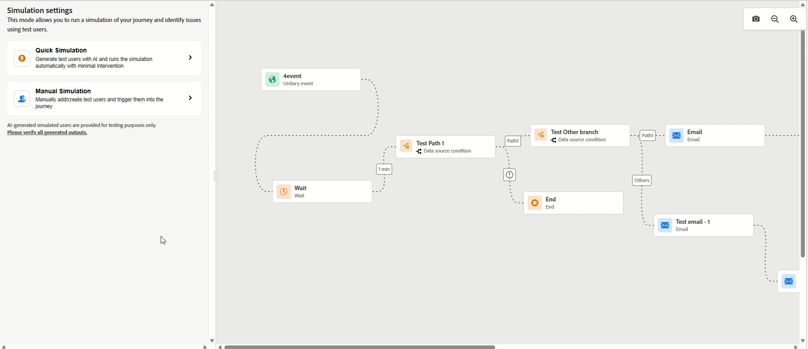

# 發行說明 {#release-notes}

>[!CONTEXTUALHELP]
>id="ajo_homepage_card1"
>title="最新資訊"
>abstract="**Adobe Journey Optimizer** 持續提供新功能、現有功能的增強功能，並修正錯誤。 所有變更都會在每月最後一週整合於發行說明。"

[!DNL Adobe Journey Optimizer] 遵循持續傳遞模式，允許 Adobe 持續傳遞新功能、增強功能和修正。 此方法可讓您分階段推出可擴充的功能，以確保所有環境的效能和穩定性。 基於此模型，發行說明會在每月發行之間更新。 如需發行週期與可用性階段的完整詳細資訊，請參閱 [Journey Optimizer 發行週期](releases.md)。

[!DNL Adobe Journey Optimizer] 是原生建置在 [!DNL Adobe Experience Platform] 的並繼承其最新創新和改善項目。 若要了解更多有關這些變更的資訊，請參閱 [Adobe Experience Platform 發行說明](https://experienceleague.adobe.com/docs/experience-platform/release-notes/latest.html?lang=zh-Hant){target="_blank"}。

>[!NOTE]
>
>這些發行說明中列出的功能包括&#x200B;**可用日期**，指出每個變更在您的環境中可用的時間。 **即將推出**&#x200B;摺疊式版面中的項目預計將在未來幾天或幾週內推出。 這些部分的資訊可能會有變更。

## 2026年6月更新 {#june-26-updates}

<table>
<thead>
<tr>
<th><strong>歷程模擬 (一般可用性)</strong> </th>
</tr>
</thead>
<tbody>
<tr>
<td>

您現在可以將歷程設定為模擬。 此模式可讓您使用模擬的使用者來驗證邏輯。 這些是專為模擬建立的臨時輪廓，可讓您自由測試，而無需在 Adobe Experience Platform 中管理持續的測試輪廓。 

歷程模擬之前以「有限可用性」的名義發行，目前所有環境都可以使用。 透過此一般可用性版本，您現在可以使用 Journey 代理直接在模擬選單中產生模擬使用者和事件。

如需詳細資訊，請參閱<a href="../building-journeys/simulate-journey-gs.md">詳細文件</a>。

推出日期： 2026年6月9日

</td>
</tr>
</tbody>
</table>

<table>
<thead>
<tr>
<th><strong>歷程路徑最佳化 — 目標定位（一般可用性）</strong> </th>
</tr>
</thead>
<tbody>
<tr>
<td>

<strong>最佳化活動</strong>現在支援<strong>目標規則</strong>，可讓您根據對象區段或設定檔屬性，定義客戶必須符合的特定條件，以符合特定歷程路徑的資格。

和實驗不同，在實驗中，客戶會隨機指派到路徑，目標定位會使用確定性邏輯，以確保將適當的對象或客戶設定檔路由到預期的路徑。

此功能之前以「有限可用性」的名義發行，目前所有環境都適用 (一般可用性)。

如需詳細資訊，請參閱<a href="../building-journeys/path-targeting.md">詳細文件</a>。

推出日期： 2026年6月8日

</td>
</tr>
</tbody>
</table>

<table>
<thead>
<tr>
<th><strong>歷程片段（正式發行）</strong> </th>
</tr>
</thead>
<tbody>
<tr>
<td>

您現在可以在 Adobe Journey Optimizer 中建立<strong>歷程片段</strong>。 歷程片段是可重複使用的歷程節點集合，您可以只建立一次，然後放入沙箱的任何歷程中。 無論是適用性檢查、偏好的管道路由邏輯還是歡迎順序，片段都有助於團隊更快行動並保持一致，而不會每次都從頭開始重建相同的邏輯。

建立後，片段會儲存在專用的<strong>片段詳細目錄</strong>中，並可使用<strong>歷程片段</strong>活動將其插入任何歷程。

先前此功能以「有限可用性」提供，現已開放所有客戶使用。 歷程片段也支援<strong>沙箱工具</strong>，可讓您跨沙箱封裝及匯出片段。

如需詳細資訊，請參閱<a href="../building-journeys/journey-fragments.md">詳細文件</a>。

推出日期： 2026年6月9日

</td>
</tr>
</tbody>
</table>

<table>
<thead>
<tr>
<th><strong>模擬內容變體 — 更新體驗和AI變體產生</strong> </th>
</tr>
</thead>
<tbody>
<tr>
<td>

<strong>模擬內容</strong>工作流程現在有兩個更新：

<ul>
<li><strong>新的預設路徑</strong> — 按一下<strong>模擬內容</strong>現在會依預設開啟<strong>模擬內容變化</strong>體驗。 您可以從單一畫面手動或CSV/JSON檔案新增範例輸入、重複使用模擬使用者、預覽演算及傳送校樣。 若要使用Adobe Experience Platform測試設定檔預覽、傳送包含測試設定檔資料的校樣，或檢查電子郵件收件匣轉譯和垃圾郵件報告，請按一下[模擬內容] </strong>，然後從下拉式清單中選取[模擬內容（AEP設定檔）] </strong>。<strong><strong></li>
<li><strong>AI產生的內容變體</strong> — 在<strong>模擬內容變體</strong>體驗中，按一下<strong>產生</strong>以使用AI自動建立內容變體。 系統會分析您的訊息、偵測個人化欄位和條件分支，並填入實際值，以便您驗證轉譯時無需手動建立每個變體。</li>
</ul>

如需詳細資訊，請參閱<a href="../test-approve/simulate-sample-input.md">詳細文件</a>。

推出日期： 2026年6月9日

</td>
</tr>
</tbody>
</table>

<table>
<thead>
<tr>
<th><strong>直接郵件管道的決策支援</strong> </th>
</tr>
</thead>
<tbody>
<tr>
<td>

您現在可以將決定原則新增至直接郵件歷程與行銷活動。 決策原則是產品建議的容器，可運用決策引擎以動態方式傳回最佳內容給每個客群成員。 直接郵件決策也支援批次決策使用案例，讓您為特定 Adobe Experience Platform 客群中的每個輪廓匯出對應的產品建議。 

如需詳細資訊，請參閱<a href="../experience-decisioning/use-decision-policy.md">詳細文件</a>。

推出日期： 2026年6月3日

</td>
</tr>
</tbody>
</table>

<table>
<thead>
<tr>
<th><strong>用於歷程運算式的 AI 助理 (公開 Beta 版)</strong> </th>
</tr>
</thead>
<tbody>
<tr>
<td>

AI 助理現在會在進階的運算式編輯器中運作，將自然語言提示轉換為有效的運算式和條件式邏輯。 描述您想要建立的運算式，而 AI 助理會產生現成的程式碼，您可以立即套用或透過後續提示進行調整。

此功能以公開 Beta 版的形式提供給所有客戶。

如需詳細資訊，請參閱<a href="../building-journeys/expression/expression-agent.md">詳細文件</a>。

推出日期： 2026年6月3日
 
</td>
</tr>
</tbody>
</table>

* [!BADGE 重要]{type=Informative} **AJO訊息回饋事件資料集正移至批次擷取** - **AJO訊息回饋事件資料集**&#x200B;正從串流擷取移至批次擷取。 因此，此資料集的資料延遲時間預計會長達2小時。 如果您在Customer Journey Analytics中建立報表，或使用此資料集執行查詢，請解決未來延遲增加的問題。 [閱讀更多](../data/datasets-query-examples.md#message-feedback-event-dataset)

  推出日期： 2026年6月10日

* **非循環讀取對象歷程的自動停止** — 非循環&#x200B;**讀取對象**&#x200B;歷程現在會在最後一個作用中設定檔退出後，自動轉換成&#x200B;**已停止**&#x200B;狀態。 以往，這些歷程會維持&#x200B;**即時**&#x200B;狀態，直到 91 天全域逾時到期，即使不再有輪廓流過也會維持該狀態。 透過這項改進功能，歷程狀態會在完成時立即反映實際執行狀態，讓您無需手動介入即可保持歷程詳細目錄準確。

  請注意，此行為不適用於包含導致等待期的節點的歷程，例如等待節點、反應節點或事件觸發的轉換。 這些歷程仍受標準 91 天全域逾時的約束。 [了解更多](../building-journeys/end-journey.md#auto-stop-non-recurring)

  推出日期： 2026年6月9日

* **自訂動作中的憑證型自訂驗證** - 自訂動作現在支援憑證型自訂驗證。 將 `subType: "certificateCredential"` 新增至自訂授權設定後，Journey Optimizer 會使用 Adobe 管理的憑證來簽署 JWT 用戶端宣告，並將其交換為存取權杖，而不需要用戶端密碼。 專為執行憑證式身分驗證的企業API （例如Microsoft Entra ID）而設計。 [了解更多](../datasource/external-data-sources.md#certificate-credential)

  推出日期： 2026年6月4日

* **行銷活動生命週期事件的客戶警報** - 新的系統警報現在會通知您動作和 API 觸發之行銷活動的關鍵生命週期事件。 在沙箱層級訂閱。 [閱讀更多](../reports/alerts.md)

  推出日期：2026 年 6 月 1 日

* **URL 參數加密** - 您現在可以加密追蹤中的 URL 參數，以及新增至您電子郵件訊息的登陸頁面連結。 這為敏感的參數資料提供額外的安全層。 此功能之前以「有限可用性」的名義發行，目前所有環境都適用 (一般可用性)。 [閱讀更多](../personalization/url-parameter-encryption.md)

  推出日期：2026 年 6 月 1 日

* **金鑰登錄的新權限** - 現在需要兩個新權限，才能存取和管理 URL 參數加密所需的金鑰：**管理金鑰登錄**&#x200B;和&#x200B;**檢視金鑰登錄**。 [閱讀更多](../administration/high-low-permissions.md#administration-permissions)

  推出日期：2026 年 6 月 1 日

* **外部客群的補充識別碼支援** - 歷程中的補充識別碼現在支援外部客群，包括從 CSV 檔案匯入的客群和使用聯合客群構成建立的客群。 您可以從客群中指定任何非身分屬性或非個人身分屬性作為補充識別碼，不需要結構描述標籤。 [閱讀更多](../building-journeys/supplemental-identifier.md)

  推出日期： 2026年6月11日

<!--
+++ Coming soon — **Information below is subject to change.**

* **Override the default execution field in campaigns** - Previously available at the journey level, you can now override the default execution field set globally for your Email, SMS and WhatsApp deliveries in the campaign parameters.

  Availability date: Early June, 2026

+++
-->

## 2026 年 5 月發行說明 {#may-26-rn}

### 歷程 {#may-26-journeys}

下列功能和改進功能已新增到此版本的歷程。 預計未來幾天或幾週也會有其他變更。

<table>
<thead>
<tr>
<th><strong>歷程片段 (有限可用性)</strong> </th>
</tr>
</thead>
<tbody>
<tr>
<td>

您現在可以在 Adobe Journey Optimizer 中建立<strong>歷程片段</strong>。 歷程片段是可重複使用的歷程節點集合，您可以只建立一次，然後放入沙箱的任何歷程中。 無論是適用性檢查、偏好的管道路由邏輯還是歡迎順序，片段都有助於團隊更快行動並保持一致，而不會每次都從頭開始重建相同的邏輯。

建立後，片段會儲存在專用的<strong>片段詳細目錄</strong>中，並可使用<strong>歷程片段</strong>活動將其插入任何歷程。

<!--

-->

此功能僅適用於一組組織 (可用性限制)。 若想取得存取權，請聯絡您的 Adobe 代表。

如需詳細資訊，請參閱<a href="../building-journeys/journey-fragments.md">詳細說明文件</a>。

推出日期：2026 年 5 月 13 日

</td>
</tr>
</tbody>
</table>

<table>
<thead>
<tr>
<th><strong>歷程模擬 (有限可用性)</strong> </th>
</tr>
</thead>
<tbody>
<tr>
<td>

您現在可以將歷程設定為<strong>模擬</strong>。 此模式可讓您使用<strong>模擬的使用者</strong>來驗證您的邏輯。 這些是專為模擬建立的臨時輪廓，可讓您自由測試，而無需在 Adobe Experience Platform 中管理持續的測試輪廓。

此功能以有限可用性的形式提供給所有客戶，並具備基本功能。

如需詳細資訊，請參閱<a href="../building-journeys/simulate-journey.md">詳細文件</a>。

推出日期：2026 年 5 月 5 日

</td>
</tr>
</tbody>
</table>

<!--
<table>
<thead>
<tr>
<th><strong>Journey path optimization – Targeting (General Availability)</strong> </th>
</tr>
</thead>
<tbody>
<tr>
<td>

Use the new <strong>Optimize</strong> node to target specific audiences to determine the best path to meet your business-centric KPIs.

This tool allows you to develop more effective marketing campaigns that are more likely to resonate at the 1:1 level, improve marketing personalization efforts for customers and enhance critical customer engagement KPIs, such as conversions and revenue.

Previously available in Limited Availability, this capability is now available to all environments.

Availability date: June 1, 2026

</td>
</tr>
</tbody>
</table>

<table>
<thead>
<tr>
<th><strong>Journey Arbitration – ranking formulas (General Availability)</strong> </th>
</tr>
</thead>
<tbody>
<tr>
<td>

You can now use formulas to automatically boost journey priority scores based on customer profile attributes and contextual factors, ensuring customers enter the most relevant journeys.

Previously available in Limited Availability, this capability is now available to all environments.

Availability date: June 1, 2026

</td>
</tr>
</tbody>
</table>
-->

### 協調的行銷活動 {#may-26-oc}

下列功能和改進功能已新增到此版本的協調行銷活動。 預計未來幾天或幾週也會有其他變更。

<table>
<thead>
<tr>
<th><strong>已鏈結的協調行銷活動</strong> </th>
</tr>
</thead>
<tbody>
<tr>
<td>

現在，只要直接從其他協調行銷活動的<strong>結束活動</strong>觸發協調的行銷活動，即可將協調的行銷活動連結在一起。

這可讓您將複雜的協調流程邏輯分解成更小且可重複使用的流程，以便從多個上層行銷活動呼叫，而非每次都重新建立。 在執行階段傳遞的承載可用於下遊行銷活動中的細分和個人化，因此每個連結的行銷活動都可以根據其收到的內容採取行動。

如需詳細資訊，請參閱<a href="../orchestrated/trigger-orchestrated-campaign.md#signal-end">詳細文件</a>。

推出日期：2026 年 5 月 20 日

</td>
</tr>
</tbody>
</table>

* **在擴充活動中新增連結** - 協調行銷活動的擴充活動現已推出「新增連結」功能。 這可讓您在工作表格資料與現有的資料庫表格之間建立直接關係。

  推出日期：2026 年 5 月 20 日

<!--
+++ Coming soon — **Information below is subject to change.**

The following orchestrated campaign capability is expected in the upcoming days or weeks.

<table>
<thead>
<tr>
<th><strong>File-based targeting for orchestrated campaigns (Limited Availability)</strong> </th>
</tr>
</thead>
<tbody>
<tr>
<td>

Orchestrated campaigns now support loading a CSV or TXT file directly into the campaign canvas as the targeting audience, without first ingesting the file into Adobe Experience Platform. The file data is consumed at execution time and is not persisted as an Adobe Experience Platform dataset. During file setup, you can define column mappings, data types, NULL handling, and per-column error policies. This supports ad-hoc sends or partner list campaigns where building a full ingestion pipeline is not practical.

This capability is only available for a set of organizations (Limited Availability). To gain access, contact your Adobe representative.

Availability date: June 1, 2026

</td>
</tr>
</tbody>
</table>

* **Loop-based personalization for relational data** - The personalization editor now supports a Loop block that iterates over relational collections, such as orders, accounts, or bookings, and renders one content block per record inside a single email or SMS. Collections are configured through the data picker using personalization tokens, with no expression writing required.

  Availability date: Early June, 2026

* **Personalize email sender details per recipient and campaign** - Orchestrated campaigns now support personalization of email header fields, including From name, From address, and Reply-To, using profile attributes or relational data. This allows sender details to reflect the relevant advisor, location, or branch for each recipient, rather than routing all sends through a single corporate address.

  Header values can be set at the channel level and overridden per campaign using contextual data for more precise control.

  Availability date: Early June, 2026

+++
-->

### 決策 {#may-26-decisioning}

下列功能和改進功能已新增到此版本的決策。 預計未來幾天或幾週也會有其他變更。

<table>
<thead>
<tr>
<th><strong>決策規則和排名公式 AI 最佳化</strong> </th>
</tr>
</thead>
<tbody>
<tr>
<td>

[!DNL Adobe Journey Optimizer] 現在使用 AI 來偵測可以簡化的決策規則和排名公式。 在詳細目錄中，紅色指示器會出現在 AI 已識別最佳化機會的任何規則上。 按一下指示器會顯示原始運算式以及 AI 建議的版本。 從那裡，您可以下載檔案以檢視每個版本評估模擬輪廓的方式，並確認其行為相同，然後以最佳化的運算式取代該運算式。

如需詳細資訊，請參閱<a href="../start/ai-features.md#decisioning-optimization">詳細說明文件</a>。

推出日期：2026 年 5 月 5 日

</td>
</tr>
</tbody>
</table>

* **決策中的 Adobe Experience Manager 內容片段** - 您現在可以將 Adobe Experience Manager 內容片段對應至決策中的決策項目，並在決策原則內運用這些片段，以便在適當的時間將適當的片段提供給適當的客戶。 [閱讀全文](../integrations/aem-fragments.md#aem-decisioning)

  此功能僅適用於一組組織 (可用性限制)。 若想取得存取權，請聯絡您的 Adobe 代表。

  推出日期：2026 年 5 月 20 日

* **來自行銷活動摘要的決策原則詳細資訊** - 您現在可以從行銷活動摘要頁面檢閱每個決策原則的完整結構，包括選擇策略、決策項目和遞補產品建議，而不需要複製或編輯行銷活動。 您也可以將 JSON 摘要複製到剪貼簿，以便透過 Adobe 支援或您的工程團隊進行疑難排解。 [閱讀更多](../experience-decisioning/use-decision-policy.md#decision-policy-summary)

  推出日期：2026 年 5 月 20 日

* **決策移轉工作流程 API** - 建立相依性分析和移轉工作流程的 API 合約已更新：在請求 URL (`sandbox`、`offer` 或 `decision`) 上傳遞 **`request-level`** 作為&#x200B;**查詢參數**。 JSON 正文中不得再傳送請求層級。 [閱讀全文](../experience-decisioning/decisioning-migration-api.md)

  推出日期：2026 年 5 月 6 日

### 電子郵件頻道 {#may-26-email}

下列功能和改進功能已新增到此版本的電子郵件管道。 預計未來幾天或幾週也會有其他變更。

<table>
<thead>
<tr>
<th><strong>電子郵件設計工具中的深層連結</strong> </th>
</tr>
</thead>
<tbody>
<tr>
<td>

您現在可以透過電子郵件設計工具中的專用選項，將深層連結新增至您的電子郵件內容。 這可確保使用者直接導向至正確的應用程式內內容，而非重新導向至瀏覽器或應用程式商店，以保留內容與參與度。

請注意，雖然深層連結選項可供所有客戶使用，但深層連結只有在您已完成必要設定和行動應用程式實施步驟時才有效。

如需詳細資訊，請參閱<a href="../email/deeplinks.md">詳細文件</a>。

推出日期：2026 年 5 月 12 日

</td>
</tr>
</tbody>
</table>

* **限制片段中的繼承中斷** - 現在當您建立或編輯片段時，可以選擇在電子郵件中使用時是否可修改片段。 鎖定片段可確保片段在出現的所有位置都保持同步，避免進行可能違反品牌標準或合規性需求的本機編輯。 此設定稍後可更新，並在未來的使用中套用。 [閱讀更多](../content-management/create-fragments.md#lock-visual-fragment)

  推出日期：2026 年 5 月 21 日

### 行動傳訊 (簡訊、MMS 與 RCS) {#may-26-mobile}

下列功能和改進功能已新增到此版本的行動傳訊。

<table>
<thead>
<tr>
<th><strong>新的行動訊息管道和增強的 RCS 訊息</strong> </th>
</tr>
</thead>
<tbody>
<tr>
<td>

簡訊、MMS 和 RCS 現在整合在 Adobe Journey Optimizer 中的單一<strong>行動訊息</strong>動作下，因此更易於從單一位置管理所有行動訊息類型。 在此更新中，您現在可以透過新的原生撰寫體驗，直接在 Journey Optimizer 中撰寫豐富媒體 RCS 訊息，包括影像、輪播和建議的動作。

如需詳細資訊，請參閱<a href="../mobile/get-started-mobile.md">詳細說明文件</a>。

推出日期：2026 年 5 月 20 日

</td>
</tr>
</tbody>
</table>

* **字元計數** - 在 Adobe Journey Optimizer 中，您現在可以使用字元計數，即時監視簡訊的長度。 它可協助您檢視訊息何時將分割成多個區段，以更好地管理格式並避免傳送成本意外增加。 [閱讀全文](../mobile/create-mobile-message.md)

* **簡訊傳入至自訂資料集** - 在&#x200B;**簡訊 API 認證**&#x200B;中，將&#x200B;**傳入簡訊**&#x200B;路由至您選取的&#x200B;**自訂、已啟用輪廓的體驗事件資料集**，而非僅預設追蹤資料集。 [閱讀全文](../mobile/mobile-webhook.md)

* **Webhook 介面增強功能** - 在設定簡訊 Webhook 時，使用者介面現在包含內建的設定指南，其中包含實用的範例，可讓您更輕鬆地調整提供者裝載並疑難排解問題，而無需離開設定流程。 [閱讀更多](../mobile/mobile-webhook.md)

* **簡訊內容中的深層連結** - 現在可以使用 Url 協助程式函式將深層連結新增到您的簡訊內容。 這可確保直接將收件者導向至預期的應用程式內內容，無需透過網頁瀏覽器或應用程式商店路由，前提是您已完成必要的設定和行動應用程式實施步驟。 [閱讀更多](../email/deeplinks.md)

### WhatsApp 頻道 {#may-26-whatsapp}

下列改進功能已新增至此版本的 WhatsApp 管道。

* **WhatsApp 按鈕支援和追蹤** - WhatsApp 範本現在支援&#x200B;**快速回覆**、**行動號召 - URL** 和&#x200B;**行動號召 - 電話**，不支援&#x200B;**複製代碼**。 Journey Optimizer 會傳送支援的按鈕並追蹤與其他管道報告的互動。

* **WhatsApp 管道內容資料** - Journey Optimizer 現在會擷取從 WhatsApp 管道傳回的其他互動資料，並將其儲存在 `whatsAppChannelContext` 欄位群組下的 **AJO EmailTrackingExperienceEvent 資料集**。 [閱讀更多](../whatsapp/send-whatsapp.md#whatsapp-channel-context)

  +++ 系統會擷取下列欄位，用於建立客群和分析 WhatsApp 參與度

   * **`messageType`** - WhatsApp 訊息類型 (例如 `templateBased`、`response`)
   * **`inboundMessage`** - 傳入回覆內容 (例如 `stop`、`start`、`subscribe`)
   * **`inboundNumber`** - 接收傳入訊息的寄件者識別碼
   * **`channelType`** - 管道類別 (`Utility`、`Marketing` 或 `Promotional`)
   * **`profileNumber`** - 接收傳入訊息的電話號碼
   * **`origTimestamp`** - Meta / WhatsApp 的原始時間戳記
   * **`status`** - 傳遞狀態包含標準化的提供者意見回饋 (`sent`、`delivered`、`bounce`、`error`、`delay`、`duplicate`、`denylist`、`exclude` 或 `unknown`) 以及原始提供者狀態訊息
   * **`reactionEvent`** - 使用者回應的內容：回應的表情符號，或特定訊息的回覆文字
   * **`reactionMessageID`** - 正在回應的原始訊息識別碼
   * **`reactionActionName`** - 回應動作類型 (`react`、`unreact` 或 `reply`)
   * **`interactiveSelectedTitle`** - 使用者從 WhatsApp 互動式訊息中選取的標題
   * **`interactiveType`** - 互動式訊息類型 (`list reply`、`button reply` 或 `button`)
   * **`interactiveSelectedDescription`** - 所選 WhatsApp 互動式選項的說明
   * **`interactiveSelectedID`** - 從 WhatsApp 選取選項的識別碼

  +++

### 內容與整合 {#may-26-content}

下列功能和改進功能已新增到此版本的內容管理與整合。

<table>
<thead>
<tr>
<th><strong>內容顧問選擇器</strong> </th>
</tr>
</thead>
<tbody>
<tr>
<td>

Journey Optimizer 現在使用<strong>內容顧問選擇器</strong>，此統一強制回應視窗可同時選取 Experience Manager 資產和內容片段。 新的選擇器包括：

<ul>
<li><strong>瀏覽、搜尋和篩選</strong>所有資產和片段的。</li>
<li><strong>AI 語意搜尋</strong>：以簡單的語言描述您需要的內容，例如「山中的咖啡」，以根據含義和內容呈現內容相關的資產，而不只是文字相符。 也支援多語言查詢。</li>
<li><strong>簡報上傳</strong>：上傳行銷簡報，以根據其內容和需求自動呈現符合行銷活動內容的資產。</li>
<li><strong>動態媒體轉譯</strong>：挑選並套用動態資產的影像轉譯，而無需離開選擇器。</li>
</ul>

如需詳細資訊，請參閱<a href="../integrations/aem-content-advisor.md">詳細說明文件</a>。

推出日期：2026 年 5 月 19 日

</td>
</tr>
</tbody>
</table>

<table>
<thead>
<tr>
<th><strong>整合</strong> </th>
</tr>
</thead>
<tbody>
<tr>
<td>

<b>整合</b>功能可讓您直接將第三方資料來源連線至 Adobe Journey Optimizer。 透過簡化您提取外部資料和<b>可撰寫內容</b>的方式，此功能可讓您更輕鬆地跨所有管道提供個人化的動態訊息。

之前以 Beta 版本發行，目前此功能所有環境都適用 (一般可用性)。

如需詳細資訊，請參閱<a href="../integrations/integrations.md">詳細文件</a>。

推出日期：2026 年 5 月 4 日

</td>
</tr>
</tbody>
</table>

* **資產選擇器中的跨組織存放庫存取** - 您現在可以直接在 Adobe Experience Manager 資產選擇器中，順暢地從多個組織的存放庫中選取資產。

<!--
+++ Coming soon — **Information below is subject to change.**

* **Message Feedback Event Dataset moving to batch ingestion** - The `AJO Message Feedback Event Dataset` is transitioning from streaming to batch ingestion mode. This change ensures that data ingestion does not exceed streaming ingestion limits. If you use this dataset in Customer Journey Analytics reports or run queries against it, expect an increase in data latency of up to 2 hours going forward.

  Availability date: June 1, 2026

+++
-->

### 可用性改進功能 {#may-26-usability}

以下可用性改進功能也已於 2026 年 5 月發行。

#### 清單

* **大量動作** - 您現在可以在&#x200B;**行銷活動**、**片段**&#x200B;和&#x200B;**範本**&#x200B;清單中一次選取多個項目，並從單一動作列執行大量作業，包括新增項目至套件、將其移至資料夾、編輯標籤、管理存取權，以及封存或刪除項目。 [了解更多](../start/search-filter-categorize.md#bulk-actions)

  

* **排序和調整欄位大小** - **行銷活動**、**片段**&#x200B;和&#x200B;**範本**&#x200B;清單現在支援按一下任何欄位標頭來排序。 在行銷活動資料夾檢視中，也可依&#x200B;**[!UICONTROL 優先順序]**&#x200B;和&#x200B;**[!UICONTROL 管道設定]**&#x200B;進行排序和篩選。 **片段**&#x200B;和&#x200B;**範本**&#x200B;清單中的欄位寬度也可調整大小，拖曳欄位邊界以適應您最關心的資料。 [了解更多](../start/search-filter-categorize.md#filter-lists)

#### 內容製作

* **內嵌輪廓屬性編輯** - 電子郵件設計工具中的內嵌輪廓屬性編輯最初於 4 月發行。 在 5 月發行版本中，此功能已從 AI 助理分離出來，並擴充至推播管道編輯器。 [了解更多](../personalization/personalize.md#inline-personalization)

  

* **推播管道編輯器中的連結 URL 工具提示** - 當任何連結或媒體欄位中的 URL 太長而無法顯示時，該欄位旁邊永遠會顯示工具提示圖示，將滑鼠游標停留在該欄位上可檢視完整的 URL。 [了解更多](../push/design-push.md#on-click-behavior)

  

<!--
#### Simulation & Preview

* **Redesigned preview experience** - The content preview screen has been redesigned with a side-by-side layout that lets you compare how your content renders across multiple profiles at a glance, enabling quicker and more confident reviews before sending. [Learn more](../test-approve/simulate-sample-input.md#preview)

  
-->

<!--
+++ Coming soon — **Information below is subject to change.**

* **Folders for journeys and campaigns** - You can now organize your journeys and campaigns into folders to improve navigation and management in the interface.

  Availability date: Early June, 2026

+++
-->

