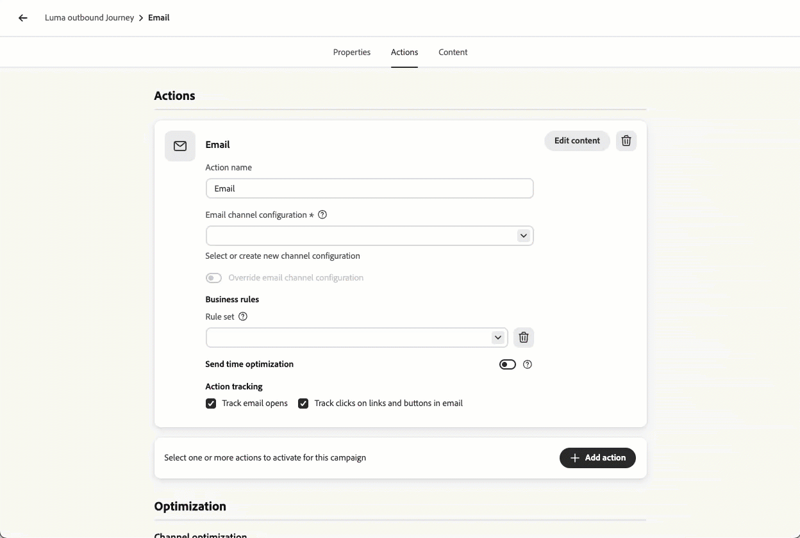
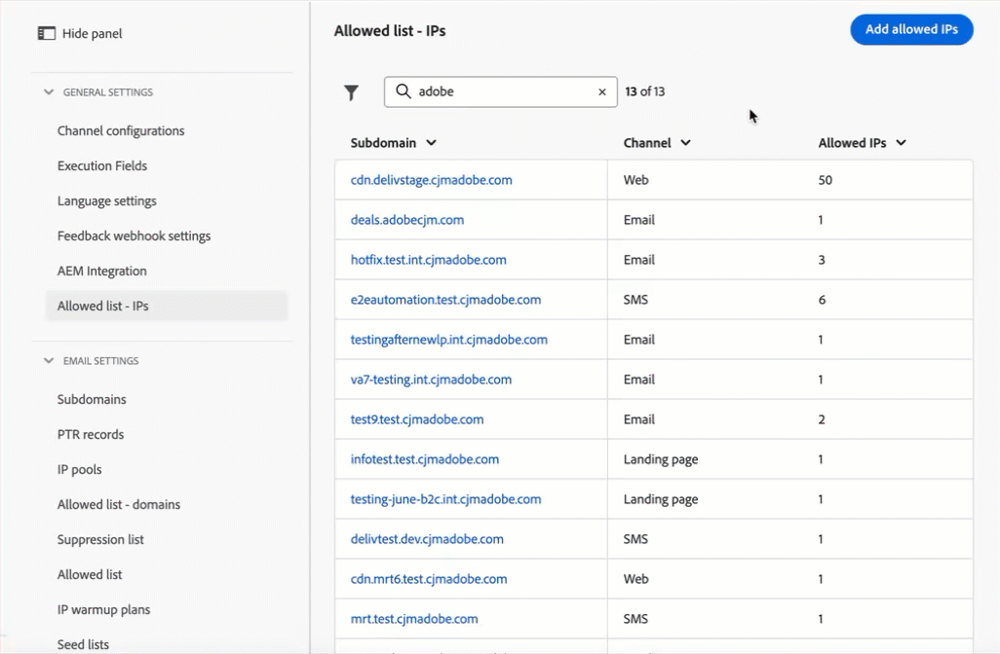

# 發行說明 {#release-notes}

>[!CONTEXTUALHELP]
>id="ajo_homepage_card1"
>title="最新資訊"
>abstract="**Adobe Journey Optimizer** 持續提供新功能、現有功能的增強功能，並修正錯誤。 所有變更都會在每月最後一週整合於發行說明。"

[!DNL Adobe Journey Optimizer] 遵循持續傳遞模式，允許 Adobe 持續傳遞新功能、增強功能和修正。 此方法可讓您分階段推出可擴充的功能，以確保所有環境的效能和穩定性。 基於此模型，發行說明會在每月發行之間更新。 如需發行週期與可用性階段的完整詳細資訊，請參閱 [Journey Optimizer 發行週期](releases.md)。

[!DNL Adobe Journey Optimizer] 是原生建置在 [!DNL Adobe Experience Platform] 的並繼承其最新創新和改善項目。 若要了解更多有關這些變更的資訊，請參閱 [Adobe Experience Platform 發行說明](https://experienceleague.adobe.com/docs/experience-platform/release-notes/latest.html?lang=zh-Hant){target="_blank"}。

>[!NOTE]
>
>這些發行說明中列出的功能包括&#x200B;**可用日期**，指出每個變更在您的環境中可用的時間。 **即將推出**&#x200B;摺疊式版面中的項目預計將在未來幾天或幾週內推出。 這些部分的資訊可能會有變更。

## 2026年8月更新 {#aug-26-updates}

<!--
### Loyalty {#aug-26-loyalty}

<table>
<thead>
<tr>
<th><strong>Loyalty Insights skill</strong> </th>
</tr>
</thead>
<tbody>
<tr>
<td>

Journey Optimizer introduces <strong>Loyalty Insights</strong>, a new CX Coworker skill for asking questions about challenge performance and other loyalty program data ingested into the Loyalty field groups in Adobe Experience Platform.

For more information, refer to the <a href="../start/ajo-coworker-skills.md">detailed documentation</a>.

Availability date: August 12, 2026

</td>
</tr>
</tbody>
</table>
-->

### 內容管理

<table>
<thead>
<tr>
<th><strong>AI內容產生的彈性影像來源</strong> </th>
</tr>
</thead>
<tbody>
<tr>
<td>

在Journey Optimizer中產生內容現在會直接從Adobe Experience Manager Assets Essentials等來源取得品牌核准的影像。 三種模式可控制平衡：平衡（數位資產管理優先、AI填補差距、預設）、Assets （數位資產管理來源）和Creative (AI)。

如需詳細資訊，請參閱<a href="../content-management/generative-uc.md#image-mode">詳細文件</a>以瞭解詳情。

 推出日期： 2026年8月5日

</td>
</tr>
</tbody>
</table>

### 行銷活動 {#aug-26-campaigns}

<table>
<thead>
<tr>
<th><strong>API觸發的電子郵件中的個人化PDF附件</strong> </th>
</tr>
</thead>
<tbody>
<tr>
<td>

Journey Optimizer現在在API觸發的行銷活動中，支援每封電子郵件最多<b>5個PDF附件</b>，包含靜態和收件者特定的PDF。 收件者特定的PDF檔案會從資料登陸區域安全擷取，並在傳送時附加，每個檔案的位置都直接在API裝載中傳遞。 這可讓現有的上游檔案產生系統維持原狀，由Journey Optimizer處理傳送。

支援的使用案例包括發票、對帳單、票證、合約、出貨標籤，以及依收件者而異的類似檔案。 個人化PDF附件僅適用於異動API觸發的電子郵件行銷活動，在歷程或協調的行銷活動中不支援。

PDF附件附加元件支援較大的附件數量與大小；如需詳細資訊，請聯絡您的Adobe代表。

如需詳細資訊，請參閱<a href="../email/pdf-attachments.md#personalized-attachments">詳細文件</a>以瞭解詳情。

推出日期： 2026年8月12日

</td>
</tr>
</tbody>
</table>

### 協調的行銷活動 {#august-26-oc}

<table>
<thead>
<tr>
<th><strong>LINE頻道支援（可用性限制）</strong> </th>
</tr>
</thead>
<tbody>
<tr>
<td>

您現在可以新增LINE動作至您的協調行銷活動。 這項新活動可讓您建立及提供高度個人化的內容，包括文字、貼圖、影像、影片、位置資料和豐富的Flex訊息，以便在LINE平台上順暢地吸引您的客戶。 此功能僅適用於一組組織 (可用性限制)。 若想取得存取權，請聯絡您的 Adobe 代表。

如需詳細資訊，請參閱<a href="../orchestrated/activities/channels.md">詳細文件</a>以瞭解詳情。

推出日期： 2026年8月12日

</td>
</tr>
</tbody>
</table>

### 管道 {#august-26-channels}

* **輸送量的效能附加元件 — 推播** — 在API觸發的行銷活動中提供新的高輸送量異動訊息模式。 此模式專為大規模即時交易型傳訊而設計，最高可支援每秒 5,000 筆交易，而且可用性更高。 此功能先前僅適用於電子郵件頻道，現在也可用於推播頻道，適用於已購買Adobe高輸送量異動訊息附加元件產品的組織。 請聯絡您的 Adobe 代表以取得更多資訊。 [了解更多](../campaigns/api-triggered-high-throughput.md)

  推出日期： 2026年8月11日

### 可用性改進功能 {#august-26-usability}

* **歷程詳細目錄中的大量作業** — 您現在可以直接從歷程詳細目錄清單執行新的大量動作，以便更快速地一次管理多個歷程。 選取數個歷程，並在單一步驟中套用下列任何新動作： **新增至封裝**、**刪除**、**移至資料夾**、**編輯標籤**&#x200B;或&#x200B;**管理存取權**。 這降低了一次一個歷程重複相同動作的需求，並簡化了處理大量歷程的團隊的歷程管理。 [了解更多](../building-journeys/journey-ui.md)

  推出日期： 2026年8月12日

* **內容測試的新內容模擬體驗** - **模擬內容**&#x200B;工作流程引入重新設計的體驗：所有變體現在都會在單一可捲動格線（並排、棧疊或包裝的版面）中一起呈現，取代一次一個變體。 單一底部動作列可整合測試變體之間的導覽、縮放、檢視區切換（案頭/行動裝置）、地區設定切換、新增範例輸入、使用AI產生變體、挑選並儲存模擬使用者，以及匯入或匯出變體。 移除左側邊欄並收合額外的頁首圖層可大幅增加預覽的空間。 下方動作列中的&#x200B;**切換為傳統體驗**&#x200B;選項可讓您隨時還原成先前的體驗。 [了解更多](../test-approve/simulate-content-variations.md)

  推出日期： 2026年8月11日

* **新歷程畫布中的多重選擇** — 新歷程畫布體驗引進簡化的多重節點選擇：按住Shift鍵並拖曳以同時選取多個節點，而不是分別選取。 如此一來，大量動作（例如複製、刪除或另存為歷程片段）就能在數個節點上有效執行。 [了解更多](../building-journeys/using-the-journey-designer.md#canvas-capabilities)

  推出日期： 2026年8月17日

### 決策 {#decisioning-august}

* **視覺片段中的映象頁面** — 您現在可以將映象頁面插入視覺片段中。 即使片段用於運用Decisioning的電子郵件行銷活動中，決策屬性仍可在映象頁面連結上正確轉譯。 必須在發佈片段之前將映象頁面新增到視覺片段，以便顯示決策屬性。

  推出日期： 2026年8月11日

  [了解更多](../email/message-tracking.md#decisioning-mirror-page)

## 2026年7月發行說明 {#july-26-updates}

### 忠誠度挑戰 {#july-26-loyalty}

Journey Optimizer推出「忠誠度挑戰」，此版本的新功能。

<table>
<thead>
<tr>
<th><strong>忠誠度挑戰</strong> </th>
</tr>
</thead>
<tbody>
<tr>
<td>

忠誠度挑戰會將忠誠度方案轉換為吸引人的遊戲化體驗，激勵客戶採取有價值的行動，例如進行購買、撰寫評論或任何想要的行為。

管理員可以使用「忠誠度設定」選單，將Journey Optimizer與您的忠誠度生態系統連線，包括獎勵履行API、事件定義、產品詳細目錄、排除和身分設定。 行銷人員隨後可以設計標準、連續或循序挑戰，定義任務和獎勵，提供品牌內容卡和訊息，以及使用AI支援的報告儀表板來監控效能。 Journey Optimizer會產生歷程，在背景協調每個挑戰，讓團隊可以聚焦於客戶體驗和業務目標。

忠誠度也會引進同事技能，讓團隊更有效率地執行關鍵挑戰操作，包括建立挑戰、設定挑戰屬性、管理對象和相關設定，以及檢閱見解以監控挑戰參與度和獎勵績效。

此功能僅適用於獲得Journey Optimizer忠誠度授權的組織。 若想取得存取權，請聯絡您的 Adobe 代表。

如需詳細資訊，請參閱<a href="../loyalty-challenges/get-started.md">詳細文件</a>以瞭解詳情。

 推出日期： 2026年7月28日

</td>
</tr>
</tbody>
</table>

### 管道 {#july-26-channels}

此發行版本已引入下列功能和改進。

<table>
<thead>
<tr>
<th><strong>自訂傳出頻道</strong> </th>
</tr>
</thead>
<tbody>
<tr>
<td>

Journey Optimizer現在推出自訂管道，這項新功能可讓管理員透過無程式碼管道產生器，將任何外寄的HTTP傳訊管道（例如WeChat、Kakao Talk、Messenger或專屬提供者）直接帶入Journey Optimizer。

設定之後，便可在各種行銷活動、歷程和精心安排的行銷活動中使用自訂管道，並提供與原生管道相同的完整功能集：使用運算式編輯器進行個人化、內容實驗、預覽和校樣、現成可用的報告，以及同意和治理實施。

這填補了先前由自訂動作填補的空白，這些動作僅限於歷程，且缺乏專用頻道功能。

自訂傳出頻道目前以「有限可用性」的形式提供。 若想取得存取權，請聯絡您的 Adobe 代表。

如需詳細資訊，請參閱<a href="../custom-channel/get-started-custom-channel.md">詳細文件</a>以瞭解詳情。

 推出日期： 2026年7月31日

</td>
</tr>
</tbody>
</table>

<table>
<thead>
<tr>
<th><strong>頻道最佳化</strong> </th>
</tr>
</thead>
<tbody>
<tr>
<td>

您現在可以設定歷程或行銷活動動作，以包含多個傳出頻道（電子郵件、推播、簡訊），並讓Journey Optimizer透過最佳頻道自動傳送給每個客戶。 有三種最佳化模式可供使用：

<ul>
<li>手動排名：指定您偏好的管道順序。</li>
<li>客戶偏好設定：從他們的設定檔使用客戶偏好的管道（體驗資料模型同意和偏好設定屬性）。</li>
<li>AI模型型排名：使用機器學習傾向分數來推斷每位客戶最有效的管道。</li>
</ul>

當最上層頻道無法使用（未選擇加入、頻率限定或未設定）時，系統會退回至下一個可用頻道。

此功能僅適用於一組組織 (可用性限制)。 若想取得存取權，請聯絡您的 Adobe 代表。

如需詳細資訊，請參閱<a href="../building-journeys/channel-optimization.md">詳細文件</a>以瞭解詳情。

推出日期： 2026年7月22日

</td>
</tr>
</tbody>
</table>

* **WhatsApp管道：支援WhatsApp流程範本** — 您現在可以在Adobe Journey Optimizer中傳送WhatsApp流程範本，以提供互動式的多熒幕體驗，例如調查和潛在客戶擷取。 回應會在提交時擷取，並儲存為新的Journey Optimizer管道追蹤事件資料集中的原始JSON裝載：

  * **AJO管道追蹤事件資料集**：擷取所有傳入的WhatsApp回應，包括透過WhatsApp流程範本提交的回應。

  [了解更多](../data/get-started-datasets.md#system-datasets)

* **增強的自訂提供者整合 — Mobile** — 自訂提供者整合現在透過關鍵訊息和標題更新提供擴充的彈性：

  * 頁首自訂：您現在可以編輯預設的Content-Type頁首值，並新增最多10個自訂頁首引數。

  * SMS裝載支援：在SMS裝載中新增Adobe Journey Optimizer協助程式功能的支援，包括encode64。

### 管理 {#july-26-administration}

下列功能和改善專案已新增至此版本中的管理和資料管理。

<table>
<thead>
<tr>
<th><strong>Web應用程式防火牆IP允許清單</strong> </th>
</tr>
</thead>
<tbody>
<tr>
<td>

Adobe Journey Optimizer現在支援登入頁面的Web應用程式防火牆IP允許清單，可讓組織強制所有傳入要求都透過其設定的Web應用程式防火牆基礎架構專門路由。 透過這項增強功能，客戶可設定Journey Optimizer以拒絕任何略過Web應用程式防火牆層的直接請求，確保一致套用Imperva等工具中定義的安全性原則。

此功能可加強具有嚴格網路存取需求之企業的安全狀況，讓企業能夠完全控制其Journey Optimizer託管登陸頁面的流量。

如需詳細資訊，請參閱<a href="../configuration/waf-ip-allowlist.md">詳細文件</a>以瞭解詳情。

推出日期： 2026年7月30日

</td>
</tr>
</tbody>
</table>

* **管理完整/基本URL個人化的網域** — 您現在可以直接從Adobe Journey Optimizer中的管理設定建立和管理核准的完整和基本URL個人化的網域，而無需連絡Adobe支援。 [了解更多](../email/url-personalization.md#personalize-complete-base-url)

  推出日期： 2026年7月30日

* **資料集存留時間(TTL)護欄 — 現有的沙箱** - Journey Optimizer系統產生的資料集的存留時間(TTL)護欄（設定檔存放區為90天，資料湖為13個月）將從&#x200B;**2026年10月1日起，在**&#x200B;現有的客戶沙箱和組織&#x200B;**上強制執行**。 [了解更多](../data/datasets-ttl.md#ttl-guardrail)

### 電子郵件設計 {#july-26-email}

此發行版本的電子郵件設計已新增下列功能和改善。

<table>
<thead>
<tr>
<th><strong>電子郵件設計工具中的模組</strong> </th>
</tr>
</thead>
<tbody>
<tr>
<td>

電子郵件設計工具現在包含現成可用的版面模組 (例如頁首、產品卡、資訊區塊和頁尾) 資料庫，您可以將這些模組直接拖放到電子郵件畫布中。

每個模組都預先設定了可編輯的屬性 (影像、標題、文字、按鈕、連結)，並可透過 WYSIWYG 介面完全自訂，因此無需您從頭開始建立結構，即可加速電子郵件的建立。

如需詳細資訊，請參閱<a href="../email/email-modules.md">詳細文件</a>以瞭解詳情。

推出日期： 2026年7月29日

</td>
</tr>
</tbody>
</table>

<table>
<thead>
<tr>
<th><strong>電子郵件Designer中的內容檢查（一般可用性）</strong> </th>
</tr>
</thead>
<tbody>
<tr>
<td>

Journey Optimizer 現在包含直接在電子郵件設計工具中的自動化技術驗證，可幫助您在傳送前捕捉 HTML 和 CSS 問題。

檢查涵蓋不支援的元素，例如 <code>&lt;script&gt;</code> 和 <code>&lt;base&gt;</code> 標籤、可能中斷 Microsoft Outlook 版面的空白 div、HTML 中繼重新整理標籤，以及觸發 Gmail 轉譯失敗的 CSS 或 HTML 大小臨界值。

結果會直接在製作面板中顯示為錯誤、警告或資訊性通知，其中包含內容詳細資訊和適用的一鍵式修正，因此無需離開編輯器即可解決問題。

此功能之前以「有限可用性」的名義提供，現在可供所有客戶使用。

如需詳細資訊，請參閱<a href="../email/content-check.md">詳細文件</a>以瞭解詳情。

推出日期： 2026年7月16日

</td>
</tr>
</tbody>
</table>

* **在`<head>`**&#x200B;中支援運算式片段 — 現在可以在電子郵件範本的`<head>`中使用運算式片段。 這可讓您集中處理單一片段中的樣式或任何自訂程式碼，並在多個範本中重複使用。 更新並重新發佈片段時，所有根據範本建立的電子郵件都會自動繼承最新的程式碼，無需手動個別更新每封電子郵件。 [了解更多](../personalization/use-expression-fragments.md)

  推出日期： 2026年7月29日

### 歷程 {#july-26-journeys}

下列功能和改進功能已新增到此版本的歷程。
<table>
<thead>
<tr>
<th><strong>新使用者介面</strong> </th>
</tr>
</thead>
<tbody>
<tr>
<td>

已針對歷程畫布引入<b>新使用者介面</b>，為大型歷程提供更優異的效能、可更好閱讀的自動版面配置，以及引導式撰寫體驗。

若要切換到新的UI，請按一下<b>新增體驗</b>按鈕。 此設定會儲存在歷程層級，因此預設會在新體驗中重新開啟歷程。 若要還原，請按一下<b>舊體驗</b>。 <a href="../building-journeys/using-the-journey-designer.md#canvas-capabilities">了解更多</a>。

 推出日期： 2026年7月16日

</td>
</tr>
</tbody>
</table>

* [!BADGE 淘汰]{type=Negative} **對象資格節點和退出條件不再支援批次對象** — 從2026年9月開始，Journey Optimizer將封鎖在「對象資格」節點或退出條件中使用批次對象之任何歷程的發佈。 歷程畫布中已經出現驗證警告。  現有的即時歷程不受影響。 包含此設定的新歷程、草稿歷程和重複歷程必須在2026年9月之前更新。 在「對象資格」節點中使用串流對象，或切換至「讀取對象」活動。 若是退出條件，請使用串流對象。 [瞭解如何移轉您的歷程](../building-journeys/aq-batch-audiences-migration.md)

* **歷程模擬中的外部對象** — 歷程模擬現在支援外部對象。 模擬以CSV或同盟對象構成對象為目標的歷程時，您可以直接透過UI表單或JSON匯入，從這些對象中模擬擴充屬性。 UI只會動態顯示歷程邏輯中使用的特定擴充屬性，以在決策分支和個人化規則上線之前進行精確驗證。 [了解更多](../building-journeys/simulate-journey.md)

  推出日期： 2026年7月29日

* **針對慢速自訂動作端點的斷路器保護** — 對於透過慢速自訂動作服務路由的端點，如果120秒觀察時段內至少有200個呼叫，則120秒時段內超過20%的呼叫超過10秒，Journey Optimizer現在會暫時將所有呼叫限制在5分鐘以內。 這有助於防止超載已經很慢的端點。 [了解更多](../configuration/external-systems.md#response-time)

  推出日期：2026年7月29日。 這項功能正在各個地區陸續推出。

### 協調的行銷活動 {#july-26-oc}

下列功能和改進功能將新增到此版本的協調行銷活動。

<table>
<thead>
<tr>
<th><strong>協調行銷活動中的檔案型目標定位</strong> </th>
</tr>
</thead>
<tbody>
<tr>
<td>

協調的行銷活動現在支援直接將<strong>CSV或TXT檔案</strong>載入行銷活動畫布，作為目標對象，而不先將檔案擷取到Adobe Experience Platform。 檔案資料會在執行時使用，不會儲存為Adobe Experience Platform資料集。 在檔案設定期間，您可以定義欄對應、資料型別、NULL處理和每欄錯誤原則。 未通過驗證的列會在行銷活動執行前遭到拒絕並記錄，讓對象保持乾淨，無需手動預先處理。 這尤其適合在無法建立完整擷取管道的臨時傳送或合作夥伴清單行銷活動。

如需詳細資訊，請參閱<a href="../orchestrated/activities/load-file.md">詳細文件</a>以瞭解詳情。

 推出日期：2026年7月6日

</td>
</tr>
</tbody>
</table>

* **檢視協調的行銷活動轉換許可權** — 新增新的&#x200B;**檢視協調的行銷活動轉換**&#x200B;許可權，以取代舊版&#x200B;**在協調的行銷活動中檢視檔案**&#x200B;選項。 此變更可讓您隱藏促銷活動轉變中的預覽結果，以支援個人識別資訊的合規性。

  推出日期： 2026年7月29日

  [了解更多](../administration/ootb-permissions.md)

### 決策 {#decisioning}

* **從自然語言運算式建立決策規則** — 您現在可以使用純語言描述您要建立的決策規則，並讓AI為您產生它。 此功能適用於具有Adobe AI功能存取權的客戶。

  此功能適用於具有Adobe AI功能存取權的組織。 它僅適用於一組組織（可用性限制）。 若想取得存取權，請聯絡您的 Adobe 代表。

  推出日期： 2026年7月29日

  [了解更多](../experience-decisioning/rules.md#build-rule-with-ai)

* **決定專案的動態自訂屬性** — 決定專案自訂屬性現在可以在傳遞時使用設定檔、情境和對象資料進行個人化。 如此一來，行銷人員就不需要針對次要內容變化版本維持重複的產品建議，而能夠管理較少、較靈活的決策項目。 [了解更多](../experience-decisioning/items.md#attributes)

  推出日期： 2026年7月27日

* **決策規則和排名公式模擬** — 您現在可以直接從規則或公式編輯器模擬決策規則和排名公式。 新增手動測試變體或使用AI產生變體，然後對您的測試資料執行運算式，以驗證資格並檢閱排名結果，所有這些都部署至生產環境之前。 具有存取Adobe AI功能之客戶可使用產生變體。

  此功能僅適用於一組組織 (可用性限制)。 若想取得存取權，請聯絡您的 Adobe 代表。

  推出日期： 2026年7月29日

  [進一步瞭解規則模擬](../experience-decisioning/rules.md) | [進一步瞭解排名公式模擬](../experience-decisioning/ranking/ranking-formulas.md)

### 內容管理 {#july-26-content}

下列功能和改善專案已新增至此版本的內容管理。

<table>
<thead>
<tr>
<th><strong>引導式採用功能</strong> </th>
</tr>
</thead>
<tbody>
<tr>
<td>

透過引導式功能，協助您將現有電子郵件內容和歷程移至Journey Optimizer，讓從其他行銷平台轉換至Adobe Journey Optimizer變得更輕鬆。 專屬的工作區可讓您重複使用現有工作，而非從頭重建。

此功能僅適用於一組組織 (可用性限制)。 若想取得存取權，請聯絡您的 Adobe 代表。

如需詳細資訊，請參閱<a href="../start/migrate-content-and-journeys.md">詳細文件</a>以瞭解詳情。

 推出日期： 2026年7月30日

</td>
</tr>
</tbody>
</table>

* **個人化運算式中的新協助程式函式** — 個人化運算式現在提供新協助程式函式：

  * `appendQueryParams`：將查詢引數附加至URL，或如果索引鍵已存在則取代它。
  * `dateBetween`：檢查日期是否落在開始和結束日期範圍（含）。
  * `equalsAnyIgnoreCase`：當字串符合任何提供的值時傳回true，忽略大小寫。
  * `getUrlFragment`：擷取URL的片段部分（#之後的部分）。
  * `join`：使用分隔符號將陣列元素串連到單一字串中。
  * `decode64`：解碼Base64編碼的字串。 如果輸入不是有效的Base64，原始輸入字串會傳回不變。
  * `parseJson`：將JSON字串剖析為可在範本中使用的結構化變數。
  * `valueAtPath`：從資料路徑指派值給範本變數，並附上選擇性索引，以從陣列或集合中擷取特定元素。
  * `abort`：在轉譯期間到達時停止訊息傳遞。

  `concat`函式也已增強，現在支援兩個或多個引數。

  此外，下列範本移轉功能現已可協助您將現有範本移轉至Journey Optimizer：

  * `ampCompare`：使用指定的比較運運算元比較兩個值。
  * `ampSubstr`：傳回指定開始與結束索引之間的字串部分。
  * `compareTo`：以字典方式比較兩個字串。

  [進一步瞭解協助程式功能](../personalization/functions/functions.md)

  推出日期： 2026年7月28日

* **「AI小幫手」已重新命名為「產生內容」** — 「AI小幫手」已重新命名為「透過Adobe Journey Optimizer產生內容」。 此更新僅限於命名和術語；未引入任何功能變更。 內容產生、影像產生、個人化運算式和內容實驗的導覽標籤、按鈕、功能表和對話方塊已從「AI助理」重新命名為「產生內容」。

  推出日期： 2026年7月30日

* **多語言改善** — 語言設定現在可以從現有的作用中設定複製，因此您不再需要完全重建設定以進行變更。 您也可以在編寫「語言設定」時，將條件從一個地區設定複製到另一個地區設定，以簡化具有多種語言的網站的設定。

  推出日期： 2026年7月30日

### 內容與整合 {#july-26-integration}

此版本中的內容管理及整合即將推出下列改善專案。

<table>
<thead>
<tr>
<th><strong>使用Dynamic Media的倒數計時器</strong> </th>
</tr>
</thead>
<tbody>
<tr>
<td>

<strong>Journey Optimizer與Adobe Experience Manager Dynamic Media整合</strong>可為Dynamic Media範本啟用開放時間個人化，解除鎖定超個人化使用案例。 客戶可以在Adobe Experience Manager中建立和發佈個人化範本，並在Journey Optimizer中使用這些範本，在開放時間呈現資料。

如需詳細資訊，請參閱<a href="../integrations/aem-dynamic.md#countdown">詳細文件</a>以瞭解詳情。

 推出日期： 2026年7月30日

</td>
</tr>
</tbody>
</table>

* **AJO MCP伺服器新工具** - [!DNL Adobe Journey Optimizer] MCP伺服器現在會公開五個額外的唯讀&#x200B;**通道設定工具**，讓您能夠直接從AI助理查詢通道設定、支援資源和行銷動作。 您現在可以使用&#x200B;**列出頻道設定** （橫跨所有AJO頻道）、**取得頻道設定**、**列出設定資源**、**取得設定資源**&#x200B;以及&#x200B;**列出行銷動作**。 [閱讀更多](../integrations/ajo-mcp.md#mcp-tools)

  推出日期： 2026年7月9日

### 報表 {#july-26-reporting}

此版本中報告下列改善專案。

* **電子郵件報告的新預估點按量度** — 為了更準確地檢視實際客戶參與度，歷程、行銷活動和頻道即時報告現在提供新的預估量度。

  * 預估的CTR （點進率）：計算為相對於已傳送訊息總數的預估點按。

  * 預估的CTOR （點按至開啟率）：計算為相對於預估開啟總數的預估點按次數。

    推出日期： 2026年7月29日

### 可用性改進功能 {#july-26-usability}

* **片段詳細目錄中的快速啟動捷徑** — 您現在可以使用&#x200B;**[!UICONTROL 更多動作]**&#x200B;按鈕，從片段清單中快速存取常見動作。 可用的捷徑包括編輯片段、開啟其詳細資訊以及捨棄草稿版本。 [了解更多](../content-management/manage-fragments.md#quick-launch-fragments)

  

* **範本詳細目錄中的快速啟動捷徑** — 「內容範本」清單中的&#x200B;**[!UICONTROL 更多動作]**&#x200B;按鈕現在提供對常見動作的快速存取：編輯範本詳細資料、模擬內容以及刪除範本。 也可使用其他通道特定的捷徑：針對電子郵件範本、編輯電子郵件內文、檢視或傳送校樣、執行垃圾郵件報告，以及轉譯電子郵件；針對簡訊範本，檢查字元計數和區段數。 [了解更多](../content-management/access-content-templates.md#edit)

  

