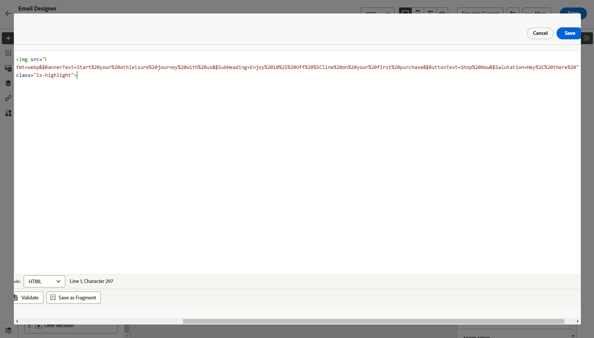

# 發行說明 {#release-notes}

>[!CONTEXTUALHELP]
>id="ajo_homepage_card1"
>title="有哪幾種新增功能？"
>abstract="**Adobe Journey Optimizer** 持續提供新功能、現有功能的增強功能並修正錯誤。 所有變更都會在每月最後一週整合於發行說明。"

[!DNL Adobe Journey Optimizer]持續提供新功能、現有功能的增強功能並修正錯誤。所有變更都會整合到每月最後一週的發行說明一起發表。[!DNL Adobe Journey Optimizer] 是原生建置在 [!DNL Adobe Experience Platform] 的並繼承其最新創新和改善項目。若要了解更多有關這些變更的資訊，請參閱 [Adobe Experience Platform 發行說明](https://experienceleague.adobe.com/docs/experience-platform/release-notes/latest.html?lang=zh-Hant){target="_blank"}。

## 2025年5月發行說明 {#25-5-rn}

**發行日期**： 2025年5月20至21日

### 全新功能 {#25-05-features}

此版本隨附的新功能詳述如下。

<table>
<thead>
<tr>
<th><strong>Adobe Experience Manager內容片段整合</strong> </th>
</tr>
</thead>
<tbody>
<tr>
<td>

透過Adobe Experience Manager與Adobe Journey Optimizer的整合，您現在可以在Journey Optimizer內容中輕鬆使用Adobe Experience Manager內容片段。 這種無縫連線讓您更輕鬆地直接在Journey Optimizer中存取和使用您的AEM內容。

此功能先前僅供有限組織(LA)使用，現已正式推出，並具備下列增強功能：

<ul>
<!--li>Create offers by directly selecting an AEM Content Fragment.</li-->
<li>使用編輯器模式，在片段簽章中定義預留位置及對應個人化值。</li>
</ul>

如需詳細資訊，請參閱<a href="../integrations/aem-fragments.md">詳細文件</a>。

推出日期： 2025年5月23日

 

</td>
</tr>
</tbody>
</table>

<table>
<thead>
<tr>
<th><strong>Adobe Experience Manager Dynamic media整合</strong> </th>
</tr>
</thead>
<tbody>
<tr>
<td>

Dynamic Media 資產現在可直接在 Journey Optimizer 中使用和存取。此整合可讓您：

<ul>
<li>透過即時更新集中管理資產。</li>
<li>立即修改您的資產設定，例如寬度和高度。</li>
<li>更新您的內容並新增個人化欄位，以自訂Dynamic Media範本。</li>
</ul>

先前以「有限可用性」發行，現在此功能可用於所有環境（一般可用性）。

如需詳細資訊，請參閱<a href="../integrations/aem-dynamic.md">詳細文件</a>。

推出日期： 2025年5月23日

 

</td>
</tr>
</tbody>
</table>

<table>
<thead>
<tr>
<th><strong>電子郵件Designer中的主題</strong> </th>
</tr>
</thead>
<tbody>
<tr>
<td>

您現在可以快速套用預先核准的主題，以確保所有電子郵件中的品牌一致性，加快您的行銷活動建立流程，並獨立產生高品質電子郵件，同時減少對設計團隊的依賴。

此功能目前為 Beta 版本，僅供 Beta 版客戶使用。若要加入 Beta 版計畫，請聯絡 Adobe 代表。

如需詳細資訊，請參閱<a href="../email/apply-email-themes.md">詳細文件</a>。

推出日期： 2025年5月14日

</td>
</tr>
</tbody>
</table>

<table>
<thead>
<tr>
<th><strong>決策 — 全新AI公式產生器</strong> </th>
</tr>
</thead>
<tbody>
<tr>
<td>

您現在可以從改善的新介面定義並結合條件，以建立特定的決定排名公式。 您可以定義自訂排名公式，這些公式會透過引導式介面組合AI模型分數、優惠方案優先順序、設定檔屬性、優惠方案屬性和內容訊號，而不是僅依賴靜態優惠方案優先順序。

如需詳細資訊，請參閱<a href="../experience-decisioning/exd-ranking-formulas.md">詳細文件</a>。

推出日期： 2025年5月14日

</td>
</tr>
</tbody>
</table>

<table>
<thead>
<tr>
<th><strong>將讀取對象排程與批次分段工作同步</strong> </th>
</tr>
</thead>
<tbody>
<tr>
<td>

您現在可以在批次細分完成後觸發每日歷程執行。 現在，所有客戶都可以在每日排程的歷程中使用此選項。 它可讓您定義最多6小時的時間範圍，以等待批次分段工作的對象資料，確保歷程以最新資料執行，如果未準備就緒則予以跳過。

先前以「有限可用性」發行，現在此功能可用於所有環境（一般可用性）。

如需詳細資訊，請參閱<a href="../building-journeys/read-audience.md#schedule">詳細文件</a>。

</td>
</tr>
</tbody>
</table>

<!--<table>
<thead>
<tr>
<th><strong>Calendar View for Campaign and Journey inventory</strong> </th>
</tr>
</thead>
<tbody>
<tr>
<td>

A calendar view is now available in the journeys and campaigns lists. It allows you to visualize all journeys and campaigns activations in the respective lists.

This change is only available for a set of organizations (Limited Availability). To gain access, contact your Adobe representative.

For more information, refer to these sections: <a href="../building-journeys/journey-ui.md">Browse & filter your journeys</a>, <a href="../campaigns/modify-stop-campaign.md">Access campaigns</a>.

</td>
</tr>
</tbody>
</table>-->

<!--<table>
<thead>
<tr>
<th><strong>Conflict & prioritization</strong> </th>
</tr>
</thead>
<tbody>
<tr>
<td>

In Journey Optimizer, managing the volume and timing of campaigns and journeys is essential to avoid overwhelming customers with too many interactions. Journey Optimizer now offers several tools for conflict management and prioritization - previously available only to limited-access (LA) organizations - that are now generally available (GA).

Previously released in Limited Availability, this capability is now available to all environments. With this General Availability release, the following enhancements have been introduced:

<ul>
<li>Expanded Support: Conflict management tools now support both Unitary Journeys and Audience Qualification Journeys, in addition to Read audience journeys.</li>
<li>Improved Troubleshooting: Two new step event fields are now available in the Query Service, enabling you to analyze why a profile was rejected from a journey or campaign.</li>
<li>Enhanced Reporting: Reports now indicate which specific rule excluded a profile from a journey or campaign, providing greater transparency and actionable insights.</li></ul>

For more information, refer to the <a href="../conflict-prioritization/gs-conflict-prioritization.md">detailed documentation</a>.

</td>
</tr>
</tbody>
</table>-->

<!--<table>
<thead>
<tr>
<th><strong>Simulate content variations</strong> </th>
</tr>
</thead>
<tbody>
<tr>
<td>

Previously available in beta, content variations simulation is now generally available (GA). It allows you to preview different variations of your content using sample input data uploaded from a CSV or JSON file or added manually. All the attributes used in your content for personalization are automatically detected by the system and can be used for your tests to create multiple variants.

Previously released in Limited Availability, this capability is now available to all environments. With this General Availability release, the feature now includes support for multilingual content and content experiments, enabling you to test variations across different languages and treatments. Additionally, it now supports contextual attributes (in addition to profile attributes), allowing for even more dynamic and situational content testing.

For more information, refer to the <a href="../test-approve/simulate-sample-input.md">detailed documentation</a>.

</td>
</tr>
</tbody>
</table>-->

<!--table>
<thead>
<tr>
<th><strong>Scale your Experimentation winner</strong> </th>
</tr>
</thead>
<tbody>
<tr>
<td>

Scale the Winner enables you to automatically or manually roll out the winning variation of an experiment to your full audience. This feature ensures that, once a top performer is identified, you can maximize its reach and effectiveness without constant manual oversight.

</td>
</tr>
</tbody>
</table-->

<table>
<thead>
<tr>
<th><strong>自訂簡訊提供者</strong> </th>
</tr>
</thead>
<tbody>
<tr>
<td>

Journey Optimizer現在可讓您在預設選項之外設定其他SMS提供者：Sinch、Infobip和Twilio。 透過自訂SMS提供者設定，您可以直接整合第三方提供者、運用動態訊息的進階裝載自訂，並管理同意偏好設定（選擇加入/選擇退出）以確保法規遵循。

如需詳細資訊，請參閱<a href="../sms/sms-configuration-custom.md">詳細文件</a>。

先前以「有限可用性」發行，現在此功能可用於所有環境（一般可用性）。
</td>
</td>
</tr>
</tbody>
</table>

<!--
<table>
<thead>
<tr>
<th><strong>Supplemental ID for event-triggered journeys</strong> </th>
</tr>
</thead>
<tbody>
<tr>
<td>

You can now trigger journeys using a profile ID along with another identifier, such as an order ID, subscription ID, or prescription ID, allowing the same profile to be in the same journey multiple times at once. This enables scenarios like managing multiple orders or subscriptions in parallel, with each instance following its own path through the journey.

This capability is only available for a set of organizations (Limited Availability). To gain access, contact your Adobe representative.

</td>
</tr>
</tbody>
</table>
-->

### 功能改進 {#25-05-improv}

以下列出此版本隨附的改進。

* **新物件支援沙箱復本**

   * **行銷活動** — 推出日期： 2025年5月15日

     使用套件匯出和匯入功能跨多個沙箱複製行銷活動時，現在也會複製下列相依性：管道設定、實驗變體和設定、決定政策和專案。 [閱讀全文](../configuration/copy-objects-to-sandbox.md)

   * **決策** — 推出日期： 2025年5月16日

     現在可以在沙箱之間複製決策物件，簡化測試和部署工作流程。 [閱讀全文](../configuration/copy-objects-to-sandbox.md#decisioning)

* **登入頁面的資料夾** — 推出日期： 2025年5月9日

  為了輕鬆管理您的登入頁面，您現在可以使用資料夾，將其更有效地組織到結構化階層中。 [閱讀全文](../landing-pages/manage-lp.md)

* **直接郵件： SFTP連線的SSH金鑰支援** — 推出日期： 2025年5月5日

  在直接郵件檔案路由設定中，除了具有密碼驗證型別的現有SFTP之外，您現在還可以將直接郵件檔案匯出至具有SSH金鑰驗證的SFTP伺服器。 [閱讀全文](../direct-mail/direct-mail-configuration.md)

* **個人化的Papers啟用** — 推出日期： 2025年5月5日

  個人化編輯器已新增新的 [膠囊狀] 按鈕。啟用時，設定檔和內容屬性都會以 [膠囊狀] 按鈕形式顯示，增強驗證碼的可讀性。[閱讀全文](../personalization/personalization-build-expressions.md#options)

  >[!AVAILABILITY]
  >
  >在接下來 30 天內，會將此功能逐步推廣到合適環境。

* Web channel **中的**&#39;重新導向至URL&#39;支援

  Journey Optimizer Web Channel現在可讓您將訪客重新導向至另一個現有URL，而不是在視覺化編輯器中編寫新的變數。 此功能可用來執行比較兩個完全不同頁面的實驗，而不只是變更頁面中的少數元素。 [閱讀全文](../web/create-web.md#web-redirect-to-url)

* 範本和片段的&#x200B;**資料夾**

  資料夾可讓您更輕鬆有效地將物件組織成結構化階層。 以前可供一組組織 (LA) 使用的資料夾，現在可供所有使用者 (GA) 管理其內容範本和片段。 請閱讀[內容範本](../content-management/access-content-templates.md#folders)和[片段](../content-management/manage-fragments.md#folders)區段的詳細資訊。

* **電子郵件範本中的點選追蹤**

  [!DNL Journey Optimizer]現已原生支援電子郵件內容中影像地圖內`<area>`個元素的點選追蹤。 這是為了確保影像地圖區域接收相同的追蹤包裝、追蹤資料，以及作為標準超連結附加的引數。 [進一步瞭解訊息追蹤](../email/message-tracking.md#manage-tracking)

<!--
* **Decisioning - Leverage Adobe Experience Platform datasets** 
  
  Journey Optimizer now allows you to leverage Adobe Experience Platform datasets in the following Decisioning objects: eligibility rules, ranking formulas, and capping rules.

* **Right rail in campaigns list**

  In the campaign list, selecting a campaign now opens a pane displaying its details.

* **Form fields in code-based experience content**

  In content templates, you can now define specific JSON or HTML fields which enable non-technical users to easily edit content in code-based experiences without the need to manipulate code.

* **Decision item attribute support for decisioning rules**
  
  You can now leverage decision item attributes to create decisioning rules.

* **Subdomains - 'Custom delegation' method**  
  In addition to the full delegation and the CNAME method, a new subdomain configuration method is now available: the Custom delegation method, which enables you to fully own controlling and maintaining all aspects of DNS that are required for delivering, rendering, and tracking messages.
  -->

